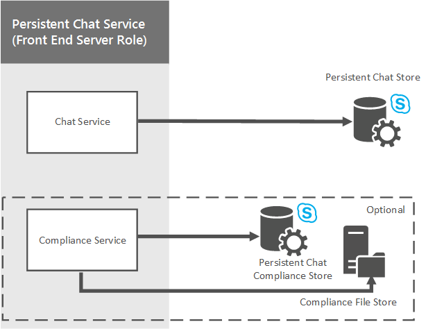

# Planificar el servidor de chat persistente en Skype Empresarial Server 2015Plan for Persistent Chat Server in Skype for Business Server 2015
 
**Resumen:** Lea este tema para obtener información sobre cómo planear el servidor de chat persistente en Skype empresarial Server 2015.**Summary:** Read this topic to learn how to plan for Persistent Chat Server in Skype for Business Server 2015.
  
El servidor de chat persistente es un rol opcional que permite que varios usuarios de su organización participen en las conversaciones del salón de chat que se mantienen a lo largo del tiempo.Persistent Chat Server is an optional role that lets multiple users in your organization participate in chat room conversations that persist over time. A pesar de que los usuarios se pueden comunicar en tiempo real durante una sesión de chat, el contenido de cada sesión (incluso el texto, los vínculos y los archivos) es persistente, por lo que los usuarios pueden ver y buscar todo el contenido de la sesión en cualquier momento.Although users can communicate in real time during a chat session, the content of each session--including text, links, and files--is persistent, which means users can view and search all content of the session at any time.
  
El servidor de chat persistente puede ayudar a mejorar la comunicación dentro de su organización mediante:Persistent Chat Server can help improve communication within your organization by:
  
- Ampliar el conocimiento de la información y la participación en toda la organizaciónBroadening information awareness and participation throughout the organization
    
- Habilitar el uso compartido eficiente de la informaciónEnabling efficient information sharing 
    
- Mejorar la comunicación entre equipos, incluso geográficamente dispersos y con funciones cruzadasImproving communication between teams, including geographically dispersed and cross-functional teams
    
- Reducir la sobrecarga de informaciónReducing information overload
    
- Respetar las normas de cumplimiento con la implementación opcional del servicio de cumplimiento del chat persistenteFollowing compliance regulations by optionally deploying the Persistent Chat Compliance service

> [!NOTE] 
> Chat persistente está disponible en Skype empresarial Server 2015, pero ya no es compatible con Skype empresarial Server 2019.Persistent chat is available in Skype for Business Server 2015 but is no longer supported in Skype for Business Server 2019. La misma funcionalidad está disponible en Teams.The same functionality is available in Teams. Para obtener más información, consulte [Introducción a la actualización de Microsoft Teams](/microsoftteams/upgrade-start-here).For more information, see [Getting started with your Microsoft Teams upgrade](/microsoftteams/upgrade-start-here). Si necesita usar una conversación persistente, puede elegir entre migrar los usuarios que tienen esta funcionalidad a teams o continuar usando Skype empresarial Server 2015.If you need to use Persistent chat, your choices are to either migrate users requiring this functionality to Teams, or to continue using Skype for Business Server 2015. 
    
## Arquitectura de alto nivel del servidor de chat persistentePersistent Chat Server high-level architecture

El siguiente diagrama muestra una vista de alto nivel de la arquitectura del servidor de chat persistente.The following diagram shows a high-level view of the Persistent Chat Server architecture. 
  

  
El chat persistente consiste de un rol de servidor front-end que brinda los servicios de chat persistente, así como también de un componente de base de datos de SQL back-end.Persistent Chat consists of a front-end server role that provides the Persistent Chat services as well as a back-end SQL database component. Los componentes tanto front-end como back-end se incluyen en un grupo de chat persistente dedicado.Both front-end and back-end components are included in a dedicated Persistent Chat pool. Cada equipo que hospede un servidor de chat persistente debe tener acceso a una topología existente de Skype empresarial Server 2015.Each computer that hosts Persistent Chat Server must have access to an existing Skype for Business Server 2015 topology. En este diagrama, hay un grupo de servidores de chat persistente (A), que depende del grupo de servidores de Skype empresarial A para enrutar mensajes.In this diagram, there is one Persistent Chat Server pool (A), which is dependent on Skype for Business Server Pool A for routing messages to it.
  
Puede implementar uno o varios grupos de servidores de chat persistentes, cada uno con un máximo de cuatro servidores de chat persistentes activos que admitan hasta 80K usuarios simultáneos.You can deploy one or more Persistent Chat Server pools, each with up to four active Persistent Chat Servers supporting up to 80K concurrent users.
  
Skype empresarial Server 2015 se comunica con el servicio de chat persistente con el protocolo de inicio de sesión (SIP) para el registro y la comunicación de chats extensibles a través del protocolo SIP (XCCOS) para el chat.Skype for Business Server 2015 communicates with the Persistent Chat service using the Session Initiation Protocol (SIP) for registration and the Extensible Chat Communication Over SIP protocol (XCCOS) for chat. 
  
## Servicios de chat persistentePersistent Chat services

El siguiente diagrama muestra los servicios de front-end del servidor de chat persistentes y cómo estos servicios se comunican con los componentes de la base de datos back-end.The following diagram shows the Persistent Chat Server front-end services, and how these services communicate with the back-end database components. Los componentes front-end incluyen los servicios de chat persistente y el servicio de cumplimiento.The front-end components include the Persistent Chat services and the Compliance service. Los componentes back-end incluyen el almacén de chat persistente y el almacén de cumplimiento del chat persistente.The back-end components include the Persistent Chat store and the Persistent Chat compliance store.
  

  
### Servicio de chatChat service

El servicio de chat, también denominado servicio de canal, es el servicio principal que se encarga del servidor de chat persistente.The Chat service, also called the Channel service, is the core service responsible for Persistent Chat Server. El servicio de chat brinda las siguientes funciones:The Chat service provides the following functions:
  
- Acepta mensajes entrantesAccepts incoming messages
    
- Registra y enumera los participantes en línea dentro de un salón de chat persistenteRegisters and lists online participants within a Persistent Chat room
    
- Retransmite mensajes a los suscriptores de otros canalesRetransmits messages to other channel subscribers
    
- Implementa la lógica para la administración del canal, las invitaciones a un salón de chat, las búsquedas y las notificaciones de nuevo contenidoImplements logic for channel management, chat room invitations, search and new content notifications
    
El servicio de chat persistente almacena el contenido del salón de chat y otros metadatos del sistema (como las reglas de autorización, etc.) y obtiene acceso a ellos por medio del almacén de chat persistente.The Persistent Chat service stores and accesses chat room content and other system metadata (authorization rules and so on) by using the Persistent Chat store. Este servicio almacena archivos que se cargan en los salones de chat en el almacén de archivos del chat persistente.The service stores files that are uploaded into chat rooms in the Persistent Chat file store.
  
### Servicio de cumplimientoCompliance service

Si la organización cuenta con normas que precisan que se archive la actividad del chat persistente, puede implementar el servicio de cumplimiento opcional del chat persistente.If your organization has regulations that require Persistent Chat activity to be archived, you can deploy the optional Persistent Chat Compliance service. El servicio de cumplimiento se encarga del archivado del contenido del chat y de los eventos (como entrar y salir de los salones) en el almacén de archivos de cumplimiento del chat persistente.The Compliance service is responsible for archiving chat content and events, such as joining and leaving rooms, to the Persistent Chat Compliance file store. El servicio de cumplimiento está instalado en cada servidor de chat persistente en un grupo de chats persistentes.The Compliance service is installed on each Persistent Chat Server in a Persistent Chat pool. 
  
### Servicios webWeb services

Los servicios Web de chat persistente se ejecutan en los servidores front-end de Skype empresarial.The Persistent Chat web services run on the Skype for Business Front End Servers. Los servicios web dependen de Internet Information Services (IIS) y se implementan como componentes web:The web services depend on Internet Information Services (IIS), and are implemented as web components:
  
- Los servicios web del chat persistente para cargar y descargar archivos se encargan de publicar archivos y de recuperarlos de los salones de chat.Persistent Chat web services for file upload and download are responsible for posting and retrieving files from chat rooms.
    
- Los servicios web del chat persistente para la administración de los salones de chat se encargan de brindar a los usuarios la capacidad de administrar los salones de chat y de crearlos.Persistent Chat web services for chat room management are responsible for providing users the ability to manage their chat rooms, and create new chat rooms.
    
## Definir los requisitos para la organizaciónDefining requirements for your organization

Si decide implementar un servidor de chat persistente, tendrá que determinar los requisitos empresariales de su organización y, a continuación, definir la topología, la infraestructura y los requisitos técnicos para satisfacer las necesidades de su empresa.If you decide to deploy Persistent Chat Server, you'll need to determine your organization's business requirements, then define the topology, infrastructure, and technical requirements to support your business needs. Para optimizar su implementación, tendrá que responder a las siguientes preguntas:To optimize your deployment, you'll need to answer the following questions:
  
- ¿Va a migrar desde una versión anterior del servidor de chat de grupo, o una versión anterior de un servidor de chat persistente o si va a implementar un servidor de chat persistente por primera vez?Are you migrating from a previous version of Group Chat Server, or a previous version of Persistent Chat Server, or are you deploying Persistent Chat Server for the first time?
    
- ¿Quién puede usar el servidor de chat persistente? Puede especificar las directivas de chat persistente a fin de determinar el acceso de usuario en el ámbito global, en el sitio o por usuario.Who can use Persistent Chat Server? You specify Persistent Chat policies to determine user access at the global, site, or user level.
    
- ¿Cuántos usuarios necesitarán disponer de acceso al servidor de chat persistente? El servidor de chat persistente es compatible con 150 000 usuarios aprovisionados (habilitados por directiva) y un máximo de 80 000 usuarios simultáneos. Un único servidor de chat persistente puede admitir 20 000 usuarios conectados y un único grupo de servidores de chat persistente puede tener hasta 4 servidores activos para un total de 80 000 usuarios conectados de forma simultánea.How many users will require access to Persistent Chat Server? Persistent Chat Server supports 150,000 provisioned users (enabled by policy), and a maximum of 80,000 concurrent users. A single Persistent Chat Server can support 20,000 connected users, and a single Persistent Chat Server pool can have up to 4 active servers for a total of 80,000 concurrently connected users.
    
- ¿Cómo desea controlar los ámbitos, los límites éticos y el acceso? Puede definir categorías para segregar estos límites y elegir quién puede estar en los salones que se crean en cada una de estas categorías.How do you want to control scopes, ethical boundaries, and access? You can define categories to segregate these boundaries, and choose who is allowed to be in rooms that are created in each of these categories.
    
- ¿Cómo desea controlar quién puede crear salones?How do you want to control who can create rooms? Es posible definir creadores para la creación de salones.You can define creators who can create rooms. Dichos creadores pueden asignar a otros miembros como directores de los salones de chat para la administración en curso de los salones.Creators can assign other members as chat room managers for ongoing management of the rooms.
    
- ¿Cómo desea crear salas?How do you want to create rooms? El servidor de chat persistente proporciona una característica basada en Internet para crear y administrar salas.Persistent Chat Server provides a web-based feature for creating and managing rooms. Esto se puede iniciar desde el cliente de Skype empresarial.This can be launched from the Skype for Business client. Puede definir una solución de cliente que implemente los procesos y los flujos de trabajo de su empresa, y configurar el servidor de chat persistente para dirigir a los usuarios a su solución personalizada.You can choose to define a customer solution that implements your business requirements and workflows, and configures Persistent Chat Server to direct users to your custom solution.
    
- ¿Qué tipo de complementos desea suministrar?What kind of add-ins do you want to provision? Los complementos mejoran la experiencia en el salón al aprovechar el panel de extensibilidad del cliente de Skype Empresarial para proporcionar un contexto relevante al salón.Add-ins enhance the in-room experience by leveraging the extensibility pane in the Skype for Business client to provide context that is relevant to the room. Puede elegir qué complementos generales podrían ser más útiles (por ejemplo, el sitio web de la compañía, los documentos de colaboración interna, etc.).You can choose what general add-ins might be most useful (for example, your company website, internal collaboration documents, and so on). Los directores del salón de chat pueden elegir uno de los complementos registrados y asociarlo a los salones, si así lo desean.Chat room managers can choose one of the registered add-ins and associate it with their rooms, if desired. 
    
- ¿Qué tipo de requisitos de alta disponibilidad y recuperación ante desastres tiene?What kind of high availability and disaster recovery requirements do you have? El servidor de chat persistente admite el reflejo de SQL Server y el clúster de SQL Server para una alta disponibilidad.Persistent Chat Server supports SQL Server mirroring and SQL Server clustering for high availability. Para la recuperación ante desastres, el servidor de chat persistente admite hasta 8 servidores (4 activos y 4 en espera) en un grupo expandido con el trasvase de registros de SQL Server.For disaster recovery, Persistent Chat Server supports up to 8 servers (4 active and 4 standby) in a stretched pool with SQL Server log shipping. 
    
- ¿Dispone de requisitos de regulación?Are there regulatory requirements? Si su empresa se encuentra en un país o una región en la que es necesario conservar los datos dentro del país, es posible que tenga que implementar varios grupos de servidores de chat persistentes, cada uno de ellos local a uno específico.If your company is in a country or region where data needs to be kept within the country, you may need to deploy multiple Persistent Chat Server pools, each local to a specific geography. Un salón, una categoría o un complemento no abarcan grupos; solo pertenece a un grupo de servidores de chat persistente.A room, category, or add-in does not span pools--it belongs to only one Persistent Chat Server pool. 
    
    > [!NOTE]
    > Tener varios grupos de servidores de chat persistentes no le da más escala (aún puede tener solo 80.000 usuarios simultáneos en todos los grupos de servidores de chat persistentes).Having multiple Persistent Chat Server pools does not give you more scale (you can still have only 80,000 concurrent users across all your Persistent Chat Server pools). El motivo principal por el que se admiten varios grupos de servidores de chat persistentes es apoyar problemas normativos.The primary reason for supporting multiple Persistent Chat Server pools is to support regulatory concerns. 
  
## Para más informaciónFor more information

Para más información sobre la instalación y la configuración del servidor de chat persistente, consulte los siguientes temas:For more information about installing and configuring Persistent Chat Server, see the following topics:
  
- Para obtener más información sobre cómo implementar el servidor de chat persistente, consulte [implementar un servidor de chat persistente en Skype empresarial server 2015](../../deploy/deploy-persistent-chat-server/deploy-persistent-chat-server.md).For details about how to deploy Persistent Chat Server, see [Deploy Persistent Chat Server in Skype for Business Server 2015](../../deploy/deploy-persistent-chat-server/deploy-persistent-chat-server.md). 
    
- Para obtener más información sobre cómo configurar las opciones de la implementación del servidor de chat persistente, consulte [administrar el servidor de chat persistente en Skype empresarial server 2015](../../manage/persistent-chat/persistent-chat.md).For details about how to configure settings on your Persistent Chat Server deployment, see [Manage Persistent Chat Server in Skype for Business Server 2015](../../manage/persistent-chat/persistent-chat.md).
    

