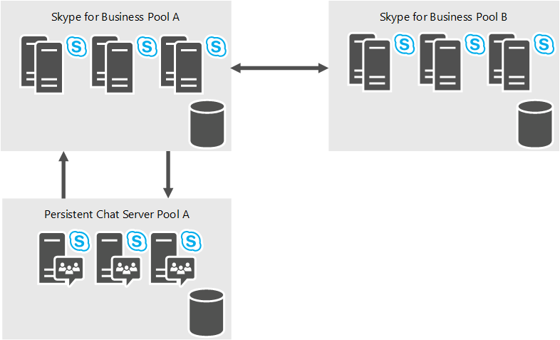

# Planificar el servidor de chat persistente en Skype Empresarial Server 2015
 
**Resumen:** Lea este tema para obtener información sobre cómo planear el servidor de chat persistente en Skype empresarial Server 2015.
  
El servidor de chat persistente es un rol opcional que permite que varios usuarios de su organización participen en las conversaciones del salón de chat que se mantienen a lo largo del tiempo. A pesar de que los usuarios se pueden comunicar en tiempo real durante una sesión de chat, el contenido de cada sesión (incluso el texto, los vínculos y los archivos) es persistente, por lo que los usuarios pueden ver y buscar todo el contenido de la sesión en cualquier momento.
  
El servidor de chat persistente puede ayudar a mejorar la comunicación dentro de su organización mediante:
  
- Ampliar el conocimiento de la información y la participación en toda la organización
    
- Habilitar el uso compartido eficiente de la información 
    
- Mejorar la comunicación entre equipos, incluso geográficamente dispersos y con funciones cruzadas
    
- Reducir la sobrecarga de información
    
- Respetar las normas de cumplimiento con la implementación opcional del servicio de cumplimiento del chat persistente

> [!NOTE] 
> Chat persistente está disponible en Skype empresarial Server 2015, pero ya no es compatible con Skype empresarial Server 2019. La misma funcionalidad está disponible en Teams. Para obtener más información, consulte [Introducción a la actualización de Microsoft Teams](/microsoftteams/upgrade-start-here). Si necesita usar una conversación persistente, puede elegir entre migrar los usuarios que tienen esta funcionalidad a teams o continuar usando Skype empresarial Server 2015. 
    
## Arquitectura de alto nivel del servidor de chat persistente

El siguiente diagrama muestra una vista de alto nivel de la arquitectura del servidor de chat persistente. 
  

  
El chat persistente consiste de un rol de servidor front-end que brinda los servicios de chat persistente, así como también de un componente de base de datos de SQL back-end. Los componentes tanto front-end como back-end se incluyen en un grupo de chat persistente dedicado. Cada equipo que hospede un servidor de chat persistente debe tener acceso a una topología existente de Skype empresarial Server 2015. En este diagrama, hay un grupo de servidores de chat persistente (A), que depende del grupo de servidores de Skype empresarial A para enrutar mensajes.
  
Puede implementar uno o varios grupos de servidores de chat persistentes, cada uno con un máximo de cuatro servidores de chat persistentes activos que admitan hasta 80K usuarios simultáneos.
  
Skype empresarial Server 2015 se comunica con el servicio de chat persistente con el protocolo de inicio de sesión (SIP) para el registro y la comunicación de chats extensibles a través del protocolo SIP (XCCOS) para el chat. 
  
## Servicios de chat persistente

El siguiente diagrama muestra los servicios de front-end del servidor de chat persistentes y cómo estos servicios se comunican con los componentes de la base de datos back-end. Los componentes front-end incluyen los servicios de chat persistente y el servicio de cumplimiento. Los componentes back-end incluyen el almacén de chat persistente y el almacén de cumplimiento del chat persistente.
  

  
### Servicio de chat

El servicio de chat, también denominado servicio de canal, es el servicio principal que se encarga del servidor de chat persistente. El servicio de chat brinda las siguientes funciones:
  
- Acepta mensajes entrantes
    
- Registra y enumera los participantes en línea dentro de un salón de chat persistente
    
- Retransmite mensajes a los suscriptores de otros canales
    
- Implementa la lógica para la administración del canal, las invitaciones a un salón de chat, las búsquedas y las notificaciones de nuevo contenido
    
El servicio de chat persistente almacena el contenido del salón de chat y otros metadatos del sistema (como las reglas de autorización, etc.) y obtiene acceso a ellos por medio del almacén de chat persistente. Este servicio almacena archivos que se cargan en los salones de chat en el almacén de archivos del chat persistente.
  
### Servicio de cumplimiento

Si la organización cuenta con normas que precisan que se archive la actividad del chat persistente, puede implementar el servicio de cumplimiento opcional del chat persistente. El servicio de cumplimiento se encarga del archivado del contenido del chat y de los eventos (como entrar y salir de los salones) en el almacén de archivos de cumplimiento del chat persistente. El servicio de cumplimiento está instalado en cada servidor de chat persistente en un grupo de chats persistentes. 
  
### Servicios web

Los servicios Web de chat persistente se ejecutan en los servidores front-end de Skype empresarial. Los servicios web dependen de Internet Information Services (IIS) y se implementan como componentes web:
  
- Los servicios web del chat persistente para cargar y descargar archivos se encargan de publicar archivos y de recuperarlos de los salones de chat.
    
- Los servicios web del chat persistente para la administración de los salones de chat se encargan de brindar a los usuarios la capacidad de administrar los salones de chat y de crearlos.
    
## Definir los requisitos para la organización

Si decide implementar un servidor de chat persistente, tendrá que determinar los requisitos empresariales de su organización y, a continuación, definir la topología, la infraestructura y los requisitos técnicos para satisfacer las necesidades de su empresa. Para optimizar su implementación, tendrá que responder a las siguientes preguntas:
  
- ¿Va a migrar desde una versión anterior del servidor de chat de grupo, o una versión anterior de un servidor de chat persistente o si va a implementar un servidor de chat persistente por primera vez?
    
- ¿Quién puede usar el servidor de chat persistente? Puede especificar las directivas de chat persistente a fin de determinar el acceso de usuario en el ámbito global, en el sitio o por usuario.
    
- ¿Cuántos usuarios necesitarán disponer de acceso al servidor de chat persistente? El servidor de chat persistente es compatible con 150 000 usuarios aprovisionados (habilitados por directiva) y un máximo de 80 000 usuarios simultáneos. Un único servidor de chat persistente puede admitir 20 000 usuarios conectados y un único grupo de servidores de chat persistente puede tener hasta 4 servidores activos para un total de 80 000 usuarios conectados de forma simultánea.
    
- ¿Cómo desea controlar los ámbitos, los límites éticos y el acceso? Puede definir categorías para segregar estos límites y elegir quién puede estar en los salones que se crean en cada una de estas categorías.
    
- ¿Cómo desea controlar quién puede crear salones? Es posible definir creadores para la creación de salones. Dichos creadores pueden asignar a otros miembros como directores de los salones de chat para la administración en curso de los salones.
    
- ¿Cómo desea crear salas? El servidor de chat persistente proporciona una característica basada en Internet para crear y administrar salas. Esto se puede iniciar desde el cliente de Skype empresarial. Puede definir una solución de cliente que implemente los procesos y los flujos de trabajo de su empresa, y configurar el servidor de chat persistente para dirigir a los usuarios a su solución personalizada.
    
- ¿Qué tipo de complementos desea suministrar? Los complementos mejoran la experiencia en el salón al aprovechar el panel de extensibilidad del cliente de Skype Empresarial para proporcionar un contexto relevante al salón. Puede elegir qué complementos generales podrían ser más útiles (por ejemplo, el sitio web de la compañía, los documentos de colaboración interna, etc.). Los directores del salón de chat pueden elegir uno de los complementos registrados y asociarlo a los salones, si así lo desean. 
    
- ¿Qué tipo de requisitos de alta disponibilidad y recuperación ante desastres tiene? El servidor de chat persistente admite el reflejo de SQL Server y el clúster de SQL Server para una alta disponibilidad. Para la recuperación ante desastres, el servidor de chat persistente admite hasta 8 servidores (4 activos y 4 en espera) en un grupo expandido con el trasvase de registros de SQL Server. 
    
- ¿Dispone de requisitos de regulación? Si su empresa se encuentra en un país o una región en la que es necesario conservar los datos dentro del país, es posible que tenga que implementar varios grupos de servidores de chat persistentes, cada uno de ellos local a uno específico. Un salón, una categoría o un complemento no abarcan grupos; solo pertenece a un grupo de servidores de chat persistente. 
    
    > [!NOTE]
    > Tener varios grupos de servidores de chat persistentes no le da más escala (aún puede tener solo 80.000 usuarios simultáneos en todos los grupos de servidores de chat persistentes). El motivo principal por el que se admiten varios grupos de servidores de chat persistentes es apoyar problemas normativos. 
  
## Para más información

Para más información sobre la instalación y la configuración del servidor de chat persistente, consulte los siguientes temas:
  
- Para obtener más información sobre cómo implementar el servidor de chat persistente, consulte [implementar un servidor de chat persistente en Skype empresarial server 2015](../../deploy/deploy-persistent-chat-server/deploy-persistent-chat-server.md). 
    
- Para obtener más información sobre cómo configurar las opciones de la implementación del servidor de chat persistente, consulte [administrar el servidor de chat persistente en Skype empresarial server 2015](../../manage/persistent-chat/persistent-chat.md).
    

