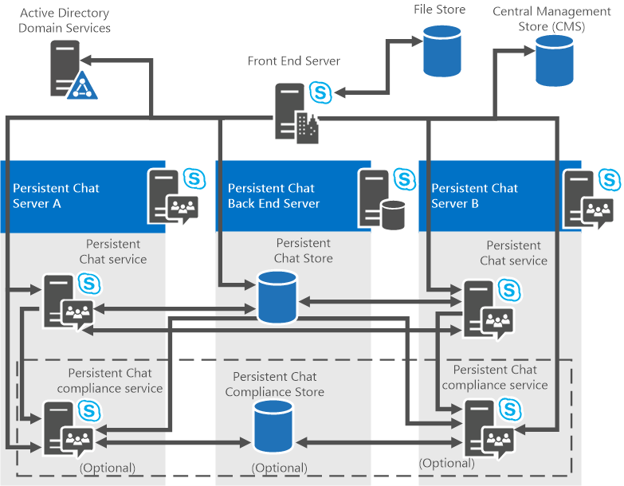

# Planificar una topología de servidores de chat persistente
 
**Resumen:** Lea este tema para obtener más información acerca de los componentes de servidor de Chat persistente y topologías de Skype para Business Server 2015.
  
Servidor de Chat persistente es compatible con las configuraciones de un solo servidor y varios servidores. Puede instalar a servidor de Chat persistente en puede ser un Skype para Business Server 2015 Enterprise Edition o servidor Standard Edition. 

> [!NOTE] 
> Chat persistente está disponible en Skype para Business Server 2015, pero ya no se admite en Skype para Business Server 2019. La misma funcionalidad está disponible en los equipos. Para obtener más información, vea [viaje de Skype para la empresa a los equipos de Microsoft](/microsoftteams/journey-skypeforbusiness-teams). Si necesita usar chat en grupo, las opciones son para migrar los usuarios que requieren esta funcionalidad a los equipos, o para continuar usando Skype para Business Server 2015. 
  
## Componentes de servidor de Chat persistentes

El servidor de chat persistente incluye los componentes siguientes:
  
- Uno o más equipos que ejecuten servidor de Chat persistente y proporcionen los siguientes servicios:
    
  - Servicio de Chat persistente
    
  - Servicio de cumplimiento, que se activa si el cumplimiento está habilitado
    
- Uno o varios servidores (más de uno si se usa la creación de reflejos) que ejecuta la base de datos de back-end de SQL Server para hospedar la base de datos de contenido de Chat en grupo donde se almacenan el contenido del salón de chat, salones y categorías.
    
    > [!NOTE]
    > La base de datos back-end almacena datos de historial de chat, incluida información acerca de las categorías y salones de Chat persistente que se crean. 
  
- Si está habilitado el cumplimiento, que ejecuta la base de datos de back-end de SQL Server para hospedar la base de datos de cumplimiento de Chat persistente, donde eventos de cumplimiento y chat de contenido con el fin de cumplimiento se almacenan uno o varios servidores (más de uno si se usa la creación de reflejo).
    
Para obtener información detallada acerca de los requisitos de hardware y software para el servidor de Chat persistente, vea [requisitos de servidor para Skype para Business Server 2015](../../plan-your-deployment/requirements-for-your-environment/server-requirements.md) y [requisitos de Hardware y software para el servidor de Chat persistente en Skype para Business Server 2015](hardware-and-software-requirements.md). 
  
## Topologías de servidor de Chat persistentes

Puede implementar servidor de Chat persistente en los grupos de servidores de un único servidor o varios servidores y con la topología de un solo grupo de servidores o de varios. Servidor de Chat persistente admite las siguientes topologías:
  
-  Servidor Standard Edition con el servidor de chat persistente combinados en el servidor front-end
    
-  Servidor Standard Edition con el servidor de Chat persistente en un servidor independiente
    
-  Servidor Enterprise Edition con un único servidor de Chat persistente en un servidor independiente
    
-  Servidor Enterprise Edition con más de un servidor de Chat persistente en servidores independientes
    
Aunque puede implementar servidor de Chat persistente en un servidor Standard Edition, tenga en cuenta que se verá afectados el rendimiento y la escalabilidad y alta disponibilidad no es una opción. Por lo tanto, se recomienda implementar Chat persistente en un servidor Standard Edition principalmente para prueba de concepto y evaluación. 
  
Skype para Business Server 2015 admite una variedad de escenarios de combinación, lo que proporciona la flexibilidad necesaria para guardar los costos de hardware mediante la ejecución de varios componentes en un servidor (si tiene una organización pequeña), o para ejecutar los componentes individuales en servidores diferentes ( Si dispone de una organización más grande que las necesidades de escalabilidad y rendimiento). Necesita considerar los factores de escalabilidad antes de decidir si los componentes se van a combinar. Escenarios de combinación difieren de Skype para servidores Business Server 2015 Enterprise Edition y Standard Edition. 
  
Los siguientes escenarios describen las topologías en más detalle, incluso los escenarios de combinación y las opciones para los servidores de base de datos back-end. Para obtener información detallada sobre la combinación de todos los roles de servidor y las bases de datos, vea [Conceptos básicos de la topología de Skype para Business Server 2015](../../plan-your-deployment/topology-basics/topology-basics.md).
  
### Servidor Standard Edition con el servidor de chat persistente combinados en el servidor front-end

Con Standard Edition, puede combinar el chat persistente en el servidor front-end. Esta es la configuración más básica y más sencilla. Asegúrese de que el servidor de Front-End existente tiene suficiente capacidad en términos de recursos físicos: CPU, memoria, espacio en disco y así sucesivamente.
  
Además, se pueden combinar el servidor back-end de servidor de Chat persistente y la base de datos de cumplimiento de Chat persistente (si se habilita) en el servidor back-end de SQL Server Express local. También, puede optar por usar un SQL Server independiente con una instancia dedicada. 
  
> [!IMPORTANT]
> No se puede agregar servidores adicionales a un grupo de servidores de Chat persistente si el primer servidor de Chat persistente se combina con una edición Standard servidor Front-End. Se recomienda que instale al primer servidor como una instancia independiente para que pueda agregar más servidores más adelante, si es necesario. 
  
### Servidor Standard Edition con el servidor de chat persistente instalados en un servidor independiente

Con Standard Edition, puedes instalar el servidor de chat persistente como una instancia independiente y agregar más servidores luego, si es necesario.   
  
Puede combinar el servidor back-end de servidor de Chat persistente y la base de datos de cumplimiento de Chat persistente (si se habilita) en el servidor back-end de SQL Server Express local. También, puede optar por usar un SQL Server independiente con una instancia dedicada. 
  
### Servidor Enterprise Edition con un único servidor de chat persistente

Con Enterprise Edition, debe instalar al servidor de Chat persistente en un equipo independiente. Es decir, no se puede combinar el servidor de Chat persistente en Enterprise Edition Front-End Server. Esta implementación requiere un servidor independiente que ejecuta el servidor de Chat persistente y el servicio de cumplimiento (si está habilitado).
  
Sin embargo, se puede, combinar la base de datos de SQL Server para el servidor de Chat persistente en la base de datos back-end de un grupo de servidores Front-End de Enterprise Edition.
  
> [!NOTE]
> Si planea utilizar Grupos de disponibilidad AlwaysOn de SQL para HA DR, tenga en cuenta que no es compatible con las bases de datos del servidor de chat persistente. 
  
Si instala la base de datos de Chat persistente con la base de datos back-end, puede utilizar una sola instancia de SQL Server para cualquiera o todas las bases de datos, o puede usar una instancia independiente de SQL Server para cada base de datos.
  
> [!IMPORTANT]
> El servidor que hospeda la base de datos de Chat persistente puede hospedar otras bases de datos. Sin embargo, cuando se considere la posibilidad de combinar la base de datos de Chat persistente con otras bases de datos, tenga en cuenta que si va a almacenar los mensajes de más de unos pocos usuarios, el espacio en disco necesario por la base de datos de Chat persistente puede hacerse muy grande. Por este motivo, no se recomienda combinar la base de datos de Chat persistente con la base de datos back-end. 
  
La siguiente ilustración muestra todos los componentes de una topología de un solo servidor de Chat persistente con cumplimiento habilitado (opcional).
  
**Topología de un único servidor**

  
### Servidor Enterprise Edition con varios servidores de chat persistente

Con Enterprise Edition, puede implementar una topología de varios servidores de mayor capacidad y confiabilidad. Una topología de varios servidores es el mismo que la topología de servidor único, excepto en que varios servidores hospedan el servidor de Chat persistente y se pueden escalar superior. La topología de varios servidores puede incluir como máximo cuatro equipos activos que ejecuta el servidor de Chat persistente (configuraciones de recuperación ante desastres y disponibilidad alta permitirá hasta ocho, pero puede ser sólo cuatro activo y el resto de cuatro o en espera). Cada servidor puede admitir hasta 20.000 usuarios simultáneos, para un total de 80.000 usuarios simultáneos conectado a un grupo de servidores de Chat persistente con servidores de 4. Varios equipos que ejecutan el servidor de Chat persistente deben residir en el mismo dominio de los servicios de dominio de Active Directory como Skype para Business Server y el servicio de cumplimiento.
  
En la siguiente ilustración muestra todos los componentes de una topología de varios servidores con varios equipos que ejecutan servidor de Chat persistente, el servicio opcional de cumplimiento y una base de datos de cumplimiento independiente.
  
**Topología de varios servidores**

  
Las topologías de varios servidores permiten agrupar las funciones de servidor. En un grupo de servidores, los servicios de Chat persistente comunican y compartan datos. Por ejemplo, el historial de chat que se registró originalmente en un servicio de Chat persistente está disponible desde cualquier servicio de Chat persistente en el sistema. Puede tener acceso a un archivo que se carga a través de un servicio de Chat persistente por cualquier servicio de Chat persistente. Los usuarios pueden conectarse a diferentes Persistent Chat Server servidores Front-End y pueden comunicarse entre sí. El puerto predeterminado TCP 8011 conecta un servidor a un grupo de servidores y se usa en los servicios de Chat persistente para comunicarse entre ellos mismos o para fines administrativos.
  
Por ejemplo, en una implementación de servidor de Chat persistente de cuatro servidores, donde 80.000 usuarios pueden ser simultáneamente ha iniciado sesión Chat persistente, la carga se distribuye uniformemente a 20.000 usuarios por servidor. Si un servidor deja de estar disponible, los usuarios que están conectados a ese servidor perderá su acceso al servidor de Chat persistente. Los usuarios desconectados se transferirán automáticamente a los servidores restantes hasta que se restaure el servidor que no se encuentra disponible. 
  

