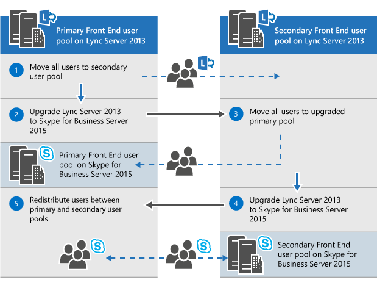
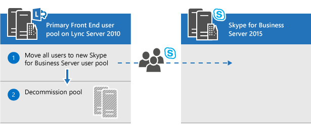
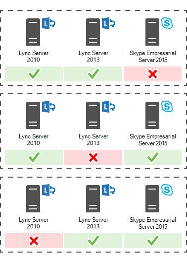

# Planear la actualización a Skype Empresarial Server 2015Plan to upgrade to Skype for Business Server 2015
 
Summary: Learn about the things you should consider when you plan an upgrade to Skype for Business Server 2015.Summary: Learn about the things you should consider when you plan an upgrade to Skype for Business Server 2015. Descargue una versión de prueba gratuita de Skype Empresarial Server 2015 desde el Centro de evaluación de Microsoft en: [https://www.microsoft.com/evalcenter/evaluate-skype-for-business-server](https://www.microsoft.com/evalcenter/evaluate-skype-for-business-server) .Download a free trial of Skype for Business Server 2015 from the Microsoft Evaluation center at: [https://www.microsoft.com/evalcenter/evaluate-skype-for-business-server](https://www.microsoft.com/evalcenter/evaluate-skype-for-business-server).
  
Como parte del plan para actualizar a Skype Empresarial Server 2015, use este tema para comprender las rutas de actualización recomendadas a Skype Empresarial Server 2015, cómo funciona la actualización de In-Place, cuáles son los escenarios de coexistencia admitidos y cómo es el proceso de actualización.As part of your plan to upgrade to Skype for Business Server 2015, use this topic to understand the recommended upgrade paths to Skype for Business Server 2015, how the In-Place Upgrade works, what the supported coexistence scenarios are, and what the upgrade process looks like.

> [!NOTE]
> Las actualizaciones locales estaban disponibles en Skype Empresarial Server 2015, pero ya no se admiten en Skype Empresarial Server 2019.In-place upgrades were available in Skype for Business Server 2015 but are no longer supported in Skype for Business Server 2019. Se admite la coexistencia en paralelo, vea [Migración a Skype Empresarial Server 2019](../../SfBServer2019/migration/migration-to-skype-for-business-server-2019.md) para obtener más información.Side by side coexistance is supported, see [Migration to Skype for Business Server 2019](../../SfBServer2019/migration/migration-to-skype-for-business-server-2019.md) for more information.
  
## Rutas de actualización recomendadas a Skype Empresarial Server 2015Recommended upgrade paths to Skype for Business Server 2015

 Para actualizar de Lync Server 2013, Lync Server 2010 u Office Communications Server 2007 R2 a Skype Empresarial Server 2015, use las siguientes rutas de actualización:To upgrade from Lync Server 2013, Lync Server 2010, or Office Communications Server 2007 R2 to Skype for Business Server 2015, use the following upgrade paths:
  
> [!CAUTION]
> In-Place upgrade mueve automáticamente los directorios de conferencia de Lync Server 2013 a Skype Empresarial Server 2015.In-Place Upgrade automatically moves conference directories from Lync Server 2013 to Skype for Business Server 2015. Sin embargo, si planea mover manualmente directorios de conferencia, es muy importante usar el Shell de administración de Skype Empresarial Server 2015.However, if you plan to manually move conference directories it is very important to use the Skype for Business Server 2015 Management Shell. Si intenta usar el Shell de administración de Lync Server 2013 para mover directorios de conferencia de Lync Server 2013 a Skype Empresarial Server 2015, puede producirse la pérdida de datos.If you try to use the Lync Server 2013 Management Shell to move conference directories from Lync Server 2013 to Skype for Business Server 2015 then data loss can occur. En general, siempre que trabaje con Skype Empresarial Server 2015 en cualquier capacidad, debe usar el conjunto de herramientas de Skype Empresarial Server 2015.In general, whenever you are working with Skype for Business Server 2015 in any capacity you should use the Skype for Business Server 2015 tool set.  
  
|**Versión****Version**|**Recomendaciones****Recommendations**|
|:-----|:-----|
|Lync Server 2013Lync Server 2013    | Para actualizar, use el Generador de topologías de Skype Empresarial Server y la nueva característica de actualización In-Place en cada uno de los servidores asociados al grupo.To upgrade, use the Skype for Business Server Topology Builder and the new In-Place Upgrade feature on each of the servers associated with the pool. vea [Plan to upgrade from Lync Server 2013 to Skype for Business Server 2015](upgrade.md#BKMK_PlanUpgradeFromLync2013) and Upgrade to Skype for Business Server [2015](../deploy/upgrade-to-skype-for-business-server.md) for detailed steps.see [Plan to upgrade from Lync Server 2013 to Skype for Business Server 2015](upgrade.md#BKMK_PlanUpgradeFromLync2013) and [Upgrade to Skype for Business Server 2015](../deploy/upgrade-to-skype-for-business-server.md) for detailed steps.   |
|Lync Server 2010 + Lync Server 2013 (modo dual)Lync Server 2010 + Lync Server 2013 (dual-mode)    |En primer lugar, actualice a Lync Server 2013 y, a continuación, actualice a Skype Empresarial Server 2015 mediante la nueva característica In-Place actualización.First, upgrade to Lync Server 2013, and then upgrade to Skype for Business Server 2015 by using the new In-Place Upgrade feature. Sin embargo, si la topología es la principal de Lync Server 2010, también puede revertir los componentes de Lync Server 2013 a Lync Server 2010 y, a continuación, actualizar directamente a Skype Empresarial Server 2015.However, if your topology is primary Lync Server 2010 you can also roll back the Lync Server 2013 components to Lync Server 2010 and then upgrade directly to Skype for Business Server 2015. En este caso, no podría aprovechar la actualización de In-Place y usaría la coexistencia directa entre Lync Server 2010 y Skype Empresarial Server 2015.In this case you would not be able to take advantage of In-Place Upgrade and would use straight co-existence between Lync Server 2010 and Skype for Business Server 2015. No se admite la existencia tri, pero se admite la coexistencia.Tri-existence is not supported but co-existence is supported.    |
|Lync Server 2010Lync Server 2010    |Traiga un nuevo grupo de Skype Empresarial Server 2015 y, a continuación, migre usuarios a este nuevo grupo.Bring up a new Skype for Business Server 2015 pool and then migrate users to this new pool. A continuación, puede retirar el antiguo grupo de servidores de Lync Server 2010.You can then decommission the old Lync Server 2010 pool. La actualización de Lync Server 2010 a Skype Empresarial Server 2015 es similar a la actualización de Lync Server 2010 a Lync Server 2013.Upgrading from Lync Server 2010 to Skype for Business Server 2015 is similar to upgrading from Lync Server 2010 to Lync Server 2013. Consulte [Migración de Lync Server 2010 a Lync Server 2013](/previous-versions/office/lync-server-2013/migration-from-lync-server-2010-to-lync-server-2013).See [Migration from Lync Server 2010 to Lync Server 2013](/previous-versions/office/lync-server-2013/migration-from-lync-server-2010-to-lync-server-2013).    |
|Office Communications Server 2007 R2Office Communications Server 2007 R2    | Elija una de las dos opciones:Pick one of two options:    Configurar un nuevo entorno de Skype Empresarial Server 2015.Set up a new Skype for Business Server 2015 environment.    O bien, si el hardware y el software cumplen los requisitos de Skype Empresarial Server 2015, actualice a Lync Server 2013 y, a continuación, actualice a Skype Empresarial Server 2015 mediante la nueva característica de actualización de In-Place.Or if your hardware and software meet the requirements for Skype for Business Server 2015, upgrade to Lync Server 2013, and then upgrade to Skype for Business Server 2015 by using the new In-Place Upgrade feature. Para obtener más información, vea Requisitos del servidor para [Skype Empresarial Server 2015](requirements-for-your-environment/server-requirements.md) y Migración de [Office Communications Server 2007 R2 a Lync Server 2013](/previous-versions/office/lync-server-2013/migration-from-office-communications-server-2007-r2-to-lync-server-2013).For more information, see [Server requirements for Skype for Business Server 2015](requirements-for-your-environment/server-requirements.md) and [Migration from Office Communications Server 2007 R2 to Lync Server 2013](/previous-versions/office/lync-server-2013/migration-from-office-communications-server-2007-r2-to-lync-server-2013).    |
   
> [!NOTE]
> SQL Server 2014 se admite en Skype Empresarial Server 2015, pero no se admite en Lync Server 2013.SQL Server 2014 is supported in Skype for Business Server 2015 but is not supported in Lync Server 2013. Si desea actualizar de SQL Server 2012 a SQL Server 2014, el grupo primero debe actualizarse a Skype Empresarial Server 2015 mediante el método upgrade de In-Place, tal como se describe en este documento.If you want to upgrade from SQL Server 2012 to SQL Server 2014 then the pool must first be upgraded to Skype for Business Server 2015 using the In-Place Upgrade method as described in this document. A continuación, puede actualizar de SQL Server 2012 a SQL Server 2014, vea [Upgrade to SQL Server 2014](/sql/database-engine/install-windows/upgrade-sql-server?viewFallbackFrom=sql-server-2014).You can then upgrade from SQL Server 2012 to SQL Server 2014, see [Upgrade to SQL Server 2014](/sql/database-engine/install-windows/upgrade-sql-server?viewFallbackFrom=sql-server-2014). Para obtener más información sobre los requisitos de la base de datos, vea [Requisitos del servidor para Skype Empresarial Server 2015](requirements-for-your-environment/server-requirements.md).To learn more about database requirements, see [Server requirements for Skype for Business Server 2015](requirements-for-your-environment/server-requirements.md). 
  
## Planear la actualización de Lync Server 2013 a Skype Empresarial Server 2015Plan to upgrade from Lync Server 2013 to Skype for Business Server 2015

Puede actualizar sistemas de Lync Server 2013 a Skype Empresarial Server 2015 con la nueva característica In-Place actualización.You can upgrade Lync Server 2013 systems to Skype for Business Server 2015 using the new In-Place Upgrade feature. La actualización local proporciona una solución de un solo clic que realiza una copia de seguridad de certificados, desinstala componentes de servidor, actualiza bases de datos locales e instala los roles de Skype Empresarial Server 2015.In-place upgrade provides a one-click solution that backs up certificates, uninstalls server components, upgrades local databases, and installs the Skype for Business Server 2015 roles. La actualización local busca conservar las inversiones de hardware y servidor existentes, lo que reduce el costo global para implementar Skype Empresarial Server 2015.In-place upgrade seeks to preserve existing hardware and server investments, reducing the overall cost to deploy Skype for Business Server 2015.
  
> [!NOTE]
> In-Place upgrade le permite usar el mismo hardware al actualizar a Skype Empresarial Server.In-Place Upgrade allows you to use the same hardware when upgrading to Skype for Business Server. Sin embargo, la reusación del mismo hardware no se traduce en la misma capacidad de rendimiento.However, reusing the same hardware does not translate into the same performance capacity. No debe esperar que las cargas de rendimiento de Lync Server 2013 y Skype Empresarial Server 2015 sean idénticas.You should not expect the performance loads for Lync Server 2013 and Skype for Business Server 2015 to be identical. 
  
> [!NOTE]
> In-Place actualización no admite alta disponibilidad ni recuperación ante desastres para Skype Empresarial Server.In-Place upgrade does not support high availability or disaster recovery for Skype for Business Server. 
  
La actualización local implica desconectar el grupo de Lync Server 2013 y actualizarlo a un grupo de Skype Empresarial Server 2015.In-place upgrade involves taking the Lync Server 2013 pool offline and upgrading it to a Skype for Business Server 2015 pool. 
  
### Crear un plan In-Place actualizaciónCreate an In-Place Upgrade plan

Haga un plan que incluya:Make a plan that includes:
  
1. Una comprensión de la topología actual.An understanding of your current topology.
    
    > [!NOTE]
    > Asegúrese de desinstalar la herramienta de administración de LRS para Lync Server 2013 antes de ejecutar In-Place actualización.Be sure to uninstall LRS Admin tool for Lync Server 2013 before running In-Place Upgrade. La herramienta de administración de LRS para Lync Server 2013 no puede coexistir con Skype Empresarial Server 2015.The LRS Admin Tool for Lync Server 2013 cannot coexist with Skype for Business Server 2015. Después de ejecutar In-Place actualizar instale la nueva herramienta de administración de LRS.After running In-Place Upgrade install the new LRS Admin tool. Vea [Microsoft Lync Room System Administrative Web Portal for Skype for Business Server 2015](https://go.microsoft.com/fwlink/?LinkID=544807) para obtener más información.See [Microsoft Lync Room System Administrative Web Portal for Skype for Business Server 2015](https://go.microsoft.com/fwlink/?LinkID=544807) for more details.
  
2. El grupo de servidores principal para la actualización.The primary pool for the upgrade.
    
3. Tanto si va a actualizar las bases de datos de archivado y supervisión como si va a crear otras nuevas.Whether you'll upgrade the Archiving and Monitoring databases or create new ones.
    
4. El In-Place upgrade que usará: Sin conexión o Mover usuarios.The In-Place Upgrade method you'll use: Offline or Move Users. Como parte de Mover usuarios, también tendrá que migrar los directorios de conferencia global asociados con el grupo de servidores principal.As part of Move Users you also will need to migrate the global conference directories associated with the primary pool. 
    
5. Un plan de comunicación para usuarios afectados.A communication plan for impacted users.
    
6. Un plan de copia de seguridad en caso de que se produce un error en las actualizaciones.A backup plan in case the upgrades fails.
    
Los usuarios que se encuentran en el grupo de servidores principal mientras se actualiza no podrán usar los servicios hasta que se complete la actualización.Any users that are in the primary pool while it's being upgraded won't be able to use the services until the upgrade is complete. Si tiene un grupo secundario de trabajo, puede evitar afectar a los usuarios al moverlos al grupo de servidores secundario antes de la actualización.If you have a working secondary pool, you can avoid impacting users by moving them to the secondary pool before the upgrade. Después de la actualización, vuelva a mover a los usuarios al grupo de servidores principal.After the upgrade, move the users back to the primary pool.
  
### Métodos de actualización localIn-place upgrade methods

Hay dos escenarios para la actualización In-Place:There are two scenarios for In-Place Upgrade: 
  
- El método Move User, que no requiere tiempo de inactividad para los usuarios.The Move User method, which requires no downtime for users. 
    
- El método Offline, que requiere tiempo de inactividad.The Offline method, which requires downtime.
    
Se recomienda programar una actualización del método sin conexión durante una ventana de mantenimiento y se notifica a los usuarios del tiempo de inactividad.We recommend that an Offline method upgrade be scheduled during a maintenance window and users are notified of the downtime.
  
> [!NOTE]
> Al actualizar un grupo de servidores emparejado en Lync Server 2013 y desea actualizar ambos grupos a Skype Empresarial Server 2015.When upgrading a paired pool on Lync Server 2013 and you want to upgrade both pools to Skype for Business Server 2015. Asegúrese de actualizar el segundo grupo inmediatamente después de actualizar el primer grupo.Make sure to upgrade the second pool immediately after upgrading the first pool. Cuando un grupo de servidores ejecuta Lync Server 2013 y el segundo grupo ejecuta Skype Empresarial Server 2015, se minimizan las opciones de recuperación ante desastres.When one pool is running Lync Server 2013 and the second pool is running Skype for Business Server 2015 then disaster recovery options are minimized. Por ejemplo, si un grupo de servidores ejecuta 2013 y el segundo es 2015 y hay un desastre, podría experimentar pérdida de datos porque la conmutación por error del grupo no se admite en modo desastre cuando los grupos emparejados no son la misma versión.For example, if one pool is running 2013 and the second is 2015 and there is a disaster then you could experience data loss because pool failover is not supported in disaster mode when paired pools are not the same version. 
  
#### Método sin conexión de actualización localIn-place upgrade Offline method

Use este método si no desea mover usuarios entre grupos de usuarios.Use this method if you don't want to move users between user pools. Durante la actualización, los usuarios no podrán usar los servicios de Lync o Skype Empresarial.During the upgrade, users will not be able to use Lync or Skype for Business services. 
  
En el siguiente diagrama se muestra una introducción a este proceso.The following diagram shows an overview of this process.
  

  
> [!NOTE]
> Si ha emparejado grupos de servidores, no los desaparre antes de la actualización.If you have paired pools, do not unpair them before the upgrade. 
  
Una vez que empiece a actualizar un grupo de servidores, debe completar la actualización de todo el grupo.Once you start to upgrade a server pool, you must complete the upgrade of the entire pool. Skype Empresarial Server no admite tener solo una parte del grupo actualizado.Skype for Business Server doesn't support having only a portion of the pool upgraded. 
  
#### Método Move Users (sin tiempo de inactividad del usuario)Move Users method (no user downtime)

Para usar este método, se mueven usuarios a otro grupo antes de iniciar la actualización.To use this method, you move users to another pool before you start the upgrade. Durante la actualización, los usuarios pueden usar los servicios de Lync.During the upgrade, users can use Lync services. Una vez que se han movido al grupo actualizado, pueden usar Skype Empresarial.After they're moved to the upgraded pool, they can use Skype for Business. En el siguiente diagrama se muestra una introducción a este proceso.The following diagram shows an overview of this process.
  
> [!IMPORTANT]
> Como parte de Mover usuarios, también tendrá que migrar los directorios de conferencia global asociados con el grupo de servidores principal.As part of Move Users you also will need to migrate the global conference directories associated with the primary pool. Las conferencias de acceso telefónico local RTC seguirán resolviendo ConferenceID en el grupo que se va a actualizar, en lugar del grupo emparejado.PSTN dial-in conferencing will still resolve ConferenceID to the pool being upgraded, instead of the paired pool. Por lo tanto, debe mover directorios de conferencia, si todavía desea que las conferencias RTC programadas en el grupo sean accesibles durante la actualización.So you need to move Conference Directories, if you still want PSTN conferences scheduled in the pool to be accessible during upgrade. 
  

  
#### Mover usuarios para la actualización de hardwareMove users for hardware upgrade

 Si el hardware no cumple los requisitos de servidor para [Skype Empresarial Server 2015,](requirements-for-your-environment/server-requirements.md)configure un nuevo entorno de Skype Empresarial Server 2015 y mueva usuarios allí.If your hardware doesn't meet the [Server requirements for Skype for Business Server 2015](requirements-for-your-environment/server-requirements.md), set up a new Skype for Business Server 2015 environment, and move users there. En el siguiente diagrama se muestra una introducción a este proceso para la actualización desde Lync Server 2010.The following diagram shows an overview of this process for upgrade from Lync Server 2010. 
  

  
### Proceso de actualización localIn-place upgrade process

 Actualice de Lync Server 2013 a Skype Empresarial Server 2015 con los pasos siguientes:Upgrade from Lync Server 2013 to Skype for Business Server 2015 using the following steps:
  
1. Copia de seguridad de todas las bases de datos antes de la actualización.Back up all databases before the upgrade.
    
2. Asegúrese de que todos los servicios que se van a actualizar estén en estado de ejecución.Make sure all services that are to be upgraded are in a running state.
    
3. Actualice y publique el archivo de topología con el generador de topologías.Upgrade and publish the topology file using the topology builder.
    
4. Detenga todos los servicios en todos los servidores front-end.Stop all services on all Front End servers.
    
5. Instalar nuevos requisitos previos necesarios para Skype Empresarial Server.Install new prerequisites required for Skype for Business Server.
    
6. En cada servidor front-end, inicie la actualización In-Place cliente.On each Front End server, start the In-Place Upgrade.
    
7. Una vez completada la actualización, reinicie todos los servicios.When the upgrade is complete, restart all services.
    
   - Para el grupo de servidores front-end, reinicie los servicios con el comando Start-CsPool.For the Front End pool, restart services using the command Start-CsPool.
    
   - Para servidores que no son front-end, use Start-CSWindowsService.For non-Front End servers, use Start-CSWindowsService.
    
> [!NOTE]
>  Si no desea actualizar las bases de datos de archivado y supervisión existentes, quite la dependencia antes de actualizar la topología.If you don't want to upgrade your existing Archiving and Monitoring databases, remove the dependency before you upgrade the topology. Si desea crear nuevas bases de datos de archivado y supervisión, durante la actualización, puede crear un nuevo almacén de SQL y asociarlo con el grupo.If you want to create new Archiving and Monitoring databases, during the upgrade, you can create a new SQL store and associate it with the pool. Puede encontrar los pasos para hacerlo en el tema[Upgrade to Skype for Business Server 2015](../deploy/upgrade-to-skype-for-business-server.md).You can find the steps on how to do this in the topic,[Upgrade to Skype for Business Server 2015](../deploy/upgrade-to-skype-for-business-server.md). > actualización local no admite alta disponibilidad ni recuperación ante desastres para Skype Empresarial Server.>  In-place upgrade does not support high availability or disaster recovery for Skype for Business Server. Para evitar interrumpir los servicios de los usuarios, use el método [Move Users (sin](upgrade.md#bkmk_MoveUsersMethod) tiempo de inactividad del usuario) para actualizar.> Durante el proceso de actualización, la réplica xds se coloca en la carpeta compartida local de la unidad de disco con más espacio libre.To avoid interrupting users' services, use the [Move Users method (no user downtime)](upgrade.md#bkmk_MoveUsersMethod) to upgrade.>  During the upgrade process the xds-replica is placed in the local shared folder on the disk drive with the most free space. Si ese disco se quita más adelante, puede encontrarse con problemas como que los servicios no se inicien.If that disk is later removed then you can run into issues such as services not starting.
  
### Orden de actualizaciónUpgrade order

Actualice la topología del interior al exterior.Upgrade the topology from the inside to the outside. Actualice primero todos los grupos de servidores, después los servidores perimetrales y, por último, el grupo de servidores del Almacén de administración central (CMS).Upgrade all your pools first, then the edge servers, and finally the Central Management Store (CMS) pool. 
  
### Consideraciones de autenticación KerberosKerberos authentication considerations

Si usa la autenticación Kerberos para servicios web, debe reasignar las cuentas Kerberos y restablecer la contraseña después de completar In-Place actualización.If you use Kerberos authentication for Web Services, you must reassign Kerberos accounts and reset the password after the In-Place Upgrade is complete. Para obtener información sobre cómo hacerlo, consulte [Configuración de la autenticación Kerberos](/previous-versions/office/lync-server-2013/lync-server-2013-setting-up-kerberos-authentication).To learn how to do this, see [Setting up Kerberos authentication](/previous-versions/office/lync-server-2013/lync-server-2013-setting-up-kerberos-authentication).
  
## Compatibilidad con la coexistencia con Lync Server 2013 y Lync Server 2010Support for coexistence with Lync Server 2013 and Lync Server 2010

Puede ejecutar Skype Empresarial Server 2015 en la misma topología que Lync Server 2013 o Lync Server 2010, pero no puede tener los tres en la misma topología.You can run Skype for Business Server 2015 in the same topology as Lync Server 2013 or Lync Server 2010, but you can't have all three in the same topology.
  
Si tiene una coexistencia entre Lync Server 2010 y Lync Server 2013, se recomienda actualizar toda la topología a Lync Server 2013 y, a continuación, actualizar a Skype Empresarial Server 2015 mediante la actualización de In-Place.If you have a co-existence between Lync Server 2010 and Lync Server 2013, it is recommended to upgrade the entire topology to Lync Server 2013, and then upgrade to Skype for Business Server 2015 using the In-Place Upgrade. Para obtener más información, vea [Migración de Lync Server 2010 a Lync Server 2013](/previous-versions/office/lync-server-2013/migration-from-lync-server-2010-to-lync-server-2013).For more information, see [Migration from Lync Server 2010 to Lync Server 2013](/previous-versions/office/lync-server-2013/migration-from-lync-server-2010-to-lync-server-2013).
  
Si la topología es principalmente Lync Server 2010, revierte los componentes de Lync Server 2013 a Lync Server 2010 antes de actualizar la topología a Skype Empresarial Server 2015.If your topology is primarily Lync Server 2010, roll back the Lync Server 2013 components to Lync Server 2010 before upgrading the topology to Skype for Business Server 2015. En este caso, pierde la ventaja de la actualización de In-Place y tiene una topología de coexistencia entre Lync Server 2010 y Skype Empresarial Server 2015.In this case, you lose the benefit of the In-Place Upgrade and have a co-existence topology between Lync Server 2010 and Skype for Business Server 2015.
  
En el siguiente diagrama se muestra la compatibilidad de coexistencia de Skype Empresarial Server 2015 con Lync Server 2013 y Lync Server 2010.The following diagram shows the coexistence support of Skype for Business Server 2015 with Lync Server 2013 and Lync Server 2010.
  

  
## Proceso de actualización con servidor y aplicación de sucursal con funciones de supervivencia existentesUpgrade process with existing Survivable Branch Appliance and Server

Skype Empresarial Server 2015 no admite una actualización In-Place de una aplicación de sucursal con funciones de supervivencia (SBA) o un servidor de sucursal con funciones de supervivencia (SBS).Skype for Business Server 2015 doesn't support an In-Place Upgrade of a Survivable Branch Appliance (SBA) or a Survivable Branch Server (SBS).
  
Sin embargo, sí se admite la coexistencia de centros de datos de Skype Empresarial Server con Lync Server 2010 o Lync Server 2013 SBA/SBS.However, we do support coexistence of Skype for Business Server datacenters with Lync Server 2010 or Lync Server 2013 SBA/SBS. 
  
Al planear una actualización In-Place de un grupo de servidores front-end (FE) de Lync Server 2013 con una rama asociada, puede dejar a los usuarios existentes en el SBA/SBS de Lync Server 2013.When planning for an In-Place Upgrade of a Lync Server 2013 Front End (FE) pool with an associated branch, you can leave the existing users on the Lync Server 2013 SBA/SBS. Durante la actualización, los usuarios de SBA/SBS pasarán al modo de resistencia y volverán a la funcionalidad normal una vez completada la actualización.During the upgrade, the SBA/SBS users will go in resiliency mode and will return to normal functionality after the upgrade has completed. Para obtener más información sobre la experiencia de los usuarios durante el modo de resistencia, consulte Características de resistencia de sitios de sucursal [en Lync Server 2013](/previous-versions/office/lync-server-2013/lync-server-2013-branch-site-resiliency-features).For more information about the users' experience during the resiliency mode, please see [Branch-site resiliency features in Lync Server 2013](/previous-versions/office/lync-server-2013/lync-server-2013-branch-site-resiliency-features).
  
Al migrar una topología de Lync Server 2010 a Skype Empresarial Server 2015, el SBA/SBS debe volver a agregarse a la topología, de forma similar a la migración a Lync Server 2013.When migrating a Lync Server 2010 topology to Skype for Business Server 2015, the SBA/SBS must re-added to the topology, similar to the migration to Lync Server 2013. Para obtener los pasos necesarios, lea [Connecting Survivable Branch Appliance to Lync Server 2013 Front End pool](/previous-versions/office/lync-server-2013/lync-server-2013-connecting-survivable-branch-appliance-to-lync-server-2013-front-end-pool).For the required steps, please read [Connecting Survivable Branch Appliance to Lync Server 2013 Front End pool](/previous-versions/office/lync-server-2013/lync-server-2013-connecting-survivable-branch-appliance-to-lync-server-2013-front-end-pool).
  
Para topologías de coexistencia de Lync Server 2010 y Lync Server 2013, alinee primero las recomendaciones realizadas en la sección "Compatibilidad para la coexistencia con Lync Server 2013 y Lync Server 2010".For co-existence topologies of Lync Server 2010 and Lync Server 2013, align first to the recommendations made in the section 'Support for coexistence with Lync Server 2013 and Lync Server 2010'.
  
## Ver tambiénSee also

[Actualización a Skype Empresarial Server 2015Upgrade to Skype for Business Server 2015](../deploy/upgrade-to-skype-for-business-server.md)
  
[Requisitos de entorno para Skype Empresarial Server 2015Environmental requirements for Skype for Business Server 2015](requirements-for-your-environment/environmental-requirements.md)
  
[Requisitos del servidor para Skype Empresarial Server 2015Server requirements for Skype for Business Server 2015](requirements-for-your-environment/server-requirements.md)