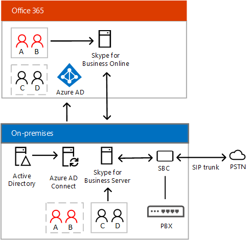

# Planificar la conectividad híbrida entre Skype Empresarial Server y Skype Empresarial Online
 
**Resumen:** lea este tema para aprender a planificar la conectividad híbrida entre Skype Empresarial Server y Skype Empresarial Online.  A la hora de implementar muchas soluciones híbridas de Skype Empresarial, el primer paso consiste en configurar la conectividad híbrida.
  
Este tema proporciona información general y describe la infraestructura y requisitos del sistema configurar la conectividad híbrida entre las existentes, deberá local Skype para la implementación de Business Server — con usuarios que se han creado en sus instalaciones Active Directory y Skype para negocios en línea. 
  
Este tema incluye las secciones siguientes:
  
- [Información general](plan-hybrid-connectivity.md#BKMK_Overview)
    
- [Requisitos de infraestructura](plan-hybrid-connectivity.md#BKMK_Infrastructure)
    
- [Soporte de varios bosque](plan-hybrid-connectivity.md#BKMK_MultiForest)
    
- [Coexistencia de Exchange](plan-hybrid-connectivity.md#BKMK_Exchange)
    
- [Credenciales de administrador](plan-hybrid-connectivity.md#BKMK_Credentials)
    
- [Skype de PowerShell en línea de negocio](plan-hybrid-connectivity.md#BKMK_PowerShell)
    
- [Skype para soporte del negocio cliente](plan-hybrid-connectivity.md#BKMK_ClientSupport)
    
- [Requisitos de topología](plan-hybrid-connectivity.md#BKMK_Topology)
    
- [Requisitos de federación listas de permitidos y bloqueados](plan-hybrid-connectivity.md#BKMK_Federation)
    
- [Configuración de DNS](plan-hybrid-connectivity.md#BKMK_DNS)
    
- [Consideraciones de Firewall](plan-hybrid-connectivity.md#BKMK_Firewall)
    
- [Requisitos de puertos y protocolos](plan-hybrid-connectivity.md#BKMK_Ports)
    
- [Datos y cuentas de usuario](plan-hybrid-connectivity.md#BKMK_UserAccounts)
    
- [Características y directivas de usuario](plan-hybrid-connectivity.md#BKMK_UserPolicies)
    
Después de haber leído este tema y están listos para implementar, vea [implementar la conectividad híbrida entre Skype para Business Server y Skype para los negocios en línea](deploy-hybrid-connectivity/deploy-hybrid-connectivity.md). Los temas sobre la implementación proporcionan instrucciones detalladas sobre la configuración de la conectividad híbrida entre su implementación local y Skype Empresarial Online.
  
(Para obtener información acerca de cómo configurar su Lync Server 2013 o implementación de Lync Server 2010 para híbrido, consulte [Lync Server 2013 híbrido](https://go.microsoft.com/fwlink/p/?LinkId=617360)).
  
## Información general

Con las soluciones híbridas podrá transferir a sus usuarios a la nube en función de su programación y la necesidad de su negocio. Este tema se centra en la conectividad híbrida entre una implementación local de Skype Empresarial Server y Skype Empresarial Online. Esta conectividad le permite tener a algunos usuarios alojados en local y a otros en línea.
  
Este tipo de implementación se denomina "división dominio": los usuarios del significado de un dominio, como contoso.com, están divididos entre con Skype para Business Server en locales y Skype para los negocios en línea como sigue:
  
- Los usuarios que están alojados en local interactúan con los servidores de Skype Empresarial local.
    
- Los usuarios que están alojados en línea interactúan con los servicios en línea de Skype Empresarial.
    
- Los usuarios de ambos entornos pueden colaborar entre sí al usar la mensajería instantánea, participar en llamadas de conferencia, llamadas de VoIP, etc.
    
- Azure Active Directory Connect se utiliza para sincronizar su directorio local con Office 365.
    
Active Directory local es autoritativo, lo que significa que debe hacer lo siguiente para garantizar que los usuarios locales y en línea se puedan detectar entre sí:
  
- Todos los usuarios deben crearse en el Active Directory local de primero y, a continuación, sincroniza con Azure AD. 
    
- Si los usuarios están alojados en local para Skype Empresarial, tendrá que habilitarles para Skype Empresarial local.
    
- Si los usuarios están alojados en local, pero quiere beneficiarse de algunas características en línea (como la Difusión de reunión de Skype), tendrá que asignarles una licencia de Skype Empresarial Online (plan 2).
    
- Si los usuarios están alojados en Skype Empresarial Online, cuando la cuenta esté sincronizada con Azure AD, tendrá que asignarles una licencia de Skype Empresarial Online (plan 2). 
    
- Una vez que a los usuarios de Skype Empresarial Online se les ha asignado una licencia, tendrá que habilitarles para Skype Empresarial o para la telefonía IP empresarial local. Para obtener más información, vea [Habilitar a los usuarios de Telefonía IP empresarial en instalaciones](plan-your-phone-system-cloud-pbx-solution/enable-the-users-for-enterprise-voice-on-premises.md). Para obtener más información acerca de los requisitos de voz híbrida, consulte [Planificación del sistema de teléfono en Office 365 con conectividad de RTC local en Skype para Business Server](plan-your-phone-system-cloud-pbx-solution/plan-phone-system-with-on-premises-pstn-connectivity.md).
    
Recibirá más información sobre la configuración de Active Directory en las secciones que siguen. Sin embargo, primero hay que ver un resumen de la terminología y los acrónimos que se usan en los diagramas siguientes, así como en muchos de los temas sobre conectividad híbrida:
  
- RTC: red telefónica conmutada
    
- PBX: sistema telefónico de central de conmutación
    
- Sistema telefónico: oferta de sistema telefónico de PBX en la nube de Microsoft
    
- Tronco - línea de telefonía que conecta la PBX a la RTC: un tronco podría utilizar el protocolo de inicio de sesión (SIP), un protocolo de voz sobre Internet (VoIP), o la tecnología antigua de tiempo-Division Multiplexing (TDM) 
    
- SBC: controlador de borde de sesión. Dispositivo que sirve como firewall y enrutador en redes telefónicas. Por ejemplo, proporciona seguridad, conectividad, interoperabilidad y calidad de servicios. 
    
- Puerta de enlace RTC: un dispositivo que actúa como enrutador en redes telefónicas, capaz de hacer la mayoría de las cosas que hace un SBC, excepto la seguridad y el cruce de NAT.
    
El siguiente diagrama muestra un Skype para configuración híbrida de negocio "dominio de división". Los usuarios A y los usuarios B se alojan en línea pero los usuarios locales pueden detectarlos; los usuarios C y D se alojan en local, pero los usuarios en línea los pueden detectar.
  

  
Es posible que también conozca el término "voz híbrida". Hace referencia a los troncos de voz locales que suministra funciones a los usuarios alojados en la nube. La voz híbrida proporciona migración a la nube a la vez que conserva la configuración de voz local. Si ya cuenta con una implementación de Skype Empresarial Server, el primer paso para habilitar la voz híbrida consiste en configurar un entorno de dominios divididos. 
  
Por ejemplo, supongamos que su empresa tiene un campo móvil gran organización que requiere la mínima PBX voz pero extenso teléfono inteligente que utilice. Podría elegir transferir a estos usuarios a la nube para beneficiarse del Sistema telefónico de Office 365 (PBX en la nube) de Microsoft. Si su empresa tiene también un centro de llamadas locales grandes que requiere software center contacto avanzada y compleja como parte de su PBX local, puede dejar estos usuarios en locales. Los usuarios que están alojados en línea y en local tienen conectividad RTC a través de su implementación local.
  
En el siguiente diagrama se muestra una implementación de voz híbrida de Skype Empresarial:
  

  
Para obtener más información acerca de cómo configurar una solución de voz híbrida con su Skype para la implementación de Business Server, consulte [Planificación del sistema de teléfono en Office 365 con conectividad de RTC local en Skype para Business Server](plan-your-phone-system-cloud-pbx-solution/plan-phone-system-with-on-premises-pstn-connectivity.md). 
  
También puede configurar implementaciones híbrido para la integración con Exchange y SharePoint en locales o con aplicaciones de Microsoft Office 365, incluido Exchange Online y SharePoint Online. También puede configurar una solución de voz híbrida que no requiera una implementación completa de Skype Empresarial Server mediante Cloud Connector Edition. Para obtener más información acerca de todos los Skype para soluciones de negocio híbrido y planear la migración a la nube, consulte [Skype para soluciones de negocio híbrido](skype-for-business-hybrid-solutions.md).
  
## Requisitos de infraestructura

Para implementar una conectividad híbrida entre Skype Empresarial Server y Skype Empresarial Online, debe configurar lo siguiente en su entorno:
  
- Una única implementación de Skype para Business Server o Lync Server implementados en una topología admitida en local. En este tema, vea [requisitos de topología](plan-hybrid-connectivity.md#BKMK_Topology) .
    
- Un arrendatario Microsoft Office 365 con Skype para los negocios en línea habilitada. 
    
    > [!NOTE]
    > Solo puede usar un inquilino para una configuración híbrida con su implementación local. 
  
- Skype para herramientas administrativas Business Server 2015. (Si utilizas Lync Server 2013 o Lync Server 2010, puede utilizar las herramientas administrativas de Lync Server 2013. Para obtener más información, consulte [híbridas Lync Server 2013](https://go.microsoft.com/fwlink/p/?LinkId=617360).)
    
- Azure Active Directory Connect para sincronizar su directorio local con Office 365. Para obtener más información, vea [Conectar Active Directory con el directorio activo de Azure](https://docs.microsoft.com/en-us/azure/active-directory/connect/active-directory-aadconnect-accounts-permissions).
    
    Para admitir el inicio de sesión único con Office 365 y que los usuarios puedan usar las mismas credenciales para iniciar sesión que se usan en local, puede usar las características de sincronizar contraseñas de Azure Active Directory (AAD) Connect. También puede usar los Servicios de federación de Active Directory (AD FS) para el inicio de sesión único con Office 365. 
    
- Una federación habilitada entre su implementación de Skype Empresarial local y su inquilino de Office 365. La federación permite a los usuarios en la implementación local para comunicarse con usuarios de Office 365 en su organización. Para obtener más información, vea [Configurar la federación con Skype para los negocios en línea](deploy-hybrid-connectivity/configure-federation-with-skype-for-business-online.md).
    
- Un espacio de dirección de protocolo de inicio de sesión (SIP) compartido. Una dirección SIP es un identificador único para cada usuario de una red, parecido a un número de teléfono o a una dirección de correo electrónico. Antes de intentar mover usuarios desde local a Skype para los negocios en línea, necesitará configurar el inquilino Office 365 para compartir el espacio de direcciones de protocolo de inicio de sesión (SIP) compartida con su implementación local. Para obtener más información, vea [Configurar la federación con Skype para los negocios en línea](deploy-hybrid-connectivity/configure-federation-with-skype-for-business-online.md).
    
## Compatibilidad de bosques múltiples

Los usuarios pueden acceder a la funcionalidad de Skype Empresarial en otro bosque si se cumplen los siguientes requisitos:
  
- Los usuarios están correctamente sincronizados en el bosque que aloja a Skype Empresarial: en configuraciones híbridas, esto significa que los usuarios deben estar sincronizados como objetos de usuarios deshabilitados.
    
- El bosque que aloja a Skype Empresarial debe confiar en el bosque que contiene a los usuarios.
    
Para obtener información sobre escenarios de híbridos de varios bosques, consulte [configurar un entorno de varios bosque para híbrido Skype para el negocio](deploy-hybrid-connectivity/configure-a-multi-forest-environment-for-hybrid.md).
  
## Coexistencia de Exchange

Para admitir la coexistencia con Exchange, tenga lo siguiente en cuenta:
  
- La práctica recomendada es mover el buzón del usuario a Exchange Online antes de pasar Skype del usuario para el negocio principal.
    
- Los usuarios con buzones de correo de Exchange son compatibles con las siguientes limitaciones conocidas:
    
  - Inicio de sesión de cliente: los usuarios pueden necesitar iniciar sesión dos veces durante el inicio de sesión de cliente de SfB.
    
  - Historial de conversaciones de lado servidor, archivado, almacén de contacto unificado, HighRes fotos requiere Exchange 2013 o posterior, y debe habilitar al servidor de OAuth para la comunicación entre el servidor. Para obtener más información, vea [Administrar la autenticación de servidor a servidor (OAuth) y aplicaciones de los socios en Skype para Business Server 2015](https://technet.microsoft.com/en-us/library/jj204817.aspx).
    
Para obtener detalles acerca de la coexistencia con Exchange Server, incluida la compatibilidad con criterios y limitaciones en diversas combinaciones de locales y en línea, vea [función admite](../plan-your-deployment/integrate-with-exchange/integrate-with-exchange.md#feature_support) en [Planear la integración de Skype para empresas y Exchange](../plan-your-deployment/integrate-with-exchange/integrate-with-exchange.md).
  
## Credenciales de administrador

Cuando se le pida que proporcione sus credenciales de administrador, puede utilizar el nombre de usuario y la contraseña para la cuenta de administrador para el arrendatario de Office 365. También utilizará estas credenciales al configurar Active Directory de Azure para federación, sincronización de directorios, el inicio de sesión único y mover los usuarios a Skype para los negocios en línea.
  
## PowerShell de Skype Empresarial Online

Los administradores tienen ahora la capacidad de usar Windows PowerShell para administrar Skype para los negocios en línea y su Skype para cuentas de usuario de negocios en línea. Para ello, primero debe descargar e instalar el Skype para negocios módulo del conector en línea desde Microsoft Download Center. Para obtener más información acerca de cómo descargar, instalar y utilizar el Skype para el módulo del conector de negocios en línea y para obtener información detallada sobre el uso de Windows PowerShell para administrar Skype para los negocios en línea, consulte [usar Windows PowerShell para administrar Skype para empresas En línea](https://technet.microsoft.com/library/dn362831.aspx). 
  
## Compatibilidad de clientes de Skype Empresarial

Hay algunas diferencias en las características compatibles con los clientes, así como en las disponibles en entornos locales y en línea. Los clientes siguientes son compatibles con Skype para los negocios en línea en una implementación híbrida:
  
- Skype Empresarial
    
- Lync 2013
    
- Lync 2010
    
- Aplicación de la Tienda Windows de Lync
    
- Lync Web App
    
- Lync Mobile
    
- Lync para Mac 2011
    
- Sistema de sala de Lync y Skype para el sistema de sala de negocios
    
- Lync Basic 2013
    
- Microsoft Surface Hub
    
Antes de decidir donde desea que los usuarios domésticos en su organización, debe revisar la [comparación de características de cliente de escritorio de Skype para el negocio](../plan-your-deployment/clients-and-devices/desktop-feature-comparison.md) para determinar la compatibilidad de cliente para las distintas configuraciones de Skype para Business Server. Vea también:
  
- [Plan para los clientes y dispositivos](../plan-your-deployment/clients-and-devices/clients-and-devices.md)
    
- [Comparación de características de cliente móvil de Skype para empresas](../plan-your-deployment/clients-and-devices/mobile-feature-comparison.md)
    
## Requisitos de topología

Para configurar la implementación para híbrido con Skype para los negocios en línea, debe tener una de las siguientes topologías admitidas:
  
- Un Skype para la implementación de Business Server 2015 con todos los servidores de Skype para Business Server 2015.
    
- Una implementación de Lync Server 2013 con todos los servidores que ejecutan Lync Server 2013.
    
    Para la conectividad de voz híbrida, el servidor perimetral que está designado como servidor perimetral de federación debe ser Skype Empresarial 2015; el servidor perimetral también requiere un servidor back-end en Skype Empresarial Server. Podría tener un grupo de servidores sin usuarios en él. 
    
- Una implementación de Lync Server 2010 con todos los servidores que ejecutan Lync Server 2010 con las últimas actualizaciones acumulativas.
    
  - La federación de servidor perimetral y el servidor del próximo salto de la federación de servidor perimetral deben ejecutar Lync Server 2010 con las últimas actualizaciones acumulativas.
    
  - El Skype para Business Server 2015 o herramientas administrativas de Lync Server 2013 debe instalarse en al menos un servidor o estación de trabajo de administración.
    
- Lync Server 2013 y Skype para la implementación de Business Server 2015 con las siguientes funciones de servidor en al menos un sitio con Skype para Business Server 2015 mixto:
    
  - Al menos un grupo de servidores Enterprise o un servidor Standard Edition  
    
  - El grupo de directores asociado con la federación SIP, si existe
    
  - El grupo de servidores perimetrales asociado con la federación SIP
    
- Lync Server 2010 y Skype para la implementación de Business Server 2015 con las siguientes funciones de servidor en al menos un sitio con Skype para Business Server 2015 mixto:
    
  - Al menos un grupo de servidores Enterprise o un servidor Standard Edition  
    
  - El grupo de directores asociado con la federación SIP, si existe
    
  - El grupo de servidores perimetrales asociado con la federación SIP para el sitio
    
- Una implementación mixta de Lync Server 2010 y Lync Server 2013 con las siguientes funciones de servidor en al menos un sitio que ejecutan Lync Server 2013:
    
  - Al menos un grupo de servidores Enterprise o un servidor Standard Edition en el sitio
    
  - El grupo de directores asociado con la federación SIP, si existe en el sitio
    
  - El grupo de servidores perimetrales asociado con la federación SIP para el sitio
    
## Requisitos para las listas de permitidos/bloqueados de la federación

La lista de dominios permitidos incluye los dominios que tienen configurado un nombre de dominio completo (FQDN) del perímetro de asociado. Estos se conocen a veces como socios de federación de socio permitido servidores ordirect. Debe estar familiarizado con la diferencia entre la federación abierto y cerrado la federación, conocida como lista de dominio de socio de socio descubrimiento andallowed, respectivamente, en las implementaciones locales.
  
Los requisitos siguientes necesitan cumplirse para configurar correctamente una implementación híbrida:
  
- La coincidencia de dominios necesita configurarse de la misma manera para la implementación local y para el inquilino de Office 365. Si la detección de asociado está habilitada en la implementación local, configure una federación abierta para el inquilino en línea. Si, por el contrario, la detección de asociado no está habilitada, configure una federación cerrada para el inquilino en línea.
    
- La lista de dominios bloqueados de la implementación local necesita coincidir exactamente con la lista de dominios bloqueados del inquilino en línea.
    
- La lista de dominios permitidos de la implementación local necesita coincidir exactamente con la lista de dominios permitidos del inquilino en línea.
    
- Federación debe habilitarse para las comunicaciones externas para el arrendatario en línea, que se configura mediante el Skype para el Panel de Control en línea de negocio.
    
## Configuración de DNS

Al crear registros DNS para implementaciones de híbridos, todos Skype para registros DNS externos del negocio debe apuntar a la infraestructura local. Para obtener detalles sobre los registros DNS necesarios, consulte [requisitos de DNS para Skype para Business Server 2015](../plan-your-deployment/network-requirements/dns.md).
  
Además, debe asegurarse de que la resolución DNS que se describe en la siguiente tabla funciona en su implementación local:
  
|Registro DNS    |Lo puede resolver    |Requisito de DNS    |
|:-----|:-----|:-----|
|Registro SRV de DNS para _sipfederationtls._tcp. \<sipdomain.com\> para todos los dominios SIP resolver en el servidor perimetral de acceso externo IP (s)    |Servidores perimetrales    |Habilite la comunicación federada en una configuración híbrida. El servidor perimetral tiene que saber hacia dónde redirigir el tráfico federado para el dominio SIP que se divide entre las formas local y en línea.    Debe usar estrictamente la coincidencia de los nombres DNS entre el dominio del nombre de usuario y el registro SRV.    |
|Registros DNS A para el FQDN del servicio de conferencia web perimetral, por ejemplo, webcon.contoso.com que se resuelvan en direcciones IP externas de servidor perimetral de conferencia web    |Red corporativa interna conectado los equipos de los usuarios    |Habilite los usuarios en línea para que puedan presentar y visualizar contenido en las reuniones hospedadas de forma local. El contenido incluye archivos de PowerPoint, pizarras, sondeos y notas compartidas.     |
   
Según el modo en que DNS esté configurado en su organización, es probable que deba agregar estos registros a la zona DNS hospedada interna para que los dominios SIP correspondientes proporcionen una resolución DNS interna para estos registros.
  
## Consideraciones sobre el firewall

Los equipos de la red necesitan poder efectuar búsquedas estándar de DNS en Internet. Si estos equipos acceden a sitios de Internet estándar, la red cumplirá este requisito.
  
Dependiendo de la ubicación de su centro de datos de Microsoft Online Services, también debe configurar los dispositivos de firewall de red para que acepte conexiones basadas en nombres de dominio comodín (por ejemplo, todo el tráfico de \*. outlook.com). Si los servidores de seguridad de su organización no admiten configuraciones de nombre comodín, tendrá que determinar manualmente los intervalos de direcciones IP que desea permitir y los puertos especificados.
  
Para obtener más información, vea [direcciones URL de Office 365 y los intervalos de direcciones IP](https://go.microsoft.com/fwlink/p/?LinkId=252942).
  
## Requisitos de puerto y protocolo

Además de los requisitos de puerto para la comunicación interna, debe configurar también los puertos siguientes para permitir la conectividad híbrida:
  

|**Protocolo**|**TCP o UDP**|**IP de origen**|**Destino IP**|**Puerto de origen**|**Puerto de destino**|**Notas**|
|:-----|:-----|:-----|:-----|:-----|:-----|:-----|
|SIP (MTLS)    |TCP    |Perímetro de acceso    |Office 365    |Cualquiera    |5061    |Señalización    |
|SIP (MTLS)    |TCP    |Office 365    |Perímetro de acceso    |Cualquiera    |5061    |Señalización    |
|STUN    |TCP    |Servidor perimetral A/V    |Office 365    |50.000-59.999    |443, 50.000-59.999    |Abierto para sesiones de uso compartido de aplicaciones, vídeo y audio    |
|STUN    |TCP    |Office 365    |Servidor perimetral A/V    |443    |50.000-59.999    |Abierto para sesiones de uso compartido de aplicaciones, vídeo y audio    |
|STUN    |UDP    |Servidor perimetral A/V    |Office 365    |3478    |3478    |Abierto para sesiones de vídeo y audio    |
|STUN    |UDP    |Office 365    |Servidor perimetral A/V    |3478    |3478    |Abierto para sesiones de vídeo y audio    |
   
Para obtener más información acerca de puerto y planificación para el servidor perimetral del firewall, vea [servidor perimetral requisitos medioambientales en Skype para Business Server 2015](../plan-your-deployment/edge-server-deployments/edge-environmental-requirements.md). Consulte también [requisitos de protocolo y puerto para los servidores](../plan-your-deployment/network-requirements/ports-and-protocols.md) y el [diagrama de cargas de trabajo de protocolo](http://go.microsoft.com/fwlink/p/?LinkId=550989).
  
## Cuentas de usuarios y datos

En una implementación híbrida, cualquier usuario que desee que el inicio en línea, primero debe crearse en la implementación local, para que se cree la cuenta de usuario en servicios de dominio de Active Directory. A continuación, puede mover el usuario a Skype para los negocios en línea, que se moverá la lista de contactos del usuario.
  
Al sincronizar las cuentas de usuario entre su implementación local y el inquilino online mediante conexión DAA, debe sincronizar las cuentas de AD para todos Skype para usuarios de negocios o Lync en su organización, incluso si los usuarios no cambian a en línea. Si no sincroniza todos los usuarios, puede que la comunicación entre los usuarios locales y en línea de su organización no funcione como es de esperar.
  
> [!IMPORTANT]
> Administración de todos los usuarios, incluidos los usuario se mueve entre local y de Skype para los negocios en línea, deben realizarse con la última versión instalada de las herramientas administrativas. Las herramientas administrativas deben instalarse en un servidor independiente que cuenta con conexión de acceso a la implementación existente de local y a Internet. El cmdlet para mover usuarios desde su implementación local a Skype para los negocios en línea, [Mover CsUser](https://docs.microsoft.com/en-us/powershell/module/skype/move-csuser?view=skype-ps), se debe ejecutar desde herramientas administrativas conectadas a su implementación local. Para obtener más información acerca de cómo mover los usuarios, consulte [mover usuarios desde en instalaciones a Skype para los negocios en línea](deploy-hybrid-connectivity/move-users-from-on-premises-to-skype-for-business-online.md). 
  
> [!IMPORTANT]
> Si el usuario se creó con el portal en línea de Office 365, la cuenta de usuario no se sincronizará con la implementación local de Active Directory de modo que el usuario no existirá en ella. Si ya tiene usuarios creados en su inquilino en línea y desea realizar una configuración híbrida con una implementación local, vea Mover usuarios a Skype Empresarial Online. 
  
> [!NOTE]
> Si se encuentra un Skype para cliente de negocios en línea que tiene los usuarios habilitados para Skype para los negocios en línea que no han sido habilitados en una implementación local, consulte [mover usuarios de Skype para los negocios en línea a en instalaciones](deploy-hybrid-connectivity/move-users-from-skype-for-business-online-to-on-premises.md). 
  
También necesita tener en cuenta los siguientes problemas relacionados con el usuario al planear una implementación híbrida.
  
- **Contactos de los usuarios** El límite de contactos de los usuarios de Lync Online es 250. Los contactos más allá de ese número se quitará de la lista de contactos del usuario cuando se mueve la cuenta a Lync Online.
    
- **Mensajería instantánea y presencia** Se migran las listas de contactos de usuarios, grupos y listas de control de acceso (ACL) con la cuenta de usuario.
    
- **Conferencia los datos, el contenido de la reunión y reuniones programadas** Este contenido no se migra con la cuenta de usuario. Los usuarios necesitan reprogramar reuniones una vez que estas cuentas migran a Lync Online.
    
## Directivas de usuario y características

- En un entorno híbrido, se puede habilitar a los usuarios para mensajería instantánea y conferencias (reuniones) en modo local o en línea, pero no en ambos a la vez.
    
- **Soporte al cliente** Algunos usuarios pueden requerir una nueva versión de cliente cuando se mueven a Skype para los negocios en línea. Para Office Communications Server 2007 R2, los usuarios deben moverse a un Skype para Business Server o Lync Server 2013 grupo antes de la migración a Skype para los negocios en línea.
    
- **Local directivas y configuración (que no sea de usuario)** En línea y local las directivas requieren configuración independiente. No se pueden establecer directivas globales para aplicarlas a ambas.
    

