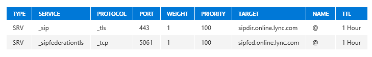

# <a name="configure-cloud-connector-integration-with-your-microsoft-365-or-office-365-organization"></a><span data-ttu-id="27a60-103">Configurar la integración de Cloud Connector con su organización de Microsoft 365 u Office 365</span><span class="sxs-lookup"><span data-stu-id="27a60-103">Configure Cloud Connector integration with your Microsoft 365 or Office 365 organization</span></span>

> [!Important] 
> <span data-ttu-id="27a60-104">Cloud Connector Edition se retirará el 31 de julio de 2021 junto con Skype Empresarial Online.</span><span class="sxs-lookup"><span data-stu-id="27a60-104">Cloud Connector Edition will retire July 31, 2021 along with Skype for Business Online.</span></span> <span data-ttu-id="27a60-105">Una vez que su organización haya actualizado a Teams, obtenga información sobre cómo conectar su red de telefonía local a Teams mediante [el enrutamiento directo.](https://docs.microsoft.com/MicrosoftTeams/direct-routing-landing-page)</span><span class="sxs-lookup"><span data-stu-id="27a60-105">Once your organization has upgraded to Teams, learn how to connect your on-premises telephony network to Teams using [Direct Routing](https://docs.microsoft.com/MicrosoftTeams/direct-routing-landing-page).</span></span>

<span data-ttu-id="27a60-106">Obtenga información sobre cómo configurar la integración de Cloud Connector con su organización de Microsoft 365 u Office 365.</span><span class="sxs-lookup"><span data-stu-id="27a60-106">Learn how to configure Cloud Connector integration with your Microsoft 365 or Office 365 organization.</span></span>
  
<span data-ttu-id="27a60-107">Una vez completada la instalación de Skype Empresarial Cloud Connector Edition, siga los pasos de esta sección para configurar la implementación y conectarla a su organización de Microsoft 365 u Office 365.</span><span class="sxs-lookup"><span data-stu-id="27a60-107">Once the Skype for Business Cloud Connector Edition installation is complete, perform the steps in this section to configure your deployment and connect it to your Microsoft 365 or Office 365 organization.</span></span>
  
## <a name="configure-firewall-settings"></a><span data-ttu-id="27a60-108">Configuración de las opciones del firewall</span><span class="sxs-lookup"><span data-stu-id="27a60-108">Configure firewall settings</span></span>

<span data-ttu-id="27a60-109">Configure las opciones del firewall para su configuración de firewall interno y externo para que la red perimetral abra los [puertos](plan-skype-for-business-cloud-connector-edition.md#BKMB_Ports) necesarios, tal como se describe en Puertos y protocolos en [Plan for Skype for Business Cloud Connector Edition](plan-skype-for-business-cloud-connector-edition.md).</span><span class="sxs-lookup"><span data-stu-id="27a60-109">Configure the firewall settings for your internal and external firewall settings for you perimeter network to open the required ports as described in [Ports and protocols](plan-skype-for-business-cloud-connector-edition.md#BKMB_Ports) in [Plan for Skype for Business Cloud Connector Edition](plan-skype-for-business-cloud-connector-edition.md).</span></span>
  
## <a name="set-up-public-switched-telephone-network-pstn-gateways"></a><span data-ttu-id="27a60-110">Configurar puertas de enlace de red telefónica conmutada (RTC)</span><span class="sxs-lookup"><span data-stu-id="27a60-110">Set up Public Switched Telephone Network (PSTN) gateways</span></span>

<span data-ttu-id="27a60-111">Configure troncos en cada puerta de enlace RTC para que apunten de nuevo a los servidores de mediación para todos los dispositivos.</span><span class="sxs-lookup"><span data-stu-id="27a60-111">Set up trunks on each PSTN gateway to point back to Mediation Servers for all appliances.</span></span> <span data-ttu-id="27a60-112">Dado que el FQDN del grupo de servidores es el mismo para todos los servidores del grupo, cada tronco debe apuntar a un FQDN o dirección IP del servidor de mediación en lugar del FQDN del grupo de servidores de mediación.</span><span class="sxs-lookup"><span data-stu-id="27a60-112">Because the pool FQDN is the same for all servers in the pool, each trunk should point to one Mediation Server FQDN or IP address instead of the Mediation Server pool FQDN.</span></span> <span data-ttu-id="27a60-113">Los troncos deben establecerse en la misma prioridad.</span><span class="sxs-lookup"><span data-stu-id="27a60-113">Trunks should be set in the same priority.</span></span>
  
<span data-ttu-id="27a60-114">Si usa TLS entre servidores de mediación y puertas de enlace, deberá configurar las puertas de enlace y los servidores de mediación para admitir MTLS de la siguiente manera:</span><span class="sxs-lookup"><span data-stu-id="27a60-114">If you are using TLS between Mediation Servers and gateways, you will need to configure the gateways and Mediation Servers to support MTLS as follows:</span></span>
  
1. <span data-ttu-id="27a60-115">Exporte la CA raíz desde el equipo de Active Directory de Cloud Connector.</span><span class="sxs-lookup"><span data-stu-id="27a60-115">Export the Root CA from the Cloud Connector Active Directory computer.</span></span>
    
2. <span data-ttu-id="27a60-116">Siga las instrucciones del proveedor de la puerta de enlace RTC para importar la CA raíz.</span><span class="sxs-lookup"><span data-stu-id="27a60-116">Follow the PSTN gateway vendor instructions for importing the Root CA.</span></span>
    
3. <span data-ttu-id="27a60-117">Importe el certificado de ca raíz para el certificado emitido a la puerta de enlace en los servidores de mediación.</span><span class="sxs-lookup"><span data-stu-id="27a60-117">Import the Root CA certificate for the certificate issued to your gateway on the Mediation Servers.</span></span> <span data-ttu-id="27a60-118">Si necesita obtener un certificado SSL para la puerta de enlace, puede hacerlo mediante el servicio de entidad de certificación que se ejecuta en el equipo de Active Directory de Cloud Connector de la siguiente manera:</span><span class="sxs-lookup"><span data-stu-id="27a60-118">If you need to obtain an SSL certificate for the gateway, you may do this using the Certificate Authority service running on the Cloud Connector Active Directory computer as follows:</span></span>
    
   - <span data-ttu-id="27a60-119">Modifique la plantilla de servidor web existente para permitir que los usuarios autenticados se inscriban o cree una nueva plantilla de servidor web para configurar otras propiedades y permitir que los usuarios autenticados se inscriban.</span><span class="sxs-lookup"><span data-stu-id="27a60-119">Modify the existing Web Server template to enable Authenticated users to enroll, or create a new Web Server template to configure other properties and enable Authenticated users to enroll.</span></span> <span data-ttu-id="27a60-120">Para obtener instrucciones detalladas, vea [Plantillas de certificado.](https://technet.microsoft.com/library/cc730705.aspx)</span><span class="sxs-lookup"><span data-stu-id="27a60-120">For detailed instructions, see [Certificate Templates](https://technet.microsoft.com/library/cc730705.aspx).</span></span>
    
   - <span data-ttu-id="27a60-121">Solicite un certificado mediante el complemento Certificado seleccionando la plantilla de servidor web que ha habilitado.</span><span class="sxs-lookup"><span data-stu-id="27a60-121">Request a certificate using Certificate snap-in selecting the Web Server template that you have enabled.</span></span> <span data-ttu-id="27a60-122">Asegúrese de agregar el nombre común en Asunto y nombre DNS en Nombre alternativo con el FQDN de la puerta de enlace y confirme en la clave privada que Hacer exportable la clave privada está seleccionada en las opciones de clave.</span><span class="sxs-lookup"><span data-stu-id="27a60-122">Be sure to add Common name in Subject and DNS name in Alternative name with FQDN of the gateway, and confirm on the Private Key that Make private key exportable is selected under key options.</span></span> 
    
4. <span data-ttu-id="27a60-123">Exporte el certificado SSL con clave privada y siga las instrucciones de su proveedor de puertas de enlace RTC para importar el certificado.</span><span class="sxs-lookup"><span data-stu-id="27a60-123">Export the SSL certificate with Private key and follow the instructions from your PSTN gateway vendor for importing the certificate.</span></span>
    
## <a name="update-the-domain-for-your-tenant"></a><span data-ttu-id="27a60-124">Actualizar el dominio de su espacio empresarial</span><span class="sxs-lookup"><span data-stu-id="27a60-124">Update the domain for your tenant</span></span>

<span data-ttu-id="27a60-125">Asegúrese de que ha completado los pasos para actualizar su dominio en Microsoft 365 u Office 365 y que tiene la capacidad de agregar registros DNS.</span><span class="sxs-lookup"><span data-stu-id="27a60-125">Make sure that you've completed the steps to update your domain in Microsoft 365 or Office 365 and have the ability to add DNS records.</span></span> <span data-ttu-id="27a60-126">Para obtener más información acerca de cómo configurar su dominio en Microsoft 365 u Office 365, vea Agregar un dominio [a Microsoft 365 u Office 365.](https://support.office.com/article/Add-a-domain-to-Office-365-6383f56d-3d09-4dcb-9b41-b5f5a5efd611)</span><span class="sxs-lookup"><span data-stu-id="27a60-126">For more information about how to set up your domain in Microsoft 365 or Office 365, see [Add a domain to Microsoft 365 or Office 365](https://support.office.com/article/Add-a-domain-to-Office-365-6383f56d-3d09-4dcb-9b41-b5f5a5efd611).</span></span>
  
## <a name="add-dns-records-for-your-edge"></a><span data-ttu-id="27a60-127">Agregar registros DNS para el servidor perimetral</span><span class="sxs-lookup"><span data-stu-id="27a60-127">Add DNS records for your Edge</span></span>

<span data-ttu-id="27a60-128">Agregue los siguientes registros DNS a su organización de Microsoft 365 u Office 365.</span><span class="sxs-lookup"><span data-stu-id="27a60-128">Add the following DNS records to your Microsoft 365 or Office 365 organization.</span></span> <span data-ttu-id="27a60-129">Para obtener información sobre cómo agregar registros DNS, vea Agregar o editar registros DNS personalizados en [Microsoft 365 u Office 365.](https://support.office.com/article/Add-or-edit-custom-DNS-records-in-Office-365-AF00A516-DD39-4EDA-AF3E-1EAF686C8DC9?ui=en-US&amp;rs=en-US&amp;ad=US&amp;fromAR=1)</span><span class="sxs-lookup"><span data-stu-id="27a60-129">For information about how to add DNS records, see [Add or edit custom DNS records in Microsoft 365 or Office 365](https://support.office.com/article/Add-or-edit-custom-DNS-records-in-Office-365-AF00A516-DD39-4EDA-AF3E-1EAF686C8DC9?ui=en-US&amp;rs=en-US&amp;ad=US&amp;fromAR=1).</span></span>
  
1. <span data-ttu-id="27a60-130">Agregue un registro A de DNS para el servidor perimetral de acceso.</span><span class="sxs-lookup"><span data-stu-id="27a60-130">Add a DNS A record for Access Edge.</span></span>
    
2. <span data-ttu-id="27a60-131">Microsoft 365 u Office 365 crearán automáticamente los registros SRV y los scripts de implementación.</span><span class="sxs-lookup"><span data-stu-id="27a60-131">SRV records will automatically be created by Microsoft 365 or Office 365 and the deployment scripts.</span></span> <span data-ttu-id="27a60-132">Confirme que puede buscar los dos servicios SIP siguientes en el servidor perimetral: \_ sip y \_ sipfederationtls.</span><span class="sxs-lookup"><span data-stu-id="27a60-132">Confirm that you can look up the following two SIP services on the Edge: \_sip and \_sipfederationtls.</span></span>
    
     
  
## <a name="set-up-hybrid-connectivity-between-cloud-connector-edition-and-microsoft-365-or-office-365"></a><span data-ttu-id="27a60-134">Configurar la conectividad híbrida entre Cloud Connector Edition y Microsoft 365 u Office 365</span><span class="sxs-lookup"><span data-stu-id="27a60-134">Set up hybrid connectivity between Cloud Connector Edition and Microsoft 365 or Office 365</span></span>

<span data-ttu-id="27a60-135">Para configurar la conectividad híbrida entre su implementación de Skype Empresarial Cloud Connector Edition y su organización de Microsoft 365 u Office 365, ejecute el siguiente cmdlet en una sesión remota de PowerShell.</span><span class="sxs-lookup"><span data-stu-id="27a60-135">To configure hybrid connectivity between your Skype for Business Cloud Connector Edition deployment and your Microsoft 365 or Office 365 organization, run the following cmdlet in a remote PowerShell session.</span></span> <span data-ttu-id="27a60-136">Para obtener información sobre cómo establecer una sesión remota de PowerShell, vea: Configurar el [equipo para Windows PowerShell](https://technet.microsoft.com/library/dn362831%28v=ocs.15%29.aspx).</span><span class="sxs-lookup"><span data-stu-id="27a60-136">To learn how to establish a remote PowerShell session, see: [Set up your computer for Windows PowerShell](https://technet.microsoft.com/library/dn362831%28v=ocs.15%29.aspx).</span></span>
  
<span data-ttu-id="27a60-137">El cmdlet establece el FQDN externo del servidor perimetral de acceso.</span><span class="sxs-lookup"><span data-stu-id="27a60-137">The cmdlet sets the Access Edge external FQDN.</span></span> <span data-ttu-id="27a60-138">En el primero de los comandos, el debe ser el del rol perimetral de \<External Access Edge FQDN\> acceso SIP.</span><span class="sxs-lookup"><span data-stu-id="27a60-138">In the first of the commands, the \<External Access Edge FQDN\> should be the one for the SIP Access Edge role.</span></span> <span data-ttu-id="27a60-139">De forma predeterminada, debe ser ap. \<Domain Name\> .</span><span class="sxs-lookup"><span data-stu-id="27a60-139">By default, this should be ap.\<Domain Name\>.</span></span>
  
```powershell
Set-CsTenantHybridConfiguration -PeerDestination <External Access Edge FQDN> -UseOnPremDialPlan $false
Set-CsTenantFederationConfiguration -SharedSipAddressSpace $True
```

> [!NOTE]
> <span data-ttu-id="27a60-140">El FQDN perimetral de acceso externo usado para el destino del mismo nivel debe establecerse en un sitio RTC que solo se usará como reserva en caso de que un usuario no esté asignado a un sitio RTC.</span><span class="sxs-lookup"><span data-stu-id="27a60-140">The External Access Edge FQDN used for Peer Destination should be set to a PSTN site that will only be used as a fallback in case a user isn't assigned to a PSTN site.</span></span> <span data-ttu-id="27a60-141">Para obtener más información, vea [Implementar un único sitio en Cloud Connector](deploy-a-single-site-in-cloud-connector.md) e implementar varios sitios en Cloud [Connector.](deploy-multiple-sites-in-cloud-connector.md)</span><span class="sxs-lookup"><span data-stu-id="27a60-141">For more information, see [Deploy a single site in Cloud Connector](deploy-a-single-site-in-cloud-connector.md) and [Deploy multiple sites in Cloud Connector](deploy-multiple-sites-in-cloud-connector.md).</span></span> 
  
## <a name="set-up-pstn-gateways"></a><span data-ttu-id="27a60-142">Configurar puertas de enlace RTC</span><span class="sxs-lookup"><span data-stu-id="27a60-142">Set up PSTN gateways</span></span>

<span data-ttu-id="27a60-143">Configure troncos en cada puerta de enlace RTC para que apunten de nuevo a los servidores de mediación para todos los dispositivos.</span><span class="sxs-lookup"><span data-stu-id="27a60-143">Set up trunks on each PSTN gateway to point back to Mediation Servers for all appliances.</span></span> <span data-ttu-id="27a60-144">Cada tronco debe apuntar a un FQDN o dirección IP del servidor de mediación en lugar del FQDN del grupo de servidores de mediación porque el FQDN del grupo de servidores es el mismo para todos los servidores del grupo.</span><span class="sxs-lookup"><span data-stu-id="27a60-144">Each trunk should point to one Mediation Server FQDN or IP address instead of the Mediation Server pool FQDN because the pool FQDN is the same for all servers in the pool.</span></span> <span data-ttu-id="27a60-145">Los troncos deben establecerse en la misma prioridad.</span><span class="sxs-lookup"><span data-stu-id="27a60-145">Trunks should be set in the same priority.</span></span>
  
<span data-ttu-id="27a60-146">Si usa TLS entre servidores de mediación y puertas de enlace, deberá configurar las puertas de enlace y los servidores de mediación para admitir MTLS de la siguiente manera:</span><span class="sxs-lookup"><span data-stu-id="27a60-146">If you are using TLS between Mediation Servers and gateways, you will need to configure the gateways and Mediation Servers to support MTLS as follows:</span></span>
  
1. <span data-ttu-id="27a60-147">Exporte la CA raíz desde el equipo de Active Directory de Cloud Connector.</span><span class="sxs-lookup"><span data-stu-id="27a60-147">Export the Root CA from the Cloud Connector Active Directory computer.</span></span>
    
2. <span data-ttu-id="27a60-148">Siga las instrucciones del proveedor de la puerta de enlace RTC para importar la CA raíz.</span><span class="sxs-lookup"><span data-stu-id="27a60-148">Follow the PSTN gateway vendor instructions for importing the Root CA.</span></span>
    
3. <span data-ttu-id="27a60-149">Importe el certificado de ca raíz para el certificado emitido a la puerta de enlace en los servidores de mediación.</span><span class="sxs-lookup"><span data-stu-id="27a60-149">Import the Root CA certificate for the certificate issued to your gateway on the Mediation Servers.</span></span> <span data-ttu-id="27a60-150">Si necesita obtener un certificado SSL para la puerta de enlace, puede hacerlo mediante el servicio de entidad de certificación que se ejecuta en el equipo de Active Directory de Cloud Connector de la siguiente manera:</span><span class="sxs-lookup"><span data-stu-id="27a60-150">If you need to obtain an SSL certificate for the gateway, you may do this using the Certificate Authority service running on the Cloud Connector Active Directory computer as follows:</span></span>
    
   - <span data-ttu-id="27a60-151">Modifique la plantilla de servidor web existente para permitir que los usuarios autenticados se inscriban o cree una nueva plantilla de servidor web para configurar otras propiedades y permitir que los usuarios autenticados se inscriban.</span><span class="sxs-lookup"><span data-stu-id="27a60-151">Modify the existing Web Server template to enable Authenticated users to Enroll, or create a new Web Server template to configure other properties and enable Authenticated users to enroll.</span></span> <span data-ttu-id="27a60-152">Para obtener instrucciones detalladas, vea [Plantillas de certificado.](https://technet.microsoft.com/library/cc730705.aspx)</span><span class="sxs-lookup"><span data-stu-id="27a60-152">For detailed instructions, see [Certificate Templates](https://technet.microsoft.com/library/cc730705.aspx).</span></span>
    
   - <span data-ttu-id="27a60-153">Solicite un certificado mediante el complemento Certificado seleccionando la plantilla de servidor web que ha habilitado.</span><span class="sxs-lookup"><span data-stu-id="27a60-153">Request a certificate using Certificate snap-in selecting the Web Server template that you have enabled.</span></span> <span data-ttu-id="27a60-154">Asegúrese de agregar el nombre común en Asunto y nombre DNS en Nombre alternativo con el FQDN de la puerta de enlace y confirme en la clave privada que Hacer que la clave privada exportable esté seleccionada en las opciones de clave.</span><span class="sxs-lookup"><span data-stu-id="27a60-154">Be sure to add Common name in Subject and DNS name in Alternative name with FQDN of the gateway, and confirm on the Private Key that Make private key exportable is selected under key options.</span></span> 
    
4. <span data-ttu-id="27a60-155">Exporte el certificado SSL con clave privada y siga las instrucciones de su proveedor de puertas de enlace RTC para importar el certificado.</span><span class="sxs-lookup"><span data-stu-id="27a60-155">Export the SSL certificate with Private key and follow the instructions from your PSTN gateway vendor for importing the certificate.</span></span>
    
5. <span data-ttu-id="27a60-156">Las puertas de enlace RTC de un sitio RTC solo deben conectarse a los servidores de mediación del mismo sitio.</span><span class="sxs-lookup"><span data-stu-id="27a60-156">PSTN gateway(s) in one PSTN site should only connect to the Mediation Server(s) in the same site.</span></span>
    
## <a name="set-up-your-users"></a><span data-ttu-id="27a60-157">Configurar los usuarios</span><span class="sxs-lookup"><span data-stu-id="27a60-157">Set up your users</span></span>

<span data-ttu-id="27a60-158">Inicie sesión en el Centro de administración de Microsoft 365, agregue los usuarios que se habilitarán para los servicios de voz en línea y asigne una licencia E5 o un complemento sistema telefónico a la licencia E3 a estos usuarios.</span><span class="sxs-lookup"><span data-stu-id="27a60-158">Log in to the Microsoft 365 admin center, add the users that will be enabled for online voice services, and assign an E5 license or Phone System add-on to the E3 license to these users.</span></span> <span data-ttu-id="27a60-159">Para obtener información sobre cómo agregar usuarios, vea [Agregar usuarios a Microsoft 365 para empresas.](https://support.office.com/article/Add-users-to-Office-365-for-business-435ccec3-09dd-4587-9ebd-2f3cad6bc2bc)</span><span class="sxs-lookup"><span data-stu-id="27a60-159">For information about adding users, see [Add users to Microsoft 365 for business](https://support.office.com/article/Add-users-to-Office-365-for-business-435ccec3-09dd-4587-9ebd-2f3cad6bc2bc).</span></span>
  
## <a name="enable-users-for-phone-system-voice-and-voicemail-services"></a><span data-ttu-id="27a60-160">Habilitar a los usuarios para los servicios de voz y correo de voz del Sistema telefónico</span><span class="sxs-lookup"><span data-stu-id="27a60-160">Enable users for Phone System voice and voicemail services</span></span>
 
<span data-ttu-id="27a60-161">Después de agregar los usuarios a Microsoft 365 u Office 365, habilite sus cuentas para los servicios de voz del Sistema telefónico, incluido el correo de voz.</span><span class="sxs-lookup"><span data-stu-id="27a60-161">After adding your users to Microsoft 365 or Office 365, enable their accounts for Phone System voice services, including voicemail.</span></span> <span data-ttu-id="27a60-162">Para habilitar estas funcionalidades, debe iniciar sesión en su organización de Microsoft 365 u Office 365 con una cuenta que sea un rol de administrador global y poder ejecutar PowerShell remoto.</span><span class="sxs-lookup"><span data-stu-id="27a60-162">To enable these capabilities, you must log in to your Microsoft 365 or Office 365 organization with an account that is a Global Administrator role, and be able to run remote PowerShell.</span></span> <span data-ttu-id="27a60-163">Para obtener información sobre cómo establecer una sesión remota de PowerShell, vea: [Configurar el equipo para Windows PowerShell](https://technet.microsoft.com/library/dn362831%28v=ocs.15%29.aspx)</span><span class="sxs-lookup"><span data-stu-id="27a60-163">To learn how to establish a remote PowerShell session, see: [Set up your computer for Windows PowerShell](https://technet.microsoft.com/library/dn362831%28v=ocs.15%29.aspx)</span></span>
  
- <span data-ttu-id="27a60-164">Asigne la directiva al usuario y configure el número de teléfono de voz empresarial del usuario, que especifique con el valor del **parámetro Identity:**</span><span class="sxs-lookup"><span data-stu-id="27a60-164">Assign the policy to your user and configure the user's business voice phone number, which you specify with the value of the **Identity** parameter:</span></span>
    
  ```powershell
  Set-CsUser -Identity "<User name>" -EnterpriseVoiceEnabled $true -HostedVoiceMail $true -OnPremLineURI <tel:+phonenumber>
  ```

    > [!NOTE]
    > <span data-ttu-id="27a60-165">Se puede especificar una identidad de usuario mediante la dirección SIP del usuario, el nombre principal de usuario (UPN) o el nombre para mostrar de Active Directory del usuario (por ejemplo, "Bob Kelly").</span><span class="sxs-lookup"><span data-stu-id="27a60-165">A user identity can be specified using the user's SIP address, user principal name (UPN), or the user's Active Directory display name (for example, "Bob Kelly").</span></span> <span data-ttu-id="27a60-166">El carácter asterisco ( \* ) también se puede usar con el nombre para mostrar como identidad del usuario.</span><span class="sxs-lookup"><span data-stu-id="27a60-166">The asterisk (\*) character can also be used with the Display Name as the user Identity.</span></span> <span data-ttu-id="27a60-167">Por ejemplo, la identidad " Smith" devuelve todos los usuarios que tienen un nombre para mostrar que termina con el valor de \* cadena "Smith".</span><span class="sxs-lookup"><span data-stu-id="27a60-167">For example, the Identity "\*Smith" returns all the users who have a display name that ends with the string value "Smith".</span></span>
  
<span data-ttu-id="27a60-168">A continuación, puede comprobar que los usuarios se agregaron y habilitaron con el siguiente script:</span><span class="sxs-lookup"><span data-stu-id="27a60-168">You can then verify that the users were added and enabled using the following script:</span></span>
  
```powershell
# Input the user name you want to verify
$user = Get-CsOnlineUser <User name>

# For a hybrid user, the value of $user.EnterpriseVoiceEnabled should be True
$user.EnterpriseVoiceEnabled

# For a hybrid user, the value of $user.HostedVoiceMail should be True
$user.HostedVoiceMail

# For a hybrid user, the value of $user.VoicePolicy should be "HybridVoice"
$user.VoicePolicy
```

<span data-ttu-id="27a60-169">Deberá decidir si los usuarios deben poder realizar llamadas internacionales.</span><span class="sxs-lookup"><span data-stu-id="27a60-169">You'll need to decide whether your users should be able to make international calls.</span></span> <span data-ttu-id="27a60-170">De forma predeterminada, las llamadas internacionales están habilitadas.</span><span class="sxs-lookup"><span data-stu-id="27a60-170">By default, international calling is enabled.</span></span> <span data-ttu-id="27a60-171">Puede deshabilitar o habilitar a los usuarios para la marcación internacional mediante el Centro de administración de Skype Empresarial en línea.</span><span class="sxs-lookup"><span data-stu-id="27a60-171">You can disable or enable users for international dialing using the online Skype for Business admin center.</span></span>
  
<span data-ttu-id="27a60-172">Para deshabilitar las llamadas internacionales por usuario, ejecute el siguiente cmdlet en PowerShell de Skype Empresarial Online:</span><span class="sxs-lookup"><span data-stu-id="27a60-172">To disable international calling on a per user basis, run the following cmdlet in Skype for Business Online PowerShell:</span></span>
  
```powershell
Grant-CsVoiceRoutingPolicy -PolicyName InternationalCallsDisallowed -Identity $user
```

<span data-ttu-id="27a60-173">Para volver a habilitar las llamadas internacionales por usuario después de deshabilitarla, ejecute el mismo cmdlet, pero cambie el valor de **PolicyName** a *InternationalCallsAllowed*  .</span><span class="sxs-lookup"><span data-stu-id="27a60-173">To re-enable international calling on a per user basis after it has been disabled, run the same cmdlet, but change the value for **PolicyName** to *InternationalCallsAllowed*  .</span></span>
  
## <a name="assign-users-to-pstn-sites"></a><span data-ttu-id="27a60-174">Asignar usuarios a sitios RTC</span><span class="sxs-lookup"><span data-stu-id="27a60-174">Assign users to PSTN sites</span></span>

<span data-ttu-id="27a60-175">Use PowerShell remoto de inquilino para asignar un sitio a los usuarios aunque solo haya implementado un único sitio.</span><span class="sxs-lookup"><span data-stu-id="27a60-175">Use tenant remote PowerShell to assign a site to users even if you only deployed a single site.</span></span> <span data-ttu-id="27a60-176">Para obtener información sobre cómo establecer una sesión remota de PowerShell, vea: Configurar el [equipo para Windows PowerShell](https://technet.microsoft.com/library/dn362831%28v=ocs.15%29.aspx).</span><span class="sxs-lookup"><span data-stu-id="27a60-176">To learn how to establish a remote PowerShell session, see: [Set up your computer for Windows PowerShell](https://technet.microsoft.com/library/dn362831%28v=ocs.15%29.aspx).</span></span>
  
```powershell
# Set the site to users
Set-CsUserPstnSettings -Identity <User Name> -HybridPstnSite <PSTN Site Name>

# Review the site setting for a user
Get-CsUserPstnSettings -Identity <User Name> 

# See all the user settings in one tenant
Get-CsOnlineUser | Get-CsUserPstnSettings
```

> [!NOTE]
> <span data-ttu-id="27a60-177">Si no se asigna ningún sitio RTC a un usuario, la conectividad híbrida entre la implementación de Skype Empresarial Cloud Connector Edition y su organización de Microsoft 365 u Office 365 volverá a usar el nivel de inquilino predeterminado uno (destino del mismo nivel) para que las llamadas se puedan completar.</span><span class="sxs-lookup"><span data-stu-id="27a60-177">If no PSTN site is assigned to a user, hybrid connectivity between your Skype for Business Cloud Connector Edition deployment and your Microsoft 365 or Office 365 organization will fall back to use the tenant level default one (Peer Destination) so that calls can be completed.</span></span> 
  
## <a name="configure-online-hybrid-mediation-server-settings"></a><span data-ttu-id="27a60-178">Configurar la configuración del servidor de mediación híbrido en línea</span><span class="sxs-lookup"><span data-stu-id="27a60-178">Configure online hybrid Mediation Server Settings</span></span>
<span data-ttu-id="27a60-179"><a name="BKMK_ConfigureMediationServer"> </a></span><span class="sxs-lookup"><span data-stu-id="27a60-179"><a name="BKMK_ConfigureMediationServer"> </a></span></span>

<span data-ttu-id="27a60-180">Cuando una llamada P2P se escala a una conferencia RTC, el servidor de conferencias de Skype Empresarial Online enviará una invitación al servidor de mediación de Cloud Connector.</span><span class="sxs-lookup"><span data-stu-id="27a60-180">When a P2P call is escalated to a PSTN conference, the Skype for Business Online conferencing server will send an invite to the Cloud Connector Mediation Server.</span></span> <span data-ttu-id="27a60-181">Para asegurarse de que Microsoft 365 u Office 365 puedan enrutar esta invitación correctamente, debe configurar una configuración en el espacio empresarial en línea para cada servidor de mediación de Cloud Connector de la siguiente manera:</span><span class="sxs-lookup"><span data-stu-id="27a60-181">To ensure that Microsoft 365 or Office 365 can route this invite successfully, you need to configure a setting in your online tenant for each Cloud Connector Mediation Server as follows:</span></span> 
  
1. <span data-ttu-id="27a60-182">Cree un usuario en el Centro de administración de Microsoft 365.</span><span class="sxs-lookup"><span data-stu-id="27a60-182">Create a user in the Microsoft 365 admin center.</span></span> <span data-ttu-id="27a60-183">Use el nombre de usuario que desee, como "MediationServer1".</span><span class="sxs-lookup"><span data-stu-id="27a60-183">Use any user name you want, such as "MediationServer1."</span></span>
    
    <span data-ttu-id="27a60-184">Use el dominio SIP predeterminado de Cloud Connector (el primer dominio SIP del archivo .ini) como dominio de usuario.</span><span class="sxs-lookup"><span data-stu-id="27a60-184">Use the default SIP domain of Cloud Connector (the first SIP domain in the .ini file) as the user domain.</span></span>
    
    <span data-ttu-id="27a60-185">Tenga en cuenta que la asignación de licencias solo es necesaria para la propagación del usuario en el directorio de Skype Empresarial Online.</span><span class="sxs-lookup"><span data-stu-id="27a60-185">Please note that license assignment is only required for the user propagation into the Skype for Business online directory.</span></span> <span data-ttu-id="27a60-186">Asigne una licencia de Microsoft 365 u Office 365 (como E5) a la cuenta que cree, permita hasta una hora para que los cambios se propaguen, compruebe que las cuentas de usuario se hayan aprovisionado correctamente en el directorio de Skype Empresarial Online ejecutando el siguiente cmdlet y, a continuación, quite la licencia de esta cuenta.</span><span class="sxs-lookup"><span data-stu-id="27a60-186">Assign a Microsoft 365 or Office 365 license (such as E5) to the account you create, allow up to one hour for the changes to propagate,verify the user accounts has been provisioned correctly to the Skype for Business online directory by running following cmdlet, then remove the license from this account.</span></span>
    ```powershell
   Get-CsOnlineUser -Identity <UserPrincipalName>
   ```
    
2. <span data-ttu-id="27a60-187">Inicie una sesión remota de PowerShell de Azure AD de inquilino con sus credenciales de administrador global o de usuario y, a continuación, ejecute el siguiente cmdlet para establecer el departamento de la cuenta de usuario de Azure AD configurada en el paso 1 en "HybridMediationServer":</span><span class="sxs-lookup"><span data-stu-id="27a60-187">Start a tenant Azure AD remote PowerShell session using your global or user admin credentials, and then run the following cmdlet to set the department for the Azure AD user account configured in step 1 to "HybridMediationServer":</span></span>

   ```powershell
   Set-MsolUser -UserPrincipalName <UserPrincipalName> -Department "HybridMediationServer"
   ```

3. <span data-ttu-id="27a60-188">Inicie una sesión remota de PowerShell de Skype Empresarial con sus credenciales de administrador de inquilino de Skype Empresarial y, a continuación, ejecute el siguiente cmdlet para establecer el FQDN del servidor de mediación y del servidor perimetral en esa cuenta de usuario, reemplazando con el nombre para mostrar del usuario para la cuenta que creó en el paso \<DisplayName\> 1:</span><span class="sxs-lookup"><span data-stu-id="27a60-188">Start a tenant Skype for Business remote PowerShell session using your Skype for Business tenant admin credentials, and then run the following cmdlet to set the Mediation Server and Edge Server FQDN to that user account, replacing \<DisplayName\> with the Display Name of the user for the account you created in step 1:</span></span>
    
   ```powershell
   Set-CsHybridMediationServer -Identity <DisplayName> -Fqdn <MediationServerFQDN> -AccessProxyExternalFqdn <EdgeServerExternalFQDN>
   ```

    <span data-ttu-id="27a60-189">Para Identity, use el nombre para mostrar de la cuenta de usuario que ha creado para este servidor de mediación.</span><span class="sxs-lookup"><span data-stu-id="27a60-189">For Identity, use the Display Name of the user account you created for this Mediation Server.</span></span>
    
    <span data-ttu-id="27a60-190">Para  *MediationServerFQDN,*  use el FQDN interno definido para el servidor de mediación.</span><span class="sxs-lookup"><span data-stu-id="27a60-190">For  *MediationServerFQDN*  , use the internal FQDN defined for your Mediation Server.</span></span>
    
    <span data-ttu-id="27a60-191">Para  *EdgeServerExternalFQDN,*  use el FQDN externo definido para el proxy de acceso del servidor perimetral.</span><span class="sxs-lookup"><span data-stu-id="27a60-191">For  *EdgeServerExternalFQDN*  , use the external FQDN defined for Edge Server Access Proxy.</span></span> <span data-ttu-id="27a60-192">Si hay varios sitios RTC de Cloud Connector, elija el FQDN del proxy de acceso del servidor perimetral asignado al sitio donde se encuentra el servidor de mediación.</span><span class="sxs-lookup"><span data-stu-id="27a60-192">If there are multiple Cloud Connector PSTN sites, choose the Edge Server Access Proxy FQDN assigned to the site where the Mediation Server is located.</span></span>
    
4. <span data-ttu-id="27a60-193">Si hay varios servidores de mediación de Cloud Connector (varios sitios, HA), repita los pasos anteriores para cada uno de ellos.</span><span class="sxs-lookup"><span data-stu-id="27a60-193">If there are multiple Cloud Connector Mediation Servers (multiple-site, HA), please repeat the previous steps for each of them.</span></span>
    
