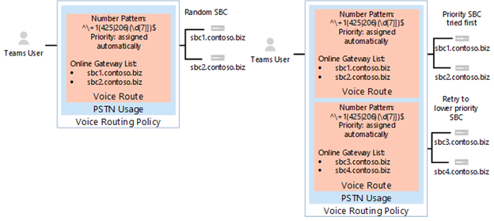
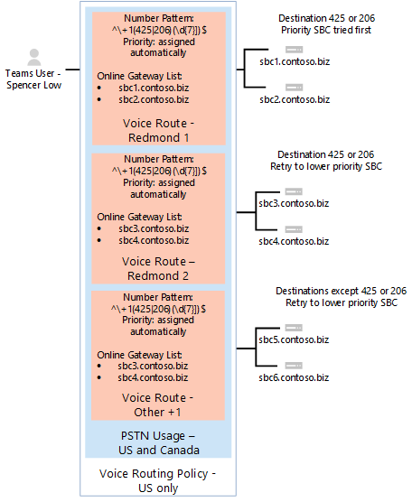

# <a name="configure-direct-routing"></a><span data-ttu-id="9e510-103">Configurar el enrutamiento directo</span><span class="sxs-lookup"><span data-stu-id="9e510-103">Configure Direct Routing</span></span>

  > [!NOTE]
  > <span data-ttu-id="9e510-104">Se trata de una versión preliminar de enrutamiento directo de Microsoft teléfono del sistema.</span><span class="sxs-lookup"><span data-stu-id="9e510-104">This is a preview release of Microsoft Phone System Direct Routing.</span></span>  <span data-ttu-id="9e510-105">Documentación y la funcionalidad del producto están sujetos a cambios.</span><span class="sxs-lookup"><span data-stu-id="9e510-105">Product functionality and documentation are subject to change.</span></span>

<span data-ttu-id="9e510-106">Si no lo ha hecho ya, lea [Planear el enrutamiento directo](plan-direct-routing.md) para los requisitos previos y para revisar otros pasos debe realizar antes de configurar la red del sistema de teléfono de Microsoft.</span><span class="sxs-lookup"><span data-stu-id="9e510-106">If you have not already done so, read [Plan Direct Routing](plan-direct-routing.md) for prerequisites and to review  other steps you’ll need to take before you configure your Microsoft Phone System network.</span></span> 

  > [!NOTE]
  > <span data-ttu-id="9e510-107">Este documento está pensado para profesionales de TI.</span><span class="sxs-lookup"><span data-stu-id="9e510-107">This document is intended for IT professionals.</span></span>  

<span data-ttu-id="9e510-108">En este artículo se describe cómo configurar el enrutamiento directo de Microsoft teléfono del sistema.</span><span class="sxs-lookup"><span data-stu-id="9e510-108">This article describes how to configure Microsoft Phone System Direct Routing.</span></span> <span data-ttu-id="9e510-109">Detalla cómo emparejar un controlador de borde de sesión (SBC) admitidos para el enrutamiento directo y cómo configurar los usuarios de Microsoft Teams para usar el enrutamiento directo para conectarse a la red telefónica pública conmutada (RTC).</span><span class="sxs-lookup"><span data-stu-id="9e510-109">It details how to pair a supported Session Border Controller (SBC) to Direct Routing and how to configure Microsoft Teams users to use Direct Routing to connect to the Public Switched Telephone Network (PSTN).</span></span> <span data-ttu-id="9e510-110">Para completar los pasos que se explican en este artículo, los administradores necesitan un poco familiarizado con los cmdlets de PowerShell.</span><span class="sxs-lookup"><span data-stu-id="9e510-110">To complete the steps explained in this article, administrators need some familiarity with PowerShell cmdlets.</span></span> <span data-ttu-id="9e510-111">Para obtener más información acerca del uso de PowerShell, vea [Configurar el equipo de Windows PowerShell](https://technet.microsoft.com/library/dn362831.aspx).</span><span class="sxs-lookup"><span data-stu-id="9e510-111">For more information about using PowerShell, see [Set up your computer for Windows PowerShell](https://technet.microsoft.com/library/dn362831.aspx).</span></span> 

<span data-ttu-id="9e510-112">Se recomienda que confirme que ya se ha configurado la SBC recomendada por su proveedor SBC:</span><span class="sxs-lookup"><span data-stu-id="9e510-112">We recommend that you confirm that your SBC has already been configured as recommended by your SBC vendor's:</span></span> 

- <span data-ttu-id="9e510-113">Documentación de implementación de AudioCodes</span><span class="sxs-lookup"><span data-stu-id="9e510-113">AudioCodes deployment documentation</span></span> 
- <span data-ttu-id="9e510-114">Documentación de implementación de la cinta de opciones</span><span class="sxs-lookup"><span data-stu-id="9e510-114">Ribbon deployment documentation</span></span>

<span data-ttu-id="9e510-115">Puede configurar el sistema de teléfono de Microsoft y permiten a los usuarios usar el enrutamiento directo, a continuación, configurar Microsoft Teams como el cliente preferido de la llamada al completar los procedimientos siguientes:</span><span class="sxs-lookup"><span data-stu-id="9e510-115">You can configure your Microsoft Phone System and enable  users to use Direct Routing, then set up Microsoft Teams as the preferred calling client by completing the following procedures:</span></span> 

- [<span data-ttu-id="9e510-116">Empareje la SBC con un sistema de teléfono de Microsoft y validar el emparejamiento</span><span class="sxs-lookup"><span data-stu-id="9e510-116">Pair the SBC with a Microsoft Phone System and validate the pairing</span></span>](#pair-the-sbc-to-direct-routing-service-of-phone-system)
- [<span data-ttu-id="9e510-117">Habilitar a usuarios para el servicio de enrutamiento directo</span><span class="sxs-lookup"><span data-stu-id="9e510-117">Enable users for Direct Routing Service</span></span>](#enable-users-for-direct-routing-service)
- [<span data-ttu-id="9e510-118">Asegúrese de que Microsoft Teams es el cliente llamado preferido para los usuarios</span><span class="sxs-lookup"><span data-stu-id="9e510-118">Ensure that Microsoft Teams is the preferred calling client for the users</span></span>](#set-microsoft-teams-as-the-preferred-calling-client-for-the-users) 

## <a name="pair-the-sbc-to-direct-routing-service-of-phone-system"></a><span data-ttu-id="9e510-119">Empareje la SBC para dirigir el servicio de enrutamiento del sistema de teléfono</span><span class="sxs-lookup"><span data-stu-id="9e510-119">Pair the SBC to Direct Routing Service of Phone System</span></span> 

<span data-ttu-id="9e510-120">Los siguientes son los tres pasos de alto nivel para permitirle conectarse o emparejar la SBC a la interfaz de enrutamiento directo:</span><span class="sxs-lookup"><span data-stu-id="9e510-120">The following are the three high-level steps to let you connect, or pair, the SBC to the Direct Routing interface:</span></span> 

- <span data-ttu-id="9e510-121">Conectarse al centro de administración de **Skype para profesionales en línea** con PowerShell</span><span class="sxs-lookup"><span data-stu-id="9e510-121">Connect to **Skype for Business Online** admin center using PowerShell</span></span> 
- <span data-ttu-id="9e510-122">Par el SBC</span><span class="sxs-lookup"><span data-stu-id="9e510-122">Pair the SBC</span></span> 
- <span data-ttu-id="9e510-123">Validar el emparejamiento</span><span class="sxs-lookup"><span data-stu-id="9e510-123">Validate the pairing</span></span> 

### <a name="connect-to--skype-for-business-online-by-using-powershell"></a><span data-ttu-id="9e510-124">Conectarse a Skype para profesionales en línea mediante el uso de PowerShell</span><span class="sxs-lookup"><span data-stu-id="9e510-124">Connect to  Skype for Business Online by using PowerShell</span></span> 

<span data-ttu-id="9e510-125">Puede usar una sesión de PowerShell conectado a los inquilinos para emparejar la SBC a la interfaz de enrutamiento directo.</span><span class="sxs-lookup"><span data-stu-id="9e510-125">You can use a PowerShell session connected to the tenant to pair the SBC to the Direct Routing interface.</span></span> <span data-ttu-id="9e510-126">Para abrir una sesión de PowerShell, siga los pasos descritos en [Configurar el equipo de Windows PowerShell](https://technet.microsoft.com/library/dn362831.aspx).</span><span class="sxs-lookup"><span data-stu-id="9e510-126">To open a PowerShell session, please follow the steps outlined in [Set up your computer for Windows PowerShell](https://technet.microsoft.com/library/dn362831.aspx).</span></span> 
 
<span data-ttu-id="9e510-127">Después de establecer una sesión remota de PowerShell, compruebe que puede ver los comandos para administrar la SBC.</span><span class="sxs-lookup"><span data-stu-id="9e510-127">After you establish a remote PowerShell session, please validate that you can see the commands to manage the SBC.</span></span> <span data-ttu-id="9e510-128">Para validar los comandos, escriba o copiar y pegar en las siguientes opciones en la sesión de PowerShell y presione ENTRAR:</span><span class="sxs-lookup"><span data-stu-id="9e510-128">To validate the commands, type or copy/paste in the following in the PowerShell session and press Enter:</span></span> 

```
gcm *onlinePSTNGateway*
```

<span data-ttu-id="9e510-129">El comando devolverá las cuatro funciones que se muestra aquí que le permiten administrar el SBCs.</span><span class="sxs-lookup"><span data-stu-id="9e510-129">Your command will return the four functions shown here that will let you manage the SBCs.</span></span> 

<pre>
CommandType    Name                       Version    Source 
-----------    ----                       -------    ------ 
Function       Get-CsOnlinePSTNGateway    1.0        tmp_v5fiu1no.wxt 
Function       New-CsOnlinePSTNGateway    1.0        tmp_v5fiu1no.wxt 
Function       Remove-CsOnlinePSTNGateway 1.0        tmp_v5fiu1no.wxt 
Function       Set-CsOnlinePSTNGateway    1.0        tmp_v5fiu1no.wxt
</pre>   


### <a name="pair-the-sbc-to-the-tenant"></a><span data-ttu-id="9e510-130">Par la SBC para el inquilino</span><span class="sxs-lookup"><span data-stu-id="9e510-130">Pair the SBC to the tenant</span></span> 

<span data-ttu-id="9e510-131">Para emparejar la SBC para el inquilino, en la sesión de PowerShell, escriba lo siguiente y presione ENTRAR:</span><span class="sxs-lookup"><span data-stu-id="9e510-131">To pair the SBC to the tenant, in the PowerShell session type the following and press Enter:</span></span> 

```
New-CsOnlinePSTNGateway -Fqdn <SBC FQDN> -SipSignallingPort <SBC SIP Port> -MaxConcurrentSessions <Max Concurrent Sessions the SBC can handle> -Enabled $true 
```
  > [!NOTE]
  > 1. <span data-ttu-id="9e510-132">Se recomienda establecer un límite para el SBC, uso de la información que se encuentra en la documentación de SBC.</span><span class="sxs-lookup"><span data-stu-id="9e510-132">We highly recommend setting a limit for the SBC, using information that can be found in the SBC documentation.</span></span> <span data-ttu-id="9e510-133">El límite activará una notificación si SBC está en el nivel de capacidad.</span><span class="sxs-lookup"><span data-stu-id="9e510-133">The limit will trigger a notification if SBC is at the capacity level.</span></span>
  > 2. <span data-ttu-id="9e510-134">Sólo puede emparejar la SBC con FQDN, donde la parte del dominio del nombre coincide con uno de los dominios registrados en el inquilino, excepto \*. onmicrosoft.com.</span><span class="sxs-lookup"><span data-stu-id="9e510-134">You can only pair the SBC with FQDN, where the domain portion of the name matches one of the domains registered in your tenant, except \*.onmicrosoft.com.</span></span> <span data-ttu-id="9e510-135">Uso de \*. omicrosoft.com los nombres de dominio no es compatible con los nombres de SBC FQDN.</span><span class="sxs-lookup"><span data-stu-id="9e510-135">Using \*.omicrosoft.com domain names is not supported for the SBC FQDN names.</span></span> <span data-ttu-id="9e510-136">Por ejemplo, si tiene dos nombres de dominio:</span><span class="sxs-lookup"><span data-stu-id="9e510-136">For example, if you have two domain names:</span></span><br/><br/>
  > <span data-ttu-id="9e510-137">.xyz **ABC**</span><span class="sxs-lookup"><span data-stu-id="9e510-137">**abc**.xyz</span></span><br/><span data-ttu-id="9e510-138">**ABC**. onmicrosoft.com</span><span class="sxs-lookup"><span data-stu-id="9e510-138">**abc**.onmicrosoft.com</span></span><br/><br/>
  > <span data-ttu-id="9e510-139">Para el nombre SBC, puede usar el nombre sbc.abc.xyz.</span><span class="sxs-lookup"><span data-stu-id="9e510-139">For the SBC name, you can use the name sbc.abc.xyz.</span></span> <span data-ttu-id="9e510-140">Si se intenta emparejar la SBC con un nombre sbc.xyz.abc, el sistema no le, como el dominio no pertenece a este inquilino.</span><span class="sxs-lookup"><span data-stu-id="9e510-140">If you try to pair the SBC with a name sbc.xyz.abc, the system will not let you, as the domain is not owned by this tenant.</span></span>

```
New-CsOnlinePSTNGateway -Identity sbc.contoso.com -Enabled $true -SipSignallingPort 5067 -MaxConcurrentSessions 100 
```
<span data-ttu-id="9e510-141">Devuelve:</span><span class="sxs-lookup"><span data-stu-id="9e510-141">Returns:</span></span>
<pre>
Identity              : sbc.contoso.com 
Fqdn                  : sbc.contoso.com 
SipSignallingPort     : 5067 
FailoverTimeSeconds   : 10 
ForwardCallHistory    : False 
ForwardPai            : False 
SendSipOptions        : True 
MaxConcurrentSessions : 100 
Enabled               : True   
</pre>
<span data-ttu-id="9e510-142">Existen opciones adicionales que se pueden establecer durante el emparejamiento.</span><span class="sxs-lookup"><span data-stu-id="9e510-142">There are additional options that can be set during the pairing.</span></span> <span data-ttu-id="9e510-143">En el ejemplo anterior, sin embargo, solo la mínima necesaria se muestran los parámetros.</span><span class="sxs-lookup"><span data-stu-id="9e510-143">In the previous example, however, only the minimum required parameters are shown.</span></span> 
 
<span data-ttu-id="9e510-144">En la siguiente tabla se enumera los parámetros adicionales que puede usar en la configuración de parámetros para *New-CsOnlinePstnGateway*.</span><span class="sxs-lookup"><span data-stu-id="9e510-144">The following table lists the additional parameters that you can use in setting parameters for *New-CsOnlinePstnGateway*.</span></span> 

|<span data-ttu-id="9e510-145">**¿Obligatorio?**</span><span class="sxs-lookup"><span data-stu-id="9e510-145">**Required?**</span></span>|<span data-ttu-id="9e510-146">**Nombre.**</span><span class="sxs-lookup"><span data-stu-id="9e510-146">**Name**</span></span>|<span data-ttu-id="9e510-147">**Descripción**</span><span class="sxs-lookup"><span data-stu-id="9e510-147">**Description**</span></span>|<span data-ttu-id="9e510-148">**Valor predeterminado**</span><span class="sxs-lookup"><span data-stu-id="9e510-148">**Default**</span></span>|<span data-ttu-id="9e510-149">**Valores posibles**</span><span class="sxs-lookup"><span data-stu-id="9e510-149">**Possible values**</span></span>|<span data-ttu-id="9e510-150">**Tipo y restricciones**</span><span class="sxs-lookup"><span data-stu-id="9e510-150">**Type and restrictions**</span></span>|
|:-----|:-----|:-----|:-----|:-----|:-----|
|<span data-ttu-id="9e510-151">Sí</span><span class="sxs-lookup"><span data-stu-id="9e510-151">Yes</span></span>|<span data-ttu-id="9e510-152">FQDN</span><span class="sxs-lookup"><span data-stu-id="9e510-152">FQDN</span></span>|<span data-ttu-id="9e510-153">El nombre FQDN de la SBC</span><span class="sxs-lookup"><span data-stu-id="9e510-153">The FQDN name of the SBC</span></span> |<span data-ttu-id="9e510-154">Ninguna</span><span class="sxs-lookup"><span data-stu-id="9e510-154">None</span></span>|<span data-ttu-id="9e510-155">Nombre de NoneFQDN, límite 63 caracteres</span><span class="sxs-lookup"><span data-stu-id="9e510-155">NoneFQDN name, limit 63 characters</span></span>|<span data-ttu-id="9e510-156">Cadena, lista de caracteres permitidos y no permitidos en [las convenciones de nomenclatura en Active Directory para equipos, dominios, sitios y unidades organizativas](https://support.microsoft.com/en-us/help/909264)</span><span class="sxs-lookup"><span data-stu-id="9e510-156">String,  list of allowed and disallowed characters on [Naming conventions in Active Directory for computers, domains, sites, and OUs](https://support.microsoft.com/en-us/help/909264)</span></span>|
|<span data-ttu-id="9e510-157">No</span><span class="sxs-lookup"><span data-stu-id="9e510-157">No</span></span>|<span data-ttu-id="9e510-158">MediaBypass</span><span class="sxs-lookup"><span data-stu-id="9e510-158">MediaBypass</span></span> |<span data-ttu-id="9e510-159">El parámetro reservado para uso futuro.</span><span class="sxs-lookup"><span data-stu-id="9e510-159">The parameter reserved for future use.</span></span> <span data-ttu-id="9e510-160">Parámetro indicado de la SBC admite el desvío de medios y el administrador desea usarlo.</span><span class="sxs-lookup"><span data-stu-id="9e510-160">Parameter indicated of the SBC supports Media Bypass and the administrator wants to use it.</span></span>|<span data-ttu-id="9e510-161">Ninguna</span><span class="sxs-lookup"><span data-stu-id="9e510-161">None</span></span>|<span data-ttu-id="9e510-162">Verdadero</span><span class="sxs-lookup"><span data-stu-id="9e510-162">True</span></span><br/><span data-ttu-id="9e510-163">Falso</span><span class="sxs-lookup"><span data-stu-id="9e510-163">False</span></span>|<span data-ttu-id="9e510-164">Booleano</span><span class="sxs-lookup"><span data-stu-id="9e510-164">Boolean</span></span>|
|<span data-ttu-id="9e510-165">Sí</span><span class="sxs-lookup"><span data-stu-id="9e510-165">Yes</span></span>|<span data-ttu-id="9e510-166">SipSignallingPort</span><span class="sxs-lookup"><span data-stu-id="9e510-166">SipSignallingPort</span></span> |<span data-ttu-id="9e510-167">Puerto de escucha usado para la comunicación con los servicios de enrutamiento directa mediante el protocolo de seguridad de capa de transporte (TLS).</span><span class="sxs-lookup"><span data-stu-id="9e510-167">Listening port used for communicating with Direct Routing services by using the Transport Layer Security (TLS) protocol.</span></span>|<span data-ttu-id="9e510-168">Ninguna</span><span class="sxs-lookup"><span data-stu-id="9e510-168">None</span></span>|<span data-ttu-id="9e510-169">Cualquier puerto</span><span class="sxs-lookup"><span data-stu-id="9e510-169">Any port</span></span>|<span data-ttu-id="9e510-170">0 a 65535</span><span class="sxs-lookup"><span data-stu-id="9e510-170">0 to 65535</span></span> |
|<span data-ttu-id="9e510-171">No</span><span class="sxs-lookup"><span data-stu-id="9e510-171">No</span></span>|<span data-ttu-id="9e510-172">FailoverTimeSeconds</span><span class="sxs-lookup"><span data-stu-id="9e510-172">FailoverTimeSeconds</span></span> |<span data-ttu-id="9e510-173">Cuando se establece en 10 (valor predeterminado), las llamadas salientes que no hay respondidas por la puerta de enlace dentro de 10 segundos se enrutan al siguiente tronco disponible; Si no hay ningún troncos adicionales, automáticamente se interrumpe la llamada.</span><span class="sxs-lookup"><span data-stu-id="9e510-173">When set to 10 (default value), outbound calls that are not answered by the gateway within 10 seconds are routed to the next available trunk; if there are no additional trunks, then the call is automatically dropped.</span></span> <span data-ttu-id="9e510-174">En una organización con redes lentas y respuestas a las puertas de enlace, puede tener como resultado interrupciones innecesarias de las llamadas.</span><span class="sxs-lookup"><span data-stu-id="9e510-174">In an organization with slow networks and gateway responses, that could potentially result in calls being dropped unnecessarily.</span></span> <span data-ttu-id="9e510-175">El valor predeterminado es 10.</span><span class="sxs-lookup"><span data-stu-id="9e510-175">The default value is 10.</span></span>|<span data-ttu-id="9e510-176">10</span><span class="sxs-lookup"><span data-stu-id="9e510-176">10</span></span>|<span data-ttu-id="9e510-177">Número</span><span class="sxs-lookup"><span data-stu-id="9e510-177">Number</span></span>|<span data-ttu-id="9e510-178">Int</span><span class="sxs-lookup"><span data-stu-id="9e510-178">Int</span></span>|
|<span data-ttu-id="9e510-179">No</span><span class="sxs-lookup"><span data-stu-id="9e510-179">No</span></span>|<span data-ttu-id="9e510-180">ForwardCallHistory</span><span class="sxs-lookup"><span data-stu-id="9e510-180">ForwardCallHistory</span></span> |<span data-ttu-id="9e510-181">Indica si la información del historial de llamadas se reenviará a través del tronco.</span><span class="sxs-lookup"><span data-stu-id="9e510-181">Indicates whether call history information will be forwarded through the trunk.</span></span> <span data-ttu-id="9e510-182">Si se habilita, el Proxy de RTC de Office 365 envía dos encabezados: información de historial y remitido por.</span><span class="sxs-lookup"><span data-stu-id="9e510-182">If enabled, the Office 365 PSTN Proxy sends two headers: History-info and Referred-By.</span></span> <span data-ttu-id="9e510-183">El valor predeterminado es **False** ($False).</span><span class="sxs-lookup"><span data-stu-id="9e510-183">The default value is **False** ($False).</span></span> |<span data-ttu-id="9e510-184">Falso</span><span class="sxs-lookup"><span data-stu-id="9e510-184">False</span></span>|<span data-ttu-id="9e510-185">Verdadero</span><span class="sxs-lookup"><span data-stu-id="9e510-185">True</span></span><br/><span data-ttu-id="9e510-186">Falso</span><span class="sxs-lookup"><span data-stu-id="9e510-186">False</span></span>|<span data-ttu-id="9e510-187">Booleano</span><span class="sxs-lookup"><span data-stu-id="9e510-187">Boolean</span></span>|
|<span data-ttu-id="9e510-188">No</span><span class="sxs-lookup"><span data-stu-id="9e510-188">No</span></span>|<span data-ttu-id="9e510-189">ForwardPAI</span><span class="sxs-lookup"><span data-stu-id="9e510-189">ForwardPAI</span></span>|<span data-ttu-id="9e510-190">Indica si el encabezado P-Asserted-Identity (PAI) se reenviará junto con la llamada.</span><span class="sxs-lookup"><span data-stu-id="9e510-190">Indicates whether the P-Asserted-Identity (PAI) header will be forwarded along with the call.</span></span> <span data-ttu-id="9e510-191">El encabezado PAI proporciona una forma de verificar la identidad del autor de la llamada.</span><span class="sxs-lookup"><span data-stu-id="9e510-191">The PAI header provides a way to verify the identity of the caller.</span></span> <span data-ttu-id="9e510-192">El valor predeterminado es **False** ($False).</span><span class="sxs-lookup"><span data-stu-id="9e510-192">The default value is **False** ($False).</span></span>|<span data-ttu-id="9e510-193">Falso</span><span class="sxs-lookup"><span data-stu-id="9e510-193">False</span></span>|<span data-ttu-id="9e510-194">Verdadero</span><span class="sxs-lookup"><span data-stu-id="9e510-194">True</span></span><br/><span data-ttu-id="9e510-195">Falso</span><span class="sxs-lookup"><span data-stu-id="9e510-195">False</span></span>|<span data-ttu-id="9e510-196">Booleano</span><span class="sxs-lookup"><span data-stu-id="9e510-196">Boolean</span></span>|
|<span data-ttu-id="9e510-197">No</span><span class="sxs-lookup"><span data-stu-id="9e510-197">No</span></span>|<span data-ttu-id="9e510-198">SendSIPOptions</span><span class="sxs-lookup"><span data-stu-id="9e510-198">SendSIPOptions</span></span> |<span data-ttu-id="9e510-199">Define si un SBC se o no enviará las opciones de SIP.</span><span class="sxs-lookup"><span data-stu-id="9e510-199">Defines if an SBC will or will not send the SIP options.</span></span> <span data-ttu-id="9e510-200">Si deshabilita esta opción, la SBC se excluirán del sistema de supervisión y alertas.</span><span class="sxs-lookup"><span data-stu-id="9e510-200">If disabled, the SBC will be excluded from Monitoring and Alerting system.</span></span> <span data-ttu-id="9e510-201">Se recomienda encarecidamente que habilite las opciones de SIP.</span><span class="sxs-lookup"><span data-stu-id="9e510-201">We highly recommend that you enable SIP options.</span></span> <span data-ttu-id="9e510-202">Valor predeterminado es **True**.</span><span class="sxs-lookup"><span data-stu-id="9e510-202">Default value is **True**.</span></span> |<span data-ttu-id="9e510-203">True</span><span class="sxs-lookup"><span data-stu-id="9e510-203">True</span></span>|<span data-ttu-id="9e510-204">True</span><span class="sxs-lookup"><span data-stu-id="9e510-204">True</span></span><br/><span data-ttu-id="9e510-205">Falso</span><span class="sxs-lookup"><span data-stu-id="9e510-205">False</span></span>|<span data-ttu-id="9e510-206">Booleano</span><span class="sxs-lookup"><span data-stu-id="9e510-206">Boolean</span></span>|
|<span data-ttu-id="9e510-207">No</span><span class="sxs-lookup"><span data-stu-id="9e510-207">No</span></span>|<span data-ttu-id="9e510-208">MaxConcurrentSessions</span><span class="sxs-lookup"><span data-stu-id="9e510-208">MaxConcurrentSessions</span></span> |<span data-ttu-id="9e510-209">Usada por el sistema de alertas.</span><span class="sxs-lookup"><span data-stu-id="9e510-209">Used by alerting system.</span></span> <span data-ttu-id="9e510-210">Cuando se establece ningún valor, el sistema de alertas generará una alerta para el Administrador de inquilinos cuando el número de sesión simultáneo es 90% o mayor que este valor.</span><span class="sxs-lookup"><span data-stu-id="9e510-210">When any value is set, the alerting system will generate an alert to the tenant administrator when the number of concurrent session is 90% or higher than this value.</span></span> <span data-ttu-id="9e510-211">Si no se establece el parámetro, no se generan las alertas.</span><span class="sxs-lookup"><span data-stu-id="9e510-211">If parameter is not set, the alerts are not generated.</span></span> <span data-ttu-id="9e510-212">Sin embargo, el sistema de supervisión informará número de sesiones simultáneas cada 24 horas.</span><span class="sxs-lookup"><span data-stu-id="9e510-212">However, the monitoring system will report number of concurrent session every 24 hours.</span></span> |<span data-ttu-id="9e510-213">Null</span><span class="sxs-lookup"><span data-stu-id="9e510-213">Null</span></span>|<span data-ttu-id="9e510-214">Null</span><span class="sxs-lookup"><span data-stu-id="9e510-214">Null</span></span><br/><span data-ttu-id="9e510-215">1 y 100.000.</span><span class="sxs-lookup"><span data-stu-id="9e510-215">1 to 100,000</span></span> ||
|<span data-ttu-id="9e510-216">No</span><span class="sxs-lookup"><span data-stu-id="9e510-216">No</span></span>|<span data-ttu-id="9e510-217">Habilitado \*</span><span class="sxs-lookup"><span data-stu-id="9e510-217">Enabled\*</span></span>|<span data-ttu-id="9e510-218">Se usa para habilitar este SBC para las llamadas salientes.</span><span class="sxs-lookup"><span data-stu-id="9e510-218">Used to enable this SBC for outbound calls.</span></span> <span data-ttu-id="9e510-219">Puede usarse para quitar temporalmente el SBC, mientras se está actualizando o durante el mantenimiento.</span><span class="sxs-lookup"><span data-stu-id="9e510-219">Can be used to temporarily remove the SBC, while it is being updated or during maintenance.</span></span> |<span data-ttu-id="9e510-220">Falso</span><span class="sxs-lookup"><span data-stu-id="9e510-220">False</span></span>|<span data-ttu-id="9e510-221">Verdadero</span><span class="sxs-lookup"><span data-stu-id="9e510-221">True</span></span><br/><span data-ttu-id="9e510-222">Falso</span><span class="sxs-lookup"><span data-stu-id="9e510-222">False</span></span>|<span data-ttu-id="9e510-223">Booleano</span><span class="sxs-lookup"><span data-stu-id="9e510-223">Boolean</span></span>|
 
### <a name="verify-the-sbc-pairing"></a><span data-ttu-id="9e510-224">Compruebe el emparejamiento de SBC</span><span class="sxs-lookup"><span data-stu-id="9e510-224">Verify the SBC pairing</span></span> 

<span data-ttu-id="9e510-225">Compruebe la conexión:</span><span class="sxs-lookup"><span data-stu-id="9e510-225">Verify the connection:</span></span> 
- <span data-ttu-id="9e510-226">Compruebe si la SBC está en la lista de SBCs emparejados.</span><span class="sxs-lookup"><span data-stu-id="9e510-226">Check if the SBC is on the list of paired SBCs.</span></span> 
- <span data-ttu-id="9e510-227">Validar las opciones de SIP.</span><span class="sxs-lookup"><span data-stu-id="9e510-227">Validate SIP Options.</span></span> 
 
#### <a name="validate-if-sbc-is-on-the-list-of-paired-sbcs"></a><span data-ttu-id="9e510-228">Validar si SBC está en la lista de SBCs emparejados</span><span class="sxs-lookup"><span data-stu-id="9e510-228">Validate if SBC is on the list of paired SBCs</span></span> 

<span data-ttu-id="9e510-229">Después de par el SBC, validar que el SBC está presente en la lista de SBCs emparejados ejecutando el siguiente comando en una sesión remota de PowerShell:`Get-CSOnlinePSTNGateway`</span><span class="sxs-lookup"><span data-stu-id="9e510-229">After you pair the SBC, validate that the SBC is present in the list of paired SBCs by running the following command  in a remote PowerShell session: `Get-CSOnlinePSTNGateway`</span></span>

<span data-ttu-id="9e510-230">La puerta de enlace emparejado debe aparecer en la lista tal como se muestra en el ejemplo siguiente y compruebe que el parámetro *Enabled* muestra el valor **True**.</span><span class="sxs-lookup"><span data-stu-id="9e510-230">The paired gateway should appear in the list as shown in the example below, and verify that the parameter *Enabled* displays the value **True**.</span></span> <span data-ttu-id="9e510-231">Escriba:</span><span class="sxs-lookup"><span data-stu-id="9e510-231">Enter:</span></span>

```
Get-CsOnlinePSTNGateway -Identity sbc.contoso.com  
```
<span data-ttu-id="9e510-232">Que devuelve:</span><span class="sxs-lookup"><span data-stu-id="9e510-232">Which returns:</span></span>
<pre>
Identity              : sbc.contoso.com  
Fqdn                  : sbc.contoso.com 
SipSignallingPort     : 5067 
CodecPriority         : SILKWB,SILKNB,PCMU,PCMA 
ExcludedCodecs        :  
FailoverTimeSeconds   : 10 
ForwardCallHistory    : False 
ForwardPai            : False 
SendSipOptions        : True 
MaxConcurrentSessions : 100 
Enabled               : True 
</pre>

#### <a name="validate-sip-options-flow"></a><span data-ttu-id="9e510-233">Validar flujo de opciones de SIP</span><span class="sxs-lookup"><span data-stu-id="9e510-233">Validate SIP Options flow</span></span> 

<span data-ttu-id="9e510-234">Para validar el uso de las opciones de SIP saliente emparejamiento, usar la interfaz de administración de SBC y ver que la SBC obtener 200 respuestas Aceptar a las opciones de salida.</span><span class="sxs-lookup"><span data-stu-id="9e510-234">To validate the pairing using outgoing SIP Options, use the SBC management interface and see that the SBC get 200 OK responses to the outgoing OPTIONS.</span></span>
  
<span data-ttu-id="9e510-235">Cuando el enrutamiento directo ve opciones entrantes, se iniciará salientes opciones de envío para el FQDN de SBC configurado en el campo de encabezado de contacto en el mensaje entrante de opciones.</span><span class="sxs-lookup"><span data-stu-id="9e510-235">When Direct Routing sees incoming OPTIONS, it will start sending outgoing options to the SBC FQDN configured in the Contact header field in the incoming OPTIONS message.</span></span> 

<span data-ttu-id="9e510-236">Para validar el uso de las opciones de SIP entrantes de emparejamiento, usar la interfaz de administración de SBC y ver que la SBC Obtiene la respuesta en los mensajes de las opciones que provienen de enrutamiento directo y que el código de respuesta es 200 Aceptar.</span><span class="sxs-lookup"><span data-stu-id="9e510-236">To validate the pairing using incoming SIP Options, use the SBC management interface and see that the SBC gets reply on the OPTIONS messages coming in from Direct Routing and that the response code is 200 OK.</span></span>  

## <a name="enable-users-for-direct-routing-service"></a><span data-ttu-id="9e510-237">Habilitar a usuarios para el servicio de enrutamiento directo</span><span class="sxs-lookup"><span data-stu-id="9e510-237">Enable users for Direct Routing Service</span></span> 

<span data-ttu-id="9e510-238">Cuando esté listo para habilitar a los usuarios para el servicio de enrutamiento directa, siga estos pasos:</span><span class="sxs-lookup"><span data-stu-id="9e510-238">When you are ready to enable users for the Direct Routing Service, follow these steps:</span></span> 

1. <span data-ttu-id="9e510-239">Crear un usuario en Office 365 y asigna una licencia de sistema de teléfono.</span><span class="sxs-lookup"><span data-stu-id="9e510-239">Create a user in Office 365 and assign a phone system license.</span></span> 
2. <span data-ttu-id="9e510-240">Asegúrese de que el usuario está hospedado en Skype para profesionales en línea.</span><span class="sxs-lookup"><span data-stu-id="9e510-240">Ensure that the user is homed in Skype for Business Online.</span></span> 
3. <span data-ttu-id="9e510-241">Configurar el número de teléfono y habilitar correo de voz y enterprise voice.</span><span class="sxs-lookup"><span data-stu-id="9e510-241">Configure the phone number and enable enterprise voice and voicemail.</span></span> 
4. <span data-ttu-id="9e510-242">Configurar enrutamiento de voz.</span><span class="sxs-lookup"><span data-stu-id="9e510-242">Configure voice routing.</span></span> <span data-ttu-id="9e510-243">La ruta se validará automáticamente.</span><span class="sxs-lookup"><span data-stu-id="9e510-243">The route is automatically validated.</span></span>  

### <a name="create-a-user-in-office-365-and-assign-the-license"></a><span data-ttu-id="9e510-244">Crear un usuario en Office 365 y asignar la licencia</span><span class="sxs-lookup"><span data-stu-id="9e510-244">Create a user in Office 365 and assign the license</span></span> 

<span data-ttu-id="9e510-245">Hay dos opciones para crear un nuevo usuario en Office 365.</span><span class="sxs-lookup"><span data-stu-id="9e510-245">There are two options for creating a new user in Office 365.</span></span> <span data-ttu-id="9e510-246">Sin embargo, se recomienda que la organización, seleccione y utilice una opción para evitar problemas de enrutamiento:</span><span class="sxs-lookup"><span data-stu-id="9e510-246">However, we recommend that your organization select and use one option to avoid routing issues:</span></span> 

- <span data-ttu-id="9e510-247">Crear el usuario en Active Directory local y sincronizar el usuario a la nube.</span><span class="sxs-lookup"><span data-stu-id="9e510-247">Create the user in on-premise Active Directory and sync the user to the cloud.</span></span> <span data-ttu-id="9e510-248">Vea [directorios de integrar su local con Azure Active Directory](https://docs.microsoft.com/en-us/azure/active-directory/connect/active-directory-aadconnect).</span><span class="sxs-lookup"><span data-stu-id="9e510-248">See [Integrate your on-premises directories with Azure Active Directory](https://docs.microsoft.com/en-us/azure/active-directory/connect/active-directory-aadconnect).</span></span>  
- <span data-ttu-id="9e510-249">Crear el usuario directamente en el Portal de administrador de Office 365.</span><span class="sxs-lookup"><span data-stu-id="9e510-249">Create the user directly in the Office 365 Administrator Portal.</span></span> <span data-ttu-id="9e510-250">Vea [Agregar usuarios individualmente o de forma masiva a Office 365 - ayuda de administración](https://support.office.com/en-us/article/Add-users-individually-or-in-bulk-to-Office-365-Admin-Help-1970f7d6-03b5-442f-b385-5880b9c256ec).</span><span class="sxs-lookup"><span data-stu-id="9e510-250">See [Add users individually or in bulk to Office 365 - Admin Help](https://support.office.com/en-us/article/Add-users-individually-or-in-bulk-to-Office-365-Admin-Help-1970f7d6-03b5-442f-b385-5880b9c256ec).</span></span> 

  <span data-ttu-id="9e510-251">Si se elabora el sistema que coexiste con Skype para 2015 empresarial o Lync 2010 o 2013 local, la única opción compatible es crear el usuario en Active Directory local y sincronizar el usuario a la nube (opción 1).</span><span class="sxs-lookup"><span data-stu-id="9e510-251">If you build the system that co-exists with Skype for Business 2015 or Lync 2010/2013 on-premises, the only supported option is to create the user in on-premises Active Directory and sync the user to the cloud (Option 1).</span></span> 

<span data-ttu-id="9e510-252">Licencias necesarias:</span><span class="sxs-lookup"><span data-stu-id="9e510-252">Required licenses:</span></span> 

- <span data-ttu-id="9e510-253">Office 365 E3 de empresa (incluidos SfB Plan2, Exchange Plan2 y equipos) + del sistema de teléfono</span><span class="sxs-lookup"><span data-stu-id="9e510-253">Office 365 Enterprise E3 (including SfB Plan2, Exchange Plan2, and Teams) + Phone System</span></span>  
- <span data-ttu-id="9e510-254">Office 365 Enterprise E5 (incluidos SfB Plan2, Plan2 de Exchange, los equipos y del sistema de teléfono)</span><span class="sxs-lookup"><span data-stu-id="9e510-254">Office 365 Enterprise E5  (including SfB Plan2, Exchange Plan2, Teams, and Phone System)</span></span> 

<span data-ttu-id="9e510-255">Licencias opcionales:</span><span class="sxs-lookup"><span data-stu-id="9e510-255">Optional licenses:</span></span> 

- <span data-ttu-id="9e510-256">Plan de llamada</span><span class="sxs-lookup"><span data-stu-id="9e510-256">Calling Plan</span></span> 
- <span data-ttu-id="9e510-257">Audioconferencia</span><span class="sxs-lookup"><span data-stu-id="9e510-257">Audio Conferencing</span></span> 

### <a name="ensure-that-the-user-is-homed-in-skype-for-business-online"></a><span data-ttu-id="9e510-258">Asegúrese de que el usuario está hospedado en Skype para profesionales en línea</span><span class="sxs-lookup"><span data-stu-id="9e510-258">Ensure that the user is homed in Skype for Business Online</span></span> 

<span data-ttu-id="9e510-259">Enrutamiento directo requiere que el usuario a estar alojado en Skype para profesionales en línea.</span><span class="sxs-lookup"><span data-stu-id="9e510-259">Direct Routing requires the user to be homed in Skype for Business Online.</span></span> <span data-ttu-id="9e510-260">Puede comprobarlo mirando el parámetro RegistrarPool.</span><span class="sxs-lookup"><span data-stu-id="9e510-260">You can check this by looking at the RegistrarPool parameter.</span></span> <span data-ttu-id="9e510-261">Debe tener un valor en el dominio infra.lync.com.</span><span class="sxs-lookup"><span data-stu-id="9e510-261">It needs to have a value in the infra.lync.com domain.</span></span>

1. <span data-ttu-id="9e510-262">Conectar con PowerShell remoto.</span><span class="sxs-lookup"><span data-stu-id="9e510-262">Connect to remote PowerShell.</span></span>
2. <span data-ttu-id="9e510-263">Problema el comando:</span><span class="sxs-lookup"><span data-stu-id="9e510-263">Issue the command:</span></span> 

```
Get-CsOnlineUser -Identity "<User name>" | fl RegistrarPool
``` 

### <a name="configure-the-phone-number-and-enable-enterprise-voice-and-voicemail"></a><span data-ttu-id="9e510-264">Configurar el número de teléfono y habilitar correo de voz y telefonía IP empresarial</span><span class="sxs-lookup"><span data-stu-id="9e510-264">Configure the phone number and enable enterprise voice and voicemail</span></span> 

<span data-ttu-id="9e510-265">Una vez que haya creado el usuario y asigna una licencia, el siguiente paso es configurar su número de teléfono y correo de voz.</span><span class="sxs-lookup"><span data-stu-id="9e510-265">After you have created the user and assigned a license, the next step is to configure their phone number and voicemail.</span></span> <span data-ttu-id="9e510-266">Esto puede realizarse en un solo paso.</span><span class="sxs-lookup"><span data-stu-id="9e510-266">This can be done in one step.</span></span> 

<span data-ttu-id="9e510-267">Para agregar el número de teléfono y habilitar para correo de voz:</span><span class="sxs-lookup"><span data-stu-id="9e510-267">To add the phone number and enable for voicemail:</span></span>
 
1. <span data-ttu-id="9e510-268">Conectarse a una sesión remota de PowerShell.</span><span class="sxs-lookup"><span data-stu-id="9e510-268">Connect to a remote PowerShell session.</span></span> 
2. <span data-ttu-id="9e510-269">Escriba el comando:</span><span class="sxs-lookup"><span data-stu-id="9e510-269">Enter the command:</span></span> 
    
```
Set-CsUser -Identity "<User name>" -EnterpriseVoiceEnabled $true -HostedVoiceMail $true -OnPremLineURI tel:+ phone number
```

<span data-ttu-id="9e510-270">Por ejemplo, para agregar un número de teléfono para el usuario "Sergio bajo", escribiría lo siguiente:</span><span class="sxs-lookup"><span data-stu-id="9e510-270">For example, to add a phone number for user “Spencer Low,” you would enter the following:</span></span> 

```
Set-CsUser - “Spencer Low" -OnPremisLineURI tel:+14255388797 -EnterpriseVoiceEnabled $true -HostedVoiceMail $true
```

<span data-ttu-id="9e510-271">El número de teléfono utilizado debe configurarse como un número de teléfono E.164 completo con el código de país.</span><span class="sxs-lookup"><span data-stu-id="9e510-271">The phone number used has to be configured as a full E.164 phone number with country code.</span></span> 

  > [!NOTE]
  > <span data-ttu-id="9e510-272">Si el número de teléfono del usuario se administra en local, use local Skype para Shell de administración de negocio o Panel de Control para configurar el número de teléfono del usuario.</span><span class="sxs-lookup"><span data-stu-id="9e510-272">If the user’s phone number is managed on premises, use on-premises Skype for Business Management Shell or Control Panel to configure the user's phone number.</span></span> 

### <a name="configure-voice-routing"></a><span data-ttu-id="9e510-273">Configurar enrutamiento de voz</span><span class="sxs-lookup"><span data-stu-id="9e510-273">Configure Voice Routing</span></span> 

<span data-ttu-id="9e510-274">Microsoft Phone System tiene un mecanismo de enrutamiento que permite que una llamada se envíen a un SBC específico en función de:</span><span class="sxs-lookup"><span data-stu-id="9e510-274">Microsoft Phone System has a routing mechanism that allows a call to be sent to a specific SBC based on:</span></span> 

- <span data-ttu-id="9e510-275">Patrón de número llamado</span><span class="sxs-lookup"><span data-stu-id="9e510-275">Called number pattern</span></span> 
- <span data-ttu-id="9e510-276">Patrón de número llamado + usuario específico que realiza la llamada</span><span class="sxs-lookup"><span data-stu-id="9e510-276">Called number pattern + Specific User who makes the call</span></span>
 
<span data-ttu-id="9e510-277">SBCs se pueden designar como activo y copia de seguridad.</span><span class="sxs-lookup"><span data-stu-id="9e510-277">SBCs can be designated as active and backup.</span></span> <span data-ttu-id="9e510-278">Es decir, cuando la SBC que está configurado como activo para este patrón de número, o patrón de número + usuario específico, no está disponible y, a continuación, se van a enrutar las llamadas a un SBC copia de seguridad.</span><span class="sxs-lookup"><span data-stu-id="9e510-278">That means when the SBC that is configured as active for this number pattern, or number pattern + specific user, is not available, then the calls will be routed to a backup SBC.</span></span>
 
<span data-ttu-id="9e510-279">Enrutamiento de llamadas se compone de los siguientes elementos:</span><span class="sxs-lookup"><span data-stu-id="9e510-279">Call routing is made up of the following elements:</span></span> 
- <span data-ttu-id="9e510-280">Directiva de enrutamiento de voz: contenedor de usos de RTC; se pueden asignar a un usuario o a varios usuarios</span><span class="sxs-lookup"><span data-stu-id="9e510-280">Voice Routing Policy – container for PSTN Usages; can be assigned to a user or to multiple users</span></span> 
- <span data-ttu-id="9e510-281">Usos de RTC: contenedor de rutas de voz y los usos de RTC; se pueden compartir en diferentes directivas de enrutamiento de voz</span><span class="sxs-lookup"><span data-stu-id="9e510-281">PSTN Usages – container for Voice Routes and PSTN Usages; can be shared in different Voice Routing Policies</span></span> 
- <span data-ttu-id="9e510-282">Rutas: patrón de número y un conjunto de puertas de enlace RTC en línea que se usará para las llamadas donde número de llamada coincide con el patrón de voz</span><span class="sxs-lookup"><span data-stu-id="9e510-282">Voice Routes – number pattern and set of Online PSTN Gateways to use for calls where calling number matches the pattern</span></span> 
- <span data-ttu-id="9e510-283">Puerta de enlace de RTC Online - puntero en SBC, también almacena la configuración que se aplica cuando se llama a través de SBC, como hacia delante P-Asserted-Identity (PAI) o códecs preferido; se pueden agregar a las rutas de voz</span><span class="sxs-lookup"><span data-stu-id="9e510-283">Online PSTN Gateway - pointer at SBC, also stores the configuration that is applied when call is placed via the SBC, such as forward P-Asserted-Identity (PAI) or Preferred Codecs; can be added to Voice Routes</span></span> 

#### <a name="creating-a-voice-routing-policy-with-one-pstn-usage"></a><span data-ttu-id="9e510-284">Creación de una directiva de enrutamiento de voz con un uso de RTC</span><span class="sxs-lookup"><span data-stu-id="9e510-284">Creating a voice routing policy with one PSTN Usage</span></span> 

<span data-ttu-id="9e510-285">En el siguiente diagrama se muestra dos ejemplos de las directivas de enrutamiento de voz en el flujo de la llamada.</span><span class="sxs-lookup"><span data-stu-id="9e510-285">The following diagram shows two examples of voice routing policies in call flow.</span></span>

<span data-ttu-id="9e510-286">**Llamar al flujo de 1 (a la izquierda):** Si un usuario realiza una llamada a +1 425 XXX XX XX o +1 206 XXX XX XX, la llamada se enruta a SBC sbc1<span></span>. contoso.biz o sbc2<span></span>. contoso.biz.</span><span class="sxs-lookup"><span data-stu-id="9e510-286">**Call Flow 1 (on the left):** If a user makes a call to  +1 425 XXX XX XX or +1 206 XXX XX XX, the call is routed  to SBC sbc1<span></span>.contoso.biz or sbc2<span></span>.contoso.biz.</span></span> <span data-ttu-id="9e510-287">Si ninguno de los dos sbc1<span></span>. contoso.biz ni sbc2<span></span>. contoso.biz están disponibles, se interrumpe la llamada.</span><span class="sxs-lookup"><span data-stu-id="9e510-287">If neither sbc1<span></span>.contoso.biz nor sbc2<span></span>.contoso.biz are available, the call is dropped.</span></span> 

<span data-ttu-id="9e510-288">**2 de flujo de llamadas (a la derecha):** Si un usuario realiza una llamada a +1 425 XXX XX XX o +1 206 XXX XX XX, la llamada se enruta primero a SBC sbc1<span></span>. contoso.biz o sbc2<span></span>. contoso.biz.</span><span class="sxs-lookup"><span data-stu-id="9e510-288">**Call Flow 2 (on the right):** If a user makes a call to  +1 425 XXX XX XX or +1 206 XXX XX XX, the call is first routed to SBC sbc1<span></span>.contoso.biz or sbc2<span></span>.contoso.biz.</span></span> <span data-ttu-id="9e510-289">Si ninguno de los dos SBC está disponible, se intentará la ruta con la prioridad más baja (sbc3<span></span>. contoso.biz y sbc4<span></span>. contoso.biz).</span><span class="sxs-lookup"><span data-stu-id="9e510-289">If neither SBC is available, the route with lower priority will be tried (sbc3<span></span>.contoso.biz and sbc4<span></span>.contoso.biz).</span></span> <span data-ttu-id="9e510-290">Si ninguno de los SBCs están disponible, se interrumpe la llamada.</span><span class="sxs-lookup"><span data-stu-id="9e510-290">If none of the SBCs are available, the call is dropped.</span></span> 



<span data-ttu-id="9e510-292">En ambos ejemplos, mientras que la ruta de voz se asigna prioridades, el SBCs en las rutas se intentan en orden aleatorio.</span><span class="sxs-lookup"><span data-stu-id="9e510-292">In both examples, while the Voice Route is assigned priorities, the SBCs in the routes are tried in random order.</span></span>

  > [!NOTE]
  > <span data-ttu-id="9e510-293">A menos que el usuario también dispone de una licencia de llamar a planeación de Microsoft, se quitan las llamadas a cualquier número excepto los números que coincidan con los patrones de + +1 425 XXX XX XX o +1 206 XXX XX XX en el ejemplo de configuración.</span><span class="sxs-lookup"><span data-stu-id="9e510-293">Unless the user also has a Microsoft Calling Plan license, calls to any number except numbers matching the patterns + +1 425 XXX XX XX or +1 206 XXX XX XX in the example configuration are dropped.</span></span> <span data-ttu-id="9e510-294">Si el usuario tiene una licencia de planeación de la llamada, la llamada se enruta automáticamente según las directivas de la planeación de una llamada a Microsoft.</span><span class="sxs-lookup"><span data-stu-id="9e510-294">If the user has a Calling Plan license, the call is automatically routed according to the policies of  the Microsoft Calling Plan.</span></span> 

<span data-ttu-id="9e510-295">La planeación de una llamada a Microsoft se aplica automáticamente como la última ruta a todos los usuarios con la licencia de llamar a planeación de Microsoft y no requiere la configuración de enrutamiento de llamada adicionales.</span><span class="sxs-lookup"><span data-stu-id="9e510-295">The Microsoft Calling Plan applies automatically as the last route to all users with the Microsoft Calling Plan license and does not require additional call routing configuration.</span></span>

<span data-ttu-id="9e510-296">En el ejemplo que se muestra en el diagrama siguiente, se agrega una ruta de voz para enviar las llamadas a todos los demás Estados Unidos y Canadá número (llamadas que vaya a patrón de número llamado + 1 XXX XXX XX XX).</span><span class="sxs-lookup"><span data-stu-id="9e510-296">In the example shown in the following diagram, a voice route is added to send calls to all other US and Canadian number (calls that go to called number pattern +1 XXX XXX XX XX).</span></span>


<span data-ttu-id="9e510-298">Para todas las llamadas, si un usuario tiene dos licencias (sistema de teléfono de Microsoft y llamar a planeación de Microsoft), se usa ruta automático.</span><span class="sxs-lookup"><span data-stu-id="9e510-298">For all other calls, if a user has both licenses (Microsoft Phone System and Microsoft Calling Plan), Automatic Route is used.</span></span> <span data-ttu-id="9e510-299">Si no hay nada coincide con los patrones de números en las rutas de voz en línea creadas por el administrador, se enruta a través de una llamada a planeación de Microsoft.</span><span class="sxs-lookup"><span data-stu-id="9e510-299">If nothing matches the number patterns in the administrator-created online voice routes, route via Microsoft Calling Plan.</span></span>

<span data-ttu-id="9e510-300">Si el usuario tiene sólo del sistema de teléfono de Microsoft, se interrumpe la llamada porque no hay reglas de coincidencia están disponibles.</span><span class="sxs-lookup"><span data-stu-id="9e510-300">If the user has only Microsoft Phone System, the call is dropped because no matching rules are available.</span></span>

  > [!NOTE]
  > <span data-ttu-id="9e510-301">El valor de la prioridad de ruta "Otros + 1" no importa en este caso, como hay sólo una ruta que coincide con el patrón + 1 XXX XXX XX XX.</span><span class="sxs-lookup"><span data-stu-id="9e510-301">The Priority value for route “Other +1” doesn’t matter in this case, as there is only one route that matches the pattern +1 XXX XXX XX XX.</span></span> <span data-ttu-id="9e510-302">Si un usuario realiza una llamada a + 1 324 567 89 89 y sbc5.contoso.biz y sbc6.contoso.biz no están disponibles, se interrumpe la llamada.</span><span class="sxs-lookup"><span data-stu-id="9e510-302">If a user makes a call to +1 324 567 89 89 and both sbc5.contoso.biz and sbc6.contoso.biz are unavailable, the call is dropped.</span></span>

<span data-ttu-id="9e510-303">La tabla siguiente resume la configuración con tres rutas de voz.</span><span class="sxs-lookup"><span data-stu-id="9e510-303">The following table summarizes the configuration using three voice routes.</span></span> <span data-ttu-id="9e510-304">En este ejemplo, todas las rutas de tres forman parte de la misma uso de RTC "Nosotros y Canadá".</span><span class="sxs-lookup"><span data-stu-id="9e510-304">In this example, all three routes are part of the same PSTN Usage “US and Canada”.</span></span>

|<span data-ttu-id="9e510-305">**Uso de RTC**</span><span class="sxs-lookup"><span data-stu-id="9e510-305">**PSTN usage**</span></span>|<span data-ttu-id="9e510-306">**Ruta de voz**</span><span class="sxs-lookup"><span data-stu-id="9e510-306">**Voice route**</span></span>|<span data-ttu-id="9e510-307">**Patrón de números**</span><span class="sxs-lookup"><span data-stu-id="9e510-307">**Number pattern**</span></span>|<span data-ttu-id="9e510-308">**Prioridad**</span><span class="sxs-lookup"><span data-stu-id="9e510-308">**Priority**</span></span>|<span data-ttu-id="9e510-309">**SBC**</span><span class="sxs-lookup"><span data-stu-id="9e510-309">**SBC**</span></span>|<span data-ttu-id="9e510-310">**Descripción**</span><span class="sxs-lookup"><span data-stu-id="9e510-310">**Description**</span></span>|
|:-----|:-----|:-----|:-----|:-----|:-----|
|<span data-ttu-id="9e510-311">NOSOTROS solo</span><span class="sxs-lookup"><span data-stu-id="9e510-311">US only</span></span>|<span data-ttu-id="9e510-312">"Redmond 1"</span><span class="sxs-lookup"><span data-stu-id="9e510-312">“Redmond 1”</span></span>|<span data-ttu-id="9e510-313">^\\+ 1 (425\|206)(\d{7})$</span><span class="sxs-lookup"><span data-stu-id="9e510-313">^\\+1(425\|206)(\d{7})$</span></span>|<span data-ttu-id="9e510-314">1</span><span class="sxs-lookup"><span data-stu-id="9e510-314">1</span></span>|<span data-ttu-id="9e510-315">sbc1<span></span>. contoso.biz</span><span class="sxs-lookup"><span data-stu-id="9e510-315">sbc1<span></span>.contoso.biz</span></span><br/><span data-ttu-id="9e510-316">sbc2<span></span>. contoso.biz</span><span class="sxs-lookup"><span data-stu-id="9e510-316">sbc2<span></span>.contoso.biz</span></span>|<span data-ttu-id="9e510-317">Ruta activa para números de llamada +1 425 XXX XX XX o +1 206 XXX XX XX</span><span class="sxs-lookup"><span data-stu-id="9e510-317">Active route for called numbers +1 425 XXX XX XX or +1 206 XXX XX XX</span></span>|
|<span data-ttu-id="9e510-318">NOSOTROS solo</span><span class="sxs-lookup"><span data-stu-id="9e510-318">US only</span></span>|<span data-ttu-id="9e510-319">"Redmond 2"</span><span class="sxs-lookup"><span data-stu-id="9e510-319">“Redmond 2”</span></span>|<span data-ttu-id="9e510-320">^\\+ 1 (425\|206)(\d{7})$</span><span class="sxs-lookup"><span data-stu-id="9e510-320">^\\+1(425\|206)(\d{7})$</span></span>|<span data-ttu-id="9e510-321">2</span><span class="sxs-lookup"><span data-stu-id="9e510-321">2</span></span>|<span data-ttu-id="9e510-322">sbc3<span></span>. contoso.biz</span><span class="sxs-lookup"><span data-stu-id="9e510-322">sbc3<span></span>.contoso.biz</span></span><br/><span data-ttu-id="9e510-323">sbc4<span></span>. contoso.biz</span><span class="sxs-lookup"><span data-stu-id="9e510-323">sbc4<span></span>.contoso.biz</span></span>|<span data-ttu-id="9e510-324">Ruta de reserva para los números llamados +1 425 XXX XX XX o +1 206 XXX XX XX</span><span class="sxs-lookup"><span data-stu-id="9e510-324">Backup route for called numbers +1 425 XXX XX XX or +1 206 XXX XX XX</span></span>|
|<span data-ttu-id="9e510-325">NOSOTROS solo</span><span class="sxs-lookup"><span data-stu-id="9e510-325">US only</span></span>|<span data-ttu-id="9e510-326">"Otros + 1"</span><span class="sxs-lookup"><span data-stu-id="9e510-326">"Other +1”</span></span>|<span data-ttu-id="9e510-327">^\\+ 1 (\d{10}) $</span><span class="sxs-lookup"><span data-stu-id="9e510-327">^\\+1(\d{10})$</span></span>|<span data-ttu-id="9e510-328">3</span><span class="sxs-lookup"><span data-stu-id="9e510-328">3</span></span>|<span data-ttu-id="9e510-329">sbc5<span></span>. contoso.biz</span><span class="sxs-lookup"><span data-stu-id="9e510-329">sbc5<span></span>.contoso.biz</span></span><br/><span data-ttu-id="9e510-330">sbc6<span></span>. contoso.biz</span><span class="sxs-lookup"><span data-stu-id="9e510-330">sbc6<span></span>.contoso.biz</span></span>|<span data-ttu-id="9e510-331">Enrutar para números de llamada + 1 XXX XXX XX XX (excepto +1 425 XXX XX XX o +1 206 XXX XX XX)</span><span class="sxs-lookup"><span data-stu-id="9e510-331">Route for called numbers +1 XXX XXX XX XX (except +1 425 XXX XX XX or +1 206 XXX XX XX)</span></span>|
|||||||

<span data-ttu-id="9e510-332">Todas las rutas se asocian con el uso de RTC "Nosotros y Canadá" y el uso de RTC está asociado con la directiva de enrutamiento de voz "Sólo en Estados Unidos."</span><span class="sxs-lookup"><span data-stu-id="9e510-332">All routes are associated with the PSTN Usage “US and Canada” and the PSTN Usage is associated with the Voice Routing Policy “US Only.”</span></span> <span data-ttu-id="9e510-333">En este ejemplo, se asigna la directiva de enrutamiento de voz al usuario Spencer Low.</span><span class="sxs-lookup"><span data-stu-id="9e510-333">In this example, the voice routing policy is assigned to user Spencer Low.</span></span>

#### <a name="examples-of-call-routes"></a><span data-ttu-id="9e510-334">Ejemplos de rutas de llamadas</span><span class="sxs-lookup"><span data-stu-id="9e510-334">Examples of call routes</span></span>

<span data-ttu-id="9e510-335">En el siguiente ejemplo, demostraremos cómo configurar rutas, usos de RTC y las directivas de enrutamiento y se asigne la directiva para el usuario.</span><span class="sxs-lookup"><span data-stu-id="9e510-335">In the following example,  we demonstrate how to configure Routes, PSTN Usages, and Routing policies, and we assign the policy to the user.</span></span>

<span data-ttu-id="9e510-336">**Paso 1:** Crear el uso de RTC "Estados Unidos y Canadá".</span><span class="sxs-lookup"><span data-stu-id="9e510-336">**Step 1:** Create the PSTN Usage “US and Canada.”</span></span>

<span data-ttu-id="9e510-337">En un Skype para la sesión de PowerShell remoto empresarial, escriba:</span><span class="sxs-lookup"><span data-stu-id="9e510-337">In a  Skype for Business Remote PowerShell session, type:</span></span>

```
Set-CsOnlinePstnUsage  -Identity Global -Usage @{Add="US and Canada"}
```

<span data-ttu-id="9e510-338">Validar que el uso se ha creado escribiendo:</span><span class="sxs-lookup"><span data-stu-id="9e510-338">Validate that the usage was created by entering:</span></span> 
```
Get-CSOnlinePSTNUsage
``` 
<span data-ttu-id="9e510-339">Que devuelve una lista de nombres que es posible que esté truncada:</span><span class="sxs-lookup"><span data-stu-id="9e510-339">Which returns a list of names that may be truncated:</span></span>
```
  Identity  : Global
  Usage     : {testusage, US and Canada, International, karlUsage. . .}
```
<span data-ttu-id="9e510-340">En el ejemplo siguiente, puede ver el resultado de la ejecución del comando de PowerShell *`(Get-CSOnlinePSTNUsage).usage`* para mostrar los nombres completos (no truncados).</span><span class="sxs-lookup"><span data-stu-id="9e510-340">In the example below, you can see the result of the running the PowerShell command *`(Get-CSOnlinePSTNUsage).usage`* to display full names (not truncated).</span></span>    
<pre>
 testusage
 US and Canada
 International
 karlUsage
 New test env
 Tallinn Lab Sonus
 karlUsage2
 Unrestricted
 Two trunks
</pre>

<span data-ttu-id="9e510-341">**Paso 2:** En una sesión de PowerShell en Skype para profesionales en línea, cree tres rutas: Redmond 1, Redmond 2 y otros + 1, como se detalla en la tabla anterior.</span><span class="sxs-lookup"><span data-stu-id="9e510-341">**Step 2:** In a PowerShell session in Skype for Business Online, create three routes: Redmond 1, Redmond 2, and Other+1, as detailed in the previous table.</span></span> 

<span data-ttu-id="9e510-342">Para crear la ruta de "Redmond 1", escriba:</span><span class="sxs-lookup"><span data-stu-id="9e510-342">To create the “Redmond 1” route, enter:</span></span>

  ```
  New-CsOnlineVoiceRoute -Identity "Redmond 1" -NumberPattern "^+1(425|206)
  (\d{7})$" -OnlinePstnGatewayList sbc1.contoso.biz, sbc2.contoso.biz -Priority 1 -OnlinePstnUsages "US and Canada"
  ```

<span data-ttu-id="9e510-343">Que devuelve:</span><span class="sxs-lookup"><span data-stu-id="9e510-343">Which returns:</span></span>
<pre>
Identity                : Redmond 1
Priority            : 1
Description         :
NumberPattern       : ^\+1(425|206) (\d{7})$
OnlinePstnUsages    : {US and Canada}
OnlinePstnGatewayList   : {sbc1.contoso.biz, sbc2.contoso.biz}
Name            : Redmond 1
SuppressCallerId    :
AlternateCallerId   :
</pre>
<span data-ttu-id="9e510-344">Para crear la ruta de Redmond 2, escriba:</span><span class="sxs-lookup"><span data-stu-id="9e510-344">To create the Redmond 2 route, enter:</span></span>

```
New-CsOnlineVoiceRoute -Identity "Redmond 2" -NumberPattern "^\+1(425|206)
(\d{7})$" -OnlinePstnGatewayList sbc3.contoso.biz, sbc4.contoso.biz -Priority 2 -OnlinePstnUsages "US and Canada"
```

<span data-ttu-id="9e510-345">Para crear la ruta de otra + 1, escriba:</span><span class="sxs-lookup"><span data-stu-id="9e510-345">To create the Other +1 route, enter:</span></span>

```
New-CsOnlineVoiceRoute -Identity "Other +1" -NumberPattern "^\+1(\d{10})$"
-OnlinePstnGatewayList sbc5.contoso.biz, sbc6.contoso.biz -OnlinePstnUsages "US and Canada"
```

  > [!CAUTION]
  > <span data-ttu-id="9e510-346">Asegúrese de que la expresión regular en el atributo NumberPattern es una expresión válida.</span><span class="sxs-lookup"><span data-stu-id="9e510-346">Make sure that your regular expression in the NumberPattern attribute is a valid expression.</span></span> <span data-ttu-id="9e510-347">Puede probarla con este sitio Web:[https://www.regexpal.com](https://www.regexpal.com)</span><span class="sxs-lookup"><span data-stu-id="9e510-347">You can test it using this website: [https://www.regexpal.com](https://www.regexpal.com)</span></span>

<span data-ttu-id="9e510-348">En algunos casos es necesario para enrutar todas las llamadas a la misma SBC; Por favor, use - NumberPattern ". \*"</span><span class="sxs-lookup"><span data-stu-id="9e510-348">In some cases there is a need to route all calls to the same SBC; please use -NumberPattern “.\*”</span></span>

- <span data-ttu-id="9e510-349">Enrutar todas las llamadas a la misma SBC</span><span class="sxs-lookup"><span data-stu-id="9e510-349">Route all calls to same SBC</span></span>

    ```
    Set-CsOnlineVoiceRoute -id "Redmond 1" -NumberPattern "." 
     -OnlinePstnGatewayList sbc1.contoso.biz
    ```

<span data-ttu-id="9e510-350">Validar que ha configurado correctamente la ruta mediante la ejecución de la `Get-CSOnlineVoiceRoute` comando de Powershell mediante las opciones tal como se muestra:</span><span class="sxs-lookup"><span data-stu-id="9e510-350">Validate that you’ve correctly configured the route by running the `Get-CSOnlineVoiceRoute` Powershell command using options as shown:</span></span> 

```
New-CsOnlineVoiceRoute | Where-Object {($_.priority -eq 1) -or ($_.priority -eq 2) or ($_.priority -eq 4) -Identity "Redmond 1" -NumberPattern "^\+1(425|206) (\d{7})$" -OnlinePstnGatewayList sbc1.contoso.biz, sbc2.contoso.biz -Priority 1 -OnlinePstnUsages "US and Canada"
```
<span data-ttu-id="9e510-351">Que se debe devolver:</span><span class="sxs-lookup"><span data-stu-id="9e510-351">Which should return:</span></span>
<pre>
Identity            : Redmond 1 
Priority            : 1
Description     : 
NumberPattern       : ^\+1(425|206) (\d{7})$
OnlinePstnUsages    : {US and Canada}    
OnlinePstnGatewayList   : {sbc1.contoso.biz, sbc2.contoso.biz}
Name            : Redmond 1
Identity        : Redmond 2 
Priority            : 2
Description     : 
NumberPattern       : ^\+1(425|206) (\d{7})$
OnlinePstnUsages    : {US and Canada}    
OnlinePstnGatewayList   : {sbc3.contoso.biz, sbc4.contoso.biz}
Name            : Redmond 2
    
Identity        : Other +1 
Priority            : 4
Description     : 
NumberPattern       : ^\+1(425|206) (\d{7})$
OnlinePstnUsages    : {US and Canada}    
OnlinePstnGatewayList   : {sbc5.contoso.biz, sbc6.contoso.biz}
Name            : Other +1
</pre>

<span data-ttu-id="9e510-352">En el ejemplo, la ruta "Otros + 1" automáticamente se asignó prioridad.</span><span class="sxs-lookup"><span data-stu-id="9e510-352">In the example, the route “Other +1” was automatically assigned priority.</span></span> 

<span data-ttu-id="9e510-353">**Paso 3:** Crear una directiva de enrutamiento de voz "Nosotros solo" y agregar a la directiva el uso de RTC "Estados Unidos y Canadá".</span><span class="sxs-lookup"><span data-stu-id="9e510-353">**Step 3:** Create a Voice Routing Policy  “US Only” and add to the policy the PSTN Usage “US and Canada.”</span></span>

<span data-ttu-id="9e510-354">En una sesión de PowerShell en Skype para profesionales en línea, escriba:</span><span class="sxs-lookup"><span data-stu-id="9e510-354">In a PowerShell session in Skype for Business Online, type:</span></span>

```
New-CsOnlineVoiceRoutingPolicy "US Only" -OnlinePstnUsages "US and Canada"
```

<span data-ttu-id="9e510-355">En este ejemplo, se muestra el resultado:</span><span class="sxs-lookup"><span data-stu-id="9e510-355">The result is shown in this example:</span></span>

<pre>
Identity        : Tag:US only
OnlinePstnUsages    : {US and Canada}
Description         :
RouteType           : BYOT
</pre>

<span data-ttu-id="9e510-356">**Paso 4:** Conceder al usuario Spence Low una directiva de enrutamiento de voz mediante el uso de PowerShell.</span><span class="sxs-lookup"><span data-stu-id="9e510-356">**Step 4:** Grant to user Spence Low a voice routing policy by using PowerShell.</span></span>

- <span data-ttu-id="9e510-357">En una sesión de Powershell en Skype para profesionales en línea, escriba:</span><span class="sxs-lookup"><span data-stu-id="9e510-357">In a Powershell session in Skype for Business Online, type:</span></span>

    ```Grant-CsOnlineVoiceRoutingPolicy -Identity "Spencer Low" -PolicyName "US Only"```

- <span data-ttu-id="9e510-358">Validar la asignación de directiva, escriba este comando:</span><span class="sxs-lookup"><span data-stu-id="9e510-358">Validate the policy assignment by entering this command:</span></span>

```
Get-CsOnlineUser "Spencer Low" | select OnlineVoiceRoutingPolicy
```
<span data-ttu-id="9e510-359">Que devuelve:</span><span class="sxs-lookup"><span data-stu-id="9e510-359">Which returns:</span></span>
<pre>
OnlineVoiceRoutingPolicy
------------------------
US Only
</pre>

#### <a name="creating-a-voice-routing-policy-with-several-pstn-usages"></a><span data-ttu-id="9e510-360">Creación de una directiva de enrutamiento de voz con varios usos de RTC</span><span class="sxs-lookup"><span data-stu-id="9e510-360">Creating a Voice Routing Policy with several PSTN Usages</span></span>

<span data-ttu-id="9e510-361">La directiva de enrutamiento de voz creada anteriormente sólo permite las llamadas a números de teléfono en Estados Unidos y Canadá--a menos que la licencia de llamar a planeación de Microsoft también está asignada al usuario.</span><span class="sxs-lookup"><span data-stu-id="9e510-361">The Voice Routing Policy created previously only allows calls to phone numbers in the US and Canada--unless the Microsoft Calling Plan license is also assigned to the user.</span></span>

<span data-ttu-id="9e510-362">En el ejemplo siguiente, puede crear la directiva de enrutamiento de voz "No hay restricciones".</span><span class="sxs-lookup"><span data-stu-id="9e510-362">In the example that follows, you can create the Voice Routing Policy “No Restrictions.”</span></span> <span data-ttu-id="9e510-363">La directiva vuelve a usar el uso de RTC "Nosotros y Canadá" creado en el ejemplo anterior, así como el uso de RTC nuevo "Internacional".</span><span class="sxs-lookup"><span data-stu-id="9e510-363">The policy reuses the PSTN Usage “US and Canada” created in the previous example, as well as the new PSTN Usage “International.”</span></span> 

<span data-ttu-id="9e510-364">Esto distribuye todas las demás llamadas a la sbc2 SBCs<span></span>. contoso.biz y sbc5<span></span>. contoso.biz.</span><span class="sxs-lookup"><span data-stu-id="9e510-364">This routes all other calls to the SBCs sbc2<span></span>.contoso.biz and sbc5<span></span>.contoso.biz.</span></span> <span data-ttu-id="9e510-365">Los ejemplos que se muestran asignan directiva de nosotros solo al usuario "Sergio bajo" y sin restricciones al usuario "John Woods."</span><span class="sxs-lookup"><span data-stu-id="9e510-365">The examples that are shown assign US Only policy to user “Spencer Low,” and No Restrictions to the user “John Woods.”</span></span>

<span data-ttu-id="9e510-366">Sergio baja – permiten llamadas sólo a los números de Estados Unidos y Canadá.</span><span class="sxs-lookup"><span data-stu-id="9e510-366">Spencer Low – Calls allowed only to US and Canadian numbers.</span></span> <span data-ttu-id="9e510-367">Cuando se llama al intervalo de números de Redmond, se debe usar el conjunto específico de SBC.</span><span class="sxs-lookup"><span data-stu-id="9e510-367">When calling to Redmond number range, the specific set of SBC must be used.</span></span> <span data-ttu-id="9e510-368">Los números que no son-US no se enrutarán a menos que la licencia de planeación de la llamada se asigna al usuario.</span><span class="sxs-lookup"><span data-stu-id="9e510-368">Non-US numbers will not be routed unless the Calling Plan license is assigned to the user.</span></span>

<span data-ttu-id="9e510-369">John Woods – permitidas a cualquier número de llamadas.</span><span class="sxs-lookup"><span data-stu-id="9e510-369">John Woods – Calls allowed to any number.</span></span> <span data-ttu-id="9e510-370">Cuando se llama al intervalo de números de Redmond, se debe usar el conjunto específico de SBC.</span><span class="sxs-lookup"><span data-stu-id="9e510-370">When calling to Redmond number range, the specific set of SBC must be used.</span></span> <span data-ttu-id="9e510-371">Los números que no son-US se enrutarán a través de sbc2<span></span>. contoso.biz y sbc5<span></span>. contoso.biz.</span><span class="sxs-lookup"><span data-stu-id="9e510-371">Non-US numbers will be routed via sbc2<span></span>.contoso.biz and sbc5<span></span>.contoso.biz.</span></span>



<span data-ttu-id="9e510-373">Para todas las llamadas, si un usuario tiene dos licencias (sistema de teléfono de Microsoft y llamar a planeación de Microsoft), se usa ruta automático.</span><span class="sxs-lookup"><span data-stu-id="9e510-373">For all other calls, if a user has both licenses (Microsoft Phone System and Microsoft Calling Plan), Automatic Route is used.</span></span> <span data-ttu-id="9e510-374">Si no hay nada coincide con los patrones de números en las rutas de voz en línea creadas por el administrador, se enruta a través de una llamada a planeación de Microsoft.</span><span class="sxs-lookup"><span data-stu-id="9e510-374">If nothing matches the number patterns in the administrator-created online voice routes, route via Microsoft Calling Plan.</span></span>

<span data-ttu-id="9e510-375">Si el usuario tiene sólo del sistema de teléfono de Microsoft, se interrumpe la llamada porque no hay reglas de coincidencia están disponibles.</span><span class="sxs-lookup"><span data-stu-id="9e510-375">If the user has only Microsoft Phone System, the call is dropped because no matching rules are available.</span></span>


<span data-ttu-id="9e510-377">En la siguiente tabla se resume denominación de uso de enrutamiento directiva "Sin restricciones" y rutas de voz.</span><span class="sxs-lookup"><span data-stu-id="9e510-377">The following table  summarizes routing policy “No Restrictions” usage designations and voice routes.</span></span> 

|<span data-ttu-id="9e510-378">**Uso de RTC**</span><span class="sxs-lookup"><span data-stu-id="9e510-378">**PSTN usage**</span></span>|<span data-ttu-id="9e510-379">**Ruta de voz**</span><span class="sxs-lookup"><span data-stu-id="9e510-379">**Voice route**</span></span>|<span data-ttu-id="9e510-380">**Patrón de números**</span><span class="sxs-lookup"><span data-stu-id="9e510-380">**Number pattern**</span></span>|<span data-ttu-id="9e510-381">**Prioridad**</span><span class="sxs-lookup"><span data-stu-id="9e510-381">**Priority**</span></span>|<span data-ttu-id="9e510-382">**SBC**</span><span class="sxs-lookup"><span data-stu-id="9e510-382">**SBC**</span></span>|<span data-ttu-id="9e510-383">**Descripción**</span><span class="sxs-lookup"><span data-stu-id="9e510-383">**Description**</span></span>|
|:-----|:-----|:-----|:-----|:-----|:-----|
|<span data-ttu-id="9e510-384">NOSOTROS solo</span><span class="sxs-lookup"><span data-stu-id="9e510-384">US Only</span></span>|<span data-ttu-id="9e510-385">"Redmond 1"</span><span class="sxs-lookup"><span data-stu-id="9e510-385">“Redmond 1”</span></span>|<span data-ttu-id="9e510-386">^ + 1 (425\|206)(\d{7})$</span><span class="sxs-lookup"><span data-stu-id="9e510-386">^+1(425\|206)(\d{7})$</span></span>|<span data-ttu-id="9e510-387">1</span><span class="sxs-lookup"><span data-stu-id="9e510-387">1</span></span>|<span data-ttu-id="9e510-388">sbc1<span></span>. contoso.biz</span><span class="sxs-lookup"><span data-stu-id="9e510-388">sbc1<span></span>.contoso.biz</span></span><br/><span data-ttu-id="9e510-389">sbc2<span></span>. contoso.biz</span><span class="sxs-lookup"><span data-stu-id="9e510-389">sbc2<span></span>.contoso.biz</span></span>|<span data-ttu-id="9e510-390">Ruta activa para los números del destinatario de la llamada +1 425 XXX XX XX o +1 206 XXX XX XX</span><span class="sxs-lookup"><span data-stu-id="9e510-390">Active route for callee numbers +1 425 XXX XX XX or +1 206 XXX XX XX</span></span>|
|<span data-ttu-id="9e510-391">NOSOTROS solo</span><span class="sxs-lookup"><span data-stu-id="9e510-391">US Only</span></span>|<span data-ttu-id="9e510-392">"Redmond 2"</span><span class="sxs-lookup"><span data-stu-id="9e510-392">“Redmond 2”</span></span>|<span data-ttu-id="9e510-393">^ + 1 (425\|206)(\d{7})$</span><span class="sxs-lookup"><span data-stu-id="9e510-393">^+1(425\|206)(\d{7})$</span></span>|<span data-ttu-id="9e510-394">2</span><span class="sxs-lookup"><span data-stu-id="9e510-394">2</span></span>|<span data-ttu-id="9e510-395">sbc3<span></span>. contoso.biz</span><span class="sxs-lookup"><span data-stu-id="9e510-395">sbc3<span></span>.contoso.biz</span></span><br/><span data-ttu-id="9e510-396">sbc4<span></span>. contoso.biz</span><span class="sxs-lookup"><span data-stu-id="9e510-396">sbc4<span></span>.contoso.biz</span></span>|<span data-ttu-id="9e510-397">Ruta de reserva para los números del destinatario de la llamada +1 425 XXX XX XX o +1 206 XXX XX XX</span><span class="sxs-lookup"><span data-stu-id="9e510-397">Backup route for callee numbers +1 425 XXX XX XX or +1 206 XXX XX XX</span></span>|
|<span data-ttu-id="9e510-398">NOSOTROS solo</span><span class="sxs-lookup"><span data-stu-id="9e510-398">US Only</span></span>|<span data-ttu-id="9e510-399">"Otros + 1"</span><span class="sxs-lookup"><span data-stu-id="9e510-399">“Other +1”</span></span>|<span data-ttu-id="9e510-400">^ + 1 (\d{10}) $</span><span class="sxs-lookup"><span data-stu-id="9e510-400">^+1(\d{10})$</span></span>|<span data-ttu-id="9e510-401">3</span><span class="sxs-lookup"><span data-stu-id="9e510-401">3</span></span>|<span data-ttu-id="9e510-402">sbc5<span></span>. contoso.biz</span><span class="sxs-lookup"><span data-stu-id="9e510-402">sbc5<span></span>.contoso.biz</span></span><br/><span data-ttu-id="9e510-403">sbc6<span></span>. contoso.biz</span><span class="sxs-lookup"><span data-stu-id="9e510-403">sbc6<span></span>.contoso.biz</span></span>|<span data-ttu-id="9e510-404">+ 1 XXX XXX XX XX (excepto +1 425 XXX XX XX o +1 206 XXX XX XX) los números de ruta para el destinatario de la llamada</span><span class="sxs-lookup"><span data-stu-id="9e510-404">Route for callee numbers +1 XXX XXX XX XX (except +1 425 XXX XX XX or +1 206 XXX XX XX)</span></span>|
|<span data-ttu-id="9e510-405">International</span><span class="sxs-lookup"><span data-stu-id="9e510-405">International</span></span>|<span data-ttu-id="9e510-406">International</span><span class="sxs-lookup"><span data-stu-id="9e510-406">International</span></span>|<span data-ttu-id="9e510-407">\d+</span><span class="sxs-lookup"><span data-stu-id="9e510-407">\d+</span></span>|<span data-ttu-id="9e510-408">4</span><span class="sxs-lookup"><span data-stu-id="9e510-408">4</span></span>|<span data-ttu-id="9e510-409">sbc2<span></span>. contoso.biz</span><span class="sxs-lookup"><span data-stu-id="9e510-409">sbc2<span></span>.contoso.biz</span></span><br/><span data-ttu-id="9e510-410">sbc5<span></span>. contoso.biz</span><span class="sxs-lookup"><span data-stu-id="9e510-410">sbc5<span></span>.contoso.biz</span></span>|<span data-ttu-id="9e510-411">Ruta para cualquier patrón de número</span><span class="sxs-lookup"><span data-stu-id="9e510-411">Route for any number pattern</span></span> |


  > [!NOTE]
  > - <span data-ttu-id="9e510-412">El orden de los usos de RTC en las directivas de enrutamiento de voz es fundamental.</span><span class="sxs-lookup"><span data-stu-id="9e510-412">The order of PSTN Usages in Voice Routing Policies is critical.</span></span> <span data-ttu-id="9e510-413">Los usos se aplican en orden, y si se encuentra una coincidencia en el primer uso, a continuación, otros usos no se evaluarán nunca.</span><span class="sxs-lookup"><span data-stu-id="9e510-413">The usages are applied in order, and if a match is found in the first usage, then other usages are never evaluated.</span></span> <span data-ttu-id="9e510-414">El uso de RTC "Internacional" se debe colocar después el uso de RTC "Sólo en EE."</span><span class="sxs-lookup"><span data-stu-id="9e510-414">The PSTN Usage “International” must be placed after the PSTN Usage “US Only.”</span></span> <span data-ttu-id="9e510-415">Para cambiar el orden de los usos de RTC, vuelva a ejecutar la `Set-CSOnlineRouteRoutingPolicy` comando.</span><span class="sxs-lookup"><span data-stu-id="9e510-415">To change the order of the PSTN Usages, please run the `Set-CSOnlineRouteRoutingPolicy` command.</span></span> <br/><span data-ttu-id="9e510-416">Por ejemplo, para cambiar el orden de "Nosotros y Canadá" ejecutar "Internacional" y el segundo para el orden inverso:</span><span class="sxs-lookup"><span data-stu-id="9e510-416">For example, to change the order from “US and Canada” first and “International” second to the reverse order run:</span></span><br/>   `Set-CsOnlineVoiceRoutingPolicy -id tag:"no Restrictions" -OnlinePstnUsages @{Replace="International", "US and Canada"}`
 > - <span data-ttu-id="9e510-417">La prioridad de las rutas de voz de "caracteres International" y "Otros + 1" se asignan automáticamente.</span><span class="sxs-lookup"><span data-stu-id="9e510-417">The priority for  “Other +1” and “International” Voice routes are assigned automatically.</span></span> <span data-ttu-id="9e510-418">Éstos no importan como que tienen una prioridad inferior que "Redmond 1" y "Redmond 2".</span><span class="sxs-lookup"><span data-stu-id="9e510-418">They don’t matter as long as they have lower priorities than “Redmond 1” and “Redmond 2.”</span></span>

#### <a name="example-of-voice-routing-policy-for-user-john-woods"></a><span data-ttu-id="9e510-419">Ejemplo de directiva de enrutamiento de voz para el usuario John Woods</span><span class="sxs-lookup"><span data-stu-id="9e510-419">Example of Voice Routing Policy for user John Woods</span></span>

<span data-ttu-id="9e510-420">Los pasos para crear el uso de RTC "Internacional", "Internacional", de la ruta de voz "Sin restricciones," Directiva de enrutamiento de voz y, a continuación, se asigna al usuario "John Woods" son los siguientes.</span><span class="sxs-lookup"><span data-stu-id="9e510-420">The steps to create PSTN Usage “International”, voice route “International,” Voice Routing Policy “No Restrictions,” and then assigning it to the user “John Woods” are as follows.</span></span>


1.  <span data-ttu-id="9e510-421">En primer lugar, cree el uso de RTC "Internacional".</span><span class="sxs-lookup"><span data-stu-id="9e510-421">First, create the PSTN Usage “International."</span></span> <span data-ttu-id="9e510-422">En una sesión remota de PowerShell en Skype para profesionales en línea, escriba:</span><span class="sxs-lookup"><span data-stu-id="9e510-422">In a remote PowerShell session in Skype for Business Online, enter:</span></span>

  ```
  Set-CsOnlinePstnUsage  -Identity Global -Usage @{Add="International"}
  ```

2.  <span data-ttu-id="9e510-423">A continuación, cree la nueva ruta de voz "Internacional".</span><span class="sxs-lookup"><span data-stu-id="9e510-423">Next, create the new voice route “International.”</span></span>

  ```
  New-CsOnlineVoiceRoute -Identity "International" -NumberPattern "\d+" -OnlinePstnGatewayList sbc2.contoso.biz, sbc5.contoso.biz -OnlinePstnUsages "International"
  ```
  <span data-ttu-id="9e510-424">Que devuelve:</span><span class="sxs-lookup"><span data-stu-id="9e510-424">Which returns:</span></span>

  <pre>
  Identity                  : International 
  Priority                      : 5
  Description                   : 
  NumberPattern                 : \d+
  OnlinePstnUsages          : {International}    
  OnlinePstnGatewayList           : {sbc2.contoso.biz, sbc5.contoso.biz}
  Name                            : International
  SupressCallerId           :
  AlternateCallerId         :
</pre>
3.  <span data-ttu-id="9e510-425">A continuación, no cree una directiva de enrutamiento de voz "restricciones".</span><span class="sxs-lookup"><span data-stu-id="9e510-425">Next, create a Voice Routing Policy “No Restrictions”.</span></span> <span data-ttu-id="9e510-426">El uso de RTC "Redmond 1" y "Redmond" volver a usar en esta directiva de enrutamiento de voz para conservar un tratamiento especial para las llamadas al número "XX XX de XXX +1 425" y "XX XX de XXX +1 206" como llamadas locales o local.</span><span class="sxs-lookup"><span data-stu-id="9e510-426">The PSTN Usage “Redmond 1” and “Redmond “ are reused in this voice routing policy to preserve special handling for calls to number “+1 425 XXX XX XX” and “+1 206 XXX XX XX” as local or on-premise calls.</span></span>

```
New-CsOnlineVoiceRoutingPolicy "No Restrictions" -OnlinePstnUsages "US and Canada", ”International”
```

    Take note of the order of PSTN Usages:

    a. If a call made to number “+1425 XXX XX XX” with the usages configured as in the following example, the call follows the route set in “US and Canada” usage and the special routing logic is applied. That is, the call is routed using  sbc1<span></span>.contoso.biz and sbc2<span></span>.contoso.biz first, and then  sbc3<span></span>.contoso.biz and sbc4<span></span>.contoso.biz as the backup routes. 

    b.  If “International” PSTN usage is before “US and Canada,” calls to + 1425 XXX XX XX are routed to sbc2<span></span>.contoso.biz and sbc5<span></span>.contoso.biz as part of the routing logic. Enter the command:

    ```New-CsOnlineVoiceRoutingPolicy "No Restrictions" -OnlinePstnUsages "US and Canada", ”International”```

   <span data-ttu-id="9e510-427">Que devuelve</span><span class="sxs-lookup"><span data-stu-id="9e510-427">Which returns</span></span>

  <pre>
   Identity     : International 
   OnlinePstnUsages     : {US and Canada, International}     
   Description      :  
   RouteType        : BYOT
  </pre>

4.  <span data-ttu-id="9e510-428">Asignar la directiva de enrutamiento de voz para el usuario "John Woods" mediante el siguiente comando.</span><span class="sxs-lookup"><span data-stu-id="9e510-428">Assign the voice routing policy to the user “John Woods” using the following command.</span></span>

  ```
  Grant-CsOnlineVoiceRoutingPolicy -Identity "John Woods" -PolicyName "No Restrictions”
  ```

  <span data-ttu-id="9e510-429">A continuación, compruebe la asignación mediante el comando:</span><span class="sxs-lookup"><span data-stu-id="9e510-429">Then verify the assignment using the command:</span></span>   

  ```
  Get CsOnlineUser “John Woods” | Select OnlineVoiceRoutingPolicy
  ```
  <span data-ttu-id="9e510-430">Que devuelve:</span><span class="sxs-lookup"><span data-stu-id="9e510-430">Which returns:</span></span>

<pre>
    OnlineVoiceRoutingPolicy
    ------------------------
    No Restrictions
</pre>

<span data-ttu-id="9e510-431">El resultado es que la directiva de voz que se aplican a las llamadas de John Woods se sin restricciones y va a seguir la lógica de enrutamiento de llamadas disponible para llamadas de Estados Unidos, Canadá e internacional.</span><span class="sxs-lookup"><span data-stu-id="9e510-431">The result is that the voice policy applied to John Woods’ calls are unrestricted, and will follow the logic of call routing available for US, Canada, and International calling.</span></span>

## <a name="enable-calling-for-microsoft-teams"></a><span data-ttu-id="9e510-432">Habilitar las llamadas de los equipos de Microsoft</span><span class="sxs-lookup"><span data-stu-id="9e510-432">Enable Calling for Microsoft Teams</span></span>

<span data-ttu-id="9e510-433">Antes de que un usuario puede ver la ficha llamadas en Microsoft Teams, tiene que habilitar privada llamada para el inquilino en Microsoft Teams.</span><span class="sxs-lookup"><span data-stu-id="9e510-433">Before a user can see the Calls tab in Microsoft Teams, you need to enable private calling for the tenant in Microsoft Teams.</span></span> <span data-ttu-id="9e510-434">Para hacer esto:</span><span class="sxs-lookup"><span data-stu-id="9e510-434">To do this:</span></span>

1.  <span data-ttu-id="9e510-435">Iniciar sesión como administrador de inquilinos en el centro de administración de Office 365.</span><span class="sxs-lookup"><span data-stu-id="9e510-435">Sign in as tenant administrator on the Office 365 Admin center.</span></span>
2.  <span data-ttu-id="9e510-436">Vaya a la **configuración y los servicios y complementos** y seleccione **Los equipos de Microsoft**.</span><span class="sxs-lookup"><span data-stu-id="9e510-436">Go to **Settings and Services and add-ins** and select **Microsoft Teams**.</span></span> 
3.  <span data-ttu-id="9e510-437">Expanda **las llamadas y las reuniones** y compruebe que **Permitir privada llamada** se encuentra **en**.</span><span class="sxs-lookup"><span data-stu-id="9e510-437">Expand **Calls and meetings** and verify that **Allow private calling** is **On**.</span></span>

    

## <a name="set-microsoft-teams-as-the-preferred-calling-client-for-the-users"></a><span data-ttu-id="9e510-439">Establecer Teams Microsoft como cliente llamado preferido para los usuarios</span><span class="sxs-lookup"><span data-stu-id="9e510-439">Set Microsoft Teams as the preferred calling client for the users</span></span>

<span data-ttu-id="9e510-440">Enrutamiento directo enrutarán las llamadas únicamente a Microsoft Teams, por lo que necesita para asegurarse de que Microsoft Teams es el cliente llamado preferido para los usuarios.</span><span class="sxs-lookup"><span data-stu-id="9e510-440">Direct Routing will route calls only to Microsoft Teams, so you need to make sure that Microsoft Teams is the preferred calling client for the users.</span></span> <span data-ttu-id="9e510-441">Esto se controla mediante el TeamsCallingPolicy y el TeamsInteropPolicy.</span><span class="sxs-lookup"><span data-stu-id="9e510-441">This is controlled by the TeamsCallingPolicy and the TeamsInteropPolicy.</span></span> 

1. <span data-ttu-id="9e510-442">En primer lugar, use el siguiente cmdlet en una sesión remota de PowerShell en el Skype para el centro de administración de negocio en línea para ver qué directivas se ha asignado el usuario.</span><span class="sxs-lookup"><span data-stu-id="9e510-442">First, use the following cmdlet in a remote PowerShell session in the Skype for Business Online admin center to see which policies the user has been assigned.</span></span> 

  ```
  Get-CsOnlineUser -identity <User Name> | fl *teams*
  ```
 
2. <span data-ttu-id="9e510-443">A continuación, revise las instancias de directiva diferente.</span><span class="sxs-lookup"><span data-stu-id="9e510-443">Next, review the different policy instances.</span></span> 

  ```
  Get-CsTeamsCallingPolicy
  ``` 
<span data-ttu-id="9e510-444"> y </span><span class="sxs-lookup"><span data-stu-id="9e510-444">and</span></span>

  ```
  Get-CsTeamsInteropPolicy
  ``` 

<span data-ttu-id="9e510-445">Antes de que los usuarios de Microsoft Teams pueden usar el servicio, existen pasos adicionales que debe seguir para aplicar la directiva de llamada y permitir que las llamadas.</span><span class="sxs-lookup"><span data-stu-id="9e510-445">Before Microsoft Teams users can use the service, there are additional steps you may need to take to apply the calling policy and allow calls.</span></span>

### <a name="teams-calling-policy"></a><span data-ttu-id="9e510-446">Equipos de directiva de llamada</span><span class="sxs-lookup"><span data-stu-id="9e510-446">Teams Calling Policy</span></span>

<span data-ttu-id="9e510-447">Necesario para asegurarse de que el usuario tiene un TeamsCallingPolicy con AllowCalling = True.</span><span class="sxs-lookup"><span data-stu-id="9e510-447">You need to make sure that the user has a TeamsCallingPolicy with AllowCalling = True.</span></span> <span data-ttu-id="9e510-448">Esta directiva puede ser en el inquilino de la directiva Global o una directiva específica que se concede al usuario.</span><span class="sxs-lookup"><span data-stu-id="9e510-448">This policy can either be the Global policy in your tenant or a specific policy granted to the user.</span></span> <span data-ttu-id="9e510-449">Si necesita conceder a un usuario una directiva específica, puede usar el cmdlet:</span><span class="sxs-lookup"><span data-stu-id="9e510-449">If you need to grant a user a specific policy, you can use the cmdlet:</span></span>

```
Grant-CsTeamsCallingPolicy -PolicyName <policy> -Identity <User Name>
```

### <a name="teams-interop-policy"></a><span data-ttu-id="9e510-450">Directiva de interoperabilidad de los equipos</span><span class="sxs-lookup"><span data-stu-id="9e510-450">Teams Interop Policy</span></span>

<span data-ttu-id="9e510-451">Asegúrese de que el usuario tiene el cliente llamado preferido para establecer en Microsoft Teams.</span><span class="sxs-lookup"><span data-stu-id="9e510-451">Make sure that the user has the preferred calling client to set to Microsoft Teams.</span></span> <span data-ttu-id="9e510-452">Esto puede realizarse de dos maneras:</span><span class="sxs-lookup"><span data-stu-id="9e510-452">This can be done in two ways:</span></span>

- <span data-ttu-id="9e510-453">El usuario define al cliente preferido de la llamada en el cliente de Microsoft Teams.</span><span class="sxs-lookup"><span data-stu-id="9e510-453">The user sets the preferred calling client in the Microsoft Teams client.</span></span>
- <span data-ttu-id="9e510-454">El usuario le ha asignado una directiva que establece al cliente preferido de la llamada.</span><span class="sxs-lookup"><span data-stu-id="9e510-454">The user has been assigned a policy that sets the preferred calling client.</span></span>

<span data-ttu-id="9e510-455">Para asignar una directiva que establece Microsoft Teams como el cliente llamado preferido, asegúrese de que se concede al usuario una directiva con CallingDefaultClient = equipos.</span><span class="sxs-lookup"><span data-stu-id="9e510-455">To assign a policy that sets Microsoft Teams as the preferred calling client, make sure that the user is granted a policy with CallingDefaultClient = Teams.</span></span> <span data-ttu-id="9e510-456">A continuación se muestra un ejemplo cmdlet:</span><span class="sxs-lookup"><span data-stu-id="9e510-456">An example cmdlet is shown below:</span></span>

```
Grant-CsTeamsInteropPolicy -PolicyName DisallowOverrideCallingTeamsChatTeams -Identity “<User Name>”
```

## <a name="see-also"></a><span data-ttu-id="9e510-457">Vea también</span><span class="sxs-lookup"><span data-stu-id="9e510-457">See also</span></span>

[<span data-ttu-id="9e510-458">Planeación de enrutamiento directo</span><span class="sxs-lookup"><span data-stu-id="9e510-458">Plan Direct Routing</span></span>](plan-direct-routing.md)
