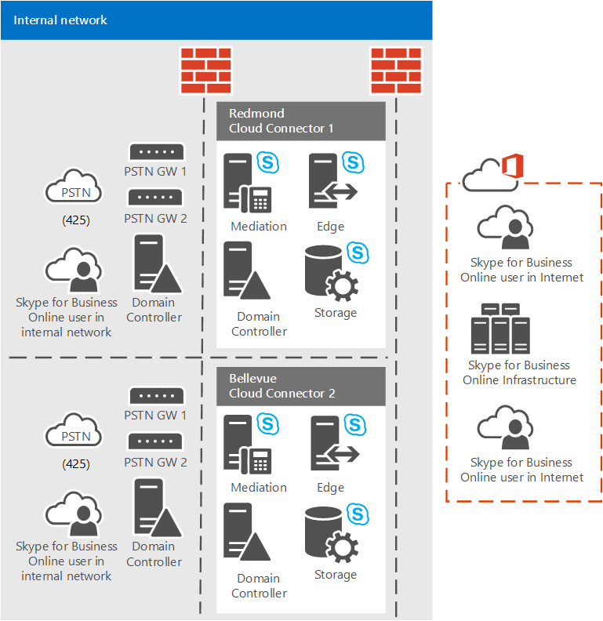

# Plan de sitios de RTC con Cloud Connector Edition
 
Lea este tema para obtener información sobre cómo planear los sitios RTC de Cloud Connector Edition para garantizar el enrutamiento de llamadas eficaz y económico.
  
En este tema se describe lo que debe saber sobre Cloud Connector Edition y el enrutamiento de llamadas para que pueda planificar los sitios RTC de conector en la nube. Un sitio RTC es una combinación de equipos de conexión en la nube, implementada en la misma ubicación y con puertas de enlace RTC comunes conectadas a ellos. Este tema se centra en cómo configurar la topología de sitio de conector de nube para garantizar que los sitios de conector de la nube puedan controlar el enrutamiento entrante y saliente de todos los usuarios asignados a un sitio de la manera más económica y económica posible. Para obtener más información acerca del conector de nube y las ventajas de los sitios RTC, asegúrese de leer [plan para Skype empresarial Cloud Connector Edition](plan-skype-for-business-cloud-connector-edition.md). 
  
## Sitios RTC con Cloud Connector y enrutamiento de llamadas

Los sitios RTC de conector de nube son una construcción topológica creada para evitar las tarifas innecesarias de larga distancia y entre países, y para garantizar que las llamadas de emergencia salientes se dirijan al tronco adecuado. Para garantizar el enrutamiento económico y eficaz de las llamadas, incluidas las llamadas a servicios de emergencia, debe planificar cuidadosamente los sitios de la RTC y cómo se asignan los usuarios a cada sitio. 
  
Como parte de la planificación del conector de nube, es esencial que hable con sus Carriers acerca de dónde se encuentran sus oficinas y usuarios, y dónde los troncos de la RTC terminan del transportista. Debe trabajar con sus operadores para determinar cómo se pueden enrutar las llamadas de emergencia y, a continuación, usar esa información para definir los sitios RTC del conector en la nube y asignar usuarios a los sitios apropiados. Por ejemplo, debe asegurarse de que los troncos que terminan en un centro de datos en el que se extiende el sitio RTC estén configurados para administrar tanto el enrutamiento de entrada como el de salida, para todos los números asignados a los usuarios en ese sitio. 
  
Cada equipo conector de nube puede conectarse a varias puertas de enlace IP, IP PBX o controladores de borde de sesión (SBCs). Debido a que las puertas de enlace y las PBX están conectadas a troncos de telecomunicaciones (accesorios de PRI o SIP), los equipos del conector de nube se conectan lógicamente a troncos de RTC para llamadas entrantes y salientes. Con el conector en la nube y la conectividad RTC local, usted obtiene el tronco y los números de teléfono asociados de su operador local. Si su compañía es una empresa grande, es posible que tenga más de un operador, en especial si su compañía se extiende a más de una ciudad, estado, país o región. Dado que el operador es propietario del número de teléfono, este es responsable de la administración de las llamadas de emergencia.
  
Skype empresarial online trata a todos los dispositivos de la nube en un sitio de igual forma, y dirige las llamadas salientes de forma rotativa a los dispositivos de conexión de la nube en el mismo sitio. Cada conector de nube en un sitio está cruzado conectado al mismo conjunto de troncos de la RTC (completamente enmallado). Como cada usuario está asociado con un sitio RTC de conector de nube, cualquier llamada saliente de ese usuario (normal o emergencia) se asignará a uno de los equipos de conector de nube en el sitio de RTC con el que está asociado el usuario. 
  
El conector de nube realiza el enrutamiento de llamadas estáticas a sus puertas de enlace IP, PBX IP, SBCs o troncos de RTC directos conectados. El conector en la nube aún no es compatible con el enrutamiento dinámico de un tronco basado en el destino (por enrutamiento de menor costo) o basado en el origen (llamadas de emergencia estáticas o dinámicas). Las llamadas entrantes no son un problema, ya que la llamada solo puede provenir de un tronco asociado a ese número. Sin embargo, las llamadas salientes pueden ir a cualquier dispositivo conector de la nube de un sitio (y por extensión a las troncos de RTC adjuntos a ese dispositivo de conector de nube) que pueden causar llamadas de larga distancia no deseadas. Además, las llamadas de emergencia no pasarán si el sitio RTC del conector en la nube se estira entre centros de recursos con diferentes códigos de área o transportistas.
  
## Un ejemplo

En el ejemplo siguiente se muestra cómo agrupar los troncos a sitios de la RTC y cómo asignar usuarios a los sitios. Para la compañía Contoso, considere lo siguiente:
  
- Hay cuatro usuarios:  
    
  - Usuario A en Redmond, Washington (EE. UU.)
    
  - Usuario B en Bellevue, Washington (EE. UU.)
    
  - Usuario C en Centralia, Washington (EE. UU.)
    
  - Usuario D en Portland o (Estados Unidos)
    
- El operador A proporciona números de teléfono y troncos en:
    
  - Redmond (código de área 425)
    
  - Bellevue (código de área 425)
    
  - Centralia (código de área 360)
    
- El operador B proporciona números de teléfono y troncos en:
    
  -  Portland (código de área 503)
    
Puesto que el usuario A en Redmond (centro de datos A) y el usuario B en Bellevue (centro de datos B) están en Suburbs junto a otros y en el mismo código de área (425), el operador A debería poder tomar una llamada de emergencia del usuario A en Redmond en el tronco de Bellevue. 
  
Por lo tanto, es posible que los usuarios A y B, y los troncos del conector de nube para Bellevue y Redmond, estén en el mismo sitio RTC del conector de nube que se muestra en el siguiente diagrama. Las llamadas de emergencia de los usuarios en una oficina pueden ser redirigidas a los troncos en la otra. Sin embargo, deberías consultar con tu portador de que esto funcionará.
  

  
Considere también los ejemplos siguientes:
  
- El usuario C en Centralia, cuyo número es proporcionado por el operador A, está a un viaje en automóvil de dos horas y dentro de un código de área diferente (360) del de otros usuarios del operador A dentro del código de área 425 de Bellevue y Redmond.  
    
    Por lo tanto, incluso si una llamada procede de un transportista A, es posible que el software de enrutamiento de llamadas del transportista en el código de área Centralia 360 rechace una llamada de emergencia entrante originada por el usuario B en el código de área de Bellevue 425. En este caso, es muy importante que el transportista confirme que Cloud Connector y sus troncos asociados en los sitios de la red de la red central de la red RTC pueden atender las llamadas a través de códigos de área y distancia.
    
- El usuario D en Portland usa un número y tronco proporcionados por el operador B, por lo que es muy improbable que la compañía B tome una llamada de emergencia de un número de teléfono del que es propietario el operador A. Por lo tanto, el usuario D y el equipo del conector de nube y las troncos asociadas en Portland deberán estar ubicados en otro sitio de la RTC.
    

