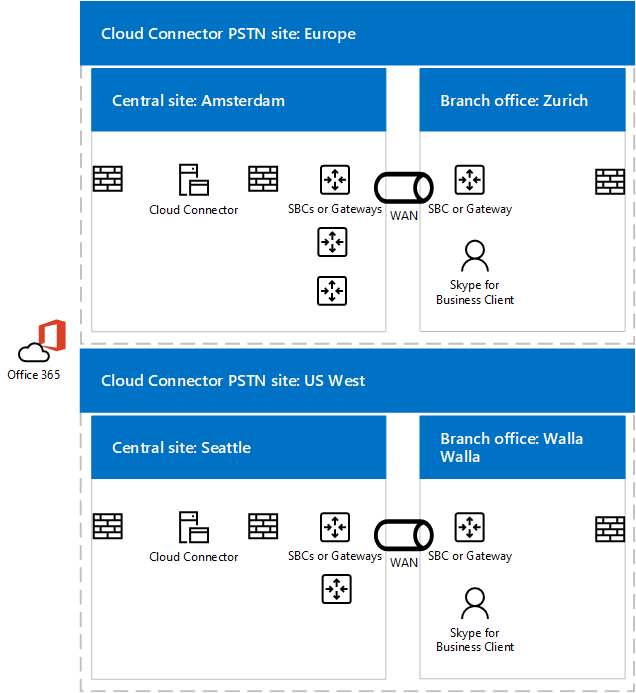

# Plan para la omisión de medios en Cloud Connector Edition
 
Lea este tema para revisar las consideraciones de planificación a la hora de implementar la omisión de medios con la versión 2.0 de Cloud Connector Edition y las versiones posteriores. Para obtener información sobre la implementación de medios de desvío, vea [de desvío de medios de implementar en la nube conector Edition](deploy-media-bypass-in-cloud-connector.md).
  
Desvío de medios permite que un cliente enviar medios directamente en el próximo salto pública red de telefónica conmutada (RTC): una puerta de enlace o el controlador de borde de sesión (SBC) — y eliminar el componente de edición de conector en la nube desde la ruta de acceso de medios.
  
La omisión de medios puede mejorar la calidad de la voz al reducir la latencia, la posibilidad de la pérdida de paquetes y la cantidad de puntos de errores potenciales. Eliminación de medios de procesamiento para las llamadas omitidas reduce la carga en el conector en la nube, que permite a un mayor número de llamadas simultáneas, y puede mejorar la escalabilidad. 
  
 Liberación del conector en la nube de las tareas de procesamiento de medios puede reducir el número de dispositivos de conector en la nube que requiere una infraestructura, por lo que se debe habilitar el desvío de medios siempre que sea posible.
  
## Cómo afecta la omisión de medios a las rutas de señalización y medios

Si bien la señalización toma la misma ruta con o sin omisión de medios, el flujo de medios actúa de forma diferente. Los siguientes diagramas muestran las rutas de señalización y medios en las topologías con omisión de medios y sin ella.  
  
Por ejemplo, en la siguiente topología: que omitir la no emplean medios — un Skype para cliente empresarial realiza una llamada de RTC para un número externo, las señales SIP va a Office 365 y Office 365, a continuación, dirige el tráfico de señalización según la voz para el usuario final Directiva. Para los usuarios de conector en la nube, la directiva de voz dirige el tráfico de señalización para el servidor perimetral de conector de nube, que, a continuación, se distribuye el tráfico de señalización a un controlador de borde de sesión (SBC) de RTC o puerta de enlace a través del servidor de mediación de conector en la nube. Se transmite desde el Skype para clientes empresariales al servidor de mediación de conector en la nube y, a continuación, al SBC o puerta de enlace, tal como se muestra en el siguiente diagrama:
  
**Desvío de medios y las rutas de señalización sin medios**

  
Una llamada entrante RTC utiliza la misma ruta de señalización en la dirección contraria. Para los usuarios internos, medios aún en última instancia fluirá entre el Skype para clientes empresariales y el servidor de mediación de conector en la nube y, a continuación, la SBC o puerta de enlace.
  
En la siguiente topología: que omitir la emplean medios — señalización toma la misma ruta de acceso, pero se transmite directamente entre el Skype para clientes empresariales y la SBC o puerta de enlace, tal como se muestra en el siguiente diagrama:
  
**Desvío de medios y las rutas de señalización con medios**

  
## Escenario centralizado de varios sitios y omisión de medios

Desvío de medios también es útil cuando desea proporcionar servicios de telefonía para varios sitios con un solo dispositivo de conector en la nube. Debido a que el conector en la nube no podrá enrutar llamadas basadas en los números de origen o de destino, mayoría de las empresas implementar una puerta de enlace detrás de conector en la nube o SBC para tomar decisiones de enrutamiento. La omisión de medios en este escenario elimina el salto entre el cliente y el SBC central o la puerta de enlace, como se muestra en el siguiente diagrama:
  
**Aplicación de múltiples sitios**

  
1. Fluye el tráfico SIP del usuario en Zurich a Office 365.
    
2. A continuación, enruta el tráfico al dispositivo conector en la nube en Ámsterdam tal como se especifica en la directiva de enrutamiento de voz de usuario.
    
3. El dispositivo de conector en la nube en Ámsterdam envía el tráfico SIP a la puerta de enlace central en Ámsterdam.
    
4. La puerta de enlace central en Ámsterdam toma las decisiones de enrutamiento apropiadas y, a continuación, envía el tráfico a una SBC o puerta de enlace en Zurich, mientras los flujos de medios directamente entre el Skype para clientes empresariales y SBC o puerta de enlace en Ámsterdam.
    
 Este enfoque permite atender a más usuarios por una implementación de conector en la nube donde está centralizada conector en la nube. Aunque el conector de la nube se ha eliminado de la ruta de acceso de medios, en un escenario de múltiples sitios centralizado medios es posible que aún atravesar la WAN dos veces, según sea necesario fluya a través de la puerta de enlace o SBC centralizado.
  
Si un cliente está fuera de la red corporativa, realizar una llamada saliente, el tráfico de medios fluye a través de los servidores perimetrales y de mediación del vínculo del conector en la nube y WAN entre Zurich y Ámsterdam, tal como se muestra en el siguiente diagrama:
  

  
## Clientes compatibles con la omisión de medios

Con la primera versión de desvío de medios, el cliente compatible sólo es el Skype para cliente de Windows de 2016 empresarial que forma parte de Office 365 ProPlus, versión 16.0.7870.2020 o posterior. Los clientes pueden usar cualquier canal: actual, diferido o primera versión de canal diferido. 
  
> [!NOTE]
> Si utiliza una solución VPN cliente junto con el cliente de Skype Empresarial, la omisión de medios solo será compatible con una configuración VPN de túnel dividido. 
  
Para obtener más información acerca de los canales de versión, vea [información general de los canales de actualización para Office 365 ProPlus](https://support.office.com/en-us/article/Overview-of-update-channels-for-Office-365-ProPlus-9ccf0f13-28ff-4975-9bd2-7e4ea2fefef4?ui=en-US&amp;rs=en-US&amp;ad=US).
  
Para la versión actual de los clientes en distintos canales, vea [Actualizar versiones de canal de cliente de Office 365](https://technet.microsoft.com/en-us/office/mt465751.aspx). 
  
## Consideraciones sobre la capacidad de Cloud Connector con la omisión de medios

Sin desvío de medios y dependiendo del hardware, puede controlar un dispositivo de conector en la nube de 50 a 500 llamadas simultáneas que requieren medios viajar a través de un servidor de mediación. Para obtener más información, consulte [Plan de Skype para Business Edition de conector en la nube](https://technet.microsoft.com/en-us/library/mt605227.aspx). 
  
Con la omisión de medios habilitado, los clientes internos en la versión compatible no usa el Servidor de mediación, de modo que el número de clientes internos puede aumentar considerablemente. 
  
Como se mencionó anteriormente, los clientes externos o los clientes no compatibles usará los servidores perimetrales de conector en la nube y de mediación para los medios. Al calcular cuántos dispositivos de conector en la nube se deben colocar en un sitio, debe tener en cuenta el tráfico de los usuarios externos y los usuarios en los clientes no compatibles.
  
## Cloud Connector admite el modo Omitir siempre

Conector de nube admite sólo en modo siempre el desvío. En entornos locales, existen dos opciones: Omitir siempre y Use Site and Region Information (Usar la información del sitio y la región).
  
«Omitir siempre» significa que la omisión de medios se intentará en todas las llamadas RTC con los clientes internos como punto de origen o de destino. Para determinar si el cliente es interno o externo, se utiliza un sitio web en la máquina virtual del servidor de mediación. Si el cliente puede llegar al sitio, se tiene en cuenta la omisión interna y de medios. Si el cliente no puede llegar al sitio (por ejemplo, el cliente está en una red doméstica), no se utiliza la omisión de medios.  
  
Para usar Omitir siempre, hace falta que la conectividad esté despejada entre los usuarios y las puertas de enlace RTC dentro de un sitio RTC.  
  
Para obtener más información, consulte [Plan de Skype para Business Edition de conector en la nube](https://technet.microsoft.com/en-us/library/mt605227.aspx). 
  
Por ejemplo, en el diagrama siguiente, los usuarios de Europa deben estar bien conectados a los tres controladores de borde de sesión (SBCs) en Ámsterdam mientras los usuarios nos oeste deben estar bien conectados a los dos SBCs en Seattle. Estar bien conectados significa que están situados en los mismos sitios de red que los SBC o las puertas de enlace, o por los vínculos WAN que tengan un ancho de banda adecuado.
  

  
> [!NOTE]
> Si un usuario de Zúrich viaja a la oficina de Seattle y quiere usar la red interna para proporcionar tráfico de medios entre el usuario que esté viajando y las puertas de enlace de Europa (frente a ir a través de Internet), debe asegurarse de que la oficina de Seattle y la de Ámsterdam en las que están situados los SBC o las puertas de enlace de Europa se califiquen como bien conectados. 
  
## Códecs usados en la omisión de medios

Con la omisión de medios habilitada, el tráfico de los medios entre un cliente y un SBC o una puerta de enlace usará el códec G.711. 
  
## Vea también

#### 

[Implementar el desvío de medios en la nube conector Edition](deploy-media-bypass-in-cloud-connector.md)

