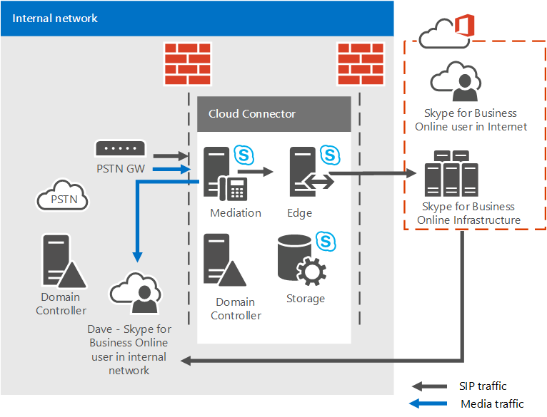

# <a name="plan-for-skype-for-business-cloud-connector-edition"></a><span data-ttu-id="d818b-103">Plan para Skype Empresarial Cloud Connector Edition</span><span class="sxs-lookup"><span data-stu-id="d818b-103">Plan for Skype for Business Cloud Connector Edition</span></span>

<span data-ttu-id="d818b-104">Obtenga información sobre Skype Empresarial Cloud Connector Edition, un conjunto de máquinas virtuales (VM) empaquetadas que implementa la conectividad RTC local con el Sistema telefónico de Office 365 (PBX en la nube).</span><span class="sxs-lookup"><span data-stu-id="d818b-104">Find information on Skype for Business Cloud Connector Edition, a set of packaged Virtual Machines (VMs) that implement on-premises PSTN connectivity with Phone System in Office 365 (Cloud PBX).</span></span>

<span data-ttu-id="d818b-105">En la nube conector Edition puede ser la solución adecuada para su organización si no ya tiene un servidor existente de Lync o Skype para la implementación de Business Server.</span><span class="sxs-lookup"><span data-stu-id="d818b-105">Cloud Connector Edition might be the right solution for your organization if you do not already have an existing Lync Server or Skype for Business Server deployment.</span></span> <span data-ttu-id="d818b-106">Si aún está investigar el sistema telefónico en la solución de Office 365 es el adecuado para su negocio, vea [Planear el sistema telefónico en la solución de Office 365 (en la nube PBX)](plan-your-phone-system-cloud-pbx-solution.md).</span><span class="sxs-lookup"><span data-stu-id="d818b-106">If you're still investigating which Phone System in Office 365 solution is right for your business, see [Plan your Phone System in Office 365 (Cloud PBX) solution](plan-your-phone-system-cloud-pbx-solution.md).</span></span>

<span data-ttu-id="d818b-107">Este documento describe los requisitos de las ediciones de conector en la nube y las topologías admitidas y le ayudará a planear la implementación de nube conector Edition.</span><span class="sxs-lookup"><span data-stu-id="d818b-107">This document describes Cloud Connector Edition requirements and supported topologies, and helps you plan your Cloud Connector Edition deployment.</span></span> <span data-ttu-id="d818b-108">Asegúrese de leer este tema antes de configurar el entorno de conector en la nube.</span><span class="sxs-lookup"><span data-stu-id="d818b-108">Be sure to read this topic before you configure your Cloud Connector environment.</span></span> <span data-ttu-id="d818b-109">Cuando esté listo para implementar y configurar Edition de conector en la nube, vea [configurar y administrar Skype para Business Edition de conector en la nube](configure-skype-for-business-cloud-connector-edition.md).</span><span class="sxs-lookup"><span data-stu-id="d818b-109">When you are ready to deploy and configure Cloud Connector Edition, see [Configure and manage Skype for Business Cloud Connector Edition](configure-skype-for-business-cloud-connector-edition.md).</span></span>

<span data-ttu-id="d818b-110">En la nube conector Edition 2.1 ahora está disponible.</span><span class="sxs-lookup"><span data-stu-id="d818b-110">Cloud Connector Edition 2.1 is now available.</span></span> <span data-ttu-id="d818b-111">Si aún no ha actualizado a 2.1, consulte [actualizar a una nueva versión del conector en la nube](upgrade-to-a-new-version-of-cloud-connector.md).</span><span class="sxs-lookup"><span data-stu-id="d818b-111">If you have not yet upgraded to 2.1, see [Upgrade to a new version of Cloud Connector](upgrade-to-a-new-version-of-cloud-connector.md).</span></span> <span data-ttu-id="d818b-112">Puede encontrar el archivo de instalación en [https://aka.ms/CloudConnectorInstaller](https://aka.ms/CloudConnectorInstaller).</span><span class="sxs-lookup"><span data-stu-id="d818b-112">You can find the installation file at [https://aka.ms/CloudConnectorInstaller](https://aka.ms/CloudConnectorInstaller).</span></span>

> [!NOTE]
> <span data-ttu-id="d818b-113">Microsoft admite la versión anterior de la nube conector Edition durante 60 días después de la publicación de una nueva versión.</span><span class="sxs-lookup"><span data-stu-id="d818b-113">Microsoft supports the previous version of Cloud Connector Edition for 60 days after the release of a new version.</span></span> <span data-ttu-id="d818b-114">Microsoft admitirá la versión 2.0.1 durante 60 días después de la publicación de 2.1 para darle tiempo para la actualización.</span><span class="sxs-lookup"><span data-stu-id="d818b-114">Microsoft will support version 2.0.1 for 60 days after the release of 2.1 to allow you time to upgrade.</span></span> <span data-ttu-id="d818b-115">Todas las versiones anteriores a 2.0.1 han dejado de ser compatibles.</span><span class="sxs-lookup"><span data-stu-id="d818b-115">All versions previous to 2.0.1 are no longer supported.</span></span>

<span data-ttu-id="d818b-116">En la nube conector Edition es un híbrido que ofrece que consta de un conjunto de empaquetado máquinas virtuales (VM) que implementan la conectividad de RTC local con el sistema telefónico en Office 365.</span><span class="sxs-lookup"><span data-stu-id="d818b-116">Cloud Connector Edition is a hybrid offering that consists of a set of packaged Virtual Machines (VMs) that implement on-premises PSTN connectivity with Phone System in Office 365.</span></span> <span data-ttu-id="d818b-117">Mediante la implementación de un mínimo Skype para la topología de servidor empresarial en un entorno virtualizado, los usuarios de su organización que están hospedados en la nube pueden recibir servicios de PBX de la nube de Microsoft, pero se proporciona conectividad RTC a través de la voz local existente infraestructura.</span><span class="sxs-lookup"><span data-stu-id="d818b-117">By deploying a minimal Skype for Business Server topology in a virtualized environment, users in your organization who are homed in the cloud can receive PBX services from the Microsoft cloud, but PSTN connectivity is provided through the existing on-premises voice infrastructure.</span></span>


<span data-ttu-id="d818b-119">Dado que Cloud Connector le permite integrar los servicios del Sistema telefónico de Office 365 con su entorno de telefonía existente (por ejemplo, PBX, dispositivos análogos y los centros de llamadas), puede implementar una migración en fases desde su solución de telefonía actual al Sistema telefónico de Office 365.</span><span class="sxs-lookup"><span data-stu-id="d818b-119">Because Cloud Connector enables you to integrate Phone System in Office 365 services with your existing telephony environment—for example, PBX, analog devices, and Call Centers—you can implement a phased migration from your existing telephony solution to Phone System in Office 365.</span></span>

<span data-ttu-id="d818b-120">Por ejemplo, suponga que su empresa tiene un centro de llamadas sofisticado con una funcionalidad específica que el Sistema telefónico de Office 365 no proporciona.</span><span class="sxs-lookup"><span data-stu-id="d818b-120">For example, assume your company has a sophisticated Call Center with specific functionality that Phone System in Office 365 does not provide.</span></span> <span data-ttu-id="d818b-121">Puede elegir dejar a los usuarios del centro de llamadas con la solución existente, pero mover a otros usuarios al Sistema telefónico de Office 365.</span><span class="sxs-lookup"><span data-stu-id="d818b-121">You can choose to leave Call Center users with the existing solution, but move other users to Phone System in Office 365.</span></span>

<span data-ttu-id="d818b-122">Cloud Connector proporcionará enrutamiento entre los usuarios alojados en local y en línea, y puede elegir usar su propio proveedor RTC con el Sistema telefónico de Office 365.</span><span class="sxs-lookup"><span data-stu-id="d818b-122">Cloud Connector will provide routing between the users homed on premises and online, and you can choose to use your own PSTN provider with Phone System in Office 365.</span></span>

<span data-ttu-id="d818b-123">Tenga en cuenta lo siguiente al planear la implementación de nube conector Edition:</span><span class="sxs-lookup"><span data-stu-id="d818b-123">Consider the following when planning your Cloud Connector Edition deployment:</span></span>

- <span data-ttu-id="d818b-124">Para usar el conector en la nube para aprovechar las ventajas de las soluciones de voz en la nube, debe registrarse para un inquilino de Office 365 que incluye el sistema telefónico en Office 365.</span><span class="sxs-lookup"><span data-stu-id="d818b-124">To use Cloud Connector to take advantage of cloud voice solutions, you'll need to sign up for an Office 365 tenant that includes Phone System in Office 365.</span></span> <span data-ttu-id="d818b-125">Si aún no dispone de un inquilino de Office 365 Obtenga información sobre cómo registrarse aquí: [Office 365 para la empresa](https://products.office.com/en-us/business/office).</span><span class="sxs-lookup"><span data-stu-id="d818b-125">If you do not yet have an Office 365 tenant you can learn how to sign up here: [Office 365 for Business](https://products.office.com/en-us/business/office).</span></span> <span data-ttu-id="d818b-126">Tenga en cuenta que necesitará para registrarse y obtener un plan que incluya Skype para profesionales en línea.</span><span class="sxs-lookup"><span data-stu-id="d818b-126">Note that you'll need to sign up for a plan that includes Skype for Business Online.</span></span>

- <span data-ttu-id="d818b-127">Para registrar los dispositivos de conector en la nube con la Skype para servicios en línea de negocio y para ejecutar varios cmdlets, conector de nube 2.0 y versiones posterior requiere una cuenta de Office 365 dedicada con la Skype para derechos de administrador de inquilinos de negocio.</span><span class="sxs-lookup"><span data-stu-id="d818b-127">To register Cloud Connector appliances with the Skype for Business Online service, and to run various cmdlets, Cloud Connector 2.0 and later requires a dedicated Office 365 account with the Skype for Business Tenant Administrator rights.</span></span> <span data-ttu-id="d818b-128">Las versiones de Cloud Connector anteriores a 2.0 requieren una cuenta de Office 365 dedicada con los derechos de administrador global de inquilinos.</span><span class="sxs-lookup"><span data-stu-id="d818b-128">Cloud Connector versions previous to 2.0 require a dedicated Office 365 account with tenant Global Administrator rights.</span></span>

- <span data-ttu-id="d818b-129">Conector de nube no requiere un completo local Skype para la implementación de Business Server.</span><span class="sxs-lookup"><span data-stu-id="d818b-129">Cloud Connector does not require a full on-premises Skype for Business Server deployment.</span></span>

    <span data-ttu-id="d818b-130">Actualmente, en la nube conector no puede coexistir con Lync Skype para la empresa local o en servidores.</span><span class="sxs-lookup"><span data-stu-id="d818b-130">Currently, Cloud Connector cannot co-exist with Lync or Skype for Business on-premises servers.</span></span> <span data-ttu-id="d818b-131">Si desea mover Lync existente o Skype para los usuarios empresariales a Office 365 y mantener proporcionar local telefonía a los usuarios, considere la posibilidad de sistema telefónico en Office 365 con conectividad local utilizando un Skype existente para la implementación de Business Server.</span><span class="sxs-lookup"><span data-stu-id="d818b-131">If you want to move existing Lync or Skype for Business users to Office 365 and keep providing on-premises telephony to your users, consider Phone System in Office 365 with on-premises connectivity using an existing Skype for Business Server deployment.</span></span> <span data-ttu-id="d818b-132">Para obtener más información, vea [Planear el sistema telefónico en la solución de Office 365 (en la nube PBX)](plan-your-phone-system-cloud-pbx-solution.md) y [Planeación de sistema telefónico en Office 365 con conectividad de RTC local en Skype para Business Server](plan-phone-system-with-on-premises-pstn-connectivity.md).</span><span class="sxs-lookup"><span data-stu-id="d818b-132">For more information, see [Plan your Phone System in Office 365 (Cloud PBX) solution](plan-your-phone-system-cloud-pbx-solution.md) and [Plan Phone System in Office 365 with on-premises PSTN connectivity in Skype for Business Server](plan-phone-system-with-on-premises-pstn-connectivity.md).</span></span>

- <span data-ttu-id="d818b-133">Si tenía un Skype anterior para la implementación empresarial o Lync Server y había ampliado el esquema, no es necesario limpiar el esquema para la implementación de conector en la nube, siempre que haya quitado todos los Skype para componentes empresariales o de Lync Server del entorno.</span><span class="sxs-lookup"><span data-stu-id="d818b-133">If you had a previous Skype for Business or Lync Server deployment, and you extended the schema, you do not need to clean up the schema for the Cloud Connector deployment, as long as you've removed all Skype for Business or Lync Server components from your environment.</span></span>

- <span data-ttu-id="d818b-134">Los usuarios están hospedados en línea.</span><span class="sxs-lookup"><span data-stu-id="d818b-134">Your users are homed online.</span></span>

- <span data-ttu-id="d818b-135">Si su organización ha configurado la sincronización de directorios (DirSync), todas las cuentas de los usuarios que se han planificado para la voz híbrida se deben crear primero en su implementación local y, a continuación, sincronizarse con la nube.</span><span class="sxs-lookup"><span data-stu-id="d818b-135">If your organization has configured Directory Synchronization (DirSync), then all accounts of users who are planned for hybrid voice must be created in your on-premises deployment first, and then synchronized to the cloud.</span></span>

- <span data-ttu-id="d818b-136">Si es necesario, puede mantener su operador de RTC actual.</span><span class="sxs-lookup"><span data-stu-id="d818b-136">You can keep your current PSTN carrier if required.</span></span>

- <span data-ttu-id="d818b-137">Si desea proporcionar conferencia de acceso telefónico a los usuarios hospedados en el conector en la nube, puede comprar conferencia de RTC de Microsoft o de los socios de servicios de audioconferencia proveedor (ACP).</span><span class="sxs-lookup"><span data-stu-id="d818b-137">If you want to provide dial-in conferencing to users hosted on Cloud Connector, you can purchase PSTN conferencing from Microsoft or from audio conferencing provider (ACP) partners.</span></span>

- <span data-ttu-id="d818b-138">Cloud Connector 2.0 y las versiones posteriores son compatibles ahora con la omisión de medios.</span><span class="sxs-lookup"><span data-stu-id="d818b-138">Cloud Connector 2.0 and later now supports media bypass.</span></span> <span data-ttu-id="d818b-139">Desvío de medios permite que un cliente enviar medios directamente en el próximo salto pública red de telefónica conmutada (RTC): una puerta de enlace o el controlador de borde de sesión (SBC) — y eliminar el componente de edición de conector en la nube desde la ruta de acceso de medios.</span><span class="sxs-lookup"><span data-stu-id="d818b-139">Media bypass allows a client to send media directly to the Public Switched Telephone Network (PSTN) next hop—a gateway or Session Border Controller (SBC)—and eliminate the Cloud Connector Edition component from the media path.</span></span> <span data-ttu-id="d818b-140">Para obtener más información, vea [Plan para los medios de desvío en la nube conector Edition](plan-for-media-bypass-in-cloud-connector-edition.md).</span><span class="sxs-lookup"><span data-stu-id="d818b-140">For more information, see [Plan for media bypass in Cloud Connector Edition](plan-for-media-bypass-in-cloud-connector-edition.md).</span></span>

- <span data-ttu-id="d818b-141">Cloud Connector 2.1 y versiones posteriores admiten la supervisión de Cloud Connector mediante Operations Management Suite (OMS).</span><span class="sxs-lookup"><span data-stu-id="d818b-141">Cloud Connector 2.1 and later supports monitoring Cloud Connector using Operations Management Suite (OMS).</span></span> <span data-ttu-id="d818b-142">Para obtener más información, vea [Conector para Monitor en la nube con el conjunto de aplicaciones de administración de operaciones (OMS)](monitor-cloud-connector-using-operations-management-suite-oms.md)</span><span class="sxs-lookup"><span data-stu-id="d818b-142">For more information, see [Monitor Cloud Connector using Operations Management Suite (OMS)](monitor-cloud-connector-using-operations-management-suite-oms.md)</span></span>

- <span data-ttu-id="d818b-143">Conector de nube está disponible en todos los países donde Office 365 Enterprise E5 está disponible.</span><span class="sxs-lookup"><span data-stu-id="d818b-143">Cloud Connector is available in all countries where Office 365 Enterprise E5 is available.</span></span> <span data-ttu-id="d818b-144">Sin embargo, debido a las diversas normativas, conector en la nube no se puede configurar si se establece la ubicación del inquilino a uno de los siguientes países: Argelia, Bangladesh, Botsuana, Brunei, Camerún, costa de Marfil, Ghana, Líbano, Macao, Mauricio, namibio, Paraguay, (Senegal).</span><span class="sxs-lookup"><span data-stu-id="d818b-144">However, because of various regulations, Cloud Connector cannot be configured if the tenant location is set to one of the following countries: Algeria, Bangladesh, Botswana, Brunei, Cameroon, Cote d'Ivoire, Ghana, Lebanon, Macau, Mauritius, Namibia, Paraguay, Senegal.</span></span>

<span data-ttu-id="d818b-145">Este tema incluye las secciones siguientes:</span><span class="sxs-lookup"><span data-stu-id="d818b-145">This topic contains the following sections:</span></span>

- [<span data-ttu-id="d818b-146">Componentes de Cloud Connector Edition</span><span class="sxs-lookup"><span data-stu-id="d818b-146">Cloud Connector Edition components</span></span>](plan-skype-for-business-cloud-connector-edition.md#BKMK_Components)

- [<span data-ttu-id="d818b-147">Topologías de edición del conector para la nube</span><span class="sxs-lookup"><span data-stu-id="d818b-147">Cloud Connector Edition topologies</span></span>](plan-skype-for-business-cloud-connector-edition.md#BKMK_Topologies)

- [<span data-ttu-id="d818b-148">Requisitos para la implementación</span><span class="sxs-lookup"><span data-stu-id="d818b-148">Requirements for deployment</span></span>](plan-skype-for-business-cloud-connector-edition.md#BKMK_Requirements)

- [<span data-ttu-id="d818b-149">Información que debe recopilar antes de la implementación</span><span class="sxs-lookup"><span data-stu-id="d818b-149">Information you need to gather before deployment</span></span>](plan-skype-for-business-cloud-connector-edition.md#BKMK_PlanDeployment)

- [<span data-ttu-id="d818b-150">Consideraciones de plan de marcado</span><span class="sxs-lookup"><span data-stu-id="d818b-150">Dial plan considerations</span></span>](plan-skype-for-business-cloud-connector-edition.md#BKMK_DailPlan)

- [<span data-ttu-id="d818b-151">Consideraciones sobre alta disponibilidad</span><span class="sxs-lookup"><span data-stu-id="d818b-151">High availability considerations</span></span>](plan-skype-for-business-cloud-connector-edition.md#BKMK_HA)

- [<span data-ttu-id="d818b-152">Flujo multimedia de Cloud Connector</span><span class="sxs-lookup"><span data-stu-id="d818b-152">Cloud Connector media flow</span></span>](plan-skype-for-business-cloud-connector-edition.md#BKMK_MediaFlow)

- [<span data-ttu-id="d818b-153">Supervisión y solución de problemas</span><span class="sxs-lookup"><span data-stu-id="d818b-153">Monitoring and troubleshooting</span></span>](plan-skype-for-business-cloud-connector-edition.md#BKMK_Monitor)

- [<span data-ttu-id="d818b-154">Para más información</span><span class="sxs-lookup"><span data-stu-id="d818b-154">For more information</span></span>](plan-skype-for-business-cloud-connector-edition.md#BKMK_MoreInfo)

## <a name="cloud-connector-edition-components"></a><span data-ttu-id="d818b-155">Componentes de Cloud Connector Edition</span><span class="sxs-lookup"><span data-stu-id="d818b-155">Cloud Connector Edition components</span></span>
<span data-ttu-id="d818b-156"><a name="BKMK_Components"> </a></span><span class="sxs-lookup"><span data-stu-id="d818b-156"></span></span>

<span data-ttu-id="d818b-157">Con la edición de conector en la nube, implementar un conjunto de empaquetado máquinas virtuales que contienen un mínimo Skype para la topología de servidor empresarial, que consta de un componente de borde, el componente de mediación y una función del almacén de Administración Central (CMS).</span><span class="sxs-lookup"><span data-stu-id="d818b-157">With Cloud Connector Edition, you deploy a set of packaged VMs that contain a minimal Skype for Business Server topology—consisting of an Edge component, Mediation component, and a Central Management Store (CMS) role.</span></span> <span data-ttu-id="d818b-158">También va a instalar un controlador de dominio, que es necesario para el funcionamiento interno del conector en la nube.</span><span class="sxs-lookup"><span data-stu-id="d818b-158">You will also install a domain controller, which is required for the internal functioning of Cloud Connector.</span></span> <span data-ttu-id="d818b-159">Estos servicios están configurados para la implementación híbrida con el inquilino de Office 365 que incluye Skype para servicios en línea de negocio.</span><span class="sxs-lookup"><span data-stu-id="d818b-159">These services are configured for hybrid with your Office 365 tenant that includes Skype for Business Online services.</span></span>


<span data-ttu-id="d818b-161">Componentes del conector en la nube proporcionan la funcionalidad siguiente:</span><span class="sxs-lookup"><span data-stu-id="d818b-161">Cloud Connector components provide the following functionality:</span></span>

- <span data-ttu-id="d818b-162">**Componente perimetral** - comunicación entre la topología local y los servicios en línea pasa a través del componente perimetral, que incluye los siguientes componentes:</span><span class="sxs-lookup"><span data-stu-id="d818b-162">**Edge component** - Communication between the on-premises topology and the online services goes through the Edge component, which includes the following components:</span></span>

  - <span data-ttu-id="d818b-163">**Servidor perimetral de acceso** - proporciona SIP enrutamiento entre la implementación local y Skype para profesionales en línea</span><span class="sxs-lookup"><span data-stu-id="d818b-163">**Access Edge** - Provides SIP routing between the on-premises deployment and Skype for Business Online.</span></span>

  - <span data-ttu-id="d818b-164">**Transmisión de medios** - proporciona enrutamiento de medios entre el componente de mediación y otros extremos de medios.</span><span class="sxs-lookup"><span data-stu-id="d818b-164">**Media Relay** - Provides routing of media between the Mediation component and other media endpoints.</span></span>

  - <span data-ttu-id="d818b-165">**Autenticación de retransmisión de medios / MRAS** -genera tokens para tener acceso a la transmisión de medios.</span><span class="sxs-lookup"><span data-stu-id="d818b-165">**Media Relay Authentication / MRAS** - Generates tokens for access to media relay.</span></span>

- <span data-ttu-id="d818b-166">**El enrutamiento saliente** : proporciona equilibrio de carga del tráfico de voz entre las puertas de enlace o SBCs se conectan a un conector en la nube.</span><span class="sxs-lookup"><span data-stu-id="d818b-166">**Outbound Routing** - Provides load balancing of the voice traffic between gateways or SBCs connected to a Cloud Connector appliance.</span></span> <span data-ttu-id="d818b-167">Las llamadas se dividirán uniformemente entre todas las puertas de enlace o los SBC conectados al dispositivo de Cloud Connector.</span><span class="sxs-lookup"><span data-stu-id="d818b-167">Calls will be split evenly between all gateways or SBCs connected to the Cloud Connector appliance.</span></span>

    <span data-ttu-id="d818b-168">Proporciona el enrutamiento a puertas de enlace en función de las directivas.</span><span class="sxs-lookup"><span data-stu-id="d818b-168">Provides routing to gateways based on policies.</span></span> <span data-ttu-id="d818b-169">Solo se admiten las directivas globales que están basadas en números RTC de destino (salida).</span><span class="sxs-lookup"><span data-stu-id="d818b-169">Only global policies which are based on destination (outbound) PSTN numbers are supported.</span></span>

- <span data-ttu-id="d818b-170">**Rol del almacén de administración central (CMS)** - incluye el almacén de configuración para los componentes de la topología, incluida la transferencia de archivos de CMS.</span><span class="sxs-lookup"><span data-stu-id="d818b-170">**Central Management Store (CMS) role** - Includes the configuration store for the topology components, including CMS File Transfer.</span></span>

- <span data-ttu-id="d818b-171">**Réplica del almacén de administración central (CMS)** - sincroniza la información de configuración de la base de datos de CMS global en el servidor de rol CMS.</span><span class="sxs-lookup"><span data-stu-id="d818b-171">**Central Management Store (CMS) replica** - Synchronizes configuration information from the global CMS DB on the CMS role server.</span></span>

- <span data-ttu-id="d818b-172">**Controlador de dominio** - nube conector Active Directory Domain Services para almacenar todos los grupos necesarios para implementar los componentes de los conectores de la nube y la configuración global.</span><span class="sxs-lookup"><span data-stu-id="d818b-172">**Domain controller** - Cloud Connector Active Directory Domain Services to store all the global settings and groups necessary to deploy Cloud Connector components.</span></span> <span data-ttu-id="d818b-173">Se creará uno de los bosques para cada dispositivo de conector en la nube.</span><span class="sxs-lookup"><span data-stu-id="d818b-173">One forest will be created for each Cloud Connector appliance.</span></span> <span data-ttu-id="d818b-174">El controlador de dominio no debe tener las conexiones con Active Directory de producción.</span><span class="sxs-lookup"><span data-stu-id="d818b-174">The domain controller must not have any connections with the production Active Directory.</span></span> <span data-ttu-id="d818b-175">Los servicios de Active Directory incluyen:</span><span class="sxs-lookup"><span data-stu-id="d818b-175">Active Directory services include:</span></span>

  - <span data-ttu-id="d818b-176">Servicios de dominio de Active Directory</span><span class="sxs-lookup"><span data-stu-id="d818b-176">Active Directory Domain Services</span></span>

  - <span data-ttu-id="d818b-177">Servicios de certificados de Active Directory para emitir certificados internos</span><span class="sxs-lookup"><span data-stu-id="d818b-177">Active Directory Certificate Services to issue internal certificates</span></span>

- <span data-ttu-id="d818b-178">**Componente de mediación** - protocolo de asignación de puerta de enlace SIP implementa y medios entre Skype para puertas de enlace RTC y profesionales.</span><span class="sxs-lookup"><span data-stu-id="d818b-178">**Mediation component** - Implements SIP and Media gateway mapping protocol between Skype for Business and PSTN gateways.</span></span> <span data-ttu-id="d818b-179">Incluye una réplica CMS que sincroniza la configuración de la base de datos CMS global.</span><span class="sxs-lookup"><span data-stu-id="d818b-179">Includes a CMS replica that synchronizes configuration from the global CMS database.</span></span>

## <a name="cloud-connector-edition-topologies"></a><span data-ttu-id="d818b-180">Topologías de edición del conector para la nube</span><span class="sxs-lookup"><span data-stu-id="d818b-180">Cloud Connector Edition topologies</span></span>
<span data-ttu-id="d818b-181"><a name="BKMK_Topologies"> </a></span><span class="sxs-lookup"><span data-stu-id="d818b-181"></span></span>

<span data-ttu-id="d818b-182">Para este contenido, haremos referencia a sitios RTC.</span><span class="sxs-lookup"><span data-stu-id="d818b-182">For purposes of this discussion, we will refer to PSTN sites.</span></span> <span data-ttu-id="d818b-183">Un sitio de RTC es una combinación de dispositivos de conector en la nube, implementado en la misma ubicación y con puertas de enlace RTC comunes conectados a ellos.</span><span class="sxs-lookup"><span data-stu-id="d818b-183">A PSTN site is a combination of Cloud Connector appliances, deployed at the same location, and with common PSTN gateways connected to them.</span></span> <span data-ttu-id="d818b-184">Los sitios RTC le permiten lo siguiente:</span><span class="sxs-lookup"><span data-stu-id="d818b-184">PSTN sites allow you to:</span></span>

- <span data-ttu-id="d818b-185">Proporcionar conectividad a las puertas de enlace más próximas a sus usuarios.</span><span class="sxs-lookup"><span data-stu-id="d818b-185">Provide connectivity to gateways that are closest to your users.</span></span>

- <span data-ttu-id="d818b-186">Permitir una escalabilidad mediante la implementación de varios dispositivos de conector en la nube en uno o varios sitios de RTC.</span><span class="sxs-lookup"><span data-stu-id="d818b-186">Allow for scalability by deploying multiple Cloud Connector appliances within one or more PSTN sites.</span></span>

- <span data-ttu-id="d818b-187">Permitir para una alta disponibilidad mediante la implementación de varios dispositivos de conector en la nube en un único sitio de RTC.</span><span class="sxs-lookup"><span data-stu-id="d818b-187">Allow for high availability by deploying multiple Cloud Connector appliances within a single PSTN site.</span></span>

<span data-ttu-id="d818b-188">Este tema explica los sitios RTC.</span><span class="sxs-lookup"><span data-stu-id="d818b-188">This topic introduces PSTN sites.</span></span> <span data-ttu-id="d818b-189">Para obtener más información acerca de cómo planear los sitios de RTC, consulte [planeación de sitios en la nube conector Edition RTC](plan-for-cloud-connector-edition-pstn-sites.md).</span><span class="sxs-lookup"><span data-stu-id="d818b-189">For more information about planning your PSTN sites, see [Plan for Cloud Connector Edition PSTN sites](plan-for-cloud-connector-edition-pstn-sites.md).</span></span>

<span data-ttu-id="d818b-190">Puede implementar las siguientes topologías de conector en la nube:</span><span class="sxs-lookup"><span data-stu-id="d818b-190">You can deploy the following Cloud Connector topologies:</span></span>

- <span data-ttu-id="d818b-191">Un solo dispositivo de nube conector Edition por sitio de RTC.</span><span class="sxs-lookup"><span data-stu-id="d818b-191">A single Cloud Connector Edition appliance per PSTN site.</span></span> <span data-ttu-id="d818b-192">Esta topología se recomienda para propósitos de evaluación solo, porque no proporciona alta disponibilidad.</span><span class="sxs-lookup"><span data-stu-id="d818b-192">This topology is recommended for evaluation purposes only because it does not provide high availability.</span></span>

- <span data-ttu-id="d818b-193">Varios dispositivos en la nube conector Edition por sitio de RTC para proporcionar una alta disponibilidad.</span><span class="sxs-lookup"><span data-stu-id="d818b-193">Multiple Cloud Connector Edition appliances per PSTN site to provide high availability.</span></span>

- <span data-ttu-id="d818b-194">Varios sitios de RTC con varios dispositivos de edición de conector en la nube para proporcionar escalabilidad con alta disponibilidad.</span><span class="sxs-lookup"><span data-stu-id="d818b-194">Multiple PSTN sites with multiple Cloud Connector Edition appliances to provide scalability with high availability.</span></span> <span data-ttu-id="d818b-195">Puede implementar hasta 200 sitios.</span><span class="sxs-lookup"><span data-stu-id="d818b-195">You can deploy up to 200 sites.</span></span>

<span data-ttu-id="d818b-196">Al planear su topología, tenga en cuenta lo siguiente:</span><span class="sxs-lookup"><span data-stu-id="d818b-196">When planning your topology, consider the following:</span></span>

- <span data-ttu-id="d818b-197">Con la nube conector 2.0 y versiones posteriores, un sitio de RTC puede tener un máximo de 16 dispositivos de conector en la nube.</span><span class="sxs-lookup"><span data-stu-id="d818b-197">With Cloud Connector 2.0 and later, one PSTN site can have up to 16 Cloud Connector appliances.</span></span> <span data-ttu-id="d818b-198">Las versiones anteriores admiten hasta 4 dispositivos por sitio.</span><span class="sxs-lookup"><span data-stu-id="d818b-198">Previous versions support up to 4 appliances per site.</span></span>

- <span data-ttu-id="d818b-199">Hay dos tipos de configuraciones de hardware probados con conector en la nube:</span><span class="sxs-lookup"><span data-stu-id="d818b-199">There are two types of hardware configurations tested with Cloud Connector:</span></span>

  - <span data-ttu-id="d818b-200">La versión mayor puede administrar grandes volúmenes de llamadas simultáneas y es compatible con todos los tipos de entornos de producción.</span><span class="sxs-lookup"><span data-stu-id="d818b-200">The larger version is capable of handling large volumes of simultaneous calls and is supported in all types of production environments.</span></span>

  - <span data-ttu-id="d818b-p123">La versión menor está pensada para ejecutarse en hardware de menor potencia y puede usarse para propósitos de evaluación o para sitios con un volumen de llamadas reducido. Aunque implemente una versión menor de Cloud Connector, también deberá tener en cuenta los requisitos de hardware de clase de producción (como fuentes de alimentación dobles).</span><span class="sxs-lookup"><span data-stu-id="d818b-p123">The smaller version is intended to run on lower-end hardware and can be used for evaluation purposes or for sites with low call volumes. If you deploy a smaller version of Cloud Connector, you still need to be mindful of production-class hardware requirements (such as dual power supplies).</span></span>

- <span data-ttu-id="d818b-203">Si tiene el conector de nube versión 2.0 o posterior y la configuración máxima de 16 dispositivos (con hardware más grande) se implementa, su sitio de RTC puede controlar hasta 8.000 llamadas simultáneas.</span><span class="sxs-lookup"><span data-stu-id="d818b-203">If you have Cloud Connector version 2.0 or later and you deploy the maximum configuration of 16 appliances (with larger hardware), then your PSTN site can handle up to 8,000 simultaneous calls.</span></span> <span data-ttu-id="d818b-204">Si implementa la versión más pequeña, el límite permitido será de 800.</span><span class="sxs-lookup"><span data-stu-id="d818b-204">If you deploy the smaller version, the supported limit is 800.</span></span>

    <span data-ttu-id="d818b-p125">También tiene que dedicar algunos dispositivos a la alta disponibilidad. La recomendación mínima es que se reserve un dispositivo a la alta disponibilidad.</span><span class="sxs-lookup"><span data-stu-id="d818b-p125">You also need to dedicate some appliances for High Availability. The minimal recommendation is that one appliance should be reserved for High Availability.</span></span>

  - <span data-ttu-id="d818b-207">Con la versión 2, si implementa una configuración de 15 + 1, el sitio de RTC puede controlar hasta 7.500 llamadas simultáneas.</span><span class="sxs-lookup"><span data-stu-id="d818b-207">With version 2, If you deploy a 15+1 configuration, your PSTN site can handle up to 7,500 simultaneous calls.</span></span>

  - <span data-ttu-id="d818b-p126">Si tiene una versión anterior e implementa la configuración máxima de 3+1 (con mayor hardware), su sitio RTC puede administrar hasta 1.500 llamadas simultáneas. Si implementa la versión menor, el límite es de 150.</span><span class="sxs-lookup"><span data-stu-id="d818b-p126">If you have an earlier version, and deploy the maximum 3 + 1 configuration (with larger hardware), then your PSTN site can handle up to 1500 simultaneous calls. If you deploy the smaller version, the supported limit is 150.</span></span>

-  <span data-ttu-id="d818b-210">Si necesita tener más llamadas por sitio de RTC, puede escalar si implementa sitios de RTC adicionales en la misma ubicación.</span><span class="sxs-lookup"><span data-stu-id="d818b-210">If you need to have more calls per PSTN site, you can scale up by deploying additional PSTN sites in the same location.</span></span>

> [!NOTE]
> <span data-ttu-id="d818b-211">A menos que se indique, los diagramas y los ejemplos siguientes se suponen el uso de la versión más grande de conector en la nube.</span><span class="sxs-lookup"><span data-stu-id="d818b-211">Unless noted, the diagrams and examples below assume the use of the larger version of Cloud Connector.</span></span>

### <a name="single-cloud-connector-appliance-within-a-single-pstn-site"></a><span data-ttu-id="d818b-212">Dispositivo único de Cloud Connector en un solo sitio RTC.</span><span class="sxs-lookup"><span data-stu-id="d818b-212">Single Cloud Connector appliance within a single PSTN site</span></span>

<span data-ttu-id="d818b-213">El siguiente diagrama muestra un solo dispositivo de nube conector Edition en un único sitio de RTC.</span><span class="sxs-lookup"><span data-stu-id="d818b-213">The following diagram shows a single Cloud Connector Edition appliance within a single PSTN site.</span></span> <span data-ttu-id="d818b-214">Tenga en cuenta que el conector de nube consta de cuatro máquinas virtuales instaladas en un equipo host físico que está dentro de una red perimetral por motivos de seguridad.</span><span class="sxs-lookup"><span data-stu-id="d818b-214">Note that Cloud Connector consists of four VMs installed on one physical host machine that is within a perimeter network for security purposes.</span></span>


### <a name="multiple-cloud-connector-appliances-within-a-single-pstn-site"></a><span data-ttu-id="d818b-216">Varios dispositivos de Cloud Connector en un solo sitio RTC.</span><span class="sxs-lookup"><span data-stu-id="d818b-216">Multiple Cloud Connector appliances within a single PSTN site</span></span>

 <span data-ttu-id="d818b-217">Para fines de alta disponibilidad y escalabilidad, puede elegir tener varias ediciones de conector en la nube en un único sitio de RTC, tal como se muestra en el siguiente diagrama.</span><span class="sxs-lookup"><span data-stu-id="d818b-217">For scalability and high availability purposes, you can choose to have multiple Cloud Connector Editions within a single PSTN site as shown in the following diagram.</span></span> <span data-ttu-id="d818b-218">Tenga en cuenta lo siguiente:</span><span class="sxs-lookup"><span data-stu-id="d818b-218">Consider the following:</span></span>

- <span data-ttu-id="d818b-219">Las llamadas se distribuyen en orden aleatorio entre instancias de Cloud Connector en un grupo.</span><span class="sxs-lookup"><span data-stu-id="d818b-219">Calls are distributed in random order between Cloud Connectors in one pool.</span></span>

- <span data-ttu-id="d818b-220">Para fines de planificación de capacidad, tenga en cuenta la capacidad para administrar la carga si una o más instancias de Cloud Connector están sin conexión, según los cálculos siguientes:</span><span class="sxs-lookup"><span data-stu-id="d818b-220">For capacity planning purposes, you must consider the ability to handle the load if one or more Cloud Connectors go offline, based on the following calculations:</span></span>

  - <span data-ttu-id="d818b-221">**N+1 cuadros.**</span><span class="sxs-lookup"><span data-stu-id="d818b-221">**N+1 boxes.**</span></span> <span data-ttu-id="d818b-222">Para obtener la versión más grande de conector en la nube, N + 1 cuadros admiten 500\*llamadas simultáneas de N con disponibilidad del 99,8%.</span><span class="sxs-lookup"><span data-stu-id="d818b-222">For the larger version of Cloud Connector, N+1 boxes support 500\*N concurrent calls with 99.8% availability.</span></span>

    <span data-ttu-id="d818b-223">Para obtener la versión más pequeña de conector en la nube, N + 1 cuadros admiten 50\*llamadas simultáneas de N con disponibilidad del 99,8%.</span><span class="sxs-lookup"><span data-stu-id="d818b-223">For the smaller version of Cloud Connector, N+1 boxes support 50\*N concurrent calls with 99.8% availability.</span></span>

  - <span data-ttu-id="d818b-224">**N+2 cuadros.**</span><span class="sxs-lookup"><span data-stu-id="d818b-224">**N+2 boxes.**</span></span> <span data-ttu-id="d818b-225">Para obtener la versión más grande de conector en la nube, N + 2 cuadros admiten 500\*llamadas simultáneas de N con 99,9% de disponibilidad.</span><span class="sxs-lookup"><span data-stu-id="d818b-225">For the larger version of Cloud Connector, N+2 boxes support 500\*N concurrent calls with 99.9% availability.</span></span>

    <span data-ttu-id="d818b-226">Para obtener la versión más pequeña de conector en la nube, N + 2 cuadros admiten 50\*llamadas simultáneas de N con 99,9% de disponibilidad.</span><span class="sxs-lookup"><span data-stu-id="d818b-226">For the smaller version of Cloud Connector, N+2 boxes support 50\*N concurrent calls with 99.9% availability.</span></span>


### <a name="multiple-pstn-sites-with-one-or-more-cloud-connectors-per-site"></a><span data-ttu-id="d818b-228">Varios sitios de RTC con una o más instancias de Cloud Connector por sitio</span><span class="sxs-lookup"><span data-stu-id="d818b-228">Multiple PSTN sites with one or more Cloud Connectors per site</span></span>

<span data-ttu-id="d818b-p131">También puede elegir tener varios sitios RTC con una o más instancias de Cloud Connector Edition en cada sitio. Si el sitio RTC alcanza el límite de llamadas simultáneas, puede agregar otro sitio RTC para administrar la carga. 
</span><span class="sxs-lookup"><span data-stu-id="d818b-p131">You can also choose to have multiple PSTN sites with one or more Cloud Connector Editions in each site. If your PSTN site reaches the limit of simultaneous calls, you can add another PSTN site to handle the load.</span></span>

<span data-ttu-id="d818b-231">Varios sitios de RTC le permiten proporcionar conectividad a puertas de enlace que están más cerca de sus usuarios.</span><span class="sxs-lookup"><span data-stu-id="d818b-231">Multiple PSTN sites also allow you to provide connectivity to gateways that are closest to your users.</span></span> <span data-ttu-id="d818b-232">Por ejemplo, imaginemos que tiene puertas de enlace RTC en Seattle y Ámsterdam.</span><span class="sxs-lookup"><span data-stu-id="d818b-232">For example, assume you have PSTN gateways in Seattle and Amsterdam.</span></span> <span data-ttu-id="d818b-233">Puede implementar dos sitios RTC, uno en Seattle y otro en Ámsterdam, y asignar usuarios para que usen el sitio de RTC que esté más cerca de ellos.</span><span class="sxs-lookup"><span data-stu-id="d818b-233">You can deploy two PSTN sites—one in Seattle, one in Amsterdam—and assign users to use the PSTN site that is closest to them.</span></span> <span data-ttu-id="d818b-234">De este modo, los usuarios de Seattle se enrutarán al sitio y a las puertas de enlace de la RTC de Seattle y los de Ámsterdam al sitio y a las puertas de enlace de la RTC de Ámsterdam:</span><span class="sxs-lookup"><span data-stu-id="d818b-234">Users from Seattle will be routed to the Seattle PSTN site and gateways, while users in Amsterdam will be routed to the Amsterdam PSTN site and gateways:</span></span>


## <a name="requirements-for-deployment"></a><span data-ttu-id="d818b-236">Requisitos para la implementación</span><span class="sxs-lookup"><span data-stu-id="d818b-236">Requirements for deployment</span></span>
<span data-ttu-id="d818b-237"><a name="BKMK_Requirements"> </a></span><span class="sxs-lookup"><span data-stu-id="d818b-237"></span></span>

<span data-ttu-id="d818b-238">Antes de implementar en la nube conector Edition, asegúrese de que tener lo siguiente para su entorno:</span><span class="sxs-lookup"><span data-stu-id="d818b-238">Before you deploy Cloud Connector Edition, make sure you have the following for your environment:</span></span>

- <span data-ttu-id="d818b-239">**Para el equipo host-** Máquinas virtuales de conector en la nube debe implementarse en hardware dedicado que ejecuta Windows Server 2012 R2 Datacenter edition (en inglés) con el rol de Hyper-V habilitado.</span><span class="sxs-lookup"><span data-stu-id="d818b-239">**For the host machine -** Cloud Connector VMs must be deployed on dedicated hardware running Windows Server 2012 R2 Datacenter edition (English) with the Hyper-V role enabled.</span></span>

    <span data-ttu-id="d818b-240">Para la versión 2.0 y posteriores, la tarjeta de red del equipo host que está enlazada al conmutador de la red corporativa de Skype Empresarial debe tener una dirección IP configurada en la misma subred que las máquinas de red corporativas de Cloud Connector. </span><span class="sxs-lookup"><span data-stu-id="d818b-240">For version 2.0 and later, the host computer network card bound to the Skype for Business Corpnet switch must have an IP address configured in the same subnet as the Cloud Connector corporate network machines.</span></span>

- <span data-ttu-id="d818b-241">Para las versiones 2.1 y versiones posteriores, el dispositivo de host debe tener .NET Framework 4.6.1 o posterior instalado.</span><span class="sxs-lookup"><span data-stu-id="d818b-241">For versions 2.1 and later, the host appliance must have .NET Framework 4.6.1 or later installed.</span></span>

- <span data-ttu-id="d818b-242">**Para las máquinas virtuales:** Una imagen de Windows Server 2012 R2 ISO (en inglés) (ISO).</span><span class="sxs-lookup"><span data-stu-id="d818b-242">**For the virtual machines -** A Windows Server 2012 R2 ISO (English) image (.iso).</span></span> <span data-ttu-id="d818b-243">La especificación ISO se convertirán en discos duros virtuales para las máquinas virtuales que se ejecutarán Skype para Business Edition de conector en la nube.</span><span class="sxs-lookup"><span data-stu-id="d818b-243">The ISO will be converted to VHDs for the virtual machines that will run Skype for Business Cloud Connector Edition.</span></span>

- <span data-ttu-id="d818b-244">El hardware necesario para admitir la instalación de las máquinas 4 virtuales para cada edición de conector en la nube en su implementación.</span><span class="sxs-lookup"><span data-stu-id="d818b-244">The necessary hardware to support installation of the 4 VMs for each Cloud Connector Edition in your deployment.</span></span> <span data-ttu-id="d818b-245">Se recomienda la siguiente configuración:</span><span class="sxs-lookup"><span data-stu-id="d818b-245">The following configurations are recommended:</span></span>

  - <span data-ttu-id="d818b-246">procesador dual de 64 bits, seis core (12 núcleos reales), 2,50 gigahercios (GHz) o superior</span><span class="sxs-lookup"><span data-stu-id="d818b-246">64-bit dual processor, six core (12 real cores), 2.50 gigahertz (GHz) or higher</span></span>

  - <span data-ttu-id="d818b-247">64 gigabytes (GB) de RAM con ECC </span><span class="sxs-lookup"><span data-stu-id="d818b-247">64 gigabytes (GB) ECC RAM</span></span>

  - <span data-ttu-id="d818b-248">Cuatro discos de 600 GB (o más) de 10 000 RPM SAS con caché de 128 MB y 6 Gbps, con una configuración RAID 5</span><span class="sxs-lookup"><span data-stu-id="d818b-248">Four 600 GB (or better) 10K RPM 128M Cache SAS 6Gbps disks, configured in a RAID 5 configuration</span></span>

  - <span data-ttu-id="d818b-249">Tres adaptadores de red de alto rendimiento RJ45 de 1 Gbps</span><span class="sxs-lookup"><span data-stu-id="d818b-249">Three 1 Gbps RJ45 high throughput network adapters</span></span>

- <span data-ttu-id="d818b-250">Si decide implementar la versión más pequeña de edición de conector en la nube que admite hasta 50 llamadas simultáneas, necesita el siguiente hardware:</span><span class="sxs-lookup"><span data-stu-id="d818b-250">If you choose to deploy the smaller version of Cloud Connector Edition that supports up to 50 simultaneous calls, you will need the following hardware:</span></span>

  - <span data-ttu-id="d818b-251">Intel i7 4790 de cuatro núcleos con gráficos Intel 4600 (no se necesitan gráficos de alto nivel)</span><span class="sxs-lookup"><span data-stu-id="d818b-251">Intel i7 4790 quad core with Intel 4600 Graphics (no high end graphics needed)</span></span>

  - <span data-ttu-id="d818b-252">32 GB de memoria DDR3-1600 sin ECC</span><span class="sxs-lookup"><span data-stu-id="d818b-252">32 GB DDR3-1600 non ECC</span></span>

  - <span data-ttu-id="d818b-253">2 unidades de disco duro de 1 TB a 7200 RPM SATA III (6 Gbps) en RAID 0</span><span class="sxs-lookup"><span data-stu-id="d818b-253">2: 1TB 7200RPM SATA III (6 Gbps) in RAID 0</span></span>

  - <span data-ttu-id="d818b-254">2 conectores Ethernet de 1 Gpbs (RJ45)</span><span class="sxs-lookup"><span data-stu-id="d818b-254">2: 1 Gbps Ethernet (RJ45)</span></span>

- <span data-ttu-id="d818b-255">Si la máquina host requiere un servidor proxy para navegar por Internet, tendrá que hacer los siguientes cambios en la configuración:</span><span class="sxs-lookup"><span data-stu-id="d818b-255">If a proxy server is required on the host machine for browsing the Internet, then you must make the following configuration changes:</span></span>

  - <span data-ttu-id="d818b-256">Para utilizar al servidor proxy, especificar la configuración de WinHTTP Proxy establecer con el servidor proxy y una lista de omisión incluido el "192.168.213. \*"red utilizada por los servicios de servidores de conector en la nube y Skype para profesionales Corpnet subred tal como se define en el archivo CloudConnector.ini.</span><span class="sxs-lookup"><span data-stu-id="d818b-256">To bypass the proxy, specify WinHTTP Proxy settings set with your proxy server and a Bypass-list including the "192.168.213.\*" network used by your Cloud Connector Managements services and Skype for Business Corpnet subnet as defined in your CloudConnector.ini file.</span></span> <span data-ttu-id="d818b-257">En caso contrario, la conectividad de administración se producirá un error y evitar la implementación y la recuperación automática del conector en la nube.</span><span class="sxs-lookup"><span data-stu-id="d818b-257">Otherwise, management connectivity will fail and prevent the deployment and auto recovery of Cloud Connector.</span></span> <span data-ttu-id="d818b-258">El siguiente es un comando de configuración de ejemplo winhttp: netsh winhttp establece lista de omisión de proxy "10.10.10.175:8080" = "\*local; 1. \*; 172.20. \*; 192.168.218. \*'\<local\>".</span><span class="sxs-lookup"><span data-stu-id="d818b-258">The following is a sample winhttp configuration command: netsh winhttp set proxy "10.10.10.175:8080" bypass-list="\*.local;1.\*;172.20.\*;192.168.218.\*'\<local\>".</span></span>

  - <span data-ttu-id="d818b-259">Especifique la configuración del proxy por máquina en lugar de hacerlo por usuario.</span><span class="sxs-lookup"><span data-stu-id="d818b-259">Specify proxy settings per machine rather than per user.</span></span> <span data-ttu-id="d818b-260">En caso contrario, se producirá un error en descargas de conector en la nube.</span><span class="sxs-lookup"><span data-stu-id="d818b-260">Otherwise Cloud Connector downloads will fail.</span></span> <span data-ttu-id="d818b-261">Puede especificar la configuración del proxy por máquina cambiando el registro o configurando la directiva de grupo como sigue:</span><span class="sxs-lookup"><span data-stu-id="d818b-261">You can specify proxy settings per machine with a registry change or with the Group Policy setting as follows:</span></span>

  - <span data-ttu-id="d818b-262">**Registro:** HKEY_LOCAL_MACHINE\SOFTWARE\Policies\Microsoft\Windows\CurrentVersion\Internet Settings] por ProxySettingsPerUser DWORD: 00000000</span><span class="sxs-lookup"><span data-stu-id="d818b-262">**Registry:** HKEY_LOCAL_MACHINE\SOFTWARE\Policies\Microsoft\Windows\CurrentVersion\Internet Settings] ProxySettingsPerUser dword:00000000</span></span>

  - <span data-ttu-id="d818b-263">**La directiva de grupo:** Equipo\>plantillas administrativas\>componentes de Windows\> Internet Explorer: configuración del Proxy de realizar por máquina (en lugar de por usuario)</span><span class="sxs-lookup"><span data-stu-id="d818b-263">**Group Policy:** Computer\>Administrative Templates\>Windows Components\> Internet Explorer: Make Proxy settings per machine (rather than per user)</span></span>

- <span data-ttu-id="d818b-264">PBX/tronco cualificado o SBC/puerta de enlace cualificada (se recomienda un mínimo de dos puertas de enlace).</span><span class="sxs-lookup"><span data-stu-id="d818b-264">Qualified PBX/Trunk or qualified SBC/Gateway (a minimum of two gateways is recommended).</span></span>

    <span data-ttu-id="d818b-265">Cloud Connector admite los mismos controladores de borde de sesión (SBC) que los certificados para Skype Empresarial.</span><span class="sxs-lookup"><span data-stu-id="d818b-265">Cloud Connector supports the same Session Border Controllers (SBCs) that are certified for Skype for Business.</span></span> <span data-ttu-id="d818b-266">Para obtener más información, vea [Infraestructura de telefonía de Skype para la empresa](https://docs.microsoft.com/SkypeForBusiness/certification/infra-gateways).</span><span class="sxs-lookup"><span data-stu-id="d818b-266">For more information, see [Telephony Infrastructure for Skype for Business](https://docs.microsoft.com/SkypeForBusiness/certification/infra-gateways).</span></span>

- <span data-ttu-id="d818b-267">Una cuenta de administrador del servidor local con permisos para instalar y configurar Hyper-V en los servidores host.</span><span class="sxs-lookup"><span data-stu-id="d818b-267">A local server administrator account with permissions to install and configure Hyper-V on the host servers.</span></span> <span data-ttu-id="d818b-268">La cuenta debe tener permisos de administrador en el servidor local donde está instalado y configurado Hyper-V.</span><span class="sxs-lookup"><span data-stu-id="d818b-268">The account must have administrator permissions on the local server where Hyper-V is installed and configured.</span></span>

- <span data-ttu-id="d818b-269">Durante la implementación, se le solicitará que cree una cuenta de administrador de dominios con permisos para crear y publicar la topología en el dominio de Cloud Connector. </span><span class="sxs-lookup"><span data-stu-id="d818b-269">During the deployment, you will be asked to create a domain administrator account with permissions to create and publish the topology in the Cloud Connector domain.</span></span>

- <span data-ttu-id="d818b-270">Los registros DNS externos, que se definen en el archivo CloudConnector.ini incluido en el paquete de instalación:</span><span class="sxs-lookup"><span data-stu-id="d818b-270">The external DNS records, which are defined in the CloudConnector.ini file included with the installation package:</span></span>

  - <span data-ttu-id="d818b-271">Registro DNS externo para el servicio de servidor perimetral de acceso de componente perimetral; Por ejemplo, ap.\<nombre de dominio\>.</span><span class="sxs-lookup"><span data-stu-id="d818b-271">External DNS record for Access Edge service of Edge component; for example, ap.\<Domain Name\>.</span></span> <span data-ttu-id="d818b-272">Necesita un registro por sitio de RTC.</span><span class="sxs-lookup"><span data-stu-id="d818b-272">You need one record per PSTN site.</span></span> <span data-ttu-id="d818b-273">Este registro debe contener las direcciones IP de todos los bordes para ese sitio.</span><span class="sxs-lookup"><span data-stu-id="d818b-273">This record must contain IP addresses of all Edges for that site.</span></span>

- <span data-ttu-id="d818b-274">Un inquilino de Office 365 con todos los registros SRV y a de DNS creado.</span><span class="sxs-lookup"><span data-stu-id="d818b-274">An Office 365 tenant with all required DNS and SRV records created.</span></span>

    > [!IMPORTANT]
    > <span data-ttu-id="d818b-275">Al integrar el inquilino con la edición de conector en la nube, el uso del sufijo de dominio predeterminado,. onmicrosoft.com, como un dominio SIP de la organización no se admite.</span><span class="sxs-lookup"><span data-stu-id="d818b-275">When you integrate your tenant with Cloud Connector Edition, the use of the default domain suffix, .onmicrosoft.com, as a SIP domain for your organization is not supported.</span></span> <span data-ttu-id="d818b-276">> No puede usar sip. \<Nombre de dominio\> como el nombre de su acceso perimetral de conector de nube de proxy de la interfaz debido a que se usa este registro DNS en Office 365.</span><span class="sxs-lookup"><span data-stu-id="d818b-276">> You cannot use sip.\<Domain Name\> as the name of your Cloud Connector Edge Access proxy interface because this DNS record is used by Office 365.</span></span>

- <span data-ttu-id="d818b-277">Un certificado del servidor perimetral externo obtenido de una entidad de certificación (CA) pública.</span><span class="sxs-lookup"><span data-stu-id="d818b-277">A certificate for the external Edge obtained from a public Certificate Authority (CA).</span></span>

- <span data-ttu-id="d818b-278">Se han completado las reglas de firewall para permitir el tráfico a través de los puertos necesarios.</span><span class="sxs-lookup"><span data-stu-id="d818b-278">Firewall rules to allow traffic through the required ports has been completed.</span></span>

- <span data-ttu-id="d818b-279">Una conexión a Internet para las máquinas virtuales y la máquina host.</span><span class="sxs-lookup"><span data-stu-id="d818b-279">An Internet connection for the host machine and the VMs.</span></span> <span data-ttu-id="d818b-280">Conector de nube descarga algunos software desde Internet; por lo tanto, debe proporcionar la puerta de enlace y la información del servidor DNS para que el equipo host de conector en la nube y las máquinas virtuales se puedan conectar a Internet y descargar el software necesario.</span><span class="sxs-lookup"><span data-stu-id="d818b-280">Cloud Connector downloads some software from the Internet; therefore, you must provide gateway and DNS server information so that the Cloud Connector host machine and VMs can connect to the Internet and download the necessary software.</span></span>

- <span data-ttu-id="d818b-281">Un módulo de PowerShell remoto del inquilino instalado en la máquina host.</span><span class="sxs-lookup"><span data-stu-id="d818b-281">A tenant remote PowerShell module installed on the host machine.</span></span>

- <span data-ttu-id="d818b-282">Las credenciales de administrador de Office 365 para Skype Empresarial para ejecutar PowerShell remoto.</span><span class="sxs-lookup"><span data-stu-id="d818b-282">The Office 365 Skype for Business administrator credentials to run remote PowerShell.</span></span>

    > [!IMPORTANT]
    > <span data-ttu-id="d818b-283">La cuenta de administrador NO DEBE tener habilitada la autenticación multifactor.</span><span class="sxs-lookup"><span data-stu-id="d818b-283">The administrator account MUST NOT have multi-factor authentication enabled.</span></span>

> [!NOTE]
> <span data-ttu-id="d818b-284">Solo se admite la implementación del conector de la nube en la plataforma Microsoft Hyper-V virtualizados.</span><span class="sxs-lookup"><span data-stu-id="d818b-284">Cloud Connector deployment is only supported on the Microsoft Hyper-V virtualized platform.</span></span> <span data-ttu-id="d818b-285">Otras plataformas, como VMware y Amazon Web Services no son compatibles.</span><span class="sxs-lookup"><span data-stu-id="d818b-285">Other platforms, such as VMware and Amazon Web Services, are not supported.</span></span>

> [!NOTE]
> <span data-ttu-id="d818b-286">Las instrucciones de hardware mínimos para ejecutar el conector de la nube se basan en la capacidad de hardware básico (núcleos, MHz, gigabytes y así sucesivamente) con un búfer para dar cabida a dificultades de rendimiento inmateriales ocultas en la arquitectura de cualquier equipo.</span><span class="sxs-lookup"><span data-stu-id="d818b-286">The minimum hardware guidance to run Cloud Connector is based on basic hardware capacity (cores, MHz, gigabytes, and so on) with some buffer to accommodate intangible performance impairments buried in the architecture of any computer.</span></span> <span data-ttu-id="d818b-287">Microsoft ha llevado a cabo pruebas de situaciones adversas en hardware comercialmente disponible que cumplía los requisitos mínimos.</span><span class="sxs-lookup"><span data-stu-id="d818b-287">Microsoft has run worst case load testing on commercially available hardware meeting the minimum guidance.</span></span> <span data-ttu-id="d818b-288">Se comprobaron la calidad media y el rendimiento de los sistemas.</span><span class="sxs-lookup"><span data-stu-id="d818b-288">Media quality and system performance are verified.</span></span> <span data-ttu-id="d818b-289">Socios de dispositivo oficiales de conector en la nube de Microsoft tienen implementaciones de hardware específicas de conector en la nube en el que haya probado de forma independiente rendimiento y responden por la idoneidad de su hardware para cumplir los requisitos de carga y calidad.</span><span class="sxs-lookup"><span data-stu-id="d818b-289">Official Cloud Connector appliance partners of Microsoft have specific Cloud Connector hardware implementations on which they have independently tested performance and they stand by the suitability of their hardware to meet load and quality requirements.</span></span>

> [!NOTE]
> <span data-ttu-id="d818b-p144">Los dispositivos producidos por AudioCodes y Sonus tienen código modificado y se ejecutan en servidores Windows Server Standard Edition. Estos dispositivos son compatibles.</span><span class="sxs-lookup"><span data-stu-id="d818b-p144">Devices produced by AudioCodes and Sonus have modified code and run on Windows Server Standard edition of servers. These devices are supported.</span></span>

## <a name="information-you-need-to-gather-before-deployment"></a><span data-ttu-id="d818b-292">Información que debe recopilar antes de la implementación</span><span class="sxs-lookup"><span data-stu-id="d818b-292">Information you need to gather before deployment</span></span>
<span data-ttu-id="d818b-293"><a name="BKMK_PlanDeployment"> </a></span><span class="sxs-lookup"><span data-stu-id="d818b-293"></span></span>

<span data-ttu-id="d818b-p145">Antes de iniciar la implementación, necesita determinar el tamaño de la implementación y los dominios SIP que se proporcionarán, así como información sobre la configuración de cada sitio de RTC que tiene previsto implementar. Para empezar, necesitará:</span><span class="sxs-lookup"><span data-stu-id="d818b-p145">Before you begin your deployment, you need to determine the size of your deployment, the SIP domains that are being serviced, and the configuration information for each PSTN site you plan to deploy. To begin, you will:</span></span>

- <span data-ttu-id="d818b-296">Identificar todos los dominios SIP que se presta servicio esta implementación en función de los URI de SIP en uso en su compañía.</span><span class="sxs-lookup"><span data-stu-id="d818b-296">Identify all the SIP domains that will be served by this deployment based on the SIP URIs in use in your company.</span></span>

- <span data-ttu-id="d818b-297">Determinar el número de sitios de RTC que necesita implementar.</span><span class="sxs-lookup"><span data-stu-id="d818b-297">Determine the number of PSTN sites that you need to deploy.</span></span>

- <span data-ttu-id="d818b-298">Asegúrese de que tener el hardware necesario para admitir las cuatro máquinas virtuales instalará para cada edición de conector en la nube.</span><span class="sxs-lookup"><span data-stu-id="d818b-298">Ensure you have the hardware necessary to support the four VMs you'll be installing for each Cloud Connector Edition.</span></span>

<span data-ttu-id="d818b-299">Para cada sitio de RTC que planea implementar, necesitará:</span><span class="sxs-lookup"><span data-stu-id="d818b-299">For each PSTN site you plan to deploy, you need to:</span></span>

- <span data-ttu-id="d818b-300">Creación de nombres para todos los componentes en cada dispositivo de conector en la nube (vea [Determine parámetros de implementación](plan-skype-for-business-cloud-connector-edition.md#BKMK_SiteParams)).</span><span class="sxs-lookup"><span data-stu-id="d818b-300">Create names for all the components in each Cloud Connector appliance (see [Determine deployment parameters](plan-skype-for-business-cloud-connector-edition.md#BKMK_SiteParams)).</span></span>

- <span data-ttu-id="d818b-301">Definir intervalos de puertos (vea [Puertos y protocolos](plan-skype-for-business-cloud-connector-edition.md#BKMB_Ports)).  </span><span class="sxs-lookup"><span data-stu-id="d818b-301">Define port ranges (see [Ports and protocols](plan-skype-for-business-cloud-connector-edition.md#BKMB_Ports)).</span></span>

- <span data-ttu-id="d818b-302">Crear registros de DNS para el componente perimetral (vea [Requisitos para la implementación](plan-skype-for-business-cloud-connector-edition.md#BKMK_Requirements)).</span><span class="sxs-lookup"><span data-stu-id="d818b-302">Create external DNS records for the Edge component (see [Requirements for deployment](plan-skype-for-business-cloud-connector-edition.md#BKMK_Requirements)).</span></span>

- <span data-ttu-id="d818b-303">Determinar sus requisitos de certificados para el componente perimetral (vea [Requisitos de certificados](plan-skype-for-business-cloud-connector-edition.md#BKMK_Certs)).</span><span class="sxs-lookup"><span data-stu-id="d818b-303">Determine your certificate requirements for Edge component (see [Certificate requirements](plan-skype-for-business-cloud-connector-edition.md#BKMK_Certs)).</span></span>

### <a name="ports-and-protocols"></a><span data-ttu-id="d818b-304">Puertos y protocolos</span><span class="sxs-lookup"><span data-stu-id="d818b-304">Ports and protocols</span></span>
<span data-ttu-id="d818b-305"><a name="BKMB_Ports"> </a></span><span class="sxs-lookup"><span data-stu-id="d818b-305"></span></span>

<span data-ttu-id="d818b-306">Al definir intervalos de puertos para multimedia, tenga en cuenta lo siguiente:</span><span class="sxs-lookup"><span data-stu-id="d818b-306">When defining media port ranges, be aware of the following:</span></span>

- <span data-ttu-id="d818b-307">Los clientes siempre utilizan 50000 a 50019 del intervalo de puertos para el tráfico de medios: este intervalo está predefinido en Skype para profesionales en línea y no se puede cambiar.</span><span class="sxs-lookup"><span data-stu-id="d818b-307">Clients always use port range 50000 to 50019 for media traffic—this range is predefined in Skype for Business Online and cannot be changed.</span></span>

- <span data-ttu-id="d818b-308">De forma predeterminada, el componente de mediación usará el intervalo de puertos del 49 152 al 57 500 para el tráfico de contenido multimedia.</span><span class="sxs-lookup"><span data-stu-id="d818b-308">The Mediation component, by default, will use port range 49 152 to 57 500 for media traffic.</span></span> <span data-ttu-id="d818b-309">Sin embargo, se establece la conexión a través del firewall interno y, por motivos de seguridad, puede limitar este intervalo de puertos en la topología.</span><span class="sxs-lookup"><span data-stu-id="d818b-309">However, connection is established via internal firewall, and, for security reasons, you can limit this port range in your topology.</span></span> <span data-ttu-id="d818b-310">Necesitará hasta 4 puertos por llamada.</span><span class="sxs-lookup"><span data-stu-id="d818b-310">You will need up to 4 ports per call.</span></span> <span data-ttu-id="d818b-311">Si desea limitar el número de puertos entre el componente de mediación y la puerta de enlace de RTC, también necesitará configurar el intervalo de puestos correspondiente de la puerta de enlace.</span><span class="sxs-lookup"><span data-stu-id="d818b-311">If you want to limit the number of ports between the Mediation component and the PSTN gateway, then you will also need to configure the corresponding port range on the gateway.</span></span>

- <span data-ttu-id="d818b-312">Debe implementar el conector de nube en una red perimetral.</span><span class="sxs-lookup"><span data-stu-id="d818b-312">You must deploy Cloud Connector in a perimeter network.</span></span> <span data-ttu-id="d818b-313">Esto significa que tendrá dos firewall:</span><span class="sxs-lookup"><span data-stu-id="d818b-313">This means you will have two firewalls:</span></span>

  - <span data-ttu-id="d818b-314">El primer firewall es externo entre Internet y la red perimetral.</span><span class="sxs-lookup"><span data-stu-id="d818b-314">The first firewall is external between the internet and your perimeter network.</span></span>

  - <span data-ttu-id="d818b-315">El segundo servidor de seguridad es interno entre la red perimetral y la red interna.</span><span class="sxs-lookup"><span data-stu-id="d818b-315">The second firewall is internal between the perimeter network and your internal network.</span></span>

    <span data-ttu-id="d818b-316">Sus clientes pueden estar en Internet o en la red interna: </span><span class="sxs-lookup"><span data-stu-id="d818b-316">Your clients can be in the internet or in the internal network:</span></span>

  - <span data-ttu-id="d818b-317">Los clientes en Internet se conectarán a su RTC mediante el firewall externo a través del componente perimetral.</span><span class="sxs-lookup"><span data-stu-id="d818b-317">Clients in the internet will connect to your PSTN via the external firewall through the Edge component.</span></span>

  - <span data-ttu-id="d818b-318">Los clientes de la red interna se conectarán a través del firewall interno para el componente de mediación en la red perimetral, que se conectará el tráfico a la puerta de enlace RTC o de SBC.</span><span class="sxs-lookup"><span data-stu-id="d818b-318">Clients in the internal network will connect via the internal firewall to the Mediation component in the perimeter network, which will connect traffic to the SBC or PSTN gateway.</span></span>

    <span data-ttu-id="d818b-319">Esto quiere decir que necesita abrir los puertos en los dos firewalls. </span><span class="sxs-lookup"><span data-stu-id="d818b-319">This means you need to open ports in both firewalls.</span></span>

<span data-ttu-id="d818b-320">En las tablas siguientes se describen los puertos y los intervalos de puertos para los firewalls externo e interno.</span><span class="sxs-lookup"><span data-stu-id="d818b-320">The following tables describe the ports and port ranges for the external and internal firewalls.</span></span>

<span data-ttu-id="d818b-321">En esta tabla se muestran los puertos y los intervalos de puertos para habilitar la comunicación entre los clientes de la red interna y el componente de mediación:</span><span class="sxs-lookup"><span data-stu-id="d818b-321">This table shows the ports and port ranges for enabling communication between clients in the internal network and the Mediation component:</span></span>

<span data-ttu-id="d818b-322">**Firewall interno**</span><span class="sxs-lookup"><span data-stu-id="d818b-322">**Internal firewall**</span></span>


|<span data-ttu-id="d818b-323">**IP de origen**</span><span class="sxs-lookup"><span data-stu-id="d818b-323">**Source IP**</span></span>|<span data-ttu-id="d818b-324">**IP de destino**</span><span class="sxs-lookup"><span data-stu-id="d818b-324">**Destination IP**</span></span>|<span data-ttu-id="d818b-325">**Puerto de origen**</span><span class="sxs-lookup"><span data-stu-id="d818b-325">**Source Port**</span></span>|<span data-ttu-id="d818b-326">**Puerto de destino**</span><span class="sxs-lookup"><span data-stu-id="d818b-326">**Destination Port**</span></span>|
|:-----|:-----|:-----|:-----|
|<span data-ttu-id="d818b-327">Componente de mediación de conector en la nube</span><span class="sxs-lookup"><span data-stu-id="d818b-327">Cloud Connector Mediation component</span></span>  <br/> |<span data-ttu-id="d818b-328">Puerta de enlace RTC/SBC</span><span class="sxs-lookup"><span data-stu-id="d818b-328">SBC/PSTN Gateway</span></span>  <br/> |<span data-ttu-id="d818b-329">Cualquiera</span><span class="sxs-lookup"><span data-stu-id="d818b-329">Any</span></span>  <br/> |<span data-ttu-id="d818b-330">TCP 5060\*\*</span><span class="sxs-lookup"><span data-stu-id="d818b-330">TCP 5060\*\*</span></span>  <br/> |
|<span data-ttu-id="d818b-331">Puerta de enlace RTC/SBC</span><span class="sxs-lookup"><span data-stu-id="d818b-331">SBC/PSTN Gateway</span></span>  <br/> |<span data-ttu-id="d818b-332">Componente de mediación de conector en la nube</span><span class="sxs-lookup"><span data-stu-id="d818b-332">Cloud Connector Mediation component</span></span>  <br/> |<span data-ttu-id="d818b-333">Cualquiera</span><span class="sxs-lookup"><span data-stu-id="d818b-333">Any</span></span>  <br/> |<span data-ttu-id="d818b-334">TCP 5068/TLS 5067</span><span class="sxs-lookup"><span data-stu-id="d818b-334">TCP 5068/ TLS 5067</span></span>  <br/> |
|<span data-ttu-id="d818b-335">Componente de mediación de conector en la nube</span><span class="sxs-lookup"><span data-stu-id="d818b-335">Cloud Connector Mediation component</span></span>  <br/> |<span data-ttu-id="d818b-336">Puerta de enlace RTC/SBC</span><span class="sxs-lookup"><span data-stu-id="d818b-336">SBC/PSTN Gateway</span></span>  <br/> |<span data-ttu-id="d818b-337">UDP 49 152 57 500</span><span class="sxs-lookup"><span data-stu-id="d818b-337">UDP 49 152 - 57 500</span></span>  <br/> |<span data-ttu-id="d818b-338">Cualquier\*\*\*</span><span class="sxs-lookup"><span data-stu-id="d818b-338">Any\*\*\*</span></span>  <br/> |
|<span data-ttu-id="d818b-339">Puerta de enlace RTC/SBC</span><span class="sxs-lookup"><span data-stu-id="d818b-339">SBC/PSTN Gateway</span></span>  <br/> |<span data-ttu-id="d818b-340">Componente de mediación de conector en la nube</span><span class="sxs-lookup"><span data-stu-id="d818b-340">Cloud Connector Mediation component</span></span>  <br/> |<span data-ttu-id="d818b-341">Cualquier\*\*\*</span><span class="sxs-lookup"><span data-stu-id="d818b-341">Any\*\*\*</span></span>  <br/> |<span data-ttu-id="d818b-342">UDP 49 152 57 500</span><span class="sxs-lookup"><span data-stu-id="d818b-342">UDP 49 152 - 57 500</span></span>  <br/> |
|<span data-ttu-id="d818b-343">Componente de mediación de conector en la nube</span><span class="sxs-lookup"><span data-stu-id="d818b-343">Cloud Connector Mediation component</span></span>  <br/> |<span data-ttu-id="d818b-344">Clientes internos</span><span class="sxs-lookup"><span data-stu-id="d818b-344">Internal clients</span></span>  <br/> |<span data-ttu-id="d818b-345">TCP 49 152 57 500\*</span><span class="sxs-lookup"><span data-stu-id="d818b-345">TCP 49 152 - 57 500\*</span></span>  <br/> |<span data-ttu-id="d818b-346">TCP 50.000-50.019</span><span class="sxs-lookup"><span data-stu-id="d818b-346">TCP 50,000-50,019</span></span>  <br/> <span data-ttu-id="d818b-347">(Opcional)</span><span class="sxs-lookup"><span data-stu-id="d818b-347">(Optional)</span></span>  <br/> |
|<span data-ttu-id="d818b-348">Componente de mediación de conector en la nube</span><span class="sxs-lookup"><span data-stu-id="d818b-348">Cloud Connector Mediation component</span></span>  <br/> |<span data-ttu-id="d818b-349">Clientes internos</span><span class="sxs-lookup"><span data-stu-id="d818b-349">Internal clients</span></span>  <br/> |<span data-ttu-id="d818b-350">UDP 49 152 57 500\*</span><span class="sxs-lookup"><span data-stu-id="d818b-350">UDP 49 152 - 57 500\*</span></span>  <br/> |<span data-ttu-id="d818b-351">UDP 50.000-50.019</span><span class="sxs-lookup"><span data-stu-id="d818b-351">UDP 50,000-50,019</span></span>  <br/> |
|<span data-ttu-id="d818b-352">Clientes internos</span><span class="sxs-lookup"><span data-stu-id="d818b-352">Internal clients</span></span>  <br/> |<span data-ttu-id="d818b-353">Componente de mediación de conector en la nube</span><span class="sxs-lookup"><span data-stu-id="d818b-353">Cloud Connector Mediation component</span></span>  <br/> |<span data-ttu-id="d818b-354">TCP 50.000-50.019</span><span class="sxs-lookup"><span data-stu-id="d818b-354">TCP 50,000-50,019</span></span>  <br/> |<span data-ttu-id="d818b-355">TCP 49 152 57 500\*</span><span class="sxs-lookup"><span data-stu-id="d818b-355">TCP 49 152 - 57 500\*</span></span>  <br/> |
|<span data-ttu-id="d818b-356">Clientes internos</span><span class="sxs-lookup"><span data-stu-id="d818b-356">Internal clients</span></span>  <br/> |<span data-ttu-id="d818b-357">Componente de mediación de conector en la nube</span><span class="sxs-lookup"><span data-stu-id="d818b-357">Cloud Connector Mediation component</span></span>  <br/> |<span data-ttu-id="d818b-358">UDP 50.000-50.019</span><span class="sxs-lookup"><span data-stu-id="d818b-358">UDP 50,000-50,019</span></span>  <br/> |<span data-ttu-id="d818b-359">UDP 49 152-57 500\*</span><span class="sxs-lookup"><span data-stu-id="d818b-359">UDP 49 152 -57 500\*</span></span>  <br/> |

<span data-ttu-id="d818b-360">\*Este es el intervalo de puerto predeterminado en el componente de mediación.</span><span class="sxs-lookup"><span data-stu-id="d818b-360">\* This is the default port range on the Mediation component.</span></span> <span data-ttu-id="d818b-361">Para un flujo de llamadas óptimo, se recomienda usar cuatro puertos por llamada.</span><span class="sxs-lookup"><span data-stu-id="d818b-361">For optimal call flow, four ports per call are required.</span></span>

<span data-ttu-id="d818b-362">\*\*Este puerto debe configurarse en la puerta de enlace RTC/SBC; 5060 es un ejemplo.</span><span class="sxs-lookup"><span data-stu-id="d818b-362">\*\* This port must be configured on the SBC/PSTN gateway; 5060 is an example.</span></span> <span data-ttu-id="d818b-363">Puede configurar otros puertos en su puerta de enlace RTC/SBC.</span><span class="sxs-lookup"><span data-stu-id="d818b-363">You can configure other ports on your SBC/PSTN gateway.</span></span>

<span data-ttu-id="d818b-364">\*\*\*Tenga en cuenta que también puede limitar el intervalo de puertos en su SBC o puerta de enlace si permitida por el fabricante SBC o puerta de enlace.</span><span class="sxs-lookup"><span data-stu-id="d818b-364">\*\*\* Note that you can also limit the port range on your SBC/Gateway if allowed by the SBC/Gateway manufacturer.</span></span>

<span data-ttu-id="d818b-365">Por motivos de seguridad, puede limitar el intervalo de puertos para el componente de mediación mediante el cmdlet [Set-CsMediationServer](https://docs.microsoft.com/powershell/module/skype/set-csmediationserver?view=skype-ps) .</span><span class="sxs-lookup"><span data-stu-id="d818b-365">For security purposes, you can limit the port range for the Mediation component by using the [Set-CsMediationServer](https://docs.microsoft.com/powershell/module/skype/set-csmediationserver?view=skype-ps) cmdlet.</span></span>

<span data-ttu-id="d818b-366">Por ejemplo, el siguiente comando limita el número de puertos que el componente de mediación va a usar para el tráfico de medios a 50 000-51 000 para el audio (entrante y saliente).</span><span class="sxs-lookup"><span data-stu-id="d818b-366">For example, the following command limits the number of ports that the Mediation component will use for media traffic to 50 000 - 51 000 for audio (in and out).</span></span> <span data-ttu-id="d818b-367">El componente de mediación podrá administrar 250 llamadas simultáneas con esta configuración.</span><span class="sxs-lookup"><span data-stu-id="d818b-367">The Mediation component will be able to handle 250 simultaneous calls with this configuration.</span></span> <span data-ttu-id="d818b-368">Tenga en cuenta que también puede limitar este intervalo en la puerta de enlace RTC/SBC:</span><span class="sxs-lookup"><span data-stu-id="d818b-368">Note that you also might want to limit this range on the SBC/PSTN gateway:</span></span>

```
Set-CSMediationServer -Identity MediationServer:mspool.contoso.com -AudioPortStart 50000 - AudioPortCount 1000
```

<span data-ttu-id="d818b-369">Para recuperar el nombre del componente de mediación y ver los puertos predeterminados, puede usar el cmdlet [Get-CsService](https://docs.microsoft.com/powershell/module/skype/get-csservice?view=skype-ps) como se indica a continuación:</span><span class="sxs-lookup"><span data-stu-id="d818b-369">To retrieve the name of the Mediation component and see default ports, you can use the [Get-CsService](https://docs.microsoft.com/powershell/module/skype/get-csservice?view=skype-ps) cmdlet as follows:</span></span>

```
Get-CsService -MediationServer | Select-Object Identity, AudioPortStart, AudioPortCount
```

<span data-ttu-id="d818b-370">La siguiente tabla muestran los puertos y los intervalos de puertos para habilitar la comunicación entre el componente de borde de conector en la nube para el firewall externo.</span><span class="sxs-lookup"><span data-stu-id="d818b-370">The following table shows ports and port ranges for enabling communication between the Cloud Connector Edge component to the external firewall.</span></span> <span data-ttu-id="d818b-371">Esta tabla muestra una recomendación mínima.</span><span class="sxs-lookup"><span data-stu-id="d818b-371">This table shows a minimum recommendation.</span></span>

<span data-ttu-id="d818b-372">En este caso, todo el tráfico de medios a internet fluirá a través del borde en línea como se indica a continuación: usuario punto final--\>Online perimetral--\>perimetral del conector en la nube:</span><span class="sxs-lookup"><span data-stu-id="d818b-372">In this case, all media traffic to the internet will flow via the Online Edge as follows: User end point--\>Online Edge--\>Cloud Connector Edge:</span></span>

<span data-ttu-id="d818b-373">**Firewall externo: configuración mínima**</span><span class="sxs-lookup"><span data-stu-id="d818b-373">**External firewall - minimum configuration**</span></span>


|<span data-ttu-id="d818b-374">**IP de origen**</span><span class="sxs-lookup"><span data-stu-id="d818b-374">**Source IP**</span></span>|<span data-ttu-id="d818b-375">**IP de destino**</span><span class="sxs-lookup"><span data-stu-id="d818b-375">**Destination IP**</span></span>|<span data-ttu-id="d818b-376">**Puerto de origen**</span><span class="sxs-lookup"><span data-stu-id="d818b-376">**Source port**</span></span>|<span data-ttu-id="d818b-377">**Puerto de destino**</span><span class="sxs-lookup"><span data-stu-id="d818b-377">**Destination port**</span></span>|
|:-----|:-----|:-----|:-----|
|<span data-ttu-id="d818b-378">Cualquiera</span><span class="sxs-lookup"><span data-stu-id="d818b-378">Any</span></span>  <br/> |<span data-ttu-id="d818b-379">Interfaz externa del borde de conector en la nube</span><span class="sxs-lookup"><span data-stu-id="d818b-379">Cloud Connector Edge External Interface</span></span>  <br/> |<span data-ttu-id="d818b-380">Cualquiera</span><span class="sxs-lookup"><span data-stu-id="d818b-380">Any</span></span>  <br/> |<span data-ttu-id="d818b-381">TCP(MTLS) 5061</span><span class="sxs-lookup"><span data-stu-id="d818b-381">TCP(MTLS) 5061</span></span>  <br/> |
|<span data-ttu-id="d818b-382">Interfaz externa del borde de conector en la nube</span><span class="sxs-lookup"><span data-stu-id="d818b-382">Cloud Connector Edge External Interface</span></span>  <br/> |<span data-ttu-id="d818b-383">Cualquiera</span><span class="sxs-lookup"><span data-stu-id="d818b-383">Any</span></span>  <br/> |<span data-ttu-id="d818b-384">Cualquiera</span><span class="sxs-lookup"><span data-stu-id="d818b-384">Any</span></span>  <br/> |<span data-ttu-id="d818b-385">TCP(MTLS) 5061</span><span class="sxs-lookup"><span data-stu-id="d818b-385">TCP(MTLS) 5061</span></span>  <br/> |
|<span data-ttu-id="d818b-386">Interfaz externa del borde de conector en la nube</span><span class="sxs-lookup"><span data-stu-id="d818b-386">Cloud Connector Edge External Interface</span></span>  <br/> |<span data-ttu-id="d818b-387">Cualquiera</span><span class="sxs-lookup"><span data-stu-id="d818b-387">Any</span></span>  <br/> |<span data-ttu-id="d818b-388">Cualquiera</span><span class="sxs-lookup"><span data-stu-id="d818b-388">Any</span></span>  <br/> |<span data-ttu-id="d818b-389">TCP 80</span><span class="sxs-lookup"><span data-stu-id="d818b-389">TCP 80</span></span>  <br/> |
|<span data-ttu-id="d818b-390">Interfaz externa del borde de conector en la nube</span><span class="sxs-lookup"><span data-stu-id="d818b-390">Cloud Connector Edge External Interface</span></span>  <br/> |<span data-ttu-id="d818b-391">Cualquiera</span><span class="sxs-lookup"><span data-stu-id="d818b-391">Any</span></span>  <br/> |<span data-ttu-id="d818b-392">Cualquiera</span><span class="sxs-lookup"><span data-stu-id="d818b-392">Any</span></span>  <br/> |<span data-ttu-id="d818b-393">UDP 53</span><span class="sxs-lookup"><span data-stu-id="d818b-393">UDP 53</span></span>  <br/> |
|<span data-ttu-id="d818b-394">Interfaz externa del borde de conector en la nube</span><span class="sxs-lookup"><span data-stu-id="d818b-394">Cloud Connector Edge External Interface</span></span>  <br/> |<span data-ttu-id="d818b-395">Cualquiera</span><span class="sxs-lookup"><span data-stu-id="d818b-395">Any</span></span>  <br/> |<span data-ttu-id="d818b-396">Cualquiera</span><span class="sxs-lookup"><span data-stu-id="d818b-396">Any</span></span>  <br/> |<span data-ttu-id="d818b-397">TCP 53</span><span class="sxs-lookup"><span data-stu-id="d818b-397">TCP 53</span></span>  <br/> |
|<span data-ttu-id="d818b-398">Interfaz externa del borde de conector en la nube</span><span class="sxs-lookup"><span data-stu-id="d818b-398">Cloud Connector Edge External Interface</span></span>  <br/> |<span data-ttu-id="d818b-399">Cualquiera</span><span class="sxs-lookup"><span data-stu-id="d818b-399">Any</span></span>  <br/> |<span data-ttu-id="d818b-400">UDP 3478</span><span class="sxs-lookup"><span data-stu-id="d818b-400">UDP 3478</span></span>  <br/> |<span data-ttu-id="d818b-401">UDP 3478</span><span class="sxs-lookup"><span data-stu-id="d818b-401">UDP 3478</span></span>  <br/> |
|<span data-ttu-id="d818b-402">Cualquiera</span><span class="sxs-lookup"><span data-stu-id="d818b-402">Any</span></span>  <br/> |<span data-ttu-id="d818b-403">Interfaz externa del borde de conector en la nube</span><span class="sxs-lookup"><span data-stu-id="d818b-403">Cloud Connector Edge External Interface</span></span>  <br/> |<span data-ttu-id="d818b-404">TCP 50.000-59.999</span><span class="sxs-lookup"><span data-stu-id="d818b-404">TCP 50,000-59,999</span></span>  <br/> |<span data-ttu-id="d818b-405">TCP 443</span><span class="sxs-lookup"><span data-stu-id="d818b-405">TCP 443</span></span>  <br/> |
|<span data-ttu-id="d818b-406">Cualquiera</span><span class="sxs-lookup"><span data-stu-id="d818b-406">Any</span></span>  <br/> |<span data-ttu-id="d818b-407">Interfaz externa del borde de conector en la nube</span><span class="sxs-lookup"><span data-stu-id="d818b-407">Cloud Connector Edge External Interface</span></span>  <br/> |<span data-ttu-id="d818b-408">UDP 3478</span><span class="sxs-lookup"><span data-stu-id="d818b-408">UDP 3478</span></span>  <br/> |<span data-ttu-id="d818b-409">UDP 3478</span><span class="sxs-lookup"><span data-stu-id="d818b-409">UDP 3478</span></span>  <br/> |
|<span data-ttu-id="d818b-410">Interfaz externa del borde de conector en la nube</span><span class="sxs-lookup"><span data-stu-id="d818b-410">Cloud Connector Edge External Interface</span></span>  <br/> |<span data-ttu-id="d818b-411">Cualquiera</span><span class="sxs-lookup"><span data-stu-id="d818b-411">Any</span></span>  <br/> |<span data-ttu-id="d818b-412">TCP 50.000-59.999</span><span class="sxs-lookup"><span data-stu-id="d818b-412">TCP 50,000-59,999</span></span>  <br/> |<span data-ttu-id="d818b-413">TCP 443</span><span class="sxs-lookup"><span data-stu-id="d818b-413">TCP 443</span></span>  <br/> |

<span data-ttu-id="d818b-414">En la tabla siguiente se muestra los puertos y los intervalos de puertos para habilitar la comunicación entre el componente de borde de conector en la nube para el firewall externo.</span><span class="sxs-lookup"><span data-stu-id="d818b-414">The next table shows ports and port ranges for enabling communication between the Cloud Connector Edge component to the external firewall.</span></span> <span data-ttu-id="d818b-415">Esta tabla muestra la solución recomendada.</span><span class="sxs-lookup"><span data-stu-id="d818b-415">This table shows the recommended solution.</span></span>

<span data-ttu-id="d818b-416">En este caso, todo el tráfico de medios para el punto final en internet puede flujo directamente en el componente de borde de conector en la nube.</span><span class="sxs-lookup"><span data-stu-id="d818b-416">In this case all media traffic for the end point in the internet can flow directly to the Cloud Connector Edge component.</span></span> <span data-ttu-id="d818b-417">La ruta de acceso de medios será el punto final de usuario -\> perimetral del conector en la nube.</span><span class="sxs-lookup"><span data-stu-id="d818b-417">The media path will be User End Point -\> Cloud Connector Edge.</span></span>

> [!NOTE]
> <span data-ttu-id="d818b-418">Esta solución no funcionará si el extremo del usuario está detrás de un NAT simétrico.</span><span class="sxs-lookup"><span data-stu-id="d818b-418">This solution will not work if the user end point is behind a symmetric NAT.</span></span>

<span data-ttu-id="d818b-419">**Firewall externo: configuración recomendada**</span><span class="sxs-lookup"><span data-stu-id="d818b-419">**External firewall - recommended configuration**</span></span>


|<span data-ttu-id="d818b-420">**IP de origen**</span><span class="sxs-lookup"><span data-stu-id="d818b-420">**Source IP**</span></span>|<span data-ttu-id="d818b-421">**IP de destino**</span><span class="sxs-lookup"><span data-stu-id="d818b-421">**Destination IP**</span></span>|<span data-ttu-id="d818b-422">**Puerto de origen**</span><span class="sxs-lookup"><span data-stu-id="d818b-422">**Source Port**</span></span>|<span data-ttu-id="d818b-423">**Puerto de destino**</span><span class="sxs-lookup"><span data-stu-id="d818b-423">**Destination Port**</span></span>|
|:-----|:-----|:-----|:-----|
|<span data-ttu-id="d818b-424">Cualquiera</span><span class="sxs-lookup"><span data-stu-id="d818b-424">Any</span></span>  <br/> |<span data-ttu-id="d818b-425">Interfaz externa del borde de conector en la nube</span><span class="sxs-lookup"><span data-stu-id="d818b-425">Cloud Connector Edge External Interface</span></span>  <br/> |<span data-ttu-id="d818b-426">Cualquiera</span><span class="sxs-lookup"><span data-stu-id="d818b-426">Any</span></span>  <br/> |<span data-ttu-id="d818b-427">TCP(MTLS) 5061</span><span class="sxs-lookup"><span data-stu-id="d818b-427">TCP(MTLS) 5061</span></span>  <br/> |
|<span data-ttu-id="d818b-428">Interfaz externa del borde de conector en la nube</span><span class="sxs-lookup"><span data-stu-id="d818b-428">Cloud Connector Edge External Interface</span></span>  <br/> |<span data-ttu-id="d818b-429">Cualquiera</span><span class="sxs-lookup"><span data-stu-id="d818b-429">Any</span></span>  <br/> |<span data-ttu-id="d818b-430">Cualquiera</span><span class="sxs-lookup"><span data-stu-id="d818b-430">Any</span></span>  <br/> |<span data-ttu-id="d818b-431">TCP(MTLS) 5061</span><span class="sxs-lookup"><span data-stu-id="d818b-431">TCP(MTLS) 5061</span></span>  <br/> |
|<span data-ttu-id="d818b-432">Interfaz externa del borde de conector en la nube</span><span class="sxs-lookup"><span data-stu-id="d818b-432">Cloud Connector Edge External Interface</span></span>  <br/> |<span data-ttu-id="d818b-433">Cualquiera</span><span class="sxs-lookup"><span data-stu-id="d818b-433">Any</span></span>  <br/> |<span data-ttu-id="d818b-434">Cualquiera</span><span class="sxs-lookup"><span data-stu-id="d818b-434">Any</span></span>  <br/> |<span data-ttu-id="d818b-435">TCP 80</span><span class="sxs-lookup"><span data-stu-id="d818b-435">TCP 80</span></span>  <br/> |
|<span data-ttu-id="d818b-436">Interfaz externa del borde de conector en la nube</span><span class="sxs-lookup"><span data-stu-id="d818b-436">Cloud Connector Edge External Interface</span></span>  <br/> |<span data-ttu-id="d818b-437">Cualquiera</span><span class="sxs-lookup"><span data-stu-id="d818b-437">Any</span></span>  <br/> |<span data-ttu-id="d818b-438">Cualquiera</span><span class="sxs-lookup"><span data-stu-id="d818b-438">Any</span></span>  <br/> |<span data-ttu-id="d818b-439">UDP 53</span><span class="sxs-lookup"><span data-stu-id="d818b-439">UDP 53</span></span>  <br/> |
|<span data-ttu-id="d818b-440">Interfaz externa del borde de conector en la nube</span><span class="sxs-lookup"><span data-stu-id="d818b-440">Cloud Connector Edge External Interface</span></span>  <br/> |<span data-ttu-id="d818b-441">Cualquiera</span><span class="sxs-lookup"><span data-stu-id="d818b-441">Any</span></span>  <br/> |<span data-ttu-id="d818b-442">Cualquiera</span><span class="sxs-lookup"><span data-stu-id="d818b-442">Any</span></span>  <br/> |<span data-ttu-id="d818b-443">TCP 53</span><span class="sxs-lookup"><span data-stu-id="d818b-443">TCP 53</span></span>  <br/> |
|<span data-ttu-id="d818b-444">Interfaz externa del borde de conector en la nube</span><span class="sxs-lookup"><span data-stu-id="d818b-444">Cloud Connector Edge External Interface</span></span>  <br/> |<span data-ttu-id="d818b-445">Cualquiera</span><span class="sxs-lookup"><span data-stu-id="d818b-445">Any</span></span>  <br/> |<span data-ttu-id="d818b-446">TCP 50.000-59.999</span><span class="sxs-lookup"><span data-stu-id="d818b-446">TCP 50,000-59,999</span></span>  <br/> |<span data-ttu-id="d818b-447">Cualquiera</span><span class="sxs-lookup"><span data-stu-id="d818b-447">Any</span></span>  <br/> |
|<span data-ttu-id="d818b-448">Interfaz externa del borde de conector en la nube</span><span class="sxs-lookup"><span data-stu-id="d818b-448">Cloud Connector Edge External Interface</span></span>  <br/> |<span data-ttu-id="d818b-449">Cualquiera</span><span class="sxs-lookup"><span data-stu-id="d818b-449">Any</span></span>  <br/> |<span data-ttu-id="d818b-450">UDP 3478; UDP 50000-59999</span><span class="sxs-lookup"><span data-stu-id="d818b-450">UDP 3478; UDP 50,000-59,999</span></span>  <br/> |<span data-ttu-id="d818b-451">Cualquiera</span><span class="sxs-lookup"><span data-stu-id="d818b-451">Any</span></span>  <br/> |
|<span data-ttu-id="d818b-452">Cualquiera</span><span class="sxs-lookup"><span data-stu-id="d818b-452">Any</span></span>  <br/> |<span data-ttu-id="d818b-453">Interfaz externa del borde de conector en la nube</span><span class="sxs-lookup"><span data-stu-id="d818b-453">Cloud Connector Edge External Interface</span></span>  <br/> |<span data-ttu-id="d818b-454">Cualquiera</span><span class="sxs-lookup"><span data-stu-id="d818b-454">Any</span></span>  <br/> |<span data-ttu-id="d818b-455">TCP 443; TCP 50000-59999</span><span class="sxs-lookup"><span data-stu-id="d818b-455">TCP 443; TCP 50,000-59,999</span></span>  <br/> |
|<span data-ttu-id="d818b-456">Cualquiera</span><span class="sxs-lookup"><span data-stu-id="d818b-456">Any</span></span>  <br/> |<span data-ttu-id="d818b-457">Interfaz externa del borde de conector en la nube</span><span class="sxs-lookup"><span data-stu-id="d818b-457">Cloud Connector Edge External Interface</span></span>  <br/> |<span data-ttu-id="d818b-458">Cualquiera</span><span class="sxs-lookup"><span data-stu-id="d818b-458">Any</span></span>  <br/> |<span data-ttu-id="d818b-459">UDP 3478; UDP 50000-59999</span><span class="sxs-lookup"><span data-stu-id="d818b-459">UDP 3478; UDP 50,000 - 59,999</span></span>  <br/> |

### <a name="host-internet-connectivity-requirements"></a><span data-ttu-id="d818b-460">Requisitos de conectividad a Internet del host</span><span class="sxs-lookup"><span data-stu-id="d818b-460">Host Internet connectivity requirements</span></span>
<span data-ttu-id="d818b-461"><a name="BKMB_Ports"> </a></span><span class="sxs-lookup"><span data-stu-id="d818b-461"></span></span>

<span data-ttu-id="d818b-462">El equipo host debe ser capaz de llegar a recursos externos para instalar, actualizar y administrar el conector de nube correctamente.</span><span class="sxs-lookup"><span data-stu-id="d818b-462">The host machine must be able to reach external resources to successfully install, update, and manage Cloud Connector.</span></span> <span data-ttu-id="d818b-463">En la siguiente tabla se muestran los destinos y los puertos que se necesitan entre el equipo host y el recurso externo.</span><span class="sxs-lookup"><span data-stu-id="d818b-463">The following table shows the destinations and ports required between the host machine and external resources.</span></span>

|<span data-ttu-id="d818b-464">Dirección</span><span class="sxs-lookup"><span data-stu-id="d818b-464">Direction</span></span>  <br/> |<span data-ttu-id="d818b-465">IP de origen</span><span class="sxs-lookup"><span data-stu-id="d818b-465">Source IP</span></span>  <br/> |<span data-ttu-id="d818b-466">IP de destino</span><span class="sxs-lookup"><span data-stu-id="d818b-466">Destination IP</span></span>  <br/> |<span data-ttu-id="d818b-467">Puerto de origen</span><span class="sxs-lookup"><span data-stu-id="d818b-467">Source Port</span></span>  <br/> |<span data-ttu-id="d818b-468">Puerto de destino</span><span class="sxs-lookup"><span data-stu-id="d818b-468">Destination Port</span></span>  <br/> |<span data-ttu-id="d818b-469">Protocolo</span><span class="sxs-lookup"><span data-stu-id="d818b-469">Protocol</span></span>  <br/> |<span data-ttu-id="d818b-470">Finalidad</span><span class="sxs-lookup"><span data-stu-id="d818b-470">Purpose</span></span>  <br/> |
|:-----|:-----|:-----|:-----|:-----|:-----|:-----|
|<span data-ttu-id="d818b-471">Saliente</span><span class="sxs-lookup"><span data-stu-id="d818b-471">Outbound</span></span>  <br/> |<span data-ttu-id="d818b-472">Host de conector en la nube IP</span><span class="sxs-lookup"><span data-stu-id="d818b-472">Cloud Connector host IPs</span></span>  <br/> |<span data-ttu-id="d818b-473">Cualquiera</span><span class="sxs-lookup"><span data-stu-id="d818b-473">any</span></span>  <br/> |<span data-ttu-id="d818b-474">Cualquiera</span><span class="sxs-lookup"><span data-stu-id="d818b-474">any</span></span>  <br/> |<span data-ttu-id="d818b-475">53</span><span class="sxs-lookup"><span data-stu-id="d818b-475">53</span></span>  <br/> |<span data-ttu-id="d818b-476">TCP/UDP</span><span class="sxs-lookup"><span data-stu-id="d818b-476">TCP/UDP</span></span>  <br/> |<span data-ttu-id="d818b-477">DNS</span><span class="sxs-lookup"><span data-stu-id="d818b-477">DNS</span></span>  <br/> |
|<span data-ttu-id="d818b-478">Saliente</span><span class="sxs-lookup"><span data-stu-id="d818b-478">Outbound</span></span>  <br/> |<span data-ttu-id="d818b-479">Host de conector en la nube IP</span><span class="sxs-lookup"><span data-stu-id="d818b-479">Cloud Connector host IPs</span></span>  <br/> |<span data-ttu-id="d818b-480">Cualquiera</span><span class="sxs-lookup"><span data-stu-id="d818b-480">any</span></span>  <br/> |<span data-ttu-id="d818b-481">Cualquiera</span><span class="sxs-lookup"><span data-stu-id="d818b-481">any</span></span>  <br/> |<span data-ttu-id="d818b-482">80, 443</span><span class="sxs-lookup"><span data-stu-id="d818b-482">80, 443</span></span>  <br/> |<span data-ttu-id="d818b-483">TCP</span><span class="sxs-lookup"><span data-stu-id="d818b-483">TCP</span></span>  <br/> |<span data-ttu-id="d818b-484">Lista de revocación de certificados (CRL)</span><span class="sxs-lookup"><span data-stu-id="d818b-484">Certificate Revocation List (CRL)</span></span>  <br/> |
|<span data-ttu-id="d818b-485">Saliente</span><span class="sxs-lookup"><span data-stu-id="d818b-485">Outbound</span></span>  <br/> |<span data-ttu-id="d818b-486">Host de la nube Connectorr IP</span><span class="sxs-lookup"><span data-stu-id="d818b-486">Cloud Connectorr host IPs</span></span>  <br/> |<span data-ttu-id="d818b-487">Cualquiera</span><span class="sxs-lookup"><span data-stu-id="d818b-487">any</span></span>  <br/> |<span data-ttu-id="d818b-488">Cualquiera</span><span class="sxs-lookup"><span data-stu-id="d818b-488">any</span></span>  <br/> |<span data-ttu-id="d818b-489">80, 443</span><span class="sxs-lookup"><span data-stu-id="d818b-489">80, 443</span></span>  <br/> |<span data-ttu-id="d818b-490">TCP</span><span class="sxs-lookup"><span data-stu-id="d818b-490">TCP</span></span>  <br/> |<span data-ttu-id="d818b-491">Actualización del conector en la nube</span><span class="sxs-lookup"><span data-stu-id="d818b-491">Cloud Connector update</span></span>  <br/> <span data-ttu-id="d818b-492">Skype Empresarial Online</span><span class="sxs-lookup"><span data-stu-id="d818b-492">Skype for Business Online</span></span>  <br/> <span data-ttu-id="d818b-493">PowerShell de administración</span><span class="sxs-lookup"><span data-stu-id="d818b-493">Admin PowerShell</span></span>  <br/> <span data-ttu-id="d818b-494">Windows Update</span><span class="sxs-lookup"><span data-stu-id="d818b-494">Windows Update</span></span>  <br/> |

<span data-ttu-id="d818b-495">Si se requieren reglas más restrictivas, consulte las siguientes direcciones URL incluidas en la lista blanca:</span><span class="sxs-lookup"><span data-stu-id="d818b-495">If more restrictive rules are required, refer to following whitelisting URLs:</span></span>

- <span data-ttu-id="d818b-496">[Direcciones URL de lista de revocación de certificados](https://support.office.com/en-us/article/Office-365-URLs-and-IP-address-ranges-8548a211-3fe7-47cb-abb1-355ea5aa88a2) en [las direcciones URL de Office 365 y los intervalos de direcciones IP](https://support.office.com/en-us/article/Office-365-URLs-and-IP-address-ranges-8548a211-3fe7-47cb-abb1-355ea5aa88a2?ui=en-US&amp;rs=en-US&amp;ad=US)</span><span class="sxs-lookup"><span data-stu-id="d818b-496">[Certificate Revocation List URLs](https://support.office.com/en-us/article/Office-365-URLs-and-IP-address-ranges-8548a211-3fe7-47cb-abb1-355ea5aa88a2) in [Office 365 URLs and IP address ranges](https://support.office.com/en-us/article/Office-365-URLs-and-IP-address-ranges-8548a211-3fe7-47cb-abb1-355ea5aa88a2?ui=en-US&amp;rs=en-US&amp;ad=US)</span></span>

- <span data-ttu-id="d818b-497">[Cómo configurar un Firewall para las actualizaciones de Software](https://technet.microsoft.com/en-us/library/bb693717.aspx) de Windows Update:</span><span class="sxs-lookup"><span data-stu-id="d818b-497">Windows Update: [How to Configure a Firewall for Software Updates](https://technet.microsoft.com/en-us/library/bb693717.aspx)</span></span>

- <span data-ttu-id="d818b-498">Skype para PowerShell administración en línea de negocio: \*. online.lync.com</span><span class="sxs-lookup"><span data-stu-id="d818b-498">Skype for Business Online Admin PowerShell: \*.online.lync.com</span></span>

    <span data-ttu-id="d818b-499">Si necesita excluir un proxy para este destino, tendrá que agregarlo a la lista de omisiones de WinHTTP.</span><span class="sxs-lookup"><span data-stu-id="d818b-499">If you need a proxy exclusion for this destination, you will need to add it to the WinHTTP bypass list.</span></span>

- <span data-ttu-id="d818b-500">Actualización del conector en la nube: [Centro de descarga](https://aka.ms/CloudConnectorInstaller), [https://go.microsoft.com](https://go.microsoft.com), y[https://download.microsoft.com](https://download.microsoft.com)</span><span class="sxs-lookup"><span data-stu-id="d818b-500">Cloud Connector Update: [Download Center](https://aka.ms/CloudConnectorInstaller), [https://go.microsoft.com](https://go.microsoft.com), and [https://download.microsoft.com](https://download.microsoft.com)</span></span>

### <a name="dns-name-resolution-for-the-edge-component"></a><span data-ttu-id="d818b-501">Resolución de nombres DNS para el componente perimetral</span><span class="sxs-lookup"><span data-stu-id="d818b-501">DNS name resolution for the Edge component</span></span>
<span data-ttu-id="d818b-502"><a name="BKMB_Ports"> </a></span><span class="sxs-lookup"><span data-stu-id="d818b-502"></span></span>

<span data-ttu-id="d818b-503">El componente perimetral necesita resolver los nombres externos de servicios de Office 365 y los nombres internos de otros componentes de conector en la nube.</span><span class="sxs-lookup"><span data-stu-id="d818b-503">The Edge component needs to resolve the external names of Office 365 services and the internal names of other Cloud Connector components.</span></span>

<span data-ttu-id="d818b-504">Cada componente perimetral es un equipo de hosts múltiples con interfaces internas y externas.</span><span class="sxs-lookup"><span data-stu-id="d818b-504">Each Edge component is a multi-homed computer with external and internal facing interfaces.</span></span> <span data-ttu-id="d818b-505">Conector de nube implementa servidores DNS en el componente de controlador de dominio dentro de la red perimetral.</span><span class="sxs-lookup"><span data-stu-id="d818b-505">Cloud Connector deploys DNS servers on the Domain Controller component within the perimeter network.</span></span> <span data-ttu-id="d818b-506">Puede apuntar el servidor perimetral para el servidor DNS dentro del perímetro para todas las resoluciones de nombre, pero tiene que habilitar el servidor de DNS de conector en la nube resolver nombres externos mediante la configuración de una zona DNS que contiene uno o más registros DNS A para consultas externas que hacen referencia el nombre búsquedas a otros servidores DNS públicos.</span><span class="sxs-lookup"><span data-stu-id="d818b-506">You can point Edge Server to the DNS Server within the perimeter for all name resolutions, but you need to enable the Cloud Connector DNS Server to resolve external names by setting a DNS zone containing one or more DNS A records for external queries that refer name lookups to other public DNS servers.</span></span>

<span data-ttu-id="d818b-507">En el archivo .ini, si configuró el nombre FQDN para puertas de enlace desde el mismo espacio de dominios que su dominio de SIP, la zona autoritativa para el dominio de SIP se creará en el servidor DNS dentro del perímetro.</span><span class="sxs-lookup"><span data-stu-id="d818b-507">In the .ini file, if you set the FQDN name for gateways from the same domain space as your SIP domain, the authoritative zone for this SIP domain will be created in the DNS Server within the perimeter.</span></span> <span data-ttu-id="d818b-508">Si apunta a este servidor DNS para resolver nombres de servidor perimetral, perimetral nunca se puede resolver el _sipfederationtls. \<SuDominio\> registro DNS, que es necesario para el flujo de la llamada.</span><span class="sxs-lookup"><span data-stu-id="d818b-508">If Edge Server is pointed to this DNS Server to resolve names, Edge will never resolve the _sipfederationtls.\<yourdomain\> DNS record, which is required for call flow.</span></span> <span data-ttu-id="d818b-509">En este caso, Microsoft recomienda que proporcionan un servidor DNS en la interfaz perimetral externa para resolver las búsquedas de nombre de Internet, y cada componente perimetral debe usar un archivo de HOST para resolver otros nombres de componente de conector en la nube a direcciones IP.</span><span class="sxs-lookup"><span data-stu-id="d818b-509">In this case, Microsoft recommends that you provide a DNS Server on the Edge external interface to resolve Internet name lookups, and each Edge component must use a HOST file to resolve other Cloud Connector component names to IP addresses.</span></span>

> [!NOTE]
> <span data-ttu-id="d818b-510">Por motivos de seguridad, se recomienda que no señalan al servidor DNS de conector en la nube a los servidores internos en el dominio de producción para la resolución de nombres.</span><span class="sxs-lookup"><span data-stu-id="d818b-510">For security reasons, we recommend that you do not point the Cloud Connector DNS server to internal servers in the production domain for name resolution.</span></span>

### <a name="determine-deployment-parameters"></a><span data-ttu-id="d818b-511">Determinar los parámetros de implementación</span><span class="sxs-lookup"><span data-stu-id="d818b-511">Determine deployment parameters</span></span>
<span data-ttu-id="d818b-512"><a name="BKMK_SiteParams"> </a></span><span class="sxs-lookup"><span data-stu-id="d818b-512"></span></span>

<span data-ttu-id="d818b-513">En primer lugar, es necesario definir los siguientes parámetros comunes de implementación:</span><span class="sxs-lookup"><span data-stu-id="d818b-513">First you need to define the following common deployment parameters:</span></span>


|<span data-ttu-id="d818b-514">**Elemento**</span><span class="sxs-lookup"><span data-stu-id="d818b-514">**Item**</span></span>|<span data-ttu-id="d818b-515">**Descripción**</span><span class="sxs-lookup"><span data-stu-id="d818b-515">**Description**</span></span>|<span data-ttu-id="d818b-516">**Notas**</span><span class="sxs-lookup"><span data-stu-id="d818b-516">**Notes**</span></span>|
|:-----|:-----|:-----|
|<span data-ttu-id="d818b-517">Dominios SIP</span><span class="sxs-lookup"><span data-stu-id="d818b-517">SIP domains</span></span>  <br/> |<span data-ttu-id="d818b-518">Del URI del SIP en uso por los usuarios de la compañía.</span><span class="sxs-lookup"><span data-stu-id="d818b-518">SIP URI's in use by company users.</span></span> <span data-ttu-id="d818b-519">Proporciona todos los dominios SIP proporcionados por esta implementación.</span><span class="sxs-lookup"><span data-stu-id="d818b-519">Provide all SIP domains that will be served by this deployment.</span></span> <span data-ttu-id="d818b-520">Es posible tener más de un dominio SIP.</span><span class="sxs-lookup"><span data-stu-id="d818b-520">You can have more than one SIP domain.</span></span>  <br/> ||
|<span data-ttu-id="d818b-521">Número de sitios de RTC</span><span class="sxs-lookup"><span data-stu-id="d818b-521">Number of PSTN sites</span></span>  <br/> |<span data-ttu-id="d818b-522">El número de sitios de RTC que implementará.</span><span class="sxs-lookup"><span data-stu-id="d818b-522">The number of PSTN sites you will be deploying.</span></span>  <br/> ||

<span data-ttu-id="d818b-523">Para cada sitio de RTC que vaya a implementar, necesitará reunir la siguiente información antes de comenzar.</span><span class="sxs-lookup"><span data-stu-id="d818b-523">For each PSTN site you plan to deploy, you will need to gather the following information before you begin the deployment.</span></span> <span data-ttu-id="d818b-524">Tendrá que proporcionar esta información cuando actualice el archivo CloudConnector.ini.</span><span class="sxs-lookup"><span data-stu-id="d818b-524">You will need to provide this information when you update the CloudConnector.ini file.</span></span>

<span data-ttu-id="d818b-525">Al configurar la información de puerta de enlace, recuerde lo siguiente:</span><span class="sxs-lookup"><span data-stu-id="d818b-525">When configuring gateway information, remember the following:</span></span>

- <span data-ttu-id="d818b-p159">Si solo tiene una puerta de enlace, elimine la sección en el archivo .ini para la segunda puerta de enlace. Si hay más de dos puertas de enlace, siga el formato existente para agregar nuevas. 
</span><span class="sxs-lookup"><span data-stu-id="d818b-p159">If you only have one gateway, remove the section in the .ini file for the second gateway. If there are more than two gateways, follow the existing format to add new ones.</span></span>

- <span data-ttu-id="d818b-528">Asegúrese de que la dirección IP y los puertos de las puertas de enlace son correctos.</span><span class="sxs-lookup"><span data-stu-id="d818b-528">Make sure the IP address and the port of the gateway(s) are correct.</span></span>

- <span data-ttu-id="d818b-529">Para admitir HA en nivel de puerta de enlace de RTC, mantenga la puerta de enlace secundaria o agregue puertas de enlace adicionales.</span><span class="sxs-lookup"><span data-stu-id="d818b-529">To support PSTN gateway-level HA, keep the secondary gateway or add additional gateways.</span></span>

<span data-ttu-id="d818b-530">(Opcional) Para restringir los números de llamadas salientes, actualice el valor LocalRoute.</span><span class="sxs-lookup"><span data-stu-id="d818b-530">(Optional) To restrict the outbound call numbers, update the LocalRoute value.</span></span>


|<span data-ttu-id="d818b-531">**Parámetros del sitio**</span><span class="sxs-lookup"><span data-stu-id="d818b-531">**Site parameters**</span></span>|<span data-ttu-id="d818b-532">**Descripción**</span><span class="sxs-lookup"><span data-stu-id="d818b-532">**Description**</span></span>|<span data-ttu-id="d818b-533">**Notas**</span><span class="sxs-lookup"><span data-stu-id="d818b-533">**Notes**</span></span>|
|:-----|:-----|:-----|
|<span data-ttu-id="d818b-534">Nombre de dominio de máquina virtual</span><span class="sxs-lookup"><span data-stu-id="d818b-534">Virtual machine domain name</span></span>  <br/> |<span data-ttu-id="d818b-535">Nombre de dominio para los componentes internos del conector en la nube.</span><span class="sxs-lookup"><span data-stu-id="d818b-535">Domain name for the internal components of Cloud Connector.</span></span> <span data-ttu-id="d818b-536">Este dominio tiene que ser distinto del dominio de producción.</span><span class="sxs-lookup"><span data-stu-id="d818b-536">This domain must be different from the production domain.</span></span> <span data-ttu-id="d818b-537">El nombre tiene que ser el mismo en todos los dispositivos de Cloud Connector.</span><span class="sxs-lookup"><span data-stu-id="d818b-537">The name must be the same across all Cloud Connector appliances.</span></span>  <br/> <span data-ttu-id="d818b-538">Nombre de archivo .ini: "VirtualMachineDomain"</span><span class="sxs-lookup"><span data-stu-id="d818b-538">Name in .ini file: "VirtualMachineDomain"</span></span>  <br/> |<span data-ttu-id="d818b-539">Se prefiere el dominio .local. </span><span class="sxs-lookup"><span data-stu-id="d818b-539">.local domain is preferred.</span></span>  <br/> |
|<span data-ttu-id="d818b-540">Nombre de controlador de dominio de conector en la nube</span><span class="sxs-lookup"><span data-stu-id="d818b-540">Cloud Connector domain controller name</span></span>  <br/> |<span data-ttu-id="d818b-541">Nombre del controlador de dominio. </span><span class="sxs-lookup"><span data-stu-id="d818b-541">Name of the domain controller.</span></span>  <br/> <span data-ttu-id="d818b-542">Nombre de archivo .ini: "NombreDeServidor"</span><span class="sxs-lookup"><span data-stu-id="d818b-542">Name in .ini file: "ServerName"</span></span>  <br/> |<span data-ttu-id="d818b-p161">Debe tener 15 caracteres o menos de longitud. Escriba solo el nombre de Netbios.</span><span class="sxs-lookup"><span data-stu-id="d818b-p161">Must be 15 characters or less. Enter Netbios name only.</span></span>  <br/> |
|<span data-ttu-id="d818b-545">Máscara de subred IP/de controlador de dominio de conector de nube</span><span class="sxs-lookup"><span data-stu-id="d818b-545">Cloud Connector domain controller IP/subnet mask</span></span>  <br/> |<span data-ttu-id="d818b-546">Dirección IP del controlador de dominio.  </span><span class="sxs-lookup"><span data-stu-id="d818b-546">IP address of the domain controller.</span></span>  <br/> <span data-ttu-id="d818b-547">Nombre de archivo .ini: "IP"</span><span class="sxs-lookup"><span data-stu-id="d818b-547">Name in .ini file: "IP"</span></span>  <br/> ||
|<span data-ttu-id="d818b-548">FQDN de servicios de O365 Online</span><span class="sxs-lookup"><span data-stu-id="d818b-548">O365 Online service FQDNs</span></span>  <br/> |<span data-ttu-id="d818b-549">Debe ser el valor predeterminado en la mayoría de los casos para la instancia de O365 en todo el mundo.</span><span class="sxs-lookup"><span data-stu-id="d818b-549">Must be the default in most cases for the world-wide O365 instance.</span></span>  <br/> <span data-ttu-id="d818b-550">Nombre de archivo .ini: "OnlineSipFederationFqdn"</span><span class="sxs-lookup"><span data-stu-id="d818b-550">Name in .ini file: "OnlineSipFederationFqdn"</span></span>  <br/> ||
|<span data-ttu-id="d818b-551">Nombre del sitio</span><span class="sxs-lookup"><span data-stu-id="d818b-551">SiteName</span></span>  <br/> |<span data-ttu-id="d818b-552">Skype para nombre del sitio empresarial; Por ejemplo, Seattle.</span><span class="sxs-lookup"><span data-stu-id="d818b-552">Skype for Business site name; for example, Seattle.</span></span>  <br/> <span data-ttu-id="d818b-553">Nombre de archivo .ini: "NombreDeSitio"</span><span class="sxs-lookup"><span data-stu-id="d818b-553">Name in .ini file: "SiteName"</span></span>  <br/> <span data-ttu-id="d818b-554">En la versión 1.4.1 y posteriores, el nombre del sitio debe ser distinto para cada sitio y debe coincidir con el sitio RTC definido en Office 365.</span><span class="sxs-lookup"><span data-stu-id="d818b-554">For Release 1.4.1 and later, site name must be different for each site and the name must match the PSTN site, if it exists, defined in Office 365.</span></span> <span data-ttu-id="d818b-555">Tenga en cuenta que los sitios RTC se crearán automáticamente al registrar el primer dispositivo en un sitio.</span><span class="sxs-lookup"><span data-stu-id="d818b-555">Note that PSTN sites will automatically be created when registering the first appliance in a site.</span></span>  <br/> ||
|<span data-ttu-id="d818b-556">HardwareType</span><span class="sxs-lookup"><span data-stu-id="d818b-556">HardwareType</span></span>  <br/> <span data-ttu-id="d818b-557">Versión 1.4.1 y posteriores</span><span class="sxs-lookup"><span data-stu-id="d818b-557">Release 1.4.1 and later</span></span>  <br/> |<span data-ttu-id="d818b-558">Tipo de hardware.</span><span class="sxs-lookup"><span data-stu-id="d818b-558">Type of hardware.</span></span> <span data-ttu-id="d818b-559">El valor predeterminado es Normal.</span><span class="sxs-lookup"><span data-stu-id="d818b-559">The default value is Normal.</span></span> <span data-ttu-id="d818b-560">También puede configurarlo en Mínimo.</span><span class="sxs-lookup"><span data-stu-id="d818b-560">You can also set to Minimum.</span></span>  <br/> ||
|<span data-ttu-id="d818b-561">Código de país</span><span class="sxs-lookup"><span data-stu-id="d818b-561">Country Code</span></span>  <br/> |<span data-ttu-id="d818b-562">Código de país para llamadas.</span><span class="sxs-lookup"><span data-stu-id="d818b-562">Country Code for Dialing.</span></span>  <br/> <span data-ttu-id="d818b-563">Nombre de archivo .ini: "CountryCode"</span><span class="sxs-lookup"><span data-stu-id="d818b-563">Name in .ini file: "CountryCode"</span></span>  <br/> ||
|<span data-ttu-id="d818b-564">Ciudad</span><span class="sxs-lookup"><span data-stu-id="d818b-564">City</span></span>  <br/> |<span data-ttu-id="d818b-565">Ciudad (opcional).</span><span class="sxs-lookup"><span data-stu-id="d818b-565">City (Optional).</span></span>  <br/> <span data-ttu-id="d818b-566">Nombre de archivo .ini: "City"</span><span class="sxs-lookup"><span data-stu-id="d818b-566">Name in .ini file: "City"</span></span>  <br/> ||
|<span data-ttu-id="d818b-567">Estado</span><span class="sxs-lookup"><span data-stu-id="d818b-567">State</span></span>  <br/> |<span data-ttu-id="d818b-568">Estado (opcional).</span><span class="sxs-lookup"><span data-stu-id="d818b-568">State (Optional).</span></span>  <br/> <span data-ttu-id="d818b-569">Nombre de archivo .ini: "Estado"</span><span class="sxs-lookup"><span data-stu-id="d818b-569">Name in .ini file: "State"</span></span>  <br/> ||
|<span data-ttu-id="d818b-570">Dirección IP de la VM base</span><span class="sxs-lookup"><span data-stu-id="d818b-570">Base VM IP address</span></span>  <br/> |<span data-ttu-id="d818b-571">La dirección IP de la máquina virtual base temporal que se usará para crear la VHDX para todas las máquinas virtuales de conector en la nube.</span><span class="sxs-lookup"><span data-stu-id="d818b-571">The IP address of the temporary base VM that will be used to create the VHDX for all Cloud Connector virtual machines.</span></span> <span data-ttu-id="d818b-572">Esta IP debe estar en la misma subred de red corporativa perimetral definida en el siguiente paso y requiere acceso a Internet.</span><span class="sxs-lookup"><span data-stu-id="d818b-572">This IP must be in the same perimeter corporate network subnet defined in the next step and requires Internet access.</span></span> <span data-ttu-id="d818b-573">Asegúrese de definir la puerta de enlace predeterminada corporativa y el DNS enrutable a Internet.</span><span class="sxs-lookup"><span data-stu-id="d818b-573">Be sure to define the corporate default gateway and the DNS that is routable to the internet.</span></span>  <br/> <span data-ttu-id="d818b-574">Nombre de archivo .ini: "BaseVMIP"</span><span class="sxs-lookup"><span data-stu-id="d818b-574">Name in .ini file: "BaseVMIP"</span></span>  <br/> ||
|<span data-ttu-id="d818b-575">WSUSServer</span><span class="sxs-lookup"><span data-stu-id="d818b-575">WSUSServer</span></span>  <br/> <span data-ttu-id="d818b-576">WSUSStatusServer</span><span class="sxs-lookup"><span data-stu-id="d818b-576">WSUSStatusServer</span></span>  <br/> <span data-ttu-id="d818b-577">Versión 1.4.1 y posteriores</span><span class="sxs-lookup"><span data-stu-id="d818b-577">Release 1.4.1 and later</span></span>  <br/> |<span data-ttu-id="d818b-578">La dirección de los Windows Server Update Services (WSUS), un servidor de intranet para alojar actualizaciones de Microsoft Update.</span><span class="sxs-lookup"><span data-stu-id="d818b-578">The address of the Windows Server Update Services (WSUS)—an intranet server to host updates from Microsoft Update.</span></span>  <br/> <span data-ttu-id="d818b-579">Puede dejarla en blanco si no se necesitan los WSUS.  </span><span class="sxs-lookup"><span data-stu-id="d818b-579">You can leave blank if WSUS is not needed.</span></span>  <br/> ||
|<span data-ttu-id="d818b-580">Máscara de subred para red interna</span><span class="sxs-lookup"><span data-stu-id="d818b-580">Subnet mask for internal network</span></span>  <br/> |<span data-ttu-id="d818b-581">Conector de nube configura una red IP para las comunicaciones internas entre los componentes de conector en la nube.</span><span class="sxs-lookup"><span data-stu-id="d818b-581">Cloud Connector configures an IP network for internal communication between Cloud Connector components.</span></span> <span data-ttu-id="d818b-582">El componente perimetral también debe estar conectado a otra subred que permita la conectividad a Internet.</span><span class="sxs-lookup"><span data-stu-id="d818b-582">Edge also must be connected to another subnet which allows Internet connectivity.</span></span>  <br/> <span data-ttu-id="d818b-583">Nombre de archivo .ini: "CorpnetIPPrefixLength" en "Parámetros para un grupo de servidores de red de la máquina virtual"</span><span class="sxs-lookup"><span data-stu-id="d818b-583">Name in .ini file: "CorpnetIPPrefixLength" under "Parameters for a pool of VM network"</span></span>  <br/> ||
|<span data-ttu-id="d818b-584">Máscara de subred para red externa </span><span class="sxs-lookup"><span data-stu-id="d818b-584">Subnet mask for external network</span></span>  <br/> |<span data-ttu-id="d818b-585">Para la red externa del componente perimetral.</span><span class="sxs-lookup"><span data-stu-id="d818b-585">For the external network of the Edge component.</span></span>  <br/> <span data-ttu-id="d818b-586">Nombre de archivo .ini: "InternetIPPrefix" en "Parámetros para un grupo de servidores de red de la máquina virtual"</span><span class="sxs-lookup"><span data-stu-id="d818b-586">Name in .ini file: "InternetIPPrefix" under "Parameters for a pool of VM network"</span></span>  <br/> ||
|<span data-ttu-id="d818b-587">Nombre de conmutador para red interna</span><span class="sxs-lookup"><span data-stu-id="d818b-587">Switch name for internal network</span></span>  <br/> |<span data-ttu-id="d818b-588">Nombre de modificador que se usará para la red interna de conector en la nube.</span><span class="sxs-lookup"><span data-stu-id="d818b-588">Name for switch that will be used for the internal Cloud Connector network.</span></span>  <br/> <span data-ttu-id="d818b-589">En la mayoría de los casos, se puede usar el valor sugerido predeterminado.</span><span class="sxs-lookup"><span data-stu-id="d818b-589">In most cases the default suggested value can be used.</span></span>  <br/> <span data-ttu-id="d818b-590">Nombre de archivo .ini: "CorpnetSwitchName" en "parámetros para un grupo de servidores de red de la máquina virtual</span><span class="sxs-lookup"><span data-stu-id="d818b-590">Name in .ini file: "CorpnetSwitchName" under "Parameters for a pool of VM network</span></span>  <br/> ||
|<span data-ttu-id="d818b-591">Nombre de conmutador para red externa</span><span class="sxs-lookup"><span data-stu-id="d818b-591">Switch name for external network</span></span>  <br/> |<span data-ttu-id="d818b-592">Nombre de modificador que se usará para la red en la nube conector externa.</span><span class="sxs-lookup"><span data-stu-id="d818b-592">Name for switch that will be used for the external Cloud Connector network.</span></span>  <br/> <span data-ttu-id="d818b-593">En la mayoría de los casos, se puede usar el valor sugerido predeterminado.</span><span class="sxs-lookup"><span data-stu-id="d818b-593">In most cases the default suggested value can be used.</span></span>  <br/> <span data-ttu-id="d818b-594">Nombre de archivo .ini: "InternetSwitchName" en "parámetros para un grupo de servidores de red de la máquina virtual</span><span class="sxs-lookup"><span data-stu-id="d818b-594">Name in .ini file: "InternetSwitchName" under "Parameters for a pool of VM network</span></span>  <br/> ||
|<span data-ttu-id="d818b-595">Puerta de enlace predeterminada para red interna</span><span class="sxs-lookup"><span data-stu-id="d818b-595">Default Gateway for internal network</span></span>  <br/> |<span data-ttu-id="d818b-596">Esta puerta de enlace debe proporcionar acceso a Internet (Internet también requiere la configuración del servidor DNS) y se configurarán en interfaces internas de componentes de los conectores de la nube.</span><span class="sxs-lookup"><span data-stu-id="d818b-596">This gateway must provide access to the Internet (Internet also requires setting the DNS server) and will be configured on internal interfaces of Cloud Connector components.</span></span>  <br/> <span data-ttu-id="d818b-597">Nombre de archivo .ini: "CorpnetDefaultGateway" en "parámetros para un grupo de servidores de red de la máquina virtual</span><span class="sxs-lookup"><span data-stu-id="d818b-597">Name in .ini file: "CorpnetDefaultGateway" under "Parameters for a pool of VM network</span></span>  <br/> ||
|<span data-ttu-id="d818b-598">Puerta de enlace predeterminada para la interfaz externa del componente perimetral</span><span class="sxs-lookup"><span data-stu-id="d818b-598">Default Gateway for external interface of Edge component</span></span>  <br/> |<span data-ttu-id="d818b-599">Se configurará en la interfaz externa del componente perimetral.</span><span class="sxs-lookup"><span data-stu-id="d818b-599">Will be configured on external interface of Edge component.</span></span>  <br/> <span data-ttu-id="d818b-600">Nombre de archivo .ini: "InternetDefaultGateway" en "parámetros para un grupo de servidores de red de la máquina virtual</span><span class="sxs-lookup"><span data-stu-id="d818b-600">Name in .ini file: "InternetDefaultGateway" under "Parameters for a pool of VM network</span></span>  <br/> ||
|<span data-ttu-id="d818b-601">Servidor DNS para red interna</span><span class="sxs-lookup"><span data-stu-id="d818b-601">DNS server for internal network</span></span>  <br/> |<span data-ttu-id="d818b-p166">Se configurará en la interfaz interna de la VM temporal. Debe proporcionar la resolución de nombres para nombres de Internet. Sin proporcionar un servidor DNS, no se podrá conectar a Internet y no se podrá finalizar la implementación.
</span><span class="sxs-lookup"><span data-stu-id="d818b-p166">Will be configured on internal interface of temporary VM. Must provide name resolution for Internet names. Without providing a DNS server, Internet connection will fail and deployment will not finish.</span></span>  <br/> <span data-ttu-id="d818b-605">Nombre de archivo .ini: "CorpnetDNSIPAddress" en "parámetros para un grupo de servidores de red de la máquina virtual</span><span class="sxs-lookup"><span data-stu-id="d818b-605">Name in .ini file: "CorpnetDNSIPAddress" under "Parameters for a pool of VM network</span></span>  <br/> ||
|<span data-ttu-id="d818b-606">Servidor DNS para la interfaz externa del componente perimetral</span><span class="sxs-lookup"><span data-stu-id="d818b-606">DNS Server for external interface of Edge component</span></span>  <br/> |<span data-ttu-id="d818b-607">Se configurará en la interfaz externa del componente perimetral.</span><span class="sxs-lookup"><span data-stu-id="d818b-607">Will be configured on external interface of Edge.</span></span>  <br/> <span data-ttu-id="d818b-608">Nombre de archivo .ini: "InternetDNSIPAddress" en "parámetros para un grupo de servidores de red de la máquina virtual</span><span class="sxs-lookup"><span data-stu-id="d818b-608">Name in .ini file: "InternetDNSIPAddress" under "Parameters for a pool of VM network</span></span>  <br/> ||
|<span data-ttu-id="d818b-609">Nombre del conmutador de administración</span><span class="sxs-lookup"><span data-stu-id="d818b-609">Management switch name</span></span>  <br/> |<span data-ttu-id="d818b-610">Administración es un modificador temporal que se creará automáticamente, y que se usará para la configuración del conector de la nube de durante la implementación.</span><span class="sxs-lookup"><span data-stu-id="d818b-610">Management switch is a temporary switch that will be created automatically, and that will be used for configuration of Cloud Connector during the deployment.</span></span> <span data-ttu-id="d818b-611">Se desconectará automáticamente después de la implementación.</span><span class="sxs-lookup"><span data-stu-id="d818b-611">It will be disconnected automatically after the deployment.</span></span> <span data-ttu-id="d818b-612">Debe ser una subred diferente de todas las redes usado en el conector de la nube.</span><span class="sxs-lookup"><span data-stu-id="d818b-612">It must be a different subnet from any other networks used in Cloud Connector.</span></span>  <br/> <span data-ttu-id="d818b-613">En la mayoría de los casos, se puede usar el valor sugerido predeterminado.</span><span class="sxs-lookup"><span data-stu-id="d818b-613">In most cases the default suggested value can be used.</span></span>  <br/> <span data-ttu-id="d818b-614">Nombre de archivo .ini: "ManagementSwitchName" en "parámetros para un grupo de servidores de red de la máquina virtual</span><span class="sxs-lookup"><span data-stu-id="d818b-614">Name in .ini file: "ManagementSwitchName" under "Parameters for a pool of VM network</span></span>  <br/> ||
|<span data-ttu-id="d818b-615">Dirección de subred/máscara de subred de administración</span><span class="sxs-lookup"><span data-stu-id="d818b-615">Management subnet address/subnet mask</span></span>  <br/> |<span data-ttu-id="d818b-616">Subred de administración es una subred temporal que se creará automáticamente, y que se usará para la configuración del conector de la nube de durante la implementación.</span><span class="sxs-lookup"><span data-stu-id="d818b-616">Management subnet is a temporary subnet that will be created automatically, and that will be used for configuration of Cloud Connector during the deployment.</span></span> <span data-ttu-id="d818b-617">Se eliminará automáticamente después de la implementación.</span><span class="sxs-lookup"><span data-stu-id="d818b-617">It will be removed automatically after the deployment.</span></span> <span data-ttu-id="d818b-618">Debe ser una subred diferente de todas las redes usado en el conector de la nube.</span><span class="sxs-lookup"><span data-stu-id="d818b-618">It must be a different subnet from any other networks used in Cloud Connector.</span></span>  <br/> <span data-ttu-id="d818b-619">Nombres de archivo .ini: "ManagementIPPrefix" y "ManagementIPPrefixLength" en "parámetros para un grupo de servidores de red de la máquina virtual</span><span class="sxs-lookup"><span data-stu-id="d818b-619">Names in .ini file: "ManagementIPPrefix" and "ManagementIPPrefixLength" under "Parameters for a pool of VM network</span></span>  <br/> ||
|<span data-ttu-id="d818b-620">Máquina de almacén de administración central (CMS)</span><span class="sxs-lookup"><span data-stu-id="d818b-620">Central Management Store (CMS) Machine</span></span>  <br/> |<span data-ttu-id="d818b-p169">FQDN único que se usa para el Almacén de administración central (CMS). El nombre de dominio de AD se usará para generar el FQDN.  
</span><span class="sxs-lookup"><span data-stu-id="d818b-p169">Single FQDN used for Central Management Store (CMS). The AD Domain name will be used to generate the FQDN.</span></span>  <br/> <span data-ttu-id="d818b-623">Nombre de archivo .ini: "NombreDeServidor" en "parámetros para principal servicio de Administración Central</span><span class="sxs-lookup"><span data-stu-id="d818b-623">Name in .ini file: "ServerName" under "Parameters for Primary Central Management Service</span></span>  <br/> |<span data-ttu-id="d818b-p170">Debe tener 15 caracteres o menos de longitud. Escriba solo el nombre de Netbios.</span><span class="sxs-lookup"><span data-stu-id="d818b-p170">Must be 15 characters or less. Enter Netbios name only.</span></span>  <br/> <span data-ttu-id="d818b-626">(Nombre del grupo de servidores de CMS = nombre del servidor)</span><span class="sxs-lookup"><span data-stu-id="d818b-626">(CMS Pool Name = Server Name)</span></span>  <br/> |
|<span data-ttu-id="d818b-627">Dirección IP del equipo de CMS</span><span class="sxs-lookup"><span data-stu-id="d818b-627">CMS Machine IP address</span></span>  <br/> |<span data-ttu-id="d818b-628">Dirección IP para servidor de CMS (interno de la red perimetral).</span><span class="sxs-lookup"><span data-stu-id="d818b-628">IP address for CMS Server (internal in perimeter network).</span></span>  <br/> <span data-ttu-id="d818b-629">Nombre de archivo INI: "IP" bajo "parámetros para principal servicio de Administración Central</span><span class="sxs-lookup"><span data-stu-id="d818b-629">Name in INI file: "IP" under "Parameters for Primary Central Management Service</span></span>  <br/> ||
|<span data-ttu-id="d818b-630">Nombre de recurso compartido de archivos  </span><span class="sxs-lookup"><span data-stu-id="d818b-630">File Share Name</span></span>  <br/> |<span data-ttu-id="d818b-631">Nombre del recurso compartido de archivo que se creará en el servidor CMS de Skype para datos profesionales de replicación (por ejemplo, CmsFileStore).</span><span class="sxs-lookup"><span data-stu-id="d818b-631">File Share Name to be created on CMS server for Skype for Business replication data (for example, CmsFileStore).</span></span>  <br/> <span data-ttu-id="d818b-632">En la mayoría de los casos, se puede usar el valor sugerido predeterminado.</span><span class="sxs-lookup"><span data-stu-id="d818b-632">In most cases the default suggested value can be used.</span></span>  <br/> <span data-ttu-id="d818b-633">Nombre de archivo .ini: "CmsFileStore" en "parámetros para principal servicio de Administración Central</span><span class="sxs-lookup"><span data-stu-id="d818b-633">Name in .ini file: "CmsFileStore" under "Parameters for Primary Central Management Service</span></span>  <br/> ||
|<span data-ttu-id="d818b-634">Componente del nombre de grupo de servidores de mediación</span><span class="sxs-lookup"><span data-stu-id="d818b-634">Mediation component Pool Name</span></span>  <br/> |<span data-ttu-id="d818b-p171">Nombre de grupo del componente de mediación. Escriba únicamente el nombre NETBIOS. El nombre de dominio de AD se usará para generar el FQDN. 
</span><span class="sxs-lookup"><span data-stu-id="d818b-p171">Pool Name of Mediation component. Enter Netbios name only. The AD Domain name will be used to generate the FQDN.</span></span>  <br/> <span data-ttu-id="d818b-638">Nombre de archivo .ini: "PoolName" en "Parámetros para un grupo de servidores de mediación"</span><span class="sxs-lookup"><span data-stu-id="d818b-638">Name in .ini file: "PoolName" under "Parameters for a pool of Mediation Servers"</span></span>  <br/> |<span data-ttu-id="d818b-p172">Debe tener 15 caracteres o menos de longitud. Escriba solo el nombre de Netbios.</span><span class="sxs-lookup"><span data-stu-id="d818b-p172">Must be 15 characters or less. Enter Netbios name only.</span></span>  <br/> |
|<span data-ttu-id="d818b-641">Nombre de componente de mediación</span><span class="sxs-lookup"><span data-stu-id="d818b-641">Mediation component name</span></span>  <br/> |<span data-ttu-id="d818b-p173">Nombre de componente del componente de mediación 1. Escriba únicamente el nombre NETBIOS. El nombre de dominio de AD se usará para generar el FQDN.  </span><span class="sxs-lookup"><span data-stu-id="d818b-p173">Component Name of Mediation component 1. Enter Netbios name only. The AD Domain name will be used to generate the FQDN.</span></span>  <br/> <span data-ttu-id="d818b-645">Nombre de archivo .ini: "NombreDeServidor" en "Parámetros para un grupo de servidores de mediación"</span><span class="sxs-lookup"><span data-stu-id="d818b-645">Name in .ini file: "ServerName" under "Parameters for a pool of Mediation Servers"</span></span>  <br/> |<span data-ttu-id="d818b-p174">Debe tener 15 caracteres o menos de longitud. Escriba solo el nombre de Netbios.</span><span class="sxs-lookup"><span data-stu-id="d818b-p174">Must be 15 characters or less. Enter Netbios name only.</span></span>  <br/> |
|<span data-ttu-id="d818b-648">Dirección IP del equipo de mediación componente</span><span class="sxs-lookup"><span data-stu-id="d818b-648">Mediation component Machine IP address</span></span>  <br/> |<span data-ttu-id="d818b-649">IP Corpnet interna para el componente de mediación (interno de la red perimetral).</span><span class="sxs-lookup"><span data-stu-id="d818b-649">Internal Corpnet IP for Mediation component (internal in perimeter network).</span></span>  <br/> <span data-ttu-id="d818b-650">Nombre de archivo .ini: "IP" bajo "Parámetros para un grupo de servidores de mediación"</span><span class="sxs-lookup"><span data-stu-id="d818b-650">Name in .ini file: "IP" under "Parameters for a pool of Mediation Servers"</span></span>  <br/> ||
|<span data-ttu-id="d818b-651">Nombre interno del grupo de servidores perimetrales</span><span class="sxs-lookup"><span data-stu-id="d818b-651">Edge pool internal name</span></span>  <br/> |<span data-ttu-id="d818b-p175">Nombre de grupo del componente perimetral. Escriba únicamente el nombre NETBIOS. El nombre de dominio de AD se usará para generar el FQDN. </span><span class="sxs-lookup"><span data-stu-id="d818b-p175">Pool Name of Edge component. Enter Netbios name only. The AD Domain name will be used to generate the FQDN.</span></span>  <br/> <span data-ttu-id="d818b-655">Nombre de archivo .ini: "InternalPoolName" en "Parámetros para un grupo de servidores perimetrales"</span><span class="sxs-lookup"><span data-stu-id="d818b-655">Name in .ini file: "InternalPoolName" under "Parameters for a pool of Edge Servers"</span></span>  <br/> |<span data-ttu-id="d818b-p176">Debe tener 15 caracteres o menos de longitud. Escriba solo el nombre de Netbios.</span><span class="sxs-lookup"><span data-stu-id="d818b-p176">Must be 15 characters or less. Enter Netbios name only.</span></span>  <br/> |
|<span data-ttu-id="d818b-658">Nombre interno del servidor perimetral</span><span class="sxs-lookup"><span data-stu-id="d818b-658">Edge Server internal name</span></span>  <br/> |<span data-ttu-id="d818b-p177">Nombre de componente del componente perimetral. Escriba únicamente el nombre NETBIOS. El nombre de dominio de AD se usará para generar el FQDN. </span><span class="sxs-lookup"><span data-stu-id="d818b-p177">Component Name of Edge component. Enter Netbios name only. The AD Domain name will be used to generate the FQDN.</span></span>  <br/> <span data-ttu-id="d818b-662">Nombre de archivo .ini: "InternalServerName" en "Parámetros para un grupo de servidores perimetrales"</span><span class="sxs-lookup"><span data-stu-id="d818b-662">Name in .ini file: "InternalServerName" under "Parameters for a pool of Edge Servers"</span></span>  <br/> |<span data-ttu-id="d818b-p178">Debe tener 15 caracteres o menos de longitud. Escriba solo el nombre de Netbios.</span><span class="sxs-lookup"><span data-stu-id="d818b-p178">Must be 15 characters or less. Enter Netbios name only.</span></span>  <br/> |
|<span data-ttu-id="d818b-665">IP interna del servidor perimetral </span><span class="sxs-lookup"><span data-stu-id="d818b-665">Edge server internal IP</span></span>  <br/> |<span data-ttu-id="d818b-666">Componente de IP de perímetro de red de perímetro interno para comunicarse con otros componentes del conector en la nube.</span><span class="sxs-lookup"><span data-stu-id="d818b-666">Internal perimeter network IP of Edge component to communicate with other components of Cloud Connector.</span></span>  <br/> <span data-ttu-id="d818b-667">Nombre de archivo .ini: "InternalServerIPs" en "Parámetros para un grupo de servidores perimetrales"</span><span class="sxs-lookup"><span data-stu-id="d818b-667">Name in .ini file: "InternalServerIPs" under "Parameters for a pool of Edge Servers"</span></span>  <br/> ||
|<span data-ttu-id="d818b-668">Nombre externo de grupo de servidores de acceso</span><span class="sxs-lookup"><span data-stu-id="d818b-668">Access Pool External Name</span></span>  <br/> |<span data-ttu-id="d818b-669">El nombre del componente perimetral de acceso (por ejemplo, AP).</span><span class="sxs-lookup"><span data-stu-id="d818b-669">Name of Access Edge; for example, AP.</span></span> <span data-ttu-id="d818b-670">Este nombre tiene que coincidir con el nombre proporcionado para el certificado SSL.</span><span class="sxs-lookup"><span data-stu-id="d818b-670">This name must match the name provided for the SSL certificate.</span></span> <span data-ttu-id="d818b-671">Escriba únicamente el nombre NETBIOS.</span><span class="sxs-lookup"><span data-stu-id="d818b-671">Enter Netbios name only.</span></span> <span data-ttu-id="d818b-672">El nombre de dominio SIP se usará para generar el FQDN.</span><span class="sxs-lookup"><span data-stu-id="d818b-672">The SIP Domain name will be used to generate the FQDN.</span></span> <span data-ttu-id="d818b-673">Un nombre de grupo de servidores externos se usará para todos los componentes de borde en el grupo de servidores.</span><span class="sxs-lookup"><span data-stu-id="d818b-673">One external pool name will be used for all Edge components in the pool.</span></span> <span data-ttu-id="d818b-674">Un grupo de servidores de acceso perimetral es necesario por sitio de RTC.</span><span class="sxs-lookup"><span data-stu-id="d818b-674">One Edge Access pool is required per PSTN site.</span></span>  <br/> <span data-ttu-id="d818b-675">Nombre de archivo .ini: "ExternalSIPPoolName" en "Parámetros para un grupo de servidores perimetrales"</span><span class="sxs-lookup"><span data-stu-id="d818b-675">Name in .ini file: "ExternalSIPPoolName" under "Parameters for a pool of Edge Servers"</span></span>  <br/> |<span data-ttu-id="d818b-p180">Debe tener 15 caracteres o menos de longitud. Escriba solo el nombre de Netbios.</span><span class="sxs-lookup"><span data-stu-id="d818b-p180">Must be 15 characters or less. Enter Netbios name only.</span></span>  <br/> <span data-ttu-id="d818b-678">"sip" está reservado y, por tanto, no se puede usar como el nombre.</span><span class="sxs-lookup"><span data-stu-id="d818b-678">"sip" is reserved and therefore cannot be used as the name.</span></span>  <br/> <span data-ttu-id="d818b-679">El nombre de FQDN generado debe coincidir con el nombre que proporciona el certificado SSL.  </span><span class="sxs-lookup"><span data-stu-id="d818b-679">The generated FQDN name must match the name provided for the SSL certificate.</span></span>  <br/> |
|<span data-ttu-id="d818b-680">Dirección IP externa del servidor perimetral de acceso</span><span class="sxs-lookup"><span data-stu-id="d818b-680">External IP of Access Edge</span></span>  <br/> |<span data-ttu-id="d818b-681">Componente de IP del perímetro externo - IP pública si no está disponible, ninguna NAT o traducir IP (indique cuál ambas direcciones si asignado).</span><span class="sxs-lookup"><span data-stu-id="d818b-681">External IP of Edge component - either Public IP if no NAT is available, or translated IP (please specify both addresses if mapped).</span></span>  <br/> <span data-ttu-id="d818b-682">Nombre de archivo .ini: "ExternalSIPIPs" en "Parámetros para un grupo de servidores perimetrales"</span><span class="sxs-lookup"><span data-stu-id="d818b-682">Name in .ini file: "ExternalSIPIPs" under "Parameters for a pool of Edge Servers"</span></span>  <br/> ||
|<span data-ttu-id="d818b-683">Nombre de relé multimedia</span><span class="sxs-lookup"><span data-stu-id="d818b-683">Media Relay name</span></span>  <br/> |<span data-ttu-id="d818b-684">El nombre del servidor perimetral de relé multimedia de audio/vídeo (por ejemplo, MR).</span><span class="sxs-lookup"><span data-stu-id="d818b-684">Name of Audio Video Media Relay Edge; for example, MR.</span></span> <span data-ttu-id="d818b-685">Se usará un nombre de grupo externo para todos los componentes perimetrales de un grupo.</span><span class="sxs-lookup"><span data-stu-id="d818b-685">One external pool name will be used for all Edge components in a pool.</span></span> <span data-ttu-id="d818b-686">Un grupo de servidores de retransmisión de medios perimetral es necesario por sitio de RTC.</span><span class="sxs-lookup"><span data-stu-id="d818b-686">One Edge Media Relay pool is required per PSTN site.</span></span>  <br/> <span data-ttu-id="d818b-687">Nombre de archivo .ini: "ExternalMRFQDNPoolName" en "Parámetros para un grupo de servidores perimetrales"</span><span class="sxs-lookup"><span data-stu-id="d818b-687">Name in .ini file: "ExternalMRFQDNPoolName" under "Parameters for a pool of Edge Servers"</span></span>  <br/> |<span data-ttu-id="d818b-p182">Debe tener 15 caracteres o menos de longitud. Escriba solo el nombre de Netbios.</span><span class="sxs-lookup"><span data-stu-id="d818b-p182">Must be 15 characters or less. Enter Netbios name only.</span></span>  <br/> |
|<span data-ttu-id="d818b-690">Dirección IP externa del borde de retransmisión de medios</span><span class="sxs-lookup"><span data-stu-id="d818b-690">External IP of Media Relay Edge</span></span>  <br/> |<span data-ttu-id="d818b-691">Actualmente solo se admite una IP, por lo que será la misma IP que la del componente perimetral de acceso, tanto si es una IP asignada como si es pública (especifique ambas direcciones si es asignada).</span><span class="sxs-lookup"><span data-stu-id="d818b-691">Currently only one IP is supported, so this will be the same IP as Access Edge, either public or mapped IP (please specify both addresses if mapped).</span></span> <span data-ttu-id="d818b-692">Puede ser la misma dirección que la IP externa del componente perimetral del componente perimetral de acceso.</span><span class="sxs-lookup"><span data-stu-id="d818b-692">Can be the same address as Edge component External IP of Access Edge.</span></span> <span data-ttu-id="d818b-693">Tenga en cuenta que, si el componente perimetral está tras una NAT, también tendrá que especificar el valor del siguiente parámetro.</span><span class="sxs-lookup"><span data-stu-id="d818b-693">Note if Edge is behind NAT, you also need to specify the value for the next parameter.</span></span>  <br/> <span data-ttu-id="d818b-694">Nombre de archivo .ini: "ExternalMRIPs" en "Parámetros para un grupo de servidores perimetrales"</span><span class="sxs-lookup"><span data-stu-id="d818b-694">Name in .ini file: "ExternalMRIPs" under "Parameters for a pool of Edge Servers"</span></span>  <br/> ||
|<span data-ttu-id="d818b-695">IP de medios retransmisión perímetro externo (si es perimetral detrás de NAT)</span><span class="sxs-lookup"><span data-stu-id="d818b-695">External IP of Media Relay Edge (if Edge is behind NAT)</span></span>  <br/> |<span data-ttu-id="d818b-696">Si su componente perimetral está tras una NAT, también necesitará especificar la dirección pública del dispositivo NAT.</span><span class="sxs-lookup"><span data-stu-id="d818b-696">If your Edge is behind NAT you also need to specify the public address of the NAT device.</span></span>  <br/> <span data-ttu-id="d818b-697">Nombre de archivo .ini: "ExternalMRPublicIPs" en "Parámetros para un grupo de servidores perimetrales"</span><span class="sxs-lookup"><span data-stu-id="d818b-697">Name in .ini file: "ExternalMRPublicIPs" under "Parameters for a pool of Edge Servers"</span></span>  <br/> ||
|<span data-ttu-id="d818b-698">Marca de puerta de enlace 1 y el modelo de voz</span><span class="sxs-lookup"><span data-stu-id="d818b-698">Voice Gateway 1 Make and Model</span></span>  <br/> |<span data-ttu-id="d818b-699">Especifique la marca y el modelo de la puerta de enlace de SBC/voz.</span><span class="sxs-lookup"><span data-stu-id="d818b-699">Specify the make and model of the SBC/Voice gateway.</span></span> <span data-ttu-id="d818b-700">Tenga en cuenta que puede conectar un dispositivo o un tronco SIP de la lista de los dispositivos probados en [https://technet.Microsoft.com/UCOIP](https://technet.Microsoft.com/UCOIP).</span><span class="sxs-lookup"><span data-stu-id="d818b-700">Note that you can connect a device or SIP trunk from the list of tested devices at [https://technet.Microsoft.com/UCOIP](https://technet.Microsoft.com/UCOIP).</span></span>  <br/> ||
|<span data-ttu-id="d818b-701">Puerta de enlace 2 realizar y modelo (copiar esta fila si tiene más de 2 puertas de enlace) de voz</span><span class="sxs-lookup"><span data-stu-id="d818b-701">Voice Gateway 2 Make and Model (copy this row if you have more than 2 gateways)</span></span>  <br/> |<span data-ttu-id="d818b-702">Especifique la marca y el modelo de la puerta de enlace de voz.</span><span class="sxs-lookup"><span data-stu-id="d818b-702">Specify the make and model of Voice gateway.</span></span> <span data-ttu-id="d818b-703">Tenga en cuenta que puede conectar un dispositivo de la lista de los dispositivos probados en [https://technet.Microsoft.com/UCOIP](https://technet.Microsoft.com/UCOIP).</span><span class="sxs-lookup"><span data-stu-id="d818b-703">Note that you can connect a device from the list of tested devices at [https://technet.Microsoft.com/UCOIP](https://technet.Microsoft.com/UCOIP).</span></span>  <br/> ||
|<span data-ttu-id="d818b-704">Nombre de puerta de enlace 1 de voz</span><span class="sxs-lookup"><span data-stu-id="d818b-704">Voice Gateway 1 Name</span></span>  <br/> |<span data-ttu-id="d818b-705">Se usa para generar el FQDN de la máquina con dominio de AD.</span><span class="sxs-lookup"><span data-stu-id="d818b-705">Used to generate the machine FQDN with AD Domain.</span></span> <span data-ttu-id="d818b-706">Es necesario si se va a usar TLS entre el componente de mediación y la puerta de enlace de voz.</span><span class="sxs-lookup"><span data-stu-id="d818b-706">Required if TLS will be used between the Mediation component and Voice Gateway.</span></span> <span data-ttu-id="d818b-707">Si no planea usar FQDN — por ejemplo, no se requiere TLS o puerta de enlace de voz no admite la conexión con el FQDN (sólo IP): especifique.</span><span class="sxs-lookup"><span data-stu-id="d818b-707">If you do not plan to use FQDN—for example, TLS is not required or Voice Gateway doesn't support connection using FQDN (only IP)—please specify.</span></span>  <br/> ||
|<span data-ttu-id="d818b-708">Nombre de la puerta de enlace 2 (copia esta fila si tiene más de 2 puertas de enlace) de voz</span><span class="sxs-lookup"><span data-stu-id="d818b-708">Voice Gateway 2 Name (copy this row if you have more than 2 gateways)</span></span>  <br/> |<span data-ttu-id="d818b-709">Se usa para generar el FQDN de la máquina con dominio de AD.</span><span class="sxs-lookup"><span data-stu-id="d818b-709">Used to generate the machine FQDN with AD Domain.</span></span> <span data-ttu-id="d818b-710">Es necesario si se va a usar TLS entre el componente de mediación y la puerta de enlace de voz.</span><span class="sxs-lookup"><span data-stu-id="d818b-710">Required if TLS will be used between Mediation component and Voice Gateway.</span></span> <span data-ttu-id="d818b-711">Si no planea usar FQDN — por ejemplo, no se requiere TLS o puerta de enlace de voz no admite la conexión con el FQDN (sólo IP): especifique.</span><span class="sxs-lookup"><span data-stu-id="d818b-711">If you do not plan to use FQDN—for example, TLS is not required or Voice Gateway doesn't support connection using FQDN (only IP)—please specify.</span></span>  <br/> ||
|<span data-ttu-id="d818b-712">Dirección IP de puerta de enlace 1 de voz</span><span class="sxs-lookup"><span data-stu-id="d818b-712">Voice Gateway 1 IP Address</span></span>  <br/> |<span data-ttu-id="d818b-713">Dirección IP de puerta de enlace de voz.</span><span class="sxs-lookup"><span data-stu-id="d818b-713">IP Address of Voice Gateway.</span></span>  <br/> ||
|<span data-ttu-id="d818b-714">Dirección de IP de puerta de enlace 2 (copia esta fila si tiene más de 2 puertas de enlace) de voz</span><span class="sxs-lookup"><span data-stu-id="d818b-714">Voice Gateway 2 IP Address (copy this row if you have more than 2 gateways)</span></span>  <br/> |<span data-ttu-id="d818b-715">Dirección IP de puerta de enlace de voz.</span><span class="sxs-lookup"><span data-stu-id="d818b-715">IP Address of Voice Gateway.</span></span>  <br/> ||
|<span data-ttu-id="d818b-716">Puerto de 1 puerta de enlace de voz # (copia esta fila si tiene más de 2 puertas de enlace)</span><span class="sxs-lookup"><span data-stu-id="d818b-716">Voice Gateway 1 Port # (copy this row if you have more than 2 gateways)</span></span>  <br/> |<span data-ttu-id="d818b-717">Puerto donde escuchará el tronco SIP de puerta de enlace de voz (por ejemplo, 5060).</span><span class="sxs-lookup"><span data-stu-id="d818b-717">Port that the Voice Gateway SIP trunk will listen on, e.g. 5060.</span></span>  <br/> ||
|<span data-ttu-id="d818b-718">2 de la puerta de enlace de voz número de puerto</span><span class="sxs-lookup"><span data-stu-id="d818b-718">Voice Gateway 2 Port #</span></span>  <br/> |<span data-ttu-id="d818b-719">Puerto donde escuchará el tronco SIP de puerta de enlace de voz (por ejemplo, 5060).</span><span class="sxs-lookup"><span data-stu-id="d818b-719">Port that the Voice Gateway SIP trunk will listen on, e.g. 5060.</span></span>  <br/> ||
|<span data-ttu-id="d818b-720">Protocolo de puerta de enlace 1 de voz para el tráfico SIP</span><span class="sxs-lookup"><span data-stu-id="d818b-720">Voice Gateway 1 Protocol for SIP Traffic</span></span>  <br/> |<span data-ttu-id="d818b-721">TCP o TLS.</span><span class="sxs-lookup"><span data-stu-id="d818b-721">TCP or TLS.</span></span>  <br/> ||
|<span data-ttu-id="d818b-722">Protocolo de 2 de puerta de enlace de voz para el tráfico SIP (copia esta fila si tiene más de 2 puertas de enlace)</span><span class="sxs-lookup"><span data-stu-id="d818b-722">Voice Gateway 2 Protocol for SIP Traffic (copy this row if you have more than 2 gateways)</span></span>  <br/> |<span data-ttu-id="d818b-723">TCP o TLS.</span><span class="sxs-lookup"><span data-stu-id="d818b-723">TCP or TLS.</span></span>  <br/> ||
|<span data-ttu-id="d818b-724">Intervalo de puertos multimedia externos para tráfico desde y hacia el componente perimetral</span><span class="sxs-lookup"><span data-stu-id="d818b-724">External Media port range for traffic to and from Edge component</span></span>  <br/> |<span data-ttu-id="d818b-725">El intervalo de puertos TCP/UDP para el tráfico multimedia desde y hacia la interfaz externa del perímetro.</span><span class="sxs-lookup"><span data-stu-id="d818b-725">TCP/UDP port range for media traffic to and from external interface of edge.</span></span> <span data-ttu-id="d818b-726">Siempre tiene que empezar con 50000.</span><span class="sxs-lookup"><span data-stu-id="d818b-726">Must always start from 50 000.</span></span> <span data-ttu-id="d818b-727">Para obtener más información, consulte "Puertos y protocolos".</span><span class="sxs-lookup"><span data-stu-id="d818b-727">Refer to "Ports and Protocols" for more information.</span></span>  <br/> |<span data-ttu-id="d818b-728">50000-59 999</span><span class="sxs-lookup"><span data-stu-id="d818b-728">50000 - 59 999</span></span>  <br/> |
|<span data-ttu-id="d818b-729">Intervalo para comunicarse desde el componente de mediación a través del firewall interno de puertos multimedia</span><span class="sxs-lookup"><span data-stu-id="d818b-729">Media port range to communicate to/from the Mediation component via the internal firewall</span></span>  <br/> |<span data-ttu-id="d818b-730">Intervalo de puertos UDP que va a usar el componente de mediación para comunicarse con los clientes y las puertas de enlace (puertos de recomendación 4 por llamada).</span><span class="sxs-lookup"><span data-stu-id="d818b-730">UDP port range that the Mediation component will use to communicate to clients and gateways (recommendation 4 ports per call).</span></span>  <br/> ||
|<span data-ttu-id="d818b-731">Intervalo para comunicarse desde Skype para cliente de negocios a través de firewall interno de puertos multimedia</span><span class="sxs-lookup"><span data-stu-id="d818b-731">Media port range to communicate to/from Skype for Business client via internal firewall</span></span>  <br/> |<span data-ttu-id="d818b-732">Por motivos de planeamiento, esto no se puede cambiar.</span><span class="sxs-lookup"><span data-stu-id="d818b-732">For planning purposes, cannot be changed.</span></span> <span data-ttu-id="d818b-733">Puertos deben estar abiertos en el firewall interno para la comunicación entre Skype para los clientes empresariales dentro de la red interna y con el componente de mediación.</span><span class="sxs-lookup"><span data-stu-id="d818b-733">Ports need to be opened in the internal firewall to communicate between Skype for Business clients within the internal network and with the Mediation component.</span></span>  <br/> |<span data-ttu-id="d818b-734">50.000- 50.019</span><span class="sxs-lookup"><span data-stu-id="d818b-734">50 000- 50 019</span></span>  <br/> |
|<span data-ttu-id="d818b-735">Contraseña de certificado público</span><span class="sxs-lookup"><span data-stu-id="d818b-735">Public Certificate password</span></span>  <br/> |<span data-ttu-id="d818b-736">Es necesario proporcionarla en el script.</span><span class="sxs-lookup"><span data-stu-id="d818b-736">Must be provided in the script.</span></span>  <br/> ||
|<span data-ttu-id="d818b-737">Contraseña de administrador de modo seguro</span><span class="sxs-lookup"><span data-stu-id="d818b-737">Safe Mode Administrator Password</span></span>  <br/> <span data-ttu-id="d818b-738">Solo la versión 1.4.2</span><span class="sxs-lookup"><span data-stu-id="d818b-738">Version 1.4.2 only</span></span>  <br/> |<span data-ttu-id="d818b-739">La contraseña de administrador de modo seguro para el dominio de CC interno.</span><span class="sxs-lookup"><span data-stu-id="d818b-739">Safe mode administrator password for internal CC domain.</span></span>  <br/> ||
|<span data-ttu-id="d818b-740">Contraseña de administrador de dominio de conector en la nube</span><span class="sxs-lookup"><span data-stu-id="d818b-740">Cloud Connector Domain Administrator password</span></span>  <br/> <span data-ttu-id="d818b-741">Solo la versión 1.4.2</span><span class="sxs-lookup"><span data-stu-id="d818b-741">Version 1.4.2 only</span></span>  <br/> |<span data-ttu-id="d818b-742">Contraseña para la nube conector de administrador de dominio (distinto de su dominio de producción).</span><span class="sxs-lookup"><span data-stu-id="d818b-742">Password for Cloud Connector Domain Administrator (different from your production domain).</span></span> <span data-ttu-id="d818b-743">El nombre de usuario es Administrator.</span><span class="sxs-lookup"><span data-stu-id="d818b-743">User name is Administrator.</span></span> <span data-ttu-id="d818b-744">No puede cambiar el nombre de usuario.</span><span class="sxs-lookup"><span data-stu-id="d818b-744">You cannot change the user name.</span></span>  <br/> ||
|<span data-ttu-id="d818b-745">Contraseña de administrador de máquinas virtuales</span><span class="sxs-lookup"><span data-stu-id="d818b-745">Virtual Machines Administrator Password</span></span>  <br/> <span data-ttu-id="d818b-746">Solo la versión 1.4.2</span><span class="sxs-lookup"><span data-stu-id="d818b-746">Version 1.4.2 only</span></span>  <br/> |<span data-ttu-id="d818b-747">Se usa para configurar la red de administración durante la implementación.</span><span class="sxs-lookup"><span data-stu-id="d818b-747">Used to configure management network during the deployment.</span></span>  <br/> <span data-ttu-id="d818b-p191">El nombre de usuario es Administrator. No puede cambiar el nombre de usuario. </span><span class="sxs-lookup"><span data-stu-id="d818b-p191">User name is Administrator. You cannot change the user name.</span></span>  <br/> ||
|<span data-ttu-id="d818b-750">CABackupFile</span><span class="sxs-lookup"><span data-stu-id="d818b-750">CABackupFile</span></span>  <br/> <span data-ttu-id="d818b-751">Versión 2.0 y posteriores</span><span class="sxs-lookup"><span data-stu-id="d818b-751">Version 2.0 and later</span></span>  <br/> |<span data-ttu-id="d818b-752">Se utiliza para guardar el servicio de la entidad de certificación desde el servidor de Active Directory en un archivo al implementar varios dispositivos en un sitio de conector en la nube.</span><span class="sxs-lookup"><span data-stu-id="d818b-752">Used for saving the Certification Authority Service from the Active Directory server to a file when deploying multiple appliances in a Cloud Connector site.</span></span> <span data-ttu-id="d818b-753">Seguro usar la misma contraseña para todos los dispositivos dentro de un sitio de conector en la nube con el fin de importar el archivo de copia de seguridad de la entidad emisora de certificados al nuevo agregarse dispositivo correctamente.</span><span class="sxs-lookup"><span data-stu-id="d818b-753">Be sure to use the same password for all appliances within one Cloud Connector site in order to import the CA backup file to new added appliance successfully.</span></span>  <br/> ||
|<span data-ttu-id="d818b-754">CCEService</span><span class="sxs-lookup"><span data-stu-id="d818b-754">CCEService</span></span>  <br/> <span data-ttu-id="d818b-755">Versión 2.0 y posteriores</span><span class="sxs-lookup"><span data-stu-id="d818b-755">Version 2.0 and later</span></span>  <br/> |<span data-ttu-id="d818b-p193">Se usa para el servicio de administración de Cloud Connector; necesita acceder al directorio del sitio de Cloud Connector. Asegúrese de usar la misma contraseña en todos los dispositivos de un sitio de Cloud Connector. </span><span class="sxs-lookup"><span data-stu-id="d818b-p193">Used for the Cloud Connector Management service; needs access to the Cloud Connector site directory. Be sure to use the same password for all appliances within one Cloud Connector site.</span></span>  <br/> ||
|<span data-ttu-id="d818b-758">Administrador de inquilinos de Office 365</span><span class="sxs-lookup"><span data-stu-id="d818b-758">Office 365 Tenant Admin</span></span>  <br/> | <span data-ttu-id="d818b-759"> Cloud Connector usa la cuenta para actualizar y administrar la configuración de los inquilinos para Cloud Connector:</span><span class="sxs-lookup"><span data-stu-id="d818b-759">The account is used by Cloud Connector to update and manage tenant settings for Cloud Connector:</span></span> <br/>  <span data-ttu-id="d818b-760">Versión 2.0 y versiones posterior: credenciales para una dedicado Office 365 cuenta con Skype para derechos de administrador empresarial.</span><span class="sxs-lookup"><span data-stu-id="d818b-760">Version 2.0 and later: Credentials for a dedicated Office 365 account with Skype for Business Administrator rights.</span></span> <br/>  <span data-ttu-id="d818b-761">Versiones anteriores a la versión 2.0: las credenciales de una cuenta de Office 365 dedicada con derechos globales de administrador de inquilinos.</span><span class="sxs-lookup"><span data-stu-id="d818b-761">Versions previous to 2.0: Credentials for a dedicated Office 365 account with Global Tenant Administrator rights.</span></span> <br/> ||
|<span data-ttu-id="d818b-762">Habilitar la compatibilidad con referencias</span><span class="sxs-lookup"><span data-stu-id="d818b-762">Enable REFER support</span></span>  <br/> |<span data-ttu-id="d818b-763">Esto definirá si la compatibilidad con SIP REFER está habilitada o deshabilitada en la configuración de tronco de su IP/PBX.</span><span class="sxs-lookup"><span data-stu-id="d818b-763">This will define whether SIP REFER support is enabled or disabled on the Trunk Configuration to your IP/PBX.</span></span> <span data-ttu-id="d818b-764">El valor predeterminado es True.</span><span class="sxs-lookup"><span data-stu-id="d818b-764">The default value is True.</span></span> <span data-ttu-id="d818b-765">Si su puerta de enlace IP/PBX es compatible con REFER, déjelo como True.</span><span class="sxs-lookup"><span data-stu-id="d818b-765">If your IP/PBX Gateway supports REFER support, please leave this as True.</span></span> <span data-ttu-id="d818b-766">Si no es así, tiene que cambiar este valor a False.</span><span class="sxs-lookup"><span data-stu-id="d818b-766">If it does not, this value needs to be changed to False.</span></span> <span data-ttu-id="d818b-767">Si no está seguro de si la puerta de enlace admite REFER, vea [completa de IP-PBX y puertas de enlace](https://docs.microsoft.com/SkypeForBusiness/certification/infra-gateways).</span><span class="sxs-lookup"><span data-stu-id="d818b-767">If you are not sure if your gateway supports REFER, please see [Qualified IP-PBXs and Gateways](https://docs.microsoft.com/SkypeForBusiness/certification/infra-gateways).</span></span>   <br/> ||
|<span data-ttu-id="d818b-768">EnableFastFailoverTimer</span><span class="sxs-lookup"><span data-stu-id="d818b-768">EnableFastFailoverTimer</span></span>  <br/> <span data-ttu-id="d818b-769">Versión 2.0 y posteriores</span><span class="sxs-lookup"><span data-stu-id="d818b-769">Version 2.0 and later</span></span>  <br/> |<span data-ttu-id="d818b-770">Con el valor predeterminado es "True", si no se responden las llamadas salientes por la puerta de enlace dentro de 10 segundos se van a enrutar a la siguiente puerta de enlace disponible; Si no hay ningún troncos adicionales, a continuación, la llamada se eliminará automáticamente.</span><span class="sxs-lookup"><span data-stu-id="d818b-770">With the default value "True", if outbound calls are not answered by the gateway within 10 seconds they will be routed to the next available gateway; if there are no additional trunks then the call will be dropped automatically.</span></span>  <br/> <span data-ttu-id="d818b-771">Sin embargo, en una organización donde las respuestas de las puertas de enlace y las redes son lentas, o cuando el proceso de establecimiento de las llamadas tarda más de 10 segundos, las llamadas se interrumpirían innecesariamente. </span><span class="sxs-lookup"><span data-stu-id="d818b-771">However, in an organization with slow networks and gateway responses, or when the process of establishing calls takes more than 10 seconds, this could potentially result in calls being dropped unnecessarily.</span></span>  <br/> <span data-ttu-id="d818b-772">Al realizar llamadas a algunos países, por ejemplo el (EAU) o Afganistán, llamada de establecimiento de proceso puede tardar más de 10 segundos.</span><span class="sxs-lookup"><span data-stu-id="d818b-772">When placing calls to some countries, for example the UAE or Afghanistan, call establishing process can take more than 10 seconds.</span></span> <span data-ttu-id="d818b-773">Debe cambiar el valor en False si surgen problemas similares.</span><span class="sxs-lookup"><span data-stu-id="d818b-773">You will need to change the value to False if you encounter similar issues.</span></span> <span data-ttu-id="d818b-774">No olvide cambiar el valor correspondiente en la puerta de enlace o SBC conectado.</span><span class="sxs-lookup"><span data-stu-id="d818b-774">Do not forget to change the corresponding setting on the connected SBC or Gateway.</span></span>  <br/> <span data-ttu-id="d818b-p196">El valor puede ser True o False. El valor predeterminado es True.</span><span class="sxs-lookup"><span data-stu-id="d818b-p196">The value can be True or False. The default value is True.</span></span>  <br/> ||
|<span data-ttu-id="d818b-777">ForwardCallHistory</span><span class="sxs-lookup"><span data-stu-id="d818b-777">ForwardCallHistory</span></span>  <br/> <span data-ttu-id="d818b-778">Versión 2.0 y posteriores</span><span class="sxs-lookup"><span data-stu-id="d818b-778">Version 2.0 and later</span></span>  <br/> | <span data-ttu-id="d818b-p197">Con este parámetro se activan los encabezados SIP que se utilizan para comunicar el autor inicial de la llamada en los escenarios de llamadas simultáneas, desvío de llamadas y transferencia de llamadas. Si el parámetro se establece en True, se activarán dos encabezados SIP:</span><span class="sxs-lookup"><span data-stu-id="d818b-p197">This parameter is used to turn on SIP headers that are used to report the initial caller in Simultaneous Ringing, Call Forwarding, and Call Transfer scenarios. Setting the parameter to True will turn on two SIP headers: </span></span><br/>  <span data-ttu-id="d818b-781">History-Info</span><span class="sxs-lookup"><span data-stu-id="d818b-781">History-Info</span></span> <br/>  <span data-ttu-id="d818b-782">Referred-By</span><span class="sxs-lookup"><span data-stu-id="d818b-782">Referred-By</span></span> <br/>  <span data-ttu-id="d818b-783">El encabezado de información de historial se usa para volver a dirigir las solicitudes SIP y "ofrecen un mecanismo estándar para capturar la información del historial de solicitud para habilitar una amplia variedad de servicios para redes y los usuarios finales" ([RFC 4244 - sección 1.1](http://www.ietf.org/rfc/rfc4244.txt)).</span><span class="sxs-lookup"><span data-stu-id="d818b-783">The History-Info header is used for re-targeting SIP requests and "provide(s) a standard mechanism for capturing the request history information to enable a wide variety of services for networks and end-users" ([RFC 4244 - Section 1.1](http://www.ietf.org/rfc/rfc4244.txt)).</span></span> <span data-ttu-id="d818b-784">En el caso de interfaces de troncos de Cloud Connector, se usa en situaciones de llamadas simultáneas y desvío de llamadas.</span><span class="sxs-lookup"><span data-stu-id="d818b-784">For the Cloud Connector trunk interfaces, this is used in Simulring and Call Forwarding scenarios.</span></span>  <br/>  <span data-ttu-id="d818b-p199">El valor puede ser True o False. El valor predeterminado es False.</span><span class="sxs-lookup"><span data-stu-id="d818b-p199">The value can be True or False. The default value is False. </span></span><br/> ||
|<span data-ttu-id="d818b-787">Reenvío de PAI</span><span class="sxs-lookup"><span data-stu-id="d818b-787">Forward PAI</span></span>  <br/> <span data-ttu-id="d818b-788">Versión 2.0 y posteriores</span><span class="sxs-lookup"><span data-stu-id="d818b-788">Version 2.0 and later</span></span>  <br/> |<span data-ttu-id="d818b-789">PAI es una extensión privada de SIP que permite a los servidores SIP assert la identidad de los usuarios autenticados.</span><span class="sxs-lookup"><span data-stu-id="d818b-789">PAI is a private extension to SIP that enables SIP servers to assert the identity of authenticated users.</span></span> <span data-ttu-id="d818b-790">Para el proveedor de troncos SIP, PAI puede utilizarse para bill con fines de en caso de que la información de historial y remitido por encabezados no están presentes.</span><span class="sxs-lookup"><span data-stu-id="d818b-790">For the SIP trunk provider, PAI may be used for bill-to purposes in the event that History-Info and Referred-By headers are not present.</span></span> <span data-ttu-id="d818b-791">Cuando desviar P-Asserted-Identity está habilitada en la configuración, el servidor de mediación reenviará encabezados PAI con SIP &amp; Tel URI de conector en la nube en el tronco SIP.</span><span class="sxs-lookup"><span data-stu-id="d818b-791">When Forward P-Asserted-Identity is enabled in the configuration, the Mediation Server will forward PAI headers with SIP &amp; Tel URI's from Cloud Connector onto the SIP Trunk.</span></span> <span data-ttu-id="d818b-792">El servidor de mediación reenviará encabezados PAI con tel URI &amp; los números E.164 sólo se recibe en el tronco SIP al conector de la nube.</span><span class="sxs-lookup"><span data-stu-id="d818b-792">The Mediation Server will forward PAI headers with tel URI's &amp; E.164 numbers ONLY received on the SIP trunk to Cloud Connector.</span></span> <span data-ttu-id="d818b-793">El servidor de mediación también va a reenviar los encabezados de privacidad recibidos en cualquier dirección.</span><span class="sxs-lookup"><span data-stu-id="d818b-793">The Mediation Server will also forward any Privacy headers received in either direction.</span></span> <span data-ttu-id="d818b-794">Si el SIP de solicitudes enviadas por el servidor de mediación incluye un encabezado de privacidad del formulario: "privacidad: identificador de" junto con el encabezado PAI, a continuación, la identidad del objeto de aserción debe ser privada fuera del dominio de confianza de la red.</span><span class="sxs-lookup"><span data-stu-id="d818b-794">If the SIP Request sent by the Mediation Server includes a Privacy header of the form - "Privacy: id" in conjunction with the PAI header, then the asserted identity should be kept private outside of the network trust domain.</span></span>  <br/> <span data-ttu-id="d818b-p201">El valor puede ser True o False. El valor predeterminado es False.</span><span class="sxs-lookup"><span data-stu-id="d818b-p201">The value can be True or False. The default value is False.</span></span>  <br/> ||

### <a name="certificate-requirements"></a><span data-ttu-id="d818b-797">Requisitos de certificados</span><span class="sxs-lookup"><span data-stu-id="d818b-797">Certificate requirements</span></span>
<span data-ttu-id="d818b-798"><a name="BKMK_Certs"> </a></span><span class="sxs-lookup"><span data-stu-id="d818b-798"></span></span>

<span data-ttu-id="d818b-799">Cada componente perimetral necesita un certificado de una entidad de certificación pública.</span><span class="sxs-lookup"><span data-stu-id="d818b-799">Each Edge component requires a certificate from a public certification authority.</span></span> <span data-ttu-id="d818b-800">Los certificados necesitan una clave privada que se pueda exportar para poder copiar entre componentes perimetrales.</span><span class="sxs-lookup"><span data-stu-id="d818b-800">Certificates must have an exportable private key to copy between Edge components.</span></span> <span data-ttu-id="d818b-801">Para cumplir con los requisitos de certificados, necesita decidir entre las opciones siguientes para proporcionar el nombre de firmante (SN) y el nombre alternativo del firmante (SAN) para el certificado.</span><span class="sxs-lookup"><span data-stu-id="d818b-801">To meet the certificate requirements, you will need to decide between the following options and provide the Subject Name (SN) and Subject Alternative Name (SAN) for the certificate.</span></span>

 <span data-ttu-id="d818b-802">**Si tiene un único dominio SIP:**</span><span class="sxs-lookup"><span data-stu-id="d818b-802">**If you have a single SIP domain:**</span></span>

- <span data-ttu-id="d818b-803">**Opción 1.**</span><span class="sxs-lookup"><span data-stu-id="d818b-803">**Option 1.**</span></span> <span data-ttu-id="d818b-804">El nombre del asunto tiene que contener el nombre de grupo que asignó a los componentes perimetrales.</span><span class="sxs-lookup"><span data-stu-id="d818b-804">The Subject Name must contain the pool name that you assigned to the Edge components.</span></span> <span data-ttu-id="d818b-805">Tenga en cuenta que el nombre de sujeto no puede ser sip.sipdomain.com porque este nombre está reservado para el Skype en línea para el componente perimetral empresarial.</span><span class="sxs-lookup"><span data-stu-id="d818b-805">Note that the Subject Name cannot be sip.sipdomain.com because this name is reserved for the online Skype for Business Edge component.</span></span> <span data-ttu-id="d818b-806">El SAN tiene que contener sip.sipdomain.com y el nombre de grupo perimetral de acceso:</span><span class="sxs-lookup"><span data-stu-id="d818b-806">The SAN must contain sip.sipdomain.com and the access Edge pool name:</span></span>

  ```
  SN = accessedgepoolnameforsite1.sipdomain.com, SAN = sip.sipdomain.com,
  acessedgepoolnameforsite1.sipdomain.com
  ```

- <span data-ttu-id="d818b-807">**Opción 2.**</span><span class="sxs-lookup"><span data-stu-id="d818b-807">**Option 2.**</span></span> <span data-ttu-id="d818b-808">Si le gustaría usar un único certificado comodín en todos los servidores de grupo de servidores perimetrales implementar, a continuación, puede utilizar una entrada de SAN de comodín de \*. sipdomain.com en lugar del nombre de grupo de servidores perimetrales en el certificado.</span><span class="sxs-lookup"><span data-stu-id="d818b-808">If you would like to use a single Wildcard certificate on all Edge pool servers you deploy, then you may use a wildcard SAN entry of \*.sipdomain.com instead of the Edge pool name in the certificate.</span></span> <span data-ttu-id="d818b-809">El nombre del firmante puede ser el nombre de grupo perimetral de acceso de cualquiera de los grupos de servidores perimetrales que ya haya implementado:</span><span class="sxs-lookup"><span data-stu-id="d818b-809">The subject name can be the access Edge pool name of any of the Edge pools that you have deployed:</span></span>

  ```
  SN = accessedgepoolnameforsite1.sipdomain.com, SAN = sip.sipdomain.com, SAN = *.sipdomain.com
  ```

> [!NOTE]
> <span data-ttu-id="d818b-810">No debe crear una entrada DNS externa para sip. \<sipdomain\>.com debido a que este nombre pertenece a la implementación de Office 365.</span><span class="sxs-lookup"><span data-stu-id="d818b-810">You must not create an external DNS entry for sip.\<sipdomain\>.com because this name belongs to the Office 365 deployment.</span></span>

> [!NOTE]
> <span data-ttu-id="d818b-811">Si desea usar un certificado único para todos los grupos perimetrales implementados en su organización y no puede usar un certificado de comodín como se describe en la opción 2, entonces deberá incluir el FQDN para todos los grupos perimetrales implementados en el nombre SAN en el certificado. </span><span class="sxs-lookup"><span data-stu-id="d818b-811">If you want to use a single certificate for all Edge pools deployed in your organization and cannot use a wildcard certificate as defined in option 2, then you will need to include the FQDN for all deployed Edge pools in the SAN name in the certificate.</span></span>

 <span data-ttu-id="d818b-812">**Si tiene varios dominios SIP:**</span><span class="sxs-lookup"><span data-stu-id="d818b-812">**If you have multiple SIP domains:**</span></span>

<span data-ttu-id="d818b-813">Necesitará agregar sip.sipdomain.com para todos los dominios SIP y el nombre de los grupos de servidor perimetral de acceso por dominio (puede ser un grupo físico, pero con nombres distintos).</span><span class="sxs-lookup"><span data-stu-id="d818b-813">You will need to add sip.sipdomain.com for every SIP domain and the name of the access Edge pools per domain ( it can be one physical pool but with different names).</span></span> <span data-ttu-id="d818b-814">A continuación se muestra un ejemplo de entradas SN y SAN en un escenario de varios dominios SIP:</span><span class="sxs-lookup"><span data-stu-id="d818b-814">Below is an example of SN and SAN entries in a multiple sip domain scenario:</span></span>

- <span data-ttu-id="d818b-815">**Opción 1.**</span><span class="sxs-lookup"><span data-stu-id="d818b-815">**Option 1.**</span></span> <span data-ttu-id="d818b-816">El nombre de sujeto debe contener el nombre del grupo que asigna para componentes perimetrales.</span><span class="sxs-lookup"><span data-stu-id="d818b-816">The Subject Name must contain the pool name that you assigned for Edge components.</span></span> <span data-ttu-id="d818b-817">Tenga en cuenta que el nombre de sujeto no puede ser sip.sipdomain.com porque este nombre está reservado para el Skype en línea para el componente perimetral empresarial.</span><span class="sxs-lookup"><span data-stu-id="d818b-817">Note that the Subject Name cannot be sip.sipdomain.com because this name is reserved for the online Skype for Business Edge component.</span></span> <span data-ttu-id="d818b-818">El SAN tiene que contener sip.sipdomain.com y el nombre de grupo perimetral de acceso:</span><span class="sxs-lookup"><span data-stu-id="d818b-818">The SAN must contain sip.sipdomain.com and the access Edge pool name:</span></span>

  ```
  SN = accessedgepoolnameforsite1.sipdomain1.com, SAN = sip.sipdomain1.com, sip.sipdomain2.com,
  acessedgepoolnameforsite1.sipdomain1.com
  ```

- <span data-ttu-id="d818b-819">**Opción 2.** Si le gustaría usar un único certificado comodín en todos los servidores de grupo de servidores perimetrales implementar, a continuación, puede utilizar una entrada de SAN de comodín de \*. sipdomain.com en lugar del nombre de grupo de servidores perimetrales en el certificado.</span><span class="sxs-lookup"><span data-stu-id="d818b-819">**Option 2.** If you would like to use a single Wildcard certificate on all Edge pool servers you deploy, then you may use a wildcard SAN entry of \*.sipdomain.com instead of the Edge pool name in the certificate.</span></span> <span data-ttu-id="d818b-820">El nombre del firmante puede ser el nombre de grupo perimetral de acceso de cualquiera de los grupos de servidores perimetrales que ya haya implementado:</span><span class="sxs-lookup"><span data-stu-id="d818b-820">The subject name can be the access Edge pool name of any of the Edge pools that you have deployed:</span></span>

  ```
  SN = accessedgepoolnameforsite1.sipdomain.com, SAN = sip.sipdomain1.com, sip.sipdomain2.com,
  SAN = *.sipdomain1.com
  ```

> [!NOTE]
> <span data-ttu-id="d818b-821">No debe crear una entrada DNS externa para sip. \<sipdomain\>.com debido a que este nombre pertenece a la implementación de Office 365.</span><span class="sxs-lookup"><span data-stu-id="d818b-821">You must not create an external DNS entry for sip.\<sipdomain\>.com because this name belongs to the Office 365 deployment.</span></span>

<span data-ttu-id="d818b-822">Para fines de implementación, puede usar la tabla siguiente:</span><span class="sxs-lookup"><span data-stu-id="d818b-822">For purposes of deployment, you can use the following table:</span></span>

|<span data-ttu-id="d818b-823">**Opción**</span><span class="sxs-lookup"><span data-stu-id="d818b-823">**Option**</span></span>|<span data-ttu-id="d818b-824">**Descripción**</span><span class="sxs-lookup"><span data-stu-id="d818b-824">**Description**</span></span>|<span data-ttu-id="d818b-825">**Notas**</span><span class="sxs-lookup"><span data-stu-id="d818b-825">**Notes**</span></span>|
|:-----|:-----|:-----|
|<span data-ttu-id="d818b-826">¿Qué opción usará para su implementación?</span><span class="sxs-lookup"><span data-stu-id="d818b-826">Which option will you use for your deployment?</span></span>  <br/> |<span data-ttu-id="d818b-827">Opción 1 o 2</span><span class="sxs-lookup"><span data-stu-id="d818b-827">Option 1 or 2</span></span>  <br/> ||
|<span data-ttu-id="d818b-828">SN</span><span class="sxs-lookup"><span data-stu-id="d818b-828">SN</span></span>  <br/> |<span data-ttu-id="d818b-829">Proporciona el SN del certificado</span><span class="sxs-lookup"><span data-stu-id="d818b-829">Provide the SN for your certificate</span></span>  <br/> ||
|<span data-ttu-id="d818b-830">SAN</span><span class="sxs-lookup"><span data-stu-id="d818b-830">SAN</span></span>  <br/> |<span data-ttu-id="d818b-831">Proporciona el SAN del certificado</span><span class="sxs-lookup"><span data-stu-id="d818b-831">Provides the SAN for your certificate</span></span>  <br/> ||

<span data-ttu-id="d818b-832">Si va a utilizar TLS entre la puerta de enlace y el servidor de mediación, deberá obtener un certificado raíz o una cadena de certificados completa para el certificado asignado a la puerta de enlace.</span><span class="sxs-lookup"><span data-stu-id="d818b-832">If you are using TLS between the gateway and the Mediation Server, you will need to obtain the Root Certificate, or full Certificate chain, for the certificate assigned to the gateway.</span></span>

## <a name="dial-plan-considerations"></a><span data-ttu-id="d818b-833">Consideraciones de plan de marcado</span><span class="sxs-lookup"><span data-stu-id="d818b-833">Dial plan considerations</span></span>
<span data-ttu-id="d818b-834"><a name="BKMK_DailPlan"> </a></span><span class="sxs-lookup"><span data-stu-id="d818b-834"></span></span>

<span data-ttu-id="d818b-835">Cloud Connector requiere que se use un plan de marcado en línea.</span><span class="sxs-lookup"><span data-stu-id="d818b-835">Cloud Connector requires the use of an online dial plan.</span></span> <span data-ttu-id="d818b-836">Para obtener más información acerca de cómo configurar un plan de marcado en línea, vea [¿Cuáles son los planes de marcado?](/microsoftteams/what-are-dial-plans)</span><span class="sxs-lookup"><span data-stu-id="d818b-836">For more information on how to configure an online dial plan, see [What are dial plans?](/microsoftteams/what-are-dial-plans)</span></span> 
  
## <a name="high-availability-considerations"></a><span data-ttu-id="d818b-837">Consideraciones sobre alta disponibilidad</span><span class="sxs-lookup"><span data-stu-id="d818b-837">High availability considerations</span></span>
<span data-ttu-id="d818b-838"><a name="BKMK_HA"> </a></span><span class="sxs-lookup"><span data-stu-id="d818b-838"></span></span>

<span data-ttu-id="d818b-839">Cuando se implementa en la nube conector Edition para alta disponibilidad, implemente al menos dos dispositivos que actúan como una copia de seguridad para los demás.</span><span class="sxs-lookup"><span data-stu-id="d818b-839">When you deploy Cloud Connector Edition for high availability, you deploy at least two appliances that act as a backup for each other.</span></span> <span data-ttu-id="d818b-840">Cada dispositivo consta de cuatro componentes: controlador de borde, mediación, almacén de Administración Central (CMS) y dominio.</span><span class="sxs-lookup"><span data-stu-id="d818b-840">Each appliance consists of four components: Edge, Mediation, Central Management Store (CMS), and domain controller.</span></span>

<span data-ttu-id="d818b-841">En general, si un componente dentro de un dispositivo deja de funcionar, puede continuar en la nube conector Edition controlar las llamadas, pero se debe tener en cuenta lo siguiente:</span><span class="sxs-lookup"><span data-stu-id="d818b-841">In general, if one component within an appliance goes down, Cloud Connector Edition can continue to handle calls, but you must consider the following:</span></span>

- <span data-ttu-id="d818b-842">**Consideraciones sobre los componentes de controlador de dominios, CMS y de mediación**</span><span class="sxs-lookup"><span data-stu-id="d818b-842">**Mediation, CMS, and domain controller component considerations**</span></span>

    <span data-ttu-id="d818b-843">Suponga que se producen problemas en el componente de controlador de dominio o CMS de un dispositivo.</span><span class="sxs-lookup"><span data-stu-id="d818b-843">Assume the CMS or domain controller component in one appliance goes down.</span></span> <span data-ttu-id="d818b-844">El dispositivo todavía puede administrar las llamadas salientes y entrantes, pero si reinicia el componente de mediación mientras el controlador de dominios o de CMS no está disponible, la mediación no funcionará.</span><span class="sxs-lookup"><span data-stu-id="d818b-844">The appliance can still handle inbound and outbound calls—but if you restart a Mediation component when the domain controller or CMS component is not reachable, mediation will not work.</span></span> <span data-ttu-id="d818b-845">Esto se aplica de igual manera al reinicio del componente de CMS cuando el controlador de dominios no está accesible.</span><span class="sxs-lookup"><span data-stu-id="d818b-845">The same applies to restarting the CMS component when the domain controller is down.</span></span>

    <span data-ttu-id="d818b-846">**Recomendación:** Antes de reiniciar componentes, comprobar la disponibilidad de los demás componentes en el dispositivo.</span><span class="sxs-lookup"><span data-stu-id="d818b-846">**Recommendation:** Before restarting components, check the availability of the other components in the appliance.</span></span>

- <span data-ttu-id="d818b-847">**Consideraciones relacionadas con el componente perimetral**</span><span class="sxs-lookup"><span data-stu-id="d818b-847">**Edge component considerations**</span></span>

    <span data-ttu-id="d818b-848">Si el componente perimetral de un dispositivo no está disponible, el comportamiento de las llamadas entrantes y salientes puede variar de la siguiente manera:</span><span class="sxs-lookup"><span data-stu-id="d818b-848">If the Edge component in one appliance in not available, behavior for inbound and outbound calls will differ as follows:</span></span>

  - <span data-ttu-id="d818b-849">**Llamada de salida**: una llamada desde el usuario en Internet a una red RTC.</span><span class="sxs-lookup"><span data-stu-id="d818b-849">**Outbound call**—a call from your user in the Internet to a PSTN network.</span></span>

    <span data-ttu-id="d818b-850">El mecanismo de distribución de llamadas en la nube identificará que un componente perimetral no está accesible y redirigirá todas las llamadas a otro dispositivo, de modo que la llamada saliente se realiza correctamente.</span><span class="sxs-lookup"><span data-stu-id="d818b-850">The call distribution mechanism in the cloud will identify that one Edge component is down, and will route all calls to another appliance—so the outbound call is successful.</span></span>

  - <span data-ttu-id="d818b-851">**Llamada entrante**: una llamada desde la red RTC a un usuario que está en una red local o en Internet.</span><span class="sxs-lookup"><span data-stu-id="d818b-851">**Inbound call**—a call from the PSTN network to a user who is either in a local network or in the Internet.</span></span>

     <span data-ttu-id="d818b-852">Si el componente perimetral del dispositivo que recibe la llamada no funciona, las llamadas entrantes a este dispositivo no se realizarán correctamente porque el componente de mediación no puede redirigir la llamada al componente perimetral en el otro dispositivo.</span><span class="sxs-lookup"><span data-stu-id="d818b-852">If the Edge component of the appliance that received the call is not working, the inbound calls to this appliance will not be successful because the Mediation component cannot redirect the call to the Edge component in the other appliance.</span></span>

    <span data-ttu-id="d818b-853">**Recomendación:** Tiene un sistema de supervisión en su lugar.</span><span class="sxs-lookup"><span data-stu-id="d818b-853">**Recommendation:** Have a monitoring system in place.</span></span> <span data-ttu-id="d818b-854">Después de identificar un mal funcionamiento del componente perimetral, apague todos los componentes en el equipo donde el componente perimetral no está disponible.</span><span class="sxs-lookup"><span data-stu-id="d818b-854">After you identify a malfunction of the Edge component, shut down all components in the appliance where the Edge component is not available.</span></span>

## <a name="cloud-connector-media-flow"></a><span data-ttu-id="d818b-855">Flujo multimedia de Cloud Connector</span><span class="sxs-lookup"><span data-stu-id="d818b-855">Cloud Connector media flow</span></span>
<span data-ttu-id="d818b-856"><a name="BKMK_MediaFlow"> </a></span><span class="sxs-lookup"><span data-stu-id="d818b-856"></span></span>

<span data-ttu-id="d818b-857">Los siguientes diagramas de esquema del flujo de una llamada entrante y saliente a través de la nube conector Edition.</span><span class="sxs-lookup"><span data-stu-id="d818b-857">The following diagrams outline the flow of an outbound and inbound call through Cloud Connector Edition.</span></span> <span data-ttu-id="d818b-858">Esta información resulta muy útil para saber cómo se establece la conectividad.</span><span class="sxs-lookup"><span data-stu-id="d818b-858">This is useful information for understanding how connectivity is established.</span></span>

<span data-ttu-id="d818b-859">En el primer diagrama, un usuario interno realiza una llamada saliente como se indica a continuación:</span><span class="sxs-lookup"><span data-stu-id="d818b-859">In the first diagram, an internal user places an outbound call as follows:</span></span>

1. <span data-ttu-id="d818b-860">Gerardo, un usuario hospedado en línea (pero que ahora se encuentra en la red interna), realiza una llamada a un usuario de RTC externo.</span><span class="sxs-lookup"><span data-stu-id="d818b-860">Dave, a user homed online, but now in the internal network, places a call to an external PSTN user.</span></span>

2. <span data-ttu-id="d818b-861">Rutas de tráfico SIP a Skype para profesionales en línea.</span><span class="sxs-lookup"><span data-stu-id="d818b-861">SIP traffic routes to Skype for Business Online.</span></span>

3. <span data-ttu-id="d818b-862">Skype para profesionales en línea realiza una búsqueda de número inversa del número.</span><span class="sxs-lookup"><span data-stu-id="d818b-862">Skype for Business Online performs a Reverse Number Lookup of the number.</span></span> <span data-ttu-id="d818b-863">Se produce un error en la búsqueda de número inversa debido a que este número no pertenecen a cualquier persona de la Skype para la organización empresarial.</span><span class="sxs-lookup"><span data-stu-id="d818b-863">The Reverse Number Lookup fails because this number does not belong to anyone in the Skype for Business organization.</span></span>

4. <span data-ttu-id="d818b-864">La llamada se enruta al componente perimetral (primero a SIP y flujo multimedia a través de componente perimetral en línea; el tráfico multimedia irá al componente de mediación a través del firewall interno).</span><span class="sxs-lookup"><span data-stu-id="d818b-864">The call is routed to the Edge component (SIP and Media flow via Online Edge first; Media will go to the Mediation component via the internal firewall).</span></span>

5. <span data-ttu-id="d818b-865">Si la ruta existe, el componente perimetral retransmite el tráfico al componente de mediación en la red perimetral.</span><span class="sxs-lookup"><span data-stu-id="d818b-865">If the route exists, the Edge component relays the traffic to the Mediation component in the perimeter network.</span></span>

6. <span data-ttu-id="d818b-866">El componente de mediación envía el tráfico a la puerta de enlace RTC.</span><span class="sxs-lookup"><span data-stu-id="d818b-866">The Mediation component sends the traffic to the PSTN gateway.</span></span>


<span data-ttu-id="d818b-868">En el diagrama siguiente, un usuario interno recibe una llamada entrante como se indica a continuación:</span><span class="sxs-lookup"><span data-stu-id="d818b-868">In the next diagram, an internal user receives an inbound call as follows:</span></span>

1. <span data-ttu-id="d818b-869">La puerta de enlace RTC recibe una llamada del usuario Gerardo, que está hospedado en línea, pero ahora está en la red interna.</span><span class="sxs-lookup"><span data-stu-id="d818b-869">The PSTN gateway receives a call for user Dave who is homed online, but now is in the internal network.</span></span>

2. <span data-ttu-id="d818b-870">El tráfico SIP se redirige al componente de mediación.</span><span class="sxs-lookup"><span data-stu-id="d818b-870">SIP traffic is routed to the Mediation component.</span></span>

3. <span data-ttu-id="d818b-871">El componente de mediación envía el tráfico SIP para el componente de borde y, a continuación, esta se desvía al Skype para profesionales en línea.</span><span class="sxs-lookup"><span data-stu-id="d818b-871">The Mediation component sends SIP traffic to the Edge component, and then it goes to Skype for Business Online.</span></span>

4. <span data-ttu-id="d818b-872">Skype para profesionales en línea realiza una búsqueda de número inversa del número y busca que se trata de usuario Dave.</span><span class="sxs-lookup"><span data-stu-id="d818b-872">Skype for Business Online performs a Reverse Number Lookup of the number and finds that this is user Dave.</span></span>

5. <span data-ttu-id="d818b-873">La señalización de SIP va a todos los puntos de presencia de Gerardo.</span><span class="sxs-lookup"><span data-stu-id="d818b-873">SIP signaling goes to all Dave's points of presence.</span></span>

6. <span data-ttu-id="d818b-874">El tráfico multimedia se establecerá entre la puerta de enlace y el componente de mediación, así como entre el componente de mediación y el extremo.</span><span class="sxs-lookup"><span data-stu-id="d818b-874">Media traffic will be established between the gateway and Mediation component and between the Mediation component and the end point.</span></span>



## <a name="monitoring-and-troubleshooting"></a><span data-ttu-id="d818b-876">Supervisión y solución de problemas</span><span class="sxs-lookup"><span data-stu-id="d818b-876">Monitoring and troubleshooting</span></span>
<span data-ttu-id="d818b-877"><a name="BKMK_Monitor"> </a></span><span class="sxs-lookup"><span data-stu-id="d818b-877"></span></span>

<span data-ttu-id="d818b-p214">El mecanismo de supervisión y solución de problemas se instala automáticamente con cada dispositivo de Cloud Connector. El mecanismo detecta los siguientes eventos:</span><span class="sxs-lookup"><span data-stu-id="d818b-p214">The monitoring and troubleshooting mechanism is installed automatically with every Cloud Connector appliance. The mechanism detects the following events:</span></span>

- <span data-ttu-id="d818b-880">Una o varias máquinas virtuales de un dispositivo de Cloud Connector no están conectadas a un conmutador virtual interno o de Internet.</span><span class="sxs-lookup"><span data-stu-id="d818b-880">One or more virtual machines of a Cloud Connector appliance are not connected to an internal or internet virtual switch.</span></span>

- <span data-ttu-id="d818b-881">El estado de una o varias máquinas virtuales de un dispositivo de Cloud Connector es guardado o detenido.</span><span class="sxs-lookup"><span data-stu-id="d818b-881">One or more virtual machines of a Cloud Connector appliance are in saved or stopped status.</span></span>

- <span data-ttu-id="d818b-882">Servicios que no se ejecutan.</span><span class="sxs-lookup"><span data-stu-id="d818b-882">Services that are not running.</span></span>

  <span data-ttu-id="d818b-883">Si se detecta que uno de los siguientes eventos, el dispositivo de conector en la nube todo se agotará y marcado como sin conexión para evitar que el intento de establecer las llamadas a un dispositivo que no funciona correctamente.</span><span class="sxs-lookup"><span data-stu-id="d818b-883">If one of the following events is detected, the entire Cloud Connector appliance is drained and marked as offline to prevent the attempt to establish calls to a malfunctioning appliance.</span></span> <span data-ttu-id="d818b-884">Las características de recuperación automática de Cloud Connector restaurarán posteriormente los servicios y marcará el dispositivo como en línea.</span><span class="sxs-lookup"><span data-stu-id="d818b-884">Cloud Connector automatic recovery features will subsequently restore services and mark the appliance as online.</span></span> <span data-ttu-id="d818b-885">Si se produce un error en la recuperación automática por algún motivo, consulte [solucionar problemas de la implementación del conector en la nube](troubleshoot-your-cloud-connector-deployment.md).</span><span class="sxs-lookup"><span data-stu-id="d818b-885">If automatic recovery fails for some reason, see [Troubleshoot your Cloud Connector deployment](troubleshoot-your-cloud-connector-deployment.md).</span></span>

  - <span data-ttu-id="d818b-886">En la máquina virtual del Almacén de administración central:  </span><span class="sxs-lookup"><span data-stu-id="d818b-886">On the Central Management Store virtual machine:</span></span>

     - <span data-ttu-id="d818b-887">Agente de replicador maestro de Skype Empresarial</span><span class="sxs-lookup"><span data-stu-id="d818b-887">Skype for Business Master Replicator Agent</span></span>

     - <span data-ttu-id="d818b-888">Agente de replicador de réplicas de Skype Empresarial</span><span class="sxs-lookup"><span data-stu-id="d818b-888">Skype for Business Replica Replicator Agent</span></span>

  - <span data-ttu-id="d818b-889">En la máquina virtual del servidor de mediación:</span><span class="sxs-lookup"><span data-stu-id="d818b-889">On the Mediation Server virtual machine:</span></span>

     - <span data-ttu-id="d818b-890">Agente de replicador de réplicas de Skype Empresarial</span><span class="sxs-lookup"><span data-stu-id="d818b-890">Skype for Business Replica Replicator Agent</span></span>

     - <span data-ttu-id="d818b-891">Servidor de mediación de Skype Empresarial Server</span><span class="sxs-lookup"><span data-stu-id="d818b-891">Skype for Business Server Mediation</span></span>

  - <span data-ttu-id="d818b-892">En la máquina virtual del servidor perimetral:</span><span class="sxs-lookup"><span data-stu-id="d818b-892">On the Edge Server Virtual Machine</span></span>

     - <span data-ttu-id="d818b-893">Agente de replicador de réplicas de Skype Empresarial</span><span class="sxs-lookup"><span data-stu-id="d818b-893">Skype for Business Replica Replicator Agent</span></span>

     -  <span data-ttu-id="d818b-894"> Servidor perimetral de acceso de Skype Empresarial Server</span><span class="sxs-lookup"><span data-stu-id="d818b-894">Skype for Business Server Access Edge</span></span>

     - <span data-ttu-id="d818b-895">Servidor perimetral de audio y vídeo de Skype Empresarial Server</span><span class="sxs-lookup"><span data-stu-id="d818b-895">Skype for Business Server Audio/Video Edge</span></span>

     - <span data-ttu-id="d818b-896">Autenticación de audio y vídeo de Skype Empresarial Server</span><span class="sxs-lookup"><span data-stu-id="d818b-896">Skype for Business Server Audio/Video Authentication</span></span>

     - <span data-ttu-id="d818b-897">Servidor perimetral de conferencia web de Skype Empresarial Server</span><span class="sxs-lookup"><span data-stu-id="d818b-897">Skype for Business Server Web Conferencing Edge</span></span>

- <span data-ttu-id="d818b-898">La regla de entrada del firewall de Windows para "CS RTCSRV" en el servidor perimetral, "CS RTCMEDSRV" en el servidor de mediación, está deshabilitada.</span><span class="sxs-lookup"><span data-stu-id="d818b-898">Inbound rule of Windows firewall for "CS RTCSRV" on Edge, "CS RTCMEDSRV" on the Mediation Server is disabled.</span></span>

<span data-ttu-id="d818b-899">Cloud Connector 2.1 y versiones posteriores admiten la supervisión de Cloud Connector mediante Operations Management Suite (OMS).</span><span class="sxs-lookup"><span data-stu-id="d818b-899">Cloud Connector 2.1 and later supports monitoring Cloud Connector using Operations Management Suite (OMS).</span></span> <span data-ttu-id="d818b-900">Para obtener más información, vea [Conector para Monitor en la nube con el conjunto de aplicaciones de administración de operaciones (OMS)](monitor-cloud-connector-using-operations-management-suite-oms.md)</span><span class="sxs-lookup"><span data-stu-id="d818b-900">For more information, see [Monitor Cloud Connector using Operations Management Suite (OMS)](monitor-cloud-connector-using-operations-management-suite-oms.md)</span></span>

## <a name="for-more-information"></a><span data-ttu-id="d818b-901">Más información</span><span class="sxs-lookup"><span data-stu-id="d818b-901">For more information</span></span>
<span data-ttu-id="d818b-902"><a name="BKMK_MoreInfo"> </a></span><span class="sxs-lookup"><span data-stu-id="d818b-902"></span></span>

<span data-ttu-id="d818b-903">Para obtener más información, consulte lo siguiente:</span><span class="sxs-lookup"><span data-stu-id="d818b-903">For more information, see the following:</span></span>

- [<span data-ttu-id="d818b-904">Planear el sistema telefónico en la solución de Office 365 (en la nube PBX)</span><span class="sxs-lookup"><span data-stu-id="d818b-904">Plan your Phone System in Office 365 (Cloud PBX) solution</span></span>](plan-your-phone-system-cloud-pbx-solution.md)

- [<span data-ttu-id="d818b-905">Configuración y administración de Skype Empresarial Cloud Connector Edition</span><span class="sxs-lookup"><span data-stu-id="d818b-905">Configure and manage Skype for Business Cloud Connector Edition</span></span>](configure-skype-for-business-cloud-connector-edition.md)

- [<span data-ttu-id="d818b-906">Plan para la omisión de medios en Cloud Connector Edition</span><span class="sxs-lookup"><span data-stu-id="d818b-906">Plan for media bypass in Cloud Connector Edition</span></span>](plan-for-media-bypass-in-cloud-connector-edition.md)

- [<span data-ttu-id="d818b-907">Implementar el desvío de medios en la nube conector Edition</span><span class="sxs-lookup"><span data-stu-id="d818b-907">Deploy media bypass in Cloud Connector Edition</span></span>](deploy-media-bypass-in-cloud-connector.md)


