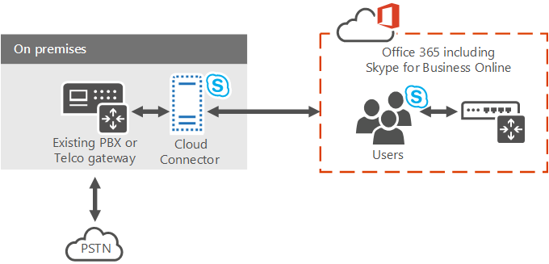

# <a name="plan-for-skype-for-business-cloud-connector-edition"></a>Planeación de Skype empresarial Cloud Connector Edition

> [!Important]
> Cloud Connector Edition se retirará del 31 de julio de 2021 junto con Skype empresarial online. Una vez que la organización haya actualizado a Teams, obtenga información sobre cómo conectar la red de telefonía local a Microsoft Teams mediante el [enrutamiento directo](https://docs.microsoft.com/MicrosoftTeams/direct-routing-landing-page).

Obtenga información sobre Skype empresarial Cloud Connector Edition, un conjunto de máquinas virtuales (VM) empaquetadas que implementan la conectividad con RTC local con el sistema telefónico (PBX en la nube).

Cloud Connector Edition puede ser la solución adecuada para su organización si todavía no tiene una implementación de Lync Server o Skype empresarial Server existente. Si aún está investigando qué solución de sistema telefónico es adecuada para su negocio, consulte [Microsoft Telephony Solutions](https://docs.microsoft.com/SkypeForBusiness/hybrid/msft-telephony-solutions).

En este documento se describen los requisitos y las topologías admitidas de Cloud Connector Edition, y se facilita la planeación de la implementación de Cloud Connector Edition. Asegúrese de leer este tema antes de configurar el entorno de Cloud Connector. Cuando esté preparado para implementar y configurar Cloud Connector Edition, consulte [Configure and Manage Skype for Business Cloud Connector Edition](configure-skype-for-business-cloud-connector-edition.md).

Cloud Connector Edition 2,1 ya está disponible. Si aún no ha actualizado a 2,1, consulte [Upgrade to a new version of Cloud Connector](upgrade-to-a-new-version-of-cloud-connector.md). Puede encontrar el archivo de instalación en [https://aka.ms/CloudConnectorInstaller](https://aka.ms/CloudConnectorInstaller) .

> [!NOTE]
> Microsoft admite la versión anterior de Cloud Connector Edition para 60 días después de la publicación de una nueva versión. Microsoft admitirá la versión 2.0.1 durante 60 días después de la publicación de 2,1 para permitirle el tiempo de actualización. Todas las versiones anteriores a 2.0.1 ya no se admiten.

Cloud Connector Edition es una oferta híbrida que consta de un conjunto de máquinas virtuales (VM) empaquetadas que implementan la conectividad con RTC local con el sistema telefónico. Mediante la implementación de una topología mínima de Skype empresarial Server en un entorno virtualizado, los usuarios de la organización hospedados en la nube pueden recibir servicios de PBX de la nube de Microsoft, pero la conectividad con RTC se proporciona a través de la infraestructura de voz local existente.



Como Cloud Connector le permite integrar servicios de sistema telefónico con su entorno de telefonía existente (por ejemplo, PBX, dispositivos analógicos y centros de llamadas), puede implementar una migración por fases desde la solución de telefonía existente al sistema telefónico.

Por ejemplo, supongamos que su compañía tiene un avanzado centro de llamadas con funciones específicas que el sistema telefónico no proporciona. Puede elegir dejar a los usuarios del centro de llamadas con la solución existente, pero mover otros usuarios al sistema telefónico.

Cloud Connector proporcionará enrutamiento entre los usuarios hospedados de forma local y en línea, y puede elegir usar su propio proveedor de RTC con sistema telefónico.

Tenga en cuenta lo siguiente al planear la implementación de Cloud Connector Edition:

- Para usar Cloud Connector para aprovechar las soluciones de voz en la nube, necesitará registrarse en una organización de Microsoft 365 o de Office 365 que incluya el sistema telefónico. Si todavía no tiene una organización de Microsoft 365 u Office 365, puede obtener información sobre cómo suscribirse aquí: [Microsoft 365 para empresas](https://products.office.com/business/office). Tenga en cuenta que tendrá que registrarse para obtener un plan que incluya Skype empresarial online.

- Para registrar los dispositivos de Cloud Connector con el servicio de Skype empresarial online y ejecutar varios cmdlets, Cloud Connector 2,0 y versiones posteriores requieren una cuenta de Microsoft 365 u Office 365 dedicada con los derechos de administrador de inquilinos de Skype empresarial. Las versiones de Cloud Connector anteriores a 2,0 requieren una cuenta de Microsoft 365 o de Office 365 dedicada con derechos de administrador global de inquilinos.

- Cloud Connector no requiere una implementación completa de Skype empresarial Server local.

    Actualmente, Cloud Connector no puede coexistir con servidores locales de Lync o Skype empresarial. Si desea mover los usuarios existentes de Lync o Skype empresarial a Microsoft 365 y mantener la telefonía local a los usuarios, considere la posibilidad de usar sistema telefónico con conectividad local con una implementación de Skype empresarial Server existente. Para obtener más información, vea [planear la solución de sistema telefónico (PBX en la nube)](plan-your-phone-system-cloud-pbx-solution.md) y [planificar el sistema telefónico con conectividad RTC local en Skype empresarial Server](plan-phone-system-with-on-premises-pstn-connectivity.md).

- Si tenía una implementación anterior de Skype empresarial o Lync Server y amplió el esquema, no es necesario que limpie el esquema para la implementación de Cloud Connector, siempre que haya quitado todos los componentes de Skype empresarial o Lync Server del entorno.

- Los usuarios se hospedan en línea.

- Si su organización ha configurado la sincronización de directorios (DirSync), todas las cuentas de usuarios que están planeadas para la voz híbrida deben crearse primero en la implementación local y, a continuación, sincronizarse en la nube.

- Si es necesario, puede mantener su operador de RTC actual.

- Si quiere proporcionar conferencias de acceso telefónico local a los usuarios hospedados en Cloud Connector, puede comprar una licencia de conferencia RTC o bien pagar a medida que la oferta de conferencia de audio de Microsoft.

- La licencia de audioconferencia (o la oferta de pago) también es necesaria para las escalaciones de llamadas. Si un usuario de Skype empresarial recibe una llamada de un usuario de RTC externo y quiere agregar un participante más a esa llamada (remitir la llamada a una conferencia), la escalabilidad se realizará a través del servicio de audioconferencia de Microsoft.

- Cloud Connector 2,0 y versiones posteriores ahora admiten la omisión de medios. La omisión de medios permite a un cliente enviar medios directamente al próximo salto de la red telefónica conmutada (RTC), una puerta de enlace o un controlador de borde de sesión (SBC), y eliminar el componente de Cloud Connector Edition de la ruta de medios. Para obtener más información, vea [Plan for Media bypass in Cloud Connector Edition](plan-for-media-bypass-in-cloud-connector-edition.md).

- Cloud Connector 2,1 y versiones posteriores admiten la supervisión de Cloud Connector mediante Operations Management Suite (OMS). Para obtener más información, vea [monitor Cloud Connector Using Operations Management Suite (OMS)](monitor-cloud-connector-using-operations-management-suite-oms.md) .

- Cloud Connector está disponible en todos los países en los que Office 365 Enterprise E5 está disponible.

En este tema se presentan las siguientes secciones:

- [Componentes de Cloud Connector Edition](plan-skype-for-business-cloud-connector-edition.md#BKMK_Components)

- [Topologías de Cloud Connector Edition](plan-skype-for-business-cloud-connector-edition.md#BKMK_Topologies)

- [Requisitos para la implementación](plan-skype-for-business-cloud-connector-edition.md#BKMK_Requirements)

- [Información que debe recopilar antes de la implementación](plan-skype-for-business-cloud-connector-edition.md#BKMK_PlanDeployment)

- [Consideraciones sobre el plan de marcado](plan-skype-for-business-cloud-connector-edition.md#BKMK_DailPlan)

- [Consideraciones sobre alta disponibilidad](plan-skype-for-business-cloud-connector-edition.md#BKMK_HA)

- [Flujo de medios de Cloud Connector](plan-skype-for-business-cloud-connector-edition.md#BKMK_MediaFlow)

- [Supervisión y solución de problemas](plan-skype-for-business-cloud-connector-edition.md#BKMK_Monitor)

- [Más información](plan-skype-for-business-cloud-connector-edition.md#BKMK_MoreInfo)

## <a name="cloud-connector-edition-components"></a>Componentes de Cloud Connector Edition
<a name="BKMK_Components"> </a>

Con Cloud Connector Edition, se implementa un conjunto de máquinas virtuales empaquetadas que contienen una topología mínima de Skype empresarial Server, que consiste en un componente perimetral, un componente de mediación y un rol de almacén de administración central (CMS). También instalará un controlador de dominio, que es necesario para el funcionamiento interno de Cloud Connector. Estos servicios se configuran para entornos híbridos con la organización de Microsoft 365 u Office 365 que incluye los servicios de Skype empresarial online.


Los componentes de Cloud Connector proporcionan las siguientes funciones:

- **Componente perimetral** : la comunicación entre la topología local y los servicios en línea va a través del componente perimetral, que incluye los siguientes componentes:

  - Servidor **perimetral de acceso** : proporciona enrutamiento SIP entre la implementación local y Skype empresarial online.

  - **Relé multimedia** : proporciona enrutamiento de medios entre el componente de mediación y otros extremos multimedia.

  - **Autenticación de relé multimedia/MRAS** : genera tokens para obtener acceso al relé multimedia.

- **Enrutamiento de salida** : proporciona equilibrio de carga del tráfico de voz entre puertas de enlace o SBC conectados a un dispositivo de Cloud Connector. Las llamadas se dividirán uniformemente entre todas las puertas de enlace o los SBC conectados al dispositivo de Cloud Connector.

    Proporciona enrutamiento a puertas de enlace basadas en directivas. Solo se admiten las directivas globales que se basan en números RTC de destino (salida).

- **Rol de almacén de administración central (CMS)** : incluye el almacén de configuración para los componentes de la topología, incluida la transferencia de archivos CMS.

- **Réplica del almacén de administración central (CMS)** : sincroniza la información de configuración de la base de datos del CMS global en el servidor de roles de CMS.

- **Domain Controller** : Cloud Connector Cloud Connector servicios de dominio de Active Directory para almacenar todos los grupos y la configuración global necesarios para implementar los componentes de Cloud Connector. Se creará un bosque para cada dispositivo de Cloud Connector. El controlador de dominio no debe tener ninguna conexión con el Active Directory de producción. Los servicios de Active Directory incluyen:

  - Servicios de dominio de Active Directory

  - Servicios de certificados de Active Directory para emitir certificados internos

- **Componente de mediación** : implementa el protocolo de asignación de puertas de enlace de medios y SIP entre Skype empresarial y puertas de enlace RTC. Incluye una réplica de CMS que sincroniza la configuración de la base de datos de CMS global.

## <a name="cloud-connector-edition-topologies"></a>Topologías de Cloud Connector Edition
<a name="BKMK_Topologies"> </a>

A efectos de esta discusión, haremos referencia a sitios RTC. Un sitio RTC es una combinación de dispositivos de Cloud Connector, implementado en la misma ubicación y con puertas de enlace RTC comunes conectadas a ellos. Los sitios RTC le permiten:

- Proporcionar conectividad a las puertas de enlace más cercanas a los usuarios.

- Permita la escalabilidad mediante la implementación de varios dispositivos de Cloud Connector en uno o más sitios RTC.

- Permitir la alta disponibilidad mediante la implementación de varios dispositivos de Cloud Connector en un solo sitio RTC.

En este tema se presentan los sitios RTC. Para obtener más información acerca de la planeación de los sitios RTC, consulte [Plan for Cloud Connector Edition RTC sites](plan-for-cloud-connector-edition-pstn-sites.md).

Puede implementar las siguientes topologías de Cloud Connector:

- Un único dispositivo de Cloud Connector Edition por sitio RTC. Esta topología se recomienda solo con fines de evaluación, ya que no proporciona alta disponibilidad.

- Varios dispositivos de Cloud Connector Edition por sitio RTC para proporcionar alta disponibilidad.

- Varios sitios RTC con varios dispositivos de Cloud Connector Edition para proporcionar escalabilidad con alta disponibilidad. Puede implementar hasta 200 sitios.

Al planear la topología, tenga en cuenta lo siguiente:

- Con Cloud Connector 2,0 y versiones posteriores, un sitio de RTC puede tener hasta 16 dispositivos de Cloud Connector. Las versiones anteriores admiten hasta 4 dispositivos por sitio.

- Hay dos tipos de configuraciones de hardware probadas con Cloud Connector:

  - La versión más grande es capaz de controlar grandes volúmenes de llamadas simultáneas y es compatible con todos los tipos de entornos de producción.

  - La versión más pequeña está pensada para ejecutarse en hardware de menor tamaño y puede usarse con fines de evaluación o para sitios con pocos volúmenes de llamadas. Si implementa una versión más pequeña de Cloud Connector, debe tener en cuenta los requisitos de hardware de clase de producción (como fuentes de alimentación dobles).

- Si tiene Cloud Connector versión 2,0 o posterior e implementa la configuración máxima de 16 dispositivos (con hardware más grande), el sitio RTC puede administrar hasta 8.000 llamadas simultáneas. Si implementa la versión más pequeña, el límite admitido es 800.

    También tiene que dedicar algunos dispositivos para una alta disponibilidad. La recomendación mínima es que un dispositivo debe reservarse para una alta disponibilidad.

  - Con la versión 2, si implementa una configuración de 15 + 1, su sitio RTC puede administrar hasta 7.500 llamadas simultáneas.

  - Si tiene una versión anterior e implementa la configuración máxima de 3 + 1 (con hardware más grande), el sitio RTC puede administrar hasta 1500 llamadas simultáneas. Si implementa la versión más pequeña, el límite admitido es 150.

-  Si necesita tener más llamadas por sitio de RTC, puede escalar hacia arriba implementando sitios de RTC adicionales en la misma ubicación.

> [!NOTE]
> A menos que se indique lo contrario, los diagramas y ejemplos siguientes suponen el uso de la versión más grande de Cloud Connector.

### <a name="single-cloud-connector-appliance-within-a-single-pstn-site"></a>Dispositivo único de Cloud Connector en un solo sitio RTC

El siguiente diagrama muestra un solo dispositivo de Cloud Connector Edition en un solo sitio RTC. Tenga en cuenta que Cloud Connector consta de cuatro máquinas virtuales instaladas en una máquina host física que está dentro de una red perimetral por motivos de seguridad.


### <a name="multiple-cloud-connector-appliances-within-a-single-pstn-site"></a>Varios dispositivos de Cloud Connector en un solo sitio RTC

 Por motivos de escalabilidad y alta disponibilidad, puede elegir tener varias ediciones de Cloud Connector en un solo sitio RTC, como se muestra en el siguiente diagrama. Tenga en cuenta lo siguiente:

- Las llamadas se distribuyen en orden aleatorio entre los conectores de la nube en un grupo.

- Para la planeación de la capacidad, debe tener en cuenta la capacidad de controlar la carga si uno o más conectores de nube están sin conexión, en función de los siguientes cálculos:

  - **N + 1 cuadros.** Para la versión más grande de Cloud Connector, N + 1 cuadros admiten 500 \* N llamadas simultáneas con un 99,8% de disponibilidad.

    Para la versión más pequeña de Cloud Connector, N + 1 cuadros admiten 50 \* N llamadas simultáneas con un 99,8% de disponibilidad.

  - **N + 2 cuadros.** Para la versión más grande de Cloud Connector, N + 2 cuadros admiten 500 \* N llamadas simultáneas con un 99,9% de disponibilidad.

    Para la versión más pequeña de Cloud Connector, N + 2 cuadros admiten 50 \* N llamadas simultáneas con un 99,9% de disponibilidad.


### <a name="multiple-pstn-sites-with-one-or-more-cloud-connectors-per-site"></a>Varios sitios RTC con uno o más conectores de nube por sitio

También puede elegir tener varios sitios RTC con una o varias ediciones de Cloud Connector en cada sitio. Si el sitio RTC alcanza el límite de llamadas simultáneas, puede agregar otro sitio RTC para administrar la carga.

Varios sitios RTC también le permiten proporcionar conectividad a las puertas de enlace más cercanas a sus usuarios. Por ejemplo, supongamos que tiene puertas de enlace RTC en Seattle y Ámsterdam. Puede implementar dos sitios RTC (uno en Seattle, uno en Amsterdam) y asignar a los usuarios que usen el sitio RTC más cercano. Los usuarios de Seattle se enrutarán al sitio y las puertas de enlace RTC de Seattle, mientras que los usuarios de Amsterdam se enrutarán al sitio RTC y a las puertas de enlace de Amsterdam:


## <a name="requirements-for-deployment"></a>Requisitos para la implementación
<a name="BKMK_Requirements"> </a>

Antes de implementar Cloud Connector Edition, asegúrese de que tiene lo siguiente en su entorno:

- **Para la máquina host:** Las máquinas virtuales de Cloud Connector deben implementarse en hardware dedicado que ejecute Windows Server 2012 R2 Datacenter Edition (Inglés) con el rol de Hyper-V habilitado.

    Para la versión 2,0 y posteriores, la tarjeta de red de equipo host enlazada al conmutador de red corporativa de Skype empresarial debe tener una dirección IP configurada en la misma subred que los equipos de red corporativos de Cloud Connector.

- Para las versiones 2,1 y posteriores, el dispositivo de host debe tener instalado .NET Framework 4.6.1 o posterior.

- **Para las máquinas virtuales:** Una imagen ISO (. ISO) de Windows Server 2012 R2 (en inglés). La ISO se convertirá en VHD para las máquinas virtuales que ejecutarán Skype empresarial Cloud Connector Edition.

- El hardware necesario para admitir la instalación de las 4 VM para cada edición de Cloud Connector en su implementación. Se recomiendan las siguientes configuraciones:

  - procesador dual de 64 bits, seis núcleos (12 núcleos reales), 2,50 gigahercios (GHz) o superior

  - 64 gigabytes (GB) de RAM con ECC

  - 4 600 GB (o superior) 10K RPM 128M caché de 6Gbps de disco, configurada en una configuración RAID 5

  - Tres adaptadores de red de alto rendimiento RJ45 de 1 Gbps

- Si opta por implementar la versión más pequeña de Cloud Connector Edition que admite hasta 50 llamadas simultáneas, necesitará el siguiente hardware:

  - Intel i7 4790 de cuatro núcleos con gráficos Intel 4600 (no se necesitan gráficos de gama alta)

  - 32 GB DDR3-1600 sin ECC

  - 2: SATA III a 7200 RPM (6 Gbps) en RAID 0

  - Ethernet 2:1 Gbps (RJ45)

- Si se requiere un servidor proxy en el equipo host para explorar Internet, debe realizar los siguientes cambios en la configuración:

  - Para omitir el proxy, especifique la configuración de proxy WinHTTP con el servidor proxy y una lista de omisión que incluya el \* "192.168.213". red usada por los servicios de administración de Cloud Connector y la subred de red corporativa de Skype empresarial, tal como se define en el archivo de CloudConnector.ini. De lo contrario, se producirá un error en la conectividad de administración y se evitará la implementación y la recuperación automática de Cloud Connector. A continuación se muestra un ejemplo de comando de configuración WinHTTP: netsh WinHTTP Set proxy "10.10.10.175:8080" bypass-List = " \* . local; 1. \* ; 172,20. \* ; 192.168.218. \* ' \<local\> ".

  - Especifique la configuración de proxy por equipo en lugar de por usuario. De lo contrario, se producirá un error de descargas de Cloud Connector. Puede especificar la configuración de proxy por equipo con un cambio en el registro o con la configuración de la Directiva de grupo como se indica a continuación:

  - **Registro:** HKEY_LOCAL_MACHINE \SOFTWARE\Policies\Microsoft\Windows\CurrentVersion\Internet configuración de la ProxySettingsPerUser DWORD: 00000000

  - **Directiva de Grupo:** \>Plantillas administrativas de equipo \> componentes de Windows \> Internet Explorer: establecer la configuración de proxy por máquina (en lugar de por usuario)

- PBX/tronco cualificado o SBC/puerta de enlace apta (se recomienda un mínimo de dos puertas de enlace).

    Cloud Connector admite los mismos controladores de borde de sesión (SBCs) que están certificados para Skype empresarial. Para obtener más información, vea [infraestructura de telefonía para Skype empresarial](https://docs.microsoft.com/SkypeForBusiness/certification/infra-gateways).

- Una cuenta de administrador de servidor local con permisos para instalar y configurar Hyper-V en los servidores host. La cuenta debe tener permisos de administrador en el servidor local donde se instala y configura Hyper-V.

- Durante la implementación, se le pedirá que cree una cuenta de administrador de dominio con permisos para crear y publicar la topología en el dominio de Cloud Connector.

- Los registros DNS externos, que se definen en el archivo de CloudConnector.ini que se incluye con el paquete de instalación:

  - Registro DNS externo para el servicio perimetral de acceso del componente perimetral; por ejemplo, AP. \<Domain Name\> . Necesita un registro por cada sitio RTC. Este registro debe contener direcciones IP de todos los bordes de ese sitio.

- Una organización de Microsoft 365 u Office 365 con todos los registros DNS y SRV necesarios creados.

    > [!IMPORTANT]
    > Al integrar el inquilino con Cloud Connector Edition, no se admite el uso del sufijo de dominio predeterminado,. onmicrosoft.com, como dominio SIP de su organización. > no puede usar SIP.\<Domain Name\> como nombre de la interfaz del proxy de acceso perimetral de Cloud Connector porque este registro DNS se usa en Microsoft 365 y Office 365.

- Un certificado para el servidor perimetral externo Obtenido de una entidad de certificación (CA) pública.

- Se han completado las reglas de Firewall para permitir el tráfico a través de los puertos necesarios.

- Una conexión a Internet para el equipo host y las máquinas virtuales. Cloud Connector descarga software de Internet; por lo tanto, debe proporcionar la información de la puerta de enlace y del servidor DNS para que la máquina host de Cloud Connector y las VM puedan conectarse a Internet y descargar el software necesario.

- Un módulo de PowerShell remoto del inquilino instalado en el equipo host.

- Las credenciales de administrador de Skype empresarial para ejecutar PowerShell remoto.

    > [!IMPORTANT]
    > La cuenta de administrador no debe tener habilitada la autenticación multifactor.

> [!NOTE]
> La implementación de Cloud Connector solo se admite en la plataforma virtualizada de Microsoft Hyper-V. No se admiten otras plataformas, como VMware y Amazon Web Services.

> [!NOTE]
> La guía de hardware mínima para ejecutar Cloud Connector se basa en la capacidad de hardware básica (núcleos, MHz, gigabytes, etc.) con un búfer para acomodar los problemas de rendimiento intangible escondidos en la arquitectura de cualquier equipo. Microsoft ha ejecutado peores pruebas de carga en hardware disponible en el comercio que cumple con las instrucciones mínimas. Se comprueba la calidad de los medios y el rendimiento del sistema. Los socios de dispositivos oficiales de Cloud Connector de Microsoft tienen implementaciones de hardware específicas de Cloud Connector en las que han probado el rendimiento de forma independiente y se reparten por la idoneidad de su hardware para cumplir los requisitos de carga y calidad.

> [!NOTE]
> Los dispositivos creados por AudioCodes y Sonus han modificado el código y se ejecutan en Windows Server Standard Edition. Estos dispositivos son compatibles.

## <a name="information-you-need-to-gather-before-deployment"></a>Información que debe recopilar antes de la implementación
<a name="BKMK_PlanDeployment"> </a>

Antes de comenzar con la implementación, debe determinar el tamaño de la implementación, los dominios SIP a los que se realiza el mantenimiento y la información de configuración de cada sitio RTC que piense implementar. Para empezar, deberá:

- Identifique todos los dominios SIP que se servirán por esta implementación en función de los URI de SIP que haya en uso en su compañía.

- Determine el número de sitios RTC que necesita implementar.

- Asegúrese de que tiene el hardware necesario para admitir las cuatro VM que instalará para cada edición de Cloud Connector.

Para cada sitio de RTC que vaya a implementar, debe:

- Cree nombres para todos los componentes de cada dispositivo de Cloud Connector (vea [determinar los parámetros de implementación](plan-skype-for-business-cloud-connector-edition.md#BKMK_SiteParams)).

- Definir intervalos de puertos (vea [puertos y protocolos](plan-skype-for-business-cloud-connector-edition.md#BKMB_Ports)).

- Crear registros DNS externos para el componente perimetral (vea [requisitos para la implementación](plan-skype-for-business-cloud-connector-edition.md#BKMK_Requirements)).

- Determinar los requisitos de certificado para el componente perimetral (vea [requisitos de certificados](plan-skype-for-business-cloud-connector-edition.md#BKMK_Certs)).

### <a name="ports-and-protocols"></a>Puertos y protocolos
<a name="BKMB_Ports"> </a>

Al definir intervalos de puertos de medios, tenga en cuenta lo siguiente:

- Los clientes siempre usan el intervalo de puertos 50000 a 50019 para el tráfico de medios: este intervalo está predefinido en Skype empresarial online y no se puede cambiar.

- De forma predeterminada, el componente de mediación usará el intervalo de puertos de 49 152 a 57 500 para el tráfico de medios. Sin embargo, la conexión se establece a través del firewall interno y, por motivos de seguridad, puede limitar este intervalo de puertos en la topología. Necesitará hasta 4 puertos por llamada. Si desea limitar el número de puertos entre el componente de mediación y la puerta de enlace RTC, también tendrá que configurar el intervalo de puertos correspondiente en la puerta de enlace.

- Debe implementar Cloud Connector en una red perimetral. Esto significa que tendrá dos firewalls:

  - El primer Firewall es externo entre Internet y la red perimetral.

  - El segundo servidor de seguridad es interno entre la red perimetral y la red interna.

    Los clientes pueden estar en Internet o en la red interna:

  - Los clientes de Internet se conectarán a la RTC a través del firewall externo a través del componente perimetral.

  - Los clientes de la red interna se conectarán a través del firewall interno al componente de mediación en la red perimetral, que conectará el tráfico a la puerta de enlace RTC o SBC.

    Esto significa que necesita abrir los puertos en ambos firewalls.

En las tablas siguientes se describen los puertos y los intervalos de puertos para los firewalls externos e internos.

En esta tabla se muestran los puertos y los intervalos de puertos para habilitar la comunicación entre los clientes de la red interna y el componente de mediación:

**Firewall interno**


|**IP de origen**|**IP de destino**|**Puerto de origen**|**Puerto de destino**|
|:-----|:-----|:-----|:-----|
|Componente de mediación de Cloud Connector  <br/> |Puerta de enlace RTC/SBC  <br/> |Cualquiera  <br/> |TCP 5060\*\*  <br/> |
|Puerta de enlace RTC/SBC  <br/> |Componente de mediación de Cloud Connector  <br/> |Cualquiera  <br/> |TCP 5068/TLS 5067  <br/> |
|Componente de mediación de Cloud Connector  <br/> |Puerta de enlace RTC/SBC  <br/> |UDP 49 152-57 500  <br/> |Todas\*\*\*  <br/> |
|Puerta de enlace RTC/SBC  <br/> |Componente de mediación de Cloud Connector  <br/> |Todas\*\*\*  <br/> |UDP 49 152-57 500  <br/> |
|Componente de mediación de Cloud Connector  <br/> |Clientes internos  <br/> |TCP 49 152-57 500\*  <br/> |TCP 50000-50019  <br/> Opcional  <br/> |
|Componente de mediación de Cloud Connector  <br/> |Clientes internos  <br/> |UDP 49 152-57 500\*  <br/> |UDP 50000-50019  <br/> |
|Clientes internos  <br/> |Componente de mediación de Cloud Connector  <br/> |TCP 50000-50019  <br/> |TCP 49 152-57 500\*  <br/> |
|Clientes internos  <br/> |Componente de mediación de Cloud Connector  <br/> |UDP 50000-50019  <br/> |UDP 49 152-57 500\*  <br/> |

\* Se trata del intervalo de puertos predeterminado en el componente de mediación. Para un flujo de llamadas óptimo, se necesitan cuatro puertos por llamada.

\*\* Este puerto debe configurarse en la puerta de enlace RTC/SBC; 5060 es un ejemplo. Puede configurar otros puertos en la puerta de enlace RTC/SBC.

\*\*\* Tenga en cuenta que también puede limitar el intervalo de puertos en su SBC/Gateway si lo permite el fabricante de SBC/puerta de enlace.

Por motivos de seguridad, puede limitar el intervalo de puertos para el componente de mediación con el cmdlet [set-CsMediationServer](https://docs.microsoft.com/powershell/module/skype/set-csmediationserver?view=skype-ps) .

Por ejemplo, el siguiente comando limita el número de puertos que el componente de mediación usará para el tráfico de medios hasta 50 000-51 000 para el audio (entrante y saliente). El componente de mediación será capaz de controlar 250 llamadas simultáneas con esta configuración. Tenga en cuenta que también es posible que desee limitar este intervalo en la puerta de enlace RTC/SBC:

```powershell
Set-CSMediationServer -Identity MediationServer:mspool.contoso.com -AudioPortStart 50000 - AudioPortCount 1000
```

Para recuperar el nombre del componente de mediación y ver los puertos predeterminados, puede usar el cmdlet [Get-CsService](https://docs.microsoft.com/powershell/module/skype/get-csservice?view=skype-ps) de la siguiente manera:

```powershell
Get-CsService -MediationServer | Select-Object Identity, AudioPortStart, AudioPortCount
```

En la siguiente tabla se muestran los puertos y los intervalos de puertos para habilitar la comunicación entre el componente perimetral de Cloud Connector y el firewall externo. En esta tabla se muestra una recomendación mínima.

En este caso, todo el tráfico multimedia a Internet fluirá a través del perímetro en línea de la siguiente manera: punto de conexión de usuario-- \> perímetro en línea--servidor perimetral de \> Cloud Connector:

**Firewall externo: configuración mínima**


|**IP de origen**|**IP de destino**|**Puerto de origen**|**Puerto de destino**|
|:-----|:-----|:-----|:-----|
|Cualquiera  <br/> |Interfaz externa perimetral de Cloud Connector  <br/> |Cualquiera  <br/> |TCP (MTLS) 5061  <br/> |
|Interfaz externa perimetral de Cloud Connector  <br/> |Cualquiera  <br/> |Cualquiera  <br/> |TCP (MTLS) 5061  <br/> |
|Interfaz externa perimetral de Cloud Connector  <br/> |Cualquiera  <br/> |Cualquiera  <br/> |TCP 80  <br/> |
|Interfaz externa perimetral de Cloud Connector  <br/> |Cualquiera  <br/> |Cualquiera  <br/> |UDP 53  <br/> |
|Interfaz externa perimetral de Cloud Connector  <br/> |Cualquiera  <br/> |Cualquiera  <br/> |TCP 53  <br/> |
|Interfaz externa perimetral de Cloud Connector  <br/> |Cualquiera  <br/> |UDP 3478  <br/> |UDP 3478  <br/> |
|Cualquiera  <br/> |Interfaz externa perimetral de Cloud Connector  <br/> |TCP 50000-59.999  <br/> |TCP 443  <br/> |
|Cualquiera  <br/> |Interfaz externa perimetral de Cloud Connector  <br/> |UDP 3478  <br/> |UDP 3478  <br/> |
|Interfaz externa perimetral de Cloud Connector  <br/> |Cualquiera  <br/> |TCP 50000-59.999  <br/> |TCP 443  <br/> |

En la siguiente tabla se muestran los puertos y los intervalos de puertos para habilitar la comunicación entre el componente perimetral de Cloud Connector y el firewall externo. En esta tabla se muestra la solución recomendada.

En este caso, todo el tráfico de medios para el punto de conexión en Internet puede fluir directamente al componente perimetral de Cloud Connector. La ruta de medios será el punto de conexión del usuario: \> conector de Cloud Connector.

> [!NOTE]
> Esta solución no funcionará si el extremo del usuario está detrás de un NAT simétrico.

**Firewall externo: configuración recomendada**


|**IP de origen**|**IP de destino**|**Puerto de origen**|**Puerto de destino**|
|:-----|:-----|:-----|:-----|
|Cualquiera  <br/> |Interfaz externa perimetral de Cloud Connector  <br/> |Cualquiera  <br/> |TCP (MTLS) 5061  <br/> |
|Interfaz externa perimetral de Cloud Connector  <br/> |Cualquiera  <br/> |Cualquiera  <br/> |TCP (MTLS) 5061  <br/> |
|Interfaz externa perimetral de Cloud Connector  <br/> |Cualquiera  <br/> |Cualquiera  <br/> |TCP 80  <br/> |
|Interfaz externa perimetral de Cloud Connector  <br/> |Cualquiera  <br/> |Cualquiera  <br/> |UDP 53  <br/> |
|Interfaz externa perimetral de Cloud Connector  <br/> |Cualquiera  <br/> |Cualquiera  <br/> |TCP 53  <br/> |
|Interfaz externa perimetral de Cloud Connector  <br/> |Cualquiera  <br/> |TCP 50000-59.999  <br/> |Cualquiera  <br/> |
|Interfaz externa perimetral de Cloud Connector  <br/> |Cualquiera  <br/> |UDP 3478; UDP 50000-59.999  <br/> |Cualquiera  <br/> |
|Cualquiera  <br/> |Interfaz externa perimetral de Cloud Connector  <br/> |Cualquiera  <br/> |TCP 443; TCP 50000-59.999  <br/> |
|Cualquiera  <br/> |Interfaz externa perimetral de Cloud Connector  <br/> |Cualquiera  <br/> |UDP 3478; UDP 50.000-59.999  <br/> |

### <a name="host-internet-connectivity-requirements"></a>Requisitos de conectividad de Internet de host
<a name="BKMB_Ports"> </a>

El equipo host debe ser capaz de llegar a los recursos externos para instalar, actualizar y administrar Cloud Connector correctamente. En la siguiente tabla se muestran los destinos y puertos necesarios entre el equipo host y los recursos externos.

|Dirección  <br/> |IP de origen  <br/> |IP de destino  <br/> |Puerto de origen  <br/> |Puerto de destino  <br/> |Protocolo  <br/> |Finalidad  <br/> |
|:-----|:-----|:-----|:-----|:-----|:-----|:-----|
|Salida  <br/> |IP de host de Cloud Connector  <br/> |cualquiera  <br/> |cualquiera  <br/> |53  <br/> |TCP/UDP  <br/> |DNS  <br/> |
|Salida  <br/> |IP de host de Cloud Connector  <br/> |cualquiera  <br/> |cualquiera  <br/> |80, 443  <br/> |TCP  <br/> |Lista de revocación de certificados (CRL)  <br/> |
|Salida  <br/> |IPs de host del conector de nube  <br/> |cualquiera  <br/> |cualquiera  <br/> |80, 443  <br/> |TCP  <br/> |Actualización de Cloud Connector  <br/> Skype Empresarial Online  <br/> PowerShell de administración  <br/> Windows Update  <br/> |

Si se requieren reglas más restrictivas, consulte las siguientes direcciones URL de la lista blanca:

- [Direcciones URL de la lista de revocación de certificados](https://support.office.com/article/Office-365-URLs-and-IP-address-ranges-8548a211-3fe7-47cb-abb1-355ea5aa88a2) en [Office 365 URL e intervalos de direcciones IP](https://support.office.com/article/Office-365-URLs-and-IP-address-ranges-8548a211-3fe7-47cb-abb1-355ea5aa88a2?ui=en-US&amp;rs=en-US&amp;ad=US)

- Windows Update: [Cómo configurar un firewall para las actualizaciones de software](https://technet.microsoft.com/library/bb693717.aspx)

- PowerShell de administración de Skype empresarial online: \* . online.Lync.com

    Si necesita una exclusión de proxy para este destino, tendrá que agregarla a la lista de omisión de WinHTTP.

- Actualización de Cloud Connector: [centro de descarga](https://aka.ms/CloudConnectorInstaller), [https://go.microsoft.com](https://go.microsoft.com) y [https://download.microsoft.com](https://download.microsoft.com)

### <a name="dns-name-resolution-for-the-edge-component"></a>Resolución de nombres DNS para el componente perimetral
<a name="BKMB_Ports"> </a>

El componente perimetral necesita resolver los nombres externos de los servicios de Microsoft 365 u Office 365 y los nombres internos de otros componentes de Cloud Connector.

Cada componente perimetral es un equipo multitarjeta con interfaces de conexión externa e interna. Cloud Connector implementa los servidores DNS en el componente de controlador de dominio dentro de la red perimetral. Puede dirigir el servidor perimetral al servidor DNS dentro del perímetro para todas las resoluciones de nombres, pero debe habilitar el servidor DNS de Cloud Connector para resolver los nombres externos estableciendo una zona DNS que contenga uno o más registros A de DNS para las consultas externas que hacen referencia a búsquedas de nombres en otros servidores DNS públicos.

En el archivo. ini, si establece el nombre de dominio completo para puertas de enlace del mismo espacio de dominio que el dominio SIP, la zona de autorización de este dominio SIP se creará en el servidor DNS dentro del perímetro. Si el servidor perimetral apunta a este servidor DNS para resolver nombres, Edge nunca resolverá el _sipfederationtls.\<yourdomain\> Registro DNS, que es necesario para el flujo de llamadas. En este caso, Microsoft recomienda proporcionar un servidor DNS en la interfaz perimetral externa para resolver las búsquedas de nombres de Internet, y cada componente perimetral debe usar un archivo HOST para resolver otros nombres de componentes de Cloud Connector en direcciones IP.

> [!NOTE]
> Por motivos de seguridad, le recomendamos que no apunte el servidor DNS de Cloud Connector a los servidores internos en el dominio de producción para la resolución de nombres.

### <a name="determine-deployment-parameters"></a>Determinación de los parámetros de implementación
<a name="BKMK_SiteParams"> </a>

En primer lugar, debe definir los siguientes parámetros de implementación comunes:


|**Elemento**|**Descripción**|**Notas**|
|:-----|:-----|:-----|
|Dominios SIP  <br/> |URI de SIP que usan los usuarios de la empresa. Proporcionar todos los dominios SIP que se servirán por esta implementación. Puede tener más de un dominio SIP.  <br/> ||
|Número de sitios RTC  <br/> |El número de sitios RTC que va a implementar.  <br/> ||

Para cada sitio de RTC que vaya a implementar, tendrá que recopilar la siguiente información antes de comenzar la implementación. Tendrá que proporcionar esta información cuando actualice el archivo de CloudConnector.ini.

Al configurar la información de la puerta de enlace, recuerde lo siguiente:

- Si solo tiene una puerta de enlace, quite la sección en el archivo. ini de la segunda puerta de enlace. Si hay más de dos puertas de enlace, siga el formato existente para agregar otras nuevas.

- Asegúrese de que la dirección IP y el puerto de las puertas de enlace sean correctos.

- Para admitir HA en el nivel de puerta de enlace RTC, mantenga la puerta de enlace secundaria o agregue puertas de enlace adicionales.

Opcional Para restringir los números de llamadas salientes, actualice el valor LocalRoute.


|**Parámetros del sitio**|**Descripción**|**Notas**|
|:-----|:-----|:-----|
|Nombre de dominio de máquina virtual  <br/> |Nombre de dominio para los componentes internos de Cloud Connector. Este dominio debe ser diferente del dominio de producción. El nombre debe ser el mismo en todos los dispositivos de Cloud Connector.  <br/> Nombre en archivo. ini: "VirtualMachineDomain"  <br/> |se prefiere el dominio. local.  <br/> |
|Nombre del controlador de dominio de Cloud Connector  <br/> |Nombre del controlador de dominio.  <br/> Nombre en archivo. ini: "ServerName"  <br/> |Debe tener 15 caracteres como máximo. Escriba solo el nombre NetBIOS.  <br/> |
|IP/máscara de subred del controlador de dominio de Cloud Connector  <br/> |Dirección IP del controlador de dominio.  <br/> Nombre en archivo. ini: "IP"  <br/> ||
|FQDN del servicio en línea de Microsoft 365 o Office 365  <br/> |Debe ser el valor predeterminado en la mayoría de los casos para la instancia de Microsoft 365 o de Office 365 en todo el mundo.  <br/> Nombre en archivo. ini: "OnlineSipFederationFqdn"  <br/> ||
|Nombresitio  <br/> |Nombre del sitio de Skype empresarial; por ejemplo, Seattle.  <br/> Nombre en archivo. ini: "Nombresitio"  <br/> Para la versión 1.4.1 y versiones posteriores, el nombre del sitio debe ser distinto para cada sitio y el nombre debe coincidir con el sitio RTC, si existe, definido en Microsoft 365 u Office 365. Tenga en cuenta que los sitios RTC se crearán automáticamente al registrar el primer dispositivo en un sitio.  <br/> ||
|HardwareType  <br/> Versión 1.4.1 y posteriores  <br/> |Tipo de hardware. El valor predeterminado es Normal. También puede establecer como mínimo.  <br/> ||
|Country Code  <br/> |Código de país para la marcación.  <br/> Nombre en archivo. ini: "CountryCode"  <br/> ||
|Ciudad  <br/> |City (opcional).  <br/> Nombre en archivo. ini: "City"  <br/> ||
|Estado  <br/> |State (opcional).  <br/> Nombre en archivo. ini: "State"  <br/> ||
|Dirección IP de la VM base  <br/> |La dirección IP de la VM base temporal que se usará para crear el VHDX para todas las máquinas virtuales de Cloud Connector. Esta IP debe estar en la misma subred de red corporativa perimetral definida en el siguiente paso y requiere acceso a Internet. Asegúrese de definir la puerta de enlace predeterminada corporativa y el DNS que es enrutable a Internet.  <br/> Nombre en archivo. ini: "BaseVMIP"  <br/> ||
|WSUSServer  <br/> WSUSStatusServer  <br/> Versión 1.4.1 y posteriores  <br/> |La dirección de Windows Server Update Services (WSUS), un servidor de la intranet para hospedar actualizaciones de Microsoft Update.  <br/> Puede dejarla en blanco si no se necesita WSUS.  <br/> ||
|Máscara de subred para red interna  <br/> |Cloud Connector configura una red IP para la comunicación interna entre los componentes de Cloud Connector. Edge también debe estar conectado a otra subred que permita la conectividad de Internet.  <br/> Nombre en archivo. ini: "Corpnetlpprefixlength" en "parámetros para un grupo de servidores de una red de VM"  <br/> ||
|Máscara de subred para red externa  <br/> |Para la red externa del componente perimetral.  <br/> Nombre en archivo. ini: "Internetlpprefix" en "parámetros para un grupo de servidores de una red de VM"  <br/> ||
|Cambiar el nombre de la red interna  <br/> |Nombre de conmutador que se usará para la red interna de Cloud Connector.  <br/> En la mayoría de los casos, se puede usar el valor sugerido predeterminado.  <br/> Nombre en archivo. ini: "CorpnetSwitchName" en "parámetros para un grupo de servidores de una red de VM"  <br/> ||
|Nombre de conmutador para red externa  <br/> |Nombre de conmutador que se usará para la red externa de Cloud Connector.  <br/> En la mayoría de los casos, se puede usar el valor sugerido predeterminado.  <br/> Nombre en archivo. ini: "InternetSwitchName" en "parámetros para un grupo de servidores de una red de VM"  <br/> ||
|Puerta de enlace predeterminada para red interna  <br/> |Esta puerta de enlace debe proporcionar acceso a Internet (Internet también requiere configurar el servidor DNS) y se configurará en interfaces internas de los componentes de Cloud Connector.  <br/> Nombre en archivo. ini: "CorpnetDefaultGateway" en "parámetros para un grupo de servidores de una red de VM"  <br/> ||
|Puerta de enlace predeterminada para la interfaz externa del componente perimetral  <br/> |Se configurará en la interfaz externa del componente perimetral.  <br/> Nombre en archivo. ini: "InternetDefaultGateway" en "parámetros para un grupo de servidores de una red de VM"  <br/> ||
|Servidor DNS para red interna  <br/> |Se configurará en la interfaz interna de la VM temporal. Debe proporcionar la resolución de nombres para los nombres de Internet. Si no se proporciona un servidor DNS, se producirá un error en la conexión a Internet y no se completará la implementación.  <br/> Nombre en archivo. ini: "Cropnetdnsipaddress" en "parámetros para un grupo de servidores de una red de VM"  <br/> ||
|Servidor DNS para la interfaz externa del componente perimetral  <br/> |Se configurará en la interfaz externa del servidor perimetral.  <br/> Nombre en archivo. ini: "InternetDNSIPAddress" en "parámetros para un grupo de servidores de una red de VM"  <br/> ||
|Nombre del conmutador de administración  <br/> |El conmutador de administración es un conmutador temporal que se creará automáticamente y que se usará para la configuración de Cloud Connector durante la implementación. Se desconectará automáticamente después de la implementación. Debe ser una subred diferente de cualquier otra red usada en Cloud Connector.  <br/> En la mayoría de los casos, se puede usar el valor sugerido predeterminado.  <br/> Nombre en archivo. ini: "ManagementSwitchName" en "parámetros para un grupo de servidores de una red de VM"  <br/> ||
|Dirección de subred/máscara de subred de administración  <br/> |La subred de administración es una subred temporal que se creará automáticamente y que se usará para la configuración de Cloud Connector durante la implementación. Se quitará automáticamente después de la implementación. Debe ser una subred diferente de cualquier otra red usada en Cloud Connector.  <br/> Nombres en archivo. ini: "ManagementIPPrefix" y "Managementopprefixlenght" en "parámetros para un grupo de servidores de una red de VM"  <br/> ||
|Máquina de almacén de administración central (CMS)  <br/> |FQDN único que se usa para el almacén de administración central (CMS). El nombre de dominio de AD se usará para generar el FQDN.  <br/> Nombre en archivo. ini: "ServerName" en "parámetros para el servicio de administración central principal"  <br/> |Debe tener 15 caracteres como máximo. Escriba solo el nombre NetBIOS.  <br/> (Nombre del grupo de CMS = nombre del servidor)  <br/> |
|Dirección IP de la máquina de CMS  <br/> |Dirección IP del servidor de CMS (interno en la red perimetral).  <br/> Nombre en archivo INI: "IP" en "parámetros para el servicio de administración central principal"  <br/> ||
|Nombre de recurso compartido de archivos  <br/> |Nombre del recurso compartido de archivos que se va a crear en el servidor de CMS para los datos de replicación de Skype empresarial (por ejemplo, CmsFileStore).  <br/> En la mayoría de los casos, se puede usar el valor sugerido predeterminado.  <br/> Nombre en archivo. ini: "CmsFileStore" en "parámetros para el servicio de administración central principal"  <br/> ||
|Nombre del grupo de componentes de mediación  <br/> |Nombre de grupo del componente de mediación. Escriba solo el nombre NetBIOS. El nombre de dominio de AD se usará para generar el FQDN.  <br/> Nombre en archivo. ini: "Nombredegrupo" en "parámetros para un grupo de servidores de mediación"  <br/> |Debe tener 15 caracteres como máximo. Escriba solo el nombre NetBIOS.  <br/> |
|Nombre del componente de mediación  <br/> |Nombre del componente de mediación 1. Escriba solo el nombre NetBIOS. El nombre de dominio de AD se usará para generar el FQDN.  <br/> Nombre en archivo. ini: "ServerName" en "parámetros para un grupo de servidores de mediación"  <br/> |Debe tener 15 caracteres como máximo. Escriba solo el nombre NetBIOS.  <br/> |
|Dirección IP de la máquina del componente de mediación  <br/> |IP de CorpNet interna para componente de mediación (interno en la red perimetral).  <br/> Nombre en archivo. ini: "IP" en "parámetros para un grupo de servidores de mediación"  <br/> ||
|Nombre interno del grupo de servidores perimetrales  <br/> |Nombre del grupo del componente perimetral. Escriba solo el nombre NetBIOS. El nombre de dominio de AD se usará para generar el FQDN.  <br/> Nombre en archivo. ini: "InternalPoolName" en "parámetros para un grupo de servidores perimetrales"  <br/> |Debe tener 15 caracteres como máximo. Escriba solo el nombre NetBIOS.  <br/> |
|Nombre interno del servidor perimetral  <br/> |Nombre de componente del componente perimetral. Escriba solo el nombre NetBIOS. El nombre de dominio de AD se usará para generar el FQDN.  <br/> Nombre en archivo. ini: "InternalServerName" en "parámetros para un grupo de servidores perimetrales"  <br/> |Debe tener 15 caracteres como máximo. Escriba solo el nombre NetBIOS.  <br/> |
|IP interna del servidor perimetral  <br/> |IP de la red del perímetro interno del componente perimetral para comunicarse con otros componentes de Cloud Connector.  <br/> Nombre en archivo. ini: "InternalServerIPs" en "parámetros para un grupo de servidores perimetrales"  <br/> ||
|Nombre externo de grupo de acceso  <br/> |Nombre del servidor perimetral de acceso; por ejemplo, AP. Este nombre debe coincidir con el nombre proporcionado para el certificado SSL. Escriba solo el nombre NetBIOS. El nombre de dominio SIP se usará para generar el FQDN. Se usará un nombre de grupo externo para todos los componentes perimetrales del grupo. Se requiere un grupo de acceso perimetral por cada sitio RTC.  <br/> Nombre en archivo. ini: "ExternalSIPPoolName" en "parámetros para un grupo de servidores perimetrales"  <br/> |Debe tener 15 caracteres como máximo. Escriba solo el nombre NetBIOS.  <br/> "SIP" está reservado y, por lo tanto, no se puede usar como nombre.  <br/> El nombre de FQDN generado debe coincidir con el nombre proporcionado para el certificado SSL.  <br/> |
|IP externa del servidor perimetral de acceso  <br/> |IP externa del componente perimetral: dirección IP pública si no hay ninguna NAT disponible o dirección IP traducida (especifique ambas direcciones si están asignadas).  <br/> Nombre en archivo. ini: "ExternalSIPIPs" en "parámetros para un grupo de servidores perimetrales"  <br/> ||
|Nombre de relé multimedia  <br/> |Nombre del servidor perimetral de relé multimedia de audio y vídeo; por ejemplo, Sr. Se usará un nombre de grupo externo para todos los componentes perimetrales de un grupo de servidores. Se requiere un grupo de relé multimedia perimetral por cada sitio RTC.  <br/> Nombre en archivo. ini: "ExternalMRFQDNPoolName" en "parámetros para un grupo de servidores perimetrales"  <br/> |Debe tener 15 caracteres como máximo. Escriba solo el nombre NetBIOS.  <br/> |
|IP externa del servidor perimetral de relé multimedia  <br/> |Actualmente, solo se admite una IP, por lo que será la misma IP que el servidor perimetral de acceso, ya sea una dirección IP pública o asignada (especifique ambas direcciones si está asignada). Puede ser la misma dirección que la IP externa del componente perimetral del servidor perimetral de acceso. Nota Si Edge está detrás de NAT, también tiene que especificar el valor para el siguiente parámetro.  <br/> Nombre en archivo. ini: "ExternalMRIPs" en "parámetros para un grupo de servidores perimetrales"  <br/> ||
|IP externa del servidor perimetral de relé multimedia (si el servidor perimetral está detrás de una NAT)  <br/> |Si el servidor perimetral está detrás de NAT, también necesitará especificar la dirección pública del dispositivo NAT.  <br/> Nombre en archivo. ini: "ExternalMRPublicIPs" en "parámetros para un grupo de servidores perimetrales"  <br/> ||
|Marca y modelo de puerta de enlace de voz 1  <br/> |Especifique la marca y el modelo de la puerta de enlace de voz o SBC. Tenga en cuenta que puede conectar un dispositivo o un tronco SIP de la lista de dispositivos probados en [https://technet.Microsoft.com/UCOIP](https://technet.Microsoft.com/UCOIP) .  <br/> ||
|Marca y modelo de puerta de enlace de voz 2 (Copie esta fila si tiene más de 2 puertas de enlace)  <br/> |Especifique la marca y el modelo de la puerta de enlace de voz. Tenga en cuenta que puede conectar un dispositivo de la lista de dispositivos probados en [https://technet.Microsoft.com/UCOIP](https://technet.Microsoft.com/UCOIP) .  <br/> ||
|Nombre de puerta de enlace de voz 1  <br/> |Se usa para generar el FQDN de la máquina con el dominio de AD. Requerido si se va a usar TLS entre el componente de mediación y la puerta de enlace de voz. Si no tiene previsto usar el FQDN (por ejemplo, no se requiere TLS o la puerta de enlace de voz no admite la conexión con FQDN (solo IP)), especifique.  <br/> ||
|Nombre de puerta de enlace de voz 2 (Copie esta fila si tiene más de 2 puertas de enlace)  <br/> |Se usa para generar el FQDN de la máquina con el dominio de AD. Requerido si se va a usar TLS entre el componente de mediación y la puerta de enlace de voz. Si no tiene previsto usar el FQDN (por ejemplo, no se requiere TLS o la puerta de enlace de voz no admite la conexión con FQDN (solo IP)), especifique.  <br/> ||
|Dirección IP de puerta de enlace de voz 1  <br/> |Dirección IP de la puerta de enlace de voz.  <br/> ||
|Dirección IP de puerta de enlace de voz 2 (Copie esta fila si tiene más de 2 puertas de enlace)  <br/> |Dirección IP de la puerta de enlace de voz.  <br/> ||
|N.º de puerto de puerta de enlace de voz 1 (Copie esta fila si tiene más de 2 puertas de enlace)  <br/> |Puerto que escuchará el tronco SIP de puerta de enlace de voz, por ejemplo 5060.  <br/> ||
|Puerto de puerta de enlace de voz 2 #  <br/> |Puerto que escuchará el tronco SIP de puerta de enlace de voz, por ejemplo 5060.  <br/> ||
|Protocolo de puerta de enlace de voz 1 para tráfico SIP  <br/> |TCP o TLS.  <br/> ||
|Protocolo de puerta de enlace de voz 2 para tráfico SIP (Copie esta fila si tiene más de 2 puertas de enlace)  <br/> |TCP o TLS.  <br/> ||
|Intervalo de puertos multimedia externos para el tráfico hacia y desde el componente perimetral  <br/> |Intervalo de puertos TCP/UDP para el tráfico de medios hacia y desde la interfaz externa del servidor perimetral. Debe comenzar siempre desde 50 000. Consulte "puertos y protocolos" para obtener más información.  <br/> |50000-59 999  <br/> |
|Intervalo de puertos multimedia para comunicarse desde o hacia el componente de mediación a través del firewall interno  <br/> |Intervalo de puertos UDP que el componente de mediación usará para comunicarse con clientes y puertas de enlace (Recomendación 4 puertos por llamada).  <br/> ||
|Intervalo de puertos multimedia para comunicarse con el cliente de Skype empresarial a través del firewall interno  <br/> |Por motivos de planeación, no se puede cambiar. Los puertos deben estar abiertos en el firewall interno para comunicarse entre los clientes de Skype empresarial dentro de la red interna y con el componente de mediación.  <br/> |50 000-50 019  <br/> |
|Contraseña del certificado público  <br/> |Debe proporcionarse en el script.  <br/> ||
|Contraseña de administrador de modo seguro  <br/> Solo la versión 1.4.2  <br/> |Contraseña de administrador en modo seguro para el dominio CC interno.  <br/> ||
|Contraseña de administrador de dominio de Cloud Connector  <br/> Solo la versión 1.4.2  <br/> |Contraseña del administrador de dominio de Cloud Connector (diferente del dominio de producción). El nombre de usuario es administrador. No puede cambiar el nombre de usuario.  <br/> ||
|Contraseña de administrador de máquinas virtuales  <br/> Solo la versión 1.4.2  <br/> |Se usa para configurar la red de administración durante la implementación.  <br/> El nombre de usuario es administrador. No puede cambiar el nombre de usuario.  <br/> ||
|CABackupFile  <br/> Versión 2,0 y posteriores  <br/> |Se usa para guardar el servicio de la entidad de certificación del servidor de Active Directory en un archivo al implementar varios dispositivos en un sitio de Cloud Connector. Asegúrese de usar la misma contraseña para todos los dispositivos dentro de un sitio de Cloud Connector para poder importar el archivo de copia de seguridad de la entidad de certificación a un nuevo dispositivo agregado correctamente.  <br/> ||
|CCEService  <br/> Versión 2,0 y posteriores  <br/> |Se usa para el servicio de administración de Cloud Connector; necesita acceso al directorio de sitios de Cloud Connector. Asegúrese de usar la misma contraseña para todos los dispositivos de un sitio de Cloud Connector.  <br/> ||
|Administrador de inquilinos de Microsoft 365 o Office 365  <br/> | Cloud Connector usa la cuenta para actualizar y administrar la configuración de inquilinos para Cloud Connector: <br/>  Versión 2,0 y posteriores: credenciales para una cuenta de Microsoft 365 o de Office 365 dedicada con derechos de administrador de Skype empresarial. <br/>  Versiones anteriores a 2,0: credenciales para una cuenta de Microsoft 365 o de Office 365 dedicada con derechos de administrador de inquilinos globales. <br/> ||
|Habilitar soporte de referencia  <br/> |Esto definirá si la compatibilidad de referencia SIP está habilitada o deshabilitada en la configuración de tronco de su IP/PBX. El valor predeterminado es True. Si la puerta de enlace IP/PBX admite la asistencia de referencia, déjela como true. Si no es así, este valor debe cambiarse a false. Si no está seguro de si la puerta de enlace admite referencia, consulte [IP-PBX y puertas de enlace válidas](https://docs.microsoft.com/SkypeForBusiness/certification/infra-gateways).   <br/> ||
|EnableFastFailoverTimer  <br/> Versión 2,0 y posteriores  <br/> |Con el valor predeterminado "true", si la puerta de enlace no responde a las llamadas salientes en un plazo de 10 segundos, se enrutarán a la siguiente puerta de enlace disponible; Si no hay troncos adicionales, la llamada se eliminará automáticamente.  <br/> Sin embargo, en una organización con redes y respuestas de puerta de enlace lentas, o cuando el proceso de establecimiento de llamadas tarda más de 10 segundos, esto podría dar como resultado la interrupción innecesaria de las llamadas.  <br/> Al realizar llamadas a algunos países (por ejemplo, Eau o Afganistán), llamar proceso puede tardar más de 10 segundos. Tendrá que cambiar el valor a false si encuentra problemas similares. No olvide cambiar la configuración correspondiente en el SBC o la puerta de enlace conectado.  <br/> El valor puede ser true o false. El valor predeterminado es True.  <br/> ||
|ForwardCallHistory  <br/> Versión 2,0 y posteriores  <br/> | Este parámetro se usa para activar los encabezados SIP que se usan para notificar al autor de la llamada inicial en escenarios de llamadas simultáneas, desvíos de llamadas y transferencia de llamadas. Si se establece el parámetro en true, se activarán dos encabezados SIP: <br/>  Historial-información <br/>  Referido por <br/>  El encabezado de información de historial se usa para redirigir solicitudes SIP y "proporciona (s) un mecanismo estándar para capturar la información del historial de solicitudes para habilitar una amplia variedad de servicios para redes y usuarios finales" ([RFC 4244-sección 1,1](http://www.ietf.org/rfc/rfc4244.txt)). Para las interfaces de tronco de Cloud Connector, se usa en los escenarios de situaciones y desvío de llamadas.  <br/>  El valor puede ser true o false. El valor predeterminado es False. <br/> ||
|Reenviar PAI  <br/> Versión 2,0 y posteriores  <br/> |PAI es una extensión privada para SIP que permite a los servidores SIP declarar la identidad de los usuarios autenticados. En el caso del proveedor de tronco SIP, PAI puede usarse con fines de facturación en el caso de que los encabezados History-info y a los que se hace referencia no estén presentes. Cuando reenviar la identidad de P-asserted-Identity está habilitado en la configuración, el servidor de mediación reenviará los encabezados PAI con &amp; URI de Tel SIP de Cloud Connector al tronco SIP. El servidor de mediación reenviará los encabezados PAI con &amp; números E. 164 del URI de Tel solo se recibieron en el tronco SIP a Cloud Connector. El servidor de mediación también reenviará los encabezados de privacidad que se hayan recibido en cualquier dirección. Si la solicitud SIP enviada por el servidor de mediación incluye un encabezado de privacidad con el formato-"Privacy: ID" junto con el encabezado PAI, la identidad que se ha declarado debe mantenerse privada fuera del dominio de confianza de la red.  <br/> El valor puede ser true o false. El valor predeterminado es False.  <br/> ||

### <a name="certificate-requirements"></a>Requisitos de certificado
<a name="BKMK_Certs"> </a>

Cada componente perimetral requiere un certificado de una entidad de certificación pública. Los certificados deben tener una clave privada exportable para copiar entre los componentes perimetrales. Para cumplir con los requisitos de certificado, deberá decidir entre las siguientes opciones y proporcionar el nombre de sujeto (SN) y el nombre alternativo del sujeto (SAN) para el certificado.

 **Si tiene un único dominio SIP:**

- **Opción 1.** El nombre del sujeto debe contener el nombre del grupo que asignó a los componentes de la periferia. Tenga en cuenta que el nombre de sujeto no puede ser sip.sipdomain.com porque este nombre está reservado para el componente perimetral de Skype empresarial en línea. El SAN debe contener sip.sipdomain.com y el nombre del grupo de servidores perimetrales de acceso:

  ```console
  SN = accessedgepoolnameforsite1.sipdomain.com, SAN = sip.sipdomain.com,
  acessedgepoolnameforsite1.sipdomain.com
  ```

- **Opción 2.** Si desea usar un único certificado comodín en todos los servidores perimetrales que implemente, puede usar una entrada de SAN comodín de \* . sipdomain.com en lugar del nombre del grupo de servidores perimetrales del certificado. El nombre del sujeto puede ser el nombre del grupo de servidores perimetrales de acceso de cualquiera de los grupos de servidores perimetrales que ha implementado:

  ```console
  SN = accessedgepoolnameforsite1.sipdomain.com, SAN = sip.sipdomain.com, SAN = *.sipdomain.com
  ```

> [!NOTE]
> No debe crear una entrada DNS externa para SIP. \<sipdomain\> . com porque este nombre pertenece a la implementación de Microsoft 365 o de Office 365.

> [!NOTE]
> Si desea usar un único certificado para todos los grupos de servidores perimetrales implementados en su organización y no puede usar un certificado comodín definido en la opción 2, deberá incluir el FQDN de todos los grupos de servidores perimetrales implementados en el nombre SAN del certificado.

 **Si tiene varios dominios SIP:**

Tendrá que agregar sip.sipdomain.com para cada dominio SIP y el nombre de los grupos de servidores perimetrales de acceso por dominio (puede ser un grupo físico pero con nombres diferentes). A continuación, encontrará un ejemplo de entradas SN y SAN en un escenario de varios dominios SIP:

- **Opción 1.** El nombre del sujeto debe contener el nombre del grupo que asignó a los componentes perimetrales. Tenga en cuenta que el nombre de sujeto no puede ser sip.sipdomain.com porque este nombre está reservado para el componente perimetral de Skype empresarial en línea. El SAN debe contener sip.sipdomain.com y el nombre del grupo de servidores perimetrales de acceso:

  ```console
  SN = accessedgepoolnameforsite1.sipdomain1.com, SAN = sip.sipdomain1.com, sip.sipdomain2.com,
  acessedgepoolnameforsite1.sipdomain1.com
  ```

- <strong>Opción 2.</strong> Si desea usar un único certificado comodín en todos los servidores perimetrales que implemente, puede usar una entrada de SAN comodín de \* . sipdomain.com en lugar del nombre del grupo de servidores perimetrales del certificado. El nombre del sujeto puede ser el nombre del grupo de servidores perimetrales de acceso de cualquiera de los grupos de servidores perimetrales que ha implementado:

  ```console
  SN = accessedgepoolnameforsite1.sipdomain.com, SAN = sip.sipdomain1.com, sip.sipdomain2.com,
  SAN = *.sipdomain1.com
  ```

> [!NOTE]
> No debe crear una entrada DNS externa para SIP. \<sipdomain\> . com porque este nombre pertenece a la implementación de Microsoft 365 o de Office 365.

Para fines de implementación, puede usar la siguiente tabla:

|**Opción**|**Descripción**|**Notas**|
|:-----|:-----|:-----|
|¿Qué opción va a usar para la implementación?  <br/> |Opción 1 o 2  <br/> ||
|UTILIDAD  <br/> |Proporcionar el SN para el certificado  <br/> ||
|ENTORNOS  <br/> |Proporciona el SAN para el certificado  <br/> ||

Si está usando TLS entre la puerta de enlace y el servidor de mediación, necesitará obtener el certificado raíz, o la cadena de certificados completa, para el certificado asignado a la puerta de enlace.

## <a name="dial-plan-considerations"></a>Consideraciones sobre el plan de marcado
<a name="BKMK_DailPlan"> </a>

Cloud Connector requiere el uso de un plan de marcado en línea. Para obtener más información sobre cómo configurar un plan de marcado en línea, vea [¿Qué son los planes de marcado?](/microsoftteams/what-are-dial-plans) 
  
## <a name="high-availability-considerations"></a>Consideraciones sobre alta disponibilidad
<a name="BKMK_HA"> </a>

Al implementar Cloud Connector Edition para alta disponibilidad, se implementan al menos dos dispositivos que actúan como copias de seguridad entre sí. Cada dispositivo consta de cuatro componentes: perimetral, mediación, almacén de administración central (CMS) y controlador de dominio.

En general, si un componente de un dispositivo deja de funcionar, Cloud Connector Edition puede seguir controlando las llamadas, pero debe tener en cuenta lo siguiente:

- **Consideraciones sobre el componente de mediación, CMS y controlador de dominio**

    Supongamos que el CMS o el componente de controlador de dominio de un dispositivo deja de funcionar. El dispositivo todavía puede controlar las llamadas entrantes y salientes, pero si reinicia un componente de mediación cuando el controlador de dominio o el componente CMS no son accesibles, la mediación no funcionará. Lo mismo se aplica al reinicio del componente CMS cuando el controlador de dominio está inactivo.

    **Recomendación:** Antes de reiniciar los componentes, Compruebe la disponibilidad de los demás componentes del dispositivo.

- **Consideraciones sobre el componente perimetral**

    Si el componente perimetral de un dispositivo no está disponible, el comportamiento de las llamadas entrantes y salientes será diferente de la siguiente manera:

  - **Llamada saliente**: una llamada de un usuario de Internet a una red RTC.

    El mecanismo de distribución de llamadas en la nube identificará que un componente perimetral está inactivo y redirigirá todas las llamadas a otro dispositivo, por lo que la llamada saliente es correcta.

  - **Llamada entrante**: una llamada de la red RTC a un usuario que está en una red local o en Internet.

     Si el componente perimetral del dispositivo que recibió la llamada no funciona, las llamadas entrantes de este dispositivo no se realizarán correctamente porque el componente de mediación no puede redirigir la llamada al componente perimetral en el otro dispositivo.

    **Recomendación:** Tener un sistema de supervisión en su ubicación. Después de identificar un funcionamiento incorrecto del componente perimetral, cierre todos los componentes del dispositivo en los que no está disponible el componente perimetral.

## <a name="cloud-connector-media-flow"></a>Flujo de medios de Cloud Connector
<a name="BKMK_MediaFlow"> </a>

En los siguientes diagramas se describe el flujo de una llamada saliente y entrante a través de Cloud Connector Edition. Esta información es útil para comprender cómo se establece la conectividad.

En el primer diagrama, un usuario interno realiza una llamada saliente de la siguiente manera:

1. Dave, un usuario hospedado en línea, pero que ahora se encuentra en la red interna, realiza una llamada a un usuario de RTC externo.

2. El tráfico SIP se enruta a Skype empresarial online.

3. Skype empresarial online realiza una búsqueda de números inversos del número. Se produce un error en la búsqueda inversa de números porque este número no pertenece a nadie en la organización de Skype empresarial.

4. La llamada se enruta al componente perimetral (primero a SIP y flujo multimedia a través de perímetro en línea; Los medios Irán al componente de mediación a través del firewall interno).

5. Si la ruta existe, el componente perimetral retransmite el tráfico al componente de mediación en la red perimetral.

6. El componente de mediación envía el tráfico a la puerta de enlace RTC.


En el siguiente diagrama, un usuario interno recibe una llamada entrante de la siguiente manera:

1. La puerta de enlace RTC recibe una llamada del usuario Dave que está hospedado en línea, pero ahora está en la red interna.

2. El tráfico SIP se redirige al componente de mediación.

3. El componente de mediación envía el tráfico SIP al componente perimetral y, a continuación, va a Skype empresarial online.

4. Skype empresarial online realiza una búsqueda numérica inversa del número y averigua que se trata del usuario Dave.

5. La señalización SIP va a todos los puntos de presencia de Dave.

6. Se establecerá el tráfico de medios entre la puerta de enlace y el componente de mediación, y entre el componente de mediación y el punto final.


## <a name="monitoring-and-troubleshooting"></a>Supervisión y solución de problemas
<a name="BKMK_Monitor"> </a>

El mecanismo de supervisión y solución de problemas se instala automáticamente con todos los dispositivos de Cloud Connector. El mecanismo detecta los eventos siguientes:

- Una o varias máquinas virtuales de un dispositivo de Cloud Connector no están conectadas a un conmutador virtual interno o virtual de Internet.

- Una o varias máquinas virtuales de un dispositivo de Cloud Connector se encuentran en estado guardado o detenido.

- Servicios que no se están ejecutando.

  Si se detecta uno de los siguientes eventos, se purga todo el dispositivo de Cloud Connector y se marca como sin conexión para evitar que se intente establecer llamadas a un dispositivo que no funciona correctamente. Las características de recuperación automática de Cloud Connector restaurarán posteriormente los servicios y marcarán el dispositivo como en línea. Si la recuperación automática falla por algún motivo, consulte [solucionar problemas de la implementación de Cloud Connector](troubleshoot-your-cloud-connector-deployment.md).

  - En la máquina virtual del almacén de administración central:

     - Agente de replicador maestro de Skype empresarial

     - Agente de replicador de réplicas de Skype empresarial

  - En la máquina virtual del servidor de mediación:

     - Agente de replicador de réplicas de Skype empresarial

     - Mediación de Skype empresarial Server

  - En la máquina virtual del servidor perimetral

     - Agente de replicador de réplicas de Skype empresarial

     -  Servidor perimetral de acceso de Skype empresarial Server

     - Servidor perimetral de audio y vídeo de Skype empresarial Server

     - Autenticación de audio y vídeo de Skype empresarial Server

     - Servidor perimetral de conferencias web de Skype empresarial Server

- Regla de entrada del firewall de Windows para "CS RTCSRV" en Edge, "CS RTCMEDSRV" en el servidor de mediación está deshabilitado.

Cloud Connector 2,1 y versiones posteriores admiten la supervisión de Cloud Connector mediante Operations Management Suite (OMS). Para obtener más información, vea [monitor Cloud Connector Using Operations Management Suite (OMS)](monitor-cloud-connector-using-operations-management-suite-oms.md) .

## <a name="for-more-information"></a>Más información
<a name="BKMK_MoreInfo"> </a>

Para obtener más información, vea los artículos siguientes: 

- [Soluciones de telefonía de Microsoft](https://docs.microsoft.com/SkypeForBusiness/hybrid/msft-telephony-solutions)

- [Configuración y administración de Skype empresarial Cloud Connector Edition](configure-skype-for-business-cloud-connector-edition.md)

- [Plan para la omisión de medios en Cloud Connector Edition](plan-for-media-bypass-in-cloud-connector-edition.md)

- [Implementación de la omisión de medios en Cloud Connector Edition](deploy-media-bypass-in-cloud-connector.md)


