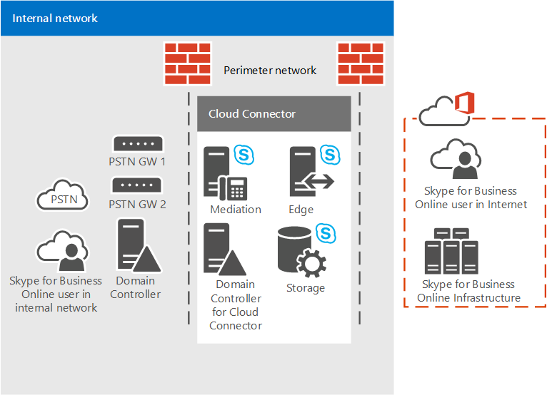

# <a name="plan-for-skype-for-business-cloud-connector-edition"></a>Plan para Skype Empresarial Cloud Connector Edition

Obtenga información sobre Skype Empresarial Cloud Connector Edition, un conjunto de máquinas virtuales (VM) empaquetadas que implementa la conectividad RTC local con el Sistema telefónico de Office 365 (PBX en la nube).

En la nube conector Edition puede ser la solución adecuada para su organización si no ya tiene un servidor existente de Lync o Skype para la implementación de Business Server. Si aún está investigar el sistema telefónico en la solución de Office 365 es el adecuado para su negocio, vea [Planear el sistema telefónico en la solución de Office 365 (en la nube PBX)](plan-your-phone-system-cloud-pbx-solution.md).

Este documento describe los requisitos de las ediciones de conector en la nube y las topologías admitidas y le ayudará a planear la implementación de nube conector Edition. Asegúrese de leer este tema antes de configurar el entorno de conector en la nube. Cuando esté listo para implementar y configurar Edition de conector en la nube, vea [configurar y administrar Skype para Business Edition de conector en la nube](configure-skype-for-business-cloud-connector-edition.md).

En la nube conector Edition 2.1 ahora está disponible. Si aún no ha actualizado a la versión 2.1, consulte [Upgrade to a new version of Cloud Connector](upgrade-to-a-new-version-of-cloud-connector.md). Puede encontrar el archivo de instalación en [https://aka.ms/CloudConnectorInstaller](https://aka.ms/CloudConnectorInstaller).

> [!NOTE]
> Microsoft admite la versión anterior de la nube conector Edition durante 60 días después de la publicación de una nueva versión. Microsoft admitirá la versión 2.0.1 durante 60 días después de la publicación de 2.1 para darle tiempo para la actualización. Todas las versiones anteriores a 2.0.1 han dejado de ser compatibles.

En la nube conector Edition es un híbrido que ofrece que consta de un conjunto de empaquetado máquinas virtuales (VM) que implementan la conectividad de RTC local con el sistema telefónico en Office 365. Mediante la implementación de un mínimo Skype para la topología de servidor empresarial en un entorno virtualizado, los usuarios de su organización que están hospedados en la nube pueden recibir servicios de PBX de la nube de Microsoft, pero se proporciona conectividad RTC a través de la voz local existente infraestructura.


Dado que Cloud Connector le permite integrar los servicios del Sistema telefónico de Office 365 con su entorno de telefonía existente (por ejemplo, PBX, dispositivos análogos y los centros de llamadas), puede implementar una migración en fases desde su solución de telefonía actual al Sistema telefónico de Office 365.

Por ejemplo, suponga que su empresa tiene un centro de llamadas sofisticado con una funcionalidad específica que el Sistema telefónico de Office 365 no proporciona. Puede elegir dejar a los usuarios del centro de llamadas con la solución existente, pero mover a otros usuarios al Sistema telefónico de Office 365.

Cloud Connector proporcionará enrutamiento entre los usuarios alojados en local y en línea, y puede elegir usar su propio proveedor RTC con el Sistema telefónico de Office 365.

Tenga en cuenta lo siguiente al planear la implementación de nube conector Edition:

- Para usar el conector en la nube para aprovechar las ventajas de las soluciones de voz en la nube, debe registrarse para un inquilino de Office 365 que incluye el sistema telefónico en Office 365. Si todavía no tiene un inquilino de Office 365, puede obtener información sobre como suscribirse aquí: [Office 365 para empresas](https://products.office.com/en-us/business/office). Tenga en cuenta que necesitará para registrarse y obtener un plan que incluya Skype para profesionales en línea.

- Para registrar los dispositivos de conector en la nube con la Skype para servicios en línea de negocio y para ejecutar varios cmdlets, conector de nube 2.0 y versiones posterior requiere una cuenta de Office 365 dedicada con la Skype para derechos de administrador de inquilinos de negocio. Las versiones de Cloud Connector anteriores a 2.0 requieren una cuenta de Office 365 dedicada con los derechos de administrador global de inquilinos.

- Conector de nube no requiere un completo local Skype para la implementación de Business Server.

    Actualmente, en la nube conector no puede coexistir con Lync Skype para la empresa local o en servidores. Si desea mover Lync existente o Skype para los usuarios empresariales a Office 365 y mantener proporcionar local telefonía a los usuarios, considere la posibilidad de sistema telefónico en Office 365 con conectividad local utilizando un Skype existente para la implementación de Business Server. Para obtener más información, vea [Planear el sistema telefónico en la solución de Office 365 (en la nube PBX)](plan-your-phone-system-cloud-pbx-solution.md) y [Planeación de sistema telefónico en Office 365 con conectividad de RTC local en Skype para Business Server](plan-phone-system-with-on-premises-pstn-connectivity.md).

- Si tenía un Skype anterior para la implementación empresarial o Lync Server y había ampliado el esquema, no es necesario limpiar el esquema para la implementación de conector en la nube, siempre que haya quitado todos los Skype para componentes empresariales o de Lync Server del entorno.

- Los usuarios están hospedados en línea.

- Si su organización ha configurado la sincronización de directorios (DirSync), todas las cuentas de los usuarios que se han planificado para la voz híbrida se deben crear primero en su implementación local y, a continuación, sincronizarse con la nube.

- Si es necesario, puede mantener su operador de RTC actual.

- Si desea proporcionar conferencia de acceso telefónico a los usuarios hospedados en el conector en la nube, puede comprar licencias de conferencia de RTC o retenidos oferta de conferencia de Audio de Microsoft.

- La conferencia de Audio licencia (o retenidos oferta) también se necesita para extensiones de llamada. Si un Skype para usuarios de empresa recibe una llamada de un usuario externo de RTC y desea agregar un participante más a esa llamada (pasar de la llamada a una conferencia), se llevará a cabo la escalación a través del servicio de conferencia de Audio de Microsoft.

- Cloud Connector 2.0 y las versiones posteriores son compatibles ahora con la omisión de medios. Desvío de medios permite que un cliente enviar medios directamente en el próximo salto pública red de telefónica conmutada (RTC): una puerta de enlace o el controlador de borde de sesión (SBC) — y eliminar el componente de edición de conector en la nube desde la ruta de acceso de medios. Para obtener más información, vea [Plan para los medios de desvío en la nube conector Edition](plan-for-media-bypass-in-cloud-connector-edition.md).

- Cloud Connector 2.1 y versiones posteriores admiten la supervisión de Cloud Connector mediante Operations Management Suite (OMS). Para obtener más información, vea [Monitor Cloud Connector using Operations Management Suite (OMS)](monitor-cloud-connector-using-operations-management-suite-oms.md).

- Conector de nube está disponible en todos los países donde Office 365 Enterprise E5 está disponible. Sin embargo, debido a las diversas normativas, conector en la nube no se puede configurar si se establece la ubicación del inquilino a uno de los siguientes países: Argelia, Bangladesh, Botsuana, Brunei, Camerún, costa de Marfil, Ghana, Líbano, Macao, Mauricio, namibio, Paraguay, (Senegal).

Este tema incluye las secciones siguientes:

- [Componentes de Cloud Connector Edition](plan-skype-for-business-cloud-connector-edition.md#BKMK_Components)

- [Topologías de edición del conector para la nube](plan-skype-for-business-cloud-connector-edition.md#BKMK_Topologies)

- [Requisitos para la implementación](plan-skype-for-business-cloud-connector-edition.md#BKMK_Requirements)

- [Información que debe recopilar antes de la implementación](plan-skype-for-business-cloud-connector-edition.md#BKMK_PlanDeployment)

- [Consideraciones de plan de marcado](plan-skype-for-business-cloud-connector-edition.md#BKMK_DailPlan)

- [Consideraciones sobre alta disponibilidad](plan-skype-for-business-cloud-connector-edition.md#BKMK_HA)

- [Flujo multimedia de Cloud Connector](plan-skype-for-business-cloud-connector-edition.md#BKMK_MediaFlow)

- [Supervisión y solución de problemas](plan-skype-for-business-cloud-connector-edition.md#BKMK_Monitor)

- [Para más información](plan-skype-for-business-cloud-connector-edition.md#BKMK_MoreInfo)

## <a name="cloud-connector-edition-components"></a>Componentes de Cloud Connector Edition
<a name="BKMK_Components"> </a>

Con la edición de conector en la nube, implementar un conjunto de empaquetado máquinas virtuales que contienen un mínimo Skype para la topología de servidor empresarial, que consta de un componente de borde, el componente de mediación y una función del almacén de Administración Central (CMS). También va a instalar un controlador de dominio, que es necesario para el funcionamiento interno del conector en la nube. Estos servicios están configurados para la implementación híbrida con el inquilino de Office 365 que incluye Skype para servicios en línea de negocio.


Componentes del conector en la nube proporcionan la funcionalidad siguiente:

- **Componente perimetral** - comunicación entre la topología local y los servicios en línea pasa a través del componente perimetral, que incluye los siguientes componentes:

  - **Servidor perimetral de acceso** - proporciona SIP enrutamiento entre la implementación local y Skype para profesionales en línea

  - **Transmisión de medios** - proporciona enrutamiento de medios entre el componente de mediación y otros extremos de medios.

  - **Autenticación de retransmisión de medios / MRAS** -genera tokens para tener acceso a la transmisión de medios.

- **El enrutamiento saliente** : proporciona equilibrio de carga del tráfico de voz entre las puertas de enlace o SBCs se conectan a un conector en la nube. Las llamadas se dividirán uniformemente entre todas las puertas de enlace o los SBC conectados al dispositivo de Cloud Connector.

    Proporciona enrutamiento a las puertas de enlace en función de las directivas. Solo se admiten las directivas globales que están basadas en números RTC de destino (salida).

- **Rol del almacén de administración central (CMS)** - incluye el almacén de configuración para los componentes de la topología, incluida la transferencia de archivos de CMS.

- **Réplica del almacén de administración central (CMS)** - sincroniza la información de configuración de la base de datos de CMS global en el servidor de rol CMS.

- **Controlador de dominio** - nube conector Active Directory Domain Services para almacenar todos los grupos necesarios para implementar los componentes de los conectores de la nube y la configuración global. Se creará uno de los bosques para cada dispositivo de conector en la nube. El controlador de dominio no debe tener las conexiones con Active Directory de producción. Los servicios de Active Directory incluyen:

  - Servicios de dominio de Active Directory

  - Servicios de certificados de Active Directory para emitir certificados internos

- **Componente de mediación** - protocolo de asignación de puerta de enlace SIP implementa y medios entre Skype para puertas de enlace RTC y profesionales. Incluye una réplica CMS que sincroniza la configuración de la base de datos CMS global.

## <a name="cloud-connector-edition-topologies"></a>Topologías de edición del conector para la nube
<a name="BKMK_Topologies"> </a>

Para este contenido, haremos referencia a sitios RTC. Un sitio de RTC es una combinación de dispositivos de conector en la nube, implementado en la misma ubicación y con puertas de enlace RTC comunes conectados a ellos. Los sitios RTC le permiten lo siguiente:

- Proporcionar conectividad a las puertas de enlace más próximas a sus usuarios.

- Permitir una escalabilidad mediante la implementación de varios dispositivos de conector en la nube en uno o varios sitios de RTC.

- Permitir para una alta disponibilidad mediante la implementación de varios dispositivos de conector en la nube en un único sitio de RTC.

Este tema explica los sitios RTC. Para obtener más información sobre cómo planificar los sitios RTC, consulte [Plan for Cloud Connector Edition PSTN sites](plan-for-cloud-connector-edition-pstn-sites.md).

Puede implementar las siguientes topologías de conector en la nube:

- Un solo dispositivo de nube conector Edition por sitio de RTC. Esta topología se recomienda para propósitos de evaluación solo, porque no proporciona alta disponibilidad.

- Varios dispositivos en la nube conector Edition por sitio de RTC para proporcionar una alta disponibilidad.

- Varios sitios de RTC con varios dispositivos de edición de conector en la nube para proporcionar escalabilidad con alta disponibilidad. Puede implementar hasta 200 sitios.

Al planificar su topología, tenga en cuenta lo siguiente:

- Con la nube conector 2.0 y versiones posteriores, un sitio de RTC puede tener un máximo de 16 dispositivos de conector en la nube. Las versiones anteriores admiten hasta 4 dispositivos por sitio.

- Hay dos tipos de configuraciones de hardware probados con conector en la nube:

  - La versión mayor puede administrar grandes volúmenes de llamadas simultáneas y es compatible con todos los tipos de entornos de producción.

  - La versión menor está pensada para ejecutarse en hardware de menor potencia y puede usarse para propósitos de evaluación o para sitios con un volumen de llamadas reducido. Aunque implemente una versión menor de Cloud Connector, también deberá tener en cuenta los requisitos de hardware de clase de producción (como fuentes de alimentación dobles).

- Si tiene el conector de nube versión 2.0 o posterior y la configuración máxima de 16 dispositivos (con hardware más grande) se implementa, su sitio de RTC puede controlar hasta 8.000 llamadas simultáneas. Si implementa la versión más pequeña, el límite permitido será de 800.

    También tiene que dedicar algunos dispositivos a la alta disponibilidad. La recomendación mínima es que se reserve un dispositivo a la alta disponibilidad.

  - Con la versión 2, si implementa una configuración de 15 + 1, el sitio de RTC puede controlar hasta 7.500 llamadas simultáneas.

  - Si tiene una versión anterior e implementa la configuración máxima de 3+1 (con mayor hardware), su sitio RTC puede administrar hasta 1.500 llamadas simultáneas. Si implementa la versión menor, el límite es de 150.

-  Si necesita tener más llamadas por sitio de RTC, puede escalar si implementa sitios de RTC adicionales en la misma ubicación.

> [!NOTE]
> A menos que se indique, los diagramas y los ejemplos siguientes se suponen el uso de la versión más grande de conector en la nube.

### <a name="single-cloud-connector-appliance-within-a-single-pstn-site"></a>Dispositivo único de Cloud Connector en un solo sitio RTC.

El siguiente diagrama muestra un solo dispositivo de nube conector Edition en un único sitio de RTC. Tenga en cuenta que el conector de nube consta de cuatro máquinas virtuales instaladas en un equipo host físico que está dentro de una red perimetral por motivos de seguridad.



### <a name="multiple-cloud-connector-appliances-within-a-single-pstn-site"></a>Varios dispositivos de Cloud Connector en un solo sitio RTC.

 Para fines de alta disponibilidad y escalabilidad, puede elegir tener varias ediciones de conector en la nube en un único sitio de RTC, tal como se muestra en el siguiente diagrama. Tenga en cuenta lo siguiente:

- Las llamadas se distribuyen en orden aleatorio entre instancias de Cloud Connector en un grupo.

- Para fines de planificación de capacidad, tenga en cuenta la capacidad para administrar la carga si una o más instancias de Cloud Connector están sin conexión, según los cálculos siguientes:

  - **N+1 cuadros.** Para obtener la versión más grande de conector en la nube, N + 1 cuadros admiten 500\*llamadas simultáneas de N con disponibilidad del 99,8%.

    Para obtener la versión más pequeña de conector en la nube, N + 1 cuadros admiten 50\*llamadas simultáneas de N con disponibilidad del 99,8%.

  - **N+2 cuadros.** Para obtener la versión más grande de conector en la nube, N + 2 cuadros admiten 500\*llamadas simultáneas de N con 99,9% de disponibilidad.

    Para obtener la versión más pequeña de conector en la nube, N + 2 cuadros admiten 50\*llamadas simultáneas de N con 99,9% de disponibilidad.


### <a name="multiple-pstn-sites-with-one-or-more-cloud-connectors-per-site"></a>Varios sitios de RTC con una o más instancias de Cloud Connector por sitio

También puede elegir tener varios sitios RTC con una o más instancias de Cloud Connector Edition en cada sitio. Si el sitio RTC alcanza el límite de llamadas simultáneas, puede agregar otro sitio RTC para administrar la carga.

Varios sitios de RTC le permiten proporcionar conectividad a puertas de enlace que están más cerca de sus usuarios. Por ejemplo, imaginemos que tiene puertas de enlace RTC en Seattle y Ámsterdam. Puede implementar dos sitios RTC, uno en Seattle y otro en Ámsterdam, y asignar usuarios para que usen el sitio de RTC que esté más cerca de ellos. De este modo, los usuarios de Seattle se enrutarán al sitio y a las puertas de enlace de la RTC de Seattle y los de Ámsterdam al sitio y a las puertas de enlace de la RTC de Ámsterdam:


## <a name="requirements-for-deployment"></a>Requisitos para la implementación
<a name="BKMK_Requirements"> </a>

Antes de implementar en la nube conector Edition, asegúrese de que tener lo siguiente para su entorno:

- **Para el equipo host-** Máquinas virtuales de conector en la nube debe implementarse en hardware dedicado que ejecuta Windows Server 2012 R2 Datacenter edition (en inglés) con el rol de Hyper-V habilitado.

    Para la versión 2.0 y posteriores, la tarjeta de red del equipo host que está enlazada al conmutador de la red corporativa de Skype Empresarial debe tener una dirección IP configurada en la misma subred que las máquinas de red corporativas de Cloud Connector. 

- Para las versiones 2.1 y versiones posteriores, el dispositivo de host debe tener .NET Framework 4.6.1 o posterior instalado.

- **Para las máquinas virtuales:** Una imagen de Windows Server 2012 R2 ISO (en inglés) (ISO). La especificación ISO se convertirán en discos duros virtuales para las máquinas virtuales que se ejecutarán Skype para Business Edition de conector en la nube.

- El hardware necesario para admitir la instalación de las máquinas 4 virtuales para cada edición de conector en la nube en su implementación. Se recomienda la siguiente configuración:

  - procesador dual de 64 bits, seis core (12 núcleos reales), 2,50 gigahercios (GHz) o superior

  - 64 gigabytes (GB) de RAM con ECC 

  - Cuatro discos de 600 GB (o más) de 10 000 RPM SAS con caché de 128 MB y 6 Gbps, con una configuración RAID 5

  - Tres adaptadores de red de alto rendimiento RJ45 de 1 Gbps

- Si decide implementar la versión más pequeña de edición de conector en la nube que admite hasta 50 llamadas simultáneas, necesita el siguiente hardware:

  - Intel i7 4790 de cuatro núcleos con gráficos Intel 4600 (no se necesitan gráficos de alto nivel)

  - 32 GB de memoria DDR3-1600 sin ECC

  - 2 unidades de disco duro de 1 TB a 7200 RPM SATA III (6 Gbps) en RAID 0

  - 2 conectores Ethernet de 1 Gpbs (RJ45)

- Si la máquina host requiere un servidor proxy para navegar por Internet, tendrá que hacer los siguientes cambios en la configuración:

  - Para utilizar al servidor proxy, especificar la configuración de WinHTTP Proxy establecer con el servidor proxy y una lista de omisión incluido el "192.168.213. \*"red utilizada por los servicios de servidores de conector en la nube y Skype para profesionales Corpnet subred tal como se define en el archivo CloudConnector.ini. De lo contrario, se generará un error en la conectividad de administración y no será posible implementar y recuperar automáticamente Cloud Connector. El siguiente es un comando de configuración de ejemplo winhttp: netsh winhttp establece lista de omisión de proxy "10.10.10.175:8080" = "\*local; 1. \*; 172.20. \*; 192.168.218. \*'\<local\>".

  - Especifique la configuración del proxy por máquina en lugar de hacerlo por usuario. En caso contrario, se producirá un error en descargas de conector en la nube. Puede especificar la configuración del proxy por máquina cambiando el registro o configurando la directiva de grupo como sigue:

  - **Registro:** HKEY_LOCAL_MACHINE\SOFTWARE\Policies\Microsoft\Windows\CurrentVersion\Internet Settings] por ProxySettingsPerUser DWORD: 00000000

  - **La directiva de grupo:** Equipo\>plantillas administrativas\>componentes de Windows\> Internet Explorer: configuración del Proxy de realizar por máquina (en lugar de por usuario)

- PBX/tronco cualificado o SBC/puerta de enlace cualificada (se recomienda un mínimo de dos puertas de enlace).

    Cloud Connector admite los mismos controladores de borde de sesión (SBC) que los certificados para Skype Empresarial. Para obtener más información, vea [Infraestructura de telefonía para Skype Empresarial](https://docs.microsoft.com/SkypeForBusiness/certification/infra-gateways).

- Una cuenta de administrador del servidor local con permisos para instalar y configurar Hyper-V en los servidores host. La cuenta debe tener permisos de administrador en el servidor local donde está instalado y configurado Hyper-V.

- Durante la implementación, se le solicitará que cree una cuenta de administrador de dominios con permisos para crear y publicar la topología en el dominio de Cloud Connector. 

- Los registros DNS externos, que se definen en el archivo CloudConnector.ini incluido en el paquete de instalación:

  - Registro DNS externo para el servicio de servidor perimetral de acceso de componente perimetral; Por ejemplo, ap.\<nombre de dominio\>. Necesita un registro por sitio RTC. Este registro debe contener las direcciones IP de todos los perímetros del sitio.

- Un inquilino de Office 365 con todos los registros SRV y a de DNS creado.

    > [!IMPORTANT]
    > Al integrar el inquilino con la edición de conector en la nube, el uso del sufijo de dominio predeterminado,. onmicrosoft.com, como un dominio SIP de la organización no se admite. > no se puede usar sip. \<Nombre de dominio\> como el nombre de su acceso perimetral de conector de nube de proxy de la interfaz debido a que se usa este registro DNS en Office 365.

- Un certificado del servidor perimetral externo obtenido de una entidad de certificación (CA) pública.

- Se han completado las reglas de firewall para permitir el tráfico a través de los puertos necesarios.

- Una conexión a Internet para las máquinas virtuales y la máquina host. Conector de nube descarga algunos software desde Internet; por lo tanto, debe proporcionar la puerta de enlace y la información del servidor DNS para que el equipo host de conector en la nube y las máquinas virtuales se puedan conectar a Internet y descargar el software necesario.

- Un módulo de PowerShell remoto del inquilino instalado en la máquina host.

- Las credenciales de administrador de Office 365 para Skype Empresarial para ejecutar PowerShell remoto.

    > [!IMPORTANT]
    > La cuenta de administrador NO DEBE tener habilitada la autenticación multifactor.

> [!NOTE]
> Solo se admite la implementación del conector de la nube en la plataforma Microsoft Hyper-V virtualizados. Otras plataformas, como VMware y Amazon Web Services no son compatibles.

> [!NOTE]
> Las instrucciones de hardware mínimos para ejecutar el conector de la nube se basan en la capacidad de hardware básico (núcleos, MHz, gigabytes y así sucesivamente) con un búfer para dar cabida a dificultades de rendimiento inmateriales ocultas en la arquitectura de cualquier equipo. Microsoft ha llevado a cabo pruebas de situaciones adversas en hardware comercialmente disponible que cumplía los requisitos mínimos. Se comprobaron la calidad media y el rendimiento de los sistemas. Socios de dispositivo oficiales de conector en la nube de Microsoft tienen implementaciones de hardware específicas de conector en la nube en el que haya probado de forma independiente rendimiento y responden por la idoneidad de su hardware para cumplir los requisitos de carga y calidad.

> [!NOTE]
> Los dispositivos producidos por AudioCodes y Sonus tienen código modificado y se ejecutan en servidores Windows Server Standard Edition. Estos dispositivos son compatibles.

## <a name="information-you-need-to-gather-before-deployment"></a>Información que debe recopilar antes de la implementación
<a name="BKMK_PlanDeployment"> </a>

Antes de iniciar la implementación, necesita determinar el tamaño de la implementación y los dominios SIP que se proporcionarán, así como información sobre la configuración de cada sitio de RTC que tiene previsto implementar. Para empezar, necesitará:

- Identificar todos los dominios SIP que se presta servicio esta implementación en función de los URI de SIP en uso en su compañía.

- Determinar el número de sitios de RTC que necesita implementar.

- Asegúrese de que tener el hardware necesario para admitir las cuatro máquinas virtuales instalará para cada edición de conector en la nube.

Para cada sitio de RTC que planea implementar, necesitará:

- Creación de nombres para todos los componentes en cada dispositivo de conector en la nube (vea [Determine parámetros de implementación](plan-skype-for-business-cloud-connector-edition.md#BKMK_SiteParams)).

- Definir intervalos de puertos (vea [Puertos y protocolos](plan-skype-for-business-cloud-connector-edition.md#BKMB_Ports)).  

- Crear registros de DNS para el componente perimetral (vea [Requisitos para la implementación](plan-skype-for-business-cloud-connector-edition.md#BKMK_Requirements)).

- Determinar sus requisitos de certificados para el componente perimetral (vea [Requisitos de certificados](plan-skype-for-business-cloud-connector-edition.md#BKMK_Certs)).

### <a name="ports-and-protocols"></a>Puertos y protocolos
<a name="BKMB_Ports"> </a>

Al definir intervalos de puertos para multimedia, tenga en cuenta lo siguiente:

- Los clientes siempre utilizan 50000 a 50019 del intervalo de puertos para el tráfico de medios: este intervalo está predefinido en Skype para profesionales en línea y no se puede cambiar.

- De forma predeterminada, el componente de mediación usará el intervalo de puertos del 49 152 al 57 500 para el tráfico de contenido multimedia. Sin embargo, se establece la conexión a través del firewall interno y, por motivos de seguridad, puede limitar este intervalo de puertos en la topología. Necesitará hasta 4 puertos por llamada. Si desea limitar el número de puertos entre el componente de mediación y la puerta de enlace de RTC, también necesitará configurar el intervalo de puestos correspondiente de la puerta de enlace.

- Debe implementar el conector de nube en una red perimetral. Esto significa que tendrá dos firewall:

  - El primer firewall es externo entre Internet y la red perimetral.

  - El segundo servidor de seguridad es interno entre la red perimetral y la red interna.

    Sus clientes pueden estar en Internet o en la red interna: 

  - Los clientes en Internet se conectarán a su RTC mediante el firewall externo a través del componente perimetral.

  - Los clientes de la red interna se conectarán a través del firewall interno para el componente de mediación en la red perimetral, que se conectará el tráfico a la puerta de enlace RTC o de SBC.

    Esto quiere decir que necesita abrir los puertos en los dos firewalls. 

En las tablas siguientes se describen los puertos y los intervalos de puertos para los firewalls externo e interno.

En esta tabla se muestran los puertos y los intervalos de puertos para habilitar la comunicación entre los clientes de la red interna y el componente de mediación:

**Firewall interno**


|**IP de origen**|**IP de destino**|**Puerto de origen**|**Puerto de destino**|
|:-----|:-----|:-----|:-----|
|Componente de mediación de conector en la nube  <br/> |Puerta de enlace RTC/SBC  <br/> |Cualquiera  <br/> |TCP 5060\*\*  <br/> |
|Puerta de enlace RTC/SBC  <br/> |Componente de mediación de conector en la nube  <br/> |Cualquiera  <br/> |TCP 5068/TLS 5067  <br/> |
|Componente de mediación de conector en la nube  <br/> |Puerta de enlace RTC/SBC  <br/> |UDP 49 152 57 500  <br/> |Cualquier\*\*\*  <br/> |
|Puerta de enlace RTC/SBC  <br/> |Componente de mediación de conector en la nube  <br/> |Cualquier\*\*\*  <br/> |UDP 49 152 57 500  <br/> |
|Componente de mediación de conector en la nube  <br/> |Clientes internos  <br/> |TCP 49 152 57 500\*  <br/> |TCP 50.000-50.019  <br/> (Opcional)  <br/> |
|Componente de mediación de conector en la nube  <br/> |Clientes internos  <br/> |UDP 49 152 57 500\*  <br/> |UDP 50.000-50.019  <br/> |
|Clientes internos  <br/> |Componente de mediación de conector en la nube  <br/> |TCP 50.000-50.019  <br/> |TCP 49 152 57 500\*  <br/> |
|Clientes internos  <br/> |Componente de mediación de conector en la nube  <br/> |UDP 50.000-50.019  <br/> |UDP 49 152-57 500\*  <br/> |

\*Este es el intervalo de puerto predeterminado en el componente de mediación. Para un flujo de llamadas óptimo, se recomienda usar cuatro puertos por llamada.

\*\*Este puerto debe configurarse en la puerta de enlace RTC/SBC; 5060 es un ejemplo. Puede configurar otros puertos en su puerta de enlace RTC/SBC.

\*\*\*Tenga en cuenta que también puede limitar el intervalo de puertos en su SBC o puerta de enlace si permitida por el fabricante SBC o puerta de enlace.

Por motivos de seguridad, puede limitar el intervalo de puertos para el componente de mediación mediante el cmdlet [Set-CsMediationServer](https://docs.microsoft.com/powershell/module/skype/set-csmediationserver?view=skype-ps) .

Por ejemplo, el siguiente comando limita el número de puertos que el componente de mediación va a usar para el tráfico de medios a 50 000-51 000 para el audio (entrante y saliente). El componente de mediación podrá administrar 250 llamadas simultáneas con esta configuración. Tenga en cuenta que también puede limitar este intervalo en la puerta de enlace RTC/SBC:

```
Set-CSMediationServer -Identity MediationServer:mspool.contoso.com -AudioPortStart 50000 - AudioPortCount 1000
```

Para recuperar el nombre del componente de mediación y ver los puertos predeterminados, puede usar el cmdlet [Get-CsService](https://docs.microsoft.com/powershell/module/skype/get-csservice?view=skype-ps) como se indica a continuación:

```
Get-CsService -MediationServer | Select-Object Identity, AudioPortStart, AudioPortCount
```

La siguiente tabla muestran los puertos y los intervalos de puertos para habilitar la comunicación entre el componente de borde de conector en la nube para el firewall externo. Esta tabla muestra una recomendación mínima.

En este caso, todo el tráfico de medios a internet fluirá a través del borde en línea como se indica a continuación: usuario punto final--\>Online perimetral--\>perimetral del conector en la nube:

**Firewall externo: configuración mínima**


|**IP de origen**|**IP de destino**|**Puerto de origen**|**Puerto de destino**|
|:-----|:-----|:-----|:-----|
|Cualquiera  <br/> |Interfaz externa del borde de conector en la nube  <br/> |Cualquiera  <br/> |TCP(MTLS) 5061  <br/> |
|Interfaz externa del borde de conector en la nube  <br/> |Cualquiera   <br/> |Cualquiera  <br/> |TCP(MTLS) 5061  <br/> |
|Interfaz externa del borde de conector en la nube  <br/> |Cualquiera   <br/> |Cualquiera  <br/> |TCP 80  <br/> |
|Interfaz externa del borde de conector en la nube  <br/> |Cualquiera   <br/> |Cualquiera  <br/> |UDP 53  <br/> |
|Interfaz externa del borde de conector en la nube  <br/> |Cualquiera   <br/> |Cualquiera  <br/> |TCP 53  <br/> |
|Interfaz externa del borde de conector en la nube  <br/> |Cualquiera  <br/> |UDP 3478  <br/> |UDP 3478  <br/> |
|Cualquiera  <br/> |Interfaz externa del borde de conector en la nube  <br/> |TCP 50.000-59.999  <br/> |TCP 443  <br/> |
|Cualquiera  <br/> |Interfaz externa del borde de conector en la nube  <br/> |UDP 3478  <br/> |UDP 3478  <br/> |
|Interfaz externa del borde de conector en la nube  <br/> |Cualquiera  <br/> |TCP 50.000-59.999  <br/> |TCP 443  <br/> |

En la tabla siguiente se muestra los puertos y los intervalos de puertos para habilitar la comunicación entre el componente de borde de conector en la nube para el firewall externo. Esta tabla muestra la solución recomendada.

En este caso, todo el tráfico de medios para el punto final en internet puede flujo directamente en el componente de borde de conector en la nube. La ruta de acceso de medios será el punto final de usuario -\> perimetral del conector en la nube.

> [!NOTE]
> Esta solución no funcionará si el extremo del usuario está detrás de un NAT simétrico.

**Firewall externo: configuración recomendada**


|**IP de origen**|**IP de destino**|**Puerto de origen**|**Puerto de destino**|
|:-----|:-----|:-----|:-----|
|Cualquiera  <br/> |Interfaz externa del borde de conector en la nube  <br/> |Cualquiera  <br/> |TCP(MTLS) 5061  <br/> |
|Interfaz externa del borde de conector en la nube  <br/> |Cualquiera   <br/> |Cualquiera  <br/> |TCP(MTLS) 5061  <br/> |
|Interfaz externa del borde de conector en la nube  <br/> |Cualquiera   <br/> |Cualquiera  <br/> |TCP 80  <br/> |
|Interfaz externa del borde de conector en la nube  <br/> |Cualquiera   <br/> |Cualquiera  <br/> |UDP 53  <br/> |
|Interfaz externa del borde de conector en la nube  <br/> |Cualquiera   <br/> |Cualquiera  <br/> |TCP 53  <br/> |
|Interfaz externa del borde de conector en la nube  <br/> |Cualquiera  <br/> |TCP 50.000-59.999  <br/> |Cualquiera  <br/> |
|Interfaz externa del borde de conector en la nube  <br/> |Cualquiera  <br/> |UDP 3478; UDP 50000-59999  <br/> |Cualquiera   <br/> |
|Cualquiera  <br/> |Interfaz externa del borde de conector en la nube  <br/> |Cualquiera  <br/> |TCP 443; TCP 50000-59999  <br/> |
|Cualquiera  <br/> |Interfaz externa del borde de conector en la nube  <br/> |Cualquiera  <br/> |UDP 3478; UDP 50000-59999  <br/> |

### <a name="host-internet-connectivity-requirements"></a>Requisitos de conectividad a Internet del host
<a name="BKMB_Ports"> </a>

El equipo host debe ser capaz de llegar a recursos externos para instalar, actualizar y administrar el conector de nube correctamente. En la siguiente tabla se muestran los destinos y los puertos que se necesitan entre el equipo host y el recurso externo.

|Dirección  <br/> |IP de origen  <br/> |IP de destino  <br/> |Puerto de origen  <br/> |Puerto de destino  <br/> |Protocolo  <br/> |Finalidad  <br/> |
|:-----|:-----|:-----|:-----|:-----|:-----|:-----|
|Saliente  <br/> |Host de conector en la nube IP  <br/> |Cualquiera  <br/> |Cualquiera  <br/> |53  <br/> |TCP/UDP  <br/> |DNS  <br/> |
|Saliente  <br/> |Host de conector en la nube IP  <br/> |Cualquiera  <br/> |Cualquiera  <br/> |80, 443  <br/> |TCP  <br/> |Lista de revocación de certificados (CRL)  <br/> |
|Saliente  <br/> |Host de la nube Connectorr IP  <br/> |Cualquiera  <br/> |Cualquiera  <br/> |80, 443  <br/> |TCP  <br/> |Actualización del conector en la nube  <br/> Skype Empresarial Online  <br/> PowerShell de administración  <br/> Windows Update  <br/> |

Si se requieren reglas más restrictivas, consulte las siguientes direcciones URL incluidas en la lista blanca:

- [Direcciones URL de la Lista de revocación de certificados](https://support.office.com/en-us/article/Office-365-URLs-and-IP-address-ranges-8548a211-3fe7-47cb-abb1-355ea5aa88a2) en [URL de Office 365 e intervalos de direcciones IP](https://support.office.com/en-us/article/Office-365-URLs-and-IP-address-ranges-8548a211-3fe7-47cb-abb1-355ea5aa88a2?ui=en-US&amp;rs=en-US&amp;ad=US)

- [Cómo configurar un Firewall para las actualizaciones de Software](https://technet.microsoft.com/en-us/library/bb693717.aspx) de Windows Update:

- Skype para PowerShell administración en línea de negocio: \*. online.lync.com

    Si necesita excluir un proxy para este destino, tendrá que agregarlo a la lista de omisiones de WinHTTP.

- Actualización del conector en la nube: [Centro de descarga](https://aka.ms/CloudConnectorInstaller), [https://go.microsoft.com](https://go.microsoft.com), y[https://download.microsoft.com](https://download.microsoft.com)

### <a name="dns-name-resolution-for-the-edge-component"></a>Resolución de nombres DNS para el componente perimetral
<a name="BKMB_Ports"> </a>

El componente perimetral necesita resolver los nombres externos de servicios de Office 365 y los nombres internos de otros componentes de conector en la nube.

Cada componente perimetral es un equipo de hosts múltiples con interfaces internas y externas. Conector de nube implementa servidores DNS en el componente de controlador de dominio dentro de la red perimetral. Puede apuntar el servidor perimetral para el servidor DNS dentro del perímetro para todas las resoluciones de nombre, pero tiene que habilitar el servidor de DNS de conector en la nube resolver nombres externos mediante la configuración de una zona DNS que contiene uno o más registros DNS A para consultas externas que hacen referencia el nombre búsquedas a otros servidores DNS públicos.

En el archivo .ini, si configuró el nombre FQDN para puertas de enlace desde el mismo espacio de dominios que su dominio de SIP, la zona autoritativa para el dominio de SIP se creará en el servidor DNS dentro del perímetro. Si apunta a este servidor DNS para resolver nombres de servidor perimetral, perimetral nunca se puede resolver el _sipfederationtls. \<SuDominio\> registro DNS, que es necesario para el flujo de la llamada. En este caso, Microsoft recomienda que proporcionan un servidor DNS en la interfaz perimetral externa para resolver las búsquedas de nombre de Internet, y cada componente perimetral debe usar un archivo de HOST para resolver otros nombres de componente de conector en la nube a direcciones IP.

> [!NOTE]
> Por motivos de seguridad, se recomienda que no señalan al servidor DNS de conector en la nube a los servidores internos en el dominio de producción para la resolución de nombres.

### <a name="determine-deployment-parameters"></a>Determinar los parámetros de implementación
<a name="BKMK_SiteParams"> </a>

En primer lugar, es necesario definir los siguientes parámetros comunes de implementación:


|**Elemento**|**Descripción**|**Notas**|
|:-----|:-----|:-----|
|Dominios SIP  <br/> |Del URI del SIP en uso por los usuarios de la compañía. Proporciona todos los dominios SIP proporcionados por esta implementación. Es posible tener más de un dominio SIP.  <br/> ||
|Número de sitios de RTC  <br/> |El número de sitios de RTC que implementará.  <br/> ||

Para cada sitio de RTC que vaya a implementar, necesitará reunir la siguiente información antes de comenzar. Tendrá que proporcionar esta información cuando actualice el archivo CloudConnector.ini.

Al configurar la información de puerta de enlace, recuerde lo siguiente:

- Si solo tiene una puerta de enlace, elimine la sección en el archivo .ini para la segunda puerta de enlace. Si hay más de dos puertas de enlace, siga el formato existente para agregar nuevas.

- Asegúrese de que la dirección IP y los puertos de las puertas de enlace son correctos.

- Para admitir HA en nivel de puerta de enlace de RTC, mantenga la puerta de enlace secundaria o agregue puertas de enlace adicionales.

(Opcional) Para restringir los números de llamadas salientes, actualice el valor LocalRoute.


|**Parámetros del sitio**|**Descripción**|**Notas**|
|:-----|:-----|:-----|
|Nombre de dominio de máquina virtual  <br/> |Nombre de dominio para los componentes internos del conector en la nube. Este dominio tiene que ser distinto del dominio de producción. El nombre tiene que ser el mismo en todos los dispositivos de Cloud Connector.  <br/> Nombre de archivo .ini: "VirtualMachineDomain"  <br/> |Se prefiere el dominio .local.   <br/> |
|Nombre de controlador de dominio de conector en la nube  <br/> |Nombre del controlador de dominio.   <br/> Nombre de archivo .ini: "NombreDeServidor"  <br/> |Debe tener 15 caracteres o menos de longitud. Escriba solo el nombre de Netbios.  <br/> |
|Máscara de subred IP/de controlador de dominio de conector de nube  <br/> |Dirección IP del controlador de dominio.    <br/> Nombre de archivo .ini: "IP"  <br/> ||
|FQDN de servicios de O365 Online  <br/> |Debe ser el valor predeterminado en la mayoría de los casos para la instancia de O365 en todo el mundo.  <br/> Nombre de archivo .ini: "OnlineSipFederationFqdn"  <br/> ||
|SiteName  <br/> |Skype para nombre del sitio empresarial; Por ejemplo, Seattle.  <br/> Nombre de archivo .ini: "NombreDeSitio"  <br/> En la versión 1.4.1 y posteriores, el nombre del sitio debe ser distinto para cada sitio y debe coincidir con el sitio RTC definido en Office 365. Tenga en cuenta que los sitios RTC se crearán automáticamente al registrar el primer dispositivo en un sitio.  <br/> ||
|HardwareType  <br/> Versión 1.4.1 y posteriores  <br/> |Tipo de hardware. El valor predeterminado es Normal. También puede configurarlo en Mínimo.  <br/> ||
|Código de país o región  <br/> |Código de país o región para llamadas.  <br/> Nombre de archivo .ini: "CountryCode"  <br/> ||
|Ciudad  <br/> |Ciudad (opcional).  <br/> Nombre de archivo .ini: "City"  <br/> ||
|Estado  <br/> |Estado (opcional).  <br/> Nombre de archivo .ini: "Estado"  <br/> ||
|Dirección IP de la VM base  <br/> |La dirección IP de la máquina virtual base temporal que se usará para crear la VHDX para todas las máquinas virtuales de conector en la nube. Esta IP debe estar en la misma subred de red corporativa perimetral definida en el siguiente paso y requiere acceso a Internet. Asegúrese de definir la puerta de enlace predeterminada corporativa y el DNS enrutable a Internet.  <br/> Nombre de archivo .ini: "BaseVMIP"  <br/> ||
|WSUSServer  <br/> WSUSStatusServer  <br/> Versión 1.4.1 y posteriores  <br/> |La dirección de los Windows Server Update Services (WSUS), un servidor de intranet para alojar actualizaciones de Microsoft Update.  <br/> Puede dejarla en blanco si no se necesitan los WSUS.    <br/> ||
|Máscara de subred para red interna  <br/> |Conector de nube configura una red IP para las comunicaciones internas entre los componentes de conector en la nube. El componente perimetral también debe estar conectado a otra subred que permita la conectividad a Internet.  <br/> Nombre de archivo .ini: "CorpnetIPPrefixLength" en "Parámetros para un grupo de servidores de red de la máquina virtual"  <br/> ||
|Máscara de subred para red externa   <br/> |Para la red externa del componente perimetral.  <br/> Nombre de archivo .ini: "InternetIPPrefix" en "Parámetros para un grupo de servidores de red de la máquina virtual"  <br/> ||
|Nombre de conmutador para red interna  <br/> |Nombre de modificador que se usará para la red interna de conector en la nube.  <br/> En la mayoría de los casos, se puede usar el valor sugerido predeterminado.  <br/> Nombre de archivo .ini: "CorpnetSwitchName" en "parámetros para un grupo de servidores de red de la máquina virtual  <br/> ||
|Nombre de conmutador para red externa  <br/> |Nombre de modificador que se usará para la red en la nube conector externa.  <br/> En la mayoría de los casos, se puede usar el valor sugerido predeterminado.  <br/> Nombre de archivo .ini: "InternetSwitchName" en "parámetros para un grupo de servidores de red de la máquina virtual  <br/> ||
|Puerta de enlace predeterminada para red interna  <br/> |Esta puerta de enlace debe proporcionar acceso a Internet (Internet también requiere la configuración del servidor DNS) y se configurarán en interfaces internas de componentes de los conectores de la nube.  <br/> Nombre de archivo .ini: "CorpnetDefaultGateway" en "parámetros para un grupo de servidores de red de la máquina virtual  <br/> ||
|Puerta de enlace predeterminada para la interfaz externa del componente perimetral  <br/> |Se configurará en la interfaz externa del componente perimetral.  <br/> Nombre de archivo .ini: "InternetDefaultGateway" en "parámetros para un grupo de servidores de red de la máquina virtual  <br/> ||
|Servidor DNS para red interna  <br/> |Se configurará en la interfaz interna de la VM temporal. Debe proporcionar la resolución de nombres para nombres de Internet. Sin proporcionar un servidor DNS, no se podrá conectar a Internet y no se podrá finalizar la implementación.  <br/> Nombre de archivo .ini: "CorpnetDNSIPAddress" en "parámetros para un grupo de servidores de red de la máquina virtual  <br/> ||
|Servidor DNS para la interfaz externa del componente perimetral  <br/> |Se configurará en la interfaz externa del componente perimetral.  <br/> Nombre de archivo .ini: "InternetDNSIPAddress" en "parámetros para un grupo de servidores de red de la máquina virtual  <br/> ||
|Nombre del conmutador de administración  <br/> |Administración es un modificador temporal que se creará automáticamente, y que se usará para la configuración del conector de la nube de durante la implementación. Se desconectará automáticamente después de la implementación. Debe ser una subred diferente de todas las redes usado en el conector de la nube.  <br/> En la mayoría de los casos, se puede usar el valor sugerido predeterminado.  <br/> Nombre de archivo .ini: "ManagementSwitchName" en "parámetros para un grupo de servidores de red de la máquina virtual  <br/> ||
|Dirección de subred/máscara de subred de administración  <br/> |Subred de administración es una subred temporal que se creará automáticamente, y que se usará para la configuración del conector de la nube de durante la implementación. Se eliminará automáticamente después de la implementación. Debe ser una subred diferente de todas las redes usado en el conector de la nube.  <br/> Nombres de archivo .ini: "ManagementIPPrefix" y "ManagementIPPrefixLength" en "parámetros para un grupo de servidores de red de la máquina virtual  <br/> ||
|Máquina de almacén de administración central (CMS)  <br/> |FQDN único que se usa para el Almacén de administración central (CMS). El nombre de dominio de AD se usará para generar el FQDN.  <br/> Nombre de archivo .ini: "NombreDeServidor" en "parámetros para principal servicio de Administración Central  <br/> |Debe tener 15 caracteres o menos de longitud. Escriba solo el nombre de Netbios.  <br/> (Nombre del grupo de servidores de CMS = nombre del servidor)  <br/> |
|Dirección IP del equipo de CMS  <br/> |Dirección IP para servidor de CMS (interno de la red perimetral).  <br/> Nombre de archivo INI: "IP" bajo "parámetros para principal servicio de Administración Central  <br/> ||
|Nombre de recurso compartido de archivos    <br/> |Nombre del recurso compartido de archivo que se creará en el servidor CMS de Skype para datos profesionales de replicación (por ejemplo, CmsFileStore).  <br/> En la mayoría de los casos, se puede usar el valor sugerido predeterminado.  <br/> Nombre de archivo .ini: "CmsFileStore" en "parámetros para principal servicio de Administración Central  <br/> ||
|Componente del nombre de grupo de servidores de mediación  <br/> |Nombre de grupo del componente de mediación. Escriba solo el nombre de Netbios. El nombre de dominio de AD se usará para generar el FQDN.  <br/> Nombre de archivo .ini: "PoolName" en "Parámetros para un grupo de servidores de mediación"  <br/> |Debe tener 15 caracteres o menos de longitud. Escriba solo el nombre de Netbios.  <br/> |
|Nombre de componente de mediación  <br/> |Nombre de componente del componente de mediación 1. Escriba solo el nombre de Netbios. El nombre de dominio de AD se usará para generar el FQDN.  <br/> Nombre de archivo .ini: "NombreDeServidor" en "Parámetros para un grupo de servidores de mediación"  <br/> |Debe tener 15 caracteres o menos de longitud. Escriba solo el nombre de Netbios.  <br/> |
|Dirección IP del equipo de mediación componente  <br/> |IP Corpnet interna para el componente de mediación (interno de la red perimetral).  <br/> Nombre de archivo .ini: "IP" bajo "Parámetros para un grupo de servidores de mediación"  <br/> ||
|Nombre interno del grupo de servidores perimetrales  <br/> |Nombre de grupo del componente perimetral. Escriba solo el nombre de Netbios. El nombre de dominio de AD se usará para generar el FQDN.  <br/> Nombre de archivo .ini: "InternalPoolName" en "Parámetros para un grupo de servidores perimetrales"  <br/> |Debe tener 15 caracteres o menos de longitud. Escriba solo el nombre de Netbios.  <br/> |
|Nombre interno del servidor perimetral  <br/> |Nombre de componente del componente perimetral. Escriba únicamente el nombre NETBIOS. El nombre de dominio de AD se usará para generar el FQDN.   <br/> Nombre de archivo .ini: "InternalServerName" en "Parámetros para un grupo de servidores perimetrales"  <br/> |Debe tener 15 caracteres o menos de longitud. Escriba solo el nombre de Netbios.  <br/> |
|IP interna del servidor perimetral   <br/> |Componente de IP de perímetro de red de perímetro interno para comunicarse con otros componentes del conector en la nube.  <br/> Nombre de archivo .ini: "InternalServerIPs" en "Parámetros para un grupo de servidores perimetrales"  <br/> ||
|Nombre externo de grupo de servidores de acceso  <br/> |El nombre del componente perimetral de acceso (por ejemplo, AP). Este nombre tiene que coincidir con el nombre proporcionado para el certificado SSL. Escriba únicamente el nombre NETBIOS. El nombre de dominio SIP se usará para generar el FQDN. Un nombre de grupo de servidores externos se usará para todos los componentes de borde en el grupo de servidores. Un grupo de servidores de acceso perimetral es necesario por sitio de RTC.  <br/> Nombre de archivo .ini: "ExternalSIPPoolName" en "Parámetros para un grupo de servidores perimetrales"  <br/> |Debe tener 15 caracteres o menos de longitud. Escriba solo el nombre de Netbios.  <br/> "sip" está reservado y, por tanto, no se puede usar como el nombre.  <br/> El nombre de FQDN generado debe coincidir con el nombre que proporciona el certificado SSL.    <br/> |
|Dirección IP externa del servidor perimetral de acceso  <br/> |Componente de IP del perímetro externo - IP pública si no está disponible, ninguna NAT o traducir IP (indique cuál ambas direcciones si asignado).  <br/> Nombre de archivo .ini: "ExternalSIPIPs" en "Parámetros para un grupo de servidores perimetrales"  <br/> ||
|Nombre de relé multimedia  <br/> |El nombre del servidor perimetral de relé multimedia de audio/vídeo (por ejemplo, MR). Se usará un nombre de grupo externo para todos los componentes perimetrales de un grupo. Un grupo de servidores de retransmisión de medios perimetral es necesario por sitio de RTC.  <br/> Nombre de archivo .ini: "ExternalMRFQDNPoolName" en "Parámetros para un grupo de servidores perimetrales"  <br/> |Debe tener 15 caracteres o menos de longitud. Escriba solo el nombre de Netbios.  <br/> |
|Dirección IP externa del borde de retransmisión de medios  <br/> |Actualmente solo se admite una IP, por lo que será la misma IP que la del componente perimetral de acceso, tanto si es una IP asignada como si es pública (especifique ambas direcciones si es asignada). Puede ser la misma dirección que la IP externa del componente perimetral del componente perimetral de acceso. Tenga en cuenta que, si el componente perimetral está tras una NAT, también tendrá que especificar el valor del siguiente parámetro.  <br/> Nombre de archivo .ini: "ExternalMRIPs" en "Parámetros para un grupo de servidores perimetrales"  <br/> ||
|IP de medios retransmisión perímetro externo (si es perimetral detrás de NAT)  <br/> |Si su componente perimetral está tras una NAT, también necesitará especificar la dirección pública del dispositivo NAT.  <br/> Nombre de archivo .ini: "ExternalMRPublicIPs" en "Parámetros para un grupo de servidores perimetrales"  <br/> ||
|Marca de puerta de enlace 1 y el modelo de voz  <br/> |Especifique la marca y el modelo de la puerta de enlace de SBC/voz. Tenga en cuenta que puede conectar un dispositivo o un tronco SIP de la lista de los dispositivos probados en [https://technet.Microsoft.com/UCOIP](https://technet.Microsoft.com/UCOIP).  <br/> ||
|Puerta de enlace 2 realizar y modelo (copiar esta fila si tiene más de 2 puertas de enlace) de voz  <br/> |Especifique la marca y el modelo de la puerta de enlace de voz. Tenga en cuenta que puede conectar un dispositivo de la lista de los dispositivos probados en [https://technet.Microsoft.com/UCOIP](https://technet.Microsoft.com/UCOIP).  <br/> ||
|Nombre de puerta de enlace 1 de voz  <br/> |Se usa para generar el FQDN de la máquina con dominio de AD. Es necesario si se va a usar TLS entre el componente de mediación y la puerta de enlace de voz. Si no planea usar FQDN — por ejemplo, no se requiere TLS o puerta de enlace de voz no admite la conexión con el FQDN (sólo IP): especifique.  <br/> ||
|Nombre de la puerta de enlace 2 (copia esta fila si tiene más de 2 puertas de enlace) de voz  <br/> |Se usa para generar el FQDN de la máquina con dominio de AD. Es necesario si se va a usar TLS entre el componente de mediación y la puerta de enlace de voz. Si no planea usar FQDN — por ejemplo, no se requiere TLS o puerta de enlace de voz no admite la conexión con el FQDN (sólo IP): especifique.  <br/> ||
|Dirección IP de puerta de enlace 1 de voz  <br/> |Dirección IP de puerta de enlace de voz.  <br/> ||
|Dirección de IP de puerta de enlace 2 (copia esta fila si tiene más de 2 puertas de enlace) de voz  <br/> |Dirección IP de puerta de enlace de voz.  <br/> ||
|Puerto de 1 puerta de enlace de voz # (copia esta fila si tiene más de 2 puertas de enlace)  <br/> |Puerto donde escuchará el tronco SIP de puerta de enlace de voz (por ejemplo, 5060).  <br/> ||
|2 de la puerta de enlace de voz número de puerto  <br/> |Puerto donde escuchará el tronco SIP de puerta de enlace de voz (por ejemplo, 5060).  <br/> ||
|Protocolo de puerta de enlace 1 de voz para el tráfico SIP  <br/> |TCP o TLS.  <br/> ||
|Protocolo de 2 de puerta de enlace de voz para el tráfico SIP (copia esta fila si tiene más de 2 puertas de enlace)  <br/> |TCP o TLS.  <br/> ||
|Intervalo de puertos multimedia externos para tráfico desde y hacia el componente perimetral  <br/> |El intervalo de puertos TCP/UDP para el tráfico multimedia desde y hacia la interfaz externa del perímetro. Siempre tiene que empezar con 50000. Para obtener más información, consulte "Puertos y protocolos".  <br/> |50000 - 59 999  <br/> |
|Intervalo para comunicarse desde el componente de mediación a través del firewall interno de puertos multimedia  <br/> |Intervalo de puertos UDP que va a usar el componente de mediación para comunicarse con los clientes y las puertas de enlace (puertos de recomendación 4 por llamada).  <br/> ||
|Intervalo para comunicarse desde Skype para cliente de negocios a través de firewall interno de puertos multimedia  <br/> |Por motivos de planificación, esto no se puede cambiar. Puertos deben estar abiertos en el firewall interno para la comunicación entre Skype para los clientes empresariales dentro de la red interna y con el componente de mediación.  <br/> |50.000- 50.019  <br/> |
|Contraseña de certificado público  <br/> |Es necesario proporcionarla en el script.  <br/> ||
|Contraseña de administrador de modo seguro  <br/> Solo la versión 1.4.2  <br/> |La contraseña de administrador de modo seguro para el dominio de CC interno.  <br/> ||
|Contraseña de administrador de dominio de conector en la nube  <br/> Solo la versión 1.4.2  <br/> |Contraseña para la nube conector de administrador de dominio (distinto de su dominio de producción). El nombre de usuario es Administrator. No puede cambiar el nombre de usuario.  <br/> ||
|Contraseña de administrador de máquinas virtuales  <br/> Solo la versión 1.4.2  <br/> |Se usa para configurar la red de administración durante la implementación.  <br/> El nombre de usuario es Administrator. No puede cambiar el nombre de usuario.   <br/> ||
|CABackupFile  <br/> Versión 2.0 y posteriores  <br/> |Se utiliza para guardar el servicio de la entidad de certificación desde el servidor de Active Directory en un archivo al implementar varios dispositivos en un sitio de conector en la nube. Asegúrese de usar la misma contraseña en todos los dispositivos de un sitio de Cloud Connector para poder importar correctamente el archivo de copia de seguridad de la entidad de certificación en los nuevos dispositivos que se agreguen.  <br/> ||
|CCEService  <br/> Versión 2.0 y posteriores  <br/> |Se usa para el servicio de administración de Cloud Connector; necesita acceder al directorio del sitio de Cloud Connector. Asegúrese de usar la misma contraseña en todos los dispositivos de un sitio de Cloud Connector.   <br/> ||
|Administrador de inquilinos de Office 365  <br/> |  Cloud Connector usa la cuenta para actualizar y administrar la configuración de los inquilinos para Cloud Connector: <br/>  Versión 2.0 y versiones posterior: credenciales para una dedicado Office 365 cuenta con Skype para derechos de administrador empresarial. <br/>  Versiones anteriores a la versión 2.0: las credenciales de una cuenta de Office 365 dedicada con derechos globales de administrador de inquilinos. <br/> ||
|Habilitar la compatibilidad con referencias  <br/> |Esto definirá si la compatibilidad con SIP REFER está habilitada o deshabilitada en la configuración de tronco de su IP/PBX. El valor predeterminado es True. Si su puerta de enlace IP/PBX es compatible con REFER, déjelo como True. Si no es así, tiene que cambiar este valor a False. Si no está seguro de si la puerta de enlace es compatible o no con REFER, consulte [IP/PBX cualificados y puertas de enlace](https://docs.microsoft.com/SkypeForBusiness/certification/infra-gateways).   <br/> ||
|EnableFastFailoverTimer  <br/> Versión 2.0 y posteriores  <br/> |Con el valor predeterminado es "True", si no se responden las llamadas salientes por la puerta de enlace dentro de 10 segundos se van a enrutar a la siguiente puerta de enlace disponible; Si no hay ningún troncos adicionales, a continuación, la llamada se eliminará automáticamente.  <br/> Sin embargo, en una organización donde las respuestas de las puertas de enlace y las redes son lentas, o cuando el proceso de establecimiento de las llamadas tarda más de 10 segundos, las llamadas se interrumpirían innecesariamente.  <br/> Cuando se realizan llamadas a determinados países o regiones, como los Emiratos Árabes Unidos o Afganistán, el establecimiento de llamada puede tardar más de 10 segundos. En estos casos o en otros problemas parecidos, tendrá que cambiar el valor a False. No olvide cambiar la configuración correspondiente en el SBC o la puerta de enlace conectados.  <br/> El valor puede ser True o False. El valor predeterminado es True.  <br/> ||
|ForwardCallHistory  <br/> Versión 2.0 y posteriores  <br/> | Con este parámetro se activan los encabezados SIP que se utilizan para comunicar el autor inicial de la llamada en los escenarios de llamadas simultáneas, desvío de llamadas y transferencia de llamadas. Si el parámetro se establece en True, se activarán dos encabezados SIP:<br/>  History-Info <br/>  Referred-By <br/>  El encabezado de información de historial se usa para volver a dirigir las solicitudes SIP y "ofrecen un mecanismo estándar para capturar la información del historial de solicitud para habilitar una amplia variedad de servicios para redes y los usuarios finales" ([RFC 4244 - sección 1.1](http://www.ietf.org/rfc/rfc4244.txt)). En el caso de interfaces de troncos de Cloud Connector, se usa en situaciones de llamadas simultáneas y desvío de llamadas.  <br/>  El valor puede ser True o False. El valor predeterminado es False.<br/> ||
|Reenvío de PAI  <br/> Versión 2.0 y posteriores  <br/> |PAI es una extensión privada de SIP que permite que los servidores SIP confirmen la identidad de los usuarios autenticados. El proveedor de tronco SIP puede usar PAI con fines de facturación en el caso de que los encabezados History-Info y Referred-By no estén presentes. Cuando desviar P-Asserted-Identity está habilitada en la configuración, el servidor de mediación reenviará encabezados PAI con SIP &amp; Tel URI de conector en la nube en el tronco SIP. El servidor de mediación reenviará encabezados PAI con tel URI &amp; los números E.164 sólo se recibe en el tronco SIP al conector de la nube. El servidor de mediación también desviará los encabezados de privacidad que se reciban en cualquier dirección. Si el SIP de solicitudes enviadas por el servidor de mediación incluye un encabezado de privacidad del formulario: "privacidad: identificador de" junto con el encabezado PAI, a continuación, la identidad del objeto de aserción debe ser privada fuera del dominio de confianza de la red.  <br/> El valor puede ser True o False. El valor predeterminado es False.  <br/> ||

### <a name="certificate-requirements"></a>Requisitos de certificados
<a name="BKMK_Certs"> </a>

Cada componente perimetral necesita un certificado de una entidad de certificación pública. Los certificados necesitan una clave privada que se pueda exportar para poder copiar entre componentes perimetrales. Para cumplir con los requisitos de certificados, necesita decidir entre las opciones siguientes para proporcionar el nombre de firmante (SN) y el nombre alternativo del firmante (SAN) para el certificado.

 **Si tiene un único dominio SIP:**

- **Opción 1.** El nombre del asunto tiene que contener el nombre de grupo que asignó a los componentes perimetrales. Tenga en cuenta que el nombre de sujeto no puede ser sip.sipdomain.com porque este nombre está reservado para el Skype en línea para el componente perimetral empresarial. El SAN tiene que contener sip.sipdomain.com y el nombre de grupo perimetral de acceso:

  ```
  SN = accessedgepoolnameforsite1.sipdomain.com, SAN = sip.sipdomain.com,
  acessedgepoolnameforsite1.sipdomain.com
  ```

- **Opción 2.** Si le gustaría usar un único certificado comodín en todos los servidores de grupo de servidores perimetrales implementar, a continuación, puede utilizar una entrada de SAN de comodín de \*. sipdomain.com en lugar del nombre de grupo de servidores perimetrales en el certificado. El nombre del firmante puede ser el nombre de grupo perimetral de acceso de cualquiera de los grupos de servidores perimetrales que ya haya implementado:

  ```
  SN = accessedgepoolnameforsite1.sipdomain.com, SAN = sip.sipdomain.com, SAN = *.sipdomain.com
  ```

> [!NOTE]
> No debe crear una entrada DNS externa para sip. \<sipdomain\>.com debido a que este nombre pertenece a la implementación de Office 365.

> [!NOTE]
> Si desea usar un certificado único para todos los grupos perimetrales implementados en su organización y no puede usar un certificado de comodín como se describe en la opción 2, entonces deberá incluir el FQDN para todos los grupos perimetrales implementados en el nombre SAN en el certificado. 

 **Si tiene varios dominios SIP:**

Necesitará agregar sip.sipdomain.com para todos los dominios SIP y el nombre de los grupos de servidor perimetral de acceso por dominio (puede ser un grupo físico, pero con nombres distintos). A continuación se muestra un ejemplo de entradas SN y SAN en un escenario de varios dominios SIP:

- **Opción 1.** El nombre de sujeto debe contener el nombre del grupo que asigna para componentes perimetrales. Tenga en cuenta que el nombre de sujeto no puede ser sip.sipdomain.com porque este nombre está reservado para el Skype en línea para el componente perimetral empresarial. El SAN tiene que contener sip.sipdomain.com y el nombre de grupo perimetral de acceso:

  ```
  SN = accessedgepoolnameforsite1.sipdomain1.com, SAN = sip.sipdomain1.com, sip.sipdomain2.com,
  acessedgepoolnameforsite1.sipdomain1.com
  ```

- <strong>Opción 2.</strong> Si le gustaría usar un único certificado comodín en todos los servidores de grupo de servidores perimetrales implementar, a continuación, puede utilizar una entrada de SAN de comodín de \*. sipdomain.com en lugar del nombre de grupo de servidores perimetrales en el certificado. El nombre del firmante puede ser el nombre de grupo perimetral de acceso de cualquiera de los grupos de servidores perimetrales que ya haya implementado:

  ```
  SN = accessedgepoolnameforsite1.sipdomain.com, SAN = sip.sipdomain1.com, sip.sipdomain2.com,
  SAN = *.sipdomain1.com
  ```

> [!NOTE]
> No debe crear una entrada DNS externa para sip. \<sipdomain\>.com debido a que este nombre pertenece a la implementación de Office 365.

Para fines de implementación, puede usar la tabla siguiente:

|**Opción**|**Descripción**|**Notas**|
|:-----|:-----|:-----|
|¿Qué opción usará para su implementación?  <br/> |Opción 1 o 2  <br/> ||
|SN  <br/> |Proporciona el SN del certificado  <br/> ||
|SAN  <br/> |Proporciona el SAN del certificado  <br/> ||

Si va a utilizar TLS entre la puerta de enlace y el servidor de mediación, deberá obtener un certificado raíz o una cadena de certificados completa para el certificado asignado a la puerta de enlace.

## <a name="dial-plan-considerations"></a>Consideraciones de plan de marcado
<a name="BKMK_DailPlan"> </a>

Cloud Connector requiere que se use un plan de marcado en línea. Para obtener más información acerca de cómo configurar un plan de marcado en línea, vea [¿Cuáles son los planes de marcado?](/microsoftteams/what-are-dial-plans) 
  
## <a name="high-availability-considerations"></a>Consideraciones sobre alta disponibilidad
<a name="BKMK_HA"> </a>

Cuando se implementa en la nube conector Edition para alta disponibilidad, implemente al menos dos dispositivos que actúan como una copia de seguridad para los demás. Cada dispositivo consta de cuatro componentes: controlador de borde, mediación, almacén de Administración Central (CMS) y dominio.

En general, si un componente dentro de un dispositivo deja de funcionar, puede continuar en la nube conector Edition controlar las llamadas, pero se debe tener en cuenta lo siguiente:

- **Consideraciones sobre los componentes de controlador de dominios, CMS y de mediación**

    Suponga que se producen problemas en el componente de controlador de dominio o CMS de un dispositivo. El dispositivo todavía puede administrar las llamadas salientes y entrantes, pero si reinicia el componente de mediación mientras el controlador de dominios o de CMS no está disponible, la mediación no funcionará. Esto se aplica de igual manera al reinicio del componente de CMS cuando el controlador de dominios no está accesible.

    **Recomendación:** Antes de reiniciar componentes, comprobar la disponibilidad de los demás componentes en el dispositivo.

- **Consideraciones relacionadas con el componente perimetral**

    Si el componente perimetral de un dispositivo no está disponible, el comportamiento de las llamadas entrantes y salientes puede variar de la siguiente manera:

  - **Llamada de salida**: una llamada desde el usuario en Internet a una red RTC.

    El mecanismo de distribución de llamadas en la nube identificará que un componente perimetral no está accesible y redirigirá todas las llamadas a otro dispositivo, de modo que la llamada saliente se realiza correctamente.

  - **Llamada entrante**: una llamada desde la red RTC a un usuario que está en una red local o en Internet.

     Si el componente perimetral del dispositivo que recibe la llamada no funciona, las llamadas entrantes a este dispositivo no se realizarán correctamente porque el componente de mediación no puede redirigir la llamada al componente perimetral en el otro dispositivo.

    **Recomendación:** Tiene un sistema de supervisión en su lugar. Después de identificar un mal funcionamiento del componente perimetral, apague todos los componentes en el equipo donde el componente perimetral no está disponible.

## <a name="cloud-connector-media-flow"></a>Flujo multimedia de Cloud Connector
<a name="BKMK_MediaFlow"> </a>

Los siguientes diagramas de esquema del flujo de una llamada entrante y saliente a través de la nube conector Edition. Esta información resulta muy útil para saber cómo se establece la conectividad.

En el primer diagrama, un usuario interno realiza una llamada saliente como se indica a continuación:

1. Gerardo, un usuario hospedado en línea (pero que ahora se encuentra en la red interna), realiza una llamada a un usuario de RTC externo.

2. Rutas de tráfico SIP a Skype para profesionales en línea.

3. Skype para profesionales en línea realiza una búsqueda de número inversa del número. Se produce un error en la búsqueda de número inversa debido a que este número no pertenecen a cualquier persona de la Skype para la organización empresarial.

4. La llamada se enruta al componente perimetral (primero a SIP y flujo multimedia a través de componente perimetral en línea; el tráfico multimedia irá al componente de mediación a través del firewall interno).

5. Si la ruta existe, el componente perimetral retransmite el tráfico al componente de mediación en la red perimetral.

6. El componente de mediación envía el tráfico a la puerta de enlace RTC.


En el diagrama siguiente, un usuario interno recibe una llamada entrante como se indica a continuación:

1. La puerta de enlace RTC recibe una llamada del usuario Gerardo, que está hospedado en línea, pero ahora está en la red interna.

2. El tráfico SIP se redirige al componente de mediación.

3. El componente de mediación envía el tráfico SIP para el componente de borde y, a continuación, esta se desvía al Skype para profesionales en línea.

4. Skype para profesionales en línea realiza una búsqueda de número inversa del número y busca que se trata de usuario Dave.

5. La señalización de SIP va a todos los puntos de presencia de Gerardo.

6. El tráfico multimedia se establecerá entre la puerta de enlace y el componente de mediación, así como entre el componente de mediación y el extremo.


## <a name="monitoring-and-troubleshooting"></a>Supervisión y solución de problemas
<a name="BKMK_Monitor"> </a>

El mecanismo de supervisión y solución de problemas se instala automáticamente con cada dispositivo de Cloud Connector. El mecanismo detecta los siguientes eventos:

- Una o varias máquinas virtuales de un dispositivo de Cloud Connector no están conectadas a un conmutador virtual interno o de Internet.

- El estado de una o varias máquinas virtuales de un dispositivo de Cloud Connector es guardado o detenido.

- Servicios que no se ejecutan.

  Si se detecta que uno de los siguientes eventos, el dispositivo de conector en la nube todo se agotará y marcado como sin conexión para evitar que el intento de establecer las llamadas a un dispositivo que no funciona correctamente. Las características de recuperación automática de Cloud Connector restaurarán posteriormente los servicios y marcará el dispositivo como en línea. Si la recuperación automática falla por algún motivo, consulte [Troubleshoot your Cloud Connector deployment](troubleshoot-your-cloud-connector-deployment.md).

  - En la máquina virtual del Almacén de administración central:  

     - Agente de replicador maestro de Skype Empresarial

     - Agente de replicador de réplicas de Skype Empresarial

  - En la máquina virtual del servidor de mediación:

     - Agente de replicador de réplicas de Skype Empresarial

     - Servidor de mediación de Skype Empresarial Server

  - En la máquina virtual del servidor perimetral:

     - Agente de replicador de réplicas de Skype Empresarial

     -   Servidor perimetral de acceso de Skype Empresarial Server

     - Servidor perimetral de audio y vídeo de Skype Empresarial Server

     - Autenticación de audio y vídeo de Skype Empresarial Server

     - Servidor perimetral de conferencia web de Skype Empresarial Server

- La regla de entrada del firewall de Windows para "CS RTCSRV" en el servidor perimetral, "CS RTCMEDSRV" en el servidor de mediación, está deshabilitada.

Cloud Connector 2.1 y versiones posteriores admiten la supervisión de Cloud Connector mediante Operations Management Suite (OMS). Para obtener más información, vea [Monitor Cloud Connector using Operations Management Suite (OMS)](monitor-cloud-connector-using-operations-management-suite-oms.md).

## <a name="for-more-information"></a>Para más información
<a name="BKMK_MoreInfo"> </a>

Para obtener más información, consulte lo siguiente:

- [Planear el sistema telefónico en la solución de Office 365 (en la nube PBX)](plan-your-phone-system-cloud-pbx-solution.md)

- [Configuración y administración de Skype Empresarial Cloud Connector Edition](configure-skype-for-business-cloud-connector-edition.md)

- [Plan para la omisión de medios en Cloud Connector Edition](plan-for-media-bypass-in-cloud-connector-edition.md)

- [Implementar el desvío de medios en la nube conector Edition](deploy-media-bypass-in-cloud-connector.md)


