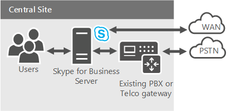

# Planear el sistema telefónico en la solución de Office 365 (en la nube PBX)Plan your Phone System in Office 365 (Cloud PBX) solution
 
Obtenga información sobre el sistema de teléfono de Microsoft en soluciones de Office 365 (en la nube PBX) para habilitar el control de llamadas y las capacidades de conmutación (PBX) en la nube de Office 365.Find information on Microsoft's Phone System in Office 365 (Cloud PBX) solutions for enabling call control and Private Branch Exchange (PBX) capabilities in the Office 365 cloud.
  
Microsoft ofrece una variedad de opciones para habilitar los usuarios para llamar a landlines y teléfonos móviles a través de la red telefónica pública conmutada (RTC), si existen la sus cuentas en Office 365 en Skype para profesionales en línea o en su Skype local para la empresa Implementación de servidor o de Lync Server 2013.Microsoft offers a variety of options for enabling your users to call landlines and mobile phones through the Public Switched Telephone Network (PSTN)—whether their accounts exist in Office 365 on Skype for Business Online or in your on-premises Skype for Business Server or Lync Server 2013 deployment.
  
En este artículo se describe las diferentes ofertas de voz de Microsoft y, a continuación, se proporciona orientación en el que es posible opciones que lo mejor para usted, según el estado actual y los planes futuros de la organización.This article outlines the different Microsoft voice offerings, and then provides guidance on which options might be the best for you, depending on your organization's current status and future plans. 

Puede usar este artículo junto con la Skype para póster de soluciones de voz en línea de negocio disponible como una descarga en formato PDF y de Visio:You can use this article along with the Skype for Business Online Voice Solutions poster available as a download in both Visio and PDF format:
* [VisioVisio](https://download.microsoft.com/download/2/E/E/2EE5C4DE-7F12-475C-A507-37870020F0D3/Plan%20Voice%20Solution%20poster%20-%20Final.vsdx)
* [PDFPDF](https://download.microsoft.com/download/2/E/E/2EE5C4DE-7F12-475C-A507-37870020F0D3/Plan%20Voice%20Solution%20poster%20-%20Final.pdf)
  
## Telefonía IP empresarialEnterprise Voice

 **Enterprise Voice** es la voz nivel internacional basada en software de Microsoft a través de la solución de protocolo de Internet (VoIP), incluido en las implementaciones locales de Skype para Business Server.**Enterprise Voice** is Microsoft's world-class software-powered Voice over Internet Protocol (VoIP) solution, included in on-premises deployments of Skype for Business Server. Enterprise Voice ofrece un amplio conjunto de capacidades y características, incluidos los grupos de respuesta, estacionamiento de llamadas, Enhanced 9-1-1 y mucho más.Enterprise Voice offers a rich set of capabilities and features, including Response Groups, Call Park, Enhanced 9-1-1, and much more. Telefonía IP empresarial es un sistema de central de conmutación (PBX) completo para su organización, que incluye conectividad con RTC a través de su operador local.Enterprise Voice is a full Private Branch Exchange (PBX) system for your organization, including PSTN connectivity through your local operator.
  

  
Para obtener más información acerca de las soluciones de Enterprise Voice de Microsoft, consulte: [planeación para Enterprise Voice en Skype para Business Server 2015](../../plan-your-deployment/enterprise-voice-solution/enterprise-voice.md), [Implementación de Enterprise Voice en Skype para Business Server 2015](../../deploy/deploy-enterprise-voice/deploy-enterprise-voice.md), [de planeación para telefonía IP empresarial en Lync Server 2013](https://technet.microsoft.com/library/gg413081%28v=ocs.15%29.aspx)e [implementación de telefonía IP empresarial en Lync Server 2013](https://technet.microsoft.com/EN-US/library/gg412876%28v=ocs.15%29.aspx).For more information about Microsoft's Enterprise Voice solutions, see: [Plan for Enterprise Voice in Skype for Business Server 2015](../../plan-your-deployment/enterprise-voice-solution/enterprise-voice.md), [Deploy Enterprise Voice in Skype for Business Server 2015](../../deploy/deploy-enterprise-voice/deploy-enterprise-voice.md), [Planning for Enterprise Voice in Lync Server 2013](https://technet.microsoft.com/library/gg413081%28v=ocs.15%29.aspx), and [Deploying Enterprise Voice in Lync Server 2013](https://technet.microsoft.com/EN-US/library/gg412876%28v=ocs.15%29.aspx).
  
## Sistema telefónico en Office 365 (en la nube PBX)Phone System in Office 365 (Cloud PBX)

 **Sistema de teléfono en Office 365** es la tecnología de Microsoft para habilitar el control de llamadas y las capacidades de PBX en la nube de Office 365 con Skype para profesionales en línea.**Phone System in Office 365** is Microsoft's technology for enabling call control and PBX capabilities in the Office 365 cloud with Skype for Business Online. Sistema telefónico permite reemplazar el sistema PBX existente con un conjunto de características de entrega de Office 365 y estrechamente integrados en la experiencia de productividad de la compañía en la nube.Phone System allows you to replace your existing PBX system with a set of features delivered from Office 365 and tightly integrated into the company's cloud productivity experience.
  
Con el sistema telefónico en Office 365, los usuarios pueden usar Skype para empresarial en línea para que se ocupe de las tareas de control de llamada básico, como realizar y recibir llamadas, transferencia de llamadas y las llamadas de silenciar el audio y unmuting.With Phone System in Office 365, your users can use Skype for Business Online to take care of basic call control tasks, such as placing and receiving calls, transferring calls, and muting and unmuting calls. Los usuarios de teléfonos del sistema pueden hacer clic en un nombre en su libreta de direcciones y Skype para la empresa realiza una llamada a esa persona.Phone System users can click a name in their address book, and Skype for Business places a call to that person. Para realizar y recibir llamadas, los usuarios de Sistema telefónico pueden usar sus dispositivos móviles, auriculares con un equipo portátil o PC, o bien uno de los distintos teléfonos IP compatibles con Skype Empresarial.To place and receive calls, Phone System users can use their mobile devices, a headset with a laptop or PC, or one of many IP phones that work with Skype for Business. Para los administradores, el sistema telefónico proporciona la capacidad para administrar las llamadas dentro de la misma consola de administración de inquilinos usada para la mensajería, colaboración y así sucesivamente.For administrators, Phone System provides the ability to manage calling within the same Tenant admin console used for messaging, collaboration, and so on.
  
Como con los sistemas PBX tradicionales y con Enterprise Voice, las llamadas entre los usuarios de su organización se controlan internamente dentro del sistema de teléfono, nunca se va a la RTC.As with traditional PBX systems and with Enterprise Voice, calls between users in your organization are handled internally within Phone System, never going to the PSTN. Esto se aplica a las llamadas entre usuarios de la organización que se encuentra en diferentes áreas geográficas, eliminación de los costos de larga distancia en estas llamadas internas.This applies to calls between users in your organization located in different geographical areas, removing long-distance costs on these internal calls.
  
Para habilitar las llamadas a landlines y teléfonos móviles, el sistema telefónico se pueden conectar a la RTC en una de estas dos formas:To enable calls to landlines and mobile phones, Phone System can be connected to the PSTN in one of two ways:
  
- Mediante la compra de una llamada a Plan — la RTC llamar al complemento de plan a Office 365.By purchasing Calling Plan—the PSTN calling plan add-on to Office 365.
    
- Mediante el uso de RTC local conectividad, donde software local se conecta con la infraestructura de telefonía existente.By using on-premises PSTN connectivity, where software on-premises connects with your existing telephony infrastructure. 
    
## Sistema telefónico en soluciones de Office 365Phone System in Office 365 solutions

La solución que elija para aprovechar las ventajas del sistema de teléfono de Microsoft en Office 365 oferta depende de las necesidades actuales y futuras, por ejemplo, si desea que — o que son necesarios, para conservar la funcionalidad proporcionada por la implementación local, si es necesario características que están actualmente disponibles únicamente con la solución de Enterprise Voice local y cuál es su plan para mover las personas a la nube.The solution you choose to take advantage of Microsoft's Phone System in Office 365 offering depends on your current and future needs, such as whether you want—or are required—to retain functionality provided by your on-premises deployment, whether you need features that are currently available only with your on-premises Enterprise Voice solution, and what your plan is for moving people to the cloud. 
  
Puede elegir una oferta completamente-in-the-cloud, o puede elegir una implementación híbrida que aprovecha las ventajas de sistema telefónico de Office 365, pero mantiene algunas funciones en local.You can choose a completely-in-the-cloud offering, or you can choose a hybrid deployment that takes advantage of Phone System in Office 365, but keeps some functionality on premises. Dependiendo de sus necesidades, puede elegir tener funcionalidad de RTC proporcionada por el servicio Office 365 o por su software local, como se muestra en el siguiente diagrama y se describe en las secciones siguientes:Depending on your needs, you can choose to have PSTN functionality provided by the Office 365 service or by your on-premises software—as shown in the following diagram and described in the sections that follow:
  

  
- **Sistema telefónico en Office 365 con el Plan para llamar a** - esta opción se usa el complemento de planeación de la llamada al sistema de teléfono en Office 365 para habilitar la conectividad de RTC para llamar al landlines y teléfonos móviles todo el mundo (según el nivel de servicio que se concede bajo licencia).**Phone System in Office 365 with Calling Plan** - This option uses the Calling Plan add-on to Phone System in Office 365 to enable PSTN connectivity for calling to landlines and mobile phones around the world (depending on the level of service being licensed). Los usuarios están hospedados en la nube y están habilitados para el sistema telefónico con el complemento de llamar a planear proporcionado por Microsoft.Your users are homed in the cloud and are enabled for Phone System with the Calling Plan add-on provided by Microsoft. La oferta de planeación de la llamada no requiere una implementación de servidor local.The Calling Plan offering does not require an on-premises server deployment. Llamar a Plan sólo funciona con el sistema telefónico en Office 365, no puede usar con otro sistema PBX.Calling Plan only works with Phone System in Office 365—you can't use it with another PBX system. Para obtener más información, vea [Llamar a planear en Office 365](plan-your-phone-system-cloud-pbx-solution.md#BKMK_PSTNCalling).For more information, see [ Calling Plan in Office 365](plan-your-phone-system-cloud-pbx-solution.md#BKMK_PSTNCalling).
    
- **Sistema telefónico en Office 365 con conectividad RTC local** - esta opción se usa software local para conectarse a su operador, circuito y contrato de RTC existentes con Office 365.**Phone System in Office 365 with on-premises PSTN connectivity** - This option uses software on premises to connect your existing PSTN carrier, circuit, and contract with Office 365. Los usuarios están hospedados en la nube y están habilitados para el sistema telefónico en Office 365, pero se procesan sus llamadas a través de software local.Your users are homed in the cloud and are enabled for Phone System in Office 365, but their calling is processed through software on premises.
    
    Sigue usando su conectividad con RTC existente (a través de una conexión de PBX, puerta de enlace, controlador de borde de sesión o enlace troncal SIP) a RTC de origen para los usuarios que transfiera a la nube.You continue to use your existing PSTN connectivity (either through a PBX, Gateway, Session Border Controller, or SIP Trunking connection) to source PSTN for the users who you move to the cloud. Una vez que un usuario se mueve a Skype para profesionales en línea y el sistema de teléfono en Office 365, su número de teléfono redirigirá a cualquiera de los Skype para clientes empresariales para equipos o dispositivos Smartphone, así como asistencia al usuario teléfonos certificados para Skype para la empresa.Once a user is moved to Skype for Business Online and Phone System in Office 365, their phone number will route to any of the Skype for Business clients for PCs or Smartphones as well as desk phones certified for Skype for Business. Una vez que los puertos, los usuarios de PBX en la nube y heredada pueden llamar mutuamente normalmente, así como realizar y recibir llamadas de RTC mediante su número de teléfono completo.Once ported, cloud and legacy PBX users can call each other normally as well as make and receive PSTN calls using their full phone number.
    
    Si quiere implementar conectividad con RTC local, puede elegir entre las opciones siguientes:If you want to implement on-premises PSTN connectivity, you can choose from the following options:
    
  - **Skype para Business Edition de conector de nube** - conector en la nube es un híbrido que ofrece que consta de un conjunto de empaquetado máquinas virtuales (VM) que implementan la conectividad de RTC local.**Skype for Business Cloud Connector Edition** - Cloud Connector is a hybrid offering that consists of a set of packaged Virtual Machines (VMs) that implement on-premises PSTN connectivity. Mediante la implementación de un mínimo Skype para la topología de servidor empresarial en un entorno virtualizado, los usuarios de su organización, si hospedados en la nube se encuentran en instalaciones, podrá enviar y recibir llamadas con landlines y teléfonos móviles a través de las instalaciones existentes infraestructura de voz.By deploying a minimal Skype for Business Server topology in a virtualized environment, users in your organization, whether homed in the cloud are on premises, will be able to send and receive calls with landlines and mobile phones through the existing on-premises voice infrastructure. Para obtener más información, consulte [Plan de Skype para Business Edition de conector en la nube](plan-skype-for-business-cloud-connector-edition.md) y [configurar y administrar Skype para Business Edition de conector en la nube](configure-skype-for-business-cloud-connector-edition.md).For more information, see [Plan for Skype for Business Cloud Connector Edition](plan-skype-for-business-cloud-connector-edition.md) and [Configure and manage Skype for Business Cloud Connector Edition](configure-skype-for-business-cloud-connector-edition.md).
    
  - **Skype para la implementación existente de Business Server** - un Skype existente para la implementación de Lync Server o de Business Server puede implementar así como la conectividad de RTC local.**Skype for Business Server existing deployment** - An existing Skype for Business Server or Lync Server deployment can implement on-premises PSTN connectivity as well. Este es un híbrido que ofrece que consta de un Skype para la implementación local de Business Server modificado para entornos híbridos RTC.This is a hybrid offering that consists of a Skype for Business Server on-premises deployment modified for hybrid PSTN. Los usuarios de su organización, si hospedados en la nube se encuentran en instalaciones, podrá enviar y recibir llamadas con landlines y teléfonos móviles a través de la infraestructura de voz existente local.Users in your organization, whether homed in the cloud are on premises, will be able to send and receive calls with landlines and mobile phones through the existing on-premises voice infrastructure. Para obtener más información, vea [Planear el sistema de teléfono en Office 365 con conectividad RTC en Skype para Business Server local](plan-phone-system-with-on-premises-pstn-connectivity.md) y [Habilitar usuarios para el sistema telefónico en Office 365 con conectividad de RTC local en Skype para Business Server](enable-users-for-phone-system.md).For more information, see [Plan Phone System in Office 365 with on-premises PSTN connectivity in Skype for Business Server](plan-phone-system-with-on-premises-pstn-connectivity.md) and [Enable users for Phone System in Office 365 with on-premises PSTN connectivity in Skype for Business Server](enable-users-for-phone-system.md).
    
### Llamar a Plan en Office 365Calling Plan in Office 365

 **Planeación de la llamada en Office 365** es el servicio que funcione con el sistema telefónico en permitir que los usuarios de Office 365 para realizar llamadas a landlines y teléfonos móviles.**Calling Plan in Office 365** is the service that works with Phone System in Office 365 allowing users to make calls to landlines and mobile phones. Debido a que este plan llamada de RTC funciona fuera de Office 365, esto es una oferta de completamente-in-the-cloud que no requiere una implementación de servidor local.Because this PSTN calling plan operates out of Office 365, this is a completely-in-the-cloud offering that does not require an on-premises server deployment.
  
Los usuarios de esta opción están hospedados en Skype para profesionales en línea en Office 365 y tengan acceso a Skype para servicios de voz en línea de negocio.Users of this option are homed in Skype for Business Online in Office 365 and have access to Skype for Business Online voice services. Microsoft es el proveedor de los servicios principales de llamadas y RTC, e incluso puede proporcionar o transferir los números de teléfono de sus usuarios.Microsoft is the provider of both core calling and PSTN services, and can even provide or port your users' phone numbers. 
  
Llamar a Plan en Office 365 le permite buscar, adquirir y asignar a los números de teléfono a los usuarios de su organización para que los usuarios pueden realizar y recibir llamadas telefónicas con personas dentro y fuera de la organización.Calling Plan in Office 365 allows you to search, acquire, and assign phone numbers to users in your organization so that users can make and receive phone calls with people inside and outside of your organization.
  
En todos los tipos de empresas, tener un número de teléfono que permita a los usuarios realizar y recibir llamadas de voz es un requisito importante para realizar negocios, ya que los números de teléfono se usan para identificar a un usuario y permiten la comunicación entre organizaciones.In all types of business, having a phone number that allows users to send and receive voice calls is an important requirement to do business as phone numbers are used to identify a user and allow for communication across organizations. Los usuarios que tengan asignados números de teléfono podrán realizar llamadas de voz en todos los dispositivos de Skype Empresarial, como teléfonos VoIP, equipos PC y dispositivos móviles.The users that are assigned phone numbers will be able to make voice calls across all Skype for Business devices including VoIP phones, PCs, and mobile devices. 
  

  
Para obtener más información, vea [¿Cuáles son los planes de llamada en Office 365?](../../../SfbOnline/what-are-calling-plans-in-office-365/what-are-calling-plans-in-office-365.md)For more information, see [What are Calling Plans in Office 365?](../../../SfbOnline/what-are-calling-plans-in-office-365/what-are-calling-plans-in-office-365.md)

Llamar a Plan en Office 365 está disponible en las ubicaciones geográficas específicas pero en crecimiento.Calling Plan in Office 365 is available in specific but growing geographic locations. Consulte la disponibilidad en su área con su representante de Microsoft.Please check with your Microsoft representative for availability in your area. 
  
### Conectividad con RTC local con Cloud Connector EditionOn-premises PSTN connectivity with Cloud Connector Edition

 **Conector de nube** es un conjunto de empaquetado máquinas virtuales (VM) que implementan la conectividad de RTC local con el sistema telefónico en Office 365.**Cloud Connector** is a set of packaged Virtual Machines (VMs) that implement on-premises PSTN connectivity with Phone System in Office 365. Esta oferta híbrida está diseñada para las organizaciones que desean habilitar su Skype para los usuarios empresariales en línea usar su conexión de RTC local existente, con Skype para el control de llamadas de negocio en la nube.This hybrid offering is designed for organizations that want to enable their Skype for Business Online users to use their existing on-premises PSTN connection, with Skype for Business call control in the cloud.
  
Con esta opción, implementar un conjunto de empaquetado máquinas virtuales que contienen un mínimo Skype para la topología de servidor empresarial, que consta de un componente de borde, el componente de mediación y una función del almacén de Administración Central (CMS).With this option, you deploy a set of packaged VMs that contain a minimal Skype for Business Server topology—consisting of an Edge component, Mediation component, and a Central Management Store (CMS) role. Estos servicios están configurados para la implementación híbrida con el inquilino de Office 365 que incluye Skype para servicios en línea de negocio.These services are configured for hybrid with your Office 365 tenant that includes Skype for Business Online services. 
  

  
Para obtener más información acerca de esta opción, consulte [Plan de Skype para Business Edition de conector en la nube](plan-skype-for-business-cloud-connector-edition.md) y [configurar y administrar Skype para Business Edition de conector en la nube](configure-skype-for-business-cloud-connector-edition.md).For more information about this option, see [Plan for Skype for Business Cloud Connector Edition](plan-skype-for-business-cloud-connector-edition.md) and [Configure and manage Skype for Business Cloud Connector Edition](configure-skype-for-business-cloud-connector-edition.md).
  
### Conectividad de RTC local con una implementación existenteOn-premises PSTN connectivity with an existing deployment

Puede implementar una solución híbrida con su Skype existente para la implementación de Business Server y la conectividad de RTC.You can implement a hybrid solution using your existing Skype for Business Server deployment and PSTN connectivity. En esta topología, los usuarios están hospedados en la nube en Skype para profesionales en línea en lugar de que se está hospedado en la implementación local.In this topology, users are homed in the cloud on Skype for Business Online instead of being homed on the on-premises deployment. Puede elegir esta opción si actualmente tiene usuarios hospedados en la nube o si quiere empezar a transferir usuarios a la nube.You can choose this option if you currently have users homed in the cloud or if you want to start migrating users to the cloud. 
  
Con esta opción, su Skype para los usuarios en línea de negocio obtenga su conectividad RTC a través de Enterprise Voice en su Skype local para la implementación de servidor empresarial, con Skype para el control de llamadas de negocio en la nube.With this option, your Skype for Business Online users get their PSTN connectivity through Enterprise Voice on your on-premises Skype for Business Server deployment, with Skype for Business call control in the cloud. 
  

  
Para obtener más información acerca de esta opción, vea [Planear el sistema de teléfono en Office 365 con conectividad RTC en Skype para Business Server local](plan-phone-system-with-on-premises-pstn-connectivity.md) y [permiten a los usuarios para el sistema telefónico en Office 365 con local conectividad RTC en Skype para Business Server ](enable-users-for-phone-system.md).For more information about this option, see [Plan Phone System in Office 365 with on-premises PSTN connectivity in Skype for Business Server](plan-phone-system-with-on-premises-pstn-connectivity.md) and [Enable users for Phone System in Office 365 with on-premises PSTN connectivity in Skype for Business Server](enable-users-for-phone-system.md).
  
## Elegir la mejor soluciónChoose the best solution

Para decidir qué solución es la más adecuada para su organización, asegúrese de que conoce las respuestas a las preguntas siguientes y, después, revise el diagrama de flujo que le ayudará a elegir la solución:To decide which solution is best for your organization, make sure you know the answers to the following questions, and then review the flowchart that will help you choose your solution:
  
- ¿Tiene un Skype local existente para la implementación de Business Server?Do you have an existing on-premises Skype for Business Server deployment? 
    
- ¿Los usuarios están hospedados en Skype para empresarial local, en la nube en Skype para profesionales en línea, o ambos?Are your users homed in Skype for Business on-premises, in the cloud on Skype for Business Online, or both? ¿Quiere mover sus usuarios locales a la nube?Do you want to move your on-premises users to the cloud?
    
- ¿Es una llamada a planeación de Microsoft en Office 365 disponibles en su región?Is Microsoft's Calling Plan in Office 365 available in your region? 
    
- ¿Quiere mantener su operador de telefonía actual?Do you want to keep your current telephony carrier? ¿Necesita mantener su operador de telefonía actual debido a un contrato existente?Do you need to keep your current telephony carrier because of an existing contract?
    
- ¿Tiene un PBX heredado local que quiere o necesita mantener?Do you have an existing on-premises legacy PBX that you want or need to keep? 
    
- ¿Su PBX heredado actual le ofrece características únicas que son críticas para su empresa?Does your current legacy PBX offer unique features that are critical to your business?
    
- ¿Se requiere características que ofrece no actualmente en el sistema telefónico en Office 365 cualquier o todos los usuarios?Do any or all of your users require features not currently offered in Phone System in Office 365?
    
Antes de tomar su decisión sobre qué solución es la adecuada para su organización: sistema telefónico en Office 365, local Enterprise Voice o una solución de combinación, debe determinar qué características que necesita ahora y en el futuro.Before you make your decision about which solution is right for your organization—Phone System in Office 365, on-premises Enterprise Voice, or a combination solution—you need to determine what features you need now and in the future. Algunas características, como grupos de respuesta, recogida de llamadas de grupo y estacionamiento de llamadas: están disponibles sólo para los usuarios locales.Some features—such as Response Groups, Group Call Pickup, and Call Park—are offered only for on-premises users. Para obtener una lista completa de sistema telefónico en Office 365 de funciones disponibles, vea [aquí es lo que obtiene con el sistema telefónico en Office 365](https://go.microsoft.com/fwlink/p/?LinkId=715517).For a complete list of Phone System in Office 365 features available to you, see [Here's what you get with Phone System in Office 365](https://go.microsoft.com/fwlink/p/?LinkId=715517).
  
**Elija su solución****Choose your solution**

  
|**Su situación****Your situation**   |**Sistema de teléfono en la solución de Office 365****Phone System in Office 365 solution**   |
|:-----|:-----|
|Su sistema PBX ofrece características únicas que necesita conservar.Your PBX system offers unique features that you need to retain.    |**Analice la posibilidad de reemplazar su PBX con Skype Empresarial Server.****Investigate replacing your PBX with Skype for Business Server.** Puede usar Skype para Enterprise Voice Business Server como un sistema PBX completo para su organización, incluida la conectividad RTC a través de su operador de telefonía local.You can use Skype for Business Server Enterprise Voice as a full PBX system for your organization, including PSTN connectivity through your local operator. Si la necesidad de PBX sobre las características de los cambios en el futuro, puede reconsiderar el sistema telefónico en Office 365.If your need for PBX features changes in the future, you can reconsider Phone System in Office 365.   Para obtener más información acerca de las soluciones de Enterprise Voice de Microsoft, vea [Planear la solución de Enterprise Voice en Skype para Business Server 2015](../../plan-your-deployment/enterprise-voice-solution/enterprise-voice-solution.md).For more information about Microsoft's Enterprise Voice solutions, see [Plan your Enterprise Voice solution in Skype for Business Server 2015](../../plan-your-deployment/enterprise-voice-solution/enterprise-voice-solution.md).    Si no todos los usuarios requieren las características exclusivas proporcionado por el PBX actual, puede considerar la posibilidad de mover los usuarios a Skype para profesionales en línea.If not all your users require the unique features provided by your current PBX, you can consider moving those users to Skype for Business Online.    |
|Su PBX no ofrece características exclusivas que necesite conservar, al llamar a planear en Office 365 está disponible en su región y va a usar servicios de RTC proporcionados por Microsoft.Your PBX does not offer unique features that you need to retain, Calling Plan in Office 365 is available in your region, and you want to use Microsoft-provided PSTN services.    |**Suscribirse a llamar al Plan en Office 365.****Subscribe to Calling Plan in Office 365.** Todos sus usuarios pueden estar en la nube en Skype Empresarial Online y su organización puede recibir servicios RTC y PBX de la nube de Microsoft.All your users can be in the cloud on Skype for Business Online, and your organization can receive both PBX and PSTN services from the Microsoft cloud. Si los usuarios ya tienen números de teléfono de su operador de telefonía actual, pueden migrar los números de teléfono para el sistema telefónico en Office 365.If your users already have phone numbers from your current carrier, the phone numbers can be ported to Phone System in Office 365. Si es necesario, puede obtener números de teléfono adicionales de Microsoft.As needed, you can then get additional phone numbers from Microsoft.   Para obtener más información, vea [¿Cuáles son los planes de llamada en Office 365?](../../../SfbOnline/what-are-calling-plans-in-office-365/what-are-calling-plans-in-office-365.md)For more information, see [What are Calling Plans in Office 365?](../../../SfbOnline/what-are-calling-plans-in-office-365/what-are-calling-plans-in-office-365.md)   |
|Su PBX no ofrece características exclusivas que necesite conservar, llamar a Plan en Office 365 no es disponible en su región y tiene una existente de Lync o Skype para la implementación de Business Server.Your PBX does not offer unique features that you need to retain, Calling Plan in Office 365 is not available in your region, and you have an existing Lync or Skype for Business Server deployment.    En este escenario también es posible que todos los usuarios se encuentran en los Estados Unidos, pero no se considere la posibilidad de mover a RTC proporcionados por Microsoft por otros motivos, como las obligaciones contractuales con su operador de telefonía existente.In this scenario it is also possible that all your users are in the United States, but you cannot consider moving to Microsoft-provided PSTN for other reasons—such as contractual obligations with your existing carrier.    |**Conectar su Skype existente para la implementación de Business Server con el sistema telefónico en Office 365.****Connect your existing Skype for Business Server deployment with Phone System in Office 365.** Conectividad RTC se proporciona a través de Enterprise Voice en su Skype local para la implementación de Business Server, pero la organización puede recibir servicios de PBX de la nube de Microsoft.PSTN connectivity is provided through Enterprise Voice on your on-premises Skype for Business Server deployment, but your organization can receive PBX services from the Microsoft cloud. Puede conservar las capacidades de voz de los usuarios cuando comienza a mover a Skype para profesionales en línea.You can retain your users' voice capabilities as you begin to move them to Skype for Business Online. Puede transferir sus usuarios según sus necesidades y tendrá la seguridad de que sus características de voz seguirán disponibles, independientemente de dónde estén hospedados.You can move your users at your own pace, knowing that their voice features will continue no matter where they are homed.   En el futuro, si decide que puede dejar su operador de telefonía actual, puede trasladar a los usuarios de la nube completa del sistema de Microsoft de teléfono en Office 365 con una llamada a planear, con Microsoft que proporciona todas las funciones de PBX y RTC.In the future, if you decide you can leave your current carrier, you can port your cloud users to Microsoft's full Phone System in Office 365 with Calling Plan, with Microsoft providing all PBX and PSTN capabilities.    Para obtener más información acerca de esta opción, vea [Planear el sistema de teléfono en Office 365 con conectividad RTC en Skype para Business Server local](plan-phone-system-with-on-premises-pstn-connectivity.md) y [permiten a los usuarios para el sistema telefónico en Office 365 con local conectividad RTC en Skype para Business Server ](enable-users-for-phone-system.md).For more information about this option, see [Plan Phone System in Office 365 with on-premises PSTN connectivity in Skype for Business Server](plan-phone-system-with-on-premises-pstn-connectivity.md) and [Enable users for Phone System in Office 365 with on-premises PSTN connectivity in Skype for Business Server](enable-users-for-phone-system.md).    |
|Su PBX no ofrece características exclusivas que se deben conservar, llamar a Plan en Office 365 no es disponible en su región y no tienen una existente de Lync o Skype para la implementación de Business Server.Your PBX does not offer unique features that you need to retain, Calling Plan in Office 365 is not available in your region, and you do not have an existing Lync or Skype for Business Server deployment.    En este escenario, también es posible que una llamada a planear en Office 365 está disponible en su región, pero no se considere la posibilidad de mover a RTC proporcionados por Microsoft por otros motivos, como las obligaciones contractuales con su operador de telefonía existente.In this scenario, it is also possible that Calling Plan in Office 365 is available in your region, but you cannot consider moving to Microsoft-provided PSTN for other reasons—such as contractual obligations with your existing carrier.    |**Implemente Cloud Connector.****Deploy Cloud Connector.** Mantiene su operador de RTC actual, pero su organización puede recibir servicios de PBX de la nube de Microsoft.You keep your current PSTN carrier, but your organization can receive PBX services from the Microsoft cloud. Conector de nube le permite proporcionar Skype para las capacidades de control de llamada empresarial a los usuarios.Cloud Connector allows you to provide Skype for Business call control capabilities to your users. Esta solución funciona con independencia de la ubicación geográfica de sus usuarios, ya que cada usuario se conecta a su sitio local para la conectividad con RTC.This solution works no matter the geographic location of your users, as each user is connected to their local site for PSTN connectivity.   En el futuro, si decide que puede dejar su operador de telefonía actual, puede trasladar a los usuarios de la nube completa del sistema de Microsoft de teléfono en Office 365 con una llamada a planear, con Microsoft que proporciona todas las funciones de PBX y RTC.In the future, if you decide you can leave your current carrier, you can port your cloud users to Microsoft's full Phone System in Office 365 with Calling Plan, with Microsoft providing all PBX and PSTN capabilities.    Para obtener más información acerca de esta opción, consulte [Plan de Skype para Business Edition de conector en la nube](plan-skype-for-business-cloud-connector-edition.md) y [configurar y administrar Skype para Business Edition de conector en la nube](configure-skype-for-business-cloud-connector-edition.md).For more information about this option, see [Plan for Skype for Business Cloud Connector Edition](plan-skype-for-business-cloud-connector-edition.md) and [Configure and manage Skype for Business Cloud Connector Edition](configure-skype-for-business-cloud-connector-edition.md).    |
   
### Elegir una solución combinadaChoose a combination solution

Por supuesto, no tiene que elegir solo una solución para toda su organización.Of course, you don't have to choose just one solution for your entire organization. A continuación se muestran sólo algunos ejemplos donde la combinación de soluciones puede ser la mejor estrategia para su organización:Following are just some examples where combining solutions might be the best strategy for your organization:
  
- **Mi organización tiene un Skype existente para la implementación de servidor empresarial, al llamar a planear en Office 365 está disponible en mi región, las características de control de llamadas básica basta y no necesite mantener mi troncos RTC o PBX local.****My organization has an existing Skype for Business Server deployment, Calling Plan in Office 365 is available in my region, I only need basic call control features, and I do not need to keep my PSTN trunks or PBX on premises.** Puede usar el sistema telefónico en Office 365 con conectividad de RTC local para mantener las características de voz de los usuarios como inicio moverlas en línea.You can use Phone System in Office 365 with on-premises PSTN connectivity to keep users' voice features as you start to move them online. Finalmente, puede mover todos los usuarios en línea, dejar de utilizar los servidores locales y usar el sistema telefónico en Office 365 con el Plan para llamar a.Eventually, you can move all users online, deprecate your on-premises servers, and use Phone System in Office 365 with Calling Plan.
    
- **Mi organización tiene muchas ubicaciones geográficas. Los sitios más grandes tienen un Skype local para las implementaciones de servidores empresariales con Enterprise Voice, mientras que los usuarios en los sitios más pequeños no tienen ningún Skype para las características de voz empresarial.****My organization has many geographic locations. The larger sites have an on-premises Skype for Business Server deployments with Enterprise Voice, while users at the smaller sites do not have any Skype for Business voice features at all.** Si estos sitios más pequeños se encuentran en un área que proporciona la planeación de la llamada en Office 365, podría mover estos usuarios a Skype para profesionales en línea y habilítelos para las características de voz a través del sistema de teléfono en Office 365 con la planeación de la llamada.If these smaller sites are in a region that provides Calling Plan in Office 365, you could move these users to Skype for Business Online and enable them for voice features through Phone System in Office 365 with Calling Plan. Mientras tanto, los usuarios en los sitios más grandes pueden permanecer en local o podría moverlas a Skype para profesionales en línea a su propio ritmo aprovechando las ventajas del sistema de teléfono en Office 365 con local conectividad RTC.All the while, users at your larger sites can stay on premises, or you could move them to Skype for Business Online at your own pace by taking advantage of Phone System in Office 365 with on-premises PSTN connectivity.
    
- **Mi organización tiene un Skype existente para la implementación de servidor empresarial, al llamar a planear en Office 365 está disponible en mi región, pero algunos de Mis usuarios requieren características avanzadas de llamada, como grupos de respuesta y recogida de llamadas de grupo.****My organization has an existing Skype for Business Server deployment, Calling Plan in Office 365 is available in my region, but some of my users require advanced calling features such as Response Groups and Group Call Pickup.** Aquellos usuarios que no es necesario usar características avanzadas de llamada se pueden mover a la nube ahora, usando el sistema telefónico en Office 365 con conectividad de RTC local.Those users who do not need to use advanced calling features can be moved to the cloud now, using Phone System in Office 365 with on-premises PSTN connectivity. Más adelante, cuando se agregan las características requeridas para Skype para profesionales en línea, puede mover el resto de los usuarios a la nube también.Later, when the required features are added to Skype for Business Online, you can move the rest of your users to the cloud as well.
    
- **Mi organización tiene un Skype existente para la implementación de Business Server, desea mover todos los usuarios a la nube, pero no está disponible al llamar a planear en Office 365 a en todas las regiones.****My organization has an existing Skype for Business Server deployment, I want to move all my users to the cloud, but Calling Plan in Office 365 is not available in all regions.** Puede mover todos los usuarios a la nube conservando sus tronco del sitio local y la funcionalidad de PBX, usando el sistema telefónico en Office 365 con conectividad de RTC local.You can move all your users to the cloud while retaining their local site trunk and PBX functionality, using Phone System in Office 365 with on-premises PSTN connectivity. Para aquellos usuarios que se encuentran en las regiones que proporcionan una llamada a planear en Office 365, y que no es necesario avanzadas características de llamada, opcionalmente puede mover el control de sus llamadas a la nube, también con el sistema telefónico en Office 365 con el Plan para llamar a.For those users residing in regions that provide Calling Plan in Office 365—and who do not need advanced calling features—you can optionally move their call control to the cloud as well, using Phone System in Office 365 with Calling Plan. Cuando lo haga, también puede transferir de manera opcional sus números de teléfono existentes.When you do so, you can optionally port their existing phone numbers.
    
- **Mi organización tiene un Skype existente para Business Server, pero sin la implementación de Enterprise Voice.****My organization has an existing Skype for Business Server, but without Enterprise Voice deployment.** Vea el diagrama de flujo para determinar cuál es la mejor solución para su organización.See the flowchart to determine the best solution for your organization.
    

