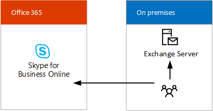

# Skype para soluciones híbridas de negocioSkype for Business hybrid solutions
 
Obtenga información acerca de cómo planear un Skype para implementación híbrida de negocio.Find information on planning a Skype for Business hybrid deployment. 
  
En este tema se presentan distintas configuraciones híbridas que pueden ayudarlo a determinar qué configuración es la mejor para su empresa.This topic introduces you to several hybrid configurations to help you determine which configuration is best for your business. Luego, puede leer más sobre la configuración que le interese, siguiendo los vínculos de este tema.You can then read more about the configuration you're interested in by following the links in this topic. Este artículo contiene las siguientes secciones:This topic contains the following sections:
  
- [Configuraciones híbridas de Skype EmpresarialSkype for Business hybrid configurations](skype-for-business-hybrid-solutions.md#BKMK_HybridConfigurations)
    
- [Agregar Skype para profesionales en línea en la existente local Skype para el entorno empresarialAdd Skype for Business Online into your existing on-premises Skype for Business environment](skype-for-business-hybrid-solutions.md#BKMK_HybridConnectivity)
    
- [Permite aprovechar sistema telefónico en Office 365 (en la nube PBX)Take advantage of Phone System in Office 365 (Cloud PBX)](skype-for-business-hybrid-solutions.md#BKMK_CloudPBX)
    
- [Integración con Exchange y SharePointIntegrate with Exchange and SharePoint](skype-for-business-hybrid-solutions.md#BKMK_IntegratewExchangeSharePoint)
    
- [Tareas para planificar y configurar un entorno híbridoTasks for planning and configuring a hybrid environment](skype-for-business-hybrid-solutions.md#BKMK_Tasks)
    
- [Para más informaciónFor more information](skype-for-business-hybrid-solutions.md#BKMK_MoreInfo)
    
## Configuraciones híbridas de Skype EmpresarialSkype for Business hybrid configurations

Skype para la empresa es compatible con varias configuraciones híbridas.Skype for Business supports several hybrid configurations. Puede agregar Skype para profesionales en línea en la existente local Skype para el entorno empresarial, integrar su Skype para la implementación de empresa con Exchange Online y SharePoint Online y aprovechar las ventajas del sistema de teléfono en Office 365 (en la nube PBX) — de Microsoft tecnología para habilitar el control de llamadas y las capacidades de conmutación (PBX) en la nube de Office 365 con Skype para profesionales en línea.You can add Skype for Business Online into your existing on-premises Skype for Business environment, integrate your Skype for Business deployment with Exchange Online and SharePoint Online, and take advantage of Phone System in Office 365 (Cloud PBX)—Microsoft's technology for enabling call control and Private Branch Exchange (PBX) capabilities in the Office 365 cloud with Skype for Business Online. 
  
Con un Skype para implementación híbrida de negocio, combinar un Skype para suscripción empresarial en línea con su Skype local para la oferta de negocio.With a Skype for Business hybrid deployment, you combine a Skype for Business Online subscription with your on-premises Skype for Business offering. Puede empezar a crear habilidades de administración de software como servicio en su organización y mover su Skype para los usuarios empresariales a la nube a su propio ritmo.You can start building software-as-a-service management skills in your organization, and move your Skype for Business users to the cloud at your own pace. Los usuarios que están hospedados en la nube pueden aprovechar sistema telefónico en Office 365 conservando la conectividad pública red de telefónica conmutada (RTC) de local.Your users who are homed in the cloud can take advantage of Phone System in Office 365 while retaining your on-premises Public Switched Telephone Network (PSTN) connectivity.
  
Con un Skype para la configuración híbrida de negocio, tenga en cuenta lo siguiente:With a Skype for Business hybrid configuration, keep the following in mind:
  
- Algunos usuarios podrían estar alojados localmente y algunos en línea, pero todos ellos comparten el mismo dominio de Protocolo de inicio de sesión (SIP), como contoso.com.Some users might be homed on premises and some online, but the users share the same Session Initiation Protocol (SIP) domain, such as contoso.com.
    
- Puede migrar los usuarios de Skype para la empresa local a Skype para profesionales en línea con el tiempo, en la programación.You can migrate users from Skype for Business on premises to Skype for Business Online over time, on your schedule.
    
- Puede realizar una integración con otras aplicaciones de Microsoft Office 365, incluidas Exchange Online y SharePoint Online.You can integrate with other Microsoft Office 365 applications, including Exchange Online and SharePoint Online.
    
- Puede realizar una integración con Exchange y SharePoint.You can integrate with Exchange and SharePoint.
    
- Puede aprovechar Difusión de reunión de Skype.You can take advantage of Skype Meeting Broadcast.
    
- Puede aprovechar la función de conferencia RTC.You can take advantage of PSTN conferencing.
    
## Agregar Skype para profesionales en línea en la existente local Skype para el entorno empresarialAdd Skype for Business Online into your existing on-premises Skype for Business environment

Conectividad híbrida entre Skype para Business Server y Skype para profesionales en línea significa que los usuarios de un dominio, como contoso.com, se reparten entre el uso de Skype para Business Server local y Skype para profesionales en línea.Hybrid connectivity between Skype for Business Server and Skype for Business Online means users of a domain, such as contoso.com, are split between using Skype for Business Server on premises and Skype for Business Online. Algunos usuarios del dominio están alojados en forma local, mientras que otros están en línea.Some of the domain users are homed on premises, and some users are homed online. Puede configurar la implementación local para la implementación híbrida con Skype para profesionales en línea y utilizar sincronización de Active Directory para mantener su local y en línea a los usuarios sincronizados.You can configure your on-premises deployment for hybrid with Skype for Business Online and use Active Directory Synchronization to keep your on-premises and online users synchronized. 
  
En el siguiente diagrama se muestra cómo se puede agregar Skype para profesionales en línea en su Skype local existente para el entorno empresarial, lo que le permite mover los usuarios a la nube a su propio ritmo:The following diagram shows how you can add Skype for Business Online into your existing on-premises Skype for Business environment, allowing you to move users to the cloud at your own pace:
  

  
Para más información, vea [Plan hybrid connectivity between Skype for Business Server and Skype for Business Online](plan-hybrid-connectivity.md) y [Deploy hybrid connectivity between Skype for Business Server and Skype for Business Online](deploy-hybrid-connectivity/deploy-hybrid-connectivity.md).For more information, see [Plan hybrid connectivity between Skype for Business Server and Skype for Business Online](plan-hybrid-connectivity.md) and [Deploy hybrid connectivity between Skype for Business Server and Skype for Business Online](deploy-hybrid-connectivity/deploy-hybrid-connectivity.md).
  
## Permite aprovechar sistema telefónico en Office 365 (en la nube PBX)Take advantage of Phone System in Office 365 (Cloud PBX)

 Sistema de teléfono en Office 365 (en la nube PBX) es la tecnología de Microsoft para habilitar el control de llamadas y las capacidades de conmutación (PBX) en la nube de Office 365 con Skype para profesionales en línea.Phone System in Office 365 (Cloud PBX) is Microsoft's technology for enabling call control and Private Branch Exchange (PBX) capabilities in the Office 365 cloud with Skype for Business Online. Sistema telefónico en Office 365 le permite reemplazar el sistema PBX existente con un conjunto de características de entrega de Office 365 y estrechamente integrados en la experiencia de productividad de nube de Microsoft.Phone System in Office 365 allows you to replace your existing PBX system with a set of features delivered from Office 365 and tightly integrated into Microsoft's cloud productivity experience.
  
Además de dos del sistema de teléfono en las ofertas de Office 365 híbrida, Microsoft ofrece el sistema telefónico en Office 365 con el Plan para llamar a: una servicio de llamada de RTC: para una solución totalmente la en nube que no requiere una implementación de servidor local.In addition to two Phone System in Office 365 hybrid offerings, Microsoft offers Phone System in Office 365 with Calling Plan—a PSTN calling service—for an all-in-the-cloud solution that does not require an on-premises server deployment. Para decidir si el sistema de teléfono en Office 365 con el Plan para llamar a podría ser la solución adecuada para su organización, vea el [Sistema telefónico en soluciones de Office 365](plan-your-phone-system-cloud-pbx-solution/plan-your-phone-system-cloud-pbx-solution.md#BKMK_PBXOfferings).To decide if Phone System in Office 365 with Calling Plan might be the right solution for your organization, see [ Phone System in Office 365 solutions](plan-your-phone-system-cloud-pbx-solution/plan-your-phone-system-cloud-pbx-solution.md#BKMK_PBXOfferings).
  
Hay dos sistema telefónico en las ofertas de Office 365 híbrida:There are two Phone System in Office 365 hybrid offerings: 
  
- [Sistema telefónico en Office 365 con conectividad local proporcionada por su Skype para la implementación de Business ServerPhone System in Office 365 with on-premises connectivity provided by your Skype for Business Server deployment](skype-for-business-hybrid-solutions.md#BKMK_Server)
    
- [Sistema telefónico en Office 365 con conectividad local proporcionada por Skype para Business Server en la nube conector EditionPhone System in Office 365 with on-premises connectivity provided by Skype for Business Server Cloud Connector Edition](skype-for-business-hybrid-solutions.md#BKMK_CCE)
    
### Sistema telefónico en Office 365 con conectividad local proporcionada por su Skype para la implementación de Business ServerPhone System in Office 365 with on-premises connectivity provided by your Skype for Business Server deployment

Esta configuración consta de un Skype para la implementación local de Business Server modificado para entornos híbridos RTC.This configuration consists of a Skype for Business Server on-premises deployment modified for hybrid PSTN. Los usuarios de su organización que están hospedados en la nube pueden recibir servicios de PBX de la nube de Microsoft, pero se proporciona conectividad RTC a través de Enterprise Voice en su Skype local para la implementación de Business Server.Users in your organization who are homed in the cloud can receive PBX services from the Microsoft cloud, but PSTN connectivity is provided through Enterprise Voice on your on-premises Skype for Business Server deployment. 
  

  
Esta es la mejor configuración si:This configuration is best if: 
  
- Su sistema PBX no ofrece características únicas que necesita conservar.Your PBX does not offer unique features that you need to retain.
    
- Llamar al Plan, el servicio de llamada de RTC de Office 365, no está disponible en su región.Calling Plan, the Office 365 PSTN calling service, is not available in your region.
    
- Tiene una existente de Lync o Skype para la implementación de Business Server.You have an existing Lync or Skype for Business Server deployment.
    
Para obtener más información, vea [Planear el sistema de teléfono en Office 365 con conectividad RTC en Skype para Business Server local](plan-your-phone-system-cloud-pbx-solution/plan-phone-system-with-on-premises-pstn-connectivity.md) y [Habilitar usuarios para el sistema telefónico en Office 365 con conectividad de RTC local en Skype para Business Server](plan-your-phone-system-cloud-pbx-solution/enable-users-for-phone-system.md).For more information, see [Plan Phone System in Office 365 with on-premises PSTN connectivity in Skype for Business Server](plan-your-phone-system-cloud-pbx-solution/plan-phone-system-with-on-premises-pstn-connectivity.md) and [Enable users for Phone System in Office 365 with on-premises PSTN connectivity in Skype for Business Server](plan-your-phone-system-cloud-pbx-solution/enable-users-for-phone-system.md).
  
### Sistema telefónico en Office 365 con conectividad local proporcionada por Skype para Business Server en la nube conector EditionPhone System in Office 365 with on-premises connectivity provided by Skype for Business Server Cloud Connector Edition

Esta configuración consta de un conjunto de máquinas virtuales empaquetadas que implementan la conectividad con RTC local.This configuration consists of a set of packaged Virtual Machines (VMs) that implement on-premises PSTN connectivity. Mediante la implementación de un mínimo Skype para la topología de servidor empresarial en un entorno virtualizado, los usuarios de su organización que están hospedados en la nube pueden recibir servicios de PBX de la nube de Microsoft, pero se proporciona conectividad RTC a través de la voz local existente infraestructura.By deploying a minimal Skype for Business Server topology in a virtualized environment, users in your organization who are homed in the cloud can receive PBX services from the Microsoft cloud, but PSTN connectivity is provided through the existing on-premises voice infrastructure. 
  

  
Esta es la mejor configuración si:This configuration is best if:
  
- Su sistema PBX no ofrece características únicas que necesita conservar.Your PBX does not offer unique features that you need to retain.
    
- Llamar al Plan, el servicio de llamada de RTC de Office 365, no está disponible en su región.Calling Plan, the Office 365 PSTN calling service, is not available in your region.
    
- No es necesario un Lync existente o Skype para la implementación de Business Server.You do not have an existing Lync or Skype for Business Server deployment.
    
Para obtener más información, consulte [Plan de Skype para Business Edition de conector en la nube](plan-your-phone-system-cloud-pbx-solution/plan-skype-for-business-cloud-connector-edition.md).For more information, see [Plan for Skype for Business Cloud Connector Edition](plan-your-phone-system-cloud-pbx-solution/plan-skype-for-business-cloud-connector-edition.md).
  
## Integración con Exchange y SharePointIntegrate with Exchange and SharePoint

Un Skype para configuración híbrida de empresarial permite integrarse con otras aplicaciones de Microsoft Office 365, incluido Exchange Online y SharePoint Online.A Skype for Business hybrid configuration allows you to integrate with other Microsoft Office 365 applications, including Exchange Online and SharePoint Online.
  
### Skype Empresarial Server con Exchange Online y SharePoint OnlineSkype for Business Server with Exchange Online and SharePoint Online

Se puede integrar Skype para Business Server con Exchange Online y SharePoint Online, tal como se muestra en el siguiente diagrama:You can integrate Skype for Business Server with Exchange Online and SharePoint Online as shown in the following diagram:
  

  
Integración de Skype para Business Server con Exchange Online y SharePoint Online tiene varias ventajas.Integrating Skype for Business Server with Exchange Online and SharePoint Online has several advantages. Puede:You can:
  
- Usar el conjunto completo de características de Skype para Business Server.Use the full feature set of Skype for Business Server.
    
- Aprovechar su equipamiento telefónico local existente, como PBX.Leverage your existing on-premises phone equipment, such as PBXs.
    
- Usar Exchange Online para correo electrónico, lo que aligera la carga de los servidores de correo electrónico y el almacenamiento locales.Use Exchange Online for email, off-loading the burden of on-premises email servers and storage.
    
- Usar SharePoint Online para colaboración, lo que aligera la carga del mantenimiento de servidores de SharePoint locales.Use SharePoint Online for collaboration, off-loading the burden of maintaining on-premises SharePoint servers.
    
- Usar Skype para la empresa, Exchange y SharePoint había integrado características, incluidos mensajería unificada (UM) en Office 365.Use Skype for Business, Exchange, and SharePoint integrated features, including Unified Messaging (UM) in Office 365.
    
Para más información, vea [Plan to integrate Skype for Business and Exchange](../plan-your-deployment/integrate-with-exchange/integrate-with-exchange.md).For more information, see [Plan to integrate Skype for Business and Exchange](../plan-your-deployment/integrate-with-exchange/integrate-with-exchange.md).
  
### Exchange Server con Skype Empresarial OnlineExchange Server with Skype for Business Online

Exchange Server se puede integrar con Skype para profesionales en línea tal como se muestra en el siguiente diagrama:You can integrate Exchange Server with Skype for Business Online as shown in the following diagram:
  

  
Integración de Exchange Server con Skype para profesionales en línea tiene las siguientes ventajas:Integrating Exchange Server with Skype for Business Online has the following advantages:
  
- Aprovechar la infraestructura de Exchange existente.Leverage your existing Exchange infrastructure.
    
- Usar Skype para empresarial en línea para las funciones de presencia, mensajería instantánea y conferencias.Use Skype for Business Online for presence, IM, and conferencing capabilities. 
    
Para más información, vea [Plan to integrate Skype for Business and Exchange](../plan-your-deployment/integrate-with-exchange/integrate-with-exchange.md).For more information, see [Plan to integrate Skype for Business and Exchange](../plan-your-deployment/integrate-with-exchange/integrate-with-exchange.md).
  
## Tareas para planificar y configurar un entorno híbridoTasks for planning and configuring a hybrid environment

Skype para la empresa proporciona un amplio conjunto de capacidades de independientemente de cómo crear su implementación.Skype for Business provides a rich set of capabilities no matter how you architect your deployment. La arquitectura que elija determinará qué responsabilidades de TI serán suyas y cuáles tendrá que pagarle a Microsoft para que admita a través de su suscripción.The architecture you choose will determine which IT responsibilities you own, and which you pay Microsoft to support through your subscription. Independientemente de la arquitectura que elija para su organización, existen cinco responsabilidades principales que siempre serán suyas:No matter which architecture is best for your organization, there are five core responsibilities that you will always own:
  
- **Red y conectividad** - Asegúrese de capacidad de la red y la disponibilidad a través de firewalls, servidores proxy, las puertas de enlace y a través de vínculos WAN mediante la realización de una evaluación de la red o por contratantes con un socio para realizar la evaluación.**Networking and connectivity** - Ensure network capacity and availability through firewalls, proxy servers, gateways, and across WAN links by performing a network assessment or by contracting with a partner to do the assessment.
    
- **Gobierno de datos &amp; la administración de derechos** - clasificar los datos confidenciales y garantizar que está protegida y supervisar siempre que se encuentra almacenada y mientras está en tránsito.**Data governance &amp; rights management** - Classify your sensitive data and ensure it is protected and monitored wherever it is stored and while it is in transit.
    
- **Los extremos de cliente** - establecer, medir y exigir la aplicación de estándares de seguridad modernos en dispositivos que se usan para tener acceso a sus datos y activos.**Client Endpoints** - Establish, measure, and enforce modern security standards on devices that are used to access your data and assets.
    
- **Cuenta &amp; acceder a administración de** - establecer un perfil de actividad de la cuenta "normal" y mostrar una alerta en la actividad inusual.**Account &amp; access management** - Establish a profile for "normal" account activity and alert on unusual activity.
    
- **Identidad**: use credenciales protegidas por hardware o autenticación multifactor (MFA) para todas las identidades. **Identity** - Use credentials secured by hardware or Multi-Factor Authentication (MFA) for all identities.
    
Además de las tareas de arquitectura que realice para el entorno local, tendrá que:In addition to the architectural tasks you perform for your on-premises environment, you will need to:
  
- Planear y diseñar requisitos de administración de identidades, incluida la integración de identidades locales con Office 365.Plan and design identity management requirements, including integrating on-premises identities with Office 365.
    
- Garantizar la capacidad y disponibilidad de la red.Ensure network capacity and availability.
    
- Adquirir certificados SSL de terceros para brindar seguridad empresarial para las ofertas de servicios de Office 365.Acquire third-party SSL certificates to provide enterprise-security for Office 365 service offerings.
    
- Decidir si desea conectarse a Office 365 con el protocolo de Internet versión 6 (IPv6).Decide if you want to connect to Office 365 with Internet Protocol version 6 (IPv6).
    
- Determinar cuánto integración de características con local y versiones en línea de Skype para la empresa, Exchange y SharePoint se desea obtener.Determine how much feature integration with on-premises and online versions of Skype for Business, Exchange, and SharePoint is desired. 
    
- Determinar qué servidor proxy se usará para las solicitudes de Office 365.Determine which proxy server device will be used for requests from Office 365.
    
También tendrá que realizar el seguimiento para profesionales de TI tareas para implementar su Skype para entorno híbrido de negocio:You will also need to perform the follow IT Pro tasks to implement your Skype for Business hybrid environment:
  
- Asegúrese de que tener un inquilino de Microsoft Office 365 con Skype para profesionales Online habilitado.Ensure you have a Microsoft Office 365 tenant with Skype for Business Online enabled.
    
- Implementar el plan de administración de identidades. Implement the identity management plan. 
    
- Planear e implementar registros y enrutamiento de DNS internos y externos.Plan and implement internal and external DNS records and routing.
    
- Configurar el proxy o firewall para los requisitos de URL y dirección IP de Office 365.Configure your proxy or firewall for Office 365 IP address and URL requirements.
    
- Administrar cuentas de usuario y Skype para la configuración del negocio en línea.Administer user accounts and Skype for Business Online settings. 
    
- Configurar el dispositivo de servidor proxy, si es necesario. Configure the proxy server device, if required. 
    
- Configurar la integración de características entre versiones locales y en línea de Exchange Server y SharePoint.Configure the integration of features with on-premises and online versions of Exchange Server and SharePoint.
    
## Para más informaciónFor more information

Para obtener más información, consulte los recursos siguientes:For more information, see the following resources:
  
- [Recursos de arquitectura de TI de la nube de MicrosoftMicrosoft cloud IT architecture resources](https://aka.ms/clouditarch)
    
- [Identidad de nube de Microsoft para arquitectos de empresaMicrosoft cloud identity for enterprise architects](https://docs.microsoft.com/office365/enterprise/microsoft-cloud-it-architecture-resources#identity)
    
- [Preparar la organización para Office 365 EnterpriseGet your organization ready for Office 365 Enterprise](https://aka.ms/O365EntPrep)
    
- [Planificar la conectividad híbrida entre Skype Empresarial Server y Skype Empresarial OnlinePlan hybrid connectivity between Skype for Business Server and Skype for Business Online](plan-hybrid-connectivity.md)
    
- [Deploy hybrid connectivity between Skype for Business Server and Skype for Business OnlineDeploy hybrid connectivity between Skype for Business Server and Skype for Business Online](deploy-hybrid-connectivity/deploy-hybrid-connectivity.md)
    
- [Sistema telefónico en soluciones de Office 365 Phone System in Office 365 solutions](plan-your-phone-system-cloud-pbx-solution/plan-your-phone-system-cloud-pbx-solution.md#BKMK_PBXOfferings)
    
- [Plan to integrate Skype for Business and ExchangePlan to integrate Skype for Business and Exchange](../plan-your-deployment/integrate-with-exchange/integrate-with-exchange.md)
    
Si desea descargar una versión en póster de este tema, vaya a:If you would like to download a poster version of this topic, go to:
  
- [Modelos arquitectónicos de Skype Empresarial (pdf)Skype for Business Architectural Models (pdf)](https://download.microsoft.com/download/7/7/4/7741262C-A60D-41F7-863B-99BF5964FBFE/Skype%20for%20Business%20Architectural%20Models.pdf)
    
- [Modelos arquitectónicos de Skype Empresarial (Visio)Skype for Business Architectural Models (Visio)](https://download.microsoft.com/download/7/7/4/7741262C-A60D-41F7-863B-99BF5964FBFE/Skype%20for%20Business%20Architectural%20Models.vsd)
    

