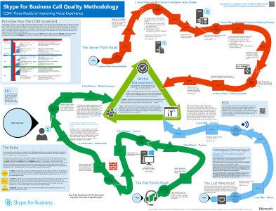

# Technical diagrams for Skype for Business ServerTechnical diagrams for Skype for Business Server

**Resumen:** Revise estos Pósteres según sea necesario durante la planeación, implementación o administración de Skype para Business Server.**Summary:** Review these posters as needed while planning, implementing, or managing Skype for Business Server.

Estos recursos se encuentran disponibles en formato Visio (.vsdx) (Visio 2015), así como en formato PDF.These resources are available in Visio (.vsdx) format (Visio 2015) and PDF format. Para obtener información acerca de cómo imprimir documentos, vea [consejos para imprimir los pósteres formato grande](technical-diagrams.md#tips).For information about how to print documents, see [Tips for printing large-format posters](technical-diagrams.md#tips).

Podría necesitar otros programas de software para ver estos archivos. En la tabla siguiente encontrará más información.You might need additional software to view these files. See the following table for more information.

|Tipo de archivoFile type|SoftwareSoftware|
|:--- |:--- |
|.vsd.vsd |Visio 2010, Visio 2013 o el [visor gratuito Visio viewer](https://go.microsoft.com/fwlink/p/?LinkId=393676)Visio 2010, Visio 2013, or the [free Visio viewer](https://go.microsoft.com/fwlink/p/?LinkId=393676)   Si utiliza Visio viewer, haga clic con el botón secundario en el vínculo de VSD, haga clic en **Guardar destino como**, guarde el archivo en el equipo y, luego, abra el archivo en su equipo.If you use the Visio viewer, right-click the VSD link, click **Save Target As**, save the file to your computer, and then open the file from your computer. |
|.pdf.pdf |Cualquier Visor de PDF, como [Adobe Reader](https://go.microsoft.com/fwlink/p/?LinkId=393675)Any PDF viewer, such as [Adobe Reader](https://go.microsoft.com/fwlink/p/?LinkId=393675) |
|.zip.zip |Cualquier utilidad de compresión de archivos. Windows 7 y posteriores abren estos archivos con utilidades nativas.Any file compression utility. Windows 7 and later opens these files natively. |

## PósteresPosters

Estos Pósteres detallan un área técnica específica y están diseñados para usarse con artículos correspondientes o contenido disponible en el centro de descarga.These posters detail a specific technical area, and are intended to be used with corresponding articles or content available on the download center.

|TítuloTitle|DescripciónDescription|
|:---|:---|
|**Skype para cargas de trabajo de protocolo de servidor de negocio****Skype for Business Server Protocol Workloads**   [Versión en PDF](https://go.microsoft.com/fwlink/p/?LinkId=550989) (recomendado para dispositivos móviles o tabletas)[PDF version](https://go.microsoft.com/fwlink/p/?LinkId=550989) (best for mobile devices or tablet computers)   [Versión de Visio](https://go.microsoft.com/fwlink/p/?LinkId=550991) (recomendado para usuarios con Visio)[Visio version](https://go.microsoft.com/fwlink/p/?LinkId=550991) (best for users with Visio) |Descargue este póster para comprender mejor los requisitos de Skype para servidores de negocios y clientes en diferentes niveles de complejidad de servicio.Download this poster to better understand requirements of Skype for Business servers and clients under different levels of service complexity.    Tamaño: 11 por 17 pulgadas (varias hojas, con un tamaño adecuado para su impresión en la mayoría de las impresoras de oficina)Size: 11-by-17 inch (multiple sheets, conveniently sized to print on most office printers)     Este póster se ha creado utilizando Visio 2015.This poster was created using Visio 2015. En un principio, no se requerirá ninguna modificación para un entorno específico.No modification should be needed for a specific environment. |
|**Metodología de calidad de llamadas de Skype Empresarial****Skype for Business Call Quality Methodology**   [versión en PDF](https://go.microsoft.com/fwlink/p/?LinkId=617899) (recomendado para dispositivos móviles o tabletas)[PDF version](https://go.microsoft.com/fwlink/p/?LinkId=617899) (best for mobile devices or tablet computers)   [Versión de Visio](https://go.microsoft.com/fwlink/p/?LinkId=617900) (recomendado para usuarios con Visio)[Visio version](https://go.microsoft.com/fwlink/p/?LinkId=617900) (best for users with Visio) |Descargue este póster para obtener más información acerca de CQM, la metodología de calidad de llamadas para Skype para Business Server 2015 que le ayudará a encontrar y eliminar los problemas que afectan a la llamada de experimentan de usuario y calidad para las implementaciones que incluyen características de enterprise voice.Download this poster to learn about CQM, the Call Quality Methodology for Skype for Business Server 2015 that helps you find and eliminate issues affecting call quality and user experience for implementations that include enterprise voice features.     Use la [página de detalles de descarga](https://go.microsoft.com/fwlink/p/?LinkId=617898) para obtener las reglas y las tarjetas de imprimibles si desea reproducir como un juego de mesa.Use the [download details page](https://go.microsoft.com/fwlink/p/?LinkId=617898) to get the printable cards and rules if you wish to play it as a board game. Use este póster con el [Cuadro de mandos de CQM](https://go.microsoft.com/fwlink/p/?LinkId=617904).Use this poster with the [CQM Scorecard](https://go.microsoft.com/fwlink/p/?LinkId=617904).    Tamaño: 34 x 44 pulgadasSize: 34-by-44 inch     Este póster se ha creado utilizando Visio 2015. En un principio, no se requerirá ninguna modificación para un entorno específico.This poster was created using Visio 2015. No modification should be needed for a specific environment. |
|**Skype para soluciones de voz empresarial****Skype for Business Voice Solutions**      [Versión en PDF](https://go.microsoft.com/fwlink/?linkid=869123) (recomendado para dispositivos móviles o tabletas)[PDF version](https://go.microsoft.com/fwlink/?linkid=869123) (best for mobile devices or tablet computers)   [Versión de Visio](https://go.microsoft.com/fwlink/?linkid=869124) (recomendado para usuarios con Visio)[Visio version](https://go.microsoft.com/fwlink/?linkid=869124) (best for users with Visio) |Microsoft ofrece una variedad de opciones para habilitar a los usuarios para llamar a landlines y teléfonos móviles a través de la pública teléfono red conmutada (RTC)--si existen sus cuentas en Office 365 en Skype para profesionales en línea o en su Skype local para la empresa Implementación de servidor 2015.Microsoft offers a variety of options for enabling your users to call landlines and mobile phones through the Public Switched Telephone Network (PSTN)--whether their accounts exist in Office 365 on Skype for Business Online or in your on-premises Skype for Business Server 2015 deployment. En este póster se describen las diferentes opciones de voz de Microsoft y, después, se proporciona una guía sobre las opciones más adecuadas para su caso, según el estado actual de la organización y los planes futuros.This poster outlines the different Microsoft voice offerings, and then provides guidance on which options might be the best for you, depending on your organization's current status and future plans.     Tamaño: 34 x 44 pulgadasSize: 34-by-44 inch    Este póster se ha creado utilizando Visio 2015. En un principio, no se requerirá ninguna modificación para un entorno específico.This poster was created using Visio 2015. No modification should be needed for a specific environment. |
|**Modelos de diseño de Skype Empresarial****Skype for Business Architectural Models**      [Versión en PDF](https://go.microsoft.com/fwlink/?linkid=869125) (recomendado para dispositivos móviles o tabletas)[PDF version](https://go.microsoft.com/fwlink/?linkid=869125) (best for mobile devices or tablet computers)   [Versión de Visio](https://go.microsoft.com/fwlink/?linkid=869126) (recomendado para usuarios con Visio)[Visio version](https://go.microsoft.com/fwlink/?linkid=869126) (best for users with Visio) |Esta serie de póster está pensada para que la audiencia para profesionales de TI a mejorar el conocimiento de los distintos modelos de arquitectura fundamentales a través del cual pueden usarse Skype para profesionales en línea y Skype para Business Server 2015 local.This poster series is intended for the IT Pro audience to raise awareness of the different fundamental architectural models through which Skype for Business Online and Skype for Business Server 2015 on premises can be consumed. Empiece con cualquier configuración que mejor se adapte a las necesidades de su organización y los planes futuros.Start with whichever configuration best suits your organization's needs and future plans. Considere otras y úselas según la necesidad.Consider and use others as needed. Por ejemplo, es posible que desee tener en cuenta la integración con Exchange y SharePoint o una solución que aprovecha las ventajas de la oferta de PBX en la nube de Microsoft.For example, you might want to consider integration with Exchange and SharePoint or a solution that takes advantage of Microsoft's Cloud PBX offering.    Tamaño: 11 x 17 pulgadasSize: 11-by-17 inch    Este póster se ha creado utilizando Visio 2010. En un principio, no se requerirá ninguna modificación para un entorno específico.This poster was created using Visio 2010. No modification should be needed for a specific environment. |

## Activos visualesVisual assets

Si desea crear sus propios diagramas de topología de Visio con el nuevo Skype para los símbolos de negocio, [descargar las galerías de símbolos](https://go.microsoft.com/fwlink/p/?LinkId=550985).If you want to make your own Visio topology diagrams using the new Skype for Business symbols, [download the stencils](https://go.microsoft.com/fwlink/p/?LinkId=550985).

## Sugerencias para imprimir pósteres con formato grandeTips for printing large-format posters

Si cuenta con un trazador, puede imprimir pósteres de gran tamaño en tamaño completo. Si no cuenta con un trazador, siga los siguientes pasos para imprimir en papel más pequeño, como en 11" x 17". Al imprimir un póster con formato grande en papel más pequeño, posiblemente el texto sea difícil o imposible de leer.If you have a plotter, you can print large posters in their full size. If you don't have plotter, use the following steps to print on smaller paper such as 11"x17". Printing a large format poster on smaller paper may make the text difficult or impossible to read.

### Imprimir pósteres en papel más pequeñoPrint posters on smaller paper

1. Abra el póster en Visio.Open the poster in Visio.
2. En el menú **Archivo**, haga clic en **Configurar página**.On the **File** menu, click **Page Setup**.
3. En la pestaña **Configurar impresión**, en la sección **Papel de impresora**, seleccione el tamaño del papel en el que desee imprimir.On the **Print Setup** tab, in the **Printer paper** section, select the size of paper you want to print on.
4. En la pestaña **Configurar impresión**, en la sección **Zoom para imprimir**, haga clic en **Ajustar** y, luego, escriba **1 hoja a lo ancho por 1 hoja a lo largo**.On the **Print Setup** tab, in the **Print zoom** section, click **Fit to**, and then enter **1 sheet across by 1 sheet down**.
5. En la pestaña **Tamaño de página**, haga clic en **Ajustar al contenido del dibujo** y haga clic en **Aceptar**.On the **Page Size** tab, click **Size to fit drawing contents**, and then click **OK**.
6. En el menú **Archivo**, haga clic en **Imprimir**.On the **File** menu, click **Print**.
