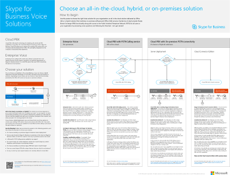

# Technical diagrams for Skype for Business Server

**Resumen:** Revise estos Pósteres según sea necesario durante la planeación, implementación o administración de Skype para Business Server.

Estos recursos se encuentran disponibles en formato Visio (.vsdx) (Visio 2015), así como en formato PDF. Para obtener información acerca de cómo imprimir documentos, vea [consejos para imprimir los pósteres formato grande](technical-diagrams.md#tips).

Podría necesitar otros programas de software para ver estos archivos. En la tabla siguiente encontrará más información.

|Tipo de archivo|Software|
|:--- |:--- |
|.vsd |Visio 2010, Visio 2013 o [Visio viewer, que es gratuito](https://go.microsoft.com/fwlink/p/?LinkId=393676)   Si utiliza Visio viewer, haga clic con el botón secundario en el vínculo de VSD, haga clic en **Guardar destino como**, guarde el archivo en el equipo y, luego, abra el archivo en su equipo. |
|.pdf |Cualquier visor de PDF, como [Adobe Reader](https://go.microsoft.com/fwlink/p/?LinkId=393675) |
|.zip |Cualquier utilidad de compresión de archivos. Windows 7 y posteriores abren estos archivos con utilidades nativas. |

## Pósteres

Estos Pósteres detallan un área técnica específica y están diseñados para usarse con artículos correspondientes o contenido disponible en el centro de descarga.

|Título|Descripción|
|:---|:---|
|**Skype para cargas de trabajo de protocolo de servidor de negocio**   [Versión PDF](https://go.microsoft.com/fwlink/p/?LinkId=550989) (mejor opción para dispositivos móviles o Tablet PC)    [Versión de Visio](https://go.microsoft.com/fwlink/p/?LinkId=550991) (mejor opción para usuarios con Visio) |Descargue este póster para comprender mejor los requisitos de Skype para servidores de negocios y clientes en diferentes niveles de complejidad de servicio.    Tamaño: 11 por 17 pulgadas (varias hojas, con un tamaño adecuado para su impresión en la mayoría de las impresoras de oficina)     Este póster se ha creado utilizando Visio 2015. En un principio, no se requerirá ninguna modificación para un entorno específico. |
|**Metodología de calidad de llamadas de Skype Empresarial**   [versión en PDF](https://go.microsoft.com/fwlink/p/?LinkId=617899) (recomendado para dispositivos móviles o tabletas)   [Versión de Visio](https://go.microsoft.com/fwlink/p/?LinkId=617900) (mejor opción para usuarios con Visio) |Descargue este póster para obtener más información acerca de CQM, la metodología de calidad de llamadas para Skype para Business Server 2015 que le ayudará a encontrar y eliminar los problemas que afectan a la llamada de experimentan de usuario y calidad para las implementaciones que incluyen características de enterprise voice.     Si quiere usarlo como un juego de mesa, use la [página de detalles de la descarga](https://go.microsoft.com/fwlink/p/?LinkId=617898) para obtener las tarjetas imprimirles y las reglas. Use este póster con el [cuadro de mandos de CQM](https://go.microsoft.com/fwlink/p/?LinkId=617904).    Tamaño: 34 x 44 pulgadas     Este póster se ha creado utilizando Visio 2015. En un principio, no se requerirá ninguna modificación para un entorno específico. |
|**Skype para soluciones de voz empresarial**      [Versión PDF](https://go.microsoft.com/fwlink/?linkid=869123) (mejor opción para dispositivos móviles o Tablet PC)    [Versión de Visio](https://go.microsoft.com/fwlink/?linkid=869124) (mejor opción para usuarios con Visio) |Microsoft ofrece una variedad de opciones para habilitar a los usuarios para llamar a landlines y teléfonos móviles a través de la pública teléfono red conmutada (RTC)--si existen sus cuentas en Office 365 en Skype para profesionales en línea o en su Skype local para la empresa Implementación de servidor 2015. En este póster se describen las diferentes opciones de voz de Microsoft y, después, se proporciona una guía sobre las opciones más adecuadas para su caso, según el estado actual de la organización y los planes futuros.     Tamaño: 34 x 44 pulgadas    Este póster se ha creado utilizando Visio 2015. En un principio, no se requerirá ninguna modificación para un entorno específico. |
|**Modelos de diseño de Skype Empresarial**      [Versión PDF](https://go.microsoft.com/fwlink/?linkid=869125) (mejor opción para dispositivos móviles o Tablet PC)    [Versión de Visio](https://go.microsoft.com/fwlink/?linkid=869126) (mejor opción para usuarios con Visio) |Esta serie de póster está pensada para que la audiencia para profesionales de TI a mejorar el conocimiento de los distintos modelos de arquitectura fundamentales a través del cual pueden usarse Skype para profesionales en línea y Skype para Business Server 2015 local. Empiece con cualquier configuración que mejor se adapte a las necesidades de su organización y los planes futuros. Considere otras y úselas según la necesidad. Por ejemplo, es posible que desee tener en cuenta la integración con Exchange y SharePoint o una solución que aprovecha las ventajas de la oferta de PBX en la nube de Microsoft.    Tamaño: 11 x 17 pulgadas    Este póster se ha creado utilizando Visio 2010. En un principio, no se requerirá ninguna modificación para un entorno específico. |

## Activos visuales

Si desea realizar sus propios diagramas de topología en Visio con los nuevos símbolos de Skype Empresarial, [descargue la galería de símbolos](https://go.microsoft.com/fwlink/p/?LinkId=550985).

## Sugerencias para imprimir pósteres con formato grande

Si cuenta con un trazador, puede imprimir pósteres de gran tamaño en tamaño completo. Si no cuenta con un trazador, siga los siguientes pasos para imprimir en papel más pequeño, como en 11" x 17". Al imprimir un póster con formato grande en papel más pequeño, posiblemente el texto sea difícil o imposible de leer.

### Imprimir pósteres en papel más pequeño

1. Abra el póster en Visio.
2. En el menú **Archivo**, haga clic en **Configurar página**.
3. En la pestaña **Configurar impresión**, en la sección **Papel de impresora**, seleccione el tamaño del papel en el que desee imprimir.
4. En la pestaña **Configurar impresión**, en la sección **Zoom para imprimir**, haga clic en **Ajustar** y, luego, escriba **1 hoja a lo ancho por 1 hoja a lo largo**.
5. En la pestaña **Tamaño de página**, haga clic en **Ajustar al contenido del dibujo** y haga clic en **Aceptar**.
6. En el menú **Archivo**, haga clic en **Imprimir**.