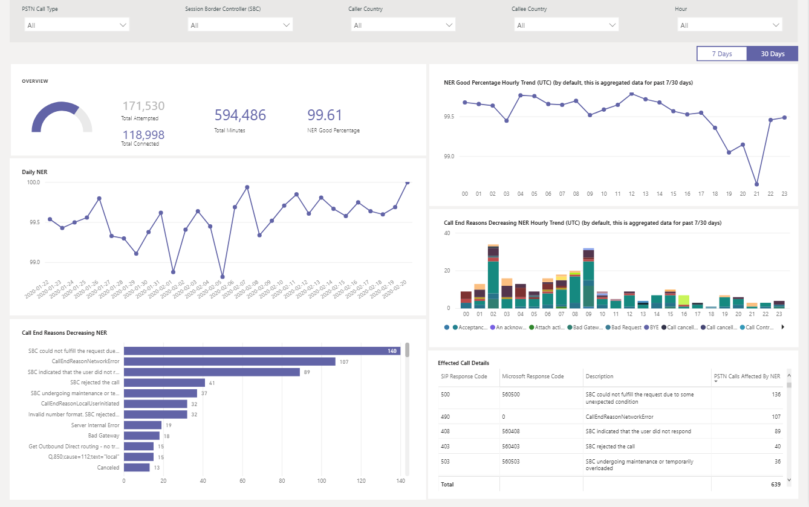

# Usar el informe de enrutamiento directo RTC de CQD

Como novedad en marzo de 2020, hemos agregado un informe de enrutamiento directo RTC (CQD) del Panel de calidad de llamadas (CQD) de Microsoft Teams a nuestras plantillas de consulta de Power BI descargables para [CQD.](https://github.com/MicrosoftDocs/OfficeDocs-SkypeForBusiness/blob/live/Teams/downloads/CQD-Power-BI-query-templates.zip?raw=true) 

El informe de enrutamiento directo RTC CQD (CQD RTC Direct Routing Report.pbit) le ayuda a comprender los patrones de uso y la calidad de los servicios RTC. Use este informe para supervisar el uso del servicio, información sobre el controlador de borde de sesión (SBC), el servicio de telefonía, los parámetros de red y los detalles de la relación de eficacia de red. Esta información puede ayudarle a identificar problemas, incluido el motivo de las llamadas que se han eliminado. Por ejemplo, podrá ver cuándo baja el volumen o cuántas llamadas se ven afectadas y por qué motivo.

El informe de enrutamiento directo RTC de CQD tiene cuatro secciones:

  - [Información general sobre RTC](#pstn-overview)

  - [Detalles del servicio](#service-details)

  - [Relación de eficacia de red](#network-effectiveness-ratio)

  - [Parámetros de red](#network-parameters)

## Resaltados

1. Analizar por tipo de llamada, SBC, autor de la llamada y país de destinatario

   El informe enrutamiento directo RTC CQD agrega métricas de confiabilidad y uso para todos los SBC del inquilino durante los últimos 7, 30 o 180 días (6 meses). Puede analizar datos por tipo de llamada, SBC, autor de la llamada y país de destinatario. Si está interesado en un determinado SBC o país, podrá identificar los cambios en las tendencias en el intervalo de tiempo seleccionado.
   :::image type="content" source="media/CQD-PSTN-report8.png" alt-text="Captura de pantalla de los filtros disponibles en el informe de enrutamiento directo RTC CQD":::
   
2. Control de tendencias

    El análisis de tendencias es esencial al intentar comprender el uso y la confiabilidad del servicio. Las tendencias por horas proporcionan un vistazo al rendimiento diario, lo que ayuda a identificar incidentes en tiempo real. Las tendencias diarias le permiten ver el estado del servicio desde una perspectiva a largo plazo. Es importante poder cambiar entre esos dos modos con la granularidad de datos adecuada. El informe enrutamiento directo RTC de CQD proporciona información general sobre tendencias de 6 meses, tendencias diarias de 7 y 30 días y tendencias por hora para que pueda analizar el rendimiento en cada nivel.
    :::image type="content" source="media/CQD-PSTN-report9.png" alt-text="Captura de pantalla de los gráficos de tendencias en el informe de enrutamiento directo RTC CQD":::

3. Explorar en profundidad hasta SBC o nivel de usuario

   Hemos ido creando capacidades de obtención de detalles en muchas categorías de datos en CQD, lo que le permite comprender rápidamente el uso o la distribución de confiabilidad a nivel de SBC o usuario. Al usar la exploración en profundidad, puede ver rápidamente los problemas de puntos de vista y comprender el impacto real de los usuarios. El informe enrutamiento directo RTC de CQD incluye información detallada sobre las métricas Detalle del servicio y Relación de eficacia de red. Haga clic en el punto de datos en el que está interesado para explorar los detalles de SBC o de nivel de usuario.
   :::image type="content" source="media/CQD-PSTN-report10.png" alt-text="Captura de pantalla que muestra la capacidad de obtención de detalles en un punto de datos":::

## Información general sobre RTC

El informe de enrutamiento directo RTC de CQD proporciona la siguiente información relacionada con el estado general del servicio durante los últimos 180 días.

Por ejemplo, si está interesado en el uso general y el estado de todas las llamadas entrantes que pasan por SBC abc.bca.adatum.biz ee. UU. como país interno:

| **Llamar** | **Descripción**                                                                                                                                                 |
| ------------ | --------------------------------------------------------------------------------------------------------------------------------------------------------------- |
| 1            | Puede usar los filtros de la parte superior para explorar en profundidad y seleccionar ByotIn como tipo de llamada, abc.bca.contoso.com como controlador de panel de sesión y EE. UU. como país interno. |
| 2            | Tendencia de uso de los últimos 180 días. Puede encontrar el informe de detalles de uso en la página Detalles del servicio.                                                                     |
| 3            | Post Dial Delay, Latency, Jitter, and Packet Loss trend for the past 180 days. Puede encontrar un informe detallado en la página Parámetros de red.                           |
| 4            | Tendencia de llamadas simultáneas y usuarios activos diarios de los últimos 180 días. Este gráfico puede ayudarle a comprender el volumen máximo del servicio.                            |
| 5            | El motivo de finalización de la llamada superior afectó a la calidad del servicio durante los últimos 180 días. Puede encontrar detalles del estado del servicio en la página Relación eficaz de red (NER).                    |

## Detalles del servicio

Esta página proporciona tendencias de uso del servicio por día y un desglose de los comentarios de los usuarios por geográfica.

  - **Total de llamadas de intento :** Total de llamadas tentativa en ese intervalo de tiempo, incluidas las llamadas correctas y las fallidas

  - **Total de llamadas conectadas:** Total de llamadas conectadas en ese intervalo de tiempo

  - **Minutos totales:** Uso total de minutos en ese intervalo de tiempo

  - **Usuarios activos diarios(DAU) –** Recuento de usuarios activos diarios que realizaron al menos una llamada conectada ese día

  - **Llamadas simultáneas:** Máximo de llamadas activas simultáneas en un minuto

  - **Comentarios de los usuarios:** La puntuación "Calificar mi llamada" proviene del usuario. 3-5 se considera una buena llamada. 1-2 se considera una mala llamada.

Por ejemplo:

1.  Si ve que la duración media de la llamada disminuye a 0 a las 02/14/2020, primero puede comprobar si el volumen de llamada tiene un aspecto normal y ver si hay una gran discrepancia entre las llamadas totales de conexión y las llamadas de intento total. A continuación, vaya a la página Relación de eficacia de red para invertir en los motivos de error de llamada.

2.  Si ve un aumento de puntos rojos en el mapa de comentarios de los usuarios, puede ir a la página Relación de eficacia de red y a Parámetro de red para ver si hay alguna anomalía y podría aumentar un vale con MS Service Desk.

## Relación de eficacia de red

Esta es la misma métrica que aparece en el panel Estado general. Puede comprobar el número NER por hora con el detalle de las llamadas afectadas para las dos direcciones de llamada (entrantes y salientes) en la relación de efectividad de la red por hora y en el gráfico de motivos de finalización de llamadas que se muestra a continuación.

  - **NER:** la capacidad (%) de una red para entregar llamadas midiendo el número de llamadas enviadas frente al número de llamadas entregadas a un destinatario.

  - **Código de respuesta SIP:** un código de respuesta entero de tres dígitos muestra el estado de la llamada.

  - **Código de respuesta de Microsoft:** un código de respuesta enviado desde el componente de Microsoft.

  - **Descripción:** la fase de motivo que corresponde al código de respuesta SIP y al código de respuesta de Microsoft.

  - **Número de llamadas afectadas:** el número total de llamadas se ha visto afectada durante el intervalo de tiempo seleccionado.

> 
> 
Por ejemplo:

Si el 02/05/2020 del 02/05/2020, puede hacer clic en la fecha y otros gráficos se acercarán a esa fecha específica.

En la Tendencia buena por hora porcentual de NER, puede encontrar que la caída se produce alrededor de las 21:00. A continuación, haga clic de nuevo para acercar a la hora 21 y compruebe Detalles de la llamada efectiva para ver cuántas llamadas fallaron en esa hora y cuáles son los motivos de finalización de la llamada. Puede empezar con la grabación con problemas personales en cualquier problema de SBC o informar a Service Desk si el problema no está relacionado con SBC.

## Parámetros de red

Todos los parámetros de red se miden desde la interfaz de enrutamiento directo al controlador de borde de sesión. Para obtener información sobre los valores recomendados, vea Preparar la red de su organización para [Microsoft Teams](prepare-network.md)y consulte los valores recomendados de Cliente perimetral a Microsoft Edge.

  - **Vibración:** es la medida de milisegundos de variación en el tiempo de retraso de propagación de red que se calcula entre dos puntos de conexión mediante RTCP (el protocolo de control RTP).

  - **Pérdida de paquetes:** es una medida de paquete que no ha podido llegar; se calcula entre dos puntos de conexión.

  - **Latencia:** (también conocido como tiempo de ida y vuelta) es el tiempo que se tarda en enviar una señal más el tiempo que tarda en recibirse la confirmación de esa señal. Este retraso de tiempo consiste en los tiempos de propagación entre los dos puntos de una señal.

> 

Por ejemplo:

Si ve un pico en cualquiera de los cuatro gráficos (Latencia, Vibración, Tasa de pérdida de paquetes, Retraso de marcado posterior) para una fecha específica, por ejemplo, Latencia el 14/02/2020, haga clic en el punto de fecha. Y el gráfico de tendencia por hora en la parte inferior se actualizará para mostrar el número por hora. Puede comprobar los SBC o aumentar un vale con MS Service Desk.

## Temas relacionados

[Usar Power BI para analizar datos CQD para Microsoft Teams](CQD-PSTN-report.md)

[Solución de problemas de Teams](/MicrosoftTeams/troubleshoot/teams)