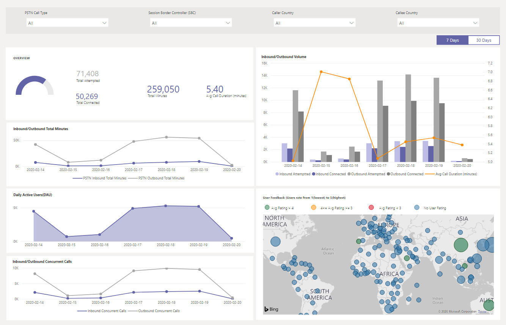

# Usar el informe de enrutamiento directo RTC de CQD

Novedades de marzo de 2020 hemos agregado un informe de enrutamiento directo de la RTC de CQD a nuestras [plantillas de consultas descargables de Power BI para el CQD](https://github.com/MicrosoftDocs/OfficeDocs-SkypeForBusiness/blob/live/Teams/downloads/CQD-Power-BI-query-templates.zip?raw=true). 

El informe de enrutamiento directo de la RTC de CQD ayuda a los clientes a comprender los patrones de uso y la calidad de sus servicios de RTC monitoran información sobre su SBC, el servicio de telefonía, los parámetros de red y la relación de la efectividad de la red y el uso de la Service. Esta información puede ayudarte a identificar los problemas, incluido el motivo de las llamadas interrumpidas. Por ejemplo, podrá saber cuándo disminuye el volumen, cuántas llamadas se verán afectadas por el motivo.

El informe de enrutamiento directo RTC de CQD tiene cuatro secciones:

  - [Información general de RTC](#pstn-overview)

  - [Detalles del servicio](#service-details)

  - [Relación de efectividad de la red](#network-effectiveness-ratio)

  - [Parámetros de red](#network-parameters)

## Información general de RTC

El informe de enrutamiento directo RTC de CQD proporciona la siguiente información relacionada con el estado general del servicio durante los últimos 180 días.

Por ejemplo, si estás interesado en el uso general y en la salud de todas las llamadas entrantes pasando por SBC abc.bca.adatum.biz con nosotros como país interno:

| **Llamar** | **Descripción**                                                                                                                                                 |
| ------------ | --------------------------------------------------------------------------------------------------------------------------------------------------------------- |
| 1            | Puede usar los filtros de la parte superior para explorar en profundidad y seleccionar ByotIn como tipo de llamada, abc.bca.contoso.com como controlador de panel de sesión y nosotros como país interno. |
| 1            | Tendencia de uso durante los últimos 180 días. Puede encontrar el informe de detalles de uso en la página Detalles del servicio.                                                                     |
| 3            | Tendencia de posmarcado, latencia, vibración y pérdida de paquetes durante los últimos 180 días. Puede encontrar informes detallados en la página parámetros de red.                           |
| 4            | Llamada simultánea y tendencia de usuario activo diario durante los últimos 180 días. Este gráfico puede ayudarte a comprender el volumen máximo del servicio.                            |
| 5            | Motivo principal de finalización de la llamada la calidad de servicio afectada durante los últimos 180 días. Puede encontrar información sobre el estado del servicio en la página proporción de efectividad de red (NER).                    |

## Detalles del servicio

Esta página proporciona las tendencias de uso del servicio por día y el desglose de comentarios del usuario en forma geográfica.

  - **Llamadas totales:** Total de llamadas realizadas en ese intervalo de tiempo, incluidas las llamadas correctas y erróneas

  - **Total de llamadas conectadas:** Total de llamadas conectadas en ese intervalo de tiempo

  - **Minutos totales:** Uso total de minutos en ese intervalo de tiempo

  - **Usuarios activos diarios (DAU):** Recuento de usuarios activos diarios que hicieron al menos una llamada conectada en ese día

  - **Llamadas simultáneas:** Máximo de llamadas simultáneas activas en un minuto

  - **Comentarios del usuario:** La puntuación de "calificar la llamada" viene del usuario. 3-5 se considera una buena llamada. 1-2 se considera una llamada incorrecta.

Por ejemplo:

1.  Si ve que la duración media de las llamadas desciende a 0 en 02/14/2020, primero puede comprobar si el volumen de la llamada es normal y ver si hay una gran diferencia entre las llamadas de conexión totales y las llamadas de intento total. A continuación, vaya a la página relación de eficacia de red para invertir en las razones de error de llamada.

2.  Si ve el aumento de los puntos rojos en el mapa de comentarios del usuario, puede ir a la página relación efectividad de red y el parámetro red para ver si hay anomalías y puede generar un vale con el servicio de asistencia al cliente de MS.

## Relación de efectividad de la red

Esta es la misma métrica que aparece en el panel General de estado. Puedes comprobar el número de NER por hora con detalles de llamadas afectadas para ambas direcciones de llamadas (entrante o saliente) en relación con la proporción de eficacia de la red por hora y en el gráfico de motivos de finalización de llamadas que figura a continuación.

  - **Ner** : la capacidad (%) de una red para hacer llamadas midiendo el número de llamadas enviadas en comparación con el número de llamadas enviadas a un destinatario.

  - **Código de respuesta SIP**: el código de respuesta entero de tres dígitos muestra el estado de la llamada.

  - **Código de respuesta de Microsoft**: un código de respuesta enviado desde un componente de Microsoft.

  - **Descripción** : la fase de razón que corresponde al código de respuesta SIP y al código de respuesta de Microsoft.

  - **Número de llamadas afectadas** : el número total de llamadas se ha visto afectado durante el intervalo de tiempo seleccionado.

> 
> 
Por ejemplo:

Si el NER diario tiene una DIP en 02/05/2020, puede hacer clic en la fecha y otros gráficos le aplicarán un zoom para esa fecha específica.

Desde la tendencia por hora del NER en buen lugar, puede encontrar la DIP en aproximadamente 21:00. A continuación, haga clic de nuevo para acercar la hora 21 y comprobar los detalles de la llamada para ver cuántas llamadas han fallado en esa hora y cuáles son los motivos de finalización de la llamada. Puede comenzar con la solución de problemas con cualquier problema de SBC o enviar un informe a un servicio de asistencia al cliente si el problema no está relacionado con SBC.

## Parámetros de red

Todos los parámetros de red se miden desde la interfaz de enrutamiento directo hasta el controlador de borde de la sesión. Para obtener más información sobre los valores recomendados, consulte [preparar la red de su organización para Microsoft Teams](prepare-network.md)y mire los valores recomendados de borde del cliente a Microsoft Edge.

  - **Vibración** : es la medición de milisegundos de variación en el tiempo de retraso de propagación de red calculado entre dos puntos de conexión con RTCP (el protocolo de control RTP).

  - **Pérdida de paquetes** : es una medida de paquete que no pudo llegar. se calcula entre dos puntos finales.

  - **Latencia** : (también conocido como tiempo de ida y vuelta) es la cantidad de tiempo que se tarda en enviar una señal más el tiempo que tarda en recibirse el reconocimiento de esa señal. Este tiempo de retardo consiste en los tiempos de propagación entre los dos puntos de una señal.

> 

Por ejemplo:

Si ve un pico en cualquiera de los cuatro gráficos (latencia, vibración, tasa de pérdida de paquetes, retraso de la publicación de marcado) para una fecha específica, por ejemplo, latencia en 02/14/2020, haga clic en el punto de fecha. Y el gráfico de tendencia por hora en la parte inferior se actualizará para mostrar el número por hora. Puede comprobar el SBCs o provocar un vale con el servicio de asistencia al cliente de MS.

## Temas relacionados

[Usar Power BI para analizar los datos del CQD para Microsoft Teams](CQD-PSTN-report.md)