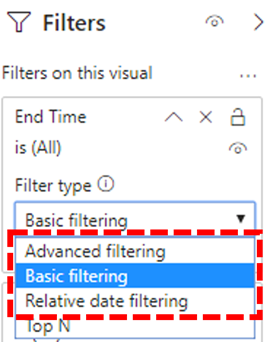

# Instalar el conector de Power BI para usar plantillas de consulta de CQD

Antes de usar las plantillas de consulta de Power BI (archivos PBIX) en el panel de calidad de llamadas de Microsoft Teams (CQD), tendrá que instalar el conector de Power BI para Microsoft CQD usando el archivo *MicrosoftCallQuality. PQx* incluido en la [descarga](https://github.com/MicrosoftDocs/OfficeDocs-SkypeForBusiness/blob/live/Teams/downloads/CQD-Power-BI-query-templates.zip?raw=true).

Leer [use Power BI para analizar los datos del CQD de los equipos](CQD-Power-BI-query-templates.md) para obtener información sobre estas plantillas.

Asegúrese de tener el rol de [acceso de CQD](https://docs.microsoft.com/microsoftteams/turning-on-and-using-call-quality-dashboard#assign-roles-for-accessing-cqd) adecuado para obtener acceso a los informes de Power BI.

## Instalación

El proceso de instalación de un conector personalizado y de ajuste de la seguridad para habilitar el uso del conector se describe detalladamente en la [documentación de Power BI](https://docs.microsoft.com/power-bi/desktop-connector-extensibility). Por razones de simplicidad, aquí tiene una explicación rápida:

1. Compruebe si su equipo ya tiene una carpeta de * \[ \] \\ \\ conectores personalizados de Power BI Desktop*de los documentos   . En caso contrario, cree esta carpeta. 1

2. Descargue el archivo de conector (o un archivo * \* . MEZ* o * \* . PQx* ) y colóquelo en el directorio de *conectores personalizados* .

3. **Si el archivo del conector es un archivo * \* . MEZ* ,** también tendrá que ajustar la configuración de seguridad tal como se describe en la [documentación de configuración del conector personalizado](https://docs.microsoft.com/power-bi/desktop-connector-extensibility#data-extension-security).

Si se lanza una nueva versión de este conector de Power BI para Microsoft Teams, simplemente reemplace el archivo del conector antiguo en el directorio de *conectores personalizados* con el nuevo archivo.

## Configuración

Para poder crear un informe y ejecutar consultas, primero deberá conectarse al origen de datos del CQD. Siga los pasos que se indican a continuación para conectarse:

1. En la pestaña Inicio de Power BI Desktop, haga clic en *obtener datos*.

    

2. En este punto, aparecerá la ventana *obtener datos* . Vaya a *servicios en línea*y, a continuación, seleccione *calidad de llamada de Microsoft (beta)* y pulse *conectar*.

    

3. Se le pedirá que inicie sesión a continuación. Use las mismas credenciales que usa para el CQD. 2

4. El siguiente mensaje le dará la opción de dos *modos de conectividad de datos*. Seleccione *DirectQuery* y pulse *Aceptar*.

5. Por último, recibirá un último mensaje que muestra el modelo de datos completo del CQD. No se verán datos en este momento, solo el modelo de datos de CQD. Seleccione *cargar* para completar el proceso de configuración.

6. En este momento, Power BI cargará el modelo de datos en el lado derecho de la ventana. De lo contrario, la página permanecerá en blanco y no se cargará ninguna consulta de forma predeterminada. Continúe con la **creación de consultas** a continuación para crear una consulta y devolver datos.

Si alguno de los pasos de este proceso de configuración no se completara por completo, [aquí](https://docs.microsoft.com/power-bi/desktop-quickstart-connect-to-data)encontrará una explicación más detallada del proceso.

## Creación de consultas

Una vez completada la configuración, debe ver los nombres de varios cientos de dimensiones y medidas carga en el panel de *campos* . Construir consultas reales desde aquí es simple, solo tiene que seleccionar las dimensiones y medidas que desee para la consulta y, a continuación, arrastrarlas y colocarlas en la página. A continuación, le mostramos una explicación más detallada, con un sencillo ejemplo:

1. Seleccione la visualización que desea usar en el panel de *visualizaciones* . En la página debe aparecer una versión en blanco de la visualización. Para los fines de este ejemplo, usaremos la visualización de *tabla* .

    

2. Determine qué dimensiones y medidas (indicadas por un símbolo de agregación por su nombre) desea usar para la consulta y, a continuación, selecciónelas manualmente y arrástrelas a la visualización de negro. Como alternativa, arrástrelas en el campo *valores* debajo de las opciones de visualización.

    

    > [!IMPORTANT]
    > El panel de calidad de llamadas requiere una medida para que se ejecute cualquier consulta. Si no se agrega una medida a una consulta, se producirá un error en la consulta.

3. A continuación, seleccione las dimensiones que desee filtrar y arrástrelas a los *filtros de este campo visual* en el panel *filtros* . El conector de Power BI del CQD es compatible actualmente con el *Filtrado básico* (seleccione valores de una lista de valores de dimensión posibles), *filtrado avanzado* (especifique manualmente valores y operandos para filtrar, similar al CQD avanzado) y *filtrado de fecha relativo* (solo disponible para la *hora de finalización* y las dimensiones de la *hora de inicio* ). El CQD no admite el filtrado según *N superior* .

    

4. Por último, seleccione la pestaña *formato* en el panel de *visualizaciones* para formatear y aplicar formato a la consulta.

    > [!NOTE]
    > Las consultas de CQD requieren al menos una medida para poder ejecutarse. Si la consulta no se carga, vuelva a comprobar que ha incluido una medida en la consulta.

## Crear un informe de obtención de detalles

La [obtención de detalles en Power BI](https://docs.microsoft.com/power-bi/desktop-drillthrough) le permite crear informes prioritarios que puede filtrar rápidamente usando los valores de otros informes como contexto. Una vez que sepa cómo crear su primera consulta con el conector de CQD, la creación de una obtención de detalles es aún más sencilla.

1. Cree otra página para el informe prioritario y, a continuación, agregue las consultas a esa página.

2. Seleccione la dimensión que desea usar como filtro de obtención de detalles y arrástrela hasta el campo *obtención de detalles* de en el panel de *visualizaciones* .

    

3. **Eso es todo\!** Cualquier otra consulta en otra página que use esa dimensión puede obtener detalles de esa página, aplicando automáticamente el valor de la dimensión de obtención de detalles como filtro.

    

A diferencia del CQD avanzado, Power BI admite obtención de detalles no secuencial. Siempre que una consulta incluya la dimensión necesaria, puede obtener detalles en cualquier otra página.

### Procedimiento recomendado

Las consultas de los conectores de calidad de llamadas deben diseñarse teniendo en cuenta la funcionalidad de obtención de detalles. En lugar de intentar cargar todos los datos a la vez, y después dividirlos con filtros, comience con consultas más amplias y económicas, y profundice hasta consultas de cardinalidad alta. Por ejemplo, al intentar diagnosticar qué subredes contribuyen a problemas de calidad, es útil identificar primero las regiones y los países que contribuyen al problema, y luego desglosar las subredes de esa región o país. Las plantillas de conector de calidad de llamadas se han diseñado de esta manera para actuar como ejemplo.

## Algunas

A pesar de usar Power BI, no todas las funciones de Power BI son compatibles con el conector CQD, ya sea como resultado de las limitaciones en el modelo de datos CQD o en los conectores DirectQuery en general. La siguiente lista incluye algunas de las limitaciones más destacadas del conector, pero esta lista no debe considerarse exhaustiva:

1. **Columnas calculadas:** Los conectores DirectQuery en general tienen compatibilidad limitada con las columnas calculadas en Power BI. Aunque algunas columnas calculadas pueden funcionar con el conector, se deben considerar excepciones. Como regla general, las columnas calculadas no funcionarán.

2. **Agregaciones:** El modelo de datos del CQD se crea a partir de un modelo de cubo, lo que significa que los agregados ya se admiten en forma de medidas. Intentar agregar manualmente agregaciones a dimensiones diferentes o cambiar el tipo de agregación de una medida no funcionará con el conector y, generalmente, se producirá un error.

3. **Elementos visuales personalizados:** Si bien el conector CQD funciona con un rango de elementos visuales personalizados, no podemos garantizar la compatibilidad con todos los objetos visuales personalizados. Muchos objetos visuales personalizados dependen del uso de las columnas calculadas o los datos importados, ni tampoco compatibles con los conectores DirectQuery.

4. **Hacer referencia a datos almacenados en caché:** Actualmente, Power BI no admite la referencia a datos almacenados en caché de un conector DirectQuery de ninguna manera. Cualquier intento de hacer referencia a los resultados de una consulta tendrá como resultado una nueva consulta.

5. **Filtrado de datos relativo:** Es compatible con el conector CQD, pero solo con las dimensiones hora de *Inicio* y *hora de finalización* . Aunque la dimensión *Date* puede ser la opción obvia para el filtrado de fechas relativo, *Date* no se almacena como un objeto de fecha y hora y, por lo tanto, no admite el filtrado de fechas relativo en Power BI.

6. **Compatibilidad con la nube de la comunidad de administración pública (GCC):** Para los clientes en el entorno GCC, el conector de Power BI del CQD funcionará cuando se use Power BI Desktop. El conector de Power BI del CQD no es compatible actualmente con el servicio Power BI para clientes de GCC.

Ten en cuenta que, aunque el conector está en versión preliminar, no es probable que estas limitaciones cambien con la versión final del conector. La mayoría de estos problemas son restricciones para el diseño del conector DirectQuery en Power BI o fundamental para el diseño del modelo de datos CQD.

## Solución de problemas

### Estoy intentando usar la columna de fecha como una segmentación de datos de fecha. Tan pronto como convierta el tipo de datos de esta columna en fecha, obtengo este error

> **No se pudieron cargar los datos para este visual**: OLE DB o error de ODBC: [expr. error] no se puede doblar la expresión al origen de datos. Prueba una expresión más sencilla.

La segmentación de datos no es compatible con el conector de Power BI. Para especificar un intervalo de fechas, aplique dos filtros al informe, especificando una fecha menor que y mayor que.

Como alternativa, si las fechas que desea ver son recientes, aplique un filtro de fecha relativa para mostrar solo los datos de los últimos N días/semanas/meses.

## Códigos de error

Dado que el conector de Power BI del CQD tiene menos restricciones que la aplicación del explorador en cuanto a los tipos de consultas que puede crear, puede que en ocasiones se produzcan varios errores al crear las consultas. En el caso de que recibas un mensaje de error de tipo "CQDError. RunQuery – error de ejecución de consulta ", consulte la lista siguiente con el número de ErrorType proporcionado para resolver el problema posible con la consulta. Estos son los códigos de tipo de error más comunes que puede encontrar con el conector de Power BI del CQD:

- **ErrorType 1: error en la estructura de la consulta:** Un error de estructura de consulta suele estar provocado por el conector que no puede crear una consulta con formato correcto. Esto sucede con frecuencia cuando se usa una funcionalidad no admitida, como se especifica en las limitaciones anteriores. Asegúrese de que no está usando columnas calculadas o elementos visuales personalizados para esa consulta.

  - **ErrorType 2-error de creación de consulta:** Un error de creación de consulta se debe a que el conector del CQD no puede analizar correctamente la consulta que intenta compilar. Esto sucede con frecuencia cuando se usa una funcionalidad no admitida, como se especifica en las limitaciones anteriores. Asegúrese de que no está usando columnas calculadas o elementos visuales personalizados para esa consulta.

  - **ErrorType 5: tiempo de espera de ejecución:** La consulta ha alcanzado el tiempo de ejecución máximo posible antes de agotar el tiempo de espera. Pruebe a agregar más filtros a la consulta para limitar su alcance. Restringir el rango de datos es a menudo la manera más eficaz de lograrlo.

  - **ErrorType 7: no hay errores de medición:** Las consultas de CQD requieren una medida para poder funcionar. Compruebe que la consulta incluye la medida. Las medidas del conector de CQD se denotan mediante el símbolo de agregación (suma) antes de su nombre.

Si encuentra errores adicionales fuera de este ámbito, notifíquelo al equipo de CQD para que podamos ayudar a solucionar el problema y actualizar la documentación según corresponda.

## Notas al pie

**1** algunos procesos y aplicaciones (por ejemplo, OneDrive) pueden hacer que cambie la carpeta raíz de documentos; Asegúrese de que el directorio de los * \\ conectores personalizados de Power BI Desktop* se coloca dentro de la carpeta raíz de documentos de la carpeta raíz.

**2** las credenciales de inicio de sesión que usa para el CQD *no* necesitan ser las mismas que usas para iniciar sesión en la aplicación de escritorio de Power BI en sí.

## Preguntas más frecuentes

### ¿Cuándo se actualizará el conector de Power BI desde el estado "beta"?

A pesar de la etiqueta beta, el conector de calidad de la llamada para Power BI es la versión de lanzamiento del conector y ha sido oficialmente firmado por el equipo de Power BI para reflejarlo. El proceso de certificación para quitar esa etiqueta beta es muy amplio y requiere un compromiso del equipo de Power BI para ofrecer también compatibilidad directa con el conector. Debido a restricciones de tiempo, el equipo de Power BI actualmente no puede proporcionar ese soporte ni certificación más amplia, pero todavía está preparado para atestiguar la seguridad, la autenticidad y la funcionalidad general del conector de calidad de llamadas de Microsoft.

### ¿Por qué el conector parece más lento en comparación con el CQD avanzado en el explorador? ¿Qué puedo hacer para mejorar el rendimiento?

El rendimiento de las consultas para las distintas plantillas es realmente el mismo en el explorador y en el conector.  Al igual que cualquier otra aplicación independiente, Power BI agrega su autenticación y el tiempo de procesamiento a nuestro rendimiento. Además, la diferencia reside en la cantidad de consultas simultáneas que se están ejecutando. Debido a que la versión en el explorador de CQD tenía opciones de visualización con menos desarrollo y densidad de información, la mayoría de los informes se limitaban a cargar las consultas de 2-3 a la vez. Por otro lado, las plantillas de conector a menudo muestran 20 + consultas simultáneas. Si desea crear informes que sean tan receptivos como los más antiguos, pruebe a crear informes que no contengan más de 2-3 consultas por pestaña.

Para obtener más información, vea los artículos siguientes:

- [Guía de optimización de Power BI](https://docs.microsoft.com/power-bi/guidance/power-bi-optimization)
- [Orientación del modelo DirectQuery](https://docs.microsoft.com/power-bi/guidance/directquery-model-guidance)

### Me encontramos en el límite de la fila 10.000 al ejecutar consultas. ¿Cómo puedo hacer que el conector devuelva más de 10.000 filas

El límite de la 10.000 se especifica realmente en el extremo de la API, y está diseñado para ayudar a mejorar significativamente el rendimiento y reducir el riesgo de errores de ejecución de consultas producidos por condiciones de memoria insuficiente.

En lugar de intentar aumentar el recuento de filas de resultados, es mejor reestructurar los informes de acuerdo con los procedimientos recomendados de conector. Las plantillas que hemos incluido están diseñadas para demostrar estos procedimientos recomendados. Siempre que sea posible, empiece por mirar sus KPI con dimensiones más amplias y menos cardinales, como mes, año, fecha, región, país, etc. Desde allí, puede profundizar en las dimensiones de cardinalidad cada vez más altas. Los informes de asistencia y ubicación mejorada proporcionan buenos ejemplos de este flujo de trabajo detallado.

## Temas relacionados

[Usar Power BI para analizar los datos del CQD de los equipos](CQD-Power-BI-query-templates.md)
