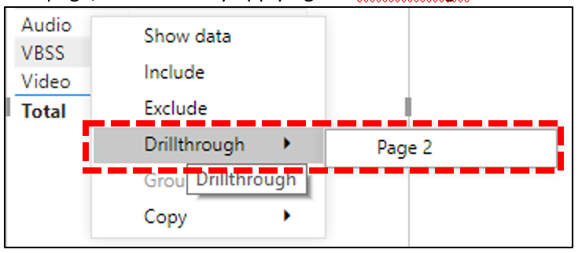

# Instalar el conector de Power BI para usar plantillas de consulta de CQDInstall Power BI Connector to use CQD query templates

Antes de poder usar las plantillas de consulta de Power BI para el CQD (archivos PBIX), tendrá que instalar el conector de Power BI para Microsoft CQD usando el archivo *MicrosoftCallQuality. PQx* incluido en la [descarga](https://github.com/MicrosoftDocs/OfficeDocs-SkypeForBusiness/blob/live/Teams/downloads/CQD-Power-BI-query-templates.zip?raw=true).Before you can use the Power BI query templates for CQD (PBIX files), you'll need to install the Power BI Connector for Microsoft CQD, using the *MicrosoftCallQuality.pqx* file included in the [download](https://github.com/MicrosoftDocs/OfficeDocs-SkypeForBusiness/blob/live/Teams/downloads/CQD-Power-BI-query-templates.zip?raw=true). 

Leer [use Power BI para analizar los datos del CQD de los equipos](CQD-Power-BI-query-templates.md) para obtener información sobre estas plantillas.Read [Use Power BI to analyze CQD data for Teams](CQD-Power-BI-query-templates.md) to learn about these templates.

## InstalaciónInstallation

El proceso de instalación de un conector personalizado y de ajuste de la seguridad para habilitar el uso del conector se describe detalladamente en la [documentación de Power BI](https://docs.microsoft.com/power-bi/desktop-connector-extensibility).The process for installing a custom connector and adjusting security to enable use of the connector is described in detail in the [Power BI documentation](https://docs.microsoft.com/power-bi/desktop-connector-extensibility). Por razones de simplicidad, aquí tiene una explicación rápida:For the sake of simplicity, here's a quick explanation:

1.  Compruebe si su equipo ya tiene una carpeta de \* \[conectores\]\\\\* personalizados de Power BI Desktop de los documentos.Check to see if your computer already has a *\[Documents\]\\Power BI Desktop\\Custom Connectors* folder. En caso contrario, cree esta carpeta. 1If not, create this folder.1

2.  Descargue el archivo de conector (o un \* \*archivo. MEZ\* o \* \*. PQx\* ) y colóquelo en el directorio de *conectores personalizados* .Download the connector file (either a *\*.mez* or *\*.pqx* file) and place it in the *Custom Connectors* directory.

3.  **Si el archivo del conector es \* \*un archivo. MEZ* ,*\* también tendrá que ajustar la configuración de seguridad tal como se describe en la [documentación de configuración del conector personalizado](https://docs.microsoft.com/power-bi/desktop-connector-extensibility#data-extension-security).**If the connector file is a *\*.mez* file,** you will also need to adjust your security settings as described in the [custom connector setup documentation](https://docs.microsoft.com/power-bi/desktop-connector-extensibility#data-extension-security).

Si se lanza una nueva versión de este conector de Power BI para Microsoft Teams, simplemente reemplace el archivo del conector antiguo en el directorio de *conectores personalizados* con el nuevo archivo.If a new version of this Power BI Connector for Microsoft Teams is released, simply replace the old connector file in the *Custom Connectors* directory with the new file.

## ConfiguraciónSetup

Para poder crear un informe y ejecutar consultas, primero deberá conectarse al origen de datos del CQD.In order to build a report and run queries, you will first need to connect to the CQD data source. Siga los pasos que se indican a continuación para conectarse:Follow the steps below in order to connect:

1.  En la pestaña Inicio de Power BI Desktop, haga clic en *obtener datos*.In the Home tab of Power BI Desktop, click on *Get Data*.

    

2.  En este punto, aparecerá la ventana *obtener datos* .The *Get Data* window should appear at this point. Vaya a *servicios en línea*y, a continuación, seleccione *calidad de llamada de Microsoft (beta)* y pulse *conectar*.Navigate to *Online Services*, then select *Microsoft Call Quality (Beta)* and hit *Connect*.

    

3.  Se le pedirá que inicie sesión a continuación.You will be prompted to login next. Use las mismas credenciales que usa para el CQD. 2Use the same credentials that you use for CQD.2

4.  El siguiente mensaje le dará la opción de dos *modos de conectividad de datos*.The next prompt will give you the option between two *Data Connectivity modes*. Seleccione *DirectQuery* y pulse *Aceptar*.Select *DirectQuery* and hit *OK*.

5.  Por último, recibirá un último mensaje que muestra el modelo de datos completo del CQD.Finally, you will be given a final prompt showing you the entire data model for CQD. No se verán datos en este momento, solo el modelo de datos de CQD.No data will be visible at this point, only the data model for CQD. Seleccione *cargar* para completar el proceso de configuración.Select *Load* to complete the setup process.

6.  En este momento, Power BI cargará el modelo de datos en el lado derecho de la ventana.At this point, Power BI will load the data model onto the right side of the window. De lo contrario, la página permanecerá en blanco y no se cargará ninguna consulta de forma predeterminada.The page will remain otherwise blank, and no queries will be loaded by default. Continúe con la **creación de consultas** a continuación para crear una consulta y devolver datos.Proceed to **Building Queries** below in order to build a query and return data.

Si alguno de los pasos de este proceso de configuración no se completara por completo, [aquí](https://docs.microsoft.com/power-bi/desktop-quickstart-connect-to-data)encontrará una explicación más detallada del proceso.If any of the steps during this setup process were not completely clear, a more detailed explanation of the process can be found [here](https://docs.microsoft.com/power-bi/desktop-quickstart-connect-to-data).

## Creación de consultasBuilding Queries

Una vez completada la configuración, debe ver los nombres de varios cientos de dimensiones y medidas carga en el panel de *campos* .Once setup is complete, you should see the names of several hundred dimensions and measures load in the *Fields* pane. Construir consultas reales desde aquí es simple, solo tiene que seleccionar las dimensiones y medidas que desee para la consulta y, a continuación, arrastrarlas y colocarlas en la página.Constructing actual queries from here is simple, just select the dimensions and measures you want for your query, then drag and drop them onto the page. A continuación, le mostramos una explicación más detallada, con un sencillo ejemplo:Here's a more detailed explanation, with a simple example:

1.  Seleccione la visualización que desea usar en el panel de *visualizaciones* .Select the visualization you want to use from the *Visualizations* pane. En la página debe aparecer una versión en blanco de la visualización.A blank version of that visualization should appear on the page. Para los fines de este ejemplo, usaremos la visualización de *tabla* .For the purposes of this example, we will be using the *Table* visualization.

    

2.  Determine qué dimensiones y medidas (indicadas por un símbolo de agregación por su nombre) desea usar para la consulta y, a continuación, selecciónelas manualmente y arrástrelas a la visualización de negro.Determine which dimensions and measures (denoted by an aggregation symbol by their name) you wish to use for your query, then manually select them and drag them onto the black visualization. Como alternativa, arrástrelas en el campo *valores* debajo de las opciones de visualización.Alternately, drag them onto the *Values* field beneath the visualization options.

    

    > [!IMPORTANT] 
    > El panel de calidad de llamadas requiere una medida para que se ejecute cualquier consulta.Call Quality Dashboard requires a measure for any query to run. Si no se agrega una medida a una consulta, se producirá un error en la consulta.Failure to add a measure to a query will cause that query to fail.

3.  A continuación, seleccione las dimensiones que desee filtrar y arrástrelas a los *filtros de este campo visual* en el panel *filtros* .Next, select any dimensions you want to filter on and drag them to the *Filters on this visual* field in the *Filters* pane. El conector de Power BI del CQD es compatible actualmente con el *Filtrado básico* (seleccione valores de una lista de valores de dimensión posibles), *filtrado avanzado* (especifique manualmente valores y operandos para filtrar, similar al CQD avanzado) y *filtrado de fecha relativo* (solo disponible para la *hora de finalización* y las dimensiones de la *hora de inicio* ).The CQD Power BI Connector currently supports *Basic filtering* (select values from a list of possible dimension values), *Advanced filtering* (manually specify values and operands to filter on, similar to Advanced CQD), and *Relative date filtering* (only available for the *End Time* and *Start Time* dimensions). El CQD no admite el filtrado según *N superior* .Filtering according to *Top N* is not supported by CQD.

    

4.  Por último, seleccione la pestaña *formato* en el panel de *visualizaciones* para formatear y aplicar formato a la consulta.Finally, select the *Format* tab within the *Visualizations* pane to style and format your query.

    > [!NOTE]
    > Las consultas de CQD requieren al menos una medida para poder ejecutarse.CQD queries require at least one measure in order to run. Si la consulta no se carga, vuelva a comprobar que ha incluido una medida en la consulta.If your query does not load, double check that you have included a measure in the query.

## Crear un informe de obtención de detallesCreating a Drillthrough Report

La [obtención de detalles en Power BI](https://docs.microsoft.com/power-bi/desktop-drillthrough) le permite crear informes prioritarios que puede filtrar rápidamente usando los valores de otros informes como contexto.[Drillthrough in Power BI](https://docs.microsoft.com/power-bi/desktop-drillthrough) allows you to create focused reports that you can quickly filter using the values of other reports as context. Una vez que sepa cómo crear su primera consulta con el conector de CQD, la creación de una obtención de detalles es aún más sencilla.Once you know how to create your first query with the CQD Connector, creating a drillthrough is even simpler.

1.  Cree otra página para el informe prioritario y, a continuación, agregue las consultas a esa página.Create another page for the focused report, and then add your queries to that page.

2.  Seleccione la dimensión que desea usar como filtro de obtención de detalles y arrástrela hasta el campo *obtención de detalles* de en el panel de *visualizaciones* .Select the dimension you want to use as a drillthrough filter and drag them onto the *Drillthrough* field under on the *Visualizations* pane.

    

3.  **Eso es todo\!****That's it\!** Cualquier otra consulta en otra página que use esa dimensión puede obtener detalles de esa página, aplicando automáticamente el valor de la dimensión de obtención de detalles como filtro.Any other query on another page that uses that dimension can now drillthrough to that page, automatically applying the drillthrough dimension's value as a filter.

    

A diferencia del CQD avanzado, Power BI admite obtención de detalles no secuencial.Unlike Advanced CQD, Power BI supports non-sequential drillthrough. Siempre que una consulta incluya la dimensión necesaria, puede obtener detalles en cualquier otra página.So long as a query includes the necessary dimension, it can drillthrough to any other page.

### Procedimiento recomendadoBest practice

Las consultas de los conectores de calidad de llamadas deben diseñarse teniendo en cuenta la funcionalidad de obtención de detalles.Call Quality connector queries should be designed with drillthrough functionality in mind. En lugar de intentar cargar todos los datos a la vez, y después dividirlos con filtros, comience con consultas más amplias y económicas, y profundice hasta consultas de cardinalidad alta.Instead of trying to load all the data at once, and then slicing down with filters, start with broader, low-cardinality queries and drill down to high-cardinality queries. Por ejemplo, al intentar diagnosticar qué subredes contribuyen a problemas de calidad, es útil identificar primero las regiones y los países que contribuyen al problema, y luego desglosar las subredes de esa región o país.For instance, when attempting to diagnose which subnets contribute most to quality issues, it's helpful to first identify those regions and countries which contribute to the problem, then drill down to the subnets in that region or country. Las plantillas de conector de calidad de llamadas se han diseñado de esta manera para actuar como ejemplo.The Call Quality connector templates have been designed in this manner in order to act as an example.

## AlgunasLimitations

A pesar de usar Power BI, no todas las funciones de Power BI son compatibles con el conector CQD, ya sea como resultado de las limitaciones en el modelo de datos CQD o en los conectores DirectQuery en general.Despite making use of Power BI, not all Power BI functionality is support by the CQD Connector, either as a result of limitations on CQD data model or on DirectQuery connectors in general. La siguiente lista incluye algunas de las limitaciones más destacadas del conector, pero esta lista no debe considerarse exhaustiva:The list below notes some of the Connector's more noteworthy limitations, but this list should not be considered exhaustive:

1.  **Columnas calculadas:** Los conectores DirectQuery en general tienen compatibilidad limitada con las columnas calculadas en Power BI.**Calculated Columns –** DirectQuery connectors in general have limited support for calculated columns in Power BI. Aunque algunas columnas calculadas pueden funcionar con el conector, se deben considerar excepciones.While some calculated columns may work with the Connector, these should be considered exceptions. Como regla general, las columnas calculadas no funcionarán.As a general rule, calculated columns will not function.

2.  **Agregaciones:** El modelo de datos del CQD se crea a partir de un modelo de cubo, lo que significa que los agregados ya se admiten en forma de medidas.**Aggregations –** The CQD data model is built on a cube model, meaning that aggregations are already supported in the form of measures. Intentar agregar manualmente agregaciones a dimensiones diferentes o cambiar el tipo de agregación de una medida no funcionará con el conector y, generalmente, se producirá un error.Attempting to manually add aggregations to different dimensions or changing the aggregation type of a measure will not work with the Connector, and it will generally result in an error.

3.  **Elementos visuales personalizados:** Si bien el conector CQD funciona con un rango de elementos visuales personalizados, no podemos garantizar la compatibilidad con todos los objetos visuales personalizados.**Custom Visuals –** While the CQD Connector does work with a range of custom visuals, we are unable to guarantee compatibility with all custom visuals. Muchos objetos visuales personalizados dependen del uso de las columnas calculadas o los datos importados, ni tampoco compatibles con los conectores DirectQuery.Many custom visuals rely on the use of calculated columns or imported data, neither or which are supported by DirectQuery connectors.

4.  **Hacer referencia a datos almacenados en caché:** Actualmente, Power BI no admite la referencia a datos almacenados en caché de un conector DirectQuery de ninguna manera.**Referencing Cached Data –** Power BI currently does not support referencing cached data from a DirectQuery connector in any way. Cualquier intento de hacer referencia a los resultados de una consulta tendrá como resultado una nueva consulta.Any attempt to reference the results of a query will result in a new query. 

5.  **Filtrado de datos relativo:** Es compatible con el conector CQD, pero solo con las dimensiones hora de *Inicio* y *hora de finalización* .**Relative Data Filtering –** Is supported in the CQD Connector, but only with the *Start Time* and *End Time* dimensions. Aunque la dimensión *Date* puede ser la opción obvia para el filtrado de fechas relativo, *Date* no se almacena como un objeto de fecha y hora y, por lo tanto, no admite el filtrado de fechas relativo en Power BI.Although the *Date* dimension may be the obvious choice for relative date filtering, *Date* is not stored as a date time object and thus does not support relative date filtering in Power BI.

Ten en cuenta que, aunque el conector está en versión preliminar, no es probable que estas limitaciones cambien con la versión final del conector.Please note, although the Connector is in preview, these limitations are unlikely to change with the final release of the Connector. La mayoría de estos problemas son restricciones para el diseño del conector DirectQuery en Power BI o fundamental para el diseño del modelo de datos CQD.Most of these issues are either restrictions to DirectQuery connector design in Power BI or fundamental to the design of the CQD data model.

## Solución de problemasTroubleshooting

### Estoy intentando usar la columna de fecha como una segmentación de datos de fecha.I'm trying to use the Date column as a Date slicer. Tan pronto como convierta el tipo de datos de esta columna en fecha, obtengo este error:As soon as I convert the data type of this column to Date, I get this error:

> **No se pudieron cargar los datos para este visual**: OLE DB o error de ODBC: [expr. error] no se puede doblar la expresión al origen de datos.**Couldn't load the data for this visual**: OLE DB or ODBC error: [Expression.Error] We couldn't fold the expression to the data source. Prueba una expresión más sencilla.Please try a simpler expression. 

La segmentación de datos no es compatible con el conector de Power BI.Date slicers aren't supported with the Power BI Connector. Para especificar un intervalo de fechas, aplique dos filtros al informe, especificando una fecha menor que y mayor que.To specify a date range, apply two filters to the report, specifying a less than and greater than date.

Como alternativa, si las fechas que desea ver son recientes, aplique un filtro de fecha relativa para mostrar solo los datos de los últimos N días/semanas/meses.Alternatively, if the dates you want to view are recent, apply a relative date filter to show only data for the last N days/weeks/months.

## Códigos de errorError Codes

Dado que el conector de Power BI del CQD tiene menos restricciones que la aplicación del explorador en cuanto a los tipos de consultas que puede crear, puede que en ocasiones se produzcan varios errores al crear las consultas.Because the CQD Power BI Connector is less restricted than the browser app in terms of kinds of queries you can construct, you may occasionally encounter a number of errors while building your queries. En el caso de que recibas un mensaje de error de tipo "CQDError.In the event that you receive an error message of the type "CQDError. RunQuery – error de ejecución de consulta ", consulte la lista siguiente con el número de ErrorType proporcionado para resolver el problema posible con la consulta.RunQuery – Query Execution Error", reference the list below with the ErrorType number provided in order to troubleshoot the possible issue with the query. Estos son los códigos de tipo de error más comunes que puede encontrar con el conector de Power BI del CQD:The following are the most common Error Type codes you may encounter with the CQD Power BI Connector:

  - **ErrorType 1: error en la estructura de la consulta:** Un error de estructura de consulta suele estar provocado por el conector que no puede crear una consulta con formato correcto.**ErrorType 1 - Query Structure Error:** A query structure error is typically caused by the Connector failing to build a properly formatted query. Esto sucede con frecuencia cuando se usa una funcionalidad no admitida, como se especifica en las limitaciones anteriores.This happens most often when using unsupported functionality, as specified in the Limitations above. Asegúrese de que no está usando columnas calculadas o elementos visuales personalizados para esa consulta.Double check that you are not using any calculated columns or custom visuals for that query.

  - **ErrorType 2-error de creación de consulta:** Un error de creación de consulta se debe a que el conector del CQD no puede analizar correctamente la consulta que intenta compilar.**ErrorType 2 - Query Building Error:** A query building error is caused by the CQD Connector being unable to properly parse the query you are attempting to build. Esto sucede con frecuencia cuando se usa una funcionalidad no admitida, como se especifica en las limitaciones anteriores.This happens most often when using unsupported functionality, as specified in the Limitations above. Asegúrese de que no está usando columnas calculadas o elementos visuales personalizados para esa consulta.Double check that you are not using any calculated columns or custom visuals for that query.

  - **ErrorType 5: tiempo de espera de ejecución:** La consulta ha alcanzado el tiempo de ejecución máximo posible antes de agotar el tiempo de espera. Pruebe a agregar más filtros a la consulta para limitar su alcance.**ErrorType 5 - Execution Timeout:** The query has reached the maximum possible runtime before timing out. Try adding more filters to the query in order to limit its scope. Restringir el rango de datos es a menudo la manera más eficaz de lograrlo.Narrowing the data range is often the most effective way to achieve this.

  - **ErrorType 7: no hay errores de medición:** Las consultas de CQD requieren una medida para poder funcionar.**ErrorType 7 - No Measurements Error:** CQD queries require a measure in order to function. Compruebe que la consulta incluye la medida.Double check that your query includes measure. Las medidas del conector de CQD se denotan mediante el símbolo de agregación (suma) antes de su nombre.Measures in the CQD Connector are denoted by the aggregation (sum) symbol before their name.

Si encuentra errores adicionales fuera de este ámbito, notifíquelo al equipo de CQD para que podamos ayudar a solucionar el problema y actualizar la documentación según corresponda.If you encounter any additional errors outside of this scope, please notify the CQD team so that we can help troubleshoot the issue and update the documentation as appropriate.

## Notas al pieFootnotes

**1** algunos procesos y aplicaciones (por ejemplo, OneDrive) pueden hacer que cambie la carpeta raíz de documentos; Asegúrese de que el directorio de los *conectores personalizados de Power BI Desktop\\* se coloca dentro de la carpeta raíz de documentos de la carpeta raíz.**1** Certain processes and apps (e.g., OneDrive) may cause your Documents root folder to change; make sure that the *Power BI Desktop\\Custom Connectors* directory is placed inside of the current root folder Documents folder.

**2** las credenciales de inicio de sesión que usa para el CQD *no* necesitan ser las mismas que usas para iniciar sesión en la aplicación de escritorio de Power BI en sí.**2** The login credentials you use for CQD *do not* need to be the same credentials you use for logging into the Power BI Desktop app itself.

## Preguntas más frecuentesFrequently asked questions

### ¿Cuándo se actualizará el conector de Power BI a partir del estado "beta"?When will the Power BI Connector be updated from "Beta" status?

A pesar de la etiqueta beta, el conector de calidad de la llamada para Power BI es la versión de lanzamiento del conector y ha sido oficialmente firmado por el equipo de Power BI para reflejarlo.Despite the Beta tag, the Call Quality Connector for Power BI is the release version of the connector and has been officially security signed by the Power BI team to reflect this. El proceso de certificación para quitar esa etiqueta beta es muy amplio y requiere un compromiso del equipo de Power BI para ofrecer también compatibilidad directa con el conector.The certification process to remove that Beta tag is an extensive one and requires a commitment from the Power BI team to provide direct support to the connector as well. Debido a restricciones de tiempo, el equipo de Power BI actualmente no puede proporcionar ese soporte ni certificación más amplia, pero todavía está preparado para atestiguar la seguridad, la autenticidad y la funcionalidad general del conector de calidad de llamadas de Microsoft.Due to time constraints, the Power BI team is currently unable to provide that support and broader certification, but is still prepared to attest to the security, authenticity, and general functionality of the Microsoft Call Quality connector.

## Temas relacionadosRelated topics

[Usar Power BI para analizar los datos del CQD de los equiposUse Power BI to analyze CQD data for Teams](CQD-Power-BI-query-templates.md)
