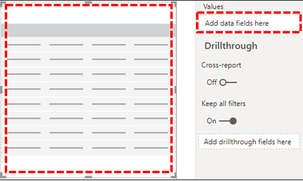

# Instalar Power BI Connector para usar plantillas de consulta CQDInstall Power BI Connector to use CQD query templates

Antes de poder usar las plantillas de consulta de Power BI (archivos PBIX) para el panel de calidad de llamadas (CQD) de Microsoft Teams, tendrá que instalar Power BI Connector para Microsoft CQD con el archivo *MicrosoftCallQuality.pqx* incluido en la [descarga.](https://github.com/MicrosoftDocs/OfficeDocs-SkypeForBusiness/blob/live/Teams/downloads/CQD-Power-BI-query-templates.zip?raw=true)Before you can use the Power BI query templates (PBIX files) for Microsoft Teams Call Quality Dashboard (CQD), you'll need to install the Power BI Connector for Microsoft CQD, using the *MicrosoftCallQuality.pqx* file included in the [download](https://github.com/MicrosoftDocs/OfficeDocs-SkypeForBusiness/blob/live/Teams/downloads/CQD-Power-BI-query-templates.zip?raw=true).

Lea [Usar Power BI para analizar datos de CQD para Teams](CQD-Power-BI-query-templates.md) para obtener información sobre estas plantillas.Read [Use Power BI to analyze CQD data for Teams](CQD-Power-BI-query-templates.md) to learn about these templates.

Asegúrese de que tiene el rol de [acceso CQD adecuado](./turning-on-and-using-call-quality-dashboard.md#assign-admin-roles-for-access-to-cqd) para obtener acceso a los informes de Power BI.Make sure you have the right [CQD access role](./turning-on-and-using-call-quality-dashboard.md#assign-admin-roles-for-access-to-cqd) to access the Power BI reports.

> [!NOTE]
> El conector de Power BI de CQD solo admite DirectQuery en Power BI; El modo de importación no es compatible.The CQD Power BI Connector only supports DirectQuery in Power BI; Import mode is not supported. 

## InstalaciónInstallation

El proceso para instalar un conector personalizado y ajustar la seguridad para habilitar el uso del conector se describe detalladamente en la [documentación de Power BI.](/power-bi/desktop-connector-extensibility)The process for installing a custom connector and adjusting security to enable use of the connector is described in detail in the [Power BI documentation](/power-bi/desktop-connector-extensibility). En aras de la sencillez, esta es una explicación rápida:For the sake of simplicity, here's a quick explanation:

1. Compruebe si su equipo ya tiene una carpeta *\[ Conectores personalizados de \] \\ Escritorio de Power BI \\ documentos.*Check to see if your computer already has a *\[Documents\]\\Power BI Desktop\\Custom Connectors* folder. Si no es así, cree esta carpeta. 1If not, create this folder.1

2. Descargue el archivo del conector (ya sea un *\* archivo .mez* o *\* .pqx)* y colócarlo en el *directorio Conectores personalizados.*Download the connector file (either a *\*.mez* or *\*.pqx* file) and place it in the *Custom Connectors* directory.

3. **Si el archivo del conector es *\* un archivo .mez,*** también tendrá que ajustar la configuración de seguridad como se describe en la documentación de configuración del conector [personalizado.](/power-bi/desktop-connector-extensibility#data-extension-security)**If the connector file is a *\*.mez* file,** you will also need to adjust your security settings as described in the [custom connector setup documentation](/power-bi/desktop-connector-extensibility#data-extension-security).

Si se lanza una nueva versión de este Conector de Power BI para Microsoft Teams, simplemente reemplace el archivo de conector antiguo en el directorio *Conectores personalizados* por el nuevo archivo.If a new version of this Power BI Connector for Microsoft Teams is released, simply replace the old connector file in the *Custom Connectors* directory with the new file.

## ConfiguraciónSetup

Para crear un informe y ejecutar consultas, primero tendrá que conectarse al origen de datos CQD.In order to build a report and run queries, you will first need to connect to the CQD data source. Siga los pasos siguientes para conectarse:Follow the steps below in order to connect:

1. En la pestaña Inicio de Power BI Desktop, haga clic en *Obtener datos.*In the Home tab of Power BI Desktop, click on *Get Data*.

    

2. La *ventana Obtener* datos debería aparecer en este momento.The *Get Data* window should appear at this point. Vaya a *Servicios en línea* y, a continuación, seleccione Calidad de llamada de Microsoft *(Beta)* y pulse *Conectar.*Navigate to *Online Services*, then select *Microsoft Call Quality (Beta)* and hit *Connect*.

    

3. Se le pedirá que inicie sesión a continuación.You will be prompted to sign in next. Use las mismas credenciales que usa para CQD. 2Use the same credentials that you use for CQD.2

4. El siguiente mensaje le dará la opción entre dos modos *de conectividad de datos.*The next prompt will give you the option between two *Data Connectivity modes*. Seleccione *DirectQuery* y pulse *Aceptar*.Select *DirectQuery* and hit *OK*.

5. Por último, se le mostrará un mensaje final que le mostrará todo el modelo de datos para CQD.Finally, you will be given a final prompt showing you the entire data model for CQD. No se podrá ver ningún dato en este momento, solo el modelo de datos para CQD.No data will be visible at this point, only the data model for CQD. Seleccione *Cargar* para completar el proceso de configuración.Select *Load* to complete the setup process.

6. En este momento, Power BI cargará el modelo de datos en el lado derecho de la ventana.At this point, Power BI will load the data model onto the right side of the window. De lo contrario, la página permanecerá en blanco y no se cargarán consultas de forma predeterminada.The page will remain otherwise blank, and no queries will be loaded by default. Vaya a **Crear consultas a** continuación para crear una consulta y devolver datos.Proceed to **Building Queries** below in order to build a query and return data.

Si alguno de los pasos durante este proceso de configuración no estaba completamente claro, encontrará una explicación más detallada del proceso en Inicio rápido: Conectarse a datos en [Power BI Desktop.](/power-bi/desktop-quickstart-connect-to-data)If any of the steps during this setup process were not completely clear, a more detailed explanation of the process can be found in [Quickstart: Connect to data in Power BI Desktop](/power-bi/desktop-quickstart-connect-to-data).

## Crear consultasBuilding Queries

Una vez completada la configuración, verá los nombres de varios cientos de dimensiones y medidas de carga en el *panel* Campos.Once setup is complete, you should see the names of several hundred dimensions and measures load in the *Fields* pane. Crear consultas reales desde aquí es sencillo, solo tiene que seleccionar las dimensiones y medidas que desee para la consulta y, a continuación, arrastrarlas y colocarlas en la página.Constructing actual queries from here is simple, just select the dimensions and measures you want for your query, then drag and drop them onto the page. Esta es una explicación más detallada, con un ejemplo sencillo:Here's a more detailed explanation, with a simple example:

1. Seleccione la visualización que desea usar en el *panel Visualizaciones.*Select the visualization you want to use from the *Visualizations* pane. Una versión en blanco de esa visualización debería aparecer en la página.A blank version of that visualization should appear on the page. Para los fines de este ejemplo, usaremos la visualización *Tabla.*For the purposes of this example, we will be using the *Table* visualization.

    

2. Determine qué dimensiones y medidas (que se indican con un símbolo de agregación por su nombre) que desea usar para la consulta y, a continuación, selecciónelos manualmente y arrástrelos a la visualización negra.Determine which dimensions and measures (denoted by an aggregation symbol by their name) you wish to use for your query, then manually select them and drag them onto the black visualization. Como alternativa, arrástrelos al *campo Valores* debajo de las opciones de visualización.Alternately, drag them onto the *Values* field beneath the visualization options.

    

    > [!IMPORTANT]
    > El Panel de calidad de llamadas requiere una medida para que se ejecute cualquier consulta.Call Quality Dashboard requires a measure for any query to run. Si no se agrega una medida a una consulta, se producirá un error en dicha consulta.Failure to add a measure to a query will cause that query to fail.

3. A continuación, seleccione las dimensiones que quiera filtrar y arrástrelas al campo Filtros de este *campo visual* en el *panel* Filtros.Next, select any dimensions you want to filter on and drag them to the *Filters on this visual* field in the *Filters* pane. El conector de Power BI CQD admite actualmente filtrado básico (valores de selección de una lista de posibles valores de dimensión), filtrado avanzado (especificar  manualmente  valores y operandos para filtrar, similar a CQD avanzado) y filtrado de fecha relativo *(solo* disponible para las dimensiones Hora de finalización e Hora de inicio).  The CQD Power BI Connector currently supports *Basic filtering* (select values from a list of possible dimension values), *Advanced filtering* (manually specify values and operands to filter on, similar to Advanced CQD), and *Relative date filtering* (only available for the *End Time* and *Start Time* dimensions). El filtrado según *N superior no* es compatible con CQD.Filtering according to *Top N* is not supported by CQD.

    

4. Por último, seleccione la *pestaña* Formato en el *panel Visualizaciones* para aplicar estilo y formato a la consulta.Finally, select the *Format* tab within the *Visualizations* pane to style and format your query.

    > [!NOTE]
    > Las consultas de CQD requieren al menos una medida para poder ejecutarse.CQD queries require at least one measure in order to run. Si la consulta no se carga, compruebe dos vez que ha incluido una medida en la consulta.If your query does not load, double check that you have included a measure in the query.

## Crear un informe de obtención de detallesCreating a Drillthrough Report

[La obtención de detalles](/power-bi/desktop-drillthrough) en Power BI le permite crear informes centrados que puede filtrar rápidamente con los valores de otros informes como contexto.[Drillthrough in Power BI](/power-bi/desktop-drillthrough) allows you to create focused reports that you can quickly filter using the values of other reports as context. Una vez que sepa cómo crear la primera consulta con el conector CQD, la creación de una obtención de detalles es incluso más sencilla.Once you know how to create your first query with the CQD Connector, creating a drillthrough is even simpler.

1. Cree otra página para el informe centrado y, a continuación, agregue las consultas a esa página.Create another page for the focused report, and then add your queries to that page.

2. Seleccione la dimensión que desea usar como filtro de obtención de detalles y arrástrela al campo *Obtención* de detalles en el *panel Visualizaciones.*Select the dimension you want to use as a drillthrough filter and drag them onto the *Drillthrough* field under on the *Visualizations* pane.

    

3. **Eso es todo\!****That's it\!** Cualquier otra consulta de otra página que use esa dimensión ahora puede obtener detalles de esa página, aplicando automáticamente el valor de la dimensión de obtención de detalles como filtro.Any other query on another page that uses that dimension can now drillthrough to that page, automatically applying the drillthrough dimension's value as a filter.

    

A diferencia de CQD avanzado, Power BI admite la obtención de detalles no secuencial.Unlike Advanced CQD, Power BI supports non-sequential drillthrough. Siempre que una consulta incluya la dimensión necesaria, puede obtener detalles en cualquier otra página.So long as a query includes the necessary dimension, it can drillthrough to any other page.

### Procedimientos recomendadosBest practice

Las consultas de conector de calidad de llamadas deben diseñarse pensando en la funcionalidad de obtención de detalles.Call Quality connector queries should be designed with drillthrough functionality in mind. En lugar de intentar cargar todos los datos a la vez y, a continuación, cortar con filtros, empiece con consultas más amplias y de baja cardinalidad y explore en profundidad las consultas de alta cardinalidad.Instead of trying to load all the data at once, and then slicing down with filters, start with broader, low-cardinality queries and drill down to high-cardinality queries. Por ejemplo, al intentar diagnosticar qué subredes contribuyen más a los problemas de calidad, es útil identificar primero aquellas regiones y países que contribuyen al problema y, después, explorar en profundidad las subredes de esa región o país.For instance, when attempting to diagnose which subnets contribute most to quality issues, it's helpful to first identify those regions and countries which contribute to the problem, then drill down to the subnets in that region or country. Las plantillas de conector de calidad de llamada se han diseñado de esta manera para actuar como un ejemplo.The Call Quality connector templates have been designed in this manner in order to act as an example.

## LimitacionesLimitations

A pesar de usar Power BI, no todas las funciones de Power BI son compatibles con el conector CQD, ya sea como resultado de limitaciones en el modelo de datos CQD o en conectores de DirectQuery en general.Despite making use of Power BI, not all Power BI functionality is support by the CQD Connector, either as a result of limitations on CQD data model or on DirectQuery connectors in general. En la lista siguiente se indican algunas de las limitaciones más destacadas del Conector, pero esta lista no debe considerarse exhaustiva:The list below notes some of the Connector's more noteworthy limitations, but this list should not be considered exhaustive:

1. **Columnas calculadas:** Los conectores de DirectQuery en general tienen compatibilidad limitada para columnas calculadas en Power BI.**Calculated Columns –** DirectQuery connectors in general have limited support for calculated columns in Power BI. Aunque algunas columnas calculadas pueden funcionar con el Conector, estas deben considerarse excepciones.While some calculated columns may work with the Connector, these should be considered exceptions. Como regla general, las columnas calculadas no funcionarán.As a general rule, calculated columns will not function.

2. **Agregaciones:** El modelo de datos CQD se basa en un modelo de cubo, lo que significa que las agregaciones ya son compatibles en forma de medidas.**Aggregations –** The CQD data model is built on a cube model, meaning that aggregations are already supported in the form of measures. Intentar agregar agregaciones manualmente a distintas dimensiones o cambiar el tipo de agregación de una medida no funcionará con el conector y, por lo general, producirá un error.Attempting to manually add aggregations to different dimensions or changing the aggregation type of a measure will not work with the Connector, and it will generally result in an error.

3. **Objetos visuales personalizados:** Aunque el conector CQD funciona con una amplia variedad de objetos visuales personalizados, no podemos garantizar la compatibilidad con todos los objetos visuales personalizados.**Custom Visuals –** While the CQD Connector does work with a range of custom visuals, we are unable to guarantee compatibility with all custom visuals. Muchos objetos visuales personalizados se basan en el uso de columnas calculadas o datos importados, ninguno o que son compatibles con conectores de DirectQuery.Many custom visuals rely on the use of calculated columns or imported data, neither or which are supported by DirectQuery connectors.

4. **Hacer referencia a datos almacenados en caché:** Actualmente, Power BI no admite hacer referencia a datos almacenados en caché desde un conector de DirectQuery de ninguna manera.**Referencing Cached Data –** Power BI currently does not support referencing cached data from a DirectQuery connector in any way. Cualquier intento de hacer referencia a los resultados de una consulta dará como resultado una nueva consulta.Any attempt to reference the results of a query will result in a new query.

5. **Filtrado de datos relativos:** Es compatible con el conector CQD, pero solo con las dimensiones *Hora de* inicio y Hora *de* finalización.**Relative Data Filtering –** Is supported in the CQD Connector, but only with the *Start Time* and *End Time* dimensions. Aunque la *dimensión* Fecha puede ser la opción obvia para el filtrado de fecha relativo, *Fecha* no se almacena como un objeto de hora de fecha y, por lo tanto, no admite el filtrado de fecha relativo en Power BI.Although the *Date* dimension may be the obvious choice for relative date filtering, *Date* is not stored as a date time object and thus does not support relative date filtering in Power BI.

6. Compatibilidad con la nube de la comunidad gubernamental **(GCC):** Para los clientes del entorno GCC, el conector CQD Power BI no funcionará al usar Power BI Desktop.**Government Community Cloud (GCC) Support –** For customers in the GCC environment, the CQD Power BI Connector will not work when using Power BI Desktop. El conector de Power BI de CQD no es actualmente compatible con el servicio Power BI para los clientes de GCC.The CQD Power BI connector is not presently compatible with the Power BI service for GCC customers.

La mayoría de estos problemas son restricciones al diseño de conectores de DirectQuery en Power BI o fundamentales para el diseño del modelo de datos CQD.Most of these issues are either restrictions to DirectQuery connector design in Power BI or fundamental to the design of the CQD data model.

## Solución de problemasTroubleshooting

### Estoy intentando usar la columna Fecha como segmentación de datos de fecha.I'm trying to use the Date column as a Date slicer. Tan pronto como convierta el tipo de datos de esta columna en Fecha, aparece este errorAs soon as I convert the data type of this column to Date, I get this error

> **No se pudieron cargar los** datos de este objeto visual: error OLE DB u ODBC: [Expresión.Error] No se pudo plegar la expresión al origen de datos.**Couldn't load the data for this visual**: OLE DB or ODBC error: [Expression.Error] We couldn't fold the expression to the data source. Pruebe una expresión más sencilla.Please try a simpler expression.

Las segmentaciones de datos no son compatibles con Power BI Connector.Date slicers aren't supported with the Power BI Connector. Para especificar un intervalo de fechas, aplique dos filtros al informe, especificando una fecha menor y mayor que la fecha.To specify a date range, apply two filters to the report, specifying a less than and greater than date.

Como alternativa, si las fechas que desea ver son recientes, aplique un filtro de fecha relativa para mostrar solo los datos de los últimos N días/semanas/meses.Alternatively, if the dates you want to view are recent, apply a relative date filter to show only data for the last N days/weeks/months.

## Códigos de errorError Codes

Dado que el conector de Power BI de CQD está menos restringido que la aplicación del explorador en términos de tipos de consultas que puede crear, es posible que en ocasiones encuentre una serie de errores al crear las consultas.Because the CQD Power BI Connector is less restricted than the browser app in terms of kinds of queries you can construct, you may occasionally encounter a number of errors while building your queries. En el caso de que reciba un mensaje de error del tipo "CQDError.In the event that you receive an error message of the type "CQDError. RunQuery: error de ejecución de consulta", haga referencia a la lista siguiente con el número ErrorType proporcionado para solucionar el posible problema con la consulta.RunQuery – Query Execution Error", reference the list below with the ErrorType number provided in order to troubleshoot the possible issue with the query. Estos son los códigos de tipo de error más comunes que puede encontrar con el conector CQD Power BI:The following are the most common Error Type codes you may encounter with the CQD Power BI Connector:

- **ErrorType 1: error de estructura de consulta:** Normalmente, un error de estructura de consulta se debe a que el conector no puede crear una consulta con el formato adecuado.**ErrorType 1 - Query Structure Error:** A query structure error is typically caused by the Connector failing to build a properly formatted query. Esto ocurre con mayor frecuencia al usar funciones no admitidas, como se especifica en las limitaciones anteriores.This happens most often when using unsupported functionality, as specified in the Limitations above. Compruebe que no usa columnas calculadas ni objetos visuales personalizados para esa consulta.Double check that you are not using any calculated columns or custom visuals for that query.

  - **ErrorType 2: error de creación de consultas:** Un error de creación de consultas se debe a que el conector CQD no puede analizar correctamente la consulta que intenta crear.**ErrorType 2 - Query Building Error:** A query building error is caused by the CQD Connector being unable to properly parse the query you are attempting to build. Esto ocurre con mayor frecuencia al usar funciones no admitidas, como se especifica en las limitaciones anteriores.This happens most often when using unsupported functionality, as specified in the Limitations above. Compruebe que no usa columnas calculadas ni objetos visuales personalizados para esa consulta.Double check that you are not using any calculated columns or custom visuals for that query.

  - **ErrorType 5: tiempo de espera de ejecución:** La consulta ha alcanzado el tiempo de ejecución máximo posible antes de que se desatrase el tiempo de ejecución. Intente agregar más filtros a la consulta para limitar su ámbito.**ErrorType 5 - Execution Timeout:** The query has reached the maximum possible runtime before timing out. Try adding more filters to the query in order to limit its scope. Restringir el rango de datos suele ser la forma más eficaz de lograrlo.Narrowing the data range is often the most effective way to achieve this.

  - **ErrorType 7: sin errores de medida:** Las consultas CQD requieren una medida para funcionar.**ErrorType 7 - No Measurements Error:** CQD queries require a measure in order to function. Compruebe dos vez que la consulta incluye medida.Double check that your query includes measure. Las medidas del conector CQD se indican mediante el símbolo de agregación (suma) antes de su nombre.Measures in the CQD Connector are denoted by the aggregation (sum) symbol before their name.

Si encuentra errores adicionales fuera de este ámbito, notifique al equipo de CQD para que podamos ayudar a solucionar el problema y actualizar la documentación según corresponda.If you encounter any additional errors outside of this scope, please notify the CQD team so that we can help troubleshoot the issue and update the documentation as appropriate.

## Notas al pieFootnotes

**1** Algunos procesos y aplicaciones (por ejemplo, OneDrive) pueden hacer que la carpeta raíz documentos cambie; asegúrese de que el directorio *Conectores \\ personalizados* de Escritorio de Power BI se coloca dentro de la carpeta raíz actual Documentos.**1** Certain processes and apps (e.g., OneDrive) may cause your Documents root folder to change; make sure that the *Power BI Desktop\\Custom Connectors* directory is placed inside of the current root folder Documents folder.

**2** Las credenciales de inicio de sesión que usa para CQD *no* necesitan ser las mismas que usa para iniciar sesión en la propia aplicación de escritorio de Power BI.**2** The login credentials you use for CQD *do not* need to be the same credentials you use for logging into the Power BI Desktop app itself.

## Preguntas frecuentesFrequently asked questions

### ¿Cuándo se actualizará Power BI Connector desde el estado "Beta"When will the Power BI Connector be updated from "Beta" status

A pesar de la etiqueta Beta, el Conector de calidad de llamada para Power BI es la versión de lanzamiento del conector y ha sido firmado oficialmente por el equipo de Power BI para reflejar esto.Despite the Beta tag, the Call Quality Connector for Power BI is the release version of the connector and has been officially security signed by the Power BI team to reflect this. El proceso de certificación para quitar esa etiqueta beta es amplio y requiere un compromiso del equipo de Power BI para proporcionar soporte directo al conector también.The certification process to remove that Beta tag is an extensive one and requires a commitment from the Power BI team to provide direct support to the connector as well. Debido a las limitaciones de tiempo, el equipo de Power BI no puede proporcionar actualmente ese soporte técnico y una certificación más amplia, pero todavía está preparado para dar fe de la seguridad, autenticidad y funcionalidad general del conector de calidad de llamadas de Microsoft.Due to time constraints, the Power BI team is currently unable to provide that support and broader certification, but is still prepared to attest to the security, authenticity, and general functionality of the Microsoft Call Quality connector.

### ¿Por qué el conector parece más lento en comparación con CQD avanzado en el explorador?Why does the connector seem slower compared to Advanced CQD in the browser? Qué puedo hacer para mejorar el rendimientoWhat can I do to improve performance

El rendimiento de las consultas para las distintas plantillas es en realidad el mismo en el explorador y en el conector.Query performance for the various templates is actually the same in both the browser and in the connector.  Al igual que cualquier otra aplicación independiente, Power BI agrega su tiempo de autenticación y representación a nuestro rendimiento.Just like any other standalone app, Power BI adds its authentication and rendering time to our performance. Además, la diferencia se produce en el número de consultas simultáneas que se ejecutan.In addition, the difference comes in the number of concurrent queries being run. Como la versión en el explorador de CQD tenía opciones de visualización menos desarrolladas y densas de información, la mayoría de nuestros informes se limitaban a cargar de 2 a 3 consultas a la vez.Because the in-browser version of CQD had less well-developed and information-dense visualization options, most of our reports were limited to loading 2-3 queries at a time. Por otro lado, las plantillas de conector suelen mostrar más de 20 consultas simultáneas.On the other hand, the connector templates often display 20+ concurrent queries. Si desea crear informes que respondan igual que los antiguos a los que estaba acostumbrado, intente crear informes con no más de 2 o 3 consultas por pestaña.If you wish to build reports that are just as responsive as the older ones you were used to, try creating reports with no more than 2-3 queries per tab.

Para obtener más información, vea los artículos siguientes:For more information, see the following articles:

- [Guía de optimización de Power BIOptimization guide for Power BI](/power-bi/guidance/power-bi-optimization)
- [Guía del modelo DirectQueryDirectQuery model guidance](/power-bi/guidance/directquery-model-guidance)

### Encuentro que rutinariamente me encuentro con el límite de 10 000 filas al ejecutar consultas.I find that I routinely run into the 10,000-row limit when running queries. ¿Cómo puedo conseguir que el conector devuelva más de 10 000 filas?How can I get the connector to return more than 10,000 rows

El límite de 10 000 filas se especifica realmente en el extremo de la API y está diseñado para ayudar a mejorar significativamente el rendimiento y reducir el riesgo de errores de ejecución de consultas como resultado de condiciones de memoria bajas.The 10,000-row limit is actually specified on the API end, and it is designed to help significantly improve performance and reduce the risk of query execution errors resulting from low memory conditions.

En lugar de intentar aumentar el recuento de filas de resultados, es mejor reorganizar los informes según los procedimientos recomendados del conector.Instead of attempting to increase the result row count, it is best to restructure your reports according to connector best practices. Las plantillas que hemos incluido están diseñadas para demostrar estos procedimientos recomendados.The templates we have included are designed to demonstrate these best practices. Cuando sea posible, empiece por ver sus KPI con dimensiones más amplias y de menor cardinalidad, como Mes, Año, Fecha, Región, País, etc. Desde allí, puede explorar en profundidad las dimensiones de mayor cardinalidad.Where possible, start by looking at your KPIs using broader, lower-cardinality dimensions, such as Month, Year, Date, Region, Country, etc. From there, you can drill down into increasingly higher-cardinality dimensions. Tanto el Departamento de soporte técnico como Location-Enhanced informes proporcionan buenos ejemplos de este flujo de trabajo de exploración en profundidad.The Helpdesk and Location-Enhanced Reports both provide good examples of this drill down workflow.

## Temas relacionadosRelated topics

[Usar Power BI para analizar datos CQD para TeamsUse Power BI to analyze CQD data for Teams](CQD-Power-BI-query-templates.md)
