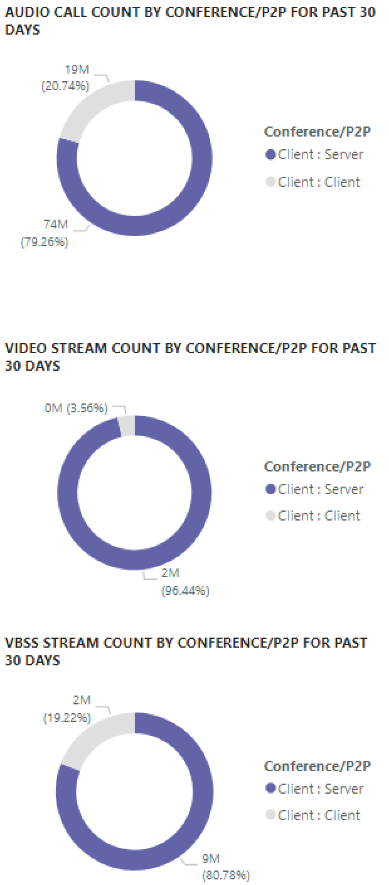
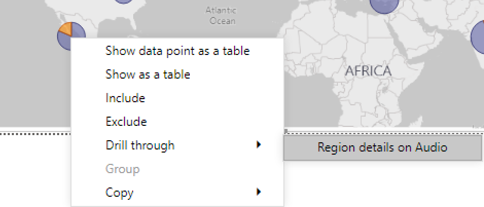
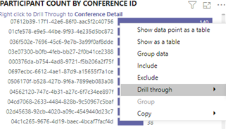
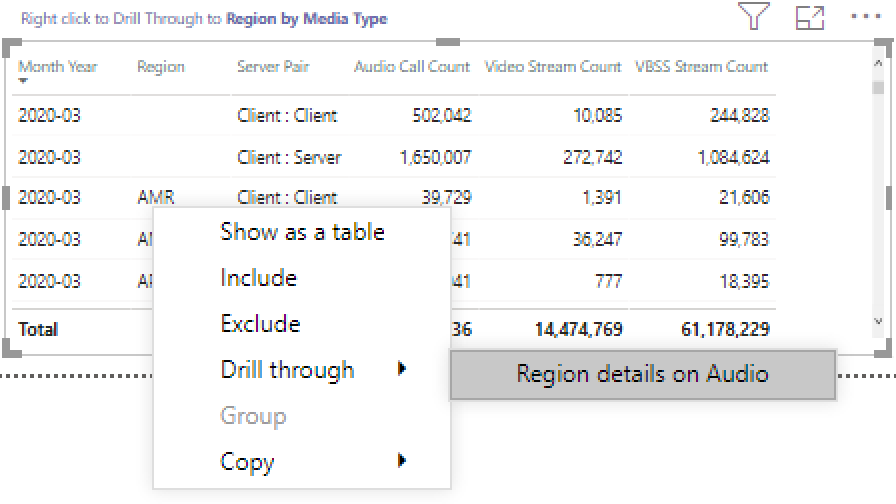

# Ver Microsoft Teams uso en Power BI con datos CQD

Como novedad en marzo de 2020, hemos agregado un informe de uso Teams a nuestras plantillas de consulta de Power BI descarga para [CQD.](https://github.com/MicrosoftDocs/OfficeDocs-SkypeForBusiness/blob/live/Teams/downloads/CQD-Power-BI-query-templates.zip?raw=true) 

Este nuevo Teams de uso de llamadas le permite ver cómo (y cuánto) usan los usuarios Microsoft Teams mediante el acceso Teams datos del Panel de calidad de llamadas (CQD). Estos informes están diseñados para ser una ubicación centralizada a la que los administradores y los líderes empresariales pueden ir rápidamente para obtener estos datos.

El Teams de uso Power BI consta de dos informes **[principales:](#call-count-summary-report)** Resumen del recuento de llamadas y **[Resumen de minutos de audio.](#audio-minutes-summary-report)** Los [informes Uso](#daily-usage)diario,  Detalles  regionales de [audio,](#regional-audio-details)Detalles de conferencia e Lista de usuarios se reproducen cuando un usuario aprovecha los informes detallados, que se indican en las descripciones siguientes.

> [!NOTE]
> Los datos de creación y subred deben rellenarse para proporcionar funcionalidades de filtrado de red y regionales.

## Informe de resumen del recuento de llamadas

La página principal (Resumen del recuento de llamadas) proporciona inmediatamente el número de sesiones de audio, vídeo y uso compartido de pantalla durante los últimos 30 y 90 días, como se indica en el título de la sección. Los datos mostrados inicialmente son para toda la organización y se pueden filtrar con las opciones desplegables de segmentación de datos en el lado izquierdo de la página.

1. A la derecha de los menús desplegables de segmentación de datos, el número de llamadas por tipo de medios se desglosa a una vista interna o externa en los últimos treinta días. A través de la captura de pantalla anterior, podemos ver que hay más llamadas desde ubicaciones externas a la organización, lo que tiene sentido teniendo en cuenta el entorno global actual.
  

1. A la derecha del cuadro de recuento de tipo multimedia, tenemos el recuento de llamadas mensuales por tipo de medio durante los últimos 90 días. Se puede mantener el puntero sobre cada columna y tipo de elemento multimedia para mostrar el recuento de un mes anterior o del mes actual hasta la fecha, proporcionando información de tendencia de uso.
  
 

1. El gráfico central funciona como lo hace el gráfico de 90 días, pero proporciona una vista de uso diario durante los últimos 30 días y permite al usuario hacer clic con el botón derecho y explorar detalles para un día específico.
  

En la sección inferior izquierda de la página, encontrará una tabla que proporciona valores totales para cada tipo de elemento multimedia durante el año pasado. 
        

A la derecha de la tabla, un gráfico de barras muestra los clientes con más uso (llamadas/transmisiones) durante los últimos 30 días.
   

El último conjunto de gráficos de esta página muestra cada tipo de elemento multimedia individualmente, con un desglose que muestra el uso de conferencias y P2P. Los gráficos siguientes muestran que hay un número significativamente mayor de uso de conferencias en comparación con P2P.
  

## Informe de resumen de minutos de audio

En el informe de uso minutos de audio, el uso total de minutos se proporciona a través de varias vistas diferentes. 

Tenemos el resumen de uso de treinta días que se muestra junto a las segmentaciones de datos como fácil de usar en los cuadros de texto. El número superior muestra el total de treinta días, con desgloses internos y externos por debajo.

El gráfico de barras superior derecha proporciona una vista de todo el año del uso de audio de conferencia. Mantenga el puntero sobre el mes para mostrar los minutos de audio de la conferencia.

Para mostrar la diferencia en el audio de conferencia y P2P, el gráfico inferior izquierdo toma todo el audio del año pasado y lo divide entre los dos tipos.

El último gráfico de la página Minutos de audio muestra el uso de minutos de audio en una superposición de mapa global. Este gráfico solo funcionará si los datos de creación y subred se cargan en el espacio empresarial. El gráfico circular superpuesto en el mapa se puede explorar en profundidad y, posteriormente, proporcionar el uso de audio regional.

## Capacidades de obtención de detalles

Como se ha indicado anteriormente, los usuarios pueden explorar en profundidad los informes de uso diarios y regionales.

### Uso diario

El informe Uso diario permite a un administrador identificar los períodos de consumo máximo durante el transcurso de un día. Además del uso, también podemos capturar el sentimiento general del usuario y los comentarios de ese día.

El informe Uso diario muestra el número de recursos compartidos de audio, vídeo y pantalla del día seleccionado con la capacidad adicional de diferenciar entre conectividad interna y externa. Un desglose de conferencia y punto a punto está a la derecha inmediata del cuadro total de la modalidad. La parte superior derecha del informe proporciona una lista de conferencias con su id. asociado y los participantes del día. La lista de conferencias también proporciona un detalle adicional al informe Detalles de la conferencia. REEMPLAZAR GRÁFICO

El gráfico de barras del área central permite al usuario identificar períodos de consumo máximo durante el transcurso de un día. Los usuarios pueden explorar en profundidad la hora representada en el gráfico que presentará el informe lista de usuarios para la hora.

A la derecha del gráfico de barras, los comentarios de los usuarios se presentan en un formato visual. Aunque el sentimiento del usuario puede ser subjetivo, proporciona información que se puede usar para identificar posibles problemas.

La tabla inferior proporciona un rango de métricas para el día. Los porcentajes bajos junto con las tasas de errores pueden proporcionar a un administrador áreas potenciales de mejora. Cada hora también se puede seleccionar individualmente, como se muestra a continuación.

Estos datos se pueden usar para identificar las regiones que tienen problemas durante las horas de máximo consumo.

Haga clic en la columna de ese día para mostrar las métricas de esa hora.

  
  1.  La tabla debajo del gráfico mostrará las métricas de esa hora. Esto se puede ordenar por cualquier encabezado de columna; sin embargo, nos interesaría encontrar áreas problemáticas.  
    
    
  2.  Vemos que la región IND está experimentando un rendimiento de vídeo deficiente en las conferencias durante este período de tiempo. Posteriormente, los informes de QER de CQD de Microsoft se pueden usar para restringir la ubicación problemática a medida que se ha identificado la región y el período de tiempo.

### Detalles de la conferencia

El informe Detalles de conferencia proporciona información adicional para las reuniones, desde una lista de asistentes, hasta los tipos de medios usados durante la sesión.

Haga clic con el botón derecho en la barra del participante en el gráfico id. de conferencia de la página Uso diario para explorar los detalles de la conferencia.

  

Podemos ver a los participantes en la conferencia, así como toda la información pertinente hasta la pérdida de paquetes y la vibración para ayudar con los posibles esfuerzos de solución de problemas en la tabla inferior.

### Detalles del audio regional

En detalles de audio regionales se muestra específicamente el uso de minutos de audio para la región seleccionada. Los usuarios con acceso a CQD pueden ver las tendencias de uso de P2P y audio de conferencia en la región seleccionada.

1.  En la página Resumen del recuento de llamadas, puede explorar en profundidad como región específica a través de la tabla.
  

2.  Seleccione la fila con la región para la que se necesita información adicional.
  

3.  Las tendencias de datos muestran un número significativo de minutos que se usan en la red interna, con conferencias que superan ampliamente el uso de P2P.
  

La tendencia de audio regional se puede usar para mostrar cómo los usuarios se verán afectados por las influencias externas en el mundo. En concreto, en este momento, esperamos que el uso externo de las regiones EMEA y APAC aumente con la razón de que se pida a las personas que trabajen de forma remota.

### Lista de usuarios

La lista de usuarios proporciona, como es de esperar, información específica del usuario para una hora específica seleccionada por la persona que ve el informe. El informe de lista de usuarios es accesible mediante una exploración en profundidad en el gráfico Tendencias por horas en el informe Uso diario. Haga clic con el botón derecho en la hora en la que se necesita información adicional y seleccione Explorar y Lista de usuarios, como se muestra a continuación.

El informe Lista de usuarios muestra la conectividad interna y externa a través del gráfico de anillos en el centro superior de la página. Podemos ver que hay una gran cantidad de participación de Fuera de la red corporativa en la imagen siguiente.

En la parte superior derecha del gráfico se muestra el número de llamadas realizadas por cada usuario en esa hora.

La tabla inferior proporciona información detallada para las sesiones en las que participó cada usuario durante esa hora. La columna Tipo de error es útil para determinar qué provocó la colocación de una llamada. Las columnas Capturar y Representar dispositivo son útiles para identificar por qué se ha notificado que una llamada tiene mala calidad.

## Temas relacionados

[Dimensiones y medidas disponibles en el Panel de calidad de llamadas](dimensions-and-measures-available-in-call-quality-dashboard.md)

[Clasificación de la secuencia en el Panel de calidad de llamadas](stream-classification-in-call-quality-dashboard.md)

[Configurar el análisis de llamadas de Skype Empresarial](set-up-call-analytics.md)

[Usar el Análisis de llamadas para solucionar problemas de mala calidad en las llamadas](use-call-analytics-to-troubleshoot-poor-call-quality.md)

[Análisis de llamadas y Panel de calidad de llamadas](./monitor-call-quality-qos.md)

[Solución de problemas de Teams](/MicrosoftTeams/troubleshoot/teams)
