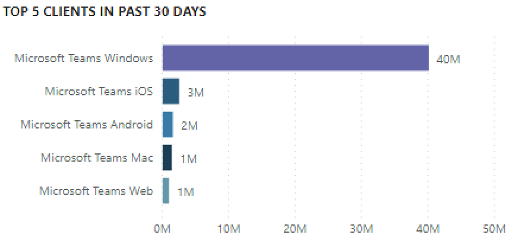

# Ver el uso de Microsoft Teams en Power BI con datos del CQD

Como novedad en marzo de 2020, agregamos un informe de utilización de Teams a nuestras plantillas descargables de consultas de [Power BI para el CQD.](https://github.com/MicrosoftDocs/OfficeDocs-SkypeForBusiness/blob/live/Teams/downloads/CQD-Power-BI-query-templates.zip?raw=true) 

Este nuevo informe de uso de teams le permite ver cómo (y cuánto) utilizan sus usuarios Microsoft Teams accediendo a los datos del panel de calidad de llamadas (CQD) de Teams. Estos informes están diseñados para ser una ubicación centralizada a la que puedan ir rápidamente los administradores y los líderes empresariales para estos datos.

El informe de Power BI para el uso de equipos consta de dos informes **[principales:](#call-count-summary-report)** Resumen del recuento de llamadas y Resumen de **[minutos de audio.](#audio-minutes-summary-report)** Los [informes Uso](#daily-usage)diario,  Detalles  de [audio regional,](#regional-audio-details)Detalles de conferencias e Lista de usuarios se reproducen cuando un usuario aprovecha los informes detallados, que se indican en las descripciones siguientes.

> [!NOTE]
> Los datos de edificio y subred deben rellenarse para proporcionar capacidades de filtrado de red y regionales.

## Informe de resumen del número de llamadas

La página principal (Resumen del recuento de llamadas) proporciona inmediatamente el número de sesiones de uso compartido de audio, vídeo y pantalla durante los últimos 30 y 90 días, tal y como se indica en el título de la sección. Los datos mostrados inicialmente son para el conjunto de la organización y se pueden filtrar con las opciones de la segmentación de datos del lado izquierdo de la página.

1. A la derecha de los menús desplegables de la segmentación de datos, el número de llamadas por tipo de medio se desglosa en una vista interna o externa durante los últimos treinta días. En la captura de pantalla anterior se puede ver que hay más llamadas que se están produciendo desde ubicaciones externas a la organización, lo que tiene sentido teniendo en cuenta el entorno global actual.
  

1. A la derecha del cuadro de recuento de tipo de medio, tenemos el recuento mensual de llamadas por tipo de medio durante los últimos 90 días. Puede mantener el puntero sobre cada tipo de columna y de medio para mostrar el recuento de un mes anterior o del mes actual hasta la fecha, proporcionando información de tendencias de uso.
  
 

1. El gráfico central funciona como el gráfico de 90 días, pero proporciona una vista de uso diario de los últimos 30 días y permite al usuario hacer clic con el botón derecho y explorar en profundidad los detalles de un día específico.
  

En la sección inferior izquierda de la página, encontrará una tabla que proporciona los valores totales de cada tipo de medio durante el año pasado. 
        

A la derecha de la tabla, un gráfico de barras muestra los clientes con más uso (llamadas o transmisiones) durante los últimos 30 días.
   

El último conjunto de gráficos de esta página muestra cada tipo de medio de forma individual, con un desglose que muestra la conferencia y el uso de P2P. Los siguientes gráficos muestran que hay un número significativamente mayor de uso de conferencias en comparación con P2P.
  

## Informe de resumen de minutos de audio

En el informe de uso minutos de audio, el uso total de minutos se proporciona a través de varias vistas diferentes. 

Tenemos el resumen de uso de treinta días que se muestra junto a las segmentaciones de datos para que sea fácil de usar. El número superior muestra el total de treinta días, con desgloses internos y externos por debajo.

El gráfico de barras de la parte superior derecha ofrece una vista de todo el año del uso del audio de la conferencia. Mantenga el mouse sobre el mes para mostrar los minutos de audio de la conferencia.

Para mostrar la diferencia en el audio de conferencia y P2P, el gráfico de la parte inferior izquierda toma todo el audio del año pasado y lo divide entre los dos tipos.

El último gráfico de la página Minutos de audio muestra el uso de minutos de audio en una superposición de mapa global. Este gráfico solo funcionará si los datos de edificio y subred se cargan en el inquilino. El gráfico circular superpuesto sobre el mapa se puede explorar en profundidad y, posteriormente, proporcionar el uso de audio regional.

## Capacidades de exploración en profundidad

Como se indicó anteriormente, los usuarios pueden explorar en profundidad los informes de uso diario y regional.

### Uso diario

El informe Uso diario permite a un administrador identificar los períodos pico de consumo a lo largo del transcurso de un día. Además del uso, también podemos capturar opiniones y comentarios generales del usuario sobre ese día.

El informe de uso diario muestra el número de recursos compartidos de audio, vídeo y pantalla del día seleccionado con la capacidad adicional de diferenciar entre conectividad interna y externa. Un desglose de conferencias y de punto a punto se encuentra a la derecha inmediata del cuadro de total de la modalidad. En la parte superior derecha del informe se proporciona una lista de conferencias con su identificador asociado y los participantes del día. La lista de conferencias también ofrece un detalle adicional para el informe de detalles de conferencia. REEMPLAZAR GRÁFICO

El gráfico de barras en el área central permite al usuario identificar los períodos de consumo máximo a lo largo del transcurso de un día. Los usuarios pueden explorar en profundidad las horas representadas en el gráfico, que presentarán el informe lista de usuarios para la hora.

A la derecha del gráfico de barras, los comentarios del usuario se presentan en un formato visual. Aunque la opinión del usuario puede ser subjetiva, sí proporciona información que se puede usar para identificar posibles problemas.

La tabla inferior proporciona un intervalo de métricas para el día. Los porcentajes bajos junto con los índices de error pueden proporcionar a un administrador áreas potenciales de mejora. Cada hora también puede seleccionarse individualmente, como se muestra a continuación.

Estos datos se pueden usar para identificar las regiones que tienen problemas durante las horas punta de consumo.

Haga clic en la columna de ese día para mostrar las métricas de esa hora.

  
  1.  En la tabla debajo del gráfico se mostrarán las métricas de esa hora. Esto se puede ordenar por cualquier encabezado de columna; sin embargo, nos encantaría encontrar áreas problemáticas.  
    
    
  2.  Vemos que la región IND experimenta un rendimiento de vídeo deficiente en conferencias durante este período de tiempo. Posteriormente, los informes de QER QER de Microsoft del CQD se pueden usar para limitar la ubicación problemática a medida que se han identificado la región y el período de tiempo.

### Detalles de la conferencia

El informe Detalles de la conferencia proporciona información adicional sobre las reuniones, desde una lista de asistentes, hasta los tipos de elementos multimedia usados durante la sesión.

Haga clic con el botón secundario en la barra del participante en el gráfico de id. de conferencia de la página Uso diario para explorar en profundidad los detalles de la conferencia.

  

Podemos ver los participantes de la conferencia, así como toda la información pertinente hasta la pérdida de paquetes y la vibración para ayudar a los posibles esfuerzos de solución de problemas en la tabla inferior.

### Detalles de audio regionales

La información detallada de los detalles de audio regional muestra específicamente el uso de minutos de audio de la región seleccionada. Los usuarios con acceso al CQD pueden ver las tendencias de uso del audio de la conferencia y P2P en la región seleccionada.

1.  En la página Resumen del número de llamadas, explore en profundidad hasta una región específica a través de la tabla.
  

2.  Seleccione la fila que tiene la región para la que se necesita información adicional.
  

3.  Las tendencias de datos muestran un número significativo de minutos que se utilizan en la red interna, y las conferencias sobrepasan en mucho el uso de P2P.
  

La tendencia de audio regional puede usarse para mostrar cómo afectan a los usuarios las influencias externas en el mundo. Específicamente, ahora mismo, esperamos ver el uso externo de las regiones EMEA y APAC aumentar con personas que se les pide que trabajen de forma remota.

### Lista de usuarios

La lista de usuarios proporciona, como puede esperar, información específica del usuario para una hora específica seleccionada por la persona que está viendo el informe. Puede acceder al informe de lista de usuarios mediante un análisis en profundidad del gráfico Tendencias de hora en el informe Uso diario. Haga clic con el botón derecho en la hora en la que se necesita información adicional y seleccione Explorar en profundidad y Lista de usuarios, como se muestra a continuación.

El informe de lista de usuarios muestra la conectividad interna/externa a través del gráfico de anillos en la parte superior central de la página. Podemos ver que hay una gran cantidad de participación desde fuera de la red corporativa en la imagen siguiente.

En la parte superior derecha del gráfico se muestra el número de llamadas realizadas por cada usuario en esa hora.

La tabla inferior proporciona información detallada para las sesiones en las que ha participado cada usuario durante esa hora. La columna Tipo de error es útil para determinar qué hizo que se soltara una llamada. Las columnas Capturar y Representar dispositivo son útiles para identificar por qué se ha informado de que una llamada tiene mala calidad.

## Temas relacionados

[Dimensiones y medidas disponibles en el Panel de calidad de llamadas](dimensions-and-measures-available-in-call-quality-dashboard.md)

[Clasificación de la secuencia en el Panel de calidad de llamadas](stream-classification-in-call-quality-dashboard.md)

[Configurar el análisis de llamadas de Skype Empresarial](set-up-call-analytics.md)

[Usar el Análisis de llamadas para solucionar problemas de mala calidad en las llamadas](use-call-analytics-to-troubleshoot-poor-call-quality.md)

[Análisis de llamadas y Panel de calidad de llamadas](difference-between-call-analytics-and-call-quality-dashboard.md)

[Solución de problemas de Teams](https://docs.microsoft.com/MicrosoftTeams/troubleshoot/teams)
 