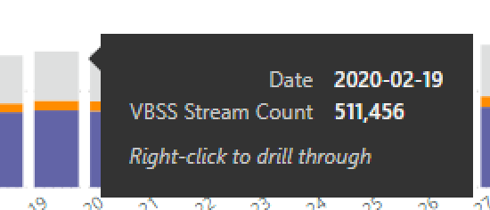

# Ver la utilización de Microsoft Teams en Power BI con datos del CQD

Novedades de marzo de 2020 hemos agregado un informe de uso de Teams a nuestras [plantillas de consultas descargables de Power BI para el CQD](https://github.com/MicrosoftDocs/OfficeDocs-SkypeForBusiness/blob/live/Teams/downloads/CQD-Power-BI-query-templates.zip?raw=true). 

Estos nuevos informes de uso de equipos le permiten ver cómo (y cuánto) los usuarios usan Microsoft Teams accediendo a los datos del panel de calidad de llamadas de Teams (CQD). Estos informes están diseñados para ser una ubicación centralizada que los administradores y los líderes de negocios pueden ir rápidamente a para esta información.

El informe de uso de Power BI para equipos consta de dos informes principales: Resumen de **[recuento de llamadas](#call-count-summary-report)** y Resumen de **[minutos de audio](#audio-minutes-summary-report)**. Los informes [uso diario](#daily-usage), [detalles de audio regional](#regional-audio-details), detalles de la [Conferencia](#conference-details) y lista de [usuarios](#user-list) entran en juego cuando un usuario aprovecha los informes de análisis detallado, que se indican en las descripciones siguientes.

> [!NOTE]
> Los datos de compilación y de subred se deben rellenar para proporcionar capacidades regionales y de filtrado de red.

## Informe de Resumen de la cantidad de llamadas

La Página principal (Resumen de recuento de llamadas) proporciona inmediatamente el número de sesiones de audio, vídeo y pantalla compartida durante los últimos 30 y 90 días, como se indica en el título de la sección. Los datos que se muestran inicialmente son para la organización como un todo y se pueden filtrar con las opciones de lista desplegable segmentación de datos en el lado izquierdo de la página.

1. A la derecha de la lista desplegable segmentación, el número de llamadas por tipo de medio se divide en una vista interna o externa en los últimos treinta días. Podemos ver a través de la captura de pantalla anterior que hay más llamadas que ocurren desde ubicaciones organizativas externas, lo cual tiene sentido considerar el entorno global actual.
  

1. A la derecha del cuadro recuento de tipos de medios, tenemos el recuento mensual de llamadas por tipo de medio para los últimos 90 días. Se puede desplazar por cada columna y tipo de medio para mostrar el recuento de un mes anterior o el mes actual hasta la fecha, proporcionando información sobre la tendencia de uso.
  
 

1. El gráfico del centro funciona como el gráfico de 90, pero proporciona una vista de uso diario para los últimos 30 días y permite a un usuario hacer clic con el botón secundario y explorar en profundidad los detalles de un día específico.
  

En la sección inferior izquierda de la página, encontrarás una tabla que proporciona valores totales para cada tipo de medio en el último año. 
        

A la derecha de la tabla, un gráfico de barras muestra los clientes con el mayor uso (llamadas/transmisiones) en los últimos 30 días.
   

El último conjunto de gráficos de esta página muestra cada tipo de medio individualmente, con un desglose que muestra el uso de la Conferencia y el P2P. Los siguientes gráficos muestran que hay un número mucho más alto de uso de la Conferencia comparado con el P2P.
  

## Informe Resumen de minutos de audio

En el informe de uso de los minutos de audio, el uso total de minutos se proporciona a través de varias vistas diferentes. 

Tenemos el Resumen de uso de treinta días que aparece al lado de las segmentaciones de forma tan fácil de usar cuadros de texto. El número superior muestra el total de treinta días, con desgloses internos y externos por debajo de él.

El gráfico de barras superior derecha proporciona una vista yearlong del uso de audio en conferencia. Desplace el puntero sobre el mes para mostrar los minutos de audio de la Conferencia.

Para mostrar la diferencia en P2P y en el audio de las conferencias, el gráfico inferior izquierdo toma todo el audio del año pasado y lo divide entre los dos tipos.

El último gráfico de la página de minutos de audio muestra el uso de minutos de audio en una superposición de mapa global. Este gráfico solo funciona si los datos de compilación y de subred se cargan en el inquilino. El gráfico circular superpuesto en el mapa se puede profundizar y, posteriormente, proporcionar el uso de audio regional.

## Capacidades de obtención de detalles

Como se indicó anteriormente, los usuarios pueden profundizar en los informes de uso diarios y regionales.

### Uso diario

El informe de uso diario permite que un administrador identifique los períodos de consumo máximo durante un día. Además del uso, también podemos capturar los comentarios y la opinión general del usuario para ese día.

El informe de uso diario muestra el número de recursos compartidos de audio, vídeo y pantalla para el día seleccionado con la capacidad añadida de diferenciar entre conectividad interna y externa. Un desglose de conferencia y de punto a punto es el derecho inmediato del total de moda. La parte superior derecha del informe proporciona una lista de conferencias con el identificador y los participantes asociados para el día. En la lista de conferencias se ofrece un desglose adicional del informe detalles de la Conferencia. REEMPLAZAR GRÁFICO

El gráfico de barras del área del centro permite que el usuario identifique los períodos de consumo máximo en el curso de un día. Los usuarios pueden profundizar en la hora representada en el gráfico, que presentará el informe de la lista de usuarios para la hora.

A la derecha del gráfico de barras, los comentarios del usuario se presentan en un formato visual. Si bien la opinión del usuario puede ser subjetiva, ofrece información que puede usarse para identificar posibles problemas.

La tabla inferior proporciona una variedad de métricas para el día. Los porcentajes deficientes, junto con las tarifas de error, pueden proporcionar a un administrador las posibles áreas de mejora. Cada hora también se puede seleccionar individualmente, tal como se muestra a continuación.

Estos datos se pueden usar para identificar regiones con problemas durante los tiempos de consumo máximo.

Haga clic en la columna de ese día para mostrar las métricas de esa hora.

  
  1.  La tabla que se encuentra debajo del gráfico mostrará las métricas de esa hora. Se puede ordenar por cualquier encabezado de columna; sin embargo, nos interesaría encontrar áreas problemáticas.  
    
    
  2.  Vemos que la región de IND está experimentando un bajo rendimiento de video en las conferencias durante este período de tiempo. Posteriormente, los informes de Microsoft QER del CQD se pueden usar para restringir la ubicación problemática a medida que se identifica la región y el intervalo de tiempo.

### Detalles de la Conferencia

El informe detalles de la Conferencia proporciona información adicional sobre las reuniones, desde una lista de asistentes, a los tipos de medios utilizados durante la sesión.

Haga clic con el botón derecho en una conferencia la barra de participantes en el gráfico de identificación de la Conferencia en la página uso diario para desglosar los detalles de la Conferencia.

  

Podemos ver a los participantes en la Conferencia, así como toda la información pertinente, a fin de perder el paquete y la vibración para ayudarle en los esfuerzos potenciales de solución de problemas en la tabla inferior.

### Detalles de audio regional

Los detalles de audio regionales detallan específicamente el uso de minutos de audio en la región seleccionada. Los usuarios con acceso al CQD pueden ver las tendencias de uso para el audio P2P y de conferencia dentro de la región seleccionada.

1.  En la página Resumen de cuenta de llamadas, profundice en la tabla como región específica.
  

2.  Seleccione la fila con la región que necesita la información adicional.
  

3.  Las tendencias de datos muestran un número significativo de minutos que se usan en la red interna, con conferencias que superan mucho el uso de P2P.
  

La tendencia regional de audio puede usarse para mostrar cómo afectan los usuarios a las influencias externas del mundo. En concreto, en este momento, esperamos que el uso externo de las regiones EMEA y APAC aumente con personas a las que se les pidió que trabajaran de forma remota.

### Lista de usuarios

La lista desplegable lista de usuarios proporciona, como puede esperar, información específica de usuario para una hora específica seleccionada por la persona que visualiza el informe. El informe de la lista de usuarios es accesible a través de un desglose en el gráfico tendencias por hora en el informe de uso diario. Haga clic con el botón secundario en la hora en la que se necesita información adicional y seleccione obtención de detalles y lista de usuarios, como se muestra a continuación.

El informe lista de usuarios muestra la conectividad interna o externa a través del gráfico de anillos en la parte central superior de la página. Podemos ver que hay una gran participación desde fuera de la red corporativa en la siguiente imagen.

En la parte superior derecha del gráfico se muestra el número de llamadas realizadas por cada usuario dentro de esa hora.

La tabla inferior proporciona información detallada sobre las sesiones en las que participó cada usuario durante esa hora. La columna tipo de error es útil para determinar qué ha provocado la llamada. Las columnas de los dispositivos de captura y representación son útiles para identificar por qué se notificó una llamada con una calidad deficiente.

## Temas relacionados

[Dimensiones y medidas disponibles en el Panel de calidad de llamadas](dimensions-and-measures-available-in-call-quality-dashboard.md)

[Clasificación de la secuencia en el Panel de calidad de llamadas](stream-classification-in-call-quality-dashboard.md)

[Configurar el análisis de llamadas de Skype Empresarial](set-up-call-analytics.md)

[Usar el Análisis de llamadas para solucionar problemas de mala calidad en las llamadas](use-call-analytics-to-troubleshoot-poor-call-quality.md)

[Análisis de llamadas y Panel de calidad de llamadas](difference-between-call-analytics-and-call-quality-dashboard.md)

[Solución de problemas de Teams](https://docs.microsoft.com/MicrosoftTeams/troubleshoot/teams)
 