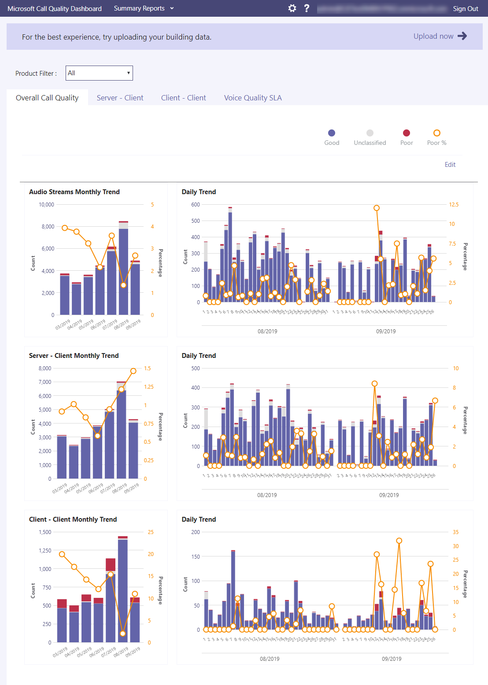

# ¿Qué es el Panel de calidad de llamadas (CQD)?What is Call Quality Dashboard (CQD)?

El Panel de calidad de llamadas de Microsoft (CQD): muestra la calidad de las llamadas y reuniones, a nivel de toda la [https://cqd.teams.microsoft.com](https://cqd.teams.microsoft.com) organización, para Microsoft Teams, Skype Empresarial Online y Skype Empresarial Server 2019.The Microsoft Call Quality Dashboard (CQD) - [https://cqd.teams.microsoft.com](https://cqd.teams.microsoft.com) - shows call and meeting quality, at an **org-wide level**, for Microsoft Teams, Skype for Business Online, and Skype for Business Server 2019. 

  
La última versión de CQD incluye una fuente de datos en tiempo [casi real (NRT),](CQD-data-and-reports.md)lo que significa que los registros de llamadas están disponibles en CQD dentro de los 30 minutos adicionales al final de una llamada.The latest version of CQD features a [near-real-time (NRT) data feed](CQD-data-and-reports.md), which means that call records are available in CQD within 30 minutes of the end of a call.

Siempre que CQD incluya datos de identificación del usuario final [(EUII),](CQD-data-and-reports.md#euii-data)se administra de la misma manera que EUII en [Microsoft 365.](/office365/Enterprise/office-365-data-retention-deletion-and-destruction-overview)Wherever CQD includes [end-user identifiable information (EUII) data](CQD-data-and-reports.md#euii-data), it's managed in the same way as [EUII throughout Microsoft 365](/office365/Enterprise/office-365-data-retention-deletion-and-destruction-overview).

CQD está diseñado para ayudar a administradores de Teams, administradores de Skype Empresarial e ingenieros de red a supervisar la calidad de las llamadas y reuniones a nivel de toda la organización.CQD is designed to help Teams admins, Skype for Business admins, and network engineers monitor call and meeting quality at an org-wide level. Usará CQD para ayudarle a optimizar **la red para** mejorar la calidad del rendimiento.You'll use CQD to help you **optimize your network** to drive performance quality. Cuando necesite buscar información de llamada y reunión para un usuario **específico,** use los datos de CQD junto con el análisis de [llamadas por usuario.](use-call-analytics-to-troubleshoot-poor-call-quality.md)When you need to look into call and meeting information for a **specific user**, use CQD data in conjunction with per-user [call analytics](use-call-analytics-to-troubleshoot-poor-call-quality.md).

Por ejemplo, con CQD, puede determinar que la mala calidad de la llamada de un usuario (que observó con análisis de llamadas por usuario) se debe a un problema de red que también afecta a muchos otros usuarios.For example, using CQD, you can determine that a user's poor call quality (which you observed using per-user call analytics) is due to a network issue that also affects many other users. CQD captura tanto la experiencia de llamada individual como la calidad general de las llamadas realizadas con Teams o Skype Empresarial.CQD captures both the individual call experience and the overall quality of calls made using Teams or Skype for Business. Con CQD, los patrones generales pueden ser evidentes, por lo que los ingenieros de red pueden realizar evaluaciones fundamentadas de la calidad de las llamadas.With CQD, overall patterns may become apparent, so network engineers can make informed assessments of call quality. CQD proporciona informes de métricas de calidad de llamadas que le proporcionan información sobre la calidad general de las llamadas, las transmisiones de cliente-servidor, las transmisiones cliente-cliente y el SLA de calidad [de voz.](https://go.microsoft.com/fwlink/p/?linkid=846252)CQD provides reports of call quality metrics that give you insight into overall call quality, server-client streams, client-client streams, and voice quality [SLA](https://go.microsoft.com/fwlink/p/?linkid=846252). 
  

En CQD, le recomendamos que cargue información de creación y punto de conexión, lo que le permite usar Location-Enhanced Informes para analizar la calidad y la confiabilidad de las llamadas dentro del edificio de un usuario.In CQD, we encourage you to upload building and endpoint information, which lets you use Location-Enhanced Reports to analyze call quality and reliability within a user's building. Los datos se pueden evaluar para determinar si el problema está aislado para un solo usuario o afecta a un segmento más grande de usuarios.The data can be assessed to determine if the problem is isolated to a single user or affects a larger segment of users. Para activar la creación o las vistas específicas del  punto de conexión en CQD, un administrador debe cargar información de creación o punto de conexión en la página Carga de datos del inquilino CQD. To turn on building or endpoint-specific views in CQD, an admin must [upload building or endpoint information](CQD-upload-tenant-building-data.md) on the CQD **Tenant Data Upload** page.

No se pierda  nuestro artículo Administrar la calidad de las llamadas y reuniones, que ofrece instrucciones detalladas para el administrador de Teams o el ingeniero de soporte técnico responsable de administrar la calidad del servicio en Teams.Don't miss our [Manage call and meeting quality](quality-of-experience-review-guide.md) article, which offers in-depth guidance for the Teams admin or support engineer responsible for managing service quality in Teams.

## Versión anterior de CQD (CQD.lync.com)Older version of CQD (CQD.lync.com)

La versión actual de CQD ( reemplaza la https://CQD.Teams.microsoft.com) versión anterior de CQD ( https://CQD.lync.com) .The current version of CQD (https://CQD.Teams.microsoft.com) is replacing the older version of CQD (https://CQD.lync.com). Todavía puede usar CQD.lync.com (disponible en el Centro de administración de Skype Empresarial), pero a partir del 1 de julio de 2020, está usando los datos de CQD. Teams.microsoft.com.You can still use CQD.lync.com (available from the Skype for Business admin center), but as of July 1, 2020, it's using the data from CQD.Teams.microsoft.com. Desactivaremos el acceso a CQD.lync.com, por lo que deberías moverte a CQD. Teams.microsoft.com si aún no lo ha hecho.We'll turn off access to CQD.lync.com soon, so you should move to CQD.Teams.microsoft.com if you haven't already done so.

> [!IMPORTANT]
> A partir del 1 de julio de 2020, ya no puede ver ni modificar los datos de creación o consulta desde el antiguo CQD (CQD.lync.com).As of July 1, 2020, you can no longer view or modify your building or query data from the old CQD (CQD.lync.com). Si aún no ha migrado estos datos desde CQD.lync.com y los sigue necesitando, registre un vale de soporte técnico.If you haven't already migrated this data from CQD.lync.com and still need it, log a support ticket.

## Usar Power BI para analizar datos CQDUse Power BI to analyze CQD data

Nuevo en enero de 2020: Descargar plantillas de consulta [de Power BI para CQD.](https://github.com/MicrosoftDocs/OfficeDocs-SkypeForBusiness/blob/live/Teams/downloads/CQD-Power-BI-query-templates.zip?raw=true)New in January 2020: [Download Power BI query templates for CQD](https://github.com/MicrosoftDocs/OfficeDocs-SkypeForBusiness/blob/live/Teams/downloads/CQD-Power-BI-query-templates.zip?raw=true). Plantillas de Power BI personalizables que puede usar para analizar e informar de los datos de CQD.Customizable Power BI templates you can use to analyze and report your CQD data.

Lea [Usar Power BI para analizar datos CQD](CQD-Power-BI-query-templates.md) para obtener más información.Read [Use Power BI to analyze CQD data](CQD-Power-BI-query-templates.md) to learn more.

## Temas relacionadosRelated topics

[Mejorar y supervisar la calidad de las llamadas de TeamsImprove and monitor call quality for Teams](monitor-call-quality-qos.md)

[Configurar el panel de calidad de llamadas (CQD)Set up Call Quality Dashboard (CQD)](turning-on-and-using-call-quality-dashboard.md)

[Cargar datos de inquilino y creaciónUpload tenant and building data](CQD-upload-tenant-building-data.md)

[Datos e informes de CQDCQD data and reports](CQD-data-and-reports.md)

[Usar CQD para administrar la calidad de las llamadas y las reunionesUse CQD to manage call and meeting quality](quality-of-experience-review-guide.md)

[Dimensiones y medidas disponibles en CQDDimensions and measures available in CQD](dimensions-and-measures-available-in-call-quality-dashboard.md)

[Clasificación de secuencias en CQDStream Classification in CQD](stream-classification-in-call-quality-dashboard.md)

[Usar Power BI para analizar datos CQDUse Power BI to analyze CQD data](CQD-Power-BI-query-templates.md)

[Solución de problemas de TeamsTeams Troubleshooting](/MicrosoftTeams/troubleshoot/teams)