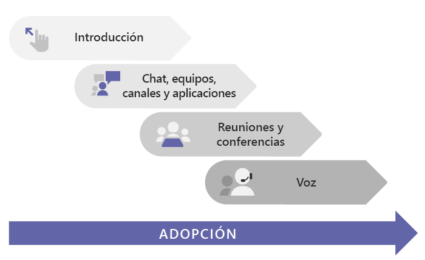

# Cómo implementar Microsoft TeamsHow to roll out Microsoft Teams

## Empiece aquíStart here
Tanto si es una pequeña empresa como una empresa multinacional, el punto de partida para implementar equipos es [Introducción](get-started-with-teams-quick-start.md).Whether you're a small business or a multi-national enterprise, the place to start for rolling out Teams is [Get started](get-started-with-teams-quick-start.md). Le guiará a través de una implementación de Teams a pequeña escala, que puede ser todo lo que necesita si es una pequeña empresa.It walks you through a small-scale Teams rollout, which may be all you need if you're a small business. Si es una organización más grande, use [Introducción](get-started-with-teams-quick-start.md) para probar Teams con un grupo pequeño de primeros usuarios para que pueda familiarizarse con Teams y empezar a planear la implementación en toda la organización.If you're a larger organization, use [Get started](get-started-with-teams-quick-start.md) to pilot Teams with a small group of early adopters so you can learn about Teams and start planning your org-wide deployment. 

## Ruta recomendada para TeamsRecommended path to Teams

Recomendamos implementar Teams por fases, con una carga de trabajo cada vez, en función de la preparación de su organización.We recommend rolling out Teams in stages, workload by workload, as your organization is ready. **No tiene que esperar hasta que se haya completado un paso antes de pasar al siguiente.****You don’t have to wait until you've completed one step before you move to the next.** Es posible que algunas organizaciones quieran implementar todas las características de Teams a la vez, mientras que otras pueden preferir un enfoque por fases.Some orgs may want to roll out all Teams features at once, while others may prefer a phased approach. Estas son las cargas de trabajo de Teams, en el orden en que se recomienda implementarlas:Here are the Teams workloads, in the order we recommend rolling them out:

- [IntroducciónGet started](get-started-with-teams-quick-start.md)
- [Chat, equipos, canales y aplicacionesChat, teams, channels, & apps](deploy-chat-teams-channels-microsoft-teams-landing-page.md)
- [Reuniones y conferenciasMeetings & conferencing](deploy-meetings-microsoft-teams-landing-page.md)
- [Voz en la nubeCloud voice](cloud-voice-landing-page.md)

[Centro de adopción](adopt-microsoft-teams-landing-page.md): durante la implementación de Teams, asegúrese de aprovechar estos recursos para ayudar a impulsar la adopción de Teams.[Adoption hub](adopt-microsoft-teams-landing-page.md): Throughout your Teams rollout, be sure to take advantage of these resources to help drive Teams adoption.

## Si parte de implementaciones de Skype Empresarial, locales o híbridasIf you're starting from Skype for Business, on-premises, or hybrid deployments

Si migra a Teams desde Skype Empresarial (en línea o local), o si necesita una configuración híbrida, también debe seguir la [ruta recomendada](#recommended-path-to-teams) anteriormente para implementar Teams, pero primero deberá realizar algunos pasos de planificación adicionales.If you're coming to Teams from Skype for Business (online or on premises), or if you need a hybrid configuration, you still want to follow the [recommended path](#recommended-path-to-teams) above for rolling out Teams, but first you need to do some extra planning. Comience por revisar las instrucciones de la tabla siguiente que se apliquen al perfil de su organización.Start by reviewing the guidance in the table below that applies to your organization's profile.

|  |Perfil de su organizaciónYour organization's profile|InstruccionesGuidance  |
|---------|---------|---------|
||Actualmente utilizo Skype Empresarial Online y estoy listo para migrar a Teams.I'm currently using Skype for Business Online, and I'm ready to move to Teams. |Vaya a [Actualizar a Teams](upgrade-start-here.md).Go to [Upgrade to Teams](upgrade-start-here.md).        |
||Mi organización utiliza Skype Empresarial Server y quiero implementar Teams.My organization is running Skype for Business Server, and I want to roll out Teams. |Para una implementación de Teams a gran escala, primero deberá configurar la conectividad híbrida entre el entorno local y Microsoft 365.For a full-scale Teams rollout, first you need to configure hybrid connectivity between your on-premises environment and Microsoft 365. Empiece por leer [Planear la conectividad híbrida entre Skype Empresarial Server y Office 365](https://docs.microsoft.com/skypeforbusiness/hybrid/plan-hybrid-connectivity).Start by reading [Plan hybrid connectivity between Skype for Business Server and Office 365](https://docs.microsoft.com/skypeforbusiness/hybrid/plan-hybrid-connectivity).   También debería consultar [Actualizar a Teams](upgrade-start-here.md).You should also review [Upgrade to Teams](upgrade-start-here.md).    |
||No tengo Skype Empresarial Server, pero tengo una solución RTC local.I don't have Skype for Business Server, but I do have an on-premises PSTN solution. Quiero implementar Teams, pero quiero conservar mi solución RTC local.I want to roll out Teams, but I want to keep my on-premises PSTN solution. |Implemente Teams siguiendo la [ruta recomendada](#recommended-path-to-teams) anteriormente.Roll out Teams following  the [recommended path](#recommended-path-to-teams) above.  Después, lea [Planear el enrutamiento directo](direct-routing-plan.md) para obtener información sobre el uso de enrutamiento directo del sistema telefónico para conectar su solución RTC local con Teams.Then read [Plan Direct Routing](direct-routing-plan.md) to learn about using Phone System Direct Routing to hook up your on-premises PSTN solution with Teams.|
|

