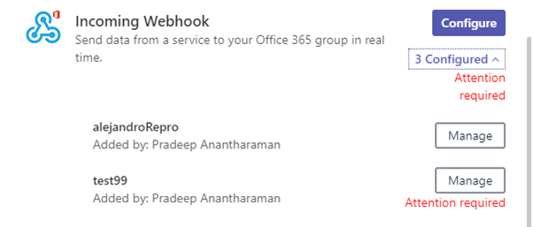
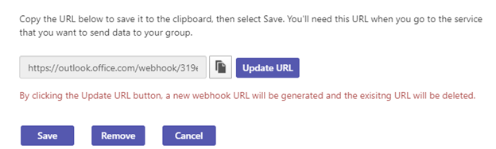

# Use Microsoft 365 y conectores personalizados en Microsoft Teams

Los conectores mantienen al equipo actualizado al ofrecer actualizaciones de servicio y contenido que se usan con frecuencia directamente en un canal. Con conectores, los Microsoft Teams usuarios pueden recibir actualizaciones de servicios populares como Trello, Wunderlist, GitHub y Azure DevOps Services dentro de la transmisión de chat de su equipo.

Cualquier miembro de un equipo puede conectar su equipo a los servicios en la nube populares con los conectores si los permisos del equipo lo permiten y se notifica a todos los miembros del equipo de las actividades de ese servicio. Los conectores seguirán funcionando incluso después de que el miembro que haya configurado inicialmente el conector se haya ido. Cualquier miembro del equipo con los permisos para agregar o quitar puede modificar los conectores configurados por otros miembros.

Microsoft 365 conectores se pueden usar con grupos Microsoft Teams y Microsoft 365, lo que facilita que todos los miembros se sincronicen y reciban información relevante rápidamente. Tanto Microsoft Teams como Exchange el mismo modelo de conector, lo que le permite usar los mismos conectores en ambas plataformas. Sin embargo, vale la pena señalar que deshabilitar los conectores para el grupo de Microsoft 365 del que depende un equipo también deshabilitará la capacidad de crear conectores para ese equipo.

> [!NOTE]
> Los conectores están deshabilitados de forma predeterminada GCC entornos. Si necesita habilitarlos, establezca los parámetros ConnectorsEnabled o ConnectorsEnabledForTeams en $true con el cmdlet [Set-OrganizationConfig.](/powershell/module/exchange/set-organizationconfig) Anteriormente, necesita [conectarse a Exchange Online PowerShell](/powershell/exchange/connect-to-exchange-online-powershell).

> [!NOTE]
> Los conectores están deshabilitados de forma predeterminada en los entornos de Community (GCC) gubernamentales. Si necesita habilitarlos, establezca los parámetros ConnectorsEnabled o ConnectorsEnabledForTeams en $true con el cmdlet [SetOrganizationConfig.](/powershell/module/exchange/set-organizationconfig?view=exchange-ps) Anteriormente tenía que conectarse a la [Exchange Online PowerShell.](/powershell/exchange/connect-to-exchange-online-powershell?view=exchange-ps)

## Agregar un conector a un canal

Actualmente, puede agregar conectores mediante Microsoft Teams de escritorio y web. Sin embargo, la información publicada por estos conectores se puede ver en **todos los clientes,** incluido el móvil.

1. Para agregar un conector a un canal, haga clic en los **puntos suspensivos (...),** a la derecha del nombre de un canal y, a continuación, haga clic **en Conectores.**

    > [!div class="mx-imgBorder"]
    > 

2. Puede seleccionar entre una variedad de conectores disponibles y, a continuación, hacer clic en **Agregar**.

    > [!div class="mx-imgBorder"]
    > 

3. Complete la información necesaria del conector seleccionado y haga clic en **Guardar**. Cada conector requiere un conjunto diverso de información para funcionar correctamente; incluso es posible que algunos le pidan iniciar sesión en el servicio mediante los vínculos provistos en la página de configuración del conector.

    > [!div class="mx-imgBorder"]
    > 

4. Los datos proporcionados por el conector se publican automáticamente en el canal.

    > [!div class="mx-imgBorder"]
    > 

<!---Delete this section after customer migration to new Webhook URL is complete--->
> [!IMPORTANT]
> **Notificación de actualización de URL del conector**
>
> Los Teams están transfiriendo a una nueva dirección URL para mejorar la seguridad. Durante el transcurso de esta transición, recibirá determinadas notificaciones para actualizar el conector configurado para usar la nueva dirección URL. Se recomienda encarecidamente que actualice el conector inmediatamente para evitar cualquier interrupción en los servicios de conector. Es necesario seguir los pasos siguientes para actualizar la dirección URL:
> 1. En la página de configuración de conectores, se mostrará un mensaje "Atención requerida" en el botón "Administrar" para las conexiones que deben actualizarse.
> 
> 2. Para los conectores de webhook entrantes, los usuarios pueden volver a crear la conexión simplemente seleccionando Actualizar **dirección URL** y usando la dirección URL de webhook recién generada.
> 
> 3. Para otros tipos de conector, el usuario tendría que quitar el conector y volver a crear la configuración del conector.
> 4. Verá un mensaje "La dirección URL está actualizada" después de que la dirección URL se haya actualizado correctamente.
> 

## Desarrollar conectores personalizados

También puede crear conectores personalizados, así como webhooks entrantes y salientes. Consulte nuestra[ documentación para desarrolladores ](/microsoftteams/platform/webhooks-and-connectors/what-are-webhooks-and-connectors)para obtener más información.
