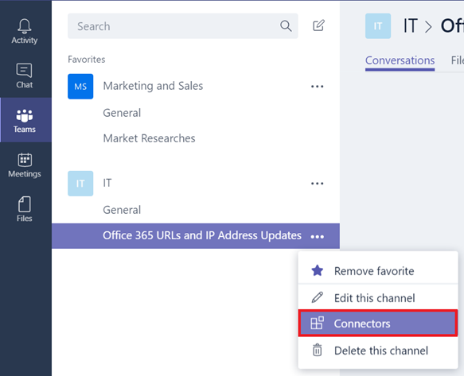
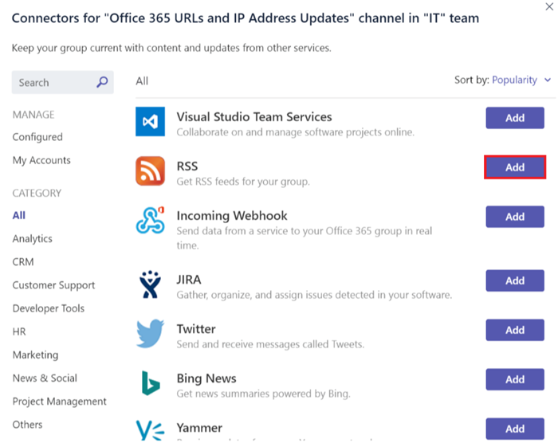

Usar Office 365 y conectores personalizados en Microsoft TeamsUse Office 365 and custom connectors in Microsoft Teams
=======================================================

Los conectores mantienen a su equipo al día al brindarles, directamente en un canal, contenido y actualizaciones de servicios que se utilizan con frecuencia. Con los conectores, los usuarios de Microsoft Teams pueden recibir actualizaciones de servicios populares como Twitter, Trello, Wunderlist, GitHub y VSTS en el flujo de chat de su equipo.Connectors keep your team current by delivering content and updates from services you frequently use directly into a channel. With connectors, your Microsoft Teams users can receive updates from popular services such as Twitter, Trello, Wunderlist, GitHub, and VSTS within the chat stream in their team.

Cualquier miembro de un equipo puede conectar su equipo con servicios en la nube populares a través de los conectores, y se notifica a todos los miembros del equipo sobre las actividades de ese servicio. Si se quita a un usuario de un equipo, los conectores que el usuario eliminado agregó dejan de funcionar. Las reuniones programadas siguen en efecto porque se encuentran en el calendario del grupo.Any member of a team can connect their team to popular cloud services with the connectors, and all team members are notified of activities from that service. If a user is removed from a team, any connectors added to the team by the removed user do stop working. Scheduled meetings continue to work because they're on the group calendar.

Los conectores de Office 365 pueden utilizarse con Microsoft Teams y grupos de Office 365, lo cual facilita que todos los miembros puedan estar sincronizados y recibir información relevante rápidamente. Tanto Microsoft Teams como Exchange utilizan el mismo modelo de conectores, lo que permite que pueda usar los mismos conectores en ambas plataformas.Office 365 connectors can be used with both Microsoft Teams and Office 365 groups, making it easier for all members stay in sync and receive relevant information quickly. Both Microsoft Teams and Exchange use the same connector model, which allows you to use the same connectors within both platforms.

Actualmente, es posible agregar conectores mediante los clientes de escritorio y web de Microsoft Teams. Sin embargo, la información publicada por estos conectores puede verse en **todos los clientes**, incluso el móvil.Currently, connectors can be added by using Microsoft Teams desktop and web clients. However, information posted by these connectors can be viewed using **all clients** including mobile.

1.  Para agregar un conector a un canal, haga clic en los **puntos suspensivos (...)** a la derecha del nombre del canal y, a continuación, haga clic en **Conectores**.To add a connector to a channel, click the **ellipses (…),** on the right of a channel name, then click **Connectors.**

    

2.  Los usuarios pueden seleccionar entre una variedad de conectores disponibles y, a continuación, deben hacer clic en **Agregar**.Users can select from a variety of available connectors, then click **Add**.

    

3.  Complete la información necesaria del conector seleccionado y haga clic en **Guardar**. Cada conector requiere un conjunto diverso de información para funcionar correctamente; incluso es posible que algunos le pidan iniciar sesión en el servicio mediante los vínculos provistos en la página de configuración del conector.Fill in the required information of the selected connector and click **Save**. Each connector requires a diverse set of information to function properly, and some may require you to sign in to the service using the links provided on the connector configuration page.

    

4.  Los datos proporcionados por el conector se publican automáticamente en el canal.Data provided by the connector is automatically posted to the channel.

    

Desarrollar conectores personalizadosDevelop custom connectors
-----------------------------

Es muy fácil desarrollar conectores personalizados que puedan integrarse en sus aplicaciones de línea de negocio (LOB). Puede usar el conector integrado **webhook entrante** para crear un perímetro para un canal, que extraiga datos de cualquier ubicación mediante métodos de registro HTTP.It is very easy to develop custom connectors that can integrate into your Line-of-Business (LOB) applications. You can use the built-in **Incoming Webhook** connector to create an endpoint for a channel, that pulls data from any application using HTTP post methods.

1.  Agregue **webhook entrante** como lo haría con cualquier otro conector.Add the **Incoming Webhook** like any other connector.

    

2.  Para crear un webhook, especifique un **nombre**, actualice la imagen de webhook y haga clic en **Crear**.To create a Webhook, specify a **name**, update the Webhook image, if necessary, and click **Create**.

    

3.  Las aplicaciones que insertan datos en este canal requieren una URL del conector webhook. Se crea una **URL única** al crear el **webhook**. Comparta esta URL con sus desarrolladores, de modo que puedan configurar sus aplicaciones para insertar datos, según sea necesario.Applications that push data to this channel, require the Webhook connector URL. A **unique URL** is created when you created the **Webhook**. Share this URL with your developers, so that they can configure their applications to push data, as needed.

    

4.  Cuando una aplicación externa inserta datos en un conector, el mensaje se muestra en la lista de conversaciones del canal como un mensaje especial denominado mensaje de **tarjeta de conector**.When an external application pushes data to a connector, the message is shown in the channel conversation list as a special message called a **Connector Card** message.

    

Los desarrolladores pueden configurar sus aplicaciones para crear estas tarjetas. Para esto, deben enviar una solicitud HTTP con una carga JSON simple a una dirección de webhook de Microsoft Teams, que es una URL única para ese perímetro, proporcionada por el asistente. Pídales a sus desarrolladores que consulten [Comenzar a trabajar con conectores de Office 365 para Microsoft Teams](https://go.microsoft.com/fwlink/?linkid=855783), en Microsoft Developer Network, que incluye instrucciones detalladas y ejemplos de conectores. Otros recursos que pueden consultar son [Conectar aplicaciones a sus grupos en Outlook](https://support.office.com/en-us/article/Connect-apps-to-your-groups-in-Outlook-ed0ce547-038f-4902-b9b3-9e518ae6fbab) y [Office Dev Center para Microsoft Teams](https://go.microsoft.com/fwlink/?linkid=855784).Developers can configure their applications to create these cards, by sending an HTTP request with a simple JSON payload to a Microsoft Team’s Webhook address, that is a unique URL of that endpoint provided by the wizard. Have your developers refer to [Getting started with Office 365 Connectors for Microsoft Teams](https://go.microsoft.com/fwlink/?linkid=855783), on the Microsoft Developer Network, with detailed instructions and connector samples. Other resources include [Connect apps to your groups in Outlook](https://support.office.com/en-us/article/Connect-apps-to-your-groups-in-Outlook-ed0ce547-038f-4902-b9b3-9e518ae6fbab) and the [Office Dev Center – Microsoft Teams](https://go.microsoft.com/fwlink/?linkid=855784).
