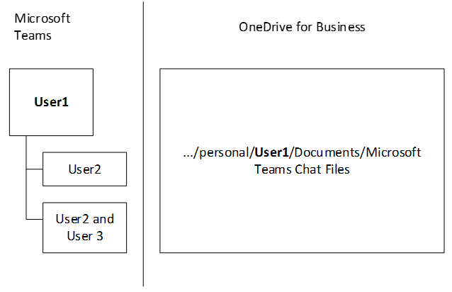

# Interacción de SharePoint Online y OneDrive para la Empresa con Microsoft Teams

> [!Tip]
> Vea la siguiente sesión para obtener información sobre cómo Teams interactúa con Azure Active Directory (AAD), grupos de Office 365, Exchange, SharePoint y OneDrive para la empresa: [bases de Microsoft Teams](https://aka.ms/teams-foundations)

Cada equipo de Microsoft Teams tiene un sitio de grupo en SharePoint Online y cada canal estándar de un equipo obtiene una carpeta dentro de la biblioteca de documentos predeterminada del sitio de grupo. Los archivos compartidos en una conversación se agregan automáticamente a la biblioteca de documentos y los permisos y las opciones de seguridad de archivos establecidos en SharePoint se reflejan automáticamente en Teams.

> [!NOTE]
> Este artículo se aplica solo a los canales estándar. La arquitectura de los canales privados es diferente de la de los canales estándar. Cada canal privado tiene su propia colección de sitios de SharePoint que es independiente del sitio de grupo primario. Para obtener más información, consulte [canales privados en Microsoft Teams](private-channels.md).

Los archivos de chats privados se almacenan en la carpeta de OneDrive para la Empresa del remitente y se conceden permisos automáticamente a todos los participantes como parte del proceso de compartir archivos.

Si los usuarios no tienen asignada ni habilitada licencias de SharePoint Online, no tienen almacenamiento de OneDrive para la empresa en Office 365. El uso compartido de archivos seguirá funcionando en canales estándar, pero los usuarios no podrán compartir archivos en chats sin el almacenamiento de OneDrive para la empresa en Office 365.

Al almacenar archivos en la biblioteca de documentos de SharePoint Online y OneDrive para la Empresa, se siguen todas las reglas de cumplimiento configuradas en el nivel de inquilino. 

> [!NOTE]
> En este momento, la integración con SharePoint local no es compatible con Microsoft Teams.

A continuación se encuentra el ejemplo de relaciones entre equipo, canal estándar y biblioteca de documentos.

Para cada equipo, se crea un sitio de SharePoint y la carpeta **documentos compartidos** es la carpeta predeterminada creada para el equipo. Cada canal estándar, incluido el canal **General** (el canal predeterminado de cada equipo), tiene una carpeta en **documentos compartidos**.

> [!NOTE]
> En este momento no es posible reemplazar el sitio de SharePoint predeterminado y la biblioteca de documentos con otro. Nos han comentado que les gustaría, por lo que estamos pensando en esa posibilidad. Revise el [mapa de ruta de Teams](https://aka.ms/teamsroadmap) o [Teams UserVoice](https://aka.ms/TeamsUserVoice) para estar al tanto de las próximas características.

> [!TIP]
> Para agregar una pestaña a su equipo que tenga un vínculo a una página de un sitio de SharePoint existente o a la biblioteca de documentos de SharePoint existente:
> 1. Seleccione el signo más situado junto a las pestañas.
> 2. Seleccione **SharePoint** para una página de sitio de SharePoint existente o **biblioteca de documentos** para una biblioteca de documentos existente.
> 3. Seleccione la página o biblioteca de documentos adecuada.

Para cada usuario, la carpeta de OneDrive **Archivos de chat de Microsoft Teams** se usa para almacenar todos los archivos compartidos en los chat privados con otros usuarios (1:1 o 1:varios), y los permisos se configuran automáticamente para restringir el acceso sólo a usuarios autorizados.

## Ficha archivos de canal

> [!INCLUDE [new feature coming soon](includes/new-feature-coming-soon-section.md)]

La pestaña **archivos** de Teams es muy similar a la vista documentos de SharePoint. En la pestaña **archivos** , los usuarios pueden:

- Consulte Opciones adicionales en el menú **nuevo** archivo.
- Sincronizar archivos con su unidad local.
- En el menú **todos los documentos** , cambie de la vista de **lista** a la de **lista compacta** a vista de **mosaicos** .
- Identifique los archivos que necesitan atención o tienen malware.
- Ver inmediatamente si un archivo es de solo lectura o desprotegido.
- Desproteger y proteger archivos.
- Anclar, desanclar y cambiar el orden de los archivos.
- Identificar qué archivos necesitan metadatos
- Elija entre más opciones de filtro.
- Agrupar archivos en función de los encabezados de columna.
- Modificar la configuración de las columnas (desplazarse a la izquierda o a la derecha, ocultar) y ancho de columna.

## Configuración de tipo de vínculo predeterminado

SharePoint y OneDrive tienen una configuración de administrador para especificar el tipo de vínculo predeterminado para los vínculos que se crean para un archivo. Teams adopta ese mismo enfoque al reutilizar la configuración que los conjuntos de administradores para SharePoint y OneDrive. Se describen más detalles sobre este enfoque en [cambiar el tipo de vínculo predeterminado cuando los usuarios obtienen vínculos para compartir](https://docs.microsoft.com/sharepoint/change-default-sharing-link). 

## Más información

Para obtener más información acerca de cómo funciona SharePoint con Teams, vea [SharePoint y Teams: mejor juntos](https://techcommunity.microsoft.com/t5/Microsoft-SharePoint-Blog/SharePoint-and-Teams-Better-Together/ba-p/189593).

Para obtener más información sobre la experiencia de invitado en Teams, lea [el aspecto de la experiencia de invitado](guest-experience.md).

