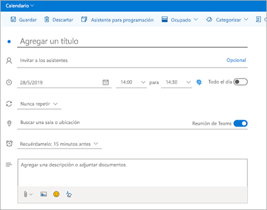
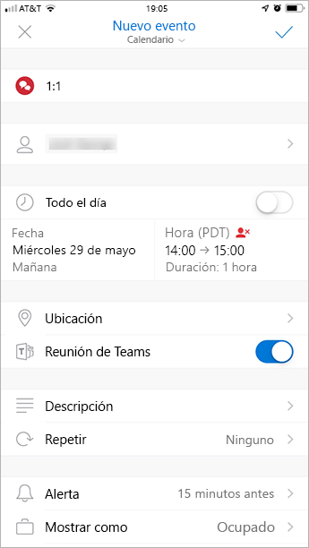

Usar el complemento para reunión de Microsoft Teams en OutlookUse the Teams Meeting add-in in Outlook
=======================================

El complemento para reunión de equipo permite a los usuarios programar reuniones de equipo desde Outlook.The Teams Meeting add-in lets users schedule a Teams meeting from Outlook. El complemento está disponible para Outlook en plataformas Windows, Mac, Web y móviles.The add-in is available for Outlook on Windows, Mac, web, and mobile.

## El complemento para reunión de Microsoft Teams en Outlook para WindowsTeams Meeting add-in in Outlook for Windows

El complemento de reunión de Teams se instala automáticamente para los usuarios que tienen Microsoft Teams y Office 2013, Office 2016 u Office 2019 instalado en su PC con Windows.The Teams Meeting add-in is automatically installed for users who have Microsoft Teams and either Office 2013, Office 2016, or Office 2019 installed on their Windows PC. Los usuarios verán el complemento para reunión de Microsoft Teams en la cinta del Calendario de Outlook.Users will see the Teams Meeting add-in on the Outlook Calendar ribbon.

> [!NOTE]
> - No hay **ninguna dirección URL directa** que se vincule al complemento de Teams.There is **no direct URL** that links to the Teams add-in.
> - Existen otras consideraciones adicionales si su organización ejecuta tanto equipos como Skype empresarial.There are additional considerations if your organization runs both Teams and Skype for Business. En algunas circunstancias, el complemento de Teams no está disponible en Outlook.Under some circumstances, the Teams add-in is not available in Outlook. Para obtener más información, consulte [actualizar de Skype empresarial a teams](https://docs.microsoft.com/microsoftteams/upgrade-to-teams-on-prem-overview#meetings) .See [Upgrade from Skype for Business to Teams](https://docs.microsoft.com/microsoftteams/upgrade-to-teams-on-prem-overview#meetings) for details.
> - Los permisos de usuario para ejecutar el archivo regsvr32.exe son un requisito mínimo para el complemento de reuniones de Teams que se instalará en el equipo.User permissions to execute the Regsvr32.exe file is a minimum requirement for the Teams Meeting add-in to be installed on the computer.
> - Si los usuarios no pueden ver el complemento de Microsoft Teams, pídales que cierren Outlook y Microsoft Teams, y que luego reinicien en primer lugar el cliente de Microsoft Teams y luego el de Outlook, específicamente en ese orden.If users do not see the Teams Meeting add-in, instruct them to close Outlook and Teams, then restart the Teams client first, then sign in to Teams, and then restart the Outlook client, in that specific order.
> - Si usa una instalación de Office Outlook de Microsoft Store, no se admite el complemento de Reuniones de Teams.If you are using an Office Outlook installation from the Microsoft Store, the Teams Meeting add-in isn't supported. Se recomienda a los usuarios que necesiten usar este complemento que instalen la versión de hacer clic y ejecutar de Office, tal como se indica en el artículo [Office en Windows 10 en modo S](https://support.office.com/article/faq-office-on-windows-10-in-s-mode-717193b5-ff9f-4388-84c0-277ddf07fe3f).Users who require this add-in are advised to install Click-to-Run version of Office, as outlined in [Office on Windows 10 in S mode](https://support.office.com/article/faq-office-on-windows-10-in-s-mode-717193b5-ff9f-4388-84c0-277ddf07fe3f) article.

## El complemento para reunión de Microsoft Teams en Outlook para MacTeams Meeting add-in in Outlook for Mac

El botón reunión de equipos de Outlook para Mac aparecerá en la cinta de opciones de Outlook para Mac si Outlook está ejecutando la compilación de producción 16.24.414.0 y versiones posteriores, y se activa con una suscripción de cliente de Microsoft 365 u Office 365.The Teams Meeting button in Outlook for Mac will appear in the Outlook for Mac ribbon if Outlook is running production build 16.24.414.0 and later and is activated with a Microsoft 365 or Office 365 client subscription.

La información de acceso a la reunión (el enlace para unirse a Teams y los números de acceso telefónico) se añadirán a la invitación a la reunión cuando el usuario haga clic en **Enviar**.The meeting coordinates (the Teams join link and dial-in numbers) will be added to the meeting invite after the user clicks **Send**.  

## El complemento para reunión de Microsoft Teams en Outlook Web AppTeams Meeting add-in in Outlook Web App

El botón Reunión de equipo en Outlook Web App se mostrará en la creación del nuevo evento si el usuario se encuentra en una versión anterior de la nueva aplicación de Outlook en la Web.The Teams Meetings button in Outlook Web App will appear as part of new event creation if the user is on an early version of the new Outlook on the web. Consulte el [Blog de Outlook](https://techcommunity.microsoft.com/t5/Outlook-Blog/Designed-to-be-fast-The-Outlook-on-the-web-user-experience-gets/ba-p/234909?utm_source=t.co&utm_medium=referral) para obtener información sobre cómo pueden los usuarios probar la versión anterior de la nueva aplicación de Outlook en la Web.See the [Outlook Blog](https://techcommunity.microsoft.com/t5/Outlook-Blog/Designed-to-be-fast-The-Outlook-on-the-web-user-experience-gets/ba-p/234909?utm_source=t.co&utm_medium=referral) to learn about how users can try the early version of the new Outlook on the web.

Las coordenadas de la reunión (el enlace para unirse a Teams y los números de acceso telefónico) se añadirán a la invitación a la reunión cuando el usuario haga clic en **Enviar**.The meeting coordinates (the Teams join link and dial-in numbers) will be added to the meeting invite after the user clicks **Send**.  

## Complemento de reunión de equipo en Outlook para dispositivos móviles (iOS y Android)Teams Meeting add-in in Outlook mobile (iOS and Android)

En la última compilación de la aplicación de Outlook para iOS y Android se muestra el botón Reunión de equipo.The Teams Meeting button shows up in latest builds of the Outlook iOS and Android app.

Las coordenadas de la reunión (el enlace para unirse a Teams y los números de acceso telefónico) se añadirán a la invitación a la reunión cuando el usuario haga clic en **Enviar**.The meeting coordinates (the Teams join link and dial-in numbers) will be added to the meeting invite after the user clicks **Send**.  

## Complemento de reunión de equipos en FindTime para OutlookTeams Meeting add-in in and FindTime for Outlook

FindTime es un complemento para Outlook que ayuda a los usuarios a alcanzar consenso en una reunión en todas las empresas.FindTime is an add-in for Outlook that helps users reach consensus on a meeting time across companies. Una vez que las invitaciones de reunión han proporcionado las horas preferidas, FindTime envía la invitación a la reunión en nombre del usuario.Once the meeting invitees have provided their preferred times, FindTime sends out the meeting invite on the user's behalf. Si la opción **Reunión en línea**está seleccionada en FindTime, FindTime programará una reunión de Skype Empresarial o de Microsoft Teams.If the **Online meeting** option is selected in FindTime, FindTime will schedule a Skype for Business or Microsoft Teams meeting. (FindTime usará el canal de reunión en línea predeterminado que su organización haya establecido).(FindTime will use whichever has been set by your organization as the default online meeting channel.)

> [!NOTE]  
> Si ha guardado una configuración de Skype Empresarial en su [panel de control de Findtime](https://findtime.microsoft.com/UserDashboard), Findtime la usará en lugar de Microsoft Teams.If you saved a Skype for Business setting in your [Findtime dashboard](https://findtime.microsoft.com/UserDashboard), FindTime will use that instead of Microsoft Teams. Si desea usar Microsoft Teams, elimine la configuración de Skype Empresarial en su panel de control.If you want to use Microsoft Teams, delete the Skype for Business setting in your dashboard.

Para obtener más información, consulte [programar reuniones con FindTime](https://support.office.com/article/scheduling-meetings-with-findtime-4dc806ed-fde3-4ea7-8c5e-b5d1fddab4a6).For more information, see [Schedule meetings with FindTime](https://support.office.com/article/scheduling-meetings-with-findtime-4dc806ed-fde3-4ea7-8c5e-b5d1fddab4a6).

## Requisitos de autenticaciónAuthentication requirements

El complemento para reunión de Microsoft Teams requiere que los usuarios inicien sesión en Microsoft Teams usando la autenticación moderna.The Teams Meeting add-in requires users to sign in to Teams using Modern Authentication. Si los usuarios no usan este método para iniciar sesión, aún podrán usar el cliente de Teams, pero no podrán programar reuniones en línea de Teams mediante el complemento de Outlook.If users do not use this method to sign in, they'll still be able to use the Teams client, but will be unable to schedule Teams online meetings using the Outlook add-in. Puede solucionar este inconveniente de una de las siguientes formas:You can fix this by doing one of the following:

- Si la autenticación moderna no está configurada en su organización, configúrela.If Modern Authentication is not configured for your organization, you should configure Modern Authentication.
- Si la autenticación moderna está configurada, pero el usuario opta por no utilizarla en el cuadro de diálogo, pídale que vuelva a iniciar sesión usando la autenticación multifactor.If Modern Authentication is configured, but they canceled out on the dialog box, you should instruct users to sign in again using multi-factor authentication.

Para obtener más información sobre cómo configurar la autenticación, consulte [Modelos de identidad y autenticación en Microsoft Teams](identify-models-authentication.md).To learn more about how to configure authentication, see [Identity models and authentication in Microsoft Teams](identify-models-authentication.md).

## Habilitar las reuniones privadasEnable private meetings

Para que se implemente el complemento, debe estar habilitado **Permitir la programación de reuniones privadas** en el Centro de administración de Microsoft Teams.**Allow scheduling for private meetings** must be enabled in the Microsoft Teams admin center for the add-in to get deployed. En el centro de administración, vaya a **Reuniones** > **Directivas de reunión** y, en la sección **General**, habilite **Permitir la programación de reuniones privadas**).In the admin center, go to **Meetings** > **Meeting Policies**, and in the **General** section, toggle **Allow scheduling private meetings** to On.)

El cliente de Microsoft Teams determina si los usuarios necesitan la versión de 32 o de 64 bits e instala el complemento correcto.The Teams client installs the correct add-in by determining if users need the 32-bit or 64-bit version.

> [!NOTE]
> Es posible que los usuarios deban reiniciar Outlook después de una instalación o una actualización de Microsoft Teams para obtener el complemento más reciente.Users might need to restart Outlook after an installation or upgrade of Teams to get the latest add-in.

## Directiva de actualización de equipos y complemento reunión de equipos para OutlookTeams upgrade policy and the Teams Meeting add-in for Outlook

Los clientes [pueden elegir la vía de actualización de Skype Empresarial a Teams](upgrade-and-coexistence-of-skypeforbusiness-and-teams.md).Customers can [choose their upgrade journey from Skype for Business to Teams](upgrade-and-coexistence-of-skypeforbusiness-and-teams.md). Los administradores empresariales pueden usar el modo de coexistencia de Teams para definir esta vía para sus usuarios.Tenant admins can use the Teams co-existence mode to define this journey for their users. Los administradores empresariales tienen la opción de permitir a los usuarios utilizar Teams junto con Skype Empresarial (modo Aplicaciones aisladas).Tenant admins have the option to enable users to use Teams alongside Skype for Business (Islands mode). 

Cuando los usuarios que se encuentran en modo de Aplicaciones aisladas programan una reunión en Outlook, normalmente esperan poder decidir si se hará en Skype Empresarial o en Teams.When users who are in Island mode schedule a meeting in Outlook, they typically expect to be able to choose whether to schedule a Skype for Business or a Teams meeting. En Outlook en la web, Outlook Windows y Outlook Mac, los usuarios ven de forma predeterminada los complementos de Skype empresarial y de equipos.In Outlook on the web, Outlook Windows, and Outlook Mac, users see both Skype for Business and Teams add-ins when in Islands mode by default. Puede configurar una configuración de directiva de reunión de Teams para controlar si los usuarios en el modo islas solo pueden usar el complemento de reunión de los equipos o tanto la reunión de los equipos como los complementos de reuniones de Skype empresarial.You can configure a Teams meeting policy setting to control whether users in Islands mode can only use the Teams Meeting add-in or both the Teams Meeting and Skype for Business Meeting add-ins.

Debido a algunas limitaciones de la versión inicial, Outlook para dispositivos móviles solo admite la creación de reuniones de Skype Empresarial **o** de Teams.Due to certain limitations in the initial release, Outlook mobile can only support creating Skype for Business **or** Teams meetings. Consulte la siguiente tabla para obtener información.See the following table for details.

| Modo de coexistencia en el centro de administración de TeamsCoexistence mode in the Teams admin center | Proveedor de reuniones predeterminado en Outlook para dispositivos móvilesDefault meetings provider in Outlook mobile |
| --------------------------------------|---------------------------------------------|
| Aplicaciones aisladasIslands | Skype EmpresarialSkype for Business |
| Solo Skype EmpresarialSkype for Business only | Skype EmpresarialSkype for Business |
| Colaboración de Skype Empresarial con TeamsSkype for Business with Teams collaboration | Skype EmpresarialSkype for Business |
| Colaboración y reuniones de Skype Empresarial con TeamsSkype for Business with Teams collaboration and meetings | TeamsTeams |
| Solo TeamsTeams only | TeamsTeams |

### Establecer si los usuarios en el modo islas solo pueden usar el complemento de reuniones de Teams o la reunión de Teams y complementos de reuniones de Skype empresarialSet whether users in Islands mode can only use the Teams Meeting add-in or both the Teams Meeting and Skype for Business Meeting add-ins

**(próximamente)****(coming soon)**

Como administrador, puede configurar una configuración de directiva de reunión de Teams para controlar el complemento de reunión de Outlook que se usa para *los usuarios que están en modo islas*.As an admin, you can configure a Teams meeting policy setting to control which Outlook meeting add-in is used for *users who are in Islands mode*. Puede especificar si los usuarios solo pueden usar el complemento de reuniones de equipos o bien la reunión de Teams y los complementos de reuniones de Skype empresarial para programar reuniones en Outlook.You can specify whether users can only use the Teams Meeting add-in or both the Teams Meeting and Skype for Business Meeting add-ins to schedule meetings in Outlook.

Solo puede aplicar esta directiva a usuarios que están en modo islas y tener el parámetro **AllowOutlookAddIn** establecido en **true** en la Directiva de reuniones de Teams.You can only apply this policy to users who are in Islands mode and have the **AllowOutlookAddIn** parameter set to **True** in their Teams meeting policy. Para conocer los pasos sobre cómo configurar esta Directiva, vea [establecer el proveedor de la reunión para los usuarios en modo islas](meeting-policies-in-teams.md#meeting-policy-settings---meeting-provider-for-islands-mode).For steps on how to set this policy, see [set the meeting provider for users in Islands mode](meeting-policies-in-teams.md#meeting-policy-settings---meeting-provider-for-islands-mode).

## Otras consideracionesOther considerations

El complemento para reunión de Microsoft Teams sigue en proceso de desarrollo para ampliar sus funcionalidades, por lo que le recomendamos que tenga en cuenta lo siguiente:The Teams Meeting add-in is still building functionality, so be aware of the following:

- Este complemento es para reuniones programadas con participantes específicos, no para reuniones en un canal.The add-in is for scheduled meetings with specific participants, not for meetings in a channel. Las reuniones de canal se deben programar desde Microsoft Teams.Channel meetings must be scheduled from within Teams.
- El complemento no funcionará si un proxy de autenticación se encuentra en la ruta de acceso de red de los servicios de equipo y equipo del usuario.The add-in will not work if an Authentication Proxy is in the network path of the user's PC and Teams Services.
- Los usuarios no pueden programar eventos en directo desde Outlook.Users can't schedule live events from within Outlook. Vaya a Teams para programar eventos en directo.Go to Teams to schedule live events. Para obtener más información, vea [¿Qué son los eventos en directo de Microsoft Teams?](teams-live-events/what-are-teams-live-events.md)For more information, see [What are Microsoft Teams live events?](teams-live-events/what-are-teams-live-events.md).

Obtenga más información sobre [reuniones y llamadas en Microsoft Teams](https://support.office.com/article/Meetings-and-calls-d92432d5-dd0f-4d17-8f69-06096b6b48a8).Learn more about [meetings and calling in Microsoft Teams](https://support.office.com/article/Meetings-and-calls-d92432d5-dd0f-4d17-8f69-06096b6b48a8).

## Solución de problemasTroubleshooting

Realice los pasos siguientes para solucionar problemas con el complemento de reunión de Teams.Use the following steps to troubleshoot issues with the Teams Meeting add-in.

### El complemento de reunión de Teams en Outlook para Windows no se muestraTeams Meeting add-in in Outlook for Windows does not show

Si no consigue instalar el complemento Reunión de Teams para Outlook, pruebe estos pasos para solucionarlo.If you cannot get the Teams Meeting add-in for Outlook to install, try these troubleshooting steps.

- Los usuarios de Windows 7 deben instalar la [Actualización Universal C Runtime en Windows](https://support.microsoft.com/help/2999226/update-for-universal-c-runtime-in-windows) para que el complemento Reunión de Teams funcione.Windows 7 users must install the [Update for Universal C Runtime in Windows](https://support.microsoft.com/help/2999226/update-for-universal-c-runtime-in-windows) for the Teams Meeting add-in to work.
- Compruebe que el usuario tiene una directiva de actualización de teams que permite programar reuniones en Teams.Check that the user has a Teams Upgrade policy which enables scheduling meetings in Teams. Para obtener más información, consulte [actualizar de Skype empresarial a teams](https://docs.microsoft.com/microsoftteams/upgrade-to-teams-on-prem-overview#meetings) .See [Upgrade from Skype for Business to Teams](https://docs.microsoft.com/microsoftteams/upgrade-to-teams-on-prem-overview#meetings) for more details.
- Compruebe que el usuario tiene una directiva de reunión de teams que permite el complemento de Outlook.Check that the user has a Teams Meeting policy that permits the Outlook Add-in. Para obtener más información, vea [Administrar directivas de reunión en Teams](https://docs.microsoft.com/microsoftteams/meeting-policies-in-teams#allow-the-outlook-add-in) .See [Manage meeting policies in Teams](https://docs.microsoft.com/microsoftteams/meeting-policies-in-teams#allow-the-outlook-add-in) for more details.
- Asegúrese de que el usuario tiene instalado el cliente de escritorio de Teams.Ensure the user has the Teams desktop client installed. El complemento de reunión no se instalará cuando solo se use el cliente web de Teams.The meeting add-in will not be installed when only using the Teams web client.
- Asegúrese de que el usuario tiene instalado Outlook 2013 o una versión posterior.Ensure the user has Outlook 2013 or later installed.
- Asegúrese de que el usuario tiene permiso para ejecutar regsvr32. exe.Make sure the user has permission to execute regsvr32.exe.
- Asegúrese de que se hayan aplicado todas las actualizaciones disponibles para el cliente de escritorio de Outlook.Ensure that all available updates for Outlook desktop client have been applied.
- Siga estos pasos:Follow these steps:
  - Reinicie el cliente de escritorio de Teams.Restart the Teams desktop client.
  - Cierre la sesión y vuelva a iniciarla en el cliente de escritorio de Teams.Sign out and then sign back in to the Teams desktop client.
  - Reinicie el cliente de escritorio de Outlook.Restart the Outlook desktop client. (Asegúrese de que Outlook no se esté ejecutando en el modo de administración).(Make sure Outlook isn't running in admin mode.)

Si sigue sin ver el complemento, asegúrese de que no está deshabilitado en Outlook.If you still don't see the add-in, make sure that it isn't disabled in Outlook.

- En Outlook, elija **archivo** y, a continuación, **Opciones**.In Outlook, choose **File** and then **Options**.
- Seleccione la pestaña **Complementos** del cuadro de diálogo **Opciones de Outlook** .Select the **Add-ins** tab of **Outlook Options** dialog box.
- Confirme que el **complemento de reunión de Microsoft Teams para Microsoft Office** aparece en la lista **Complementos de aplicaciones activas**Confirm that **Microsoft Teams Meeting Add-in for Microsoft Office** is listed in the **Active Application Add-ins** list
- Si el complemento de reunión de Teams aparece en la lista **Complementos de aplicaciones deshabilitada** , seleccione **Complementos com** en **administrar** y, después, seleccione **ir...**If the Teams Meeting Add-in is listed in the **Disabled Application Add-ins** list, select **COM Add-ins** in **Manage** and then select **Go…**
- Active la casilla que se encuentra junto al **complemento de reuniones de Microsoft Teams para Microsoft Office**.Set the checkbox next to **Microsoft Teams Meeting Add-in for Microsoft Office**.
- Elija **Aceptar** en todos los cuadros de diálogo y reinicie Outlook.Choose **OK** on all dialog boxes and restart Outlook.

Para obtener instrucciones generales sobre cómo administrar los complementos, vea [ver, administrar e instalar complementos en los programas de Office](https://support.office.com/article/View-manage-and-install-add-ins-in-Office-programs-16278816-1948-4028-91E5-76DCA5380F8D).For general guidance about how to manage add-ins, see [View, manage, and install add-ins in Office programs](https://support.office.com/article/View-manage-and-install-add-ins-in-Office-programs-16278816-1948-4028-91E5-76DCA5380F8D).

Si el complemento sigue sin mostrarse, siga estos pasos para comprobar la configuración del registro.If the add-in still does not show, use the following steps to verify the registry settings.

> [!NOTE]
> La edición incorrecta del registro puede dañar gravemente el sistema.Incorrectly editing the registry may severely damage your system. Antes de realizar cambios en el registro, debe hacer una copia de seguridad de los datos valiosos del equipo.Before making changes to the registry, you should back up any valued data on the computer.
- Iniciar regedit. exeLaunch RegEdit.exe
- Ir a HKEY_CURRENT_USER \Software\Microsoft\Office\Outlook\AddinsNavigate to HKEY_CURRENT_USER\Software\Microsoft\Office\Outlook\Addins
- Verifique que TeamsAddin. FastConnect exista.Verify TeamsAddin.FastConnect exists.
- Dentro de TeamsAddin. FastConnect, compruebe que LoadBehavior exista y esté establecido en 3.Within TeamsAddin.FastConnect, verify LoadBehavior exists and is set to 3.
  - Si LoadBehavior tiene un valor distinto de 3, cámbielo a 3 y reinicie Outlook.If LoadBehavior has a value other than 3, change it to 3 and restart Outlook.

### La programación delegada no funcionaDelegate scheduling does not work

Si el administrador ha configurado Microsoft Exchange para [controlar el acceso al servidor Web de Exchange (EWS)](https://docs.microsoft.com/exchange/client-developer/exchange-web-services/how-to-control-access-to-ews-in-exchange), el delegado no podrá programar una reunión de Teams en nombre del jefe.If your administrator has configured Microsoft Exchange to [control access to Exchange Web Server (EWS)](https://docs.microsoft.com/exchange/client-developer/exchange-web-services/how-to-control-access-to-ews-in-exchange), a delegate won't be able to schedule a Teams meeting on behalf of the boss. La solución para esta configuración está en desarrollo y se publicará en el futuro.The solution for this configuration is under development and will be released in the future. 
