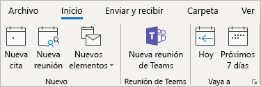

Usar el complemento para reunión de Microsoft Teams en OutlookUse the Teams Meeting add-in in Outlook
=======================================
> [!IMPORTANT]
> [!INCLUDE [new-teams-sfb-admin-center-notice](includes/new-teams-sfb-admin-center-notice.md)]

El complemento para reunión de Microsoft Teams se instala automáticamente para los usuarios que tienen instalado Microsoft Teams y Office 2013 o 2016 en su equipo Windows.The Teams Meeting add-in is automatically installed for users who have Microsoft Teams and either Office 2013 or Office 2016 installed on their Windows PC. Los usuarios verán el complemento para reunión de Microsoft Teams en la cinta del Calendario de Outlook.Users will see the Teams Meeting add-in on the Outlook Calendar ribbon. 

Si los usuarios no pueden ver el complemento de Microsoft Teams, pídales que cierren Outlook y Microsoft Teams, y que luego reinicien en primer lugar el cliente de Microsoft Teams y luego el de Outlook, específicamente en ese orden.If users do not see the Teams Meeting add-in, instruct them to close Outlook and Teams, then restart the Teams client first, then sign in to Teams, and then restart the Outlook client, in that specific order.

> [!NOTE]
> El complemento para reunión de Microsoft Teams para Outlook no está disponible actualmente para usuarios de Mac.The Teams Meeting add-in for Outlook is currently not available for Mac users.

## Requisitos de autenticaciónAuthentication requirements

El complemento para reunión de Microsoft Teams requiere que los usuarios inicien sesión en Microsoft Teams usando la autenticación moderna.The Teams Meeting add-in requires users to sign in to Teams using Modern Authentication. Aunque los usuarios no usen este método para iniciar sesión, podrán usar el cliente de Microsoft Teams, pero no podrán programar reuniones en línea de Microsoft Teams usando el complemento de Outlook.If users do not use this method to sign in, they’ll still be able to use the Teams client, but will be unable to schedule Teams online meetings using the Outlook add-in. Puede solucionar este inconveniente de una de las siguientes formas:You can fix this by doing one of the following:

- Si la autenticación moderna no está configurada en su organización, configúrela.If Modern Authentication is not configured for your organization, you should configure Modern Authentication.
- Si la autenticación moderna está configurada, pero el usuario opta por no utilizarla en el cuadro de diálogo, pídale que vuelva a iniciar sesión usando la autenticación multifactor.If Modern Authentication is configured, but they cancelled out on the dialog box, you should instruct users to sign in again using multi-factor authentication.

Para obtener más información sobre cómo configurar la autenticación, consulte [Modelos de identidad y autenticación en Microsoft Teams](identify-models-authentication.md).To learn more about how to configure authentication, see [Identity models and authentication in Microsoft Teams](identify-models-authentication.md).

## Habilitar las reuniones privadasEnable private meetings

Permitir la programación para reuniones privadas debe estar habilitada en los equipos & Skype para el centro de administración de negocio para el complemento para obtener implementado.Allow scheduling for private meetings must be enabled in the Teams & Skype for Business Admin Center for the plug-in to get deployed. En el centro de administración, vaya a **las reuniones** > **Las directivas de reunión**y en la sección **General** , alternar **permitir programar reuniones privadas** a activado.)In the admin center, go to **Meetings** > **Meeting Policies**, and in the **General** section, toggle **Allow scheduling private meetings** to On.)

El cliente de Microsoft Teams determina si los usuarios necesitan la versión de 32 o de 64 bits e instala el complemento correcto.The Teams client installs the correct add-in by determining if users need the 32-bit or 64-bit version.

> [!NOTE]
> Es posible que los usuarios deban reiniciar Outlook después de una instalación o una actualización de Microsoft Teams para obtener el complemento más reciente.Users might need to restart Outlook after an installation or upgrade of Teams to get the latest add-in.

## Otras consideracionesOther considerations

El complemento para reunión de Microsoft Teams sigue en proceso de desarrollo para ampliar sus funcionalidades, por lo que le recomendamos que tenga en cuenta lo siguiente:The Teams Meeting add-in is still building functionality, so be aware of the following:
- Algunas características de reunión en línea, como la grabación, los sondeos y el uso de pizarras todavía no están disponibles.Some online meeting features, such as recording, polling, and whiteboarding are not yet available.
- Las opciones de reunión no están disponibles actualmente.Meeting options are currently not available.
- En estos momentos, solo es posible invitar a personas de su compañía, dado que los usuarios externos todavía no pueden unirse a las reuniones.Currently, you can only invite people from within your company, as it is not yet possible for external users to join meetings.
- Este complemento es para reuniones programadas con participantes específicos, no para reuniones en un canal.The add-in is for scheduled meetings with specific participants, not for meetings in a channel. Las reuniones de canal se deben programar desde Microsoft Teams.Channel meetings must be scheduled from within Teams. Actualmente, el complemento para reunión de Microsoft Teams en Outlook solo está disponible para usuarios de Windows, pero próximamente será compatible con Mac.Currently, the Teams Meeting add-in in Outlook is only available for Windows users, but support for Mac is coming.
- El complemento no funciona si hay un proxy de autenticación en la ruta de red entre el equipo del usuario y los servicios de Microsoft Teams.The add-in will not work if an Authentication Proxy is in the network path of user's PC and Teams Services.
- El complemento se van a implantar incrementalmente y es posible que no esté disponible para su organización todavía.The add-in is being rolled out incrementally and might not be available for your organization yet.

## Solución de problemasTroubleshooting

Si no se puede obtener la reunión de los equipos de complemento para Outlook instalar, intente estos pasos para solucionar problemas.If you cannot get the Teams Meeting add-in for Outlook to install, try these troubleshooting steps.

- Asegúrese de que se han aplicado todas las actualizaciones disponibles para el cliente de escritorio de OutlookEnsure all available updates for Outlook desktop client have been applied 
- Reinicie al cliente de escritorio de los equipos.Restart the Teams desktop client.
- Cierre la sesión y, a continuación, iniciar una sesión en el cliente de escritorio de los equipos.Sign out and then sign back in to the Teams desktop client.
- Reinicie al cliente de escritorio de Outlook.Restart the Outlook desktop client. (Asegúrese de que Outlook no se está ejecutando en modo de administrador.)(Make sure Outlook isn’t running in admin mode.)
- Asegúrese de que el nombre de cuenta de usuario que inició sesión no contiene espacios.Make sure the logged-in user account name does not contain spaces. (Esto es un problema conocido y se solucionará en una futura actualización.)(This is a known issue, and will be fixed in a future update.)
- Asegúrese de que está habilitado el inicio de sesión único (SSO).Make sure single sign-on (SSO) is enabled.

Para obtener instrucciones generales sobre cómo desactivar complementos, consulte [Ver, administrar e instalar los complementos de los programas de Office](https://support.office.com/article/View-manage-and-install-add-ins-in-Office-programs-16278816-1948-4028-91E5-76DCA5380F8D).For general guidance about how to disable add-ins, see [View, manage, and install add-ins in Office programs](https://support.office.com/article/View-manage-and-install-add-ins-in-Office-programs-16278816-1948-4028-91E5-76DCA5380F8D).

Obtenga más información sobre [reuniones y llamadas en Microsoft Teams](https://support.office.com/article/Meetings-and-calls-d92432d5-dd0f-4d17-8f69-06096b6b48a8).Learn more about [meetings and calling in Microsoft Teams](https://support.office.com/article/Meetings-and-calls-d92432d5-dd0f-4d17-8f69-06096b6b48a8).

[!INCLUDE [new-feature-availability](includes/new-feature-availability.md)]

