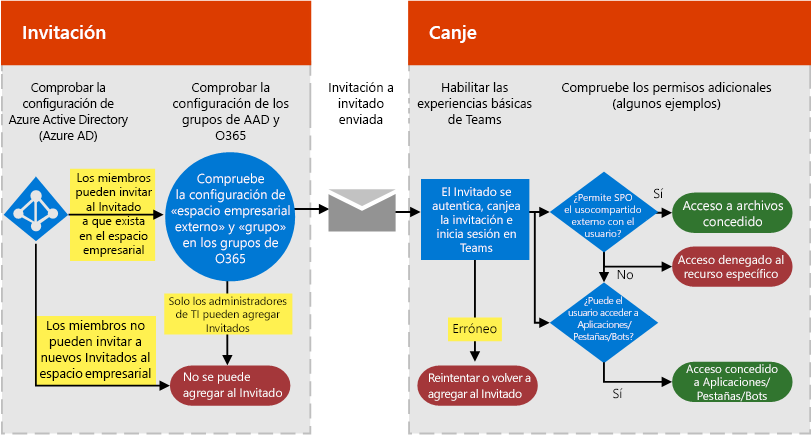
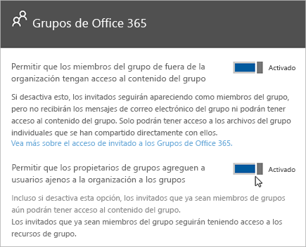

Autorizar el acceso de invitado en Microsoft TeamsAuthorize guest access in Microsoft Teams
===========================================

Para satisfacer los requisitos de su organización, puede administrar las funcionalidades y las características de acceso de invitado de Microsoft Teams a través de cuatro niveles de autorización distintos.To satisfy your organization’s requirements, you can manage Microsoft Teams guest access features and capabilities through four different levels of authorization. Todos los niveles de autorización se aplican a su inquilino de Office 365.All the authorization levels apply to your Office 365 tenant. Cada nivel de autorización controla la experiencia de invitado como se muestra a continuación:Each authorization level controls the guest experience as shown below:

- **Azure Active Directory**: el acceso de invitado en Microsoft Teams depende de la plataforma negocio a negocio (B2B) de Azure AD.**Azure Active Directory**: Guest access in Microsoft Teams relies on the Azure AD business-to-business (B2B) platform. Este nivel de autorización controla la experiencia de invitado a nivel de directorio, espacio empresarial y aplicación.Controls the guest experience at the directory, tenant, and application level.
- **Microsoft Teams**: solo controla la experiencia de invitado en Microsoft Teams.**Microsoft Teams**: Controls the guest experience in Microsoft Teams only.
- **Grupos de Office 365**: controla la experiencia de invitado en los Grupos de Office 365 y Microsoft Teams.**Office 365 Groups**: Controls the guest experience in Office 365 Groups and Microsoft Teams.
- **SharePoint Online y OneDrive para la Empresa**: controla la experiencia de invitado en SharePoint Online, OneDrive para la Empresa, Grupos de Office 365 y Microsoft Teams.**SharePoint Online and OneDrive for Business**: Controls the guest experience in SharePoint Online, OneDrive for Business, Office 365 Groups, and Microsoft Teams.

Estos niveles de autorización distintos proporcionan la flexibilidad necesaria para configurar el acceso de invitado para su organización.These different authorization levels provide you with flexibility in how you set up guest access for your organization. Por ejemplo, si no quiere permitir usuarios invitados en su organización de Microsoft Teams pero sí en la organización en general, solo tiene que desactivar el acceso de invitado en Microsoft Teams.For example, if you don’t want to allow guest users in your Microsoft Teams but want to allow it overall in your organization, just turn off guest access in Microsoft Teams. Otro ejemplo: podría habilitar el acceso de invitado en los niveles de Azure AD, Teams y Grupos, pero deshabilitaría la adición de usuarios invitados en equipos seleccionados que tengan un criterio o varios en común, como que la clasificación de datos es igual a confidencial.Another example: You could enable guest access at the AAD, Teams, and Groups levels, but then disable guest users' addition on selected teams that match one or more criteria such as data classification equals confidential. SharePoint Online y OneDrive para la Empresa tienen su propia configuración de acceso de invitado que no depende de Grupos de Office 365.SharePoint Online and OneDrive for Business have their own guest access settings that don't rely on Office 365 Groups.

> [!NOTE]
> Los invitados están sujetos a los límites de servicio de [Office 365](https://go.microsoft.com/fwlink/p/?linkid=282347) y [Azure Active Directory](https://go.microsoft.com/fwlink/p/?linkid=853019).Guests are subject to  [Office 365](https://go.microsoft.com/fwlink/p/?linkid=282347) and [Azure Active Directory](https://go.microsoft.com/fwlink/p/?linkid=853019) service limits. 

En el siguiente diagrama se muestra cómo se concede y se integra la dependencia de autorización de acceso de invitado entre Azure Active Directory, Microsoft Teams y Office 365.The following diagram shows how guest access authorization dependency is granted and integrated between Azure Active Directory, Microsoft Teams, and Office 365.

El siguiente diagrama muestra, de forma general, el funcionamiento de la experiencia del usuario con el modelo de permisos mediante una invitación de acceso de invitado y un flujo de aprobación comunes.The next diagram shows, at a high level, how the user experience works with the permission model through a typical guest access invitation and redemption flow.

Es importante destacar que conectores, bots y aplicaciones a veces requieren su propio conjunto de permisos o consentimiento específicos de la cuenta de usuario.It’s important to note here that apps, bots, and connectors might require their own set of permissions and/or consent specific to the user account. Puede que necesiten concederse por separado.These might need to be granted separately. De la misma manera, SharePoint puede imponer límites adicionales de uso compartido externo para un usuario específico, grupos de usuarios o incluso en el nivel del sitio.Similarly, SharePoint might impose extra external sharing boundaries for a specific user, groups of users, or even at the site level.

Los dos diagramas anteriores también están disponibles en [Visio](https://github.com/MicrosoftDocs/OfficeDocs-SkypeForBusiness/blob/live/Teams/media/teams_dependencies.vsdx?raw=true).The previous two diagrams are also available in [Visio](https://github.com/MicrosoftDocs/OfficeDocs-SkypeForBusiness/blob/live/Teams/media/teams_dependencies.vsdx?raw=true).

## Controlar el acceso de invitado en Azure Active DirectoryControl guest access in Azure Active Directory

Use Azure AD para determinar si los colaboradores externos pueden invitarse a su espacio empresarial como invitados y de qué maneras.Use Azure AD to determine whether external collaborators can be invited into your tenant as guests, and in what ways. Para más información sobre el acceso de invitados de Azure B2B, consulte [¿Qué es el acceso de usuarios invitados en Azure Active Directory B2B?](https://docs.microsoft.com/es-ES/azure/active-directory/b2b/what-is-b2b)For more information about Azure B2B guest access, see [What is guest user access in Azure Active Directory B2B](https://docs.microsoft.com/en-us/azure/active-directory/b2b/what-is-b2b). Para obtener información acerca de las funciones de Azure AD, consulte [Conceder permisos a los usuarios de organizaciones asociadas en el espacio empresarial de Azure Active Directory](https://docs.microsoft.com/es-ES/azure/active-directory/b2b/add-guest-to-role).For information about Azure AD roles, see [Grant permissions to users from partner organizations in your Azure Active Directory tenant](https://docs.microsoft.com/en-us/azure/active-directory/b2b/add-guest-to-role).

La configuración de las invitaciones se aplica a nivel de inquilino y controla la experiencia de invitado a nivel de directorio, inquilino y aplicación.The settings for invitations apply at the tenant level and control the guest experience at the directory, tenant, and application level. Para configurar estas opciones en Microsoft Azure Portal, vaya a **Azure Active Directory** > **Usuarios** > **Configuración de usuario** y, en **Usuarios externos**, seleccione **Administrar configuraciones de colaboración externas**.To configure these settings in the Azure portal, go to **Azure Active Directory** > **Users** > **User settings**, and under **External users**, select **Manage external collaboration settings**.

Azure AD incluye las siguientes opciones para configurar usuarios externos:Azure AD includes the following settings to configure external users:

- **Los permisos de usuario invitado están limitados**: **Sí** significa que los invitados no tienen permiso para determinadas tareas de directorio, como enumerar los usuarios, grupos y otros recursos de directorio.**Guest user permissions are limited**: **Yes** means that guests don't have permission for certain directory tasks, such as enumerate users, groups, or other directory resources. Además, los invitados no se pueden asignar a las funciones administrativas en el directorio.In addition, guests can't be assigned to administrative roles in your directory. **No** significa que los invitados tienen el mismo acceso a los datos que los usuarios normales en el directorio.**No** means that guests have the same access to directory data that regular users have in your directory.
- **Los administradores y los usuarios con el rol Invitador de usuarios pueden invitar**: **Sí** significa que los administradores y usuarios con la función Invitador de usuarios podrán añadir invitar a usuarios en el espacio empresarial.**Admins and users in the guest inviter role can invite**: **Yes** means that admins and users in the "Guest Inviter" role will be able to invite guests to the tenant. **No** significa que los administradores y usuarios no pueden invitar a usuarios en el espacio empresarial.**No** means admins and users can't invite guests to the tenant.
- **Los miembros pueden invitar**: **Sí** significa que los usuarios que no sean administradores del directorio pueden invitar a usuarios a colaborar en recursos protegidos por Azure AD, como sitios de SharePoint o recursos de Azure.**Members can invite**: **Yes** means that non-admin members of your directory can invite guests to collaborate on resources secured by your Azure AD, such as SharePoint sites or Azure resources. **No** significa que solo los administradores pueden invitar a usuarios al directorio.**No** means that only admins can invite guests to your directory. 
      
    > [!NOTE]
    > Actualmente, Teams no admite el rol de Invitador de usuarios.Currently, Teams doesn't support the guest inviter role. Como mínimo, la opción **Los miembros pueden invitar** debe establecerse en **Sí** para que el acceso de invitados funcione en Teams.at a minimum the **Members can invite** toggle must be set to **Yes** for guest access to work in Teams.
- **Los invitados pueden invitar**: **Sí** significa que los invitados en el directorio pueden invitar a otros usuarios a colaborar en recursos protegidos por Azure AD, como sitios de SharePoint o recursos de Azure.**Guests can invite**: **Yes** means that guests in your directory can themselves invite other guests to collaborate on resources secured by your Azure AD, such as SharePoint sites or Azure resources. **No** significa que los invitados no pueden invitar a otros invitados para colaborar con su organización.**No** means that guests can't invite other guests to collaborate with your organization.
 
Para obtener más información acerca de cómo controlar quién puede invitar a invitados, consulte [Delegar invitaciones para la colaboración de Azure Active Directory B2B](https://docs.microsoft.com/es-ES/azure/active-directory/b2b/delegate-invitations).For more information about controlling who can invite guests, see [Delegate invitations for Azure Active Directory B2B collaboration](https://docs.microsoft.com/en-us/azure/active-directory/b2b/delegate-invitations)

> [!NOTE]
> También puede administrar los dominios que se pueden invitar a su espacio empresarial como invitados.You can also manage which domains can be invited into your tenant as guests. Vea [Permitir o bloquear el acceso de invitado a los Grupos de Office 365](https://docs.microsoft.com/exchange/recipients-in-exchange-online/manage-group-access-to-office-365-groups).See [Allow/Block guest access to Office 365 groups](https://docs.microsoft.com/exchange/recipients-in-exchange-online/manage-group-access-to-office-365-groups).

No es necesario agregar la cuenta de usuario invitado manualmente en Azure AD B2B, ya que la cuenta se agregará al directorio automáticamente al agregar al invitado a Teams.Adding the user guest account manually to Azure AD B2B is not required, as the account will be added to the directory automatically when you add the guest to Teams.

Las licencias de Azure AD le permiten agregar hasta 5 invitados por licencia.Azure AD licensing allows you to add up to 5 guests per license. Para obtener más información sobre las licencias de Azure AD, consulte [Guía de concesión de licencias de colaboración B2B de Azure Active Directory](https://docs.microsoft.com/es-ES/azure/active-directory/b2b/licensing-guidance).For more information about Azure AD licensing, see [Azure Active Directory B2B collaboration licensing guidance](https://docs.microsoft.com/en-us/azure/active-directory/b2b/licensing-guidance).

## Controlar el acceso de invitado en TeamsControl guest access in Teams

En Teams, puede controlar si la experiencia de invitado está habilitada o deshabilitada en su organización.In Teams, you can control whether the guest experience is enabled or disabled for your organization. La configuración está deshabilitada de forma predeterminada y se aplica en el nivel de inquilino solo para Teams.The setting is disabled by default and applies at the tenant level for Teams only.

Puede administrar la configuración del acceso de invitado de Teams desde el Centro de administración de Microsoft Teams.You can manage Teams guest access settings from the Microsoft Teams admin center. Para obtener más información, vea [Activar o desactivar el acceso de invitado a Microsoft Teams](set-up-guests.md).For more information, see [Turn on or off guest access to Microsoft Teams](set-up-guests.md). 

## Controlar el acceso de invitados a Grupos de Office 365Control guest access in Office 365 Groups

Desde Grupos de Office 365, puede controlar la adición de usuarios invitados y el acceso de invitado a todos los grupos de Office 365 y Microsoft Teams en su organización.From Office 365 Groups, you can control adding guest users and guest access to all Office 365 groups and Microsoft Teams in your organization.

1. Inicie sesión con su cuenta de administrador global de Office 365 en [https://portal.office.com/adminportal/home](https://portal.office.com/adminportal/home).Sign in with your Office 365 global admin account at [https://portal.office.com/adminportal/home](https://portal.office.com/adminportal/home).

2. En el menú de navegación, elija **Configuración** y luego **Servicios y complementos**.In the navigation menu, choose **Settings** and then select **Services &amp; add-ins**.

3. Seleccione **Grupos de Office 365**.Select **Office 365 Groups**.

     
  
4. En la página de Grupos de Office 365, configure el botón de alternancia en **Activado** o **Desactivado**, dependiendo de si quiere que los propietarios del equipo y el grupo que no pertenecen a la organización accedan a los Grupos de Office 365.On the Office 365 Groups page, set the toggle to **On** or **Off**, depending on whether you want to let team and group owners outside your organization access Office 365 groups. Haga clic o pulse el botón para establecerlo como **Activado** junto a **Permitir que los propietarios del grupo agreguen usuarios de fuera de la organización a grupos**.Click or tap the toggle to **On** next to **Let group owners add people outside the organization to groups**. Si cambia a **Activado** el botón de alternancia, verá otra opción para controlar si quiere que los propietarios de grupo y equipo puedan añadir personas externas a la organización a los Grupos de Office 365 y Microsoft Teams.If you turn this toggle to **On**, you'll see another option to control whether you want to let group and team owners add people outside your organization to Office 365 groups and Microsoft teams. Establezca el botón de alternancia en **Activado** si desea que los propietarios de grupo y equipo agreguen usuarios invitados.Set this toggle to **On** if you want to let group and team owners add guest users. 
 
   

La configuración anterior se aplica a nivel de espacio empresarial y controla la experiencia de invitado en Grupos de Office 365 y Microsoft Teams.These settings apply at the tenant level and control the guest experience in Office 365 Groups and Microsoft Teams.

Vea [Acceso de invitado en Grupos de Office 365](https://support.office.com/es-ES/article/Guest-access-in-Office-365-Groups-bfc7a840-868f-4fd6-a390-f347bf51aff6) para obtener más información sobre el acceso de invitado en grupos, como su funcionamiento, cómo administrar el acceso de invitados y respuestas a las preguntas más frecuentes.See [Guest access in Office 365 Groups](https://support.office.com/en-us/article/Guest-access-in-Office-365-Groups-bfc7a840-868f-4fd6-a390-f347bf51aff6) for more information about guest access in Groups, including how guest access works, how to manage guest access, and answers to frequently asked questions.

## Controlar el acceso de invitado a SharePoint Online y OneDrive para la EmpresaControl guest access to SharePoint Online and OneDrive for Business

Microsoft Teams depende de SharePoint Online y OneDrive para la Empresa para almacenar archivos y documentos de canales y conversaciones de chat.Teams relies on SharePoint Online and OneDrive for Business to store files and documents for channels and chat conversations.  

Para habilitar toda la experiencia de acceso de invitado de Teams, los administradores de Office 365 tienen que seleccionar **Activado** en las siguientes opciones:To enable the full Teams guest access experience, Office 365 admins need to select **On** for the following settings:

- En SharePoint Online: **invitados existentes**, **invitados nuevos y existentes**, o **cualquiera**In SharePoint Online: **Existing guests**, **New and existing guests**, or **Anyone**

    Para obtener más información, vea [Activar o desactivar el uso compartido externo](https://docs.microsoft.com/sharepoint/turn-external-sharing-on-or-off).For more information, see [Turn on or off guest access to Microsoft Teams](https://docs.microsoft.com/sharepoint/turn-external-sharing-on-or-off).

- En Grupos de Office 365: **Permitir que los propietarios de grupo agreguen a los grupos personas externas a la organización** In Office 365 groups: **Let group owners add people outside the organization to groups**

    Para obtener más información, vea [Controlar el acceso de invitados a Grupos de Office 365](#control-guest-access-in-office-365-groups) más arriba.For more information, see [Control guest access in Office 365 Groups](#control-guest-access-in-office-365-groups), above.
  
Esta configuración se aplica a nivel de espacio empresarial y controla la experiencia de invitado en SharePoint Online, OneDrive para la Empresa, Grupos de Office 365 y Teams.These settings apply at the tenant level and control the guest experience at SharePoint Online, OneDrive for Business, Office 365 Groups, and Teams.

La configuración de usuarios externos de SharePoint Online se puede administrar para el sitio de equipos conectados a Teams.You can manage SharePoint Online external user settings for the Teams connected team site. Si desea más detalles, vea [Administrar la configuración de su sitio de grupo de SharePoint](https://support.office.com/article/Manage-your-SharePoint-team-site-settings-8376034d-d0c7-446e-9178-6ab51c58df42).For more details, see  [Manage your SharePoint team site settings](https://support.office.com/article/Manage-your-SharePoint-team-site-settings-8376034d-d0c7-446e-9178-6ab51c58df42).

## Diferencias entre el acceso de invitados y el acceso externo (federación)Guest access vs. external access (federation)

[!INCLUDE [guest-vs-external-access](includes/guest-vs-external-access.md)]

## Temas relacionadosRelated topics

- [Referencia de la configuración de uso compartido de invitados de Microsoft 365Microsoft 365 guest sharing settings reference](https://docs.microsoft.com/Office365/Enterprise/microsoft-365-guest-settings)
