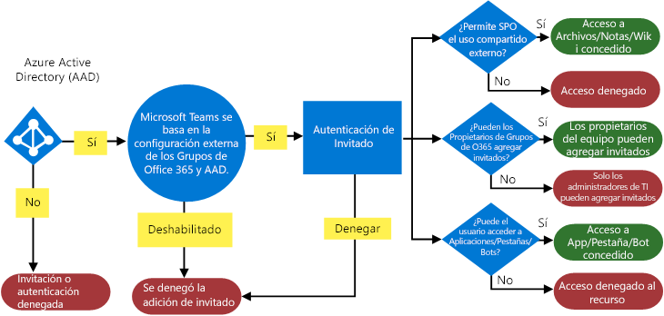

Autorizar el acceso de invitado en Microsoft TeamsAuthorize guest access in Microsoft Teams
===========================================

Para satisfacer los requisitos de su organización, puede administrar las funcionalidades y las características de acceso de invitado de Microsoft Teams a través de cuatro niveles de autorización distintos.To satisfy your organization’s requirements, you can manage Microsoft Teams guest access features and capabilities through four different levels of authorization. Todos los niveles de autorización se aplican a su inquilino de Office 365.All the authorization levels apply to your Office 365 tenant. Cada nivel de autorización controla la experiencia de invitado como se muestra a continuación:Each authorization level controls the guest experience as shown below:
- **Azure Active Directory**: el acceso de invitado en Microsoft Teams depende de la plataforma negocio a negocio (B2B) de Azure AD.**Azure Active Directory**: Guest access in Microsoft Teams relies on the Azure AD business-to-business (B2B) platform. Controla la experiencia de invitado a nivel de directorio, inquilino y aplicación.Controls the guest experience at the directory, tenant, and application level. 
- **Microsoft Teams**: solo controla Microsoft Teams.**Microsoft Teams**: Controls Microsoft Teams only. 
- **Grupos de Office 365**: controla la experiencia de invitado en los Grupos de Office 365 y Microsoft Teams.**Office 365 Groups**: Controls the guest experience in Office 365 Groups and Microsoft Teams.
- **SharePoint Online y OneDrive para la Empresa**: controla la experiencia de invitado en SharePoint Online, OneDrive para la Empresa, Grupos de Office 365 y Microsoft Teams.**SharePoint Online and OneDrive for Business**: Controls the guest experience in SharePoint Online, OneDrive for Business, Office 365 Groups, and Microsoft Teams.

Estos niveles de autorización distintos proporcionan la flexibilidad necesaria para configurar el acceso de invitado para su organización.These different authorization levels provide you with flexibility in how you set up guest access for your organization. Por ejemplo, si no quiere permitir usuarios invitados en su organización de Microsoft Teams, solo tiene que desactivar el acceso de invitado en Microsoft Teams.For example, if you don’t want to allow guest users in your Microsoft Teams organization, just turn off guest access in Microsoft Teams. Otro ejemplo: podría habilitar el acceso de invitado en los niveles de AAD, Teams y Grupos, pero deshabilitaría la adición de usuarios invitados en equipos seleccionados que tengan un criterio o varios en común, como que la clasificación de datos es igual a confidencial.Another example: You could enable guest access at the AAD, Teams, and Groups levels, but then disable guest users' addition on selected teams that match one or more criteria such as data classification equals confidential. Además, quizá no use Grupos de Office 365.And, perhaps you don’t use Office 365 Groups. SharePoint Online y OneDrive para la Empresa tienen su propia configuración de acceso de invitado que no depende de Grupos de Office 365.SharePoint Online and OneDrive for Business have their own guest access settings that don't rely on Office 365 Groups. 

> [!NOTE]
> Los invitados están sujetos a los límites de servicio de [Office 365](https://go.microsoft.com/fwlink/p/?linkid=282347) y [Azure Active Directory](https://go.microsoft.com/fwlink/p/?linkid=853019).Guests are subject to  [Office 365](https://go.microsoft.com/fwlink/p/?linkid=282347) and [Azure Active Directory](https://go.microsoft.com/fwlink/p/?linkid=853019) service limits. 

  En el siguiente diagrama se muestra cómo se concede y se integra la dependencia de autorización de acceso de invitado entre Azure Active Directory, Microsoft Teams y Office 365.The following diagram shows how guest access authorization dependency is granted and integrated between Azure Active Directory, Microsoft Teams, and Office 365.

## Azure Active DirectoryAzure Active Directory

Con la colaboración negocio a negocio (B2B) de Azure AD, el envío de invitaciones a posibles usuarios invitados no está restringido a los administradores de inquilinos.With Azure AD business-to-business (B2B) collaboration, sending invitations to potential guest users isn’t restricted to tenant admins. En su lugar, puede usar directivas para delegar el envío de invitaciones a los usuarios que tengan roles que les permitan hacerlo.Instead, you can use policies to delegate sending invitations to users whose roles allow them to send invitations.

La configuración de las invitaciones se aplica a nivel de inquilino y controla la experiencia de invitado a nivel de directorio, inquilino y aplicación.The settings for invitations apply at the tenant level and control the guest experience at the directory, tenant, and application level. Como mínimo para admitir a los invitados, **pueden invitar los miembros** se debe establecer en **Sí**.At a minimum to support guests, **Members can invite** must be set to **Yes**.

Azure AD incluye las siguientes opciones para configurar los usuarios externos:Azure AD includes the following settings to configure external users:
- **Los permisos de usuario de invitado están limitados**: **Sí** significa que los invitados no tiene permiso para determinadas tareas de Active directory, como enumerar los usuarios, grupos u otros recursos de Active directory.**Guest user permissions are limited**: **Yes** means that guests don't have permission for certain directory tasks, such as enumerate users, groups, or other directory resources. Además, los invitados no se pueden asignar a las funciones administrativas en el directorio.In addition, guests can't be assigned to administrative roles in your directory. **No** significa que los invitados tiene el mismo acceso a los datos de Active directory que tienen los usuarios regulares en el directorio.**No** means that guests have the same access to directory data that regular users have in your directory.
- **Pueden invitar los administradores y usuarios de la función de autor de la invitación de invitado**: **Sí** significa que los administradores y usuarios de la función "Autor de la invitación invitado" podrán invitar a personas para el inquilino.**Admins and users in the guest inviter role can invite**: **Yes** means that admins and users in the "Guest Inviter" role will be able to invite guests to the tenant. **No** significa que los administradores y los usuarios no pueden invitar a los invitados en el inquilino.**No** means admins and users can't invite guests to the tenant.
- **Pueden invitar los miembros**: **Sí** significa que los miembros sin permisos de administrador del directorio de pueden invitar a los invitados puedan colaborar en recursos protegidos mediante la implementación de AD Azure, como sitios de SharePoint o los recursos de Azure.**Members can invite**: **Yes** means that non-admin members of your directory can invite guests to collaborate on resources secured by your Azure AD, such as SharePoint sites or Azure resources. **No** significa que sólo los administradores pueden invitar a invitados a su directorio.**No** means that only admins can invite guests to your directory.
- **Pueden invitar los invitados**: **Sí** significa que los invitados en el directorio pueden ellos mismos invitar a otro invitado a colaborar en recursos protegidos mediante la implementación de AD Azure, como sitios de SharePoint o los recursos de Azure.**Guests can invite**: **Yes** means that guests in your directory can themselves invite other guest to collaborate on resources secured by your Azure AD, such as SharePoint sites or Azure resources. **No** significa que los invitados no puede invitar a otros invitados para colaborar con su organización.**No** means that guests can't invite other guests to collaborate with your organization.
 

> [!NOTE]
> También puede administrar qué dominios se pueden invitar a su inquilino como invitados.You can also manage which domains can be invited into your tenant as guests. Vea [Permitir o bloquear el acceso de invitado a los grupos de Office 365](https://docs.microsoft.com/exchange/recipients-in-exchange-online/manage-group-access-to-office-365-groups).See [Allow/Block guest access to Office 365 groups](https://docs.microsoft.com/exchange/recipients-in-exchange-online/manage-group-access-to-office-365-groups). 

## Microsoft TeamsMicrosoft Teams
En Microsoft Teams, puede controlar si la experiencia de invitado está habilitada o deshabilitada en su organización.In Microsoft Teams, you can control whether the guest experience is enabled or disabled for your organization. La configuración está deshabilitada de forma predeterminada y se aplica en el nivel de inquilino para Microsoft Teams solo.The setting is disabled by default and applies at the tenant level for Microsoft Teams only.

Puede administrar la configuración del acceso de invitado de Microsoft Teams desde el Centro de administración de Office 365.You can manage Microsoft Teams guest access settings from the Office 365 admin center. Si desea más información, consulte [Activar o desactivar el acceso de invitado para Microsoft Teams](set-up-guests.md).For more information, see [Turn on or off guest access to Microsoft Teams](set-up-guests.md). 

## Grupos de Office 365Office 365 Groups

Desde Grupos de Office 365, puede controlar la adición de usuarios invitados y el acceso de invitado a todos los grupos de Office 365 y Microsoft Teams en su organización.From Office 365 Groups, you can control adding guest users and guest access to all Office 365 groups and Microsoft Teams in your organization.

1. Inicie sesión con su cuenta de administrador global de Office 365 en [https://portal.office.com/adminportal/home](https://portal.office.com/adminportal/home).Sign in with your Office 365 global admin account at [https://portal.office.com/adminportal/home](https://portal.office.com/adminportal/home).
    
  
2. En el menú de navegación, elija **Configuración** y luego **Servicios y complementos**.In the navigation menu, choose **Settings** and then select **Services &amp; add-ins**.
    
  
3. Seleccione **Grupos de Office 365**.Select **Office 365 Groups**.
    
     
  

  

  
4. En la página de grupos de Office 365, configure el botón de alternancia en **Activado** o **Desactivado**, dependiendo de si quiere que los propietarios del equipo y el grupo que no pertenecen a la organización accedan a los grupos de Office 365.On the Office 365 Groups page, set the toggle to **On** or **Off**, depending if you want to let team and group owners outside your organization access Office 365 groups. Pulse o haga clic en el botón de alternancia, cambie a **Activado** junto a **Let group owners add people outside the organization to groups** (Permitir que los propietarios de grupo agreguen a los grupos personas externas a la organización).Click or tap the toggle to **On** next to **Let group owners add people outside the organization to groups**. Si cambia a Activado el botón de alternancia, verá otra opción para controlar si quiere que los propietarios de grupo y equipo puedan añadir personas externas a la organización a los grupos de Office 365 y Microsoft Teams.If you turn this toggle to On, you'll see another option to control whether you want to let group and team owners add people outside your organization to Office 365 groups and Microsoft teams. Establezca el botón de alternancia en Activado si desea que los propietarios de grupo y equipo agreguen usuarios invitados.Set this toggle to On if you want to let group and team owners add guest users. 
 
   

La configuración anterior se aplica a nivel de inquilino y controla la experiencia de invitado en Grupos de Office 365 y Microsoft Teams.The above settings apply at the tenant level and control the guest experience in Office 365 Groups and Microsoft Teams.

## SharePoint Online y OneDrive para la EmpresaSharePoint Online and OneDrive for Business

Microsoft Teams depende de SharePoint Online y OneDrive para la Empresa para almacenar archivos y documentos de canales y conversaciones de chat.Teams relies on SharePoint Online and OneDrive for Business to store files and documents for channels and chat conversations.  
  
    
    
Para habilitar toda la experiencia de acceso de invitado de Teams, los administradores de Office 365 tienen que seleccionar **Activado** en las siguientes opciones:To enable the full Teams guest access experience, Office 365 admins need to select **On** for the following settings:
  
    
    

- En SharePoint Online: **Only allow sharing with external users already in the directory** (Permitir solo compartir con usuarios externos que ya estén en el directorio)In SharePoint Online: **Only allow sharing with external users already in the directory**
    
    Para obtener más información, consulte [Administrar el uso compartido externo en su entorno de SharePoint Online](https://docs.microsoft.com/sharepoint/external-sharing-overview).For more information, see [Manage external sharing for your SharePoint Online environment](https://docs.microsoft.com/sharepoint/external-sharing-overview).
    
  
- En los grupos de Office 365: **Let group owners add people outside the organization to groups** (Permitir que los propietarios de grupo agreguen a los grupos personas externas a la organización)In Office 365 groups: **Let group owners add people outside the organization to groups**
    
    Para obtener más información, consulte [Controlar el acceso de invitado a Microsoft Teams](#controlguest).For more information, see [Control guest access to Microsoft Teams](#controlguest).
  

La configuración anterior se aplica a nivel de inquilino y controla la experiencia de invitado en SharePoint Online, OneDrive para la Empresa, Grupos de Office 365 y Microsoft Teams.The above settings apply at the tenant level and control the guest experience at SharePoint Online, OneDrive for Business, Office 365 Groups and Microsoft Teams.

La configuración de usuarios externos de SharePoint Online se puede administrar para el sitio de equipos conectados a Teams.You can manage SharePoint Online external user settings for the Teams connected team site. Si desea más detalles, vea [Administrar la configuración de su sitio de grupo de SharePoint](https://support.office.com/article/Manage-your-SharePoint-team-site-settings-8376034d-d0c7-446e-9178-6ab51c58df42).For more details, see  [Manage your SharePoint team site settings](https://support.office.com/article/Manage-your-SharePoint-team-site-settings-8376034d-d0c7-446e-9178-6ab51c58df42).
