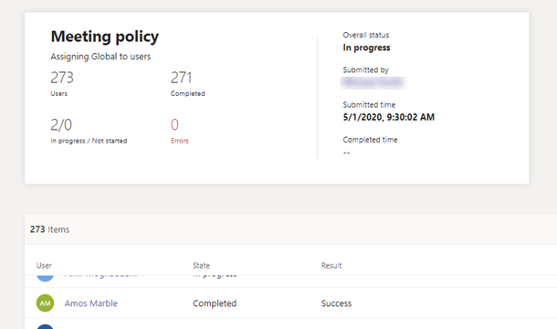

# Ver las asignaciones de directivas en el registro de actividadesView your policy assignments in the Activity log

Al asignar directivas a usuarios en el centro de administración de Microsoft Teams, puede ver el estado de esas asignaciones de directivas en el registro de actividades.When you assign policies to users in the Microsoft Teams admin center, you can view the status of those policy assignments in the Activity log. El registro de actividades muestra las asignaciones de directivas a lotes de más de 20 usuarios a través del centro de administración de Microsoft Teams desde los últimos 30 días.The Activity log shows policy assignments to batches of more than 20 users through the Microsoft Teams admin center from the last 30 days. Tenga en cuenta que el registro de actividades no muestra asignaciones de paquetes de directiva, asignaciones de directivas a lotes de menos de 20 usuarios a través del centro de administración de Microsoft Teams o asignaciones de directivas a través de PowerShell.Keep in mind that the Activity log doesn't show policy package assignments, policy assignments to batches of less than 20 users through the Microsoft Teams admin center, or policy assignments through PowerShell.

## Ver las actividades de asignación de directivas en el registro de actividadesView your policy assignment activities in the Activity log

Para ver las asignaciones de directivas en el registro de actividades:To view your policy assignments in the Activity log:

1. En el panel de navegación izquierdo del Microsoft Teams de administración, vaya a Panel y, a continuación, en Registro de actividades, seleccione Ver **detalles.**In the left navigation of the Microsoft Teams admin center, go to **Dashboard**, and then under **Activity Log**, select **View details**.
2. Puede ver todas las asignaciones de directivas o filtrar la lista por estado para mostrar solo las tareas no iniciadas, en curso **o** **completadas.**You can view all policy assignments or filter the list by status to show only assignments that are **Not started**, **In progress**, or **Completed**. Verá la siguiente información sobre cada tarea:You'll see the following information about each assignment:
    - **Nombre:** el nombre de la asignación de directivas.**Name**: The name of the policy assignment. Haga clic en el vínculo para ver más detalles.Click the link to view more details. Esto incluye el número de usuarios a los que se asignó la directiva y el número de tareas completadas, en curso y no iniciadas.This includes the number of users the policy was assigned to and the number of assignments completed, in progress, and not started. También verá la lista de usuarios en el lote, así como el estado y el resultado de cada usuario.You'll also see the list of users in the batch, and the status and result for each user. Aquí se muestra un ejemplo:Here's an example:

        

    - **Enviado:** Fecha y hora en que se envió la asignación de directiva.**Submitted**: Date and time the policy assignment was submitted.
    - **Hora de finalización:** fecha y hora en que se completó la asignación de directivas.**Completion time**: Date and time the policy assignment was completed.
    - **Impacto en:** Número de usuarios en el lote.**Impact on**: Number of users in the batch.
    - **Estado general:** Estado de la asignación de directivas.**Overall status**: Status of the policy assignment.

> [!NOTE]
> También puede acceder al registro de actividades desde la **página** Usuarios.You can also get to the Activity log from the **Users** page. Después de hacer **clic en Aplicar** para enviar una asignación de directiva en masa, verá un banner en la parte superior de la página.After you click **Apply** to submit a bulk policy assignment, you'll see a banner at the top of the page. Haga clic en **el vínculo Registro** de actividades en el banner.Click the **Activity log** link in the banner.

## Temas relacionadosRelated topics

- [Asignar directivas a los usuariosAssign policies to users](assign-policies.md)
