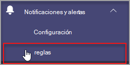

# Supervisión del estado de los dispositivos de Microsoft TeamsMicrosoft Teams device health monitoring

La supervisión del estado de los dispositivos en el Centro de administración de Microsoft Teams le ofrece la capacidad de supervisar proactivamente el estado de varios dispositivos de Teams.Device health monitoring in the Microsoft Teams admin center gives you an ability to proactively monitor the health of various Teams devices. Supervise el estado sin conexión de un dispositivo y reciba alertas en tiempo real si el dispositivo supervisado de su organización se desconecta.Monitor the offline state of a device and receive alerts in real time if the monitored device in your organization goes offline.  

Antes de empezar, necesitará los permisos de creación de equipos o canales en el espacio empresarial.Before you start, you'll need the teams/channel creation permissions in your tenant. [Más información.](https://docs.microsoft.com/microsoft-365/solutions/manage-creation-of-groups?view=o365-worldwide)[Learn More](https://docs.microsoft.com/microsoft-365/solutions/manage-creation-of-groups?view=o365-worldwide).

## Configurar la regla de estado del dispositivoConfigure device state rule

1. En el panel de navegación izquierdo del Centro de administración de Microsoft Teams, seleccione Notificaciones **& reglas de**  >  **alertas.**In the left navigation of the Microsoft Teams admin center, select **Notifications & alerts** > **Rules**.

   

2. En la **página** Reglas, seleccione **Regla de estado del dispositivo**.In the **Rules** Page, select **Device state rule**.

3. Seleccione el dispositivo para configurar la regla de estado para habilitar alertas.Select the device to configure the state rule for enabling alerts.

    

## Interpretar la configuración de la reglaInterpret the rule configuration

|CampoField |DescripciónDescription  |
|--------|-------------|
|**Tipo de regla****Rule type**   |La regla de estado del dispositivo le ayuda a administrar de forma eficaz.The device state rule helps you effectively manage. Teams y se clasifica como un tipo de administración de dispositivos.Teams devices and is classified as a device management type. En el futuro, habrá más reglas de tipo de administración de dispositivos disponibles para supervisar otras capacidades relacionadas (algunos ejemplos pueden incluir: dispositivo en mal estado y el estado de inicio de sesión del dispositivo).In the future, more rules of device management type will be available to monitor other related capabilities (examples may include: unhealthy device and the sign-in status of device).|
|**Condición****Condition**   |Puede supervisar el estado de los dispositivos si se desconectan.You can monitor the health of devices if they go offline. [Obtenga más información](https://docs.microsoft.com/microsoftteams/devices/device-management) sobre la administración de dispositivos en el Centro de administración de Teams.[Learn more](https://docs.microsoft.com/microsoftteams/devices/device-management) about device management in Teams admin center. |
|**Ámbito****Scope**   |Puede especificar la frecuencia con la que desea supervisar el estado del dispositivo mencionando la frecuencia de evaluación de la regla.You can specify how frequently you want to monitor device health status by mentioning the rule evaluation frequency. De forma predeterminada, los dispositivos de equipos se supervisarán casi en tiempo real si se desconectan.By default teams devices will be monitored in near real time if they go offline. |
|**Usuarios de dispositivos****Device users**   |Puede especificar qué dispositivos necesitan una supervisión proactiva de las imágenes sin conexión seleccionándolos en función de los usuarios que han iniciado sesión.You can specify which devices need proactive offline statue monitoring by selecting them based on signed-in users. Para obtener [más información, consulte Seleccionar dispositivos](#select-devices-for-configuration) para la configuración.Refer to [Select devices for configuration](#select-devices-for-configuration) for more details. |
|**Acciones**  >  **Alerta de canal****Actions** > **Channel alert**   |En la sección Acciones, puede especificar los canales de equipos para los que desea recibir alertas.In the Actions section, you can specify teams channels you want to get alerts for. Actualmente, se creará un equipo predeterminado denominado **Alertas** y notificaciones de administrador y un canal denominado **MonitoringAlerts** donde se entregarán las notificaciones.Currently, a default team named **Admin Alerts and Notifications** and channel named **MonitoringAlerts** will be created where notifications will be delivered to.     Los administradores globales y los administradores de Teams de su inquilino se agregarán automáticamente a este equipo predeterminado.Global administrators and Teams administrators in your tenant will be automatically added to this default team.|
|**Acciones**  >  **Webhook****Actions** > **Webhook**   |También puede recibir notificaciones con un webhook externo (opcional).You can also get notifications with an external webhook (optional). Especifique una dirección URL de webhook pública externa en la sección webhook donde se enviará una carga de notificación JSON.Specify an external public webhook URL in the webhook section where a JSON notification payload will be sent.      La carga de notificación, a través de webhooks, se puede integrar con otros sistemas de su organización para crear flujos de trabajo personalizados.The notification payload, via webhooks, can be integrated with other systems in your organization to create custom workflows.   

**Esquema de carga JSON para webhook:****JSON payload schema for webhook:**   
<pre lang="json">{      "type": "object",     "properties": {        "AlertTitle": { "type": "string "} ,       "DeviceLoggedInUserId": { "type": "string" } ,       "DeviceId": { "type": "string" } ,        "MetricValues": {              "type": "object",             "properties": {                   "DeviceHealthStatus": { "type": "string"}              }         } ,        "RuleName": { "type": "string"} ,        "RuleDescription": { "type": "string"} ,        "RuleFrequency": { "type": "string"} ,        "RuleType": { "type": "string"} ,        "TenantId": { "type": "string"} ,         "RuleCondition": { "type": "string"} ,         "AlertRaisedAt": { "type": "string"}      }  } </pre>  <pre lang="json">{      "type": "object",     "properties": {        "AlertTitle": { "type": "string "} ,       "DeviceLoggedInUserId": { "type": "string" } ,       "DeviceId": { "type": "string" } ,        "MetricValues": {              "type": "object",             "properties": {                   "DeviceHealthStatus": { "type": "string"}              }         } ,        "RuleName": { "type": "string"} ,        "RuleDescription": { "type": "string"} ,        "RuleFrequency": { "type": "string"} ,        "RuleType": { "type": "string"} ,        "TenantId": { "type": "string"} ,         "RuleCondition": { "type": "string"} ,         "AlertRaisedAt": { "type": "string"}      }  } </pre>   

  **Carga JSON de ejemplo:****Sample JSON payload**:    <pre lang="JSON">    {        "AlertTitle":"*sample_device_name* of *User_Name* has become offline","AlertTitle":"*sample_device_name* of *User_Name* has become offline",       "DeviceLoggedInUserId": *User_GUID* ,"DeviceLoggedInUserId": *User_GUID* ,       "DeviceId": *Device_GUID* , "DeviceId": *Device_GUID* ,        "MetricValues": {           DeviceHealthStatus": "offline"              },                  "RuleName": "Device state rule" ,        "RuleDescription": ":"Alerts when device health status is detected as offline" ,        "RuleFrequency": "Real-time" ,        "RuleType": "Device Management" ,        "TenantId": *Tenant_GUID* , "TenantId": *Tenant_GUID* ,         "RuleCondition": "DeviceHealthStatus = Offline" ,         "AlertRaisedAt": "2020-02-28T12:49:06Z"      }  </pre>   

## Seleccionar dispositivos para la configuraciónSelect devices for configuration

1. Puede seleccionar los dispositivos de Teams que quiera supervisar seleccionando los usuarios que han iniciado sesión en esos dispositivos.You can select Teams devices you want to monitor by selecting users signed in to those devices. Seleccione **Agregar en** la sección Usuarios de **dispositivos.**Select **Add** from the **Device users** section.

2. Seleccione uno o varios usuarios para los que desea supervisar el estado del dispositivoSelect one or more users for which you want to monitor device health state

   

   La lista seleccionada de usuarios se muestra en **la sección Usuarios de dispositivos.**The selected list of users shows in **Device users** section. Puede modificar esta lista agregando o quitando usuarios.You can modify this list by adding or removing users.

Todos los dispositivos de inicio de sesión usados por la lista seleccionada de usuarios se supervisarán para el estado de mantenimiento sin conexión.All the sign-in devices used by the selected list of users will be monitored for the offline health state.

## Notificaciones en el cliente de TeamsNotifications in Teams client

Las notificaciones se entregan en el canal **MonitoringAlerts** creado automáticamente del equipo de notificaciones y **alertas de** administrador.The notifications are delivered in the auto-created **MonitoringAlerts** channel of the **Admin Alerts and Notifications** Team.

Una notificación de dispositivo sin conexión puede incluir la siguiente información:A device offline notification can include the following information:

- El nombre del dispositivo sin conexión.The device name that's offline.
- El usuario del dispositivo sin conexión.The user of the offline device.
- ¿A qué hora se ha desconectado el dispositivo?What time the device went offline. (Actualmente, la hora se presenta en UTC).(Currently, the time is presented in UTC.)
- El tipo de regla que ha elevado la alerta.The type of rule that raised the alert.
- Por qué se eleva una alerta.Why an alert is raised.
