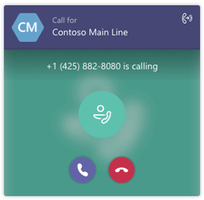

Responder al operador automático y llamar a la cola de llamadas directamente desde Teams
===========================================================

Los usuarios de los equipos pueden recibir y responder a las llamadas de operadores automáticos en la nube y colas de llamadas directamente desde su cliente de los equipos. Para los usuarios de los equipos, la característica de operador automático está ahora disponible por lo general y la funcionalidad de cola de llamadas está en vista previa. 

## ¿Cuáles son automáticos y colas de llamadas?

Operadores automáticos de nube proporcionan una serie de mensajes de voz o un archivo de audio que escuchen los autores de llamadas en lugar de un operador humano cuando llaman a una organización. Un operador automático permite que los autores de llamadas se muevan por el sistema de menús, llamen y localicen a usuarios utilizando el teclado del teléfono (DTMF) o su propia voz gracias al reconocimiento de voz.

Colas de llamada de nube incluyen el saludo que se usa cuando alguien llama a un número de teléfono para su organización, la capacidad de poner automáticamente las llamadas en espera y la capacidad de búsqueda para el siguiente agente de llamada disponibles controlar la llamada mientras las personas que son de llamada escucha música en espera. Puede crear una o varias colas de llamadas para su organización.

## Controlar una llamada de cola de llamada o de operador automático

Los usuarios podrán diferenciar las llamadas entrantes de una cola de llamada o de operador automático antes de que responda a la llamada. Junto con el nombre o el número del autor de la llamada, cada llamada incluirá información acerca de la que el autor de la llamada estaba intentando alcanzar, dar a los usuarios un mejor contexto para hacer frente a la persona que llama.

En la siguiente ilustración se muestra cómo aparecerá una llamada recibida de una cola de llamada o de operador automático a un usuario.

Una vez que se responde a una llamada de cola de llamada o de operador automático, el usuario puede procesar la llamada al igual que cualquier otro & de llamada #x 2014; pueden agregar o conferencia en otro usuario o transferir la llamada a otra persona. Además, las llamadas de operador automático se desviarán según la configuración del usuario.

> [!NOTE] 
> Cola de llamadas no se transfieren en función de la configuración del usuario. Esto es para asegurarse de que los autores de llamadas permanecen en la cola hasta que un agente puede responder a la llamada y el autor de la llamada no se reenvía de forma inesperada.

## Clientes admitidos

Compatibilidad para las llamadas de cola de operador y llamada automático está disponible en los siguientes clientes:

-   Cliente de Microsoft Teams para Windows (versiones de 32 y 64 bits)
-   Cliente de Microsoft Teams para Mac
-   Aplicación Microsoft Teams para iPhone
-   Aplicación Microsoft Teams para Android

## Configurar la auto attendant y llamada de cola compatibilidad con Microsoft Teams

Para recibir el operador automático y llamar a las llamadas de cola en Microsoft Teams, debe configurar la directiva de interoperabilidad y actualización de directiva. Revise la [migración y la interoperabilidad para las organizaciones que utilizan los equipos junto con Skype para la empresa](migration-interop-guidance-for-teams-with-skype.md). Si no dispone de operador automático o cola de llamadas configurado y desea hacerlo, vea [configurar un operador automático de la nube](https://docs.microsoft.com/skypeforbusiness/what-is-phone-system-in-office-365/set-up-a-phone-system-auto-attendant) y [crear una cola de llamada en la nube](https://docs.microsoft.com/skypeforbusiness/what-is-phone-system-in-office-365/create-a-phone-system-call-queue).

## Temas relacionados

-   [¿Qué es el sistema telefónico en Office 365](what-is-phone-system-in-office-365.md)
-   [Crear una cola de llamadas en la nube](https://docs.microsoft.com/skypeforbusiness/what-is-phone-system-in-office-365/create-a-phone-system-call-queue)
-   [¿Qué son los operadores automáticos en la nube?](what-are-phone-system-auto-attendants.md)
-   [Configurar un operador automático en la nube](https://docs.microsoft.com/skypeforbusiness/what-is-phone-system-in-office-365/set-up-a-phone-system-auto-attendant)

