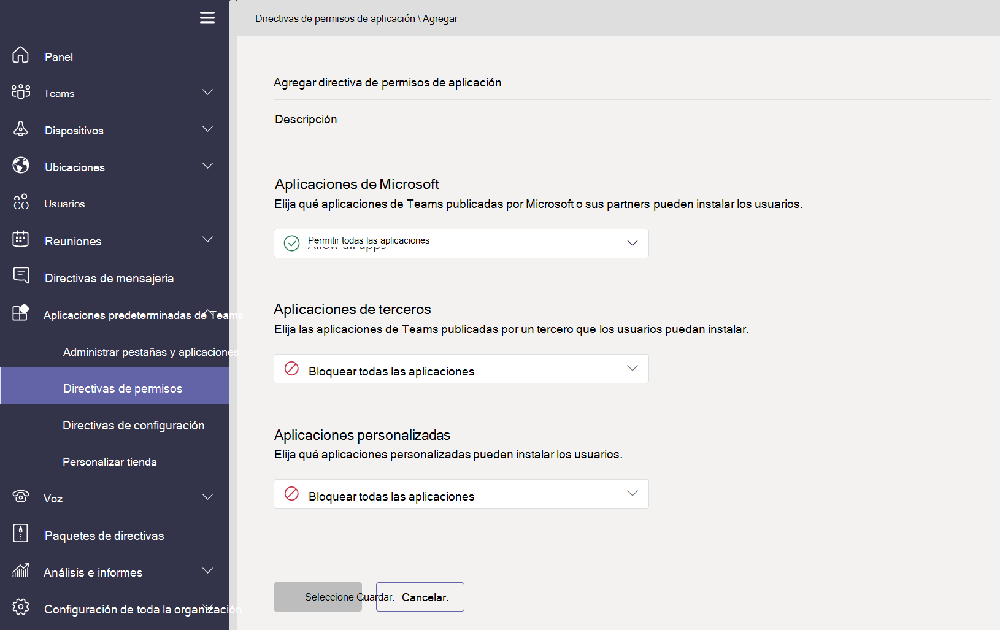
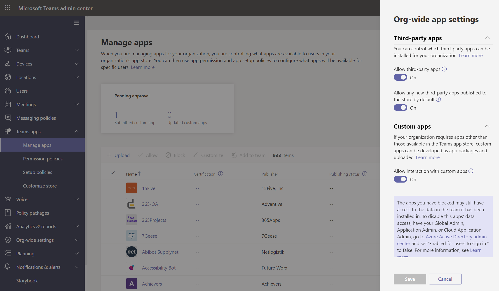

# Administrar directivas de aplicaciones en Microsoft Teams

Las directivas de aplicación se usan para controlar las aplicaciones en Microsoft Teams.

## Directivas de permisos de aplicación

**Las directivas de permisos de** aplicación se usan para controlar qué aplicaciones están disponibles para los usuarios. Como administrador, puede permitir o bloquear aplicaciones específicas que los usuarios instalan desde la Teams de aplicaciones. [Las directivas de permisos de](teams-app-permission-policies.md) aplicación se administran a través Microsoft Teams de administración.

## Directivas de configuración de aplicaciones

**Las directivas de configuración de** aplicaciones le permiten anclar e instalar aplicaciones en nombre de los usuarios y controlar esta configuración para su organización. [Las directivas de configuración de](teams-app-setup-policies.md) aplicaciones se administran en Teams de administración.

## Directivas de aplicaciones personalizadas

Puede controlar quién puede cargar aplicaciones personalizadas a Teams con **directivas de aplicación personalizadas.** [Las directivas y la configuración](teams-custom-app-policies-and-settings.md) de aplicaciones personalizadas se administran a través Microsoft Teams de administración.

## Temas relacionados

* [Administrar configuración y directivas de aplicación personalizadas en Teams](teams-custom-app-policies-and-settings.md)
* [Administrar directivas de configuración de aplicación en Teams](teams-app-setup-policies.md)
* [Administrar directivas de permisos de aplicación en Teams](teams-app-permission-policies.md)
* [Administrar Teams con directivas](manage-teams-with-policies.md)
