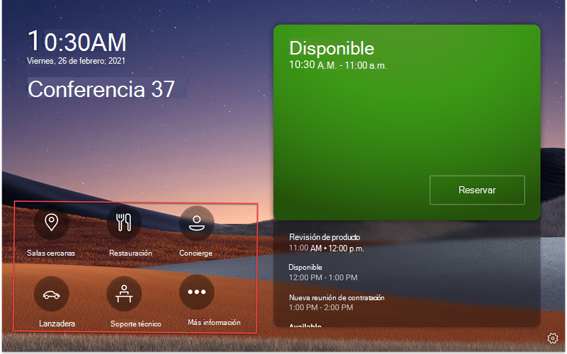
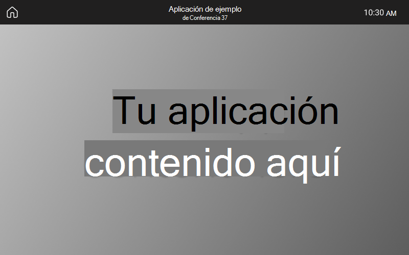

# Compatibilidad de aplicaciones de Microsoft Teams/Línea de negocio (LOB) en paneles de Teams

Los paneles de Teams agregan compatibilidad con [aplicaciones de Teams/aplicaciones de línea de negocio (LOB](/microsoftteams/platform/overview)). Esto permitirá a las empresas agregar experiencias adicionales en los paneles para satisfacer las necesidades de su organización. Esta versión admite contenido web estático.

> [!IMPORTANT]
> Esta característica solo está disponible después de actualizar los dispositivos de paneles de Teams. Debe tener la versión 1449/1.0.97.2021070601 de la aplicación de Teams o posterior para tener soporte de aplicaciones dentro de los paneles de Teams.

## Experiencia de la aplicación Teams en paneles de Teams

*La pantalla principal de los paneles de Teams incluye opciones de navegación de la aplicación, que se describen en la captura de pantalla en rojo. Tenga en cuenta que estos son iconos de ejemplo y es posible que no estén disponibles para su uso.*

*Cuando un usuario final pulse uno de los iconos de la aplicación, verá la pantalla de la aplicación teams mostrada en la captura de pantalla anterior. El rectángulo gris de la captura de pantalla es donde se muestran las aplicaciones en el Panel de Teams. La barra de la aplicación es fija y forma parte de la aplicación de paneles de Teams.*

## Configurar y administrar aplicaciones de paneles de Teams en el Centro de administración de Teams

Las aplicaciones de Microsoft Teams ofrecen información clave, herramientas comunes y procesos de confianza en los que los usuarios se reúnen, aprenden y trabajan. Las aplicaciones de Teams funcionan [a través de funcionalidades integradas](/microsoftteams/platform/concepts/capabilities-overview). Ahora, como administrador de TI, puede elegir qué aplicaciones incluir en el dispositivo de paneles de Teams de su organización y personalizar los permisos a través del [Centro de administración de Teams](https://admin.teams.microsoft.com/).

Ahora puede usar las aplicaciones de Teams en paneles de Teams y personalizar la experiencia del usuario según las necesidades de su organización. Puede decidir a qué aplicación web pueden acceder los usuarios y usar y priorizar las vistas de las aplicaciones. Algunas opciones, como el bot y las funcionalidades de mensajería, no son compatibles en este momento. Obtenga más información sobre [las aplicaciones de Teams](/microsoftteams/platform/overview) y [cómo administrar sus dispositivos en Microsoft Teams](/microsoftteams/devices/device-management).

## Administrar aplicaciones en paneles de Teams en el Centro de administración de Teams

**Nota**: Para acceder al Centro de administración de [Teams](https://admin.teams.microsoft.com/), debe ser administrador global o administrador de servicios de Teams.

Los usuarios finales pueden ver pero no instalar aplicaciones en paneles de Teams. Como administrador, puede ver y administrar todas las aplicaciones de Teams para su organización a través del Centro de administración de Teams. Obtenga más información sobre cómo [puede administrar las aplicaciones en el Centro de administración de Microsoft Teams](/microsoftteams/manage-apps) a través de la página **Administrar aplicaciones** . En la página **Administrar aplicaciones** del Centro de administración de Teams también puede cargar [aplicaciones personalizadas](/microsoftteams/manage-apps#publish-a-custom-app-to-your-organizations-app-store).

Después de configurar las aplicaciones, puede usar [directivas de permisos de aplicaciones](/microsoftteams/teams-app-permission-policies) y [directivas de configuración](/microsoftteams/teams-app-setup-policies) de aplicaciones para configurar la experiencia de la aplicación para cuentas de salones específicas de su organización.

## Anclar aplicaciones en paneles de Teams con directivas de configuración de aplicaciones

Como Teams ofrece la capacidad de mostrar una amplia gama de aplicaciones, los administradores pueden decidir qué aplicaciones son más esenciales para la organización y anclar solo estas para la pantalla **Principal** de paneles de Teams para acceder rápidamente. Si hay más de cinco aplicaciones ancladas o cualquier aplicación desanclada, aparecerán en la pantalla **Más** . Microsoft recomienda crear una directiva de configuración de aplicaciones personalizada específicamente para paneles de Teams.

Para administrar las aplicaciones ancladas que se muestran en los paneles de Teams, inicie sesión en el Centro de administración de Teams de su organización y vaya a **Directivas** \> de configuración de **aplicaciones** \> de Teams **Seleccione o Crear una nueva directiva** \> **Aplicaciones ancladas**.

*Las aplicaciones incluidas en esta imagen son solo ejemplos y es posible que no estén disponibles para su uso.*

Microsoft recomienda desactivar **Cargar aplicaciones personalizadas** y **Anclaje de usuarios** para disfrutar de la mejor experiencia con las aplicaciones de Teams en los paneles de Teams.

Para obtener más información sobre cómo anclar aplicaciones, consulta [Administrar directivas de configuración de aplicaciones](/microsoftteams/teams-app-setup-policies).

## Administrar el orden de visualización de aplicaciones en paneles de Teams

*Las aplicaciones incluidas en esta imagen son solo ejemplos y es posible que no estén disponibles para su uso.*

Para administrar el orden en que se muestran las aplicaciones en los paneles de Teams, inicie sesión en el Centro de administración de Teams de su organización y vaya a **Directivas** \> de configuración de **aplicaciones** \> de Teams **Seleccione las** \> **aplicaciones ancladas:** **Subir o bajar**.

## Asignar directivas de configuración a una cuenta de recursos de sala

Después de crear la directiva de configuración, el administrador tendrá que asignar esta directiva a la cuenta de recursos del salón que iniciará sesión en los paneles de Teams. Para obtener más información, consulte [Asignar directivas a usuarios y grupos](/microsoftteams/assign-policies-users-and-groups).

## Preguntas más frecuentes

### ¿Cuánto tardan los paneles de Teams en obtener las directivas de configuración de aplicaciones nuevas o actualizadas?

Después de editar o asignar nuevas directivas en el Centro de administración de Teams, los cambios pueden tardar hasta 24 horas en surtir efecto. Los administradores pueden intentar cerrar sesión o iniciar sesión desde el panel, pulsar el icono **Configuración** y volver a la pantalla **Inicio** para intentar actualizar las directivas.

### ¿Cuál es el orden de las aplicaciones en la pantalla "Más"?

En la página **Más** aplicaciones, las aplicaciones ancladas aparecerán en primer lugar. A continuación, cualquier otra aplicación instalada aparecerá en orden alfabético.

### ¿Por qué las aplicaciones bot no se muestran en los paneles de Teams?

En este momento solo se admite el contenido web de pestañas estáticas.

### ¿Por qué las aplicaciones nativas de Teams, como Calendario y Tareas, no aparecen en los paneles de Teams?

Las aplicaciones nativas de Teams, como Calendario y Tareas, no se muestran en los paneles de Teams.

### En el Centro de administración de Teams, en la sección Directivas de configuración, ¿cuál es la diferencia entre las aplicaciones instaladas y las aplicaciones ancladas?

Para los paneles de Teams, Microsoft recomienda usar aplicaciones ancladas para que el administrador pueda seleccionar la aplicación deseada y reorganizar su orden.

**Nota:** Algunas aplicaciones no admiten el anclaje de aplicaciones. Ponte en contacto con el desarrollador de aplicaciones para habilitar la funcionalidad de anclaje de aplicaciones.

### ¿Por qué otras aplicaciones aparecen en la pantalla "Más" aunque no formen parte de las aplicaciones instaladas o ancladas en la sección de directivas de configuración de aplicaciones de Teams?

Si las aplicaciones se instalaron anteriormente a través de otras directivas de aplicación o manualmente en los clientes de escritorio o web de Teams para la cuenta de recursos de sala usada en los paneles de Teams, es posible que el administrador deba iniciar sesión en la cuenta de recursos de sala en Teams y desinstalar manualmente las aplicaciones haciendo clic con el botón derecho en la aplicación y seleccionando **Desinstalar**.

### ¿Por qué no encuentro una aplicación en el panel "Agregar aplicaciones ancladas"?

No todas las aplicaciones se pueden anclar a Teams a través de una directiva de configuración de aplicaciones. Es posible que algunas aplicaciones no admitan esta funcionalidad. Para buscar aplicaciones que se pueden anclar, busca la aplicación en el panel **Agregar aplicaciones ancladas** . Para obtener más información, consulta [las preguntas más frecuentes en Trabajar con directivas de configuración de aplicaciones](/microsoftteams/teams-app-setup-policies#why-cant-i-find-an-app-in-the-add-pinned-apps-pane).

### ¿Por qué veo un elemento emergente "Anclaje de usuario" en el panel de directivas de configuración después de desactivar "Anclaje de usuario?"

*Las aplicaciones incluidas en esta imagen son solo ejemplos y es posible que no estén disponibles para su uso.*

Este comportamiento se espera para un dispositivo en un espacio compartido y ayuda a evitar el anclaje no intencionado de aplicaciones.
