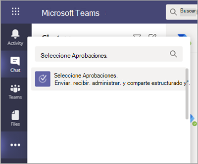

# Disponibilidad de la aplicación Aprobaciones de TeamsTeams Approvals app availability

La aplicación Aprobaciones está disponible como aplicación personal para todos los usuarios de Microsoft Teams.The Approvals app is available as a personal app for all Microsoft Teams users.
La aplicación Aprobaciones ofrece una forma sencilla de auditar, cumplir, responsabilidad y flujos de trabajo a aprobaciones estructuradas y no estructuradas en Teams.The Approvals app provides a simple way to bring auditing, compliance, accountability, and workflows to both structured and unstructured Approvals in Teams.

 

Los usuarios pueden anclar la aplicación Aprobaciones para guardarla en la barra de menús.Users can pin the Approvals app to save it to the menu bar.

 

La primera aprobación creada desde la aplicación Aprobaciones desencadenará el aprovisionamiento de la solución de aprobación en el entorno predeterminado del Servicio de datos comunes (CDS).The first approval created from the Approvals app will trigger the provisioning of the Approval Solution in the default Common Data Service (CDS) environment. Las aprobaciones creadas desde la aplicación Aprobaciones se almacenarán en el entorno de CDS predeterminado.Approvals created from the Approvals app will be stored in the default CDS environment.

En este artículo se describen los requisitos y los roles de la aplicación Aprobaciones.This article describes the Approvals app requirements and roles.

## Permisos y licencias necesariosRequired permissions and licenses

Para usar la aplicación Aprobaciones, necesita permiso para los siguientes elementos:To use the Approvals app, you need permission for the following items:

- Permisos para crear una base de datos de CDS de Microsoft.Permissions to create a Microsoft CDS database.

- Una cuenta en [flow.microsoft.com](https://flow.microsoft.com/)An account on [flow.microsoft.com](https://flow.microsoft.com/)

- Rol de administrador en el entorno de destino.Administrator Role in the target environment.

- Licencia para [Power Automate,](https://docs.microsoft.com/power-automate/get-started-approvals)Office 365 o Dynamics 365.License for a [Power Automate](https://docs.microsoft.com/power-automate/get-started-approvals), an Office 365, or a Dynamics 365.

## Almacenamiento con CDSStorage with CDS

El modelo de datos común (CDM) es el lenguaje de datos compartido que usan las aplicaciones empresariales y analíticas en los CDS.The Common Data Model (CDM) is the shared data language used by business and analytical applications in the CDS. Se compone de un conjunto de esquemas de datos estandarizados y extensibles publicados por Microsoft y nuestros socios que permite la coherencia de los datos y su significado en todas las aplicaciones y procesos empresariales.It consists of a set of a standardized, extensible data schemas published by Microsoft and our partners that enables consistency of data and its meaning across applications and business processes. Obtenga más información sobre el [modelo de datos común de Microsoft Power Platform.](https://docs.microsoft.com/power-automate/get-started-approvals)Learn more about the [Common Data Model of the Microsoft Power Platform](https://docs.microsoft.com/power-automate/get-started-approvals).

Obtenga más información sobre el flujo [de trabajo Aprobación.](https://docs.microsoft.com/power-automate/modern-approvals)Learn more about the [Approval workflow](https://docs.microsoft.com/power-automate/modern-approvals).

## Permisos de la aplicación de Teams de aprobaciónApprovals Teams app permissions

La aplicación Desaprobaciones de Teams le permite acceder a las siguientes características:The Approvals Teams app lets you access the following features:

- Recibir mensajes y datos que se le proporcionen.Receive messages and data that you provide to it.

- Envíate mensajes y notificaciones.Send you messages and notifications.

- Representar cuadros de diálogo y aplicaciones personales sin un encabezado proporcionado por Teams.Render personal apps and dialogs without a Teams-provided header.

- Obtenga acceso a la información de su perfil, como su nombre, dirección de correo electrónico, nombre de la empresa e idioma preferido.Access your profile information such as your name, email address, company name, and preferred language.

- Recibir mensajes y datos que los miembros del equipo le proporcionan en un canal.Receive messages and data that team members provide to it in a channel.

- Enviar mensajes y notificaciones en un canal.Send messages and notifications in a channel.

- Obtenga acceso a la información de su equipo:Access your team's information:
  - nombre del equipoteam name
  - lista de canaleschannel list
  - lista (nombres y direcciones de correo electrónico de los miembros del equipo).roster (team member's names and email addresses).

- Use la información del equipo para ponerse en contacto con ellos.Use the team's information to contact them.

## Deshabilitar la aplicación AprobacionesDisable the Approvals app

La aplicación Aprobaciones está disponible de forma predeterminada.The Approvals app is available by default. Puede deshabilitar la aplicación en el Centro de administración de Teams.You can disable the app in the Teams admin center.

  1. Inicie sesión en el Centro de administración de Teams.Sign in to the Teams admin center.

  2. Expanda **las aplicaciones de Teams** y seleccione Administrar **aplicaciones.**Expand **Teams apps** and select **Manage apps**.

  3. Busque la aplicación Aprobaciones.Search for the Approvals app.

  4. Seleccione Aprobaciones.Select Approvals.

  5. Seleccione el botón de alternancia para deshabilitar la aplicación para su organización.Select the toggle to disable the app for your organization.

## Directiva de retenciónRetention policy

Las aprobaciones creadas desde la aplicación Aprobaciones se almacenan en el entorno predeterminado de CDS, que no admite copias de seguridad en este momento.Approvals created from the Approvals App are stored in the default CDS environment, which doesn’t support backups at this time. Obtenga más información sobre cómo hacer [copias de seguridad y restaurar entornos: Documentos de Microsoft de la plataforma \| móvil.](https://docs.microsoft.com/power-platform/admin/backup-restore-environments)Learn more about how to [Back up and restore environments - Power Platform \| Microsoft Docs](https://docs.microsoft.com/power-platform/admin/backup-restore-environments).

## AuditoríaAuditing

La aplicación Aprobaciones registra eventos de auditoría en el Centro de seguridad y cumplimiento de Microsoft 365.The Approvals App logs audit events within the Microsoft 365 Security and Compliance Center. Puede ver el registro de auditoría.You can view the audit log.

1. Vaya al Sitio de cumplimiento de Microsoft 365.Go to the Microsoft 365 Compliance Site.

2. Seleccione la **sección** Auditoría.Select the **Audit** section.

3. Busque actividades en las **actividades de aprobación de Microsoft Teams.**Search for activities under **Microsoft Teams approvals activities**.

Puede buscar las siguientes actividades:You can search for the following activities:

- Crear una nueva solicitud de aprobaciónCreate new approval request

- Ver detalles de la solicitud de aprobaciónView approval request details

- Solicitud de aprobación aprobadaApproved approval request

- Solicitud de aprobación rechazadaRejected approval request

- Solicitud de aprobación canceladaCanceled approval request

- Solicitud de aprobación compartidaShared approval request

- Archivo adjunto a la solicitud de aprobaciónFile attached to approval request

- Solicitud de aprobación reasignadaReassigned approval request

- Firma electrónica agregada a la solicitud de aprobaciónAdded e-signature to approval request

Para obtener acceso a más aprobaciones de auditoría en Flow, habilite y configure la auditoría en el entorno predeterminado de las entidades de aprobación principales: Aprobación, Solicitud de aprobación y Respuesta de aprobación.For access to more auditing approvals within Flow, enable and configure auditing in the default environment for the primary approval entities Approval, Approval Request, and Approval Response. Las operaciones crear, actualizar y eliminar son eventos auditables para registros de aprobación.Create, update, and delete operations are auditable events for Approval records. Más información sobre datos [de auditoría y la actividad de usuario para seguridad y cumplimiento: Documentos de Microsoft de la plataforma \| móvil.](https://docs.microsoft.com/power-platform/admin/audit-data-user-activity)Learn more about [Audit data and user activity for security and compliance - Power Platform \| Microsoft Docs](https://docs.microsoft.com/power-platform/admin/audit-data-user-activity).

La auditoría puede personalizarse aún más en el Centro de seguridad y cumplimiento [de Microsoft 365.](https://support.office.com/article/go-to-the-office-365-security-compliance-center-7e696a40-b86b-4a20-afcc-559218b7b1b8?ui=en-US&rs=en-US&ad=US)Auditing can be customized further in the [Microsoft 365 Security and Compliance Center](https://support.office.com/article/go-to-the-office-365-security-compliance-center-7e696a40-b86b-4a20-afcc-559218b7b1b8?ui=en-US&rs=en-US&ad=US).

1. Para usar los informes preconfigurados, inicie sesión en Seguridad y cumplimiento de Microsoft 365.To use the preconfigured reports, sign in to Microsoft 365 Security and Compliance.

2. Seleccione **Búsqueda & investigación.**Select **Search & investigation**.

3. Busque en el registro de auditoría y seleccione la **pestaña actividades de Dynamics 365.**Search the Audit log and select the **Dynamics 365 activities** tab.

Más información sobre el registro de actividades de aplicaciones controladas por el modelo y los datos [inversos de Microsoft : Plataforma de energía.](https://docs.microsoft.com/power-platform/admin/enable-use-comprehensive-auditing)Learn more about [Microsoft Dataverse and model-driven apps activity logging - Power Platform](https://docs.microsoft.com/power-platform/admin/enable-use-comprehensive-auditing).

## SeguridadSecurity

Desde la aplicación Aprobaciones de Teams, los usuarios tienen acceso para crear nuevas aprobaciones y ver las aprobaciones que han enviado y recibido.From the Teams Approvals app, users have access to create new Approvals and view Approvals that they have sent and received. Los usuarios no tendrán acceso a las aprobaciones creadas por otros usuarios a menos que sean respondedores o lectores de la solicitud.Users won't have access to Approvals that are created by others unless they're either a responder or a viewer of the request.

> [!Note]
> A un usuario se le asigna el rol de visor de una solicitud si forma parte del chat o del canal en el que se creó la aprobación.A user will be given a viewer role of a request if they are part of the chat or channel where the approval was created. No tendrán la capacidad de realizar acciones en la solicitud si no se les ha dado ese rol cuando se creó la aprobación.They won't have the ability to take action on the request if they weren't given that role when the approval was created.
