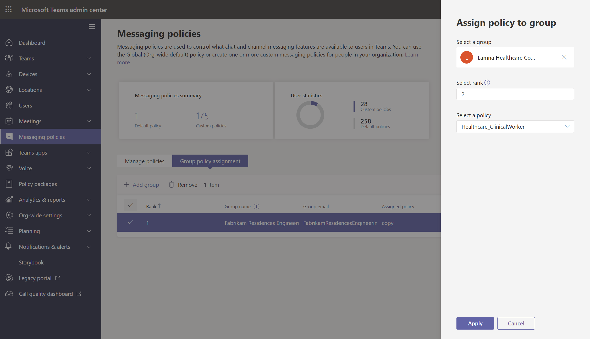

# <a name="assign-policies-to-users-and-groups"></a><span data-ttu-id="4595c-103">Asignar directivas a usuarios y grupos</span><span class="sxs-lookup"><span data-stu-id="4595c-103">Assign policies to users and groups</span></span>

<span data-ttu-id="4595c-104">En este artículo se revisan las diferentes formas de asignar directivas a usuarios y grupos en Microsoft Teams.</span><span class="sxs-lookup"><span data-stu-id="4595c-104">This article reviews the different ways to assign policies to users and groups in Microsoft Teams.</span></span> <span data-ttu-id="4595c-105">Antes de leer, asegúrese de que ha leído Asignar [directivas en Teams: introducción.](policy-assignment-overview.md)</span><span class="sxs-lookup"><span data-stu-id="4595c-105">Before reading, be sure you've read [Assign policies in Teams - getting started](policy-assignment-overview.md).</span></span>

## <a name="assign-a-policy-to-individual-users"></a><span data-ttu-id="4595c-106">Asignar una directiva a usuarios individuales</span><span class="sxs-lookup"><span data-stu-id="4595c-106">Assign a policy to individual users</span></span>

<span data-ttu-id="4595c-107">Siga estos pasos para asignar una directiva a un usuario individual o a un pequeño número de usuarios a la vez.</span><span class="sxs-lookup"><span data-stu-id="4595c-107">Follow these steps to assign a policy to an individual user or to a small number of users at a time.</span></span>

### <a name="use-the-microsoft-teams-admin-center"></a><span data-ttu-id="4595c-108">Usar el Centro de administración de Microsoft Teams</span><span class="sxs-lookup"><span data-stu-id="4595c-108">Use the Microsoft Teams admin center</span></span>

<span data-ttu-id="4595c-109">Para asignar una directiva a un usuario:</span><span class="sxs-lookup"><span data-stu-id="4595c-109">To assign a policy to a user:</span></span>

1. <span data-ttu-id="4595c-110">En el panel de navegación izquierdo del Centro de administración de Microsoft Teams, vaya a **Usuarios** y, a continuación, seleccione el usuario.</span><span class="sxs-lookup"><span data-stu-id="4595c-110">In the left navigation of the Microsoft Teams admin center, go to **Users**, and then select the user.</span></span>
2. <span data-ttu-id="4595c-111">Seleccione el usuario haciendo clic a la izquierda del nombre de usuario y, a continuación, **seleccione Editar configuración.**</span><span class="sxs-lookup"><span data-stu-id="4595c-111">Select the user by clicking to the left of the user name, and then select **Edit settings**.</span></span>
3. <span data-ttu-id="4595c-112">Seleccione la directiva que desea asignar y, a continuación, **seleccione Aplicar.**</span><span class="sxs-lookup"><span data-stu-id="4595c-112">Select the policy you want to assign, and then select **Apply**.</span></span>


<span data-ttu-id="4595c-114">También puede hacer lo siguiente:</span><span class="sxs-lookup"><span data-stu-id="4595c-114">Or, you can also do the following:</span></span>

1. <span data-ttu-id="4595c-115">En el panel de navegación izquierdo del Centro de administración de Microsoft Teams, vaya a la página de directiva.</span><span class="sxs-lookup"><span data-stu-id="4595c-115">In the left navigation of the Microsoft Teams admin center, go to the policy page.</span></span>
2. <span data-ttu-id="4595c-116">Seleccione la directiva que desea asignar haciendo clic a la izquierda del nombre de la directiva.</span><span class="sxs-lookup"><span data-stu-id="4595c-116">Select the policy you want to assign by clicking to the left of the policy name.</span></span>
3. <span data-ttu-id="4595c-117">Seleccione **Administrar usuarios**.</span><span class="sxs-lookup"><span data-stu-id="4595c-117">Select **Manage users**.</span></span>
4. <span data-ttu-id="4595c-118">En el panel **Administrar usuarios**, busque el usuario por su nombre para mostrar o por su nombre de usuario, seleccione el nombre y, después, haga clic en **Agregar**.</span><span class="sxs-lookup"><span data-stu-id="4595c-118">In the **Manage users** pane, search for the user by display name or by user name, select the name, and then select **Add**.</span></span> <span data-ttu-id="4595c-119">Repita este paso por cada usuario que quiera agregar.</span><span class="sxs-lookup"><span data-stu-id="4595c-119">Repeat this step for each user that you want to add.</span></span>
5. <span data-ttu-id="4595c-120">Cuando haya terminado de agregar usuarios, seleccione **Aplicar**.</span><span class="sxs-lookup"><span data-stu-id="4595c-120">When you're finished adding users, select **Apply**.</span></span>


### <a name="use-powershell"></a><span data-ttu-id="4595c-122">Usar PowerShell</span><span class="sxs-lookup"><span data-stu-id="4595c-122">Use PowerShell</span></span>

<span data-ttu-id="4595c-123">Cada tipo de directiva tiene su propio conjunto de cmdlets para administrarlo.</span><span class="sxs-lookup"><span data-stu-id="4595c-123">Each policy type has its own set of cmdlets for managing it.</span></span> <span data-ttu-id="4595c-124">Use el ```Grant-``` cmdlet de un tipo de directiva determinado para asignar la directiva.</span><span class="sxs-lookup"><span data-stu-id="4595c-124">Use the ```Grant-``` cmdlet for a given policy type to assign the policy.</span></span> <span data-ttu-id="4595c-125">Por ejemplo, use el ```Grant-CsTeamsMeetingPolicy``` cmdlet para asignar una directiva de reunión de Teams a los usuarios.</span><span class="sxs-lookup"><span data-stu-id="4595c-125">For example, use the ```Grant-CsTeamsMeetingPolicy``` cmdlet to assign a Teams meeting policy to users.</span></span> <span data-ttu-id="4595c-126">Estos cmdlets se incluyen en el módulo de PowerShell de Teams y se documentan en la referencia de [cmdlet de Skype Empresarial.](https://docs.microsoft.com/powershell/skype)</span><span class="sxs-lookup"><span data-stu-id="4595c-126">These cmdlets are included in the Teams PowerShell module and are documented in the [Skype for Business cmdlet reference](https://docs.microsoft.com/powershell/skype).</span></span>

 <span data-ttu-id="4595c-127">Descargue e instale la versión pública de [PowerShell](https://www.powershellgallery.com/packages/MicrosoftTeams/) de Teams (si aún no lo ha hecho) y ejecute lo siguiente para conectarse.</span><span class="sxs-lookup"><span data-stu-id="4595c-127">Download and install the [Teams PowerShell public release](https://www.powershellgallery.com/packages/MicrosoftTeams/) (if you haven't already), and then run the following to connect.</span></span>

> [!NOTE]
> <span data-ttu-id="4595c-128">El conector en línea del cliente de Skype® Empresarial actualmente forma parte del módulo más reciente de Windows PowerShell de Teams.</span><span class="sxs-lookup"><span data-stu-id="4595c-128">Skype for Business Online Connector is currently part of the latest Teams PowerShell module.</span></span>
>
> <span data-ttu-id="4595c-129">Si usa la última versión pública de PowerShell de [Teams,](https://www.powershellgallery.com/packages/MicrosoftTeams/)no es necesario instalar Skype Empresarial Online Connector.</span><span class="sxs-lookup"><span data-stu-id="4595c-129">If you're using the latest [Teams PowerShell public release](https://www.powershellgallery.com/packages/MicrosoftTeams/), you don't need to install the Skype for Business Online Connector.</span></span>

```powershell
  # When using Teams PowerShell Module

   Import-Module MicrosoftTeams
   $credential = Get-Credential
   Connect-MicrosoftTeams -Credential $credential
```

<span data-ttu-id="4595c-130">En este ejemplo, asignamos una directiva de reunión de Teams denominada Directiva de reunión de estudiantes a un usuario denominado Reda.</span><span class="sxs-lookup"><span data-stu-id="4595c-130">In this example, we assign a Teams meeting policy named Student Meeting Policy to a user named Reda.</span></span>

```powershell
Grant-CsTeamsMeetingPolicy -Identity reda@contoso.com -PolicyName "Student Meeting Policy"
```

<span data-ttu-id="4595c-131">Para obtener más información, lea [Administrar directivas a través de PowerShell.](teams-powershell-managing-teams.md#manage-policies-via-powershell)</span><span class="sxs-lookup"><span data-stu-id="4595c-131">To learn more, read [Manage policies via PowerShell](teams-powershell-managing-teams.md#manage-policies-via-powershell).</span></span>

## <a name="assign-a-policy-to-a-group"></a><span data-ttu-id="4595c-132">Asignar una directiva a un grupo</span><span class="sxs-lookup"><span data-stu-id="4595c-132">Assign a policy to a group</span></span>

<span data-ttu-id="4595c-133">La asignación de directivas a grupos le permite asignar una directiva a un grupo de usuarios, como un grupo de seguridad o una lista de distribución.</span><span class="sxs-lookup"><span data-stu-id="4595c-133">Policy assignment to groups lets you assign a policy to a group of users, such as a security group or distribution list.</span></span> <span data-ttu-id="4595c-134">La asignación de directiva se extiende a los miembros del grupo en función de las reglas de prioridad.</span><span class="sxs-lookup"><span data-stu-id="4595c-134">The policy assignment is propagated to members of the group according to precedence rules.</span></span> <span data-ttu-id="4595c-135">A medida que se agregan o se eliminan miembros de un grupo, sus asignaciones de directivas heredadas se actualizan correspondientemente.</span><span class="sxs-lookup"><span data-stu-id="4595c-135">As members are added to or removed from a group, their inherited policy assignments are updated accordingly.</span></span>

<span data-ttu-id="4595c-136">La asignación de directivas a grupos se recomienda para grupos de hasta 50 000 usuarios, pero también funcionará con grupos más grandes.</span><span class="sxs-lookup"><span data-stu-id="4595c-136">Policy assignment to groups is recommended for groups of up to 50,000 users but it will also work with larger groups.</span></span>

<span data-ttu-id="4595c-137">Al asignar la directiva, se asigna inmediatamente al grupo.</span><span class="sxs-lookup"><span data-stu-id="4595c-137">When you assign the policy, it's immediately assigned to the group.</span></span> <span data-ttu-id="4595c-138">Sin embargo, la propagación de la asignación de directivas a los miembros del grupo se realiza como una operación en segundo plano y puede tardar algún tiempo, dependiendo del tamaño del grupo.</span><span class="sxs-lookup"><span data-stu-id="4595c-138">However, the propagation of the policy assignment to members of the group is performed as a background operation and might take some time, depending on the size of the group.</span></span> <span data-ttu-id="4595c-139">Lo mismo ocurre cuando una directiva no está desasignada de un grupo o cuando se agregan o quitan miembros de un grupo.</span><span class="sxs-lookup"><span data-stu-id="4595c-139">The same is true when a policy is unassigned from a group, or when members are added to or removed from a group.</span></span>

<span data-ttu-id="4595c-140">Las asignaciones de directivas de grupo solo se propagan a los usuarios que son miembros directos del grupo.</span><span class="sxs-lookup"><span data-stu-id="4595c-140">Group policy assignments are only propagated to users who are direct members of the group.</span></span> <span data-ttu-id="4595c-141">Las tareas no se propagan a los miembros de grupos anidados.</span><span class="sxs-lookup"><span data-stu-id="4595c-141">The assignments aren't propagated to members of nested groups.</span></span>

### <a name="what-you-need-to-know-about-policy-assignment-to-groups"></a><span data-ttu-id="4595c-142">Qué necesita saber sobre la asignación de directivas a grupos</span><span class="sxs-lookup"><span data-stu-id="4595c-142">What you need to know about policy assignment to groups</span></span>

<span data-ttu-id="4595c-143">Antes de empezar, es importante comprender las reglas de prioridad y la clasificación de las asignaciones de grupo.</span><span class="sxs-lookup"><span data-stu-id="4595c-143">Before you get started, it's important to understand precedence rules and group assignment ranking.</span></span>

#### <a name="precedence-rules"></a><span data-ttu-id="4595c-144">Reglas de prioridad</span><span class="sxs-lookup"><span data-stu-id="4595c-144">Precedence rules</span></span>

<span data-ttu-id="4595c-145">Para un tipo de directiva determinado, la directiva efectiva de un usuario se determina según lo siguiente:</span><span class="sxs-lookup"><span data-stu-id="4595c-145">For a given policy type, a user's effective policy is determined according to the following:</span></span>

- <span data-ttu-id="4595c-146">Una directiva que se asigna directamente a un usuario tiene prioridad sobre cualquier otra directiva del mismo tipo asignada a un grupo.</span><span class="sxs-lookup"><span data-stu-id="4595c-146">A policy that's directly assigned to a user takes precedence over any other policy of the same type that's assigned to a group.</span></span> <span data-ttu-id="4595c-147">En otras palabras, si a un usuario se le asigna directamente una directiva de un tipo determinado, ese usuario no heredará una directiva del mismo tipo de un grupo.</span><span class="sxs-lookup"><span data-stu-id="4595c-147">In other words, if a user is directly assigned a policy of a given type, that user won't inherit a policy of the same type from a group.</span></span> <span data-ttu-id="4595c-148">Esto también significa que si un usuario tiene una directiva de un tipo determinado que se le asignó directamente, debe quitar esa directiva del usuario antes de que pueda heredar una directiva del mismo tipo de un grupo.</span><span class="sxs-lookup"><span data-stu-id="4595c-148">This also means that if a user has a policy of a given type that was directly assigned to them, you have to remove that policy from the user before they can inherit a policy of the same type from a group.</span></span>
- <span data-ttu-id="4595c-149">Si un usuario no tiene una directiva asignada directamente a ellos y es miembro de dos o más grupos y cada grupo tiene asignada una directiva del mismo tipo, el usuario hereda la directiva de la asignación de grupo que tiene la clasificación más alta.</span><span class="sxs-lookup"><span data-stu-id="4595c-149">If a user doesn't have a policy directly assigned to them and is a member of two or more groups and each group has a policy of the same type assigned to it, the user inherits the policy of the group assignment that has the highest ranking.</span></span>
- <span data-ttu-id="4595c-150">Si un usuario no es miembro de ningún grupo al que se le haya asignado una directiva, la directiva global (predeterminada para toda la organización) para ese tipo de directiva se aplica al usuario.</span><span class="sxs-lookup"><span data-stu-id="4595c-150">If a user isn't a member of any groups that are assigned a policy, the global (Org-wide default) policy for that policy type applies to the user.</span></span>

<span data-ttu-id="4595c-151">La directiva efectiva de un usuario se actualiza según estas reglas:</span><span class="sxs-lookup"><span data-stu-id="4595c-151">A user's effective policy is updated according to these rules:</span></span>

- <span data-ttu-id="4595c-152">cuando se agrega o quita un usuario de un grupo al que se le ha asignado una directiva.</span><span class="sxs-lookup"><span data-stu-id="4595c-152">when a user is added to or removed from a group that's assigned a policy.</span></span>
- <span data-ttu-id="4595c-153">una directiva no está desasignada de un grupo.</span><span class="sxs-lookup"><span data-stu-id="4595c-153">a policy is unassigned from a group.</span></span>
- <span data-ttu-id="4595c-154">se quita una directiva que está asignada directamente al usuario.</span><span class="sxs-lookup"><span data-stu-id="4595c-154">a policy that's directly assigned to the user is removed.</span></span>

#### <a name="group-assignment-ranking"></a><span data-ttu-id="4595c-155">Clasificación de tareas de grupo</span><span class="sxs-lookup"><span data-stu-id="4595c-155">Group assignment ranking</span></span>

<span data-ttu-id="4595c-156">Al asignar una directiva a un grupo, se especifica una clasificación para la asignación de grupo.</span><span class="sxs-lookup"><span data-stu-id="4595c-156">When you assign a policy to a group, you specify a ranking for the group assignment.</span></span> <span data-ttu-id="4595c-157">Esto se usa para determinar qué directiva debe heredar un usuario como su directiva efectiva si el usuario es miembro de dos o más grupos y a cada grupo se le asigna una directiva del mismo tipo.</span><span class="sxs-lookup"><span data-stu-id="4595c-157">This is used to determine which policy a user should inherit as their effective policy if the user is a member of two or more groups and each group is assigned a policy of the same type.</span></span>

<span data-ttu-id="4595c-158">La clasificación de asignaciones de grupo es relativa a otras asignaciones de grupo del mismo tipo.</span><span class="sxs-lookup"><span data-stu-id="4595c-158">The group assignment ranking is relative to other group assignments of the same type.</span></span> <span data-ttu-id="4595c-159">Por ejemplo, si va a asignar una directiva de llamada a dos grupos, establezca la clasificación de una tarea en 1 y la otra en 2, siendo 1 la clasificación más alta.</span><span class="sxs-lookup"><span data-stu-id="4595c-159">For example, if you're assigning a calling policy to two groups, set the ranking of one assignment to 1 and the other to 2, with 1 being the highest ranking.</span></span> <span data-ttu-id="4595c-160">La clasificación de asignaciones de grupo indica qué pertenencia a un grupo es más importante o más relevante que otras pertenencias de grupo con respecto a la herencia.</span><span class="sxs-lookup"><span data-stu-id="4595c-160">The group assignment ranking indicates which group membership is more important or more relevant than other group memberships with regards to inheritance.</span></span>

<span data-ttu-id="4595c-161">Por ejemplo, tiene dos grupos: Empleados de la Tienda y Administradores de tienda.</span><span class="sxs-lookup"><span data-stu-id="4595c-161">Say, for example, you have two groups, Store Employees and Store Managers.</span></span> <span data-ttu-id="4595c-162">A ambos grupos se les asigna una directiva de llamadas de Teams, una directiva de llamadas de empleados de store y una directiva de llamadas de administradores de tienda, respectivamente.</span><span class="sxs-lookup"><span data-stu-id="4595c-162">Both groups are assigned a Teams calling policy, Store Employees Calling Policy and Store Managers Calling Policy, respectively.</span></span> <span data-ttu-id="4595c-163">Para un administrador de tienda que está en ambos grupos, su rol como administrador es más relevante que su rol como empleado, por lo que la directiva de llamadas asignada al grupo Administradores de tienda debería tener una clasificación superior.</span><span class="sxs-lookup"><span data-stu-id="4595c-163">For a store manager who is in both groups, their role as a manager is more relevant than their role as an employee, so the calling policy that's assigned to the Store Managers group should have a higher ranking.</span></span>

|<span data-ttu-id="4595c-164">Grupo</span><span class="sxs-lookup"><span data-stu-id="4595c-164">Group</span></span> |<span data-ttu-id="4595c-165">Nombre de directiva de llamadas de Teams</span><span class="sxs-lookup"><span data-stu-id="4595c-165">Teams calling policy name</span></span>  |<span data-ttu-id="4595c-166">Clasificación</span><span class="sxs-lookup"><span data-stu-id="4595c-166">Rank</span></span>|
|---------|---------|---|
|<span data-ttu-id="4595c-167">Administradores de tienda</span><span class="sxs-lookup"><span data-stu-id="4595c-167">Store Managers</span></span>   |<span data-ttu-id="4595c-168">Directiva de llamadas de administradores de tienda</span><span class="sxs-lookup"><span data-stu-id="4595c-168">Store Managers Calling Policy</span></span>         |<span data-ttu-id="4595c-169">1</span><span class="sxs-lookup"><span data-stu-id="4595c-169">1</span></span>|
|<span data-ttu-id="4595c-170">Almacenar empleados</span><span class="sxs-lookup"><span data-stu-id="4595c-170">Store Employees</span></span>    |<span data-ttu-id="4595c-171">Directiva de llamadas de empleados de store</span><span class="sxs-lookup"><span data-stu-id="4595c-171">Store Employees Calling Policy</span></span>      |<span data-ttu-id="4595c-172">2</span><span class="sxs-lookup"><span data-stu-id="4595c-172">2</span></span>|

<span data-ttu-id="4595c-173">Si no especifica una clasificación, la asignación de directivas se asigna a la clasificación más baja.</span><span class="sxs-lookup"><span data-stu-id="4595c-173">If you don't specify a ranking, the policy assignment is given the lowest ranking.</span></span>

### <a name="in-the-teams-admin-center"></a><span data-ttu-id="4595c-174">En el Centro de administración de Teams</span><span class="sxs-lookup"><span data-stu-id="4595c-174">In the Teams admin center</span></span>

> [!NOTE]
> <span data-ttu-id="4595c-175">Actualmente, la asignación de directivas a grupos que usan el Centro de administración de Microsoft Teams solo está disponible para la directiva de llamadas de Teams, la directiva de parque de llamadas de Teams, la directiva de Teams, la directiva de eventos en directo de Teams, la directiva de reunión de Teams y la directiva de mensajería de Teams.</span><span class="sxs-lookup"><span data-stu-id="4595c-175">Currently, policy assignment to groups using the Microsoft Teams admin center is only available for Teams calling policy, Teams call park policy, Teams policy, Teams live events policy, Teams meeting policy, and Teams messaging policy.</span></span> <span data-ttu-id="4595c-176">Para otros tipos de directiva, use PowerShell.</span><span class="sxs-lookup"><span data-stu-id="4595c-176">For other policy types, use PowerShell.</span></span>

1. <span data-ttu-id="4595c-177">En el panel de navegación izquierdo del Centro de administración de Microsoft Teams, vaya a la página de tipo de directiva.</span><span class="sxs-lookup"><span data-stu-id="4595c-177">In the left navigation of the Microsoft Teams admin center, go to the policy type page.</span></span> <span data-ttu-id="4595c-178">Por ejemplo, vaya a **Directivas de reunión de**  >  **reuniones.**</span><span class="sxs-lookup"><span data-stu-id="4595c-178">For example, go to **Meetings** > **Meeting policies**.</span></span>
2. <span data-ttu-id="4595c-179">Seleccione la **pestaña Asignación de directivas de** grupo.</span><span class="sxs-lookup"><span data-stu-id="4595c-179">Select the **Group policy assignment** tab.</span></span>
3. <span data-ttu-id="4595c-180">Seleccione **Agregar grupo** y, a continuación, en el panel Asignar **directiva** al grupo, haga lo siguiente:</span><span class="sxs-lookup"><span data-stu-id="4595c-180">Select **Add group**, and then in the **Assign policy to group** pane, do the following:</span></span>
    1. <span data-ttu-id="4595c-181">Busque y agregue el grupo al que desea asignar la directiva.</span><span class="sxs-lookup"><span data-stu-id="4595c-181">Search for and add the group you want to assign the policy to.</span></span>
    2. <span data-ttu-id="4595c-182">Establezca la clasificación de la tarea de grupo.</span><span class="sxs-lookup"><span data-stu-id="4595c-182">Set the ranking for the group assignment.</span></span>
    3. <span data-ttu-id="4595c-183">Seleccione la directiva que desea asignar.</span><span class="sxs-lookup"><span data-stu-id="4595c-183">Select the policy that you want to assign.</span></span>
    4. <span data-ttu-id="4595c-184">Seleccione **Aplicar**.</span><span class="sxs-lookup"><span data-stu-id="4595c-184">Select **Apply**.</span></span>
    


<span data-ttu-id="4595c-186">Para quitar una asignación de directiva de grupo, en la pestaña **Asignación** de directivas de grupo de la página directiva, seleccione la asignación de grupo y, a continuación, **seleccione Quitar**.</span><span class="sxs-lookup"><span data-stu-id="4595c-186">To remove a group policy assignment, on the **Group policy assignment** tab of the policy page, select the group assignment, and then select **Remove**.</span></span>

<span data-ttu-id="4595c-187">Para cambiar la clasificación de una asignación de grupo, primero debe quitar la asignación de directiva de grupo.</span><span class="sxs-lookup"><span data-stu-id="4595c-187">To change the ranking of a group assignment, you have to first remove the group policy assignment.</span></span> <span data-ttu-id="4595c-188">Después, siga los pasos anteriores para asignar la directiva a un grupo.</span><span class="sxs-lookup"><span data-stu-id="4595c-188">Then, follow the steps above to assign the policy to a group.</span></span>

### <a name="use-the-powershell-option"></a><span data-ttu-id="4595c-189">Usar la opción de PowerShell</span><span class="sxs-lookup"><span data-stu-id="4595c-189">Use the PowerShell option</span></span>

> [!NOTE]
> <span data-ttu-id="4595c-190">Actualmente, la asignación de directivas a grupos que usan PowerShell no está disponible para todos los tipos de directivas de Teams.</span><span class="sxs-lookup"><span data-stu-id="4595c-190">Currently, policy assignment to groups using PowerShell isn't available for all Teams policy types.</span></span> <span data-ttu-id="4595c-191">Vea [New-CsGroupPolicyAssignment para](https://docs.microsoft.com/powershell/module/teams/new-csgrouppolicyassignment) obtener la lista de tipos de directiva admitidos.</span><span class="sxs-lookup"><span data-stu-id="4595c-191">See [New-CsGroupPolicyAssignment](https://docs.microsoft.com/powershell/module/teams/new-csgrouppolicyassignment) for the list of supported policy types.</span></span>

#### <a name="install-and-connect-to-the-microsoft-teams-powershell-module"></a><span data-ttu-id="4595c-192">Instalar y conectarse al módulo De PowerShell de Microsoft Teams</span><span class="sxs-lookup"><span data-stu-id="4595c-192">Install and connect to the Microsoft Teams PowerShell module</span></span>

<span data-ttu-id="4595c-193">Para obtener instrucciones paso a paso, vea [Instalar PowerShell de Teams.](teams-powershell-install.md)</span><span class="sxs-lookup"><span data-stu-id="4595c-193">For step-by-step guidance, see [Install Teams PowerShell](teams-powershell-install.md).</span></span>

#### <a name="assign-a-policy-to-a-group-of-users"></a><span data-ttu-id="4595c-194">Asignar una directiva a un grupo de usuarios</span><span class="sxs-lookup"><span data-stu-id="4595c-194">Assign a policy to a group of users</span></span>

<span data-ttu-id="4595c-195">Use el cmdlet [New-CsGroupPolicyAssignment](https://docs.microsoft.com/powershell/module/teams/new-csgrouppolicyassignment) para asignar una directiva a un grupo.</span><span class="sxs-lookup"><span data-stu-id="4595c-195">Use the [New-CsGroupPolicyAssignment](https://docs.microsoft.com/powershell/module/teams/new-csgrouppolicyassignment) cmdlet to assign a policy to a group.</span></span> <span data-ttu-id="4595c-196">Puede especificar un grupo con el id. de objeto, la dirección SIP o la dirección de correo electrónico.</span><span class="sxs-lookup"><span data-stu-id="4595c-196">You can specify a group by using the object ID, SIP address, or email address.</span></span>

<span data-ttu-id="4595c-197">En este ejemplo, asignamos una directiva de reunión de Teams denominada Directiva de reunión de administradores minoristas a un grupo con una clasificación de tareas de 1.</span><span class="sxs-lookup"><span data-stu-id="4595c-197">In this example, we assign a Teams meeting policy named Retail Managers Meeting Policy to a group with an assignment ranking of 1.</span></span>

```powershell
New-CsGroupPolicyAssignment -GroupId d8ebfa45-0f28-4d2d-9bcc-b158a49e2d17 -PolicyType TeamsMeetingPolicy -PolicyName "Retail Managers Meeting Policy" -Rank 1
```

#### <a name="get-policy-assignments-for-a-group"></a><span data-ttu-id="4595c-198">Obtener asignaciones de directivas para un grupo</span><span class="sxs-lookup"><span data-stu-id="4595c-198">Get policy assignments for a group</span></span>

<span data-ttu-id="4595c-199">Use el cmdlet [Get-CsGroupPolicyAssignment para](https://docs.microsoft.com/powershell/module/teams/get-csgrouppolicyassignment) obtener todas las directivas asignadas a un grupo.</span><span class="sxs-lookup"><span data-stu-id="4595c-199">Use the [Get-CsGroupPolicyAssignment](https://docs.microsoft.com/powershell/module/teams/get-csgrouppolicyassignment) cmdlet to get all policies assigned to a group.</span></span> <span data-ttu-id="4595c-200">Tenga en cuenta que los grupos siempre aparecen en la lista por su id. de grupo, incluso si se usó su dirección SIP o su dirección de correo electrónico para asignar la directiva.</span><span class="sxs-lookup"><span data-stu-id="4595c-200">Note that groups are always listed by their group ID even if its SIP address or email address was used to assign the policy.</span></span>

<span data-ttu-id="4595c-201">En este ejemplo, recuperamos todas las directivas asignadas a un grupo específico.</span><span class="sxs-lookup"><span data-stu-id="4595c-201">In this example, we retrieve all policies assigned to a specific group.</span></span>

```powershell
Get-CsGroupPolicyAssignment -GroupId e050ce51-54bc-45b7-b3e6-c00343d31274
```

<span data-ttu-id="4595c-202">En este ejemplo, se devuelven todos los grupos asignados a una directiva de reunión de Teams.</span><span class="sxs-lookup"><span data-stu-id="4595c-202">In this example, we return all groups that are assigned a Teams meeting policy.</span></span>

```powershell
Get-CsGroupPolicyAssignment -PolicyType TeamsMeetingPolicy
```

#### <a name="remove-a-policy-from-a-group"></a><span data-ttu-id="4595c-203">Quitar una directiva de un grupo</span><span class="sxs-lookup"><span data-stu-id="4595c-203">Remove a policy from a group</span></span>

<span data-ttu-id="4595c-204">Use el cmdlet [Remove-CsGroupPolicyAssignment](https://docs.microsoft.com/powershell/module/teams/remove-csgrouppolicyassignment) para quitar una directiva de un grupo.</span><span class="sxs-lookup"><span data-stu-id="4595c-204">Use the [Remove-CsGroupPolicyAssignment](https://docs.microsoft.com/powershell/module/teams/remove-csgrouppolicyassignment) cmdlet to remove a policy from a group.</span></span> <span data-ttu-id="4595c-205">Al quitar una directiva de un grupo, se actualizan las prioridades de otras directivas del mismo tipo asignadas a ese grupo y que tienen una clasificación inferior.</span><span class="sxs-lookup"><span data-stu-id="4595c-205">When you remove a policy from a group, the priorities of other policies of the same type assigned to that group, and that have a lower ranking, are updated.</span></span> <span data-ttu-id="4595c-206">Por ejemplo, si quita una directiva que tiene una clasificación de 2, las directivas que tienen una clasificación de 3 y 4 se actualizan para reflejar su nueva clasificación.</span><span class="sxs-lookup"><span data-stu-id="4595c-206">For example, if you remove a policy that has a ranking of 2, policies that have a ranking of 3 and 4 are updated to reflect their new ranking.</span></span> <span data-ttu-id="4595c-207">En las dos tablas siguientes se muestra este ejemplo.</span><span class="sxs-lookup"><span data-stu-id="4595c-207">The following two tables show this example.</span></span>

<span data-ttu-id="4595c-208">Esta es una lista de las tareas de directiva y las prioridades de una directiva de reunión de Teams.</span><span class="sxs-lookup"><span data-stu-id="4595c-208">Here's a list of the policy assignments and priorities for a Teams meeting policy.</span></span>

|<span data-ttu-id="4595c-209">Nombre del grupo</span><span class="sxs-lookup"><span data-stu-id="4595c-209">Group name</span></span>  |<span data-ttu-id="4595c-210">Nombre de la directiva</span><span class="sxs-lookup"><span data-stu-id="4595c-210">Policy name</span></span>  |<span data-ttu-id="4595c-211">Clasificación</span><span class="sxs-lookup"><span data-stu-id="4595c-211">Rank</span></span>|
|---------|---------|---------|
|<span data-ttu-id="4595c-212">Ventas</span><span class="sxs-lookup"><span data-stu-id="4595c-212">Sales</span></span>    |<span data-ttu-id="4595c-213">Directiva de ventas</span><span class="sxs-lookup"><span data-stu-id="4595c-213">Sales policy</span></span>       | <span data-ttu-id="4595c-214">1</span><span class="sxs-lookup"><span data-stu-id="4595c-214">1</span></span>        |
|<span data-ttu-id="4595c-215">Región Oeste</span><span class="sxs-lookup"><span data-stu-id="4595c-215">West Region</span></span>     |<span data-ttu-id="4595c-216">Directiva región oeste</span><span class="sxs-lookup"><span data-stu-id="4595c-216">West Region policy</span></span>         |<span data-ttu-id="4595c-217">2</span><span class="sxs-lookup"><span data-stu-id="4595c-217">2</span></span>         |
|<span data-ttu-id="4595c-218">División</span><span class="sxs-lookup"><span data-stu-id="4595c-218">Division</span></span>    |<span data-ttu-id="4595c-219">Directiva de división</span><span class="sxs-lookup"><span data-stu-id="4595c-219">Division policy</span></span>         |<span data-ttu-id="4595c-220">3</span><span class="sxs-lookup"><span data-stu-id="4595c-220">3</span></span>         |
|<span data-ttu-id="4595c-221">Subsidiaria</span><span class="sxs-lookup"><span data-stu-id="4595c-221">Subsidiary</span></span>   |<span data-ttu-id="4595c-222">Directiva subsidiaria</span><span class="sxs-lookup"><span data-stu-id="4595c-222">Subsidiary policy</span></span>        |<span data-ttu-id="4595c-223">4</span><span class="sxs-lookup"><span data-stu-id="4595c-223">4</span></span>         |

<span data-ttu-id="4595c-224">Si quitamos la directiva región oeste del grupo Región oeste, las asignaciones de directivas y las prioridades se actualizan de la siguiente manera.</span><span class="sxs-lookup"><span data-stu-id="4595c-224">If we remove the West Region policy from the West Region group, the policy assignments and priorities are updated as follows.</span></span>

|<span data-ttu-id="4595c-225">Nombre del grupo</span><span class="sxs-lookup"><span data-stu-id="4595c-225">Group name</span></span>  |<span data-ttu-id="4595c-226">Nombre de la directiva</span><span class="sxs-lookup"><span data-stu-id="4595c-226">Policy name</span></span>  |<span data-ttu-id="4595c-227">Clasificación</span><span class="sxs-lookup"><span data-stu-id="4595c-227">Rank</span></span>|
|---------|---------|---------|
|<span data-ttu-id="4595c-228">Ventas</span><span class="sxs-lookup"><span data-stu-id="4595c-228">Sales</span></span>    |<span data-ttu-id="4595c-229">Directiva de ventas</span><span class="sxs-lookup"><span data-stu-id="4595c-229">Sales policy</span></span>       | <span data-ttu-id="4595c-230">1</span><span class="sxs-lookup"><span data-stu-id="4595c-230">1</span></span>        |
|<span data-ttu-id="4595c-231">División</span><span class="sxs-lookup"><span data-stu-id="4595c-231">Division</span></span>    |<span data-ttu-id="4595c-232">Directiva de división</span><span class="sxs-lookup"><span data-stu-id="4595c-232">Division policy</span></span>         |<span data-ttu-id="4595c-233">2</span><span class="sxs-lookup"><span data-stu-id="4595c-233">2</span></span>         |
|<span data-ttu-id="4595c-234">Subsidiaria</span><span class="sxs-lookup"><span data-stu-id="4595c-234">Subsidiary</span></span>   |<span data-ttu-id="4595c-235">Directiva subsidiaria</span><span class="sxs-lookup"><span data-stu-id="4595c-235">Subsidiary policy</span></span>        |<span data-ttu-id="4595c-236">3</span><span class="sxs-lookup"><span data-stu-id="4595c-236">3</span></span>        |

<span data-ttu-id="4595c-237">En este ejemplo, quitamos la directiva de reunión de Teams de un grupo.</span><span class="sxs-lookup"><span data-stu-id="4595c-237">In this example, we remove the Teams meeting policy from a group.</span></span>

```powershell
Remove-CsGroupPolicyAssignment -PolicyType TeamsMeetingPolicy -GroupId f985e013-0826-40bb-8c94-e5f367076044
```

#### <a name="change-a-policy-assignment-for-a-group"></a><span data-ttu-id="4595c-238">Cambiar una asignación de directiva para un grupo</span><span class="sxs-lookup"><span data-stu-id="4595c-238">Change a policy assignment for a group</span></span>

> [!NOTE]
> <span data-ttu-id="4595c-239">El cmdlet [Set-CsGroupPolicyAssignment](https://docs.microsoft.com/powershell/module/teams/set-csgrouppolicyassignment) estará disponible próximamente.</span><span class="sxs-lookup"><span data-stu-id="4595c-239">The [Set-CsGroupPolicyAssignment](https://docs.microsoft.com/powershell/module/teams/set-csgrouppolicyassignment) cmdlet will be available soon.</span></span> <span data-ttu-id="4595c-240">Mientras tanto, para cambiar una asignación de directiva de grupo, puede quitar la asignación de directiva actual del grupo y, después, agregar una nueva asignación de directiva.</span><span class="sxs-lookup"><span data-stu-id="4595c-240">In the meantime, to change a group policy assignment, you can remove the current policy assignment from the group, and then add a new policy assignment.</span></span>

<span data-ttu-id="4595c-241">Después de asignar una directiva a un grupo, puede usar el cmdlet [Set-CsGroupPolicyAssignment](https://docs.microsoft.com/powershell/module/teams/set-csgrouppolicyassignment) para cambiar la asignación de directivas de ese grupo de la siguiente manera:</span><span class="sxs-lookup"><span data-stu-id="4595c-241">After you assign a policy to a group, you can use the [Set-CsGroupPolicyAssignment](https://docs.microsoft.com/powershell/module/teams/set-csgrouppolicyassignment) cmdlet to change that group's policy assignment as follows:</span></span>

- <span data-ttu-id="4595c-242">Cambiar la clasificación</span><span class="sxs-lookup"><span data-stu-id="4595c-242">Change the ranking</span></span>
- <span data-ttu-id="4595c-243">Cambiar la directiva de un tipo de directiva determinado</span><span class="sxs-lookup"><span data-stu-id="4595c-243">Change the policy of a given policy type</span></span>
- <span data-ttu-id="4595c-244">Cambiar la directiva de un tipo de directiva determinado y la clasificación</span><span class="sxs-lookup"><span data-stu-id="4595c-244">Change the policy of a given policy type and the ranking</span></span>

<span data-ttu-id="4595c-245">En este ejemplo, cambiamos la directiva de parque de llamadas de Teams de un grupo a una directiva denominada SupportCallPark y la clasificación de tareas a 3.</span><span class="sxs-lookup"><span data-stu-id="4595c-245">In this example, we change a group's Teams call park policy to a policy named SupportCallPark and the assignment ranking to 3.</span></span>

```powershell
Set-CsGroupPolicyAssignment -GroupId 566b8d39-5c5c-4aaa-bc07-4f36278a1b38 -PolicyType TeamsMeetingPolicy -PolicyName SupportCallPark -Rank 3
```

#### <a name="change-the-effective-policy-for-a-user"></a><span data-ttu-id="4595c-246">Cambiar la directiva eficaz para un usuario</span><span class="sxs-lookup"><span data-stu-id="4595c-246">Change the effective policy for a user</span></span>

<span data-ttu-id="4595c-247">Este es un ejemplo de cómo cambiar la directiva eficaz para un usuario al que se le asigna directamente una directiva.</span><span class="sxs-lookup"><span data-stu-id="4595c-247">Here's an example of how to change the effective policy for a user who is directly assigned a policy.</span></span>

<span data-ttu-id="4595c-248">En primer lugar, usamos el cmdlet [Get-CsUserPolicyAssignment](https://docs.microsoft.com/powershell/module/teams/get-csuserpolicyassignment) junto con el parámetro para obtener detalles de las directivas de difusión de reuniones de ```PolicySource``` Teams asociadas con el usuario.</span><span class="sxs-lookup"><span data-stu-id="4595c-248">First, we use the [Get-CsUserPolicyAssignment](https://docs.microsoft.com/powershell/module/teams/get-csuserpolicyassignment) cmdlet together with the ```PolicySource``` parameter to get details of the Teams meeting broadcast policies associated with the user.</span></span>

```powershell
Get-CsUserPolicyAssignment -Identity daniel@contoso.com -PolicyType TeamsMeetingBroadcastPolicy | select -ExpandProperty PolicySource
```

<span data-ttu-id="4595c-249">El resultado muestra que al usuario se le asignó directamente una directiva de difusión de reunión de Teams denominada Eventos de empleado, que tiene prioridad sobre la directiva denominada Eventos en directo de proveedor asignada a un grupo al que pertenece el usuario.</span><span class="sxs-lookup"><span data-stu-id="4595c-249">The output shows that the user was directly assigned a Teams meeting broadcast policy named Employee Events, which takes precedence over the policy named Vendor Live Events that's assigned to a group the user belongs to.</span></span>

```console
AssignmentType PolicyName         Reference
-------------- ----------         ---------
Direct         Employee Events
Group          Vendor Live Events 566b8d39-5c5c-4aaa-bc07-4f36278a1b38
```

<span data-ttu-id="4595c-250">Ahora, quitamos la directiva Eventos de empleado del usuario.</span><span class="sxs-lookup"><span data-stu-id="4595c-250">Now, we remove the Employee Events policy from the user.</span></span> <span data-ttu-id="4595c-251">Esto significa que el usuario ya no tiene asignada una directiva de difusión de reunión de Teams directamente y heredará la directiva Eventos en directo del proveedor asignada al grupo al que pertenece el usuario.</span><span class="sxs-lookup"><span data-stu-id="4595c-251">This means that the user no longer has a Teams meeting broadcast policy directly assigned to them and will inherit the Vendor Live Events policy that's assigned to the group the user belongs to.</span></span>

<span data-ttu-id="4595c-252">Use el siguiente cmdlet en el módulo PowerShell de Skype Empresarial para ello.</span><span class="sxs-lookup"><span data-stu-id="4595c-252">Use the following cmdlet in the Skype for Business PowerShell module to do this.</span></span>

```powershell
Grant-CsTeamsMeetingBroadcastPolicy -Identity daniel@contoso.com -PolicyName $null
```

<span data-ttu-id="4595c-253">Use el cmdlet siguiente en el módulo de PowerShell de Teams para hacerlo a escala a través de una asignación de directiva por lotes, donde $users es una lista de usuarios que especifique.</span><span class="sxs-lookup"><span data-stu-id="4595c-253">Use following cmdlet in the Teams PowerShell module to do this at scale though a batch policy assignment, where $users is a list of users that you specify.</span></span>

```powershell
New-CsBatchPolicyAssignmentOperation -OperationName "Assigning null at bulk" -PolicyType TeamsMeetingBroadcastPolicy -PolicyName $null -Identity $users  
```

## <a name="assign-a-policy-to-a-batch-of-users"></a><span data-ttu-id="4595c-254">Asignar una directiva a un lote de usuarios</span><span class="sxs-lookup"><span data-stu-id="4595c-254">Assign a policy to a batch of users</span></span>

### <a name="use-the-admin-center"></a><span data-ttu-id="4595c-255">Usar el Centro de administración</span><span class="sxs-lookup"><span data-stu-id="4595c-255">Use the admin center</span></span>

<span data-ttu-id="4595c-256">Para asignar una directiva a los usuarios en masa:</span><span class="sxs-lookup"><span data-stu-id="4595c-256">To assign a policy to users in bulk:</span></span>

1. <span data-ttu-id="4595c-257">En el panel de navegación izquierdo del Centro de administración de Microsoft Teams, seleccione **Usuarios.**</span><span class="sxs-lookup"><span data-stu-id="4595c-257">In the left navigation of the Microsoft Teams admin center, select **Users**.</span></span>
2. <span data-ttu-id="4595c-258">Busque los usuarios a los que desea asignar la directiva o filtre la vista para mostrar los usuarios que desee.</span><span class="sxs-lookup"><span data-stu-id="4595c-258">Search for the users you want to assign the policy to or filter the view to show the users you want.</span></span>
3. <span data-ttu-id="4595c-259">En la columna **&#x2713;** (marca de verificación), seleccione los usuarios.</span><span class="sxs-lookup"><span data-stu-id="4595c-259">In the **&#x2713;** (check mark) column, select the users.</span></span> <span data-ttu-id="4595c-260">Para seleccionar todos los usuarios, haga clic en &#x2713; (marca de verificación) situado en la parte superior de la tabla.</span><span class="sxs-lookup"><span data-stu-id="4595c-260">To select all users, click the &#x2713; (check mark) at the top of the table.</span></span>
4. <span data-ttu-id="4595c-261">Seleccione **Editar configuración,** realice los cambios que desee y, a continuación, **seleccione Aplicar**.</span><span class="sxs-lookup"><span data-stu-id="4595c-261">Select **Edit settings**, make the changes that you want, and then select **Apply**.</span></span>

<span data-ttu-id="4595c-262">Para ver el estado de la asignación de directivas,  en el  banner que aparece en la parte superior de la página Usuarios después de seleccionar Aplicar para enviar la tarea de directiva, seleccione Registro **de actividades.**</span><span class="sxs-lookup"><span data-stu-id="4595c-262">To view the status of your policy assignment, in the banner that appears at the top of the **Users** page after you select **Apply** to submit your policy assignment, select **Activity log**.</span></span> <span data-ttu-id="4595c-263">O bien, en la navegación izquierda del Centro de administración de Microsoft Teams, vaya a Panel **y,** a continuación, en Registro de **actividades,** seleccione **Ver detalles.**</span><span class="sxs-lookup"><span data-stu-id="4595c-263">Or, in the left navigation of the Microsoft Teams admin center, go to **Dashboard**, and then under **Activity log**, select **View details**.</span></span> <span data-ttu-id="4595c-264">El registro de actividades muestra las asignaciones de directivas a lotes de más de 20 usuarios a través del Centro de administración de Microsoft Teams desde los últimos 30 días.</span><span class="sxs-lookup"><span data-stu-id="4595c-264">The Activity log shows policy assignments to batches of more than 20 users through the Microsoft Teams admin center from the last 30 days.</span></span> <span data-ttu-id="4595c-265">Para obtener más información, vea [Ver las asignaciones de directivas en el registro de actividades.](activity-log.md)</span><span class="sxs-lookup"><span data-stu-id="4595c-265">To learn more, see [View your policy assignments in the Activity log](activity-log.md).</span></span>

### <a name="use-powershell-method"></a><span data-ttu-id="4595c-266">Usar método de PowerShell</span><span class="sxs-lookup"><span data-stu-id="4595c-266">Use PowerShell method</span></span>

> [!NOTE]
> <span data-ttu-id="4595c-267">Actualmente, la asignación de directivas por lotes con PowerShell no está disponible para todos los tipos de directivas de Teams.</span><span class="sxs-lookup"><span data-stu-id="4595c-267">Currently, batch policy assignment using PowerShell isn't available for all Teams policy types.</span></span> <span data-ttu-id="4595c-268">Vea [New-CsBatchPolicyAssignmentOperation](https://docs.microsoft.com/powershell/module/teams/new-csbatchpolicyassignmentoperation) para obtener la lista de tipos de directiva admitidos.</span><span class="sxs-lookup"><span data-stu-id="4595c-268">See [New-CsBatchPolicyAssignmentOperation](https://docs.microsoft.com/powershell/module/teams/new-csbatchpolicyassignmentoperation) for the list of supported policy types.</span></span>

<span data-ttu-id="4595c-269">Con la asignación de directivas por lotes, puede asignar una directiva a grandes conjuntos de usuarios a la vez sin tener que usar un script.</span><span class="sxs-lookup"><span data-stu-id="4595c-269">With batch policy assignment, you can assign a policy to large sets of users at a time without having to use a script.</span></span> <span data-ttu-id="4595c-270">Use el cmdlet [New-CsBatchPolicyAssignmentOperation](https://docs.microsoft.com/powershell/module/teams/new-csbatchpolicyassignmentoperation) para enviar un lote de usuarios y la directiva que desea asignar.</span><span class="sxs-lookup"><span data-stu-id="4595c-270">You use the [New-CsBatchPolicyAssignmentOperation](https://docs.microsoft.com/powershell/module/teams/new-csbatchpolicyassignmentoperation) cmdlet to submit a batch of users and the policy that you want to assign.</span></span> <span data-ttu-id="4595c-271">Las asignaciones se procesan como una operación de segundo plano y se genera un identificador de operación para cada lote.</span><span class="sxs-lookup"><span data-stu-id="4595c-271">The assignments are processed as a background operation and an operation ID is generated for each batch.</span></span> <span data-ttu-id="4595c-272">A continuación, puede usar el cmdlet [Get-CsBatchPolicyAssignmentOperation](https://docs.microsoft.com/powershell/module/teams/get-csbatchpolicyassignmentoperation) para realizar un seguimiento del progreso y el estado de las asignaciones en un lote.</span><span class="sxs-lookup"><span data-stu-id="4595c-272">You can then use the [Get-CsBatchPolicyAssignmentOperation](https://docs.microsoft.com/powershell/module/teams/get-csbatchpolicyassignmentoperation) cmdlet to track the progress and status of the assignments in a batch.</span></span>

<span data-ttu-id="4595c-273">Especifique los usuarios por su id. de objeto o dirección del Protocolo de inicio de sesión (SIP).</span><span class="sxs-lookup"><span data-stu-id="4595c-273">Specify users by their object ID or Session Initiation Protocol (SIP) address.</span></span> <span data-ttu-id="4595c-274">La dirección SIP de un usuario suele tener el mismo valor que el nombre principal de usuario (UPN) o la dirección de correo electrónico, pero esto no es necesario.</span><span class="sxs-lookup"><span data-stu-id="4595c-274">A user's SIP address often has the same value as the User Principal Name (UPN) or email address, but this is not required.</span></span> <span data-ttu-id="4595c-275">Si se especifica un usuario con su UPN o correo electrónico, pero tiene un valor diferente de su dirección SIP, la asignación de directivas no se realizará correctamente para el usuario.</span><span class="sxs-lookup"><span data-stu-id="4595c-275">If a user is specified using their UPN or email, but it has a different value than their SIP address, then policy assignment will fail for the user.</span></span> <span data-ttu-id="4595c-276">Si un lote incluye usuarios duplicados, los duplicados se quitarán del lote antes de procesar y el estado solo se proporciona para los usuarios únicos que permanecen en el lote.</span><span class="sxs-lookup"><span data-stu-id="4595c-276">If a batch includes duplicate users, the duplicates will be removed from the batch before processing and status will only be provided for the unique users remaining in the batch.</span></span>

<span data-ttu-id="4595c-277">Un lote puede contener hasta 5000 usuarios.</span><span class="sxs-lookup"><span data-stu-id="4595c-277">A batch can contain up to 5,000 users.</span></span> <span data-ttu-id="4595c-278">Para obtener los mejores resultados, no envíe más de unos pocos lotes a la vez.</span><span class="sxs-lookup"><span data-stu-id="4595c-278">For best results, don't submit more than a few batches at a time.</span></span> <span data-ttu-id="4595c-279">Permitir que los lotes completen el procesamiento antes de enviar más lotes.</span><span class="sxs-lookup"><span data-stu-id="4595c-279">Allow batches to complete processing before submitting more batches.</span></span>

#### <a name="install-and-connect-to-the-teams-powershell-module"></a><span data-ttu-id="4595c-280">Instalar y conectarse al módulo de PowerShell de Teams</span><span class="sxs-lookup"><span data-stu-id="4595c-280">Install and connect to the Teams PowerShell module</span></span>

<span data-ttu-id="4595c-281">Ejecute lo siguiente para instalar el módulo [PowerShell de Microsoft Teams.](https://www.powershellgallery.com/packages/MicrosoftTeams)</span><span class="sxs-lookup"><span data-stu-id="4595c-281">Run the following to install the [Microsoft Teams PowerShell module](https://www.powershellgallery.com/packages/MicrosoftTeams).</span></span> <span data-ttu-id="4595c-282">Asegúrese de instalar la versión 1.0.5 o posterior.</span><span class="sxs-lookup"><span data-stu-id="4595c-282">Make sure you install version 1.0.5 or later.</span></span>

```powershell
Install-Module -Name MicrosoftTeams
```

<span data-ttu-id="4595c-283">Ejecute lo siguiente para conectarse a Teams e iniciar una sesión.</span><span class="sxs-lookup"><span data-stu-id="4595c-283">Run the following to connect to Teams and start a session.</span></span>

```powershell
Connect-MicrosoftTeams
```

<span data-ttu-id="4595c-284">Cuando se le solicite, inicie sesión con sus credenciales de administrador.</span><span class="sxs-lookup"><span data-stu-id="4595c-284">When you're prompted, sign in using your admin credentials.</span></span>

#### <a name="install-and-connect-to-the-azure-ad-powershell-for-graph-module-optional"></a><span data-ttu-id="4595c-285">Instalar y conectarse al módulo Azure AD PowerShell para Graph (opcional)</span><span class="sxs-lookup"><span data-stu-id="4595c-285">Install and connect to the Azure AD PowerShell for Graph module (optional)</span></span>

<span data-ttu-id="4595c-286">Es posible que también quiera descargar e instalar el módulo [Azure AD PowerShell para Graph](https://docs.microsoft.com/powershell/azure/active-directory/install-adv2) (si aún no lo ha hecho) y conectarse a Azure AD para recuperar una lista de usuarios de su organización.</span><span class="sxs-lookup"><span data-stu-id="4595c-286">You might also want to [download and install the Azure AD PowerShell for Graph module](https://docs.microsoft.com/powershell/azure/active-directory/install-adv2) (if you haven't already) and connect to Azure AD so that you can retrieve a list of users in your organization.</span></span>

<span data-ttu-id="4595c-287">Ejecute lo siguiente para conectarse a Azure AD.</span><span class="sxs-lookup"><span data-stu-id="4595c-287">Run the following to connect to Azure AD.</span></span>

```powershell
Connect-AzureAD
```

<span data-ttu-id="4595c-288">Cuando se le solicite, inicie sesión con las mismas credenciales de administrador que usó para conectarse a Teams.</span><span class="sxs-lookup"><span data-stu-id="4595c-288">When you're prompted, sign in using the same admin credentials that you used to connect to Teams.</span></span>

#### <a name="assign-a-setup-policy-to-a-batch-of-users"></a><span data-ttu-id="4595c-289">Asignar una directiva de configuración a un lote de usuarios</span><span class="sxs-lookup"><span data-stu-id="4595c-289">Assign a setup policy to a batch of users</span></span>

<span data-ttu-id="4595c-290">En este ejemplo, usamos el cmdlet [New-CsBatchPolicyAssignmentOperation](https://docs.microsoft.com/powershell/module/teams/new-csbatchpolicyassignmentoperation) para asignar una directiva de configuración de aplicaciones denominada Directiva de configuración de aplicaciones de HR a un lote de usuarios que aparecen en el archivo Users_ids.text.</span><span class="sxs-lookup"><span data-stu-id="4595c-290">In this example, we use the [New-CsBatchPolicyAssignmentOperation](https://docs.microsoft.com/powershell/module/teams/new-csbatchpolicyassignmentoperation) cmdlet to assign an app setup policy named HR App Setup Policy to a batch of users listed in the Users_ids.text file.</span></span>

```powershell
$user_ids = Get-Content .\users_ids.txt
New-CsBatchPolicyAssignmentOperation -PolicyType TeamsAppSetupPolicy -PolicyName "HR App Setup Policy" -Identity $users_ids -OperationName "Example 1 batch"
```

<span data-ttu-id="4595c-291">En este ejemplo, nos conectamos a Azure AD para recuperar una colección de usuarios y, a continuación, asignamos una directiva de mensajería denominada Nueva directiva de mensajería de contratación a un lote de usuarios especificado mediante su dirección SIP.</span><span class="sxs-lookup"><span data-stu-id="4595c-291">In this example, we connect to Azure AD to retrieve a collection of users and then assign a messaging policy named New Hire Messaging Policy to a batch of users specified by using their SIP address.</span></span>

```powershell
Connect-AzureAD
$users = Get-AzureADUser
New-CsBatchPolicyAssignmentOperation -PolicyType TeamsMessagingPolicy -PolicyName "New Hire Messaging Policy" -Identity $users.SipProxyAddress -OperationName "Example 2 batch"
```

#### <a name="get-the-status-of-a-batch-assignment"></a><span data-ttu-id="4595c-292">Obtener el estado de una asignación por lotes</span><span class="sxs-lookup"><span data-stu-id="4595c-292">Get the status of a batch assignment</span></span>

<span data-ttu-id="4595c-293">Ejecute lo siguiente para obtener el estado de una asignación por lotes, donde OperationId es el id. de operación devuelto por el ```New-CsBatchPolicyAssignmentOperation``` cmdlet para un lote determinado.</span><span class="sxs-lookup"><span data-stu-id="4595c-293">Run the following to get the status of a batch assignment, where OperationId is the operation ID that's returned by the ```New-CsBatchPolicyAssignmentOperation``` cmdlet for a given batch.</span></span>

```powershell
$Get-CsBatchPolicyAssignmentOperation -OperationId f985e013-0826-40bb-8c94-e5f367076044 | fl
```

<span data-ttu-id="4595c-294">Si el resultado muestra que se ha producido un error, ejecute lo siguiente para obtener más información sobre los errores, que se encuentran en la ```UserState``` propiedad.</span><span class="sxs-lookup"><span data-stu-id="4595c-294">If the output shows that an error occurred, run the following to get more information about errors, which are in the ```UserState``` property.</span></span>

```powershell
Get-CsBatchPolicyAssignmentOperation -OperationId f985e013-0826-40bb-8c94-e5f367076044 | Select -ExpandProperty UserState
```

<span data-ttu-id="4595c-295">Para obtener más información, [vea Get-CsBatchPolicyAssignmentOperation](https://docs.microsoft.com/powershell/module/teams/get-csbatchpolicyassignmentoperation).</span><span class="sxs-lookup"><span data-stu-id="4595c-295">To learn more, see [Get-CsBatchPolicyAssignmentOperation](https://docs.microsoft.com/powershell/module/teams/get-csbatchpolicyassignmentoperation).</span></span>

## <a name="related-topics"></a><span data-ttu-id="4595c-296">Temas relacionados</span><span class="sxs-lookup"><span data-stu-id="4595c-296">Related topics</span></span>

- [<span data-ttu-id="4595c-297">Administrar Teams con directivas</span><span class="sxs-lookup"><span data-stu-id="4595c-297">Manage Teams with policies</span></span>](manage-teams-with-policies.md)
- [<span data-ttu-id="4595c-298">Descripción de PowerShell para Teams</span><span class="sxs-lookup"><span data-stu-id="4595c-298">Teams PowerShell Overview</span></span>](teams-powershell-overview.md)
- [<span data-ttu-id="4595c-299">Asignar directivas en Teams: introducción</span><span class="sxs-lookup"><span data-stu-id="4595c-299">Assign policies in Teams - getting started</span></span>](policy-assignment-overview.md)
