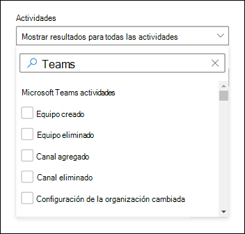
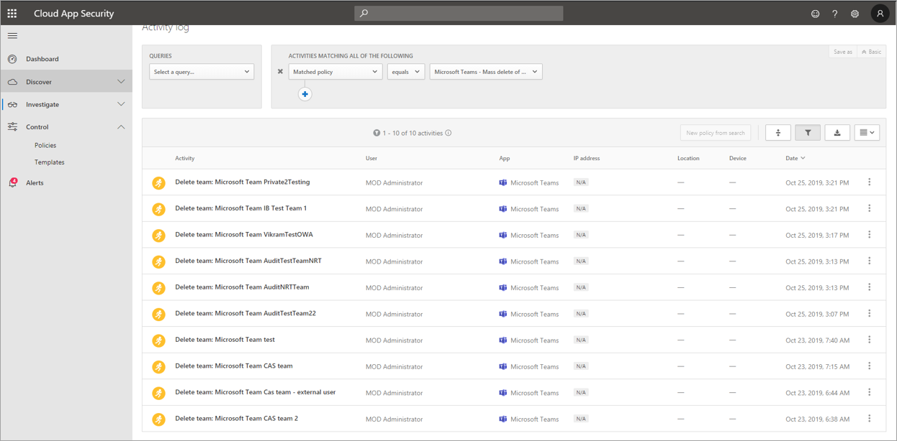

# Buscar eventos en el registro de auditoría en Microsoft TeamsSearch the audit log for events in Microsoft Teams

> [!IMPORTANT]
> [!INCLUDE [new-teams-sfb-admin-center-notice](includes/new-teams-sfb-admin-center-notice.md)]

El registro de auditoría puede ayudarle a investigar actividades específicas en los servicios de Microsoft 365.The audit log can help you investigate specific activities across Microsoft 365 services. Para Microsoft Teams, estas son algunas de las actividades que se auditan:For Microsoft Teams, here are some of the activities that are audited:

- Creación de equiposTeam creation
- Eliminación de equiposTeam deletion
- Agregación de canalesAdded channel
- Cambios en la configuraciónChanged setting

Para obtener una lista completa de las actividades de teams que se auditan, consulte [actividades de Teams](#teams-activities) y [turnos en actividades de Teams (en versión preliminar)](#shifts-in-teams-activities).For a complete list of Teams activities that are audited, see [Teams activities](#teams-activities) and [Shifts in Teams activities (in preview)](#shifts-in-teams-activities).

> [!NOTE]
> Los eventos de auditoría de canales privados también se registran como si se trataran de equipos y canales estándar.Audit events from private channels are also logged as they are for teams and standard channels.

## Activar la auditoría en Microsoft TeamsTurn on auditing in Teams

Para poder consultar los datos de auditoría, primero debe activar la auditoría en el [centro de cumplimiento de & de seguridad](https://protection.office.com).Before you can look at audit data, you have to first turn on auditing in the [Security & Compliance Center](https://protection.office.com). Para obtener ayuda con la activación de la auditoría, lea [activar o desactivar la búsqueda de registros de auditoría](https://support.office.com/article/Turn-Office-365-audit-log-search-on-or-off-e893b19a-660c-41f2-9074-d3631c95a014).For help with turning on auditing, read [Turn audit log search on or off](https://support.office.com/article/Turn-Office-365-audit-log-search-on-or-off-e893b19a-660c-41f2-9074-d3631c95a014).

> [!IMPORTANT]
> Los datos de auditoría solo están disponibles desde el punto en el que activó la auditoría.Audit data is only available from the point at which you turned on auditing.

## Recuperar datos de Microsoft Teams del registro de auditoríaRetrieve Teams data from the audit log

1. Para recuperar los registros de auditoría, vaya al [Centro de seguridad y cumplimiento](https://go.microsoft.com/fwlink/?linkid=855775).To retrieve audit logs, go to the [Security & Compliance Center](https://go.microsoft.com/fwlink/?linkid=855775). En **Buscar**, seleccione **búsqueda de registros de auditoría**.Under **Search**, select **Audit log search**.
2. Use **Buscar** para filtrar por las actividades, las fechas y los usuarios que desee auditar.Use **Search** to filter by the activities, dates, and users you want to audit.
3. Exporte los resultados a Excel para continuar el análisis.Export your results to Excel for further analysis.

> [!IMPORTANT]
> Los datos de auditoría solo están visibles en el registro de auditoría si la auditoría está activada.Audit data is only visible in the audit log if auditing is turned on.

La cantidad de tiempo que un registro de auditoría se retiene y se puede buscar en el registro de auditoría depende de la suscripción a Microsoft 365 u Office 365, en concreto, el tipo de licencia que está asignada a los usuarios.The length of time that an audit record is retained and searchable in the audit log depends on your Microsoft 365 or Office 365 subscription, and specifically the type of license that's assigned to users. Para obtener más información, consulte [Descripción del servicio del centro de cumplimiento de & de seguridad](https://docs.microsoft.com/office365/servicedescriptions/office-365-platform-service-description/office-365-securitycompliance-center).To learn more, see the [Security & Compliance Center service description](https://docs.microsoft.com/office365/servicedescriptions/office-365-platform-service-description/office-365-securitycompliance-center).

## Sugerencias para buscar en el registro de auditoríaTips for searching the audit log

Estas son algunas sugerencias para buscar actividades de Teams en el registro de auditoría.Here are tips for searching for Teams activities in the audit log.

- Puede seleccionar actividades específicas para buscarlas haciendo clic en el nombre de la actividad.You can select specific activities to search for by clicking the activity name. También puede hacer clic en el nombre del grupo para buscar todas las actividades de un grupo (como **actividades de archivos y carpetas**).Or you can search for all activities in a group (such as **File and folder activities**) by clicking the group name. Si una actividad está seleccionada, puede hacer clic en ella para cancelar la selección.If an activity is selected, you can click it to cancel the selection. También puede usar el cuadro de búsqueda para mostrar las actividades que contienen la palabra clave que escriba.You can also use the search box to display the activities that contain the keyword that you type. 
    
- Para mostrar los eventos de actividades que se ejecutan con los cmdlets, seleccione **Mostrar resultados para todas las actividades** en la lista **actividades** .To display events for activities run using cmdlets, select **Show results for all activities** in the **Activities** list. Si conoce el nombre de la operación de estas actividades, busque todas las actividades y, a continuación, filtre los resultados escribiendo el nombre de la operación en el cuadro de la columna **actividad** .If you know the name of the operation for these activities, search for all activities, and then filter the results by typing the name of the operation in the box in the **Activity** column. Para obtener más información, consulte [paso 3: filtrar los resultados de la búsqueda](https://docs.microsoft.com/microsoft-365/compliance/search-the-audit-log-in-security-and-compliance?view=o365-worldwide#step-3-filter-the-search-results).To learn more, see [Step 3: Filter the search results](https://docs.microsoft.com/microsoft-365/compliance/search-the-audit-log-in-security-and-compliance?view=o365-worldwide#step-3-filter-the-search-results).
- Para borrar los criterios de búsqueda actuales, haga clic en **Borrar**.To clear the current search criteria, click **Clear**. El intervalo de fechas vuelve al valor predeterminado de los últimos siete días.The date range returns to the default of the last seven days. También puede hacer clic en **Borrar todo para mostrar los resultados de todas las actividades** para cancelar todas las actividades seleccionadas.You can also click **Clear all to show results for all activities** to cancel all selected activities.
- Si se encuentran resultados de 5.000, probablemente se dé por supuesto que hay más de 5.000 eventos que cumplen los criterios de búsqueda.If 5,000 results are found, you can probably assume that there are more than 5,000 events that met the search criteria. Puede restringir los criterios de búsqueda y volver a ejecutar la búsqueda para que devuelva menos resultados, o bien puede exportar todos los resultados de la búsqueda seleccionando **exportar resultados**  >  **descargar todos los resultados**.You can refine the search criteria and rerun the search to return fewer results, or you can export all the search results by selecting **Export results** > **Download all results**.

Consulte [este vídeo](https://www.youtube.com/embed/UBxaRySAxyE) para usar la búsqueda de registros de audio.Check out [this video](https://www.youtube.com/embed/UBxaRySAxyE) for using audio log search. Únase a Acharya, un jefe de programa de Teams, ya que muestra cómo realizar una búsqueda de registros de auditoría para equipos.Join Ansuman Acharya, a program manager for Teams, as he demonstrates how to do an audit log search for Teams.

## Usar Cloud App Security para establecer directivas de actividadUse Cloud App Security to set activity policies

Con la integración de seguridad de la [aplicación en la nube de Microsoft](https://docs.microsoft.com/cloud-app-security/what-is-cloud-app-security) , puede configurar [directivas de actividades](https://docs.microsoft.com/cloud-app-security/user-activity-policies) para exigir una amplia variedad de procesos automatizados mediante las API del proveedor de aplicaciones.Using [Microsoft Cloud App Security](https://docs.microsoft.com/cloud-app-security/what-is-cloud-app-security) integration, you can set [activity policies](https://docs.microsoft.com/cloud-app-security/user-activity-policies) to enforce a wide range of automated processes using the app provider's APIs. Estas directivas le permiten supervisar actividades específicas realizadas por varios usuarios o cumplir las tarifas inesperadas de un determinado tipo de actividad.These policies enable you to monitor specific activities carried out by various users, or follow unexpectedly high rates of one certain type of activity.

Después de establecer una directiva de detección de actividad, comienza a generar alertas.After you set an activity detection policy, it starts to generate alerts. Las alertas solo se generan en las actividades que se producen después de crear la Directiva.Alerts are only generated on activities that occur after you create the policy. Estos son algunos escenarios de ejemplo de cómo puede usar las directivas de actividad en Cloud App Security para supervisar las actividades de Teams.Here's some example scenarios for how you can use activity policies in Cloud App Security to monitor Teams activities.

### Escenario de usuario externoExternal user scenario

Un escenario que quizás desee mantener a la vista desde una perspectiva empresarial es la adición de usuarios externos a su entorno de equipos.One scenario you might want to keep an eye on, from a business perspective, is the addition of external users to your Teams environment. Si los usuarios externos están habilitados, la supervisión de su presencia es una buena idea.If external users are enabled, monitoring their presence is a good idea.  Puede usar [Cloud App Security](https://docs.microsoft.com/cloud-app-security/what-is-cloud-app-security) para identificar amenazas potenciales.You can use [Cloud App Security](https://docs.microsoft.com/cloud-app-security/what-is-cloud-app-security) to identify potential threats.

La captura de pantalla de esta directiva para supervisar la adición de usuarios externos le permite asignar un nombre a la Directiva, establecer la gravedad según las necesidades de su empresa, establecerla como (en este caso) una sola actividad y, a continuación, establecer los parámetros que solo supervisarán específicamente la adición de usuarios no internos y limitarán esta actividad a teams.The screenshot of this policy to monitor adding external users allows you to name the policy, set the severity according to your business needs, set it as (in this case) a single activity, and then establish the parameters that will specifically monitor only the addition of non-internal users, and limit this activity to Teams.

Los resultados de esta Directiva se pueden ver en el registro de actividades:The results from this policy can be viewed in the activity log:

Aquí puede revisar las coincidencias con la Directiva que ha establecido, realizar los ajustes necesarios, o exportar los resultados para usarlos en otro lugar.Here you can review matches to the policy you've set, and make any adjustments as needed, or export the results to use elsewhere.

### Escenario de eliminación masivaMass delete scenario

Como se mencionó anteriormente, puede supervisar los escenarios de eliminación.As mentioned earlier, you can monitor deletion scenarios. Es posible crear una directiva que supervisará la eliminación masiva de sitios de Teams.It's possible to create a policy that would monitor mass deletion of Teams sites. En este ejemplo, se configura una directiva basada en alertas para detectar la eliminación masiva de Teams en un período de 30 minutos.In this example, an alert-based policy is set up to detect mass deletion of teams in a span of 30 minutes.

Como se muestra en la captura de pantalla, puede establecer muchos parámetros diferentes para que esta directiva supervise las eliminaciones de Teams, incluyendo la gravedad, una acción única o repetida, y los parámetros que limitan esta posibilidad a los equipos y la eliminación de sitios.As the screenshot shows, you can set many different parameters for this policy to monitor Teams deletions, including severity, single or repeated action, and parameters limiting this to Teams and site deletion. Esto puede hacerse independientemente de una plantilla o puede tener una plantilla creada para basar esta Directiva, según las necesidades de la organización.This can be done independently of a template, or you may have a template created to base this policy on, depending on your organizational needs.

Una vez que haya establecido una directiva que funcione para su empresa, podrá revisar los resultados en el registro de actividades a medida que se activen los eventos:Once you've established a policy that will work for your business, you can then review the results in the activity log as events are triggered:

Puede filtrar hasta la Directiva que haya establecido para ver los resultados de esa Directiva.You can filter down to the policy you've set to see the results of that policy. Si los resultados que recibe en el registro de actividades no son satisfactorios (quizá haya un gran número de resultados o nada), esto puede ayudarle a ajustar la consulta para hacerla más relevante para lo que necesita.If the results you're getting in the activity log are not satisfactory (maybe you're seeing lots of results, or nothing at all), this may help you to fine-tune the query to make it more relevant to what you need it to do.

### Escenario de alertas y gobernanzaAlert and governance scenario

Puede establecer alertas y enviar correos electrónicos a administradores y a otros usuarios cuando se desencadena una directiva de actividad.You can set alerts and send emails to admins and other users when an activity policy is triggered. Puede configurar acciones de gobierno automatizadas, como suspender un usuario o hacer que el usuario inicie sesión de nuevo de una manera automatizada.You can set automated governance actions such as suspending a user or making a user to sign in again in an automated way. En este ejemplo se muestra cómo se puede suspender una cuenta de usuario cuando se desencadena una directiva de actividad y se determina que un usuario ha eliminado dos o más equipos en 30 minutos.This example shows how a user account can be suspended when an activity policy is triggered and determines a user deleted two or more teams in 30 minutes.

## Usar Cloud App Security para establecer directivas de detección de anomalíasUse Cloud App Security to set anomaly detection policies

[Las directivas de detección de anomalías](https://docs.microsoft.com/cloud-app-security/anomaly-detection-policy) de seguridad de aplicaciones en la nube proporcionan análisis de comportamiento de entidad y de usuario (UEBA) y aprendizaje de máquina (ml) listos para usar, de modo que pueda ejecutar inmediatamente en todo el entorno de la nube.[Anomaly detection policies](https://docs.microsoft.com/cloud-app-security/anomaly-detection-policy) in Cloud App Security provide out-of-the-box user and entity behavioral analytics (UEBA) and machine learning (ML) so that you can immediately run advanced threat detection across your cloud environment. Debido a que se habilitan automáticamente, las nuevas políticas de detección de anomalías proporcionan resultados inmediatos proporcionando detecciones inmediatas, dirigidas a numerosas anomalías de comportamiento entre los usuarios y los equipos y dispositivos conectados a la red.Because they're automatically enabled, the new anomaly detection policies provide immediate results by providing immediate detections, targeting numerous behavioral anomalies across your users and the machines and devices connected to your network. Además, las nuevas directivas exponen más datos del motor de detección de seguridad de la aplicación en la nube para ayudarle a acelerar el proceso de investigación y a contener amenazas actuales.Additionally, the new policies expose more data from the Cloud App Security detection engine, to help you speed up the investigation process and contain ongoing threats.

Estamos trabajando para integrar eventos de Teams en directivas de detección de anomalías.We're working to integrate Teams events into anomaly detection policies. Por el momento, puede configurar directivas de detección de anomalías para otros productos de Office y tomar medidas para los usuarios que coincidan con esas directivas.For now, you can set up anomaly detection policies for other Office products and take action items on users who match those policies.

## Actividades de TeamsTeams activities

Esta es una lista de todos los eventos que se registran para las actividades de usuario y de administrador en Teams en el registro de auditoría de Microsoft 365.Here's a list of all events that are logged for user and admin activities in Teams in the Microsoft 365 audit log. La tabla incluye el nombre descriptivo que se muestra en la columna **actividades** y el nombre de la operación correspondiente que aparece en la información detallada de un registro de auditoría y en el archivo CSV al exportar los resultados de la búsqueda.The table includes the friendly name that's displayed in the **Activities** column and the name of the corresponding operation that appears in the detailed information of an audit record and in the CSV file when you export the search results.

|Nombre descriptivoFriendly name  |OperaciónOperation|DescripciónDescription |
|---------|---------|---------|
|Bot agregado al equipoAdded bot to team   |BotAddedToTeamBotAddedToTeam        |Un usuario agrega un bot a un equipo.A user adds a bot to a team.        |
|Agregación de canalesAdded channel   |ChannelAddedChannelAdded         |Un usuario agrega un canal a un equipo.A user adds a channel to a team.         |
|Conector agregadoAdded connector  |ConnectorAddedConnectorAdded          |Un usuario agrega un conector a un canal.A user adds a connector to a channel.        |
|Miembros agregadosAdded members    |MemberAddedMemberAdded         |El propietario de un equipo agrega miembros a un equipo, a un canal o a un chat grupal.A team owner adds members to a team, channel, or group chat.         |
|Pestaña agregadaAdded tab    |TabAddedTabAdded         |Un usuario agrega una ficha a un canal.A user adds a tab to a channel.        |
|Configuración de canal cambiadaChanged channel setting    |ChannelSettingChangedChannelSettingChanged         |La operación ChannelSettingChanged se registra cuando un miembro del equipo realiza las siguientes actividades.The ChannelSettingChanged operation is logged when the following activities are performed by a team member. Para cada una de estas actividades, se muestra una descripción de la opción de configuración que se ha cambiado (entre paréntesis, en la columna **elemento** de los resultados de la búsqueda de registros de auditoría.For each of these activities, a description of the setting that was changed (shown in parentheses is displayed in the **Item** column in the audit log search results. <ul><li>Cambia el nombre de un canal de equipo (**nombre de canal**)Changes name of a team channel (**Channel name**)</li><li>Descripción de los cambios de un canal de equipo (**Descripción del canal**)Changes description of a team channel (**Channel description**)</li> </ul>      |
|Configuración de organización cambiadaChanged organization setting   |TeamsTenantSettingChangedTeamsTenantSettingChanged         |La operación TeamsTenantSettingChanged se registra cuando un administrador global realiza las siguientes actividades en el centro de administración de Microsoft 365.The TeamsTenantSettingChanged operation is logged when the following activities are performed by a global admin in the Microsoft 365 admin center. Estas actividades afectan a la configuración de Teams de toda la organización.These activities affect org-wide Teams settings. Para obtener más información, vea [administrar la configuración de Teams para su organización](enable-features-office-365.md).To learn more, see [Manage Teams settings for your organization](enable-features-office-365.md).  Para cada una de estas actividades, se muestra una descripción de la opción de configuración que se cambió (que se muestra entre paréntesis) en la columna **elemento** de los resultados de búsqueda de registro de auditoría.For each of these activities, a description of the setting that was changed (shown in parentheses) is displayed in the **Item** column in the audit log search results.<ul><li>Habilita o deshabilita Teams para la organización (**Microsoft Teams**).Enables or disables Teams for the organization (**Microsoft Teams**).</li><li>Habilita o deshabilita la interoperabilidad entre Microsoft Teams y Skype empresarial para la organización (**interoperabilidad de Skype**empresarial).Enables or disables interoperability between Microsoft Teams and Skype for Business for the organization (**Skype for Business interoperability**).</li><li>Habilita o deshabilita la vista de organigrama en clientes de Microsoft Teams (**vista de organigrama**).Enables or disables the organizational chart view in Microsoft Teams clients (**Org chart view**).</li><li>Habilita o deshabilita la posibilidad de que los miembros del equipo programen reuniones privadas (**programación de reuniones privadas**).Enables or disables the ability for team members to schedule private meetings (**Private meeting scheduling**).</li><li>Habilita o deshabilita la posibilidad de que los miembros del equipo programen reuniones de canal (**programación de reuniones de canal**).Enables or disables the ability for team members to schedule channel meetings (**Channel meeting scheduling**).</li><li>Habilita o deshabilita las videollamadas en las reuniones de Teams (**vídeo para reuniones de Skype**).Enables or disables video calling in Teams meetings (**Video for Skype meetings**).</li><li>Habilita o deshabilita la pantalla compartida en Microsoft Teams reuniones microsoftteams para la organización (**uso compartido de pantalla para reuniones de Skype**).Enables or disables screen sharing in Microsoft Teams meetups for the organization (**Screen sharing for Skype meetings**).</li><li>Habilita o deshabilita la posibilidad de agregar imágenes animadas (denominadas imágenes giphy) a las conversaciones de Teams (**imágenes animadas**).Enables or disables that ability to add animated images (called Giphys) to Teams conversations (**Animated images**).</li><li>Cambia la configuración de la clasificación de contenido de la organización (**clasificación de contenido**).Changes the content rating setting for the organization (**Content rating**). La clasificación de contenido restringe el tipo de imagen animada que se puede mostrar en las conversaciones.The content rating restricts the type of animated image that can be displayed in conversations.</li><li>Habilita o deshabilita la posibilidad de que los miembros del equipo agreguen imágenes personalizables (denominadas memes personalizados) de Internet a las conversaciones del equipo (**imágenes personalizables de Internet**).Enables or disables the ability for team members to add customizable images (called custom memes) from the internet to team conversations (**Customizable images from the Internet**).</li><li>Habilita o deshabilita la posibilidad de que los miembros del equipo agreguen imágenes editables (denominadas adhesivos) a las conversaciones del equipo (**imágenes editables**).Enables or disables the ability for team members to add editable images (called stickers) to team conversations (**Editable images**).</li><li>Habilita o deshabilita la posibilidad de que los miembros del equipo usen bots en los chats y canales de Microsoft Teams (**bots en toda la organización)**.Enables or disables that ability for team members to use bots in Microsoft Teams chats and channels (**Org-wide bots)**.</li><li>Habilita bots específicos para Microsoft Teams.Enables specific bots for Microsoft Teams. Esto no incluye a T-bot, que es el bot de ayuda de Microsoft teams que está disponible cuando se habilitan los bots para la organización (**bots individuales**).This doesn't include the T-Bot, which is Teams help bot that's available when bots are enabled for the organization (**Individual bots**).</li><li>Habilita o deshabilita la posibilidad de que los miembros del equipo agreguen extensiones o pestañas (**extensiones o pestañas**).Enables or disables the ability for team members to add extensions or tabs (**Extensions or tabs**).</li><li>Habilita o deshabilita la carga de prueba de los bots de propiedad para Microsoft Teams (**carga de caras de bots**).Enables or disables the side-loading of proprietary bots for Microsoft Teams (**Side loading of Bots**).</li><li>Habilita o deshabilita la posibilidad de que los usuarios envíen mensajes de correo electrónico a un canal de Microsoft Teams (**correo electrónico de canal**).Enables or disables the ability for users to send email messages to a Microsoft Teams channel (**Channel email**).</li></ul>|
|Se ha cambiado el rol de miembros en el equipoChanged role of members in team    |MemberRoleChangedMemberRoleChanged         |Un propietario del equipo cambia el rol de los miembros de un equipo.A team owner changes the role of members in a team. Los siguientes valores indican el tipo de rol asignado al usuario.The following values indicate the role type assigned to the user.   **1** : indica el rol propietario.**1** - Indicates the Owner role. **2** -indica el rol miembro.**2** -  Indicates the Member role. **3** : indica el rol invitado.**3** -  Indicates the Guest role.  La propiedad Members también incluye el nombre de la organización y la dirección de correo electrónico del miembro.The Members property also includes the name of your organization and the member's email address.        |
|Configuración de equipo cambiadaChanged team setting    |TeamSettingChangedTeamSettingChanged        |La operación TeamSettingChanged se registra cuando el propietario de un equipo realiza las siguientes actividades.The TeamSettingChanged operation is logged when the following activities are performed by a team owner. Para cada una de estas actividades, se muestra una descripción de la opción de configuración que se cambió (que se muestra entre paréntesis) en la columna **elemento** de los resultados de búsqueda de registro de auditoría.For each of these activities, a description of the setting that was changed (shown in parentheses) is displayed in the **Item** column in the audit log search results.<ul><li>Cambia el tipo de acceso de un equipo.Changes the access type for a team. Los equipos pueden establecerse como privados o públicos (**tipo de acceso de equipo**).Teams can be set as private or public (**Team access type**). Cuando un equipo es privado (configuración predeterminada), los usuarios solo pueden acceder al equipo mediante invitación.When a team is private (the default setting), users can access the team only by invitation. Cuando un equipo es público, lo puede detectar cualquier persona.When a team is public, it's discoverable by anyone.</li><li>Cambia la clasificación de la información de un equipo (**clasificación de equipo**).Changes the information classification of a team (**Team classification**). Por ejemplo, los datos de equipo se pueden clasificar como alto impacto empresarial, impacto empresarial medio o impacto empresarial bajo.For example, team data can be classified as high business impact, medium business impact, or low business impact.</li><li>Cambia el nombre de un equipo (**nombre del equipo**).Changes the name of a team (**Team name**).</li><li>Cambia la descripción del equipo (**Descripción del equipo**).Changes the team description (**Team description**).</li><li>Cambios realizados en la configuración del equipo.Changes made to team settings. Para tener acceso a esta configuración, un propietario del equipo puede hacer clic con el botón secundario en un equipo, seleccionar **administrar equipo**y, a continuación, hacer clic en la pestaña **configuración** . Para estas actividades, el nombre de la opción de configuración que se cambió se muestra en la columna **elemento** de los resultados de búsqueda de registro de auditoría.To access these settings,  a team owner can right-click a team, select **Manage team**, and then click the **Settings** tab. For these activities, the name of the setting that was changed is displayed in the **Item** column in the audit log search results.</li></ul>         |
|Equipo creadoCreated team    |TeamCreatedTeamCreated         |Un usuario crea un equipo.A user creates a team.         |
|Eliminadas todas las aplicaciones de la organizaciónDeleted all organization apps|DeletedAllOrganizationAppsDeletedAllOrganizationApps           |Se han eliminado todas las aplicaciones de la organización del catálogo.Deleted all organization apps from the catalog.     |
|Aplicación eliminadaDeleted app |AppDeletedFromCatalogAppDeletedFromCatalog           |Se ha eliminado una aplicación del catálogo.An app has been deleted from the catalog.     |
|Canal eliminadoDeleted channel     |ChannelDeletedChannelDeleted         |Un usuario elimina un canal de un equipo.A user deletes a channel from a team.         |
|Equipo eliminadoDeleted team  |TeamDeletedTeamDeleted            |El propietario de un equipo elimina un equipo.A team owner deletes a team.      |
|Aplicación instaladaInstalled app |AppInstalledAppInstalled         |Se instaló una aplicación.An app was installed.   |
|Acción realizada en la tarjetaPerformed action on card|PerformedCardActionPerformedCardAction|Un usuario tomó medidas en una tarjeta adaptativa dentro de una conversación.A user took action on an adaptive card within a chat. Los bots suelen usar tarjetas adaptables para permitir la visualización enriquecida de la información y la interacción en los chats.Adaptive cards are typically used by bots to allow the rich display of information and interaction in chats.   **Nota:** Solo las acciones de entrada en línea en una tarjeta adaptable dentro de una conversación estarán disponibles en el registro de auditoría.**Note:** Only inline input actions on an adaptive card inside a chat will be available in the audit log. Por ejemplo, cuando un usuario envía una respuesta de sondeo en una conversación de canal en una tarjeta adaptativa generada por un bot de sondeo.For example, when a user submits a poll response in a channel conversation on an adaptive card generated by a Poll bot. Las acciones del usuario, como "resultado de la vista", que abrirá un cuadro de diálogo, o las acciones de usuario dentro de los cuadros de diálogo no estarán disponibles en el registro de auditoría.User actions such as "View result", which will open a dialog, or user actions inside dialogs won't be available in the audit log.|
|Aplicación publicadaPublished app |AppPublishedToCatalogAppPublishedToCatalog           |Se agregó una aplicación al catálogo.An app was added to the catalog.     |
|Bot quitado del equipoRemoved bot from team   |BotRemovedFromTeamBotRemovedFromTeam         |Un usuario quita un bot de un equipo.A user removes a bot from a team.       |
|Conector quitadoRemoved connector     |ConnectorRemovedConnectorRemoved         |Un usuario quita un conector de un canal.A user removes a connector from a channel.         |
|Miembros quitadosRemoved members    |MemberRemovedMemberRemoved        |El propietario de un equipo elimina los miembros de un equipo, un canal o un chat grupal.A team owner removes members from a team, channel, or group chat.         |
|Pestaña quitadaRemoved tab    |TabRemovedTabRemoved         |Un usuario quita una ficha de un canal.A user removes a tab from a channel.         |
|Aplicación desinstaladaUninstalled app |AppUninstalledAppUninstalled           |Se desinstaló una aplicación.An app was uninstalled.     |
|Aplicación actualizadaUpdated app |AppUpdatedInCatalogAppUpdatedInCatalog           |Se actualizó una aplicación en el catálogo.An app was updated in the catalog.     |
|Conector actualizadoUpdated connector    |ConnectorUpdatedConnectorUpdated         |Un usuario ha modificado un conector en un canal.A user modified a connector in a channel.         |
|Pestaña actualizadoUpdated tab   |TabUpdatedTabUpdated         |Un usuario ha modificado una pestaña en un canal.A user modified a tab in a channel.         |
|Aplicación actualizadaUpgraded app |AppUpgradedAppUpgraded           |Una aplicación se ha actualizado a su última versión en el catálogo.An app was upgraded to its latest version in the catalog.     |
|Usuario ha iniciado sesión en TeamsUser signed in to Teams     |TeamsSessionStartedTeamsSessionStarted         |Un usuario inicia sesión en un cliente de Microsoft Teams.A user signs in to a Microsoft Teams client. Este evento no captura actividades de actualización de token.This event doesn't capture token refresh activities.         |

## Cambios en las actividades de TeamsShifts in Teams activities

**(en la versión preliminar)****(in preview)**

Si su organización usa la aplicación turnos en Teams, puede buscar en el registro de auditoría las actividades relacionadas con la aplicación turnos.If your organization is using the Shifts app in Teams, you can search the audit log for activities related to the Shifts app. Esta es una lista de todos los eventos que se han registrado para desplazar actividades en Teams en el registro de auditoría de Microsoft 365.Here's a list of all events that are logged for Shifts activities in Teams in the Microsoft 365 audit log.

|Nombre descriptivoFriendly name  |OperaciónOperation  |DescripciónDescription  |
|---------|---------|---------|
|Grupo de programación agregadoAdded scheduling group      |SchedulingGroupAddedSchedulingGroupAdded          |Un usuario agrega correctamente un nuevo grupo de programación a la programación.A user successfully adds a new scheduling group to the schedule.          |
|Grupo de programación editadoEdited scheduling group     |SchedulingGroupEditedSchedulingGroupEdited         |Un usuario modifica correctamente un grupo de programación.A user successfully edits a scheduling group.          |
|Grupo de programación eliminadoDeleted scheduling group         |SchedulingGroupDeletedSchedulingGroupDeleted              |Un usuario elimina correctamente un grupo de programación de la programación.A user successfully deletes a scheduling group from the schedule.|
|Se ha agregado un turnoAdded shift      |ShiftAddedShiftAdded          |Un usuario agrega un turno correctamente.A user successfully adds a shift.           |
|Turno modificadoEdited shift       |ShiftEditedShiftEdited       |Un usuario modifica correctamente un turno.A user successfully edits a shift.        |
|Turno eliminadoDeleted shift          |ShiftDeletedShiftDeleted          | Un usuario elimina correctamente un turno.A user successfully deletes a shift.               |
|Se ha agregado un tiempo libreAdded time off      |TimeOffAddedTimeOffAdded          |Un usuario agrega correctamente el tiempo libre en la programación.A user successfully adds time off on the schedule.          |
|Hora de modificaciónEdited time off         |TimeOffEditedTimeOffEdited           |Un usuario modifica correctamente la hora.A user successfully edits time off.          |
|Tiempo eliminadoDeleted time off     |TimeOffDeletedTimeOffDeleted              |Un usuario elimina correctamente el permiso.A user successfully deletes time off.           |
|Se agregó el turno de aperturaAdded open shift     |OpenShiftAddedOpenShiftAdded          |Un usuario agrega correctamente un turno abierto a un grupo de programación.A user successfully adds an open shift to a scheduling group.          |
|Turno abierto modificadoEdited open shift    |OpenShiftEditedOpenShiftEdited          |Un usuario modifica correctamente un turno abierto en un grupo de programación.A user successfully edits an open shift in a scheduling group.          |
|Turno de apertura eliminadoDeleted open shift      |OpenShiftDeletedOpenShiftDeleted          |Un usuario elimina correctamente un turno abierto de un grupo de programación.A user successfully deletes an open shift from a scheduling group.         |
|Programación compartidaShared schedule     |ScheduleSharedScheduleShared                  |Un usuario ha compartido correctamente una programación de equipo para un intervalo de fechas.A user successfully shared a team schedule for a date range.          |
|Cronometrado con el reloj de tiempoClocked in using Time clock         |ClockedInClockedIn          |Un usuario registra correctamente el reloj con el reloj de tiempo.A user successfully clocks in using Time clock.          |
|Hora de salida con reloj de tiempoClocked out using Time clock      |ClockedOutClockedOut          |Un usuario registra correctamente el reloj de tiempo.A user successfully clocks out using Time clock.          |
|Se inició la interrupción con el reloj de tiempoStarted break using Time clock      |BreakStartedBreakStarted          |Un usuario inicia correctamente una interrupción durante una sesión de tiempo activa.A user successfully starts a break during an active Time clock session.          |
|Terminada la pausa con el reloj de tiempoEnded break using Time clock    |BreakEndedBreakEnded          |Un usuario termina correctamente un salto durante una sesión de tiempo activa.A user successfully ends a break during an active Time clock session.          |
|Se ha agregado una entrada de reloj de tiempoAdded Time clock entry     |TimeClockEntryAddedTimeClockEntryAdded          |Un usuario agrega correctamente una nueva entrada de reloj de tiempo manual en la hoja de tiempo.A user successfully adds a new manual Time clock entry on Time Sheet.          |
|Entrada de reloj de tiempo modificadaEdited Time clock entry     | TimeClockEntryEditedTimeClockEntryEdited             |Un usuario modifica correctamente una entrada de reloj de tiempo en hoja de horas.A user successfully edits a Time clock entry on Time Sheet.          |
|Entrada de reloj de tiempo eliminadaDeleted Time clock entry    |TimeClockEntryDeletedTimeClockEntryDeleted              |Un usuario elimina correctamente una entrada de reloj en la hoja de tiempo.A user successfully deletes a Time clock entry on Time Sheet.          |
|Solicitud de turno agregadaAdded shift request         |RequestAddedRequestAdded              |Un usuario ha agregado una solicitud de turno.A user added a shift request.          |
|Respuesta a una solicitud de turnoResponded to shift request     |RequestRespondedToRequestRespondedTo                  |Un usuario respondió a una solicitud de turno.A user responded to a shift request.          |
|Solicitud de turno canceladaCanceled shift request         |RequestCanceledRequestCanceled               |Un usuario canceló una solicitud de turno.A user canceled a shift request.          |
|Configuración de programación modificadaChanged schedule setting      |ScheduleSettingChangedScheduleSettingChanged          |Un usuario cambia una configuración en la configuración de Mayús.A user changes a setting in Shifts settings.         |
|Se ha agregado la integración de personalAdded workforce integration      |WorkforceIntegrationAddedWorkforceIntegrationAdded                  | La aplicación de turnos está integrada en un sistema de terceros.The Shifts app is integrated with a third-party system.         |
|Mensaje de turno aceptadoAccepted off shift message         |OffShiftDialogAcceptedOffShiftDialogAccepted          |Un usuario reconoce el mensaje de desplazarse para acceder a teams después de haber cambiado de horas.A user acknowledges the off-shift message to access Teams after shift hours.           |

## API de actividad de administración 365 de OfficeOffice 365 Management Activity API

Puede usar la API de actividad de administración de Office 365 para recuperar información sobre los eventos de Teams.You can use the Office 365 Management Activity API to retrieve information about Teams events. Para obtener más información sobre el esquema API de administración de la actividad de los equipos, consulte [esquema de equipos](https://docs.microsoft.com/office/office-365-management-api/office-365-management-activity-api-schema#microsoft-teams-schema).To learn more about the  Management Activity API schema for Teams, see [Teams schema](https://docs.microsoft.com/office/office-365-management-api/office-365-management-activity-api-schema#microsoft-teams-schema).

## Temas relacionadosRelated topics

- [Buscar en el registro de auditoría del centro de cumplimiento de Microsoft 365Search the audit log in the Microsoft 365 compliance center](https://docs.microsoft.com/microsoft-365/compliance/search-the-audit-log-in-security-and-compliance) 
