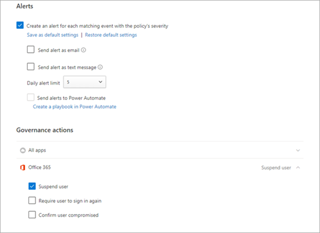

# Buscar eventos en el registro de auditoría en Microsoft TeamsSearch the audit log for events in Microsoft Teams

> [!IMPORTANT]
> [!INCLUDE [new-teams-sfb-admin-center-notice](includes/new-teams-sfb-admin-center-notice.md)]

El registro de auditoría puede ayudarle a investigar actividades específicas en Microsoft 365 servicios.The audit log can help you investigate specific activities across Microsoft 365 services. Para Microsoft Teams, estas son algunas de las actividades que se auditan:For Microsoft Teams, here are some of the activities that are audited:

- Creación de equiposTeam creation
- Eliminación de equiposTeam deletion
- Agregación de canalesAdded channel
- Cambios en la configuraciónChanged setting

Para obtener una lista completa de Teams actividades  que se auditan, vea Teams actividades y turnos en Teams actividades [(en versión preliminar).](#shifts-in-teams-activities)For a complete list of Teams activities that are audited, see [Teams activities](#teams-activities) and [Shifts in Teams activities (in preview)](#shifts-in-teams-activities).

> [!NOTE]
> Los eventos de auditoría de canales privados también se registran tal y como están para equipos y canales estándar.Audit events from private channels are also logged as they are for teams and standard channels.

## Activar la auditoría en Microsoft TeamsTurn on auditing in Teams

Antes de poder ver los datos de auditoría, primero debe activar la auditoría en el Centro de [& cumplimiento.](https://protection.office.com)Before you can look at audit data, you have to first turn on auditing in the [Security & Compliance Center](https://protection.office.com). Para obtener ayuda con la activación de la auditoría, lea Activar o desactivar la búsqueda del [registro de auditoría.](https://support.office.com/article/Turn-Office-365-audit-log-search-on-or-off-e893b19a-660c-41f2-9074-d3631c95a014)For help with turning on auditing, read [Turn audit log search on or off](https://support.office.com/article/Turn-Office-365-audit-log-search-on-or-off-e893b19a-660c-41f2-9074-d3631c95a014).

> [!IMPORTANT]
> Los datos de auditoría solo están disponibles desde el punto en que ha activado la auditoría.Audit data is only available from the point at which you turned on auditing.

## Recuperar datos de Microsoft Teams del registro de auditoríaRetrieve Teams data from the audit log

1. Para recuperar los registros de auditoría, vaya al [Centro de seguridad y cumplimiento](https://go.microsoft.com/fwlink/?linkid=855775).To retrieve audit logs, go to the [Security & Compliance Center](https://go.microsoft.com/fwlink/?linkid=855775). En **Buscar,** seleccione **Búsqueda de registro de auditoría.**Under **Search**, select **Audit log search**.

2. Use **Buscar** para filtrar por las actividades, las fechas y los usuarios que desee auditar.Use **Search** to filter by the activities, dates, and users you want to audit.

3. Exporte los resultados a Excel para continuar el análisis.Export your results to Excel for further analysis.

> [!IMPORTANT]
> Los datos de auditoría solo están visibles en el registro de auditoría si la auditoría está activada.Audit data is only visible in the audit log if auditing is turned on.

La duración del tiempo que un registro de auditoría se conserva y se puede buscar en el registro de auditoría depende de su suscripción Microsoft 365 o Office 365 y, específicamente, del tipo de licencia que se asigna a los usuarios.The length of time that an audit record is retained and searchable in the audit log depends on your Microsoft 365 or Office 365 subscription, and specifically the type of license that's assigned to users. Para obtener más información, vea la descripción del [servicio & centro de cumplimiento.](/office365/servicedescriptions/office-365-platform-service-description/office-365-securitycompliance-center)To learn more, see the [Security & Compliance Center service description](/office365/servicedescriptions/office-365-platform-service-description/office-365-securitycompliance-center).

## Sugerencias para buscar en el registro de auditoríaTips for searching the audit log

Estas son sugerencias para buscar Teams actividades en el registro de auditoría.Here are tips for searching for Teams activities in the audit log.

- Puede seleccionar actividades específicas para buscar haciendo clic en el nombre de la actividad.You can select specific activities to search for by clicking the activity name. También puede buscar todas las actividades de un grupo (como Actividades de archivo y **carpetas)** haciendo clic en el nombre del grupo.Or you can search for all activities in a group (such as **File and folder activities**) by clicking the group name. Si se selecciona una actividad, puede hacer clic en ella para cancelar la selección.If an activity is selected, you can click it to cancel the selection. También puede usar el cuadro de búsqueda para mostrar las actividades que contienen la palabra clave que escribe.You can also use the search box to display the activities that contain the keyword that you type.

  

- Para mostrar los eventos de las actividades que se ejecutan con cmdlets, seleccione **Mostrar resultados para todas** las actividades de la **lista** Actividades.To display events for activities run using cmdlets, select **Show results for all activities** in the **Activities** list. Si conoce el nombre de la operación para estas actividades, busque todas las actividades y, después, filtre los resultados escribiendo el nombre de la operación en el cuadro de la columna **Actividad.**If you know the name of the operation for these activities, search for all activities, and then filter the results by typing the name of the operation in the box in the **Activity** column. Para obtener más información, vea [Paso 3: Filtrar los resultados de la búsqueda.](/microsoft-365/compliance/search-the-audit-log-in-security-and-compliance#step-3-filter-the-search-results)To learn more, see [Step 3: Filter the search results](/microsoft-365/compliance/search-the-audit-log-in-security-and-compliance#step-3-filter-the-search-results).

- Para borrar los criterios de búsqueda actuales, haga clic en **Borrar**.To clear the current search criteria, click **Clear**. El intervalo de fechas vuelve al valor predeterminado de los últimos siete días.The date range returns to the default of the last seven days. También puede hacer clic en **Borrar todo para mostrar los resultados** de todas las actividades para cancelar todas las actividades seleccionadas.You can also click **Clear all to show results for all activities** to cancel all selected activities.

- Si se encuentran 5.000 resultados, es probable que suponga que hay más de 5 000 eventos que cumplen los criterios de búsqueda.If 5,000 results are found, you can probably assume that there are more than 5,000 events that met the search criteria. Puede refinar los criterios de búsqueda y volver a ejecutar la búsqueda para devolver menos resultados, o puede exportar todos los resultados de búsqueda seleccionando Exportar resultados  >  **Descargar todos los resultados.**You can refine the search criteria and rerun the search to return fewer results, or you can export all the search results by selecting **Export results** > **Download all results**.

Consulte este [vídeo para](https://www.youtube.com/embed/UBxaRySAxyE) usar la búsqueda de registros de audio.Check out [this video](https://www.youtube.com/embed/UBxaRySAxyE) for using audio log search. Únase a Ansuman Acharya, un administrador de programas para Teams, ya que muestra cómo realizar una búsqueda de registro de auditoría para Teams.Join Ansuman Acharya, a program manager for Teams, as he demonstrates how to do an audit log search for Teams.

## Usar Cloud App Security para establecer directivas de actividadUse Cloud App Security to set activity policies

Con [Microsoft Cloud App Security](/cloud-app-security/what-is-cloud-app-security) integración, puede  establecer directivas de actividad para exigir una amplia gama de procesos automatizados con las API del proveedor de aplicaciones.Using [Microsoft Cloud App Security](/cloud-app-security/what-is-cloud-app-security) integration, you can set [activity policies](/cloud-app-security/user-activity-policies) to enforce a wide range of automated processes using the app provider's APIs. Estas directivas le permiten supervisar actividades específicas realizadas por varios usuarios o seguir tasas inesperadamente altas de un determinado tipo de actividad.These policies enable you to monitor specific activities carried out by various users, or follow unexpectedly high rates of one certain type of activity.

Después de establecer una directiva de detección de actividad, comienza a generar alertas.After you set an activity detection policy, it starts to generate alerts. Las alertas solo se generan en las actividades que se producen después de crear la directiva.Alerts are only generated on activities that occur after you create the policy. Estos son algunos escenarios de ejemplo para cómo puede usar directivas de actividad en Cloud App Security para supervisar Teams actividades.Here's some example scenarios for how you can use activity policies in Cloud App Security to monitor Teams activities.

### Escenario de usuario externoExternal user scenario

Un escenario en el que puede que desee estar atento, desde una perspectiva empresarial, es la adición de usuarios externos a su entorno Teams empresa.One scenario you might want to keep an eye on, from a business perspective, is the addition of external users to your Teams environment. Si los usuarios externos están habilitados, supervisar su presencia es una buena idea.If external users are enabled, monitoring their presence is a good idea.  Puede usar [Cloud App Security](/cloud-app-security/what-is-cloud-app-security) identificar amenazas potenciales.You can use [Cloud App Security](/cloud-app-security/what-is-cloud-app-security) to identify potential threats.

La captura de pantalla de esta directiva para supervisar la adición de usuarios externos le permite nombrar la directiva, establecer la gravedad según las necesidades de su empresa, establecerla como (en este caso) una sola actividad y, a continuación, establecer los parámetros que supervisarán específicamente solo la adición de usuarios no internos y limitar esta actividad a Teams.The screenshot of this policy to monitor adding external users allows you to name the policy, set the severity according to your business needs, set it as (in this case) a single activity, and then establish the parameters that will specifically monitor only the addition of non-internal users, and limit this activity to Teams.

Los resultados de esta directiva se pueden ver en el registro de actividades:The results from this policy can be viewed in the activity log:

Aquí puede revisar coincidencias con la directiva que ha establecido y realizar los ajustes necesarios, o exportar los resultados para usarlos en otro lugar.Here you can review matches to the policy you've set, and make any adjustments as needed, or export the results to use elsewhere.

### Escenario de eliminación masivaMass delete scenario

Como se mencionó anteriormente, puede supervisar escenarios de eliminación.As mentioned earlier, you can monitor deletion scenarios. Es posible crear una directiva que supervise la eliminación masiva de Teams sitios.It's possible to create a policy that would monitor mass deletion of Teams sites. En este ejemplo, se configura una directiva basada en alertas para detectar la eliminación masiva de equipos en un intervalo de 30 minutos.In this example, an alert-based policy is set up to detect mass deletion of teams in a span of 30 minutes.

Como se muestra en la captura de pantalla, puede establecer muchos parámetros diferentes para esta directiva para supervisar las eliminaciones de Teams, incluida la gravedad, la acción única o repetida, y los parámetros que limitan esto Teams la eliminación del sitio.As the screenshot shows, you can set many different parameters for this policy to monitor Teams deletions, including severity, single or repeated action, and parameters limiting this to Teams and site deletion. Esto se puede hacer independientemente de una plantilla, o es posible que tenga una plantilla creada para basar esta directiva en, dependiendo de las necesidades de la organización.This can be done independently of a template, or you may have a template created to base this policy on, depending on your organizational needs.

Después de establecer una directiva que funcione para su empresa, puede revisar los resultados del registro de actividades a medida que se desencadenan los eventos:After you establish a policy that works for your business, you can review the results in the activity log as events are triggered:

Puede filtrar hacia abajo hasta la directiva que haya establecido para ver los resultados de esa directiva.You can filter down to the policy you've set to see the results of that policy. Si los resultados que está obteniendo en el registro de actividades no son satisfactorios (tal vez está viendo una gran cantidad de resultados, o nada en absoluto), esto puede ayudarle a ajustar la consulta para que sea más relevante para lo que necesita que haga.If the results you're getting in the activity log are not satisfactory (maybe you're seeing lots of results, or nothing at all), this may help you to fine-tune the query to make it more relevant to what you need it to do.

### Escenario de alerta y gobiernoAlert and governance scenario

Puede establecer alertas y enviar correos electrónicos a administradores y otros usuarios cuando se desencadene una directiva de actividad.You can set alerts and send emails to admins and other users when an activity policy is triggered. Puede establecer acciones de gobierno automatizadas como suspender un usuario o hacer que un usuario vuelva a iniciar sesión de forma automatizada.You can set automated governance actions such as suspending a user or making a user to sign in again in an automated way. En este ejemplo se muestra cómo se puede suspender una cuenta de usuario cuando se desencadena una directiva de actividad y se determina que un usuario eliminó dos o más equipos en 30 minutos.This example shows how a user account can be suspended when an activity policy is triggered and determines a user deleted two or more teams in 30 minutes.

## Usar Cloud App Security para establecer directivas de detección de anomalíasUse Cloud App Security to set anomaly detection policies

 Las directivas de detección de anomalías en Cloud App Security proporcionan análisis de comportamiento de usuarios y entidades (UEBA) y aprendizaje automático (ML) de forma que pueda ejecutar inmediatamente la detección avanzada de amenazas en todo el entorno de la nube.[Anomaly detection policies](/cloud-app-security/anomaly-detection-policy) in Cloud App Security provide out-of-the-box user and entity behavioral analytics (UEBA) and machine learning (ML) so that you can immediately run advanced threat detection across your cloud environment. Como están habilitadas automáticamente, las nuevas directivas de detección de anomalías proporcionan resultados inmediatos al proporcionar detecciones inmediatas, dirigidas a numerosas anomalías conductuales entre los usuarios y los equipos y dispositivos conectados a su red.Because they're automatically enabled, the new anomaly detection policies provide immediate results by providing immediate detections, targeting numerous behavioral anomalies across your users and the machines and devices connected to your network. Además, las nuevas directivas exponen más datos del motor de detección de Cloud App Security, para ayudarle a acelerar el proceso de investigación y contener amenazas en curso.Additionally, the new policies expose more data from the Cloud App Security detection engine, to help you speed up the investigation process and contain ongoing threats.

Estamos trabajando para integrar Teams eventos en directivas de detección de anomalías.We're working to integrate Teams events into anomaly detection policies. Por ahora, puede configurar directivas de detección de anomalías para otros productos Office y realizar acciones en los usuarios que coincidan con dichas directivas.For now, you can set up anomaly detection policies for other Office products and take action items on users who match those policies.

## Teams actividadesTeams activities

Esta es una lista de todos los eventos que se registran para las actividades de usuario y administrador en Teams en el registro Microsoft 365 auditoría.Here's a list of all events that are logged for user and admin activities in Teams in the Microsoft 365 audit log. La tabla incluye el nombre descriptivo que  se muestra en la columna Actividades y el nombre de la operación correspondiente que aparece en la información detallada de un registro de auditoría y en el archivo CSV al exportar los resultados de la búsqueda.The table includes the friendly name that's displayed in the **Activities** column and the name of the corresponding operation that appears in the detailed information of an audit record and in the CSV file when you export the search results.

|Nombre descriptivoFriendly name  |OperaciónOperation |DescripciónDescription |
|:---------|:---------|:---------|
|Bot agregado al equipoAdded bot to team   |BotAddedToTeamBotAddedToTeam        |Un usuario agrega un bot a un equipo.A user adds a bot to a team.        |
|Agregación de canalesAdded channel   |Canal agregadoChannelAdded         |Un usuario agrega un canal a un equipo.A user adds a channel to a team.         |
|Conector agregadoAdded connector  |Conector agregadoConnectorAdded          |Un usuario agrega un conector a un canal.A user adds a connector to a channel.        |
|Miembros agregadosAdded members    |Miembro agregadoMemberAdded         |El propietario de un equipo agrega miembros a un equipo, canal o chat grupal.A team owner adds members to a team, channel, or group chat.         |
|Pestaña AgregadoAdded tab    |Pestaña AgregadaTabAdded         |Un usuario agrega una pestaña a un canal.A user adds a tab to a channel.        |
|Configuración del canal cambiadaChanged channel setting    |ChannelSettingChangedChannelSettingChanged         |La operación ChannelSettingChanged se registra cuando un miembro del equipo realiza las siguientes actividades.The ChannelSettingChanged operation is logged when the following activities are performed by a team member. Para cada una de estas actividades, se muestra una descripción de la configuración  que se ha cambiado (se muestra entre paréntesis en la columna Elemento en los resultados de búsqueda del registro de auditoría.For each of these activities, a description of the setting that was changed (shown in parentheses is displayed in the **Item** column in the audit log search results. <ul><li>Cambia el nombre de un canal de grupo (**nombre del canal**)Changes name of a team channel (**Channel name**)</li><li>Cambiar la descripción de un canal de grupo (**Descripción del canal**)Changes description of a team channel (**Channel description**)</li> </ul>      |
|Configuración de la organización cambiadaChanged organization setting   |TeamsTenantSettingChangedTeamsTenantSettingChanged         |La operación TeamsTenantSettingChanged se registra cuando un administrador global realiza las siguientes actividades en el Centro de administración de Microsoft 365.The TeamsTenantSettingChanged operation is logged when the following activities are performed by a global admin in the Microsoft 365 admin center. Estas actividades afectan a la configuración de Teams organización.These activities affect org-wide Teams settings. Para obtener más información, vea [Administrar Teams configuración de su organización.](enable-features-office-365.md)To learn more, see [Manage Teams settings for your organization](enable-features-office-365.md).  Para cada una de estas actividades, se muestra una descripción de la configuración  que se modificó (se muestra entre paréntesis) en la columna Elemento en los resultados de la búsqueda del registro de auditoría.For each of these activities, a description of the setting that was changed (shown in parentheses) is displayed in the **Item** column in the audit log search results.<ul><li>Habilita o deshabilita Teams para la organización (**Microsoft Teams**).Enables or disables Teams for the organization (**Microsoft Teams**).</li><li>Habilita o deshabilita la interoperabilidad entre Microsoft Teams y Skype Empresarial para la organización **(Skype Empresarial interoperabilidad).**Enables or disables interoperability between Microsoft Teams and Skype for Business for the organization (**Skype for Business interoperability**).</li><li>Habilita o deshabilita la vista organigrama en Microsoft Teams **(vista Organigrama).**Enables or disables the organizational chart view in Microsoft Teams clients (**Org chart view**).</li><li>Habilita o deshabilita la posibilidad de que los miembros del equipo programe reuniones privadas **(programación de reuniones privadas).**Enables or disables the ability for team members to schedule private meetings (**Private meeting scheduling**).</li><li>Habilita o deshabilita la capacidad de los miembros del equipo para programar reuniones del canal **(programación de reuniones del canal).**Enables or disables the ability for team members to schedule channel meetings (**Channel meeting scheduling**).</li><li>Habilita o deshabilita las videollamadas en Teams reuniones **(Vídeo para Skype reuniones).**Enables or disables video calling in Teams meetings (**Video for Skype meetings**).</li><li>Habilita o deshabilita el uso compartido de pantalla en Microsoft Teams reuniones de la organización (uso compartido de pantalla **para Skype reuniones).**Enables or disables screen sharing in Microsoft Teams meetups for the organization (**Screen sharing for Skype meetings**).</li><li>Habilita o deshabilita esa capacidad para agregar imágenes animadas (denominadas Giphys) a Teams conversaciones **(imágenes animadas).**Enables or disables that ability to add animated images (called Giphys) to Teams conversations (**Animated images**).</li><li>Cambia la configuración de clasificación de contenido de la organización (**Clasificación de contenido**).Changes the content rating setting for the organization (**Content rating**). La clasificación de contenido restringe el tipo de imagen animada que se puede mostrar en las conversaciones.The content rating restricts the type of animated image that can be displayed in conversations.</li><li>Habilita o deshabilita la posibilidad de que los miembros del equipo agreguen imágenes personalizables (denominadas memes personalizados) desde Internet a las conversaciones del equipo (imágenes personalizables **desde Internet).**Enables or disables the ability for team members to add customizable images (called custom memes) from the internet to team conversations (**Customizable images from the Internet**).</li><li>Habilita o deshabilita la posibilidad de que los miembros del equipo agreguen imágenes editables (denominadas adhesivos) a las conversaciones del equipo **(imágenes editables).**Enables or disables the ability for team members to add editable images (called stickers) to team conversations (**Editable images**).</li><li>Habilita o deshabilita esa capacidad para que los miembros del equipo usen bots en Microsoft Teams chats y canales **(bots** para toda la organización).Enables or disables that ability for team members to use bots in Microsoft Teams chats and channels (**Org-wide bots)**.</li><li>Habilita bots específicos para Microsoft Teams.Enables specific bots for Microsoft Teams. Esto no incluye el T-Bot, que es Teams bot de ayuda que está disponible cuando los bots están habilitados para la organización **(bots individuales).**This doesn't include the T-Bot, which is Teams help bot that's available when bots are enabled for the organization (**Individual bots**).</li><li>Habilita o deshabilita la posibilidad de que los miembros del equipo agreguen extensiones o pestañas **(extensiones o pestañas).**Enables or disables the ability for team members to add extensions or tabs (**Extensions or tabs**).</li><li>Habilita o deshabilita la carga lateral de bots propietarios para Microsoft Teams **(carga lateral de bots).**Enables or disables the side-loading of proprietary bots for Microsoft Teams (**Side loading of Bots**).</li><li>Habilita o deshabilita la capacidad de los usuarios para enviar mensajes de correo electrónico a un canal Microsoft Teams **(correo electrónico del canal).**Enables or disables the ability for users to send email messages to a Microsoft Teams channel (**Channel email**).</li></ul>|
|Rol cambiado de los miembros del equipoChanged role of members in team    |MemberRoleChangedMemberRoleChanged         |El propietario de un equipo cambia el rol de los miembros de un equipo.A team owner changes the role of members in a team. Los siguientes valores indican el tipo de rol asignado al usuario.The following values indicate the role type assigned to the user.   **1:** indica el rol de miembro.**1** - Indicates the Member role. **2:** indica el rol propietario.**2** -  Indicates the Owner role. **3:** indica el rol de invitado.**3** -  Indicates the Guest role.  La propiedad Miembros también incluye el nombre de su organización y la dirección de correo electrónico del miembro.The Members property also includes the name of your organization and the member's email address.        |
|Configuración de equipo cambiadaChanged team setting    |TeamSettingChangedTeamSettingChanged        |La operación TeamSettingChanged se registra cuando un propietario del equipo realiza las siguientes actividades.The TeamSettingChanged operation is logged when the following activities are performed by a team owner. Para cada una de estas actividades, se muestra una descripción de la configuración  que se modificó (se muestra entre paréntesis) en la columna Elemento en los resultados de la búsqueda del registro de auditoría.For each of these activities, a description of the setting that was changed (shown in parentheses) is displayed in the **Item** column in the audit log search results.<ul><li>Cambia el tipo de acceso de un equipo.Changes the access type for a team. Teams puede establecerse como privada o pública **(tipo de acceso de equipo).**Teams can be set as private or public (**Team access type**). Cuando un equipo es privado (la configuración predeterminada), los usuarios solo pueden acceder al equipo por invitación.When a team is private (the default setting), users can access the team only by invitation. Cuando un equipo es público, es reconocible por cualquier persona.When a team is public, it's discoverable by anyone.</li><li>Cambia la clasificación de información de un equipo **(clasificación de equipo).**Changes the information classification of a team (**Team classification**). Por ejemplo, los datos de grupo se pueden clasificar como impacto empresarial alto, impacto empresarial medio o bajo impacto empresarial.For example, team data can be classified as high business impact, medium business impact, or low business impact.</li><li>Cambia el nombre de un equipo **(nombre del equipo).**Changes the name of a team (**Team name**).</li><li>Cambia la descripción del equipo **(descripción del equipo).**Changes the team description (**Team description**).</li><li>Cambios realizados en la configuración del equipo.Changes made to team settings. Para acceder a esta configuración, el propietario del equipo puede hacer clic con el botón derecho en un equipo, seleccionar Administrar equipo **y,** a continuación, hacer clic **en Configuración** pestaña. Para estas actividades, el nombre de la configuración  que se modificó se muestra en la columna Elemento en los resultados de búsqueda del registro de auditoría.To access these settings,  a team owner can right-click a team, select **Manage team**, and then click the **Settings** tab. For these activities, the name of the setting that was changed is displayed in the **Item** column in the audit log search results.</li></ul>         |
|Crear un chat 1Created a chat 1|   ChatCreadoChatCreated|    Se Teams un chat de Teams usuario.A Teams chat was created.|
|Equipo creadoCreated team    |TeamCreatedTeamCreated         |Un usuario crea un equipo.A user creates a team.         |
|Se eliminaron todas las aplicaciones de la organizaciónDeleted all organization apps|DeletedAllOrganizationAppsDeletedAllOrganizationApps           |Eliminó todas las aplicaciones de la organización del catálogo.Deleted all organization apps from the catalog.     |
|Aplicación eliminadaDeleted app |AppDeletedFromCatalogAppDeletedFromCatalog           |Se ha eliminado una aplicación del catálogo.An app has been deleted from the catalog.     |
|Canal eliminadoDeleted channel     |ChannelDeletedChannelDeleted         |Un usuario elimina un canal de un equipo.A user deletes a channel from a team.         |
|Equipo eliminadoDeleted team  |TeamDeletedTeamDeleted            |El propietario de un equipo elimina un equipo.A team owner deletes a team.      |
|Editó un mensaje con un vínculo url en TeamsEdited a message with a URL link in Teams     |MessageEditedHasLinkMessageEditedHasLink         |Un usuario edita un mensaje y agrega un vínculo url a él en Teams.A user edits a message and adds a URL link to it in Teams.         |
|Mensajes exportados 1Exported messages 1 |   MensajesExportadosMessagesExported |Se exportaron mensajes de chat o canalChat or channel messages were exported|..
|Chat de captura 1Fetched chat 1  |ChatRetrievedChatRetrieved  |Se Microsoft Teams un chat de Microsoft Teams.A Microsoft Teams chat was retrieved.|
|Capturar todo el contenido hospedado de un mensaje1Fetched all hosted content of a message1    |MessageHostedContentsListedMessageHostedContentsListed    |Se ha recuperado todo el contenido hospedado en un mensaje, como imágenes o fragmentos de código.All hosted content in  a message, such as images or code snippets, was retrieved.|
|Aplicación instaladaInstalled app |AppInstalledAppInstalled         |Se instaló una aplicación.An app was installed.   |
|Acción realizada en la tarjetaPerformed action on card|PerformedCardActionPerformedCardAction|Un usuario realizó acciones en una tarjeta adaptable dentro de un chat.A user took action on an adaptive card within a chat. Los bots suelen usar las tarjetas adaptables para permitir la visualización enriquecida de información e interacción en chats.Adaptive cards are typically used by bots to allow the rich display of information and interaction in chats.   **Nota:** Solo las acciones de entrada en línea en una tarjeta adaptable dentro de un chat estarán disponibles en el registro de auditoría.**Note:** Only inline input actions on an adaptive card inside a chat will be available in the audit log. Por ejemplo, cuando un usuario envía una respuesta de sondeo en una conversación de canal en una tarjeta adaptable generada por un bot de sondeo.For example, when a user submits a poll response in a channel conversation on an adaptive card generated by a Poll bot. Las acciones de usuario como "Ver resultado", que abrirá un cuadro de diálogo, o las acciones de usuario dentro de los cuadros de diálogo no estarán disponibles en el registro de auditoría.User actions such as "View result", which will open a dialog, or user actions inside dialogs won't be available in the audit log.|
|Publicado un nuevo mensaje 1Posted a new message 1  |MensajeSent Un nuevo mensaje se publicó en un chat o canal.MessageSent    A new message was posted to a chat or channel.|
|Aplicación publicadaPublished app |AppPublishedToCatalogAppPublishedToCatalog           |Se ha agregado una aplicación al catálogo.An app was added to the catalog.     |
|Leer un mensaje 1Read a message 1    |MessageReadMessageRead    |Se ha recuperado un mensaje de un chat o canal.A message of a chat or channel was retrieved.|
|Leer contenido hospedado de un mensaje 1Read hosted content of a message 1  |MessageHostedContentReadMessageHostedContentRead   |Se ha recuperado el contenido hospedado en un mensaje, como una imagen o un fragmento de código.Hosted content in a message, such as an image or a code snippet, was retrieved.|
|Bot quitado del equipoRemoved bot from team   |BotRemovedFromTeamBotRemovedFromTeam         |Un usuario quita un bot de un equipo.A user removes a bot from a team.       |
|Conector quitadoRemoved connector     |ConnectorRemovedConnectorRemoved         |Un usuario quita un conector de un canal.A user removes a connector from a channel.         |
|Miembros eliminadosRemoved members    |MemberRemovedMemberRemoved        |El propietario de un equipo quita los miembros de un equipo, canal o chat grupal.A team owner removes members from a team, channel, or group chat.         |
|Pestaña QuitadoRemoved tab    |TabRemovedTabRemoved         |Un usuario quita una pestaña de un canal.A user removes a tab from a channel.         |
|Mensajes recuperados 1Retrieved messages 1    |MensajesListedMessagesListed |Se recuperaron los mensajes de un chat o canal.Messages from a chat or channel were retrieved.|
|Se ha enviado un mensaje con un vínculo url en TeamsSent a message with a URL link in Teams |MessageCreatedHasLinkMessageCreatedHasLink|Un usuario envía un mensaje que contiene un vínculo url en Teams.A user sends a message containing a URL link in Teams.|
|Notificación de cambio enviada para la creación de mensajes 1Sent change notification for message creation 1 |MessageCreatedNotificationMessageCreatedNotification |Se envió una notificación de cambio para notificar un mensaje nuevo a una aplicación de escucha suscrita.A change notification was sent to notify a subscribed listener application of a new message.|
|Notificación de cambio enviada para la eliminación de mensajes 1Sent change notification for message deletion 1 |MessageDeletedNotificationMessageDeletedNotification |Se envió una notificación de cambio para notificar a una aplicación de escucha suscrita de un mensaje eliminado.A change notification was sent to notify a subscribed listener application of a deleted message.|
|Notificación de cambio enviada para la actualización de mensajes 1Sent change notification for message update 1   |MessageUpdatedNotificationMessageUpdatedNotification |Se envió una notificación de cambio para notificar un mensaje actualizado a una aplicación de escucha suscrita.A change notification was sent to notify a subscribed listener application of an updated message.|
|Suscribirse a las notificaciones de cambio de mensajes 1Subscribed to message change notifications 1    |SubscribedToMessagesSubscribedToMessages   |Una aplicación de escucha creó una suscripción para recibir notificaciones de cambio de mensajes.A subscription was created by a listener application to receive change notifications for messages.|
|Aplicación desinstaladaUninstalled app |AppUninstalledAppUninstalled           |Se ha desinstalado una aplicación.An app was uninstalled.     |
|Aplicación actualizadaUpdated app |AppUpdatedInCatalogAppUpdatedInCatalog           |Se actualizó una aplicación en el catálogo.An app was updated in the catalog.     |
|Actualizado un chat 1Updated a chat 1    |ChatUpdatedChatUpdated    |Se ha Teams un chat de Teams.A Teams chat was updated.|
|Se ha actualizado un mensaje 1Updated a message 1 |MessageUpdatedMessageUpdated |Se actualizó un mensaje de un chat o canal.A message of a chat or channel was updated.|
|Conector actualizadoUpdated connector    |ConnectorUpdatedConnectorUpdated         |Un usuario modificó un conector en un canal.A user modified a connector in a channel.         |
|Pestaña ActualizadaUpdated tab   |TabUpdatedTabUpdated         |Un usuario modificó una pestaña en un canal.A user modified a tab in a channel.         |
|Aplicación actualizadaUpgraded app |AppUpgradedAppUpgraded           |Una aplicación se actualizó a su versión más reciente del catálogo.An app was upgraded to its latest version in the catalog.     |
|El usuario ha iniciado sesión en TeamsUser signed in to Teams     |TeamsSessionStartedTeamsSessionStarted         |Un usuario inicia sesión en un Microsoft Teams usuario.A user signs in to a Microsoft Teams client. Este evento no captura las actividades de actualización de tokens.This event doesn't capture token refresh activities.         |
||||

> [!NOTE]
> 1 Un registro de auditoría para este evento solo se registra cuando la operación se realiza llamando a una API Graph Microsoft.1 An audit record for this event is only logged when the operation is performed by calling a Microsoft Graph API. Si la operación se realiza en el Teams, no se registrará un registro de auditoríaIf the operation is performed in the Teams client, an audit record will not be logged

## Turnos en Teams actividadesShifts in Teams activities

**(en la versión preliminar)****(in preview)**

Si su organización usa la aplicación Turnos en Teams, puede buscar en el registro de auditoría actividades relacionadas con la aplicación Turnos.If your organization is using the Shifts app in Teams, you can search the audit log for activities related to the Shifts app. Esta es una lista de todos los eventos que se registran para las actividades de Turnos en Teams en el Microsoft 365 registro de auditoría.Here's a list of all events that are logged for Shifts activities in Teams in the Microsoft 365 audit log.

|Nombre descriptivoFriendly name  |OperaciónOperation  |DescripciónDescription  |
|---------|---------|---------|
|Grupo de programación agregadoAdded scheduling group |ScheduleGroupAddedScheduleGroupAdded          |Un usuario agrega correctamente un nuevo grupo de programación a la programación.A user successfully adds a new scheduling group to the schedule.|
|Grupo de programación editadoEdited scheduling group     |ScheduleGroupEditedScheduleGroupEdited         |Un usuario edita correctamente un grupo de programación.A user successfully edits a scheduling group.          |
|Grupo de programación eliminadoDeleted scheduling group         |ScheduleGroupDeletedScheduleGroupDeleted              |Un usuario elimina correctamente un grupo de programación de la programación.A user successfully deletes a scheduling group from the schedule.|
|Retirar la programaciónWithdrew schedule |ScheduleWithdrawnScheduleWithdrawn              |Un usuario retira correctamente una programación publicada.A user successfully withdraws a published schedule.|
|Turno agregadoAdded shift      |Mayús AgregadoShiftAdded          |Un usuario agrega correctamente un turno.A user successfully adds a shift.           |
|Turno editadoEdited shift       |MayúsEditedShiftEdited       |Un usuario edita correctamente un turno.A user successfully edits a shift.        |
|Turno eliminadoDeleted shift          |MayúsDeletedShiftDeleted          | Un usuario elimina correctamente un turno.A user successfully deletes a shift.               |
|Tiempo añadido de descansoAdded time off      |TimeOffAddedTimeOffAdded          |Un usuario agrega correctamente el tiempo libre en la programación.A user successfully adds time off on the schedule.          |
|Tiempo libre editadoEdited time off         |TimeOffEditedTimeOffEdited           |Un usuario edita correctamente los permisos.A user successfully edits time off.          |
|Tiempo de espera eliminadoDeleted time off     |TimeOffDeletedTimeOffDeleted              |Un usuario elimina correctamente el tiempo libre.A user successfully deletes time off.           |
|Se ha agregado el turno de aperturaAdded open shift     |OpenShift AgregadoOpenShiftAdded          |Un usuario agrega correctamente un turno abierto a un grupo de programación.A user successfully adds an open shift to a scheduling group.          |
|Turno abierto editadoEdited open shift    |OpenShiftEditedOpenShiftEdited          |Un usuario edita correctamente un turno abierto en un grupo de programación.A user successfully edits an open shift in a scheduling group.          |
|Turno abierto eliminadoDeleted open shift      |OpenShiftDeletedOpenShiftDeleted          |Un usuario elimina correctamente un turno abierto de un grupo de programación.A user successfully deletes an open shift from a scheduling group.         |
|Programación compartidaShared schedule     |ScheduleSharedScheduleShared                  |Un usuario compartió correctamente una programación de grupo para un intervalo de fechas.A user successfully shared a team schedule for a date range.          |
|Reloj en el que se usa reloj de horaClocked in using Time clock         |ClockedInClockedIn          |Un usuario puede usar el reloj de hora correctamente.A user successfully clocks in using Time clock.          |
|Reloj de salida con reloj de tiempoClocked out using Time clock      |ClockedOutClockedOut          |Un usuario se desahora correctamente con el reloj de hora.A user successfully clocks out using Time clock.          |
|Interrupción iniciada con reloj de horaStarted break using Time clock      |BreakStartedBreakStarted          |Un usuario inicia correctamente un salto durante una sesión activa del reloj de hora.A user successfully starts a break during an active Time clock session.          |
|Interrupción finalizada con reloj de horaEnded break using Time clock    |BreakEndedBreakEnded          |Un usuario termina correctamente un salto durante una sesión activa del reloj de hora.A user successfully ends a break during an active Time clock session.          |
|Entrada de reloj de hora agregadaAdded Time clock entry     |TimeClockEntryAddedTimeClockEntryAdded          |Un usuario agrega correctamente una nueva entrada manual del reloj de tiempo en la hoja de horas.A user successfully adds a new manual Time clock entry on Time Sheet.          |
|Entrada de reloj de hora editadaEdited Time clock entry     | TimeClockEntryEditedTimeClockEntryEdited             |Un usuario edita correctamente una entrada de reloj de hora en hoja de horas.A user successfully edits a Time clock entry on Time Sheet.          |
|Entrada de reloj de hora eliminadaDeleted Time clock entry    |TimeClockEntryDeletedTimeClockEntryDeleted              |Un usuario elimina correctamente una entrada de reloj de hora en hoja de horas.A user successfully deletes a Time clock entry on Time Sheet.          |
|Solicitud de turno agregadaAdded shift request         |Solicitud agregadaRequestAdded              |Un usuario agregó una solicitud de turno.A user added a shift request.          |
|Respuesta a la solicitud de turnoResponded to shift request     |RequestRespondedToRequestRespondedTo                  |Un usuario respondió a una solicitud de turno.A user responded to a shift request.          |
|Solicitud de turno canceladaCanceled shift request         |RequestCancelledRequestCancelled               |Un usuario ha cancelado una solicitud de turno.A user canceled a shift request.          |
|Configuración de programación cambiadaChanged schedule setting      |ScheduleSettingChangedScheduleSettingChanged          |Un usuario cambia una configuración en la configuración de Turnos.A user changes a setting in Shifts settings.         |
|Integración de fuerza laboral agregadaAdded workforce integration      |WorkforceIntegrationAddedWorkforceIntegrationAdded                  | La aplicación Turnos está integrada con un sistema de terceros.The Shifts app is integrated with a third-party system.         |
|Mensaje de turno desactivado aceptadoAccepted off shift message         |OffShiftDialogAcceptedOffShiftDialogAccepted          |Un usuario reconoce el mensaje de turno libre para acceder a Teams horas de turno.A user acknowledges the off-shift message to access Teams after shift hours.           |

## Office 365 API de actividad de administraciónOffice 365 Management Activity API

Puede usar la API Office 365 actividad de administración para recuperar información sobre Teams eventos.You can use the Office 365 Management Activity API to retrieve information about Teams events. Para obtener más información sobre el esquema api de actividad de administración para Teams, [vea Teams esquema](/office/office-365-management-api/office-365-management-activity-api-schema#microsoft-teams-schema).To learn more about the  Management Activity API schema for Teams, see [Teams schema](/office/office-365-management-api/office-365-management-activity-api-schema#microsoft-teams-schema).

## Atribución en Teams registros de auditoríaAttribution in Teams audit logs

Los cambios de pertenencia a Teams (como usuarios agregados o eliminados) realizados a través de Azure Active Directory (Azure AD), un portal de administración de Microsoft 365 o la API Graph grupos de Microsoft 365 aparecerán en los mensajes de auditoría de Teams y en el canal General con una atribución a un propietario existente del equipo y no al iniciador real de la acción.Membership changes to Teams (such as users added or deleted) made through Azure Active Directory (Azure AD), Microsoft 365 admin portal, or Microsoft 365 Groups Graph API will appear in Teams audit messages and in the General channel with an attribution to an existing owner of the team, and not to the actual initiator of the action. En estos escenarios, consulte Azure AD [o Microsoft 365 de auditoría](/microsoft-365/compliance/search-the-audit-log-in-security-and-compliance) del grupo para ver la información relevante.In these scenarios, consult Azure AD or [Microsoft 365 Group audit logs](/microsoft-365/compliance/search-the-audit-log-in-security-and-compliance) to see the relevant information.

## Temas relacionadosRelated topics

- [Busque el registro de auditoría en el Centro de cumplimiento de Microsoft 365Search the audit log in the Microsoft 365 compliance center](/microsoft-365/compliance/search-the-audit-log-in-security-and-compliance)
