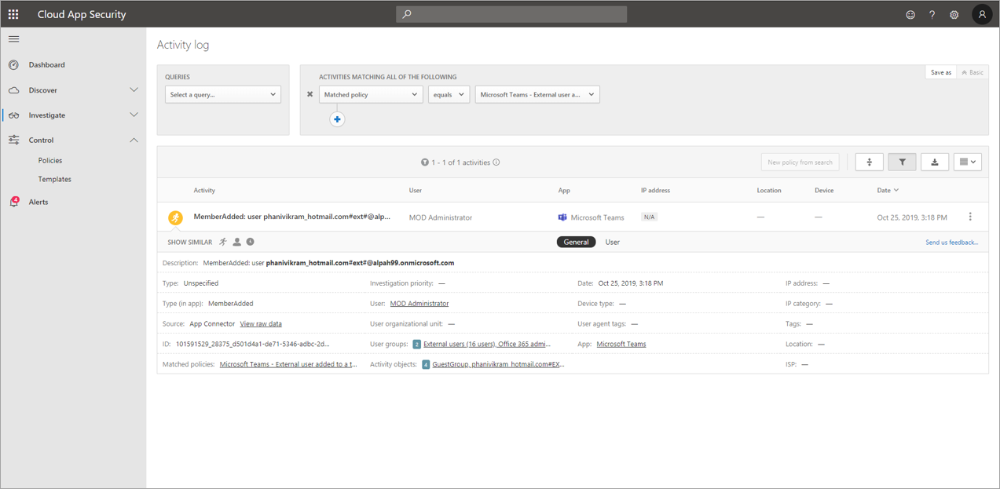

# Buscar eventos en el registro de auditoría en Microsoft Teams

> [!IMPORTANT]
> [!INCLUDE [new-teams-sfb-admin-center-notice](includes/new-teams-sfb-admin-center-notice.md)]

El registro de auditoría puede ayudarle a investigar actividades específicas en los servicios de Microsoft 365. Para Microsoft Teams, estas son algunas de las actividades que se auditan:

- Creación de equipos
- Eliminación de equipos
- Agregación de canales
- Cambios en la configuración

Para obtener una lista completa de las actividades de Teams que se auditan, consulte Las actividades de [Teams](#teams-activities) y Turnos en [las actividades de Teams (en versión preliminar).](#shifts-in-teams-activities)

> [!NOTE]
> Los eventos de auditoría de los canales privados también se registran tal y como están para los equipos y los canales estándar.

## Activar la auditoría en Microsoft Teams

Antes de poder ver los datos de auditoría, primero tiene que activar la auditoría en el Centro de seguridad & [cumplimiento.](https://protection.office.com) Para obtener ayuda con la activación de la auditoría, lea Activar o desactivar la búsqueda [de registros de auditoría.](https://support.office.com/article/Turn-Office-365-audit-log-search-on-or-off-e893b19a-660c-41f2-9074-d3631c95a014)

> [!IMPORTANT]
> Los datos de auditoría solo están disponibles desde el punto en el que ha activado la auditoría.

## Recuperar datos de Microsoft Teams del registro de auditoría

1. Para recuperar los registros de auditoría, vaya al [Centro de seguridad y cumplimiento](https://go.microsoft.com/fwlink/?linkid=855775). En **Buscar,** seleccione **Búsqueda de registros de auditoría.**

2. Use **Buscar** para filtrar por las actividades, las fechas y los usuarios que desee auditar.

3. Exporte los resultados a Excel para continuar el análisis.

> [!IMPORTANT]
> Los datos de auditoría solo están visibles en el registro de auditoría si la auditoría está activada.

La cantidad de tiempo que un registro de auditoría se retiene y se puede buscar en el registro de auditoría depende de su suscripción de Microsoft 365 u Office 365 y específicamente del tipo de licencia que se asigna a los usuarios. Para obtener más información, consulte la descripción del [servicio & centro de cumplimiento de Seguridad.](https://docs.microsoft.com/office365/servicedescriptions/office-365-platform-service-description/office-365-securitycompliance-center)

## Sugerencias para buscar el registro de auditoría

Aquí tiene sugerencias para buscar actividades de Teams en el registro de auditoría.

- Puede seleccionar actividades específicas para buscar haciendo clic en el nombre de la actividad. O bien, puede buscar todas las actividades de un grupo (como actividades de archivos y carpetas) haciendo clic en el nombre del grupo. Si se selecciona una actividad, puede hacer clic en ella para cancelar la selección. También puede usar el cuadro de búsqueda para mostrar las actividades que contienen la palabra clave que escribe.

  

- Para mostrar los eventos de las actividades que se ejecutan mediante cmdlets, seleccione Mostrar resultados **para todas las actividades** de la **lista** Actividades. Si conoce el nombre de la operación para estas actividades, busque todas las actividades y, a continuación, filtre los resultados escribiendo el nombre de la operación en el cuadro de la **columna** Actividad. Para obtener más información, vea [el paso 3: Filtrar los resultados de la búsqueda.](https://docs.microsoft.com/microsoft-365/compliance/search-the-audit-log-in-security-and-compliance?view=o365-worldwide#step-3-filter-the-search-results)

- Para borrar los criterios de búsqueda actuales, haga clic en **Borrar.** El intervalo de fechas vuelve al predeterminado de los últimos siete días. También puede hacer clic en **Borrar todo para mostrar los resultados de todas las actividades** para cancelar todas las actividades seleccionadas.

- Si se encuentran 5000 resultados, probablemente puede suponer que hay más de 5000 eventos que cumplen los criterios de búsqueda. Puede restringir los criterios de búsqueda y volver a ejecutar la búsqueda para devolver menos resultados, o puede exportar todos los resultados de búsqueda seleccionando Exportar resultados Descargar  >  **todos los resultados.**

Vea este [vídeo para usar](https://www.youtube.com/embed/UBxaRySAxyE) la búsqueda de registros de audio. Únase a Ansuman Acharya, administrador de programas de Teams, ya que muestra cómo realizar una búsqueda de registros de auditoría para Teams.

## Usar Cloud App Security para establecer directivas de actividad

Con [la integración de Microsoft Cloud App Security,](https://docs.microsoft.com/cloud-app-security/what-is-cloud-app-security) puede establecer directivas de actividad para exigir una amplia variedad de procesos automatizados mediante las API del proveedor de aplicaciones.  Estas directivas le permiten supervisar actividades específicas realizadas por varios usuarios o seguir tasas inesperadamente elevadas de un determinado tipo de actividad.

Después de establecer una directiva de detección de actividad, empieza a generar alertas. Las alertas solo se generan en las actividades que se producen después de crear la directiva. Aquí se muestra algunos escenarios de ejemplo sobre cómo puede usar las directivas de actividad en Seguridad de la aplicación en la nube para supervisar las actividades de Teams.

### Escenario de usuario externo

Un escenario sobre el que podría querer vigilar, desde una perspectiva empresarial, es la adición de usuarios externos a su entorno de Teams. Si los usuarios externos están habilitados, supervisar su presencia es una buena idea.  Puede usar Cloud [App Security para](https://docs.microsoft.com/cloud-app-security/what-is-cloud-app-security) identificar posibles amenazas.

La captura de pantalla de esta directiva para supervisar la adición de usuarios externos le permite nombrar la directiva, establecer la gravedad según las necesidades de su empresa, establecerla como (en este caso) una sola actividad y, a continuación, establecer los parámetros que supervisarán específicamente solo la adición de usuarios no internos y limitar esta actividad a Teams.

Los resultados de esta directiva se pueden ver en el registro de actividades:

Aquí puede revisar las coincidencias de la directiva que ha establecido y realizar los ajustes necesarios, o exportar los resultados para usarlos en otro lugar.

### Escenario eliminación en masa

Como se ha mencionado anteriormente, puede supervisar escenarios de eliminación. Es posible crear una directiva que supervise la eliminación masiva de sitios de Teams. En este ejemplo, se configura una directiva basada en alertas para detectar la eliminación masiva de equipos en un intervalo de 30 minutos.

Como muestra la captura de pantalla, puede establecer muchos parámetros diferentes para esta directiva para supervisar las eliminaciones de Teams, incluida la gravedad, la acción única o repetida y los parámetros que limitan esto a Teams y la eliminación del sitio. Esto puede hacerse independientemente de una plantilla, o puede que tenga una plantilla creada para basar esta directiva en, según las necesidades de la organización.

Después de establecer una directiva que funcione para su empresa, puede revisar los resultados en el registro de actividades a medida que se desencadenan los eventos:

Puede filtrar hacia abajo hasta la directiva que haya establecido para ver los resultados de esa directiva. Si los resultados que está obteniendo en el registro de actividades no son satisfactorias (quizás está viendo muchos resultados o nada en absoluto), esto puede ayudarle a ajustar la consulta para que sea más relevante para lo que necesita para hacer.

### Escenario de alerta y gobierno

Puede establecer alertas y enviar correos electrónicos a los administradores y a otros usuarios cuando se activa una directiva de actividad. Puede establecer acciones de gobierno automatizadas como suspender un usuario o hacer que este inicie sesión de nuevo de forma automatizada. En este ejemplo se muestra cómo se puede suspender una cuenta de usuario cuando se activa una directiva de actividad y se determina que un usuario eliminó dos o más equipos en 30 minutos.

## Usar Cloud App Security para establecer directivas de detección de anómalo

 Las directivas de detección de anómalo en Cloud App Security proporcionan análisis de comportamiento integrados (UEBA) y de aprendizaje automático (ML) para que pueda ejecutar inmediatamente una detección avanzada de amenazas en el entorno de la nube. Dado que se habilitan automáticamente, las nuevas directivas de detección de anómalo proporcionan resultados inmediatos al proporcionar detecciones inmediatas, buscando numerosos problemas de comportamiento entre los usuarios y los equipos y dispositivos conectados a su red. Además, las nuevas directivas exponen más datos del motor de detección de seguridad de aplicaciones en la nube, para ayudarle a agilizar el proceso de investigación y a contener amenazas continuas.

Estamos trabajando para integrar eventos de Teams en directivas de detección de anómalo. Por ahora, puede configurar directivas de detección anómala para otros productos de Office y tomar medidas sobre los usuarios que coincidan con dichas directivas.

## Actividades de Teams

Aquí tiene una lista de todos los eventos registrados para actividades de usuario y administrador en Teams en el registro de auditoría de Microsoft 365. La tabla incluye el nombre descriptivo que  se muestra en la columna Actividades y el nombre de la operación correspondiente que aparece en la información detallada de un registro de auditoría y en el archivo CSV al exportar los resultados de búsqueda.

|Nombre descriptivo  |Operación|Descripción |
|---------|---------|---------|
|Bot agregado al equipo   |BotAddedToTeam        |Un usuario agrega un bot a un equipo.        |
|Agregación de canales   |ChannelAdded         |Un usuario agrega un canal a un equipo.         |
|Conector agregado  |ConnectorAdded          |Un usuario agrega un conector a un canal.        |
|Miembros agregados    |MemberAdded         |El propietario de un equipo agrega miembros a un equipo, canal o chat grupal.         |
|Pestaña agregada    |TabAdded         |Un usuario agrega una pestaña a un canal.        |
|Configuración del canal cambiada    |ChannelSettingChanged         |La operación ChannelSettingChanged se registra cuando un miembro del equipo realiza las actividades siguientes. Para cada una de estas actividades, se muestra una descripción de la configuración  que se modificó (entre paréntesis se muestra en la columna Elemento de los resultados de búsqueda del registro de auditoría). <ul><li>Cambiar el nombre de un canal de equipo **(nombre del canal)**</li><li>Cambiar la descripción de un canal de equipo **(descripción del canal)**</li> </ul>      |
|Configuración de la organización cambiada   |TeamsTenantSettingChanged         |La operación TeamsTenantSettingChanged se registra cuando un administrador global realiza las siguientes actividades en el Centro de administración de Microsoft 365. Estas actividades afectan a la configuración de Teams para toda la organización. Para obtener más información, consulte [Administrar la configuración de Teams para su organización.](enable-features-office-365.md)  Para cada una de estas actividades, se muestra una descripción de la configuración  que se modificó (entre paréntesis) en la columna Elemento de los resultados de búsqueda del registro de auditoría.<ul><li>Habilita o deshabilita Teams para la organización **(Microsoft Teams).**</li><li>Habilita o deshabilita la interoperabilidad entre Microsoft Teams y Skype Empresarial para la organización **(interoperabilidad con Skype Empresarial).**</li><li>Habilita o deshabilita la vista de organigrama en los clientes de Microsoft Teams **(vista Organigrama).**</li><li>Habilita o deshabilita la posibilidad de que los miembros del equipo programe reuniones privadas **(programación de reuniones privadas).**</li><li>Habilita o deshabilita la posibilidad de que los miembros del equipo programe reuniones de canal **(programación de reuniones de canal).**</li><li>Habilita o deshabilita las videollamadas en las reuniones de Teams **(vídeo para reuniones de Skype).**</li><li>Habilita o deshabilita el uso compartido de la pantalla en las reuniones de Microsoft Teams para la organización (pantalla **compartida para las reuniones de Skype).**</li><li>Habilita o deshabilita la posibilidad de agregar imágenes animadas (denominadas Giphy) a las conversaciones de Teams **(imágenes animadas).**</li><li>Cambia la configuración de clasificación de contenido de la organización **(clasificación de contenido).** La clasificación de contenido restringe el tipo de imagen animada que se puede mostrar en las conversaciones.</li><li>Habilita o deshabilita la posibilidad de que los miembros del equipo agreguen imágenes personalizables (denominadas memes personalizados) de Internet a las conversaciones del equipo (imágenes personalizables **de Internet).**</li><li>Habilita o deshabilita la posibilidad de que los miembros del equipo agreguen imágenes editables (denominadas adhesivos) a las conversaciones del **equipo (imágenes editables).**</li><li>Habilita o deshabilita la posibilidad de que los miembros del equipo usen bots en chats y canales de Microsoft Teams **(bots** para toda la organización).</li><li>Habilita bots específicos para Microsoft Teams. No se incluye T-Bot, que es el bot de ayuda de Teams que está disponible cuando los bots están habilitados para la organización **(bots individuales).**</li><li>Habilita o deshabilita la posibilidad de que los miembros del equipo agreguen extensiones o pestañas **(extensiones o pestañas).**</li><li>Habilita o deshabilita la instalación en paralelo de los bots de propiedad para Microsoft Teams (instalación en paralelo **de bots).**</li><li>Habilita o deshabilita la posibilidad de que los usuarios envíen mensajes de correo electrónico a un canal de Microsoft Teams **(correo electrónico del canal).**</li></ul>|
|Rol cambiado de los miembros del equipo    |MemberRoleChanged         |El propietario de un equipo cambia el rol de los miembros de un equipo. Los siguientes valores indican el tipo de rol asignado al usuario.   **1-** Indica el rol Miembro. **2:** indica el rol Propietario. **3-** Indica el rol Invitado.  La propiedad Miembros también incluye el nombre de su organización y la dirección de correo electrónico del miembro.        |
|Configuración del equipo cambiada    |TeamSettingChanged        |La operación TeamSettingChanged se registra cuando un propietario del equipo realiza las actividades siguientes. Para cada una de estas actividades, se muestra una descripción de la configuración  que se modificó (entre paréntesis) en la columna Elemento de los resultados de búsqueda del registro de auditoría.<ul><li>Cambia el tipo de acceso para un equipo. Los equipos se pueden establecer como privados o públicos (tipo **de acceso de equipo).** Cuando un equipo es privado (la configuración predeterminada), los usuarios pueden acceder al equipo solo por invitación. Cuando un equipo es público, cualquiera lo puede detectar.</li><li>Cambia la clasificación de la información de un equipo **(clasificación de equipo).** Por ejemplo, los datos del equipo se pueden clasificar como impacto empresarial alto, impacto empresarial medio o impacto empresarial bajo.</li><li>Cambia el nombre de un equipo **(nombre del equipo).**</li><li>Cambia la descripción del equipo **(descripción del equipo).**</li><li>Cambios realizados en la configuración del equipo. Para acceder a esta configuración, el propietario de un equipo puede hacer clic con el botón derecho en un equipo, seleccionar Administrar equipo **y,** a continuación, hacer clic en la **pestaña** Configuración. Para estas actividades, el nombre de la configuración  que se modificó se muestra en la columna Elemento de los resultados de búsqueda del registro de auditoría.</li></ul>         |
|Equipo creado    |TeamCreated         |Un usuario crea un equipo.         |
|Todas las aplicaciones de la organización eliminadas|DeletedAllOrganizationApps           |Se han eliminado todas las aplicaciones de la organización del catálogo.     |
|Aplicación eliminada |AppDeletedFromCatalog           |Se ha eliminado una aplicación del catálogo.     |
|Canal eliminado     |ChannelDeleted         |Un usuario elimina un canal de un equipo.         |
|Equipo eliminado  |TeamDeleted            |El propietario de un equipo elimina un equipo.      |
|Aplicación instalada |AppInstalled         |Se ha instalado una aplicación.   |
|Acción realizada en la tarjeta|PerformedCardAction|Un usuario hizo algo en una tarjeta adaptable dentro de un chat. Los bots suelen usar tarjetas adaptables para permitir que se muestre información e interacción en los chats.   **Nota:** Solo las acciones de entrada en línea en una tarjeta adaptable dentro de un chat estarán disponibles en el registro de auditoría. Por ejemplo, cuando un usuario envía una respuesta de sondeo en una conversación de canal en una tarjeta adaptable generada por un bot de sondeo. Las acciones de usuario como "Ver resultado", que abrirán un cuadro de diálogo, o las acciones de usuario dentro de cuadros de diálogo no estarán disponibles en el registro de auditoría.|
|Aplicación publicada |AppPublishedToCatalog           |Se agregó una aplicación al catálogo.     |
|Bot quitado del equipo   |BotRemovedFromTeam         |Un usuario quita un bot de un equipo.       |
|Conector quitado     |ConnectorRemoved         |Un usuario quita un conector de un canal.         |
|Miembros quitados    |MemberRemoved        |El propietario de un equipo quita miembros de un equipo, canal o chat grupal.         |
|Pestaña quitada    |TabRemoved         |Un usuario quita una pestaña de un canal.         |
|Aplicación desinstalada |AppUninstalled           |Se ha desinstalado una aplicación.     |
|Aplicación actualizada |AppUpdatedInCatalog           |Se ha actualizado una aplicación en el catálogo.     |
|Conector actualizado    |ConnectorUpdated         |Un usuario modificó un conector en un canal.         |
|Pestaña actualizada   |TabUpdated         |Un usuario modificó una pestaña en un canal.         |
|Aplicación actualizada |AppUpgraded           |Una aplicación se actualizó a su versión más reciente del catálogo.     |
|Usuario que ha iniciado sesión en Teams     |TeamsSessionStarted         |Un usuario inicia sesión en un cliente de Microsoft Teams. Este evento no captura las actividades de actualización de token.         |

## Turnos en las actividades de Teams

**(en la versión preliminar)**

Si su organización usa la aplicación Turnos en Teams, puede buscar en el registro de auditoría actividades relacionadas con la aplicación Turnos. Aquí tiene una lista de todos los eventos que se registran para las actividades de Turnos en Teams en el registro de auditoría de Microsoft 365.

|Nombre descriptivo  |Operación  |Descripción  |
|---------|---------|---------|
|Grupo de programación agregado |ScheduleGroupAdded          |Un usuario agrega correctamente un nuevo grupo de programación a la programación.|
|Grupo de programación modificado     |ScheduleGroupEdited         |Un usuario edita correctamente un grupo de programación.          |
|Grupo de programación eliminado         |ScheduleGroupDeleted              |Un usuario elimina correctamente un grupo de programación de la programación.|
|Programación se ha desaconscado |ScheduleWithwith a              |Un usuario retira correctamente una programación publicada.|
|Turno agregado      |MayúsAdded          |Un usuario agrega correctamente un turno.           |
|Turno editado       |ShiftEdited       |Un usuario edita correctamente un turno.        |
|Turno eliminado          |ShiftDeleted          | Un usuario elimina correctamente un turno.               |
|Tiempo de espera agregado      |TimeOffAdded          |Un usuario agrega correctamente permisos a la programación.          |
|Tiempo libre editado         |TimeOffEdited           |Un usuario edita correctamente los permisos.          |
|Tiempo de espera eliminado     |TimeOffDeleted              |Un usuario elimina correctamente los permisos.           |
|Turno abierto agregado     |OpenShiftAdded          |Un usuario agrega correctamente un turno abierto a un grupo de programación.          |
|Turno abierto editado    |OpenShiftEdited          |Un usuario edita correctamente un turno abierto en un grupo de programación.          |
|Turno abierto eliminado      |OpenShiftDeleted          |Un usuario elimina correctamente un turno abierto de un grupo de programación.         |
|Programación compartida     |ScheduleShared                  |Un usuario ha compartido correctamente la programación de un equipo para un intervalo de fechas.          |
|Reloj con reloj de tiempo         |ClockedIn          |Un usuario marca correctamente el reloj de tiempo.          |
|Reloj con reloj de tiempo      |ClockedOut          |Un usuario realiza correctamente la hora de salida con el Reloj de tiempo.          |
|Punto de descanso con reloj de tiempo      |BreakStarted          |Un usuario inicia correctamente un descanso durante una sesión activa de Reloj de tiempo.          |
|Interrupción finalizada con reloj de tiempo    |BreakEnded          |Un usuario finaliza correctamente un salto durante una sesión activa de Reloj de tiempo.          |
|Entrada de reloj de hora agregada     |TimeClockEntryAdded          |Un usuario agrega correctamente una nueva entrada manual de reloj de tiempo en la hoja de horas.          |
|Entrada de reloj de tiempo editado     | TimeClockEntryEdited             |Un usuario edita correctamente una entrada de reloj de tiempo en la Hoja de horas.          |
|Entrada de reloj de hora eliminada    |TimeClockEntryDeleted              |Un usuario elimina correctamente una entrada de reloj de tiempo en la hoja de horas.          |
|Se ha agregado la solicitud de turno         |RequestAdded              |Un usuario agregó una solicitud de turno.          |
|Respuesta a la solicitud de turno     |RequestRespondedTo                  |Un usuario ha respondido a una solicitud de turno.          |
|Solicitud de turno cancelada         |RequestCancelled               |Un usuario ha cancelado una solicitud de turno.          |
|Configuración de programación cambiada      |ScheduleSettingChanged          |Un usuario cambia una configuración en La configuración de Turnos.         |
|Integración de los empleados agregada      |WorkforceIntegrationAdded                  | La aplicación Turnos está integrada con un sistema de terceros.         |
|Mensaje de turno aceptado         |OffShiftDialogAccepted          |Un usuario reconoce el mensaje de turno fuera de turno para acceder a Teams fuera del horario de turno.           |

## API de actividad de administración de Office 365

Puede usar la API de actividad de administración de Office 365 para recuperar información sobre los eventos de Teams. Para obtener más información sobre el esquema de la API de actividad de administración para Teams, vea [el esquema de Teams.](https://docs.microsoft.com/office/office-365-management-api/office-365-management-activity-api-schema#microsoft-teams-schema)

## Atribución en registros de auditoría de Teams

Los cambios de pertenencia a Teams (como los usuarios agregados o eliminados) realizados a través de Azure Active Directory (Azure AD), el portal de administración de Microsoft 365 o la API de Graph Groups de Microsoft 365 aparecerán en los mensajes de auditoría de Teams y en el canal General, atribuyéndolo a un propietario existente del equipo, y no a la verdadera recompensa de la acción. En estos escenarios, consulte los registros de auditoría de Azure AD o [microsoft 365 Group](https://docs.microsoft.com/microsoft-365/compliance/search-the-audit-log-in-security-and-compliance) para ver la información relevante.

## Temas relacionados

- [Buscar en el registro de auditoría del Centro de cumplimiento de Microsoft 365](https://docs.microsoft.com/microsoft-365/compliance/search-the-audit-log-in-security-and-compliance)
