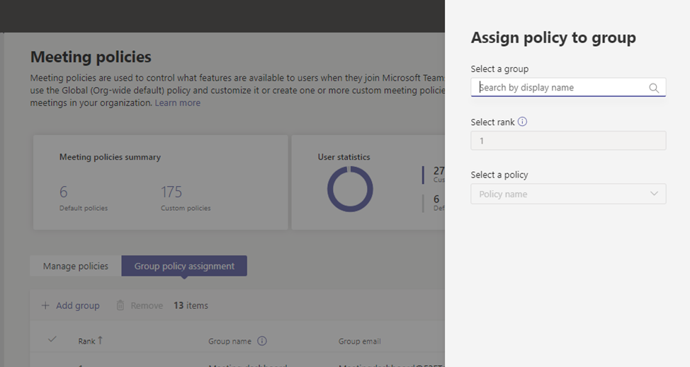

# <a name="assign-policies-to-large-sets-of-users-in-your-school"></a><span data-ttu-id="69a6f-103">Asignar directivas a grandes conjuntos de usuarios de la escuela</span><span class="sxs-lookup"><span data-stu-id="69a6f-103">Assign policies to large sets of users in your school</span></span>

[!INCLUDE [policy-wizard-edu](includes/policy-wizard-edu.md)]

> [!NOTE]
> <span data-ttu-id="69a6f-104">Para más información sobre cómo asignar directivas en Microsoft Teams, vea Asignar directivas [a los usuarios en Teams.](assign-policies.md)</span><span class="sxs-lookup"><span data-stu-id="69a6f-104">For the larger story on assigning policies in Microsoft Teams, see [Assign policies to your users in Teams](assign-policies.md).</span></span>

## <a name="overview"></a><span data-ttu-id="69a6f-105">Información general</span><span class="sxs-lookup"><span data-stu-id="69a6f-105">Overview</span></span>

<span data-ttu-id="69a6f-106">¿Necesita dar acceso a los alumnos y profesores a diferentes características de Microsoft Teams?</span><span class="sxs-lookup"><span data-stu-id="69a6f-106">Do you need to give your students and educators access to different features in Microsoft Teams?</span></span> <span data-ttu-id="69a6f-107">Puede identificar rápidamente a los usuarios de su organización por tipo de licencia y, a continuación, asignarles la directiva adecuada.</span><span class="sxs-lookup"><span data-stu-id="69a6f-107">You can quickly identify the users in your organization by license type and then assign them the appropriate policy.</span></span> <span data-ttu-id="69a6f-108">En este tutorial se muestra cómo asignar una directiva de reunión a grandes conjuntos de usuarios de su centro educativo.</span><span class="sxs-lookup"><span data-stu-id="69a6f-108">This tutorial shows you how to assign a meeting policy to large sets of users in your school.</span></span> <span data-ttu-id="69a6f-109">Puede asignar directivas mediante el Centro de administración de Microsoft Teams y PowerShell, y le mostraremos ambas formas.</span><span class="sxs-lookup"><span data-stu-id="69a6f-109">You can assign policies using the Microsoft Teams admin center and PowerShell and we'll show you both ways.</span></span>

<span data-ttu-id="69a6f-110">Puede asignar una directiva de reunión a un grupo de seguridad del que los usuarios sean miembros o directamente a los usuarios a escala a través de una asignación de directiva por lotes.</span><span class="sxs-lookup"><span data-stu-id="69a6f-110">You can assign a meeting policy to a security group that the users are members of or directly to users at scale through a batch policy assignment.</span></span> <span data-ttu-id="69a6f-111">Aprenderá a:</span><span class="sxs-lookup"><span data-stu-id="69a6f-111">You'll learn how to:</span></span>

- <span data-ttu-id="69a6f-112">**Use [la asignación de directivas](#assign-a-policy-to-a-group) a grupos para asignar una directiva de reunión a un grupo de seguridad (recomendado).**</span><span class="sxs-lookup"><span data-stu-id="69a6f-112">**Use [policy assignment to groups](#assign-a-policy-to-a-group) to assign a meeting policy to a security group (recommended)**.</span></span> <span data-ttu-id="69a6f-113">Este método le permite asignar una directiva basada en la pertenencia a grupos.</span><span class="sxs-lookup"><span data-stu-id="69a6f-113">This method lets you assign a policy based on group membership.</span></span> <span data-ttu-id="69a6f-114">Puede asignar una directiva a un grupo de seguridad o lista de distribución.</span><span class="sxs-lookup"><span data-stu-id="69a6f-114">You can assign a policy to a security group or distribution list.</span></span> <span data-ttu-id="69a6f-115">A medida que se agregan o quitan miembros del grupo, sus asignaciones de directiva heredadas se actualizan en consecuencia.</span><span class="sxs-lookup"><span data-stu-id="69a6f-115">As members are added to or removed from the group, their inherited policy assignments are updated accordingly.</span></span> <span data-ttu-id="69a6f-116">Le recomendamos que use este método, ya que reduce el tiempo de administración de las directivas para los usuarios nuevos o cuando cambian los roles de los usuarios.</span><span class="sxs-lookup"><span data-stu-id="69a6f-116">We recommend you use this method because it reduces the time to manage policies for new users or when users' roles change.</span></span> <span data-ttu-id="69a6f-117">Este método funciona mejor para grupos de hasta 50 000 usuarios, pero también funcionará con grupos más grandes.</span><span class="sxs-lookup"><span data-stu-id="69a6f-117">This method works best for groups of up to 50,000 users but will also work with larger groups.</span></span>

- <span data-ttu-id="69a6f-118">**Use [la asignación de directivas por](assign-policies.md#assign-a-policy-to-a-batch-of-users) lotes para asignar una directiva de reunión directamente a los usuarios en masa.**</span><span class="sxs-lookup"><span data-stu-id="69a6f-118">**Use [batch policy assignment](assign-policies.md#assign-a-policy-to-a-batch-of-users) to assign a meeting policy directly to users in bulk**.</span></span> <span data-ttu-id="69a6f-119">Puede asignar una directiva para un máximo de 5000 usuarios a la vez.</span><span class="sxs-lookup"><span data-stu-id="69a6f-119">You can assign a policy for up to 5,000 users at a time.</span></span> <span data-ttu-id="69a6f-120">Si tiene más de 5000 usuarios, puede enviar varios lotes.</span><span class="sxs-lookup"><span data-stu-id="69a6f-120">If you have more than 5,000 users, you can submit multiple batches.</span></span> <span data-ttu-id="69a6f-121">Con este método, cuando tenga nuevos usuarios, tendrá que volver a ejecutar la asignación por lotes para asignar la directiva a esos nuevos usuarios.</span><span class="sxs-lookup"><span data-stu-id="69a6f-121">With this method, when you have new users, you'll need to re-run the batch assignment to assign the policy to those new users.</span></span>

<span data-ttu-id="69a6f-122">Recuerde que, en Teams, los usuarios obtienen automáticamente la directiva global (predeterminada para toda la organización) para un tipo de directiva de Teams a menos que cree y asigne una directiva personalizada.</span><span class="sxs-lookup"><span data-stu-id="69a6f-122">Remember that in Teams, users automatically get the Global (Org-wide default) policy for a Teams policy type unless you create and assign a custom policy.</span></span> <span data-ttu-id="69a6f-123">Como la población de alumnos suele ser el conjunto más grande de usuarios y suelen recibir la configuración más restrictiva, le recomendamos que haga lo siguiente:</span><span class="sxs-lookup"><span data-stu-id="69a6f-123">Because the student population is often the largest set of users and they often receive the most restrictive settings, we recommend that you do the following:</span></span>

- <span data-ttu-id="69a6f-124">Cree una directiva personalizada que permita funciones básicas, como el chat privado y la programación de reuniones, y asignar la directiva a su personal y profesores.</span><span class="sxs-lookup"><span data-stu-id="69a6f-124">Create a custom policy that allows core capabilities such as private chat and meeting scheduling and assign the policy to your staff and educators.</span></span>
- <span data-ttu-id="69a6f-125">Asigne la directiva personalizada a su personal y profesores.</span><span class="sxs-lookup"><span data-stu-id="69a6f-125">Assign the custom policy to your staff and educators.</span></span>
- <span data-ttu-id="69a6f-126">Edite y aplique la directiva global (predeterminada para toda la organización) para restringir las capacidades de los alumnos.</span><span class="sxs-lookup"><span data-stu-id="69a6f-126">Edit and apply the Global (Org-wide default) policy to restrict capabilities for students.</span></span>

<span data-ttu-id="69a6f-127">Tenga en cuenta que la directiva global se aplicará a todos los usuarios del centro educativo hasta que cree una directiva personalizada y la asigne a su personal y profesores.</span><span class="sxs-lookup"><span data-stu-id="69a6f-127">Keep in mind that the Global policy will apply to all users in your school until you create a custom policy and assign it to your staff and educators.</span></span>

<span data-ttu-id="69a6f-128">En este tutorial, los alumnos recibirán la directiva global de reuniones y asignaremos una directiva de reunión personalizada denominada EducatorMeetingPolicy al personal y a los profesores.</span><span class="sxs-lookup"><span data-stu-id="69a6f-128">In this tutorial, students will get the Global meeting policy and we'll assign a custom meeting policy named EducatorMeetingPolicy to staff and educators.</span></span> <span data-ttu-id="69a6f-129">Se supone que ha editado la directiva global para adaptar la configuración de la reunión [a](policy-packages-edu.md) los alumnos y ha creado una directiva personalizada que define la experiencia de la reunión para el personal y los profesores.</span><span class="sxs-lookup"><span data-stu-id="69a6f-129">We assume that you've edited the Global policy to tailor meeting settings for students and [created a custom policy](policy-packages-edu.md) that defines the meeting experience for staff and educators.</span></span>


## <a name="assign-a-policy-to-a-group"></a><span data-ttu-id="69a6f-131">Asignar una directiva a un grupo</span><span class="sxs-lookup"><span data-stu-id="69a6f-131">Assign a policy to a group</span></span>

<span data-ttu-id="69a6f-132">Siga estos pasos para crear un grupo de seguridad para el personal y los profesores y, a continuación, asigne una directiva de reunión personalizada denominada EducatorMeetingPolicy a ese grupo de seguridad.</span><span class="sxs-lookup"><span data-stu-id="69a6f-132">Follow these steps to create a security group for your staff and educators, and then assign a custom meeting policy named EducatorMeetingPolicy to that security group.</span></span>

### <a name="before-you-get-started"></a><span data-ttu-id="69a6f-133">Antes de empezar</span><span class="sxs-lookup"><span data-stu-id="69a6f-133">Before you get started</span></span>

> [!IMPORTANT]
> <span data-ttu-id="69a6f-134">Al asignar una directiva a un grupo, la asignación de directiva se propaga a los miembros del grupo según las reglas de prioridad.</span><span class="sxs-lookup"><span data-stu-id="69a6f-134">When you assign a policy to a group, the policy assignment is propagated to members of the group according to precedence rules.</span></span> <span data-ttu-id="69a6f-135">Por ejemplo, si a un usuario se le asigna directamente una directiva (ya sea de forma individual o a través de una asignación por lotes), esa directiva tiene prioridad sobre una directiva heredada de un grupo.</span><span class="sxs-lookup"><span data-stu-id="69a6f-135">For example, if a user is directly assigned a policy (either individually or through a batch assignment), that policy takes precedence over a policy that's inherited from a group.</span></span> <span data-ttu-id="69a6f-136">Esto también significa que, si un usuario tiene una directiva de reunión que se le asignó directamente, tendrá que quitar esa directiva de reunión del usuario antes de que pueda heredar una directiva de reunión de un grupo de seguridad.</span><span class="sxs-lookup"><span data-stu-id="69a6f-136">This also means that if a user has a meeting policy that was directly assigned to them, you'll have to remove that meeting policy from the user before they can inherit a meeting policy from a security group.</span></span>

<span data-ttu-id="69a6f-137">Antes de empezar, es importante [](assign-policies.md#precedence-rules) comprender las reglas de prioridad y la clasificación [de asignaciones de grupo.](assign-policies.md#group-assignment-ranking)</span><span class="sxs-lookup"><span data-stu-id="69a6f-137">Before you get started, it's important to understand [precedence rules](assign-policies.md#precedence-rules) and [group assignment ranking](assign-policies.md#group-assignment-ranking).</span></span> <span data-ttu-id="69a6f-138">Asegúrese de leer y comprender los conceptos de Lo que debe saber sobre la asignación de directivas **[a grupos.](assign-policies.md#what-you-need-to-know-about-policy-assignment-to-groups)**</span><span class="sxs-lookup"><span data-stu-id="69a6f-138">**Make sure that you read and understand the concepts in [What you need to know about policy assignment to groups](assign-policies.md#what-you-need-to-know-about-policy-assignment-to-groups)**.</span></span>

<span data-ttu-id="69a6f-139">Tendrá que completar todos estos pasos para que el personal y los profesores hereden una directiva de reunión de un grupo de seguridad.</span><span class="sxs-lookup"><span data-stu-id="69a6f-139">You'll need to complete all these steps for your staff and educators to inherit a meeting policy from a security group.</span></span>

1. <span data-ttu-id="69a6f-140">[Crear grupos de seguridad.](#create-security-groups)</span><span class="sxs-lookup"><span data-stu-id="69a6f-140">[Create security groups](#create-security-groups).</span></span>
2. <span data-ttu-id="69a6f-141">[Asigne una directiva a un grupo de seguridad.](#assign-a-policy-to-a-security-group)</span><span class="sxs-lookup"><span data-stu-id="69a6f-141">[Assign a policy to a security group](#assign-a-policy-to-a-security-group).</span></span>
3. <span data-ttu-id="69a6f-142">[Quite una directiva que se asignó directamente a los usuarios.](#remove-a-policy-that-was-directly-assigned-to-users)</span><span class="sxs-lookup"><span data-stu-id="69a6f-142">[Remove a policy that was directly assigned to users](#remove-a-policy-that-was-directly-assigned-to-users).</span></span>

### <a name="create-security-groups"></a><span data-ttu-id="69a6f-143">Crear grupos de seguridad</span><span class="sxs-lookup"><span data-stu-id="69a6f-143">Create security groups</span></span>

<span data-ttu-id="69a6f-144">En primer lugar, cree un grupo de seguridad para el personal y los profesores.</span><span class="sxs-lookup"><span data-stu-id="69a6f-144">First, create a security group for your staff and educators.</span></span>

<span data-ttu-id="69a6f-145">Con [School Data Sync](https://docs.microsoft.com/SchoolDataSync/) (SDS), puede crear fácilmente grupos de seguridad para [profesores y alumnos](https://docs.microsoft.com/SchoolDataSync/edu-security-groups) de su centro educativo.</span><span class="sxs-lookup"><span data-stu-id="69a6f-145">With [School Data Sync](https://docs.microsoft.com/SchoolDataSync/) (SDS), you can [easily create security groups educators and students](https://docs.microsoft.com/SchoolDataSync/edu-security-groups) in your school.</span></span> <span data-ttu-id="69a6f-146">Le recomendamos que use SDS para crear los grupos de seguridad que necesita para administrar las directivas de su centro educativo.</span><span class="sxs-lookup"><span data-stu-id="69a6f-146">We recommend that you use SDS to create the security groups you need to manage policies for your school.</span></span>

<span data-ttu-id="69a6f-147">Si no puede implementar SDS en su entorno, use este script de [PowerShell](scripts/powershell-script-security-groups-edu.md) para crear dos grupos de seguridad, uno para todos los docentes y profesores que tengan asignada una licencia para profesores y otro para todos los alumnos que tengan asignada una licencia para estudiantes.</span><span class="sxs-lookup"><span data-stu-id="69a6f-147">If you're unable to deploy SDS within your environment, use [this PowerShell script](scripts/powershell-script-security-groups-edu.md) to create two security groups, one for all staff and educators who have a Faculty license assigned and another for all students who have a Student license assigned.</span></span> <span data-ttu-id="69a6f-148">Tendrá que ejecutar este script rutinariamente para mantener los grupos actualizados.</span><span class="sxs-lookup"><span data-stu-id="69a6f-148">You'll need to run this script routinely to keep the groups fresh and up to date.</span></span>

### <a name="assign-a-policy-to-a-security-group"></a><span data-ttu-id="69a6f-149">Asignar una directiva a un grupo de seguridad</span><span class="sxs-lookup"><span data-stu-id="69a6f-149">Assign a policy to a security group</span></span>

#### <a name="using-the-microsoft-teams-admin-center"></a><span data-ttu-id="69a6f-150">Usar el Centro de administración de Microsoft Teams</span><span class="sxs-lookup"><span data-stu-id="69a6f-150">Using the Microsoft Teams admin center</span></span>

> [!NOTE]
> <span data-ttu-id="69a6f-151">Actualmente, la asignación de directivas a grupos mediante el Centro de administración de Microsoft Teams solo está disponible para la directiva de llamadas de Teams, la directiva de parque de llamadas de Teams, la directiva de teams, la directiva de eventos en directo de Teams, la directiva de reuniones de Teams y la directiva de mensajería de Teams.</span><span class="sxs-lookup"><span data-stu-id="69a6f-151">Currently, policy assignment to groups using the Microsoft Teams admin center is only available for Teams calling policy, Teams call park policy, Teams policy, Teams live events policy, Teams meeting policy, and Teams messaging policy.</span></span> <span data-ttu-id="69a6f-152">Para otros tipos de directiva, use PowerShell.</span><span class="sxs-lookup"><span data-stu-id="69a6f-152">For other policy types, use PowerShell.</span></span>

1. <span data-ttu-id="69a6f-153">En el panel de navegación izquierdo del Centro de administración de Microsoft Teams, vaya a **Reuniones** > **Directivas de reunión**.</span><span class="sxs-lookup"><span data-stu-id="69a6f-153">In the left navigation of the Microsoft Teams admin center, go to **Meetings** > **Meeting policies**.</span></span>
2. <span data-ttu-id="69a6f-154">Seleccione la pestaña **Asignación de directiva de** grupo.</span><span class="sxs-lookup"><span data-stu-id="69a6f-154">Select the **Group policy assignment** tab.</span></span>
3. <span data-ttu-id="69a6f-155">Seleccione **Agregar grupo y,** a continuación, en el panel Asignar **directiva** a grupo, haga lo siguiente:</span><span class="sxs-lookup"><span data-stu-id="69a6f-155">Select **Add group**, and then in the **Assign policy to group** pane, do the following:</span></span>

    
    1. <span data-ttu-id="69a6f-157">En el **cuadro Seleccionar un grupo,** busque y agregue el grupo de seguridad que contiene el personal y los profesores.</span><span class="sxs-lookup"><span data-stu-id="69a6f-157">In the **Select a group** box, search for and add the security group that contains your staff and educators.</span></span>
    2. <span data-ttu-id="69a6f-158">En el **cuadro Seleccionar jerarquía,** escriba **1.**</span><span class="sxs-lookup"><span data-stu-id="69a6f-158">In the **Select rank** box, enter **1**.</span></span>
    3. <span data-ttu-id="69a6f-159">En el **cuadro Seleccionar una directiva,** seleccione **EducatorMeetingPolicy.**</span><span class="sxs-lookup"><span data-stu-id="69a6f-159">In the **Select a policy** box, select **EducatorMeetingPolicy**.</span></span>
    4. <span data-ttu-id="69a6f-160">Seleccione **Aplicar.**</span><span class="sxs-lookup"><span data-stu-id="69a6f-160">Select **Apply**.</span></span>

<span data-ttu-id="69a6f-161">Para quitar una asignación de directiva de grupo, en la **pestaña Asignación** de directiva de grupo de la página de directiva, seleccione la asignación de grupo y, a continuación, **seleccione Quitar.**</span><span class="sxs-lookup"><span data-stu-id="69a6f-161">To remove a group policy assignment, on the **Group policy assignment** tab of the policy page, select the group assignment, and then select **Remove**.</span></span>

<span data-ttu-id="69a6f-162">Para cambiar la clasificación de una asignación de grupo, primero tiene que quitar la asignación de directiva de grupo.</span><span class="sxs-lookup"><span data-stu-id="69a6f-162">To change the ranking of a group assignment, you have to first remove the group policy assignment.</span></span> <span data-ttu-id="69a6f-163">A continuación, siga los pasos anteriores para asignar la directiva a un grupo.</span><span class="sxs-lookup"><span data-stu-id="69a6f-163">Then, follow the steps above to assign the policy to a group.</span></span>

#### <a name="using-powershell"></a><span data-ttu-id="69a6f-164">Con PowerShell</span><span class="sxs-lookup"><span data-stu-id="69a6f-164">Using PowerShell</span></span>

> [!NOTE]
> <span data-ttu-id="69a6f-165">Actualmente, la asignación de directivas a grupos con PowerShell no está disponible para todos los tipos de directiva de Teams.</span><span class="sxs-lookup"><span data-stu-id="69a6f-165">Currently, policy assignment to groups using PowerShell isn't available for all Teams policy types.</span></span> <span data-ttu-id="69a6f-166">Vea [New-CsGroupPolicyAssignment para](https://docs.microsoft.com/powershell/module/teams/new-csgrouppolicyassignment) obtener una lista de los tipos de directiva admitidos.</span><span class="sxs-lookup"><span data-stu-id="69a6f-166">See [New-CsGroupPolicyAssignment](https://docs.microsoft.com/powershell/module/teams/new-csgrouppolicyassignment) for the list of supported policy types.</span></span>

##### <a name="install-and-connect-to-the-microsoft-teams-powershell-module"></a><span data-ttu-id="69a6f-167">Instalar y conectarse al módulo De PowerShell de Microsoft Teams</span><span class="sxs-lookup"><span data-stu-id="69a6f-167">Install and connect to the Microsoft Teams PowerShell module</span></span>

<span data-ttu-id="69a6f-168">Ejecute lo siguiente para instalar el [módulo de PowerShell de Teams](https://www.powershellgallery.com/packages/MicrosoftTeams) (si aún no está instalado).</span><span class="sxs-lookup"><span data-stu-id="69a6f-168">Run the following to install the [Teams PowerShell module](https://www.powershellgallery.com/packages/MicrosoftTeams) (if it's not already installed).</span></span> <span data-ttu-id="69a6f-169">Asegúrese de instalar la versión 1.0.5 o posterior.</span><span class="sxs-lookup"><span data-stu-id="69a6f-169">Make sure you install version 1.0.5 or later.</span></span>

```powershell
Install-Module -Name MicrosoftTeams
```

<span data-ttu-id="69a6f-170">Ejecute lo siguiente para conectarse a Teams e iniciar una sesión.</span><span class="sxs-lookup"><span data-stu-id="69a6f-170">Run the following to connect to Teams and start a session.</span></span>

```powershell
Connect-MicrosoftTeams
```

<span data-ttu-id="69a6f-171">Cuando se le solicite, inicie sesión con sus credenciales de administrador.</span><span class="sxs-lookup"><span data-stu-id="69a6f-171">When you're prompted, sign in using your admin credentials.</span></span>

##### <a name="assign-a-policy-to-a-group"></a><span data-ttu-id="69a6f-172">Asignar una directiva a un grupo</span><span class="sxs-lookup"><span data-stu-id="69a6f-172">Assign a policy to a group</span></span>

<span data-ttu-id="69a6f-173">Ejecute lo siguiente para asignar la directiva de reunión denominada EducatorMeetingPolicy al grupo de seguridad que contiene el personal y los profesores, y establezca la clasificación de tareas en 1.</span><span class="sxs-lookup"><span data-stu-id="69a6f-173">Run the following to assign the meeting policy named EducatorMeetingPolicy to the security group that contains your staff and educators and set the assignment ranking to 1.</span></span> <span data-ttu-id="69a6f-174">Puede especificar un grupo de seguridad mediante el Id. de objeto, la dirección SIP (Protocolo de inicio de sesión) o la dirección de correo electrónico.</span><span class="sxs-lookup"><span data-stu-id="69a6f-174">You can specify a security group by using the object Id, Session Initiation Protocol (SIP) address, or email address.</span></span> <span data-ttu-id="69a6f-175">En este ejemplo, usamos una dirección de correo electrónico (staff-faculty@contoso.com).</span><span class="sxs-lookup"><span data-stu-id="69a6f-175">In this example, we use an email address (staff-faculty@contoso.com).</span></span>

```powershell
New-CsGroupPolicyAssignment -GroupId staff-faculty@contoso.com -PolicyType TeamsMeetingPolicy -PolicyName "EducatorMeetingPolicy" -Rank 1
```

### <a name="remove-a-policy-that-was-directly-assigned-to-users"></a><span data-ttu-id="69a6f-176">Quitar una directiva que se asignó directamente a los usuarios</span><span class="sxs-lookup"><span data-stu-id="69a6f-176">Remove a policy that was directly assigned to users</span></span>

<span data-ttu-id="69a6f-177">Recuerde que si a un usuario se le asignó directamente una directiva (ya sea de forma individual o a través de una asignación por lotes), esa directiva tiene prioridad.</span><span class="sxs-lookup"><span data-stu-id="69a6f-177">Remember that if a user was directly assigned a policy (either individually or through a batch assignment), that policy takes precedence.</span></span> <span data-ttu-id="69a6f-178">Esto significa que si un usuario tiene una directiva de reunión que se le asignó directamente, tendrá que quitar esa directiva de reunión del usuario antes de que pueda heredar una directiva de reunión de un grupo de seguridad.</span><span class="sxs-lookup"><span data-stu-id="69a6f-178">This means that if a user has a meeting policy that was directly assigned to them, you'll have to remove that meeting policy from the user before they can inherit a meeting policy from a security group.</span></span>

<span data-ttu-id="69a6f-179">Para obtener más información, vea Lo que necesita saber sobre la asignación [de directivas a grupos.](assign-policies.md#what-you-need-to-know-about-policy-assignment-to-groups)</span><span class="sxs-lookup"><span data-stu-id="69a6f-179">To learn more, see [What you need to know about policy assignment to groups](assign-policies.md#what-you-need-to-know-about-policy-assignment-to-groups).</span></span>

<span data-ttu-id="69a6f-180">Siga estos pasos para quitar la directiva de reunión que se asignó directamente a su personal y profesores.</span><span class="sxs-lookup"><span data-stu-id="69a6f-180">Follow these steps to remove the meeting policy that was directly assigned to your staff and educators.</span></span>

#### <a name="install-and-connect-to-the-microsoft-teams-powershell-module"></a><span data-ttu-id="69a6f-181">Instalar y conectarse al módulo De PowerShell de Microsoft Teams</span><span class="sxs-lookup"><span data-stu-id="69a6f-181">Install and connect to the Microsoft Teams PowerShell module</span></span>

<span data-ttu-id="69a6f-182">Ejecute lo siguiente para instalar el [módulo de PowerShell de Teams](https://www.powershellgallery.com/packages/MicrosoftTeams) (si aún no está instalado).</span><span class="sxs-lookup"><span data-stu-id="69a6f-182">Run the following to install the [Teams PowerShell module](https://www.powershellgallery.com/packages/MicrosoftTeams) (if it's not already installed).</span></span> <span data-ttu-id="69a6f-183">Asegúrese de instalar la versión 1.0.5 o posterior.</span><span class="sxs-lookup"><span data-stu-id="69a6f-183">Make sure you install version 1.0.5 or later.</span></span>

```powershell
Install-Module -Name MicrosoftTeams
```

<span data-ttu-id="69a6f-184">Ejecute lo siguiente para conectarse a Teams e iniciar una sesión.</span><span class="sxs-lookup"><span data-stu-id="69a6f-184">Run the following to connect to Teams and start a session.</span></span>

```powershell
Connect-MicrosoftTeams
```

<span data-ttu-id="69a6f-185">Cuando se le solicite, inicie sesión con las mismas credenciales de administrador que usó para conectarse a Azure AD.</span><span class="sxs-lookup"><span data-stu-id="69a6f-185">When you're prompted, sign in using the same admin credentials you used to connect to Azure AD.</span></span>

#### <a name="unassign-a-policy-that-was-directly-assigned-to-users"></a><span data-ttu-id="69a6f-186">Desasignación de una directiva que se asignó directamente a los usuarios</span><span class="sxs-lookup"><span data-stu-id="69a6f-186">Unassign a policy that was directly assigned to users</span></span>

<span data-ttu-id="69a6f-187">Ejecute lo siguiente para quitar una directiva de reunión de los usuarios a los que se les asignó directamente esa directiva.</span><span class="sxs-lookup"><span data-stu-id="69a6f-187">Run the following to remove a meeting policy from users who were directly assigned that policy.</span></span> <span data-ttu-id="69a6f-188">Puede especificar usuarios por dirección de correo electrónico o id. de objeto.</span><span class="sxs-lookup"><span data-stu-id="69a6f-188">You can specify users by email address or object ID.</span></span>

<span data-ttu-id="69a6f-189">En este ejemplo, la directiva de reunión se quita de los usuarios especificados por su dirección de correo electrónico.</span><span class="sxs-lookup"><span data-stu-id="69a6f-189">In this example, the meeting policy is removed from users specified by their email address.</span></span>

```powershell
$users_ids = @("reda@contoso.com", "nikica@contoso.com", "jamie@contoso.com")
New-CsBatchPolicyAssignmentOperation -PolicyType TeamsMeetingPolicy -PolicyName $null -Identity $users_ids -OperationName "Unassign meeting policy"
```

<span data-ttu-id="69a6f-190">En este ejemplo, la directiva de reunión se quita de la lista de usuarios de un archivo de texto denominado user_ids.txt.</span><span class="sxs-lookup"><span data-stu-id="69a6f-190">In this example, the meeting policy is removed from the list of users in a text file named user_ids.txt.</span></span>

```powershell
$user_ids = Get-Content .\users_ids.txt
New-CsBatchPolicyAssignmentOperation -PolicyType TeamsMeetingPolicy -PolicyName $null -Identity $users_ids -OperationName "Unassign meeting policy"
```

##### <a name="get-policy-assignments-for-a-group"></a><span data-ttu-id="69a6f-191">Obtener asignaciones de directivas para un grupo</span><span class="sxs-lookup"><span data-stu-id="69a6f-191">Get policy assignments for a group</span></span>

<span data-ttu-id="69a6f-192">Ejecute lo siguiente para ver todas las directivas asignadas a un grupo de seguridad específico.</span><span class="sxs-lookup"><span data-stu-id="69a6f-192">Run the following to see all the policies assigned to a specific security group.</span></span> <span data-ttu-id="69a6f-193">Tenga en cuenta que los grupos siempre aparecen en la lista por su id. de grupo, incluso si se usó su dirección de correo electrónico o dirección SIP para asignar la directiva.</span><span class="sxs-lookup"><span data-stu-id="69a6f-193">Note that groups are always listed by their group ID even if its SIP address or email address was used to assign the policy.</span></span>

```powershell
Get-CsGroupPolicyAssignment -GroupId staff-faculty@contoso.com

```

##### <a name="get-the-policies-assigned-to-a-user"></a><span data-ttu-id="69a6f-194">Obtener las directivas asignadas a un usuario</span><span class="sxs-lookup"><span data-stu-id="69a6f-194">Get the policies assigned to a user</span></span>

<span data-ttu-id="69a6f-195">Ejecute lo siguiente para ver todas las directivas asignadas a un usuario específico.</span><span class="sxs-lookup"><span data-stu-id="69a6f-195">Run the following to see all the policies that are assigned to a specific user.</span></span> <span data-ttu-id="69a6f-196">En el ejemplo siguiente se muestra cómo obtener las directivas asignadas a reda@contoso.com.</span><span class="sxs-lookup"><span data-stu-id="69a6f-196">The following example shows you how to get the policies that are assigned to reda@contoso.com.</span></span>

```powershell
Get-CsUserPolicyAssignment -Identity reda@contoso.com
```

## <a name="assign-a-policy-to-a-batch-of-users"></a><span data-ttu-id="69a6f-197">Asignar una directiva a un lote de usuarios</span><span class="sxs-lookup"><span data-stu-id="69a6f-197">Assign a policy to a batch of users</span></span>

<span data-ttu-id="69a6f-198">Siga estos pasos para asignar una directiva de reunión personalizada denominada EducatorMeetingPolicy directamente al personal y a los profesores en masa.</span><span class="sxs-lookup"><span data-stu-id="69a6f-198">Follow these steps to assign a custom meeting policy named EducatorMeetingPolicy directly to your staff and educators in bulk.</span></span>

### <a name="using-powershell"></a><span data-ttu-id="69a6f-199">Con PowerShell</span><span class="sxs-lookup"><span data-stu-id="69a6f-199">Using PowerShell</span></span>

#### <a name="connect-to-the-azure-ad-powershell-for-graph-module-and-the-teams-powershell-module"></a><span data-ttu-id="69a6f-200">Conectarse al módulo PowerShell de Azure AD para Graph y al módulo PowerShell de Teams</span><span class="sxs-lookup"><span data-stu-id="69a6f-200">Connect to the Azure AD PowerShell for Graph module and the Teams PowerShell module</span></span>

<span data-ttu-id="69a6f-201">Antes de realizar los pasos de este artículo, deberá instalar y conectarse al módulo PowerShell para Graph de Azure AD (para identificar usuarios por sus licencias asignadas) y el módulo PowerShell de Microsoft Teams (para asignar las directivas a esos usuarios).</span><span class="sxs-lookup"><span data-stu-id="69a6f-201">Before you perform the steps in this article, you'll need to install and connect to the Azure AD PowerShell for Graph module (to identify users by their assigned licenses) and the Microsoft Teams PowerShell module (to assign the policies to those users).</span></span>

##### <a name="install-and-connect-to-the-azure-ad-powershell-for-graph-module"></a><span data-ttu-id="69a6f-202">Instalar y conectarse al módulo PowerShell de Azure AD para Graph</span><span class="sxs-lookup"><span data-stu-id="69a6f-202">Install and connect to the Azure AD PowerShell for Graph module</span></span>

<span data-ttu-id="69a6f-203">Abra un símbolo del Windows PowerShell elevado (ejecute Windows PowerShell como administrador) y, después, ejecute lo siguiente para instalar el módulo PowerShell de Azure Active Directory para Graph.</span><span class="sxs-lookup"><span data-stu-id="69a6f-203">Open an elevated Windows PowerShell command prompt (run Windows PowerShell as an administrator), and then run the following to install the Azure Active Directory PowerShell for Graph module.</span></span>

```powershell
Install-Module -Name AzureAD
```

<span data-ttu-id="69a6f-204">Ejecute lo siguiente para conectarse a Azure AD.</span><span class="sxs-lookup"><span data-stu-id="69a6f-204">Run the following to connect to Azure AD.</span></span>

```powershell
Connect-AzureAD
```

<span data-ttu-id="69a6f-205">Cuando se le solicite, inicie sesión con sus credenciales de administrador.</span><span class="sxs-lookup"><span data-stu-id="69a6f-205">When you're prompted, sign in using your admin credentials.</span></span>

<span data-ttu-id="69a6f-206">Para obtener más información, [consulte Conectarse con el módulo PowerShell de Azure Active Directory para Graph.](https://docs.microsoft.com/office365/enterprise/powershell/connect-to-office-365-powershell#connect-with-the-azure-active-directory-powershell-for-graph-module)</span><span class="sxs-lookup"><span data-stu-id="69a6f-206">To learn more, see [Connect with the Azure Active Directory PowerShell for Graph module](https://docs.microsoft.com/office365/enterprise/powershell/connect-to-office-365-powershell#connect-with-the-azure-active-directory-powershell-for-graph-module).</span></span>

##### <a name="install-and-connect-to-the-microsoft-teams-powershell-module"></a><span data-ttu-id="69a6f-207">Instalar y conectarse al módulo De PowerShell de Microsoft Teams</span><span class="sxs-lookup"><span data-stu-id="69a6f-207">Install and connect to the Microsoft Teams PowerShell module</span></span>

<span data-ttu-id="69a6f-208">Ejecute lo siguiente para instalar el [módulo de PowerShell de Teams](https://www.powershellgallery.com/packages/MicrosoftTeams) (si aún no está instalado).</span><span class="sxs-lookup"><span data-stu-id="69a6f-208">Run the following to install the [Teams PowerShell module](https://www.powershellgallery.com/packages/MicrosoftTeams) (if it's not already installed).</span></span> <span data-ttu-id="69a6f-209">Asegúrese de instalar la versión 1.0.5 o posterior.</span><span class="sxs-lookup"><span data-stu-id="69a6f-209">Make sure you install version 1.0.5 or later.</span></span>

```powershell
Install-Module -Name MicrosoftTeams
```

<span data-ttu-id="69a6f-210">Ejecute lo siguiente para conectarse a Teams e iniciar una sesión.</span><span class="sxs-lookup"><span data-stu-id="69a6f-210">Run the following to connect to Teams and start a session.</span></span>

```powershell
Connect-MicrosoftTeams
```

<span data-ttu-id="69a6f-211">Cuando se le solicite, inicie sesión con las mismas credenciales de administrador que usó para conectarse a Azure AD.</span><span class="sxs-lookup"><span data-stu-id="69a6f-211">When you're prompted, sign in using the same admin credentials you used to connect to Azure AD.</span></span>

#### <a name="identify-your-users"></a><span data-ttu-id="69a6f-212">Identificar los usuarios</span><span class="sxs-lookup"><span data-stu-id="69a6f-212">Identify your users</span></span>

<span data-ttu-id="69a6f-213">En primer lugar, ejecute lo siguiente para identificar el personal y los profesores por tipo de licencia.</span><span class="sxs-lookup"><span data-stu-id="69a6f-213">First, run the following to identify your staff and educators by license type.</span></span> <span data-ttu-id="69a6f-214">Esto le indica qué SKU están en uso en su organización.</span><span class="sxs-lookup"><span data-stu-id="69a6f-214">This tells you what SKUs are in use in your organization.</span></span> <span data-ttu-id="69a6f-215">A continuación, puede identificar al personal y a los profesores que tienen asignada una SKU para profesores.</span><span class="sxs-lookup"><span data-stu-id="69a6f-215">You can then identify staff and educators that have a Faculty SKU assigned.</span></span>

```powershell
Get-AzureAdSubscribedSku | Select-Object -Property SkuPartNumber,SkuId
```

<span data-ttu-id="69a6f-216">Que devuelve:</span><span class="sxs-lookup"><span data-stu-id="69a6f-216">Which returns:</span></span>

```
SkuPartNumber      SkuId
-------------      -----
M365EDU_A5_FACULTY e97c048c-37a4-45fb-ab50-922fbf07a370
M365EDU_A5_STUDENT 46c119d4-0379-4a9d-85e4-97c66d3f909e
```

<span data-ttu-id="69a6f-217">En este ejemplo, el resultado muestra que el SKUId de la licencia para profesores es "e97c048c-37a4-45fb-ab50-922fbf07a370".</span><span class="sxs-lookup"><span data-stu-id="69a6f-217">In this example, the output shows that the Faculty license SkuId is "e97c048c-37a4-45fb-ab50-922fbf07a370".</span></span>

> [!NOTE]
> <span data-ttu-id="69a6f-218">Para ver una lista de SKU y sku de educación, vea la referencia de [SKU para educación.](sku-reference-edu.md)</span><span class="sxs-lookup"><span data-stu-id="69a6f-218">To see a list of Education SKUs and SKU IDs, see [Education SKU reference](sku-reference-edu.md).</span></span>

<span data-ttu-id="69a6f-219">A continuación, ejecutamos lo siguiente para identificar los usuarios que tienen esta licencia y recopilarlos todos juntos.</span><span class="sxs-lookup"><span data-stu-id="69a6f-219">Next, we run the following to identify the users that have this license and collect them all together.</span></span>

```powershell
$faculty = Get-AzureADUser -All $true | Where-Object {($_.assignedLicenses).SkuId -contains "e97c048c-37a4-45fb-ab50-922fbf07a370"}
```

#### <a name="assign-a-policy-in-bulk"></a><span data-ttu-id="69a6f-220">Asignar una directiva en masa</span><span class="sxs-lookup"><span data-stu-id="69a6f-220">Assign a policy in bulk</span></span>

<span data-ttu-id="69a6f-221">Ahora, asignamos las directivas adecuadas a los usuarios de forma masiva.</span><span class="sxs-lookup"><span data-stu-id="69a6f-221">Now, we assign the appropriate policies to users in bulk.</span></span> <span data-ttu-id="69a6f-222">El número máximo de usuarios a los que puede asignar o actualizar directivas es de 5000 a la vez.</span><span class="sxs-lookup"><span data-stu-id="69a6f-222">The maximum number of users for which you can assign or update policies is 5,000 at a time.</span></span> <span data-ttu-id="69a6f-223">Por ejemplo, si tiene más de 5000 docentes y profesores, tendrá que enviar varios lotes.</span><span class="sxs-lookup"><span data-stu-id="69a6f-223">For example, if you have more than 5,000 staff and educators, you'll need to submit multiple batches.</span></span>

<span data-ttu-id="69a6f-224">Ejecute lo siguiente para asignar una directiva de reunión personalizada denominada EducatorMeetingPolicy a su personal y profesores.</span><span class="sxs-lookup"><span data-stu-id="69a6f-224">Run the following to assign a custom meeting policy named EducatorMeetingPolicy to your staff and educators.</span></span>

```powershell
New-CsBatchPolicyAssignmentOperation -PolicyType TeamsMeetingPolicy -PolicyName EducatorMeetingPolicy -Identity $faculty.ObjectId
```

> [!NOTE]
> <span data-ttu-id="69a6f-225">Para asignar un tipo de directiva diferente en masa, como TeamsMessagingPolicy, tendrá que cambiar a la directiva que va a asignar y al nombre de ```PolicyType``` ```PolicyName``` la directiva.</span><span class="sxs-lookup"><span data-stu-id="69a6f-225">To assign a different policy type in bulk, like TeamsMessagingPolicy, you'll need to change ```PolicyType``` to the policy that you're assigning and ```PolicyName``` to the policy name.</span></span>

#### <a name="get-the-status-of-a-bulk-assignment"></a><span data-ttu-id="69a6f-226">Obtener el estado de una tarea en masa</span><span class="sxs-lookup"><span data-stu-id="69a6f-226">Get the status of a bulk assignment</span></span>

<span data-ttu-id="69a6f-227">Cada asignación en masa devuelve un id. de operación, que puede usar para realizar un seguimiento del progreso de las asignaciones de directiva o identificar los errores que puedan producirse.</span><span class="sxs-lookup"><span data-stu-id="69a6f-227">Each bulk assignment returns an operation ID, which you can use to track the progress of the policy assignments or identify any failures that might occur.</span></span> <span data-ttu-id="69a6f-228">Por ejemplo, ejecute lo siguiente:</span><span class="sxs-lookup"><span data-stu-id="69a6f-228">For example, run the following:</span></span>

```powershell
Get-CsBatchPolicyAssignmentOperation -OperationId 3964004e-caa8-4eb4-b0d2-7dd2c8173c8c | fl
```

<span data-ttu-id="69a6f-229">Para ver el estado de asignación de cada usuario en la operación por lotes, ejecute lo siguiente.</span><span class="sxs-lookup"><span data-stu-id="69a6f-229">To view the assignment status of each user in the batch operation, run the following.</span></span> <span data-ttu-id="69a6f-230">Los detalles de cada usuario están en la ```UserState``` propiedad.</span><span class="sxs-lookup"><span data-stu-id="69a6f-230">Details of each user are in the ```UserState``` property.</span></span>

```powershell
Get-CsBatchPolicyAssignmentOperation -OperationId 3964004e-caa8-4eb4-b0d2-7dd2c8173c8c | Select -ExpandProperty UserState
```

#### <a name="assign-a-policy-in-bulk-if-you-have-more-than-5000-users"></a><span data-ttu-id="69a6f-231">Asignar una directiva de forma masiva si tiene más de 5000 usuarios</span><span class="sxs-lookup"><span data-stu-id="69a6f-231">Assign a policy in bulk if you have more than 5,000 users</span></span>

<span data-ttu-id="69a6f-232">En primer lugar, ejecute lo siguiente para ver cuántos docentes y docentes tiene:</span><span class="sxs-lookup"><span data-stu-id="69a6f-232">First, run the following to see how many staff and educators you have:</span></span>

```powershell
$faculty.count
```

<span data-ttu-id="69a6f-233">En lugar de proporcionar toda la lista de id. de usuario, ejecute lo siguiente para especificar los primeros 5.000 y, después, los siguientes 5.000, y así sucesivamente.</span><span class="sxs-lookup"><span data-stu-id="69a6f-233">Instead of providing the whole list of user IDs, run the following to specify the first 5,000, and then the next 5,000, and so on.</span></span>

```powershell
New-CsBatchPolicyAssignmentOperation -PolicyType TeamsMeetingPolicy -PolicyName EducatorMeetingPolicy -Identity $faculty[0..19999].ObjectId
```

<span data-ttu-id="69a6f-234">Puede cambiar el intervalo de id. de usuario hasta que llegue a la lista completa de usuarios.</span><span class="sxs-lookup"><span data-stu-id="69a6f-234">You can change the range of user IDs until you reach the full list of users.</span></span> <span data-ttu-id="69a6f-235">Por ejemplo, escriba para el primer lote, use el segundo lote, especifique para el ```$faculty[0..4999``` ```$faculty[5000..9999``` tercer ```$faculty[10000..14999``` lote, y así sucesivamente.</span><span class="sxs-lookup"><span data-stu-id="69a6f-235">For example, enter ```$faculty[0..4999``` for the first batch, use ```$faculty[5000..9999``` for the second batch, enter ```$faculty[10000..14999``` for the third batch, and so on.</span></span>

#### <a name="get-the-policies-assigned-to-a-user"></a><span data-ttu-id="69a6f-236">Obtener las directivas asignadas a un usuario</span><span class="sxs-lookup"><span data-stu-id="69a6f-236">Get the policies assigned to a user</span></span>

<span data-ttu-id="69a6f-237">Ejecute lo siguiente para ver todas las directivas asignadas a un usuario específico.</span><span class="sxs-lookup"><span data-stu-id="69a6f-237">Run the following to see all the policies that are assigned to a specific user.</span></span> <span data-ttu-id="69a6f-238">En el ejemplo siguiente se muestra cómo obtener las directivas asignadas a hannah@contoso.com.</span><span class="sxs-lookup"><span data-stu-id="69a6f-238">The following example shows you how to get the policies that are assigned to hannah@contoso.com.</span></span>

```powershell
Get-CsUserPolicyAssignment -Identity hannah@contoso.com
```

## <a name="faq"></a><span data-ttu-id="69a6f-239">Preguntas más frecuentes</span><span class="sxs-lookup"><span data-stu-id="69a6f-239">FAQ</span></span>

<span data-ttu-id="69a6f-240">**No estoy familiarizado con PowerShell para Teams. ¿Dónde puedo obtener más información?**</span><span class="sxs-lookup"><span data-stu-id="69a6f-240">**I'm not familiar with PowerShell for Teams. Where can I learn more?**</span></span>

<span data-ttu-id="69a6f-241">Para obtener información general sobre cómo usar PowerShell para administrar Teams, consulte Información [general de PowerShell de Teams.](teams-powershell-overview.md)</span><span class="sxs-lookup"><span data-stu-id="69a6f-241">For an overview of using PowerShell to manage Teams, see [Teams PowerShell overview](teams-powershell-overview.md).</span></span> <span data-ttu-id="69a6f-242">Para obtener más información sobre los cmdlets usados en este artículo, vea:</span><span class="sxs-lookup"><span data-stu-id="69a6f-242">For more information about the cmdlets used in this article, see:</span></span>

- [<span data-ttu-id="69a6f-243">New-CsGroupPolicyAssignment</span><span class="sxs-lookup"><span data-stu-id="69a6f-243">New-CsGroupPolicyAssignment</span></span>](https://docs.microsoft.com/powershell/module/teams/new-csgrouppolicyassignment)
- [<span data-ttu-id="69a6f-244">Get-CsGroupPolicyAssignment</span><span class="sxs-lookup"><span data-stu-id="69a6f-244">Get-CsGroupPolicyAssignment</span></span>](https://docs.microsoft.com/powershell/module/teams/get-csgrouppolicyassignment)
- [<span data-ttu-id="69a6f-245">New-CsBatchPolicyAssignmentOperation</span><span class="sxs-lookup"><span data-stu-id="69a6f-245">New-CsBatchPolicyAssignmentOperation</span></span>](https://docs.microsoft.com/powershell/module/teams/new-csbatchpolicyassignmentoperation)
- [<span data-ttu-id="69a6f-246">Get-CsBatchPolicyAssignmentOperation</span><span class="sxs-lookup"><span data-stu-id="69a6f-246">Get-CsBatchPolicyAssignmentOperation</span></span>](https://docs.microsoft.com/powershell/module/teams/get-csbatchpolicyassignmentoperation)
- [<span data-ttu-id="69a6f-247">Get-CsUserPolicyAssignment</span><span class="sxs-lookup"><span data-stu-id="69a6f-247">Get-CsUserPolicyAssignment</span></span>](https://docs.microsoft.com/powershell/module/teams/get-csuserpolicyassignment)

## <a name="related-topics"></a><span data-ttu-id="69a6f-248">Temas relacionados</span><span class="sxs-lookup"><span data-stu-id="69a6f-248">Related topics</span></span>

- [<span data-ttu-id="69a6f-249">Asignar directivas a los usuarios</span><span class="sxs-lookup"><span data-stu-id="69a6f-249">Assign policies to your users</span></span>](assign-policies.md)
- [<span data-ttu-id="69a6f-250">Directivas de Teams y paquetes de directivas para el sector educativo</span><span class="sxs-lookup"><span data-stu-id="69a6f-250">Teams policies and policy packages for Education</span></span>](policy-packages-edu.md)
- [<span data-ttu-id="69a6f-251">Administrar directivas de reunión en Teams</span><span class="sxs-lookup"><span data-stu-id="69a6f-251">Manage meeting policies in Teams</span></span>](meeting-policies-in-teams.md)
