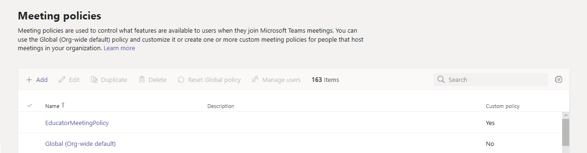

# <a name="assign-policies-to-large-sets-of-users-in-your-school"></a>Asignar directivas a grandes conjuntos de usuarios de la escuela

¿Necesita dar acceso a las diferentes características de Microsoft Teams a sus alumnos y educadores? Puede identificar rápidamente los usuarios de su organización por tipo de licencia y, a continuación, asignarles la Directiva adecuada. En este tutorial se muestra cómo usar la [asignación de directivas por lotes](assign-policies.md#assign-a-policy-to-a-batch-of-users) para asignar una directiva de reunión a los usuarios de forma masiva.

Recuerde que en Teams, los usuarios obtienen automáticamente la directiva global (opción predeterminada para toda la organización) para un tipo de directiva de Teams, a menos que cree y asigne una directiva personalizada. Como la población de alumnos suele ser el mayor conjunto de usuarios y a menudo reciben la configuración más restrictiva, le recomendamos que haga lo siguiente:

- Edite y aplique la directiva global (valor predeterminado de la organización) para restringir las capacidades de los alumnos. 
- Crear una directiva personalizada que permita capacidades básicas, como la programación privada de chats y reuniones, y la asignación de la Directiva a su personal y educadores.

Tenga en cuenta que la directiva global se aplicará a todos los usuarios de su escuela hasta que cree una directiva personalizada y la asigne a su personal y educadores.

En este tutorial, los alumnos obtendrán la Directiva de reunión global y usamos PowerShell para asignar una directiva de reuniones personalizada denominada EducatorMeetingPolicy al personal y los educadores en bloque. Damos por hecho que ha modificado la directiva global para personalizar la configuración de la reunión de los alumnos y creado una directiva personalizada que define la experiencia de la reunión para el personal y los educadores.



Siga estos pasos para asignar una directiva de reunión personalizada al personal y educadores de forma masiva.

## <a name="connect-to-the-azure-ad-powershell-for-graph-module-and-the-teams-powershell-module"></a>Conectarse al módulo de Azure AD PowerShell para Graph y al módulo de PowerShell de Teams

Antes de realizar los pasos de este artículo, tendrá que instalar y conectarse con el módulo Azure AD PowerShell for Graph (para identificar a los usuarios por sus licencias asignadas) y el módulo Microsoft Teams PowerShell (para asignar las directivas a esos usuarios).

### <a name="install-and-connect-to-the-azure-ad-powershell-for-graph-module"></a>Instalar y conectarse al módulo de Azure AD PowerShell para Graph

Abra un símbolo del sistema de Windows PowerShell con privilegios elevados (ejecute Windows PowerShell como administrador) y, a continuación, ejecute lo siguiente para instalar el módulo Azure Active Directory PowerShell para Graph.

```powershell
Install-Module -Name AzureAD
```

Ejecute lo siguiente para conectarse a Azure AD.

```powershell
Connect-AzureAD
```

Cuando se le solicite, inicie sesión con sus credenciales de administrador.

Para obtener más información, vea [conectarse con el módulo Azure Active Directory PowerShell para Graph](https://docs.microsoft.com/office365/enterprise/powershell/connect-to-office-365-powershell#connect-with-the-azure-active-directory-powershell-for-graph-module).

### <a name="install-and-connect-to-the-microsoft-teams-powershell-module"></a>Instalar y conectarse al módulo de PowerShell de Microsoft Teams

Ejecute lo siguiente para instalar el [Módulo Microsoft Teams PowerShell](https://www.powershellgallery.com/packages/MicrosoftTeams). Asegúrese de instalar la versión 1.0.5 o posterior.

```powershell
Install-Module -Name MicrosoftTeams
```

Ejecute lo siguiente para conectarse a teams e iniciar una sesión.

```powershell
Connect-MicrosoftTeams
```
Cuando se le solicite, inicie sesión con las mismas credenciales de administrador que usó para conectarse a Azure AD.

## <a name="identify-your-users"></a>Identificar a los usuarios

En primer lugar, ejecute lo siguiente para identificar a su personal y educadores por tipo de licencia. Esto le indica qué SKU están en uso en su organización. A continuación, puede identificar el personal y los formadores que tienen una SKU de profesores asignados.

```powershell
Get-AzureAdSubscribedSku | Select-Object -Property SkuPartNumber,SkuId
```

Que devuelve:

```
SkuPartNumber      SkuId
-------------      -----
M365EDU_A5_FACULTY e97c048c-37a4-45fb-ab50-922fbf07a370
M365EDU_A5_STUDENT 46c119d4-0379-4a9d-85e4-97c66d3f909e
```

En este ejemplo, la salida muestra que el SkuId de la licencia del profesorado es "e97c048c-37a4-45FB-AB50-922fbf07a370".

> [!NOTE]
> Para ver una lista de SKU de educación e identificadores de SKU, consulte [educación SKU SKU](sku-reference-edu.md).

A continuación, ejecutamos lo siguiente para identificar los usuarios que tienen esta licencia y recopilar todas ellas.

```powershell
$faculty = Get-AzureADUser -All $true | Where-Object {($_.assignedLicenses).SkuId -contains "e97c048c-37a4-45fb-ab50-922fbf07a370"}
```

## <a name="assign-a-policy-in-bulk"></a>Asignar una directiva en masa

Ahora, asignamos las directivas apropiadas a usuarios de forma masiva. La cantidad máxima de usuarios para los que puede asignar o actualizar directivas es 20.000 a la vez. Por ejemplo, si tiene más de 20.000 de personal y educadores, tendrá que enviar varios lotes.

> [!IMPORTANT]
> Actualmente recomendamos que asigne directivas en lotes de usuarios de 5.000 a la vez. Durante estas horas de demanda aumentada, puede experimentar retrasos en los tiempos de procesamiento. Para minimizar el impacto de estos aumentos en los tiempos de procesamiento, le sugerimos que envíe tamaños de lotes más pequeños de hasta 5.000 usuarios y que envíe cada lote solo después de que se haya completado el anterior. El envío de lotes fuera del horario laboral normal también puede ayudar.

Ejecute lo siguiente para asignar la Directiva de reunión denominada EducatorMeetingPolicy a su personal y educadores.

```powershell
New-CsBatchPolicyAssignmentOperation -PolicyType TeamsMeetingPolicy -PolicyName EducatorMeetingPolicy -Identity $faculty.ObjectId
```

> [!NOTE]
> Para asignar un tipo de directiva diferente en masa, como TeamsMessagingPolicy, tendrá que cambiar ```PolicyType``` a la Directiva que está asignando y ```PolicyName``` al nombre de la Directiva.

## <a name="get-the-status-of-a-bulk-assignment"></a>Obtener el estado de una asignación masiva

Cada asignación en masa devuelve un identificador de operación, que puede usar para realizar un seguimiento del progreso de las asignaciones de directivas o para identificar los errores que puedan producirse. Por ejemplo, ejecute lo siguiente:

```powershell
Get-CsBatchPolicyAssignmentOperation -OperationId 3964004e-caa8-4eb4-b0d2-7dd2c8173c8c | fl
```

Para ver el estado de asignación de cada usuario en la operación por lotes, ejecute lo siguiente. Los detalles de cada usuario están en ```UserState``` la propiedad.

```powershell
Get-CsBatchPolicyAssignmentOperation -OperationId 3964004e-caa8-4eb4-b0d2-7dd2c8173c8c | Select -ExpandProperty UserState
```

## <a name="assign-a-policy-in-bulk-if-you-have-more-than-20000-users"></a>Asignar una directiva de forma masiva si tiene más de 20.000 usuarios

En primer lugar, ejecute lo siguiente para ver cuánto personal y educadores tiene:

```powershell
$faculty.count
```

En lugar de proporcionar la lista completa de identificadores de usuario, ejecute lo siguiente para especificar el primer 20.000, después, el siguiente 20.000, etc.

```powershell
New-CsBatchPolicyAssignmentOperation -PolicyType TeamsMeetingPolicy -PolicyName EducatorMeetingPolicy -Identity $faculty[0..19999].ObjectId
```

Puede cambiar el intervalo de identificadores de usuario hasta que llegue a la lista completa de usuarios. Por ejemplo, escriba ```$faculty[0..19999``` para el primer lote, use ```$faculty[20000..39999``` para el segundo lote, especifique ```$faculty[40000..59999``` el tercer lote, y así sucesivamente.

## <a name="get-the-policies-assigned-to-a-user"></a>Obtener las directivas asignadas a un usuario

Ejecute lo siguiente para ver todas las directivas que se han asignado a un usuario específico. En el ejemplo siguiente se muestra cómo obtener las directivas que se asignan a hannah@contoso.com.

```powershell
Get-CsUserPolicyAssignment -Identity hannah@contoso.com
```

## <a name="faq"></a>Preguntas más frecuentes

**Quiero asegurarme de que todos los usuarios que son estudiantes, personal y educadores obtengan automáticamente las directivas asignadas. ¿Cómo puedo hacerlo?**

El equipo de producto de Teams está trabajando para asignar directivas a grupos de seguridad. En ese momento, podrá crear grupos para los estudiantes y los profesores, y después las directivas correspondientes a esos grupos. Tenga en cuenta que las asignaciones explícitas de usuarios (como las directivas que haya asignado con este tutorial) invalidarán las directivas heredadas de un grupo. Cuando esta característica sea compatible, proporcionaremos más instrucciones sobre cómo usar la asignación de directivas para agrupar y actualizar los usuarios para asegurarse de que obtengan las directivas de grupo heredadas.

**No estoy familiarizado con PowerShell para Teams. ¿Dónde puedo obtener más información?**

Consulte [información general de Teams PowerShell](teams-powershell-overview.md).

## <a name="related-topics"></a>Temas relacionados

- [Asignar directivas a los usuarios](assign-policies.md)
- [Nuevo: CsBatchPolicyAssignmentOperation](https://docs.microsoft.com/powershell/module/teams/new-csbatchpolicyassignmentoperation)
- [Get-CsBatchPolicyAssignmentOperation](https://docs.microsoft.com/powershell/module/teams/get-csbatchpolicyassignmentoperation)
- [Get-CsUserPolicyAssignment](https://docs.microsoft.com/powershell/module/teams/get-csuserpolicyassignment)
