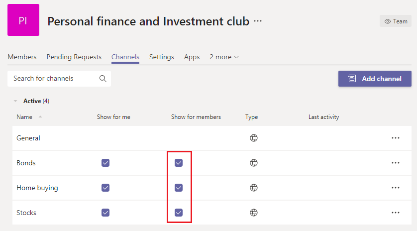

Administrar equipos grandes en Microsoft Teams: procedimientos recomendados
======================================================

Microsoft Teams es igualmente eficaz para facilitar las comunicaciones entre grupos pequeños con decenas de miembros y grupos grandes con miles de miembros. Revise [Los límites y especificaciones de Teams para](limits-specifications-teams.md) obtener actualizaciones sobre el tamaño de los equipos. El aumento del tamaño del equipo lleva a desafíos operativos y de administración únicos. En este artículo se describen los procedimientos recomendados para crear y administrar equipos grandes compuestos por miles de miembros.

## Valor de los equipos grandes

Los equipos grandes son muy útiles para habilitar los siguientes escenarios de colaboración:

- **Colaboración** en todo el departamento: si su organización tiene varios departamentos, como Finanzas, Operaciones, R&D, etc., puede crear un único equipo que incluya a todos los miembros de un departamento específico. Ahora todas las comunicaciones relevantes para un departamento se pueden compartir en este equipo, lo que facilita el acceso instantáneo y la participación de los miembros.

- **Colaboración en grupos de recursos de** empleados: las organizaciones suelen tener grandes grupos de personas con intereses mutuos que pertenecen a un departamento o grupo de trabajo diferente. Como ejemplo, puede haber un grupo de personas que comparten una pasión por las finanzas personales y la inversión. A menudo es difícil conectarse en una organización grande. Para desarrollar comunidades para estos grupos, los administradores de inquilinos pueden crear un equipo grande que actúa como un grupo de recursos de toda la empresa pública al que cualquier usuario puede unirse y aprovechar. Con el tiempo, estas comunidades recopilan información de la que pueden disfrutar tanto los miembros nuevos como los existentes.

- **Colaboración entre miembros** internos y externos: los productos populares a menudo desarrollan una comunidad de primeros usuarios que están ansiosos por probar nuevas versiones de productos y proporcionar comentarios. Los primeros usuarios desarrollan una relación con grupos de productos para ayudar a dar forma al producto. En estos escenarios, los administradores de inquilinos pueden configurar un equipo grande que incluya tanto grupos de productos internos como evaluadores de productos externos para facilitar un proceso de desarrollo de productos enriquecido. Estos equipos también pueden proporcionar asistencia al cliente a un conjunto selecto de clientes.

## Crear equipos a partir de grupos existentes

Use grupos de contactos, grupos de seguridad u grupos de Office para iniciar el equipo. Puede importar un grupo para crear un equipo o crear un equipo desde un grupo de Office.

**Importar un** grupo para crear un equipo: Al importar un grupo con hasta 3.500 miembros en Teams, Teams calcula automáticamente el número total de miembros del grupo. Se trata de una importación única y los cambios futuros en el grupo no se actualizarán automáticamente en Teams.

Crear un equipo a partir de un grupo grande de **Microsoft 365:** al crear un equipo a partir de  un gran grupo de Microsoft 365, los miembros forman parte automáticamente del grupo de Microsoft 365 y del equipo. En el futuro, a medida que los miembros del equipo se unen o abandonan el grupo de Microsoft 365, se agregan o quitan automáticamente del equipo.

## Importar, exportar o quitar miembros en masa en un equipo

Azure Portal permite a los usuarios importar, exportar o quitar miembros en masa en un grupo de Microsoft 365. Para obtener más información, vea [Importar en masa los miembros del grupo.](/azure/active-directory/enterprise-users/groups-bulk-import-members#to-bulk-import-group-members)

Como todos los equipos están con el respaldo de un grupo de Microsoft 365, puede usar Azure Portal para realizar estas operaciones en el grupo correspondiente al equipo. Las operaciones de miembro se reflejarán en el equipo en un plazo de 24 horas.

## Crear canales para enfocar los debates

Puede restringir las discusiones de grupo creando canales centrados. Vea [Procedimientos recomendados para organizar equipos.](best-practices-organizing.md)

## Restringir la creación de canales

Si se permite a cualquier miembro del equipo crear canales, ese equipo puede tener una expansión del canal. Los propietarios del equipo deben desactivar la creación, actualización, eliminación y restauración del canal para los miembros en Configuración **> permisos de miembro.** Vea [Información general sobre equipos y canales.](teams-channels-overview.md)

## Agregar canales favoritos

Para acelerar la nueva participación del usuario y la detección de contenido, puede seleccionar los canales favoritos que están disponibles para el usuario de forma predeterminada. En el **panel Canales** del centro de administración, compruebe los canales en la **columna Mostrar para** miembros.

 Vea [Crear los primeros equipos y canales para](get-started-with-teams-create-your-first-teams-and-channels.md) obtener más información.

## Regular aplicaciones y bots en equipos grandes

Para evitar la adición de aplicaciones o bots que distraigan, los propietarios de equipos pueden deshabilitar, agregar, quitar y cargar aplicaciones y conectores para los miembros del equipo. En el Centro de administración en **Configuración > permisos** de miembro, desactive las tres opciones que permiten a los miembros agregar aplicaciones o conectores.

Vea [Aplicaciones, bots, & conectores](deploy-apps-microsoft-teams-landing-page.md).

## Regular las menciones de equipo y canal

Las menciones de equipo y canal se pueden usar para llamar la atención de todo el equipo a determinadas publicaciones del canal. Una vez que se usa una mención en una publicación, se envía una notificación a miles de miembros del equipo. Si las notificaciones son demasiado frecuentes, los miembros del equipo pueden sobrecargarse y pueden quejarse ante los propietarios del equipo. Para evitar las menciones de equipo o canal, desactive las menciones de equipo y canal para los miembros desactivando las casillas del panel Configuración **> @mentions** equipos.

## Considere la posibilidad de establecer la moderación en sus canales

Los propietarios de los equipos pueden activar la moderación de un canal para controlar quién puede iniciar nuevos mensajes y responder a los mensajes de ese canal. Cuando establezca la moderación, puede elegir a uno o más miembros del equipo para que sean moderadores. Los propietarios de equipos son moderadores de forma predeterminada. Para obtener más información, vea [Configurar y administrar la moderación del canal.](manage-channel-moderation-in-teams.md)

## Temas relacionados

- [Procedimientos recomendados para organizar Teams](best-practices-organizing.md)
- [Crear un equipo para toda la organización](create-an-org-wide-team.md)