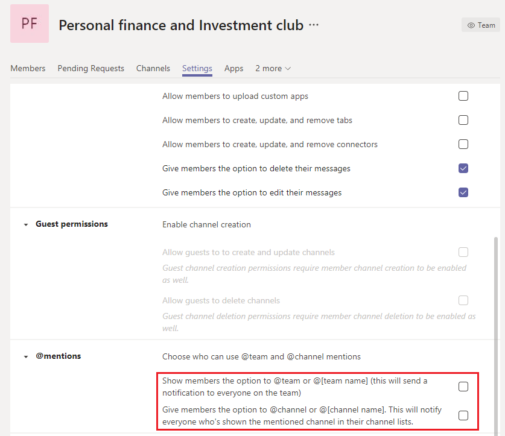

Administrar equipos grandes en Microsoft Teams: procedimientos recomendadosManage large teams in Microsoft Teams - Best practices
======================================================

Microsoft Teams es igualmente eficaz para facilitar las comunicaciones entre grupos pequeños con docenas de miembros y grupos grandes con miles de miembros.Microsoft Teams is equally effective at facilitating communications between small groups with dozens of members and large groups with thousands of members. Revise [los límites y las especificaciones de Teams para](limits-specifications-teams.md) ver las actualizaciones de los tamaños de los equipos.Review [Limits and specifications for Teams](limits-specifications-teams.md) for updates on team sizes. Aumentar el tamaño del equipo lleva a desafíos de administración y funcionamiento únicos.Increase in team size leads to unique management and operational challenges. En este artículo se describen los procedimientos recomendados para crear y administrar equipos grandes formados por miles de miembros.This article describes best practices for creating and managing large teams comprised of thousands of members.

## Valor de los equipos grandesValue of large teams

Los equipos de gran tamaño son muy útiles para habilitar los siguientes escenarios de colaboración:Large teams are very useful in enabling the following collaboration scenarios:

- Colaboración para todo el **departamento:** si su organización tiene varios departamentos como Finanzas, Operaciones, R&D, etc., puede crear un único equipo que incluya todos los miembros de un departamento específico.**Department-wide collaboration**: If your organization has multiple departments such as Finance, Operations, R&D etc., then you can create a single team that includes all members in a specific department. Ahora se pueden compartir todas las comunicaciones relevantes para un departamento en este equipo, que facilita el acceso instantáneo y la participación de los miembros.Now all communications relevant to a department can be shared in this team, which facilitates instant reach and engagement from members.

- **Colaboración en grupos de recursos de** empleados: las organizaciones a menudo tienen grandes grupos de personas con intereses mutuos que pertenecen a un departamento o grupo de trabajo diferente.**Collaboration in employee resource groups**: Organizations often have large groups of people with mutual interests who belong to a different department or work group. Como ejemplo, puede haber un grupo de personas que comparten una pasión por las finanzas personales y la inversión.As an example, there can be a group of people who share a passion for personal finance and investing. En muchas ocasiones, resulta difícil conectarse en una organización grande.It's often hard to connect in a large organization. Para desarrollar comunidades para estos grupos, los administradores de inquilinos pueden crear un gran equipo que actúa como un grupo de recursos para toda la empresa pública al que cualquier persona puede unirse y aprovechar.To develop communities for such groups, tenant admins can create a large team that serves as a public company-wide resource group that anyone can join and take advantage of. Finalmente, estas comunidades recopilan información que pueden disfrutar tanto los miembros nuevos como los existentes.Eventually, these communities collect information that both new and existing members can enjoy.

- **Colaboración entre miembros internos** y externos: los productos más populares suelen desarrollar una comunidad de usuarios primeros que están ansiosos por probar la publicación de nuevos productos y proporcionar comentarios.**Collaboration between internal and external members**: Popular products often develop a community of early adopters who are eager to try new product releases and provide feedback. Los primeros usuarios desarrollan una relación con los grupos de productos para ayudar a dar forma al producto.Early adopters develop a relationship with product groups to help shape the product. En estos escenarios, los administradores de inquilinos pueden configurar un gran equipo que incluya grupos de productos internos y evaluadores de productos externos para facilitar un proceso de desarrollo de productos enriquecidos.In such scenarios, tenant admins can set up a large team which includes both internal product groups and external product evaluators to facilitate a rich product development process. Estos equipos también pueden proporcionar asistencia al cliente a un conjunto selecto de clientes.These teams can also provide customer support to a select set of customers.

## Crear equipos a partir de grupos existentesCreate teams from existing groups

Use grupos de contactos, grupos de seguridad o grupos de Office para iniciar su equipo.Use contact groups, security groups, or Office groups to jump start your team. Puede importar un grupo para crear un equipo o un equipo desde un grupo de Office.You can import a group to make a team or create a team from an Office group.

**Importar un grupo** para crear un equipo: Al importar un grupo con hasta 3500 miembros a Teams, Teams calcula automáticamente el número total de miembros en el grupo.**Import a group to make a team**: When you import a group with up to 3,500 members into Teams, Teams automatically calculates the total number of members in the group. Se trata de una importación única y los cambios futuros en el grupo no se actualizarán automáticamente en Teams.This is a one-time import only and future changes in the group will not automatically be updated in Teams.

Crear un equipo a partir de un grupo grande de **Microsoft 365:** al crear un equipo desde un grupo  grande de Microsoft 365, los miembros forman automáticamente parte del grupo de Microsoft 365 y del equipo.**Create a team from a large Microsoft 365 group**: When you create a team from a large Microsoft 365 group, members are automatically part of the Microsoft 365 group **and** the team. En el futuro, a medida que los miembros del equipo se unan o abandonen el grupo de Microsoft 365, se agregarán o quitarán automáticamente del equipo.In the future, as team members join or leave the Microsoft 365 group, they're automatically added or removed from the team.

## Crear canales para enfocar los debatesCreate channels to focus discussions

Puede restringir las discusiones de grupo creando canales centrados.You can narrow the group discussions by creating focused channels. Consulte [Procedimientos recomendados para organizar equipos.](best-practices-organizing.md)See [Best practices for organizing teams](best-practices-organizing.md).

## Restringir la creación de canalesRestrict channel creation

Si cualquier miembro del equipo puede crear canales, ese equipo puede tener acceso a canal.If any team member is allowed to create channels, that team can have channel sprawl. Los propietarios del equipo deben desactivar la creación, actualización, eliminación y restauración de canales de los miembros en **Configuración > de miembro.**Team owners should turn off channel create, update, delete, and restore for members in **Settings > Member permissions**. Consulte [Información general de los equipos y canales.](teams-channels-overview.md)See [Overview of teams and channels](teams-channels-overview.md).

## Agregar canales favoritosAdd favorite channels

Para acelerar la participación del nuevo usuario y el descubrimiento de contenido, puede seleccionar canales favoritos que están disponibles para el usuario de forma predeterminada.In order to speed up new user engagement and content discovery, you can select favorite channels that are available to the user by default. En el **panel Canales** del centro de administración, compruebe los canales en la **columna Mostrar para miembros.**In the **Channels** pane of the admin center, check the channels under the **Show for members** column.

 Consulte [Crear sus primeros equipos y canales](get-started-with-teams-create-your-first-teams-and-channels.md) para obtener más información.See [Create your first teams and channels](get-started-with-teams-create-your-first-teams-and-channels.md) for details.

## Regular las aplicaciones y los bots en equipos grandesRegulate applications and bots in large teams

Para evitar que se agreguen bots o aplicaciones que distraigan, los propietarios del equipo pueden deshabilitar, agregar, quitar y cargar aplicaciones y conectores para los miembros del equipo.To prevent addition of distracting applications or bots, team owners can disable, add, remove, and upload apps and connectors for team members. En el centro de administración, **en Configuración > de miembro,** desactive las tres opciones que permiten a los miembros agregar aplicaciones o conectores.In the admin center under **Settings > Member permissions**, uncheck the three options that allow members to add apps or connectors.

Vea [Aplicaciones, bots y & conectores.](deploy-apps-microsoft-teams-landing-page.md)See [Apps, bots, & connectors](deploy-apps-microsoft-teams-landing-page.md).

## Regular las menciones de equipos y canalesRegulate team and channel mentions

Las menciones de canales y equipos se pueden usar para llamar la atención de todo el equipo sobre determinadas publicaciones del canal.Team and channel mentions can be used to draw the attention of the whole team to certain channel posts. Una vez que se usa una mención en una publicación, se envía una notificación a miles de miembros del equipo.Once a mention is used in a post, a notification is sent to thousands of team members. Si las notificaciones son demasiado frecuentes, los miembros del equipo pueden sobrecargarse y podrían quejarse de los propietarios del equipo.If the notifications are too frequent, then team members can become overloaded and might complain to team owners. Para evitar las menciones de canal o equipo, desactive las menciones de canal y equipo para los miembros desactivando las casillas en el panel Configuración **> @mentions** teams.To prevent team or channel mentions, turn off team and channel mentions for members by unchecking the boxes in the teams **Settings > @mentions** pane.

## Considere la posibilidad de establecer la moderación en sus canalesConsider setting up moderation in your channels

Los propietarios de los equipos pueden activar la moderación de un canal para controlar quién puede iniciar nuevos mensajes y responder a los mensajes de ese canal.Team owners can turn on moderation for a channel to control who can start new posts and reply to posts in that channel. Cuando establezca la moderación, puede elegir a uno o más miembros del equipo para que sean moderadores.When you set up moderation, you can choose one or more team members to be moderators. De forma predeterminada, los propietarios de equipos son moderadores.Team owners are moderators by default. Para obtener más información, [vea Configurar y administrar la moderación de canales.](manage-channel-moderation-in-teams.md)For more information, see [Set up and manage channel moderation](manage-channel-moderation-in-teams.md).

## Temas relacionadosRelated topics

- [Procedimientos recomendados para organizar TeamsBest practices for organizing Teams](best-practices-organizing.md)
- [Crear un equipo para toda la organizaciónCreate an org-wide team](create-an-org-wide-team.md)
