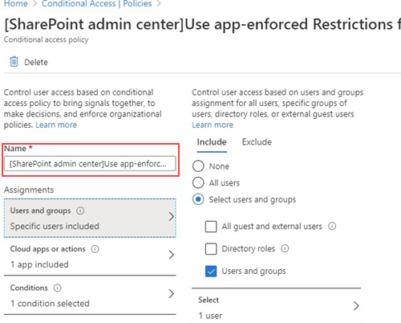

# Bloquear el acceso a SharePoint para usuarios específicosBlock access to SharePoint for specific users

Aplicar cualquier directiva de acceso condicional (CA) en SharePoint en Microsoft 365 también se aplica a teams.Applying any Conditional Access (CA) policy on SharePoint in Microsoft 365 is also applied to Teams. Sin embargo, algunas organizaciones desean bloquear el acceso a los archivos de SharePoint (cargar, descargar, ver, editar, crear) y permitir que sus empleados usen equipos de escritorio, dispositivos móviles y clientes Web en dispositivos no administrados.However, some organizations want to block access to SharePoint files (upload, download, view, edit, create) yet allow their employees to use Teams desktop, mobile, and web clients on unmanaged devices. En las reglas de directiva de la entidad emisora, el bloqueo de SharePoint también provocaría el bloqueo de Teams.Under the CA policy rules, blocking Sharepoint would lead to blocking Teams as well. En este artículo se explica cómo puede eludir esta limitación y permitir que los empleados sigan usando Teams mientras bloquean completamente el acceso a los archivos almacenados en SharePoint.This article explains how you can work around this limitation and allow your employees to continue using Teams while completely blocking access to files stored in SharePoint.

> [!Note]
> Bloquear o limitar el acceso a dispositivos no administrados depende de las directivas de acceso condicional de Azure AD.Blocking or limiting access on unmanaged devices relies on Azure AD conditional access policies. Más información sobre las [licencias de Azure ad](https://azure.microsoft.com/pricing/details/active-directory/).Learn about [Azure AD licensing](https://azure.microsoft.com/pricing/details/active-directory/). Para obtener información general sobre el acceso condicional en Azure AD, consulte [acceso condicional en Azure Active Directory](https://docs.microsoft.com/azure/active-directory/conditional-access/overview).For an overview of conditional access in Azure AD, see [Conditional access in Azure Active Directory](https://docs.microsoft.com/azure/active-directory/conditional-access/overview). Para obtener información sobre las directivas de acceso de SharePoint Online recomendadas, consulte [recomendaciones de directivas para proteger los sitios y archivos de SharePoint](https://docs.microsoft.com/microsoft-365/enterprise/sharepoint-file-access-policies).For info about recommended SharePoint Online access policies, see [Policy recommendations for securing SharePoint sites and files](https://docs.microsoft.com/microsoft-365/enterprise/sharepoint-file-access-policies). Si limita el acceso a los dispositivos no administrados, los usuarios de los dispositivos administrados deben usar una de las [combinaciones de sistema operativo y explorador compatibles](https://docs.microsoft.com/azure/active-directory/conditional-access/technical-reference#client-apps-condition), o bien también tendrán acceso limitado.If you limit access on unmanaged devices, users on managed devices must use one of the [supported OS and browser combinations](https://docs.microsoft.com/azure/active-directory/conditional-access/technical-reference#client-apps-condition), or they will also have limited access.

Puede bloquear o limitar el acceso a:You can block or limit access for:

- Usuarios de la organización o solo algunos usuarios o grupos de seguridad.Users in the organization or only some users or security groups.

- Todos los sitios de la organización o solo algunos sitios.All sites in the organization or only some sites.

Cuando se bloquea el acceso, los usuarios verán un mensaje de error.When access is blocked, users will see an error message. Bloquear el acceso ayuda a proporcionar seguridad y protege los datos seguros.Blocking access helps provide security and protects secure data. Cuando se bloquea el acceso, los usuarios verán un mensaje de error.When access is blocked, users will see an error message.

1. Abra el centro de administración de SharePoint.Open the SharePoint Admin Center.

2. Expanda directivas de acceso de **directivas**  >  **Access Policies**.Expand **Policies** > **Access Policies**.

3. En la sección **dispositivos no gestionados** , seleccione **Bloquear acceso** y seleccione **Guardar**.In the **Unmanaged Devices** section,  select **Block Access** and select **Save**.

   

4. Abra el portal de [Azure Active Directory](https://portal.azure.com/#blade/Microsoft_AAD_IAM/ConditionalAccessBlade/Policies) y vaya a **directivas de acceso condicional**.Open the [Azure Active Directory](https://portal.azure.com/#blade/Microsoft_AAD_IAM/ConditionalAccessBlade/Policies) portal and navigate to **Conditional Access Policies**.

    Verá que SharePoint ha creado una nueva Directiva similar a este ejemplo:You'll see a new policy has been created by SharePoint that's similar to this example:

    

5. Actualice la Directiva para destinar solo a usuarios específicos o a un grupo.Update the policy to target only specific users or a group.

    

  > [!Note]
> Al configurar esta Directiva, se cortará el acceso al portal de administración de SharePoint.Setting this policy will cut your access to the SharePoint admin portal. Le recomendamos que configure la Directiva de exclusión y seleccione los administradores globales y de SharePoint.We recommended that you configure the exclusion policy and select the Global and SharePoint admins.

6. Comprobar que solo SharePoint está seleccionado como aplicación de nube de destinoVerify that only SharePoint is selected as targeted Cloud App

    

7. Actualice **las condiciones** para incluir también los clientes de escritorio.Update **Conditions** to include desktop clients, as well.

    

8. Asegurarse de que **conceder acceso** está habilitadoMake sure that **Grant access** is enabled

    

9. Asegúrese de que está habilitada la opción **usar restricciones de aplicación** .Make sure **Use app enforced restrictions** is enabled.

10. Habilite la Directiva y seleccione **Guardar**.Enable your policy and select **Save**.

    

Para probar la Directiva, debe cerrar la sesión de cualquier cliente, como la aplicación de escritorio de Teams o el cliente de sincronización de OneDrive para la empresa, e iniciar sesión de nuevo para ver cómo funciona la Directiva.To test your policy, you need to sign out from any client such as the Teams desktop app or the OneDrive for Business sync client and sign in again to see the policy working. Si su acceso ha sido bloqueado, verá un mensaje en teams que indica que el elemento podría no existir.If your access has been blocked, you'll see a message in Teams that states the item might not exist.

 

En SharePoint, recibirá un mensaje de acceso denegado.In Sharepoint, you'll receive an access denied message.

## Temas relacionadosRelated topics

[Controlar el acceso a los dispositivos no administrados en SharePointControl access for unmanaged devices in SharePoint](https://docs.microsoft.com/sharepoint/control-access-from-unmanaged-devices)
