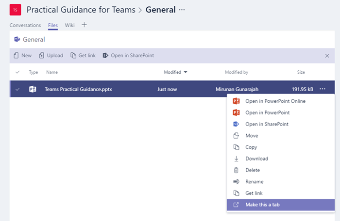
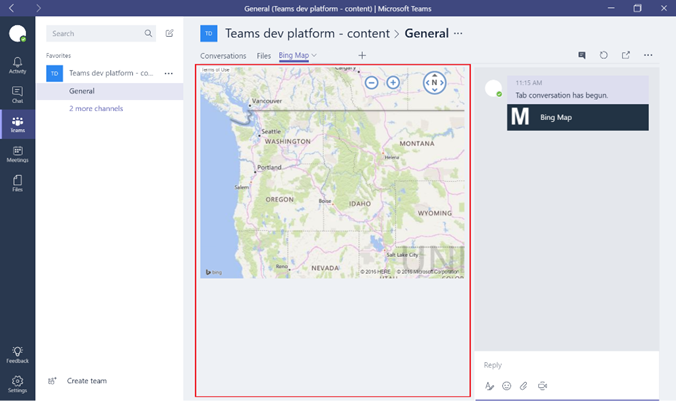

Usar fichas integradas y personalizadas en Microsoft Teams
==================================================

Las fichas permiten a los miembros del equipo acceder a servicios en un lienzo dedicado dentro de un canal. De esta forma, el equipo puede trabajar directamente con las herramientas y los datos que se le proporcionen, y tener conversaciones sobre ellos, dentro del contexto del canal. Con cada nuevo canal, se proporcionan dos fichas de manera predeterminada, como se muestra en la imagen de abajo:

-   Conversaciones

-   Archivos

1.  Los propietarios y los miembros del equipo pueden agregar fichas adicionales a cada canal para integrar mejor sus servicios en la nube.

2.  Los archivos de Excel, PowerPoint, Word y PDF deben cargarse en la ficha **Archivos** para poder convertirlos en fichas. Si lo prefiere, puede convertir en ficha cualquier archivo existente que se haya cargado antes con un solo clic, como se muestra abajo.

    

3.  Para agregar un sitio web, la URL debe empezar con el prefijo **https** para que cualquier información que se intercambie permanezca segura.

4.  Se proporcionan instrucciones detalladas cada vez que un miembro del equipo intenta agregar una ficha personalizada en su canal.

5.  Cuando se agrega una ficha personalizada a un canal, se crea una **conversación de ficha** que permite a los miembros del equipo tener conversaciones centradas en el contenido.

    

6.  Pueden agregarse fichas adicionales a los canales para ayudar a los usuarios a acceder fácilmente a los datos que necesitan y administrarlos, o interactuar con la mayoría de ellos. Puede ser un informe de Power BI, un panel o incluso un canal de vídeo de [Microsoft Stream](https://go.microsoft.com/fwlink/?linkid=855785) donde publicar vídeos de aprendizaje.

    

Desarrollar fichas personalizadas
-------------------

Además de las fichas integradas, las organizaciones pueden diseñar y desarrollar sus propias fichas de manera sencilla. Después podrán integrarlas en Microsoft Teams o compartirlas con la comunidad.

En Microsoft Developer Network se ofrecen [instrucciones detalladas](https://go.microsoft.com/fwlink/?linkid=855786) para diseñar y crear sus propias fichas. También puede descargar e implementar [fichas de muestra](https://go.microsoft.com/fwlink/?linkid=855787) desarrolladas por Microsoft.

