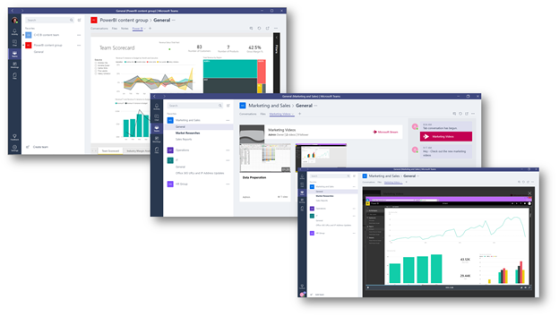

Usar fichas integradas y personalizadas en Microsoft TeamsUse built-in and custom tabs in Microsoft Teams
==================================================

Fichas permiten a los miembros del equipo tener acceso a servicios en un lienzo dedicado dentro de un canal o en un chat.Tabs allow team members to access services on a dedicated canvas within a channel or in a chat. Esto permite que el equipo a trabajar directamente con las herramientas y los datos y tener conversaciones sobre ellos en el contexto del canal o chat.This lets the team work directly with tools and data and have conversations about them in the context of the channel or chat. 

Los propietarios y los miembros del equipo pueden agregar pestañas adicionales a cada canal para integrar mejor sus servicios en la nube.Owners and team members can add tabs to a channel, private chat, and group chat to help integrate their cloud services. Se pueden agregar fichas para ayudar a los usuarios fácilmente obtener acceso y administrar los datos que necesita o interactúan con el mayor número.Tabs can be added to help users easily access and manage the data they need or interact with the most. Esto puede ser un informe de Power BI, un panel o incluso un canal de vídeo de [Secuencia de Microsoft](https://go.microsoft.com/fwlink/?linkid=855785) donde publicar vídeos de aprendizaje.This can be a Power BI report, a dashboard, or even a [Microsoft Stream](https://go.microsoft.com/fwlink/?linkid=855785) video channel where you publish training videos.

## Trabajar con fichasWork with tabs

- Con cada nuevo canal, dos fichas se aprovisionan de forma predeterminada: los archivos y las conversaciones.With every new channel, two tabs are provisioned by default: Conversations and Files. 

    
- Con cada chat privado, cuatro fichas se aprovisionan de forma predeterminada, las conversaciones, archivos, organización y actividad.With every private chat, four tabs are provisioned by default, Conversations, Files, Organization, and Activity.

    

- Los propietarios y los miembros del equipo pueden agregar más fichas a un canal o chat haciendo clic en **Agregar una ficha** Owners and team members can add more tabs to a channel or chat by clicking **Add a tab**  en la parte superior del canal o chat.at the top of the channel or chat.

- Archivos de Excel, PowerPoint, Word y PDF se deben cargar en la ficha **archivos** antes de que se pueden convertir a las fichas.Excel, PowerPoint, Word, and PDF files must be uploaded to the **Files** tab before they can be converted to tabs. Como alternativa, los archivos que se cargan existentes pueden convertirse a una ficha con un solo clic, tal y como se muestra a continuación.Alternatively, any existing uploaded file can be converted to a tab with a single click, as shown below.

    

- Para agregar un sitio Web, la dirección URL debe comenzar con un prefijo de **https** por lo que la información que se intercambia sigue siendo segura.To add a website, the URL must start with an **https** prefix so information that's exchanged remains secure.

- Cuando un miembro del equipo intenta agregar una ficha personalizada a su canal o chat, se proporcionan instrucciones detalladas.Detailed instructions are provided when a team member tries to add a custom tab to their channel or chat. Cuando se agrega una ficha personalizada a un canal, se crea una **conversación de ficha** que permite a los miembros del equipo se han centrado debates sobre el contenido.When a custom tab is added to a channel, a **Tab conversation** is created that allows team members to have focused discussions about the content.

    

## Desarrollar fichas personalizadasDevelop custom tabs

Además de las fichas integradas, se puede diseñar y desarrollar sus propias fichas para integrar a los equipos o compartir con el resto de la Comunidad.In addition to the built-in tabs, you can design and develop your own tabs to integrate to Teams or share with the rest of the community. Puede [controlar el acceso a la ficha personalizada](https://docs.microsoft.com/en-us/microsoftteams/platform/get-started/design#streamline-access) mediante la configuración de los grupos correspondientes de Office 365.You can [control access to your custom tab](https://docs.microsoft.com/en-us/microsoftteams/platform/get-started/design#streamline-access) by configuring the appropriate Office 365 Groups.

Microsoft Developer Network proporciona [instrucciones detalladas](https://go.microsoft.com/fwlink/?linkid=855786) para diseñar y crear sus propias fichas y [las fichas de ejemplo](https://go.microsoft.com/fwlink/?linkid=855787) desarrollado por Microsoft que puede descargar.The Microsoft Developer Network provides [detailed instructions](https://go.microsoft.com/fwlink/?linkid=855786) to design and build your own tabs and [sample tabs](https://go.microsoft.com/fwlink/?linkid=855787) developed by Microsoft that you can download.

---
